# Mem0（二开版）完整手册

> **📄 站点快照**：本页为仓库权威母本 `docs/quick-ref/mem0-manual.md` 的快照（快照时间 2026-09-19）。内容修订以母本为准；如与母本不一致，以母本为权威。

> **版本**: v1.1（由四份文档合并而成：接入手册 / 控制台用户文档 / 会话自动提交配置 / 工具速查表）
> **最后更新**: 2026-09-18
> **适用范围**: 本仓库二开自托管 mem0（本地 `127.0.0.1:8080/mcp`；远程 `192.168.110.169:8080/mcp`）。环境用 URL 区分，**MCP 服务名约定为 `mem0`**（以各 IDE 配置文件实际条目为准）
> **目标读者**: 快速上手的普通用户 → 深入配置/二次研究的管理员

**目录**

- 第一部分 系统概览与部署：[1.1 定位](#11-定位与核心能力) · [1.2 架构与端点](#12-系统架构与端点) · [1.3 部署](#13-部署) · [1.4 凭证与鉴权](#14-凭证与鉴权)
- 第二部分 AI 工具接入：[2.1 工具矩阵](#21-支持的-ai-开发工具) · [2.2 各工具配置](#22-各工具接入配置) · [2.3 MCP 工具清单](#23-mcp-工具清单与关键参数) · [2.4 跨工具共享](#24-跨工具共享记忆)
- 第三部分 控制台使用：[3.1 登录与导航](#31-登录与界面导航) · [3.2 功能页详解](#32-核心功能页详解)
- 第四部分 会话自动提交：[4.1 机制总览](#41-机制总览) · [4.2 一键落地（脚本）](#42-一键落地配置推荐mem0-setup-脚本) · [4.3 CodeBuddy 落地](#43-codebuddy-落地配置5-步) · [4.4 Qoder 落地](#44-qoder-落地配置5-步) · [4.5 Cursor 落地](#45-cursor-落地配置5-步) · [4.6 Codex CLI 与 IDE 落地](#46-codex-cli-与-ide-落地配置5-步) · [4.7 Claude Code 落地](#47-claude-code-落地配置5-步) · [4.8 其他工具 Rule 对照](#48-其他开发工具的-rule-文件对照) · [4.9 数据格式规范](#49-数据格式规范) · [4.10 触发时序与传输](#410-触发时序与传输链路)
- 第五部分 场景与运维：[5.1 典型场景](#51-典型使用场景) · [5.2 速查表](#52-工具与参数速查) · [5.3 验证与排错](#53-配置验证与故障排查) · [5.4 安全](#54-安全与权限注意事项) · [5.5 深入研究](#55-深入研究指引)
- [附录 A 最小配置速拷](#附录-a各工具最小可用配置速拷) · [附录 B 参数速取命令](#附录-b参数速取命令) · [附录 C 参考链接](#附录-c参考链接)

---

# 第一部分 系统概览与部署

## 1.1 定位与核心能力

本仓库 `mem0/`（子模块）是**二次开发版** mem0，在官方开源版基础上扩展（官方开源版不含 MCP server，本仓库自研）：

- **自研 MCP server**：`mem0/server/mcp_server.py`（服务名 `mem0`，9 个工具，Streamable HTTP）
- **项目共享池**：`git_remote` 服务端解析为 `project_id`，团队记忆跨用户共享
- **原文留痕 / 会话转录**：`add_memory` 默认 `infer=False`，跳过 LLM 抽取；支持按轮提交与界面一致的完整执行转录（Deep Thinking + 工具调用 + 完成结果）
- **多租户鉴权**：`m0sk_` 按用户密钥 + `ADMIN_API_KEY` 引导管理员 + JWT 三通道
- **图记忆**：Neo4j 实体关系图谱，提供 `search_graph` / `get_all_graph` 检索工具
- **中文控制台**：多租户管理（用户/部门/项目）、供应商预设、图谱可视化

## 1.2 系统架构与端点

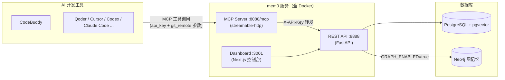

| 部署 | REST API | MCP（Streamable HTTP） | Dashboard |
|------|----------|------------------------|-----------|
| 本地开发 | `http://localhost:8888/docs` | `http://127.0.0.1:8080/mcp` | `http://localhost:3001` |
| 远程服务器 | `http://192.168.110.169:8888/docs` | `http://192.168.110.169:8080/mcp` | `http://192.168.110.169:3001` |

> ⚠️ 二开 MCP server **只支持 Streamable HTTP**（`mcp_server.py` 末行 `mcp.run(transport="streamable-http")`），客户端配置必须显式声明 `"transport": "streamable-http"`，缺失会导致工具无法挂载。

## 1.3 部署

两套部署均全 Docker 化（API + MCP 同容器，supervisord 拉起）。

**① 本地开发**

```bash
cd deploy/mem0
docker compose up -d          # mem0-api(8888/8080) + mem0-dashboard(3001)
```

依赖外部网络 `ai-sop-infra-network` 中的 `ai-sop-postgres-pgvector`（pgvector）与 `ai-sop-neo4j`（图记忆）。

**② 远程服务器**（`deploy/mem0/deploy.ps1`）

```powershell
.\deploy.ps1 -Dashboard        # 本地构建 api+dashboard 镜像 → docker save → pscp → 远程 load → compose up
.\deploy.ps1 -SkipBuild        # 镜像已在本地时跳过重建
```

远程采用**外部数据库模式**：Postgres(pgvector)/Neo4j 由 `.env` 指定（如 `192.168.100.80`），服务器上无 DB 容器；部署目录 `~/mem0-remote/`。

**远程 `.env` 关键项**（模板见 `deploy/mem0/remote/.env.example`）：

| 变量 | 说明 |
|------|------|
| `POSTGRES_HOST` / `NEO4J_URI` | 外部库地址 |
| `ADMIN_API_KEY` | 引导管理员密钥；**与本地 `.mem0/mem0.config.json` 的 `api_key` 设为同一把**，客户端即可免差异读写远程 |
| `AUTH_DISABLED=false` + `JWT_SECRET` | Dashboard 登录态；禁止对公网放开 |
| `DASHBOARD_URL`（compose 中 dashboard 服务） | **必须设为实际访问地址**，否则会话 cookie 带 `Secure` 被浏览器丢弃、登录后不跳转（§5.3） |
| `OPENAI_API_KEY` / `OPENAI_BASE_URL` | LLM/Embedder 兜底配置；实际供应商优先读共享库 `config_overrides`（Dashboard 配置页写入） |

**镜像构建注意**：`deploy/mem0/dashboard/Dockerfile` 已内置 `ARG NPM_REGISTRY=https://registry.npmmirror.com`（官方源在容器内 IPv6 不通），如需覆盖用 `--build-arg NPM_REGISTRY=...`。

## 1.4 凭证与鉴权

### 1.4.1 获取位置

| 方式 | 位置 |
|------|------|
| 控制台创建 | Dashboard 登录 → **API 密钥** 页创建；或管理员在 **用户** 页为成员签发 |
| 引导管理员 | 服务端 `.env` 直接配 `ADMIN_API_KEY`（无需 DB 记录，见 4.3） |

### 1.4.2 密钥格式与安全

- 格式：`m0sk_<43位随机串>`（服务端 `auth.py: generate_api_key()` 生成），按**用户**存储（bcrypt 哈希 + 前 12 位前缀索引）
- ⚠️ **密钥仅创建时完整可见一次**，立即哈希化存储；丢失只能重建并更新集成
- 密钥按**用户**隔离；项目范围由调用参数 `git_remote` / `project_id` 决定（非密钥决定）
- 密钥只放 git-ignored 的本地配置（本工程为 `.mem0/mem0.config.json`），禁止写进提交到仓库的文件

### 1.4.3 鉴权三通道（`mem0/server/auth.py`）

| 通道 | 传递方式 | 说明 |
|------|----------|------|
| **按用户 API Key**（推荐） | MCP 工具参数 `api_key` → REST `X-API-Key` 头 | 按前缀查 `api_keys` 表并 bcrypt 校验；普通用户被钉在自己 `user_id`，admin 可跨域 |
| **引导管理员 `ADMIN_API_KEY`** | X-API-Key 值等于该 env 即视为 admin | **无需 DB 记录**，启动即可用；MCP server 侧对应 env `MEM0_API_KEY`（工具调用不传 `api_key` 时的 fallback） |
| **JWT Bearer** | Dashboard 登录后的 access_token | 浏览器/脚本场景 |

> 实战要点：**本地与远程部署共用同一把 `m0sk_` 密钥时，必须把该密钥同时设为远程 `.env` 的 `ADMIN_API_KEY`**——按用户密钥存在各自数据库里，跨库不可迁移（§5.3 排查）。

---

# 第二部分 AI 开发工具接入（MCP）

## 2.1 支持的 AI 开发工具

| 工具 | 最低版本要求 | 快速配置方式 | 密钥传递方式 |
|------|--------------|--------------|--------------|
| **CodeBuddy IDE** | 当前稳定版 | Settings → MCP → Add MCP（JSON） | 工具调用参数 `api_key` |
| **Qoder** | 插件 **v2.5.0+**，智能体模式 | 个人设置 → MCP 服务（配置文件/表单） | 同上 |
| **Cursor** | 2024.10+ | `mcp-add` 一键 / 手动 `mcp.json` | 同上 |
| **Codex CLI** | 支持 `config.toml` MCP 的版本 | 手动编辑 `~/.codex/config.toml` | 同上 |
| **Claude Code / VS Code / Windsurf** | 支持 MCP 的版本 | `npx mcp-add` 批量 | 同上 |

**运行时依赖**：`npx mcp-add` 一键配置需要 Node.js ≥ 18；直接手写各工具配置文件则无额外依赖（二开 MCP server 由服务端容器运行，客户端零安装）。

> 关键差异：其他 MCP 生态通常在连接层传密钥（Header/OAuth），**二开版不需要**——连接配置只写 URL，`api_key` 在每次工具调用时作为参数传入（§2.3.2）。

## 2.2 各工具接入配置

以下配置二选一端点：本地 `http://127.0.0.1:8080/mcp`，远程 `http://192.168.110.169:8080/mcp`。

### 2.2.1 CodeBuddy IDE

**入口**：侧栏对话面板右上角 **CodeBuddy Settings** → **MCP** → **Add MCP**

```json
{
  "mcpServers": {
    "mem0": {
      "url": "http://127.0.0.1:8080/mcp",
      "transport": "streamable-http",
      "disabled": false
    }
  }
}
```

远程部署把 `url` 换为 `http://192.168.110.169:8080/mcp`（本工程实际配置，服务名 `mem0`）。

**验证**：MCP 列表绿色 → 让 Agent 说"记住我偏好 TypeScript"→ 再问"我的偏好是什么"能读回即通过。

### 2.2.2 Qoder

**前提**：插件 ≥ v2.5.0；**智能体模式**（问答模式无法调用 MCP）；最多同时 10 个 MCP 服务。

**入口**：右上角头像 → **个人设置** → **MCP 服务** → **"+"** → 配置文件添加：

```json
{
  "mcpServers": {
    "mem0": {
      "url": "http://127.0.0.1:8080/mcp",
      "transport": "streamable-http"
    }
  }
}
```

或表单方式：类型选 `SSE`/`HTTP`，服务地址填端点。Qoder 配置为**用户级全局**，跨工程跨 IDE 生效；二开版无需自定义 Header。

### 2.2.3 Cursor

**方式一：一键配置（需 Node.js 18+）**

```bash
npx mcp-add --name mem0 --type http \
  --url "http://127.0.0.1:8080/mcp" --clients "cursor"
```

**方式二：手动编辑** `~/.cursor/mcp.json`：

```json
{
  "mcpServers": {
    "mem0": {
      "type": "http",
      "url": "http://127.0.0.1:8080/mcp",
      "transport": "streamable-http"
    }
  }
}
```

### 2.2.4 Codex CLI

⚠️ `codex mcp add` 命令仅支持 stdio；HTTP 类型的 server **直接手写** `~/.codex/config.toml`：

```toml
[mcp_servers.mem0]
url = "http://127.0.0.1:8080/mcp"
```

服务名建议用 `mem0`（TOML 键名即服务名）。连接层无需任何密钥配置。

### 2.2.5 Claude Code / VS Code / Windsurf（批量一键）

```bash
npx mcp-add \
  --name mem0 \
  --type http \
  --url "http://127.0.0.1:8080/mcp" \
  --clients "claude code,cursor,windsurf,vscode,opencode"
```

Claude Desktop 无 `mcp-add`：Settings → Connectors → Add custom connector → 名称 `mem0`、URL 填端点，保存重启。

## 2.3 MCP 工具清单与关键参数

### 2.3.1 工具列表（二开 MCP server，共 9 个）

| 工具 | 功能 | 关键参数 |
|------|------|----------|
| `add_memory` | 存储记忆（默认原文留痕） | `text`✱、`api_key`✱、`git_remote`、`project_id`、`metadata`、`user_id`、`infer=False` |
| `search_memories` | 语义检索 | `query`✱、`api_key`✱、`git_remote`/`project_id`（跨用户池）、`user_id`、`top_k=5` |
| `get_memories` | 列表查询 | `api_key`✱、`git_remote`/`project_id`（拉跨用户共享池）、`limit=100` |
| `get_memory` | 单条读取 | `memory_id`✱、`api_key` |
| `update_memory` | 覆写文本 | `memory_id`✱、`text`✱、`api_key` |
| `delete_memory` | 删除单条 | `memory_id`✱、`api_key` |
| `search_graph` | 图记忆语义检索（实体关系三元组） | `query`✱、`api_key`✱、`git_remote`/`project_id`、`user_id`、`limit=25` |
| `get_all_graph` | 图记忆全量三元组 | `api_key`✱、`git_remote`/`project_id`、`user_id`、`limit=100` |
| `match_project` | git remote URL → project_id 解析 | `git_remote`✱、`api_key` |

> 无批量删除/审计类工具（`delete_all_memories` / `list_events` 等），此类需求走 REST API（`:8888/docs`）。

### 2.3.2 `add_memory` 关键参数详解

| 参数 | 默认 | 说明 |
|------|------|------|
| `text` | 必填 | 原始文本（支持整段对话记录） |
| `api_key` | 必填 | 用户标识 + 鉴权；服务端据此路由到 user/project |
| `user_id` | - | 仅 admin key 生效，显式指定归属用户 |
| `infer` | `False` | **`False` = 原文留痕存档（跳过 LLM 抽取，保留中文原文）；`True` = 让 Mem0 抽取事实要点**。会话归档用默认，提炼偏好用 `True` |
| `metadata` | - | 自定义键值对（如 `{"type":"fact","session_id":"cb-20260918-e5d21a"}`），检索与控制台过滤依赖它 |
| `git_remote` | - | 传 `git remote -v` 的 URL，服务端解析为 `project_id`，写入项目共享池 |
| `project_id` | - | 显式指定项目（与 `git_remote` 二选一） |

## 2.4 跨工具共享记忆

### 2.4.1 方案一：统一端点 + 统一密钥（最简单）

所有工具的 MCP 配置指向**同一个**二开端点，工具调用传**同一个** `api_key`，天然共享同一记忆空间。

### 2.4.2 方案二：项目共享池（git_remote 聚合，二开核心能力）

`git_remote` 服务端解析为 `project_id`（REST `POST /projects/match`，MCP 工具 `match_project`）：团队内各成员以**各自的** `api_key` 写入，带相同 `git_remote` 的记忆进入**项目共享池**；`search_memories` / `get_memories` 带 `git_remote` 时跨用户检索整池。

**服务端行为细节**：

- 写入时服务端把 `git_remote` 解析成 `project_id` 并写进 memory 的 `metadata`（连同 `department_id`）
- 写入与读取**都**支持 `git_remote` / `project_id` 二选一
- 权限：admin 密钥可读写整池；普通用户的 `search`/`get` 带 `git_remote` 同样可读池（跨用户），但**写入**仍归属其自身
- 会话归档按 `metadata.session_id` 分组、`turn_seq`/`created_at` 排序（控制台与 Dashboard 均支持）

### 2.4.3 客户端配置差异对照

| 维度 | CodeBuddy | Qoder | Cursor | Codex |
|------|-----------|-------|--------|-------|
| 配置文件 | Settings→MCP JSON | 个人设置→MCP JSON | `~/.cursor/mcp.json` | `~/.codex/config.toml`（TOML！） |
| 传输声明 | `"transport": "streamable-http"` | 同左（或表单选 SSE） | `"type": "http"` | 仅 `url` 键 |
| 密钥传递 | 工具调用参数（连接层零配置） | 同左 | 同左 | 同左 |
| 配置生效范围 | 用户级 | 用户级全局 | 用户级 | 用户级 |
| 服务命名建议 | `mem0` / `mem0` | `mem0` | `mem0` | `mem0` |

---

# 第三部分 控制台（Dashboard）使用

## 3.1 登录与界面导航

1. 浏览器打开 http://192.168.110.169:3001/
2. 未登录自动跳转登录页，输入邮箱与密码（账号由管理员在 **用户** 页创建；首个账号由 `/setup` 初始化向导生成）

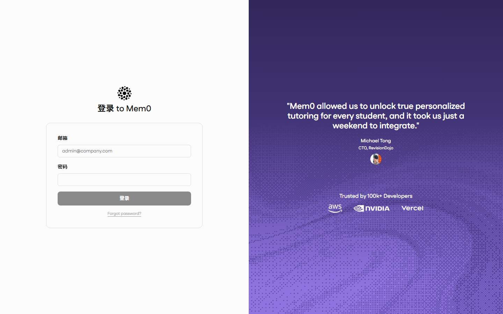

> 登录态由 httpOnly Cookie `mem0_refresh_token` 维持 30 天。若部署地址变更（域名/协议），需同步更新服务端 `DASHBOARD_URL`，否则会出现"登录成功但不跳转"（§5.3）。

**侧边栏分四组，菜单按角色过滤**（非 admin 用户只看到无标记项）：

| 分组 | 菜单 | 路径 | 权限 | 用途 |
|------|------|------|------|------|
| **SETUP** | 接入 | `/dashboard/get-started` | 所有人 | MCP/Python/cURL 接入代码片段 |
| | 调试沙盒 | `/dashboard/playground` | 所有人 | 免代码增删查记忆 |
| | API 密钥 | `/dashboard/api-keys` | 所有人 | 创建/查看自己的 `m0sk_` 密钥 |
| **ACTIVITY** | 总览 | `/dashboard/overview` | admin | 用量统计图表 |
| | 请求 | `/dashboard/requests` | admin | 全量 API 调用日志 |
| | 实体 | `/dashboard/entities` | 所有人 | user/agent/run 维度聚合 |
| | 图谱 | `/dashboard/graph` | admin | 知识图谱可视化 |
| | 记忆 | `/dashboard/memories` | 所有人 | 记忆主列表（核心页面） |
| | Webhook | `/dashboard/webhooks` | admin | 记忆变更事件推送 |
| | 导出 | `/dashboard/memory-exports` | admin | 记忆批量导出 |
| **TENANT** | 用户 / 部门 / 项目 | `/dashboard/users` 等 | admin | 多租户管理 |
| **ACCOUNT** | 配置 | `/dashboard/configuration` | admin | LLM/Embedder 供应商配置 |
| | 设置 | `/dashboard/settings` | 所有人 | 个人资料/密码/语言 |

侧边栏底部还有 **项目上下文选择器**（admin 可见）：切换后记忆类页面的数据范围随之变化，"全部项目" = 跨项目查看。

## 3.2 核心功能页详解

### 3.2.1 记忆管理（Memories）——最常用页面

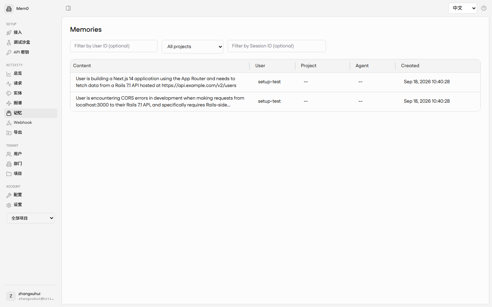

- **列表列**：Content（记忆原文）、User（归属用户）、Project（所属项目）、Agent、Created
- **三个过滤器**：
  - **Filter by User ID**：按用户筛选
  - **项目下拉**：按项目筛选（与侧边栏底部项目上下文联动）
  - **Filter by Session ID**：按会话 ID 筛选——**回放某次 AI 会话的完整留痕**就靠它（`session_id` 格式 `cb-<YYYYMMDD>-<6位hex>`）
- **单条操作**：展开查看完整内容与 metadata；支持删除单条
- **Q/A 两栏显示**：Agent 留痕的记忆文本格式为 `Q: <提问>\n\nA: <回答转录>`，详情面板按标记切分展示

### 3.2.2 调试沙盒（Playground）

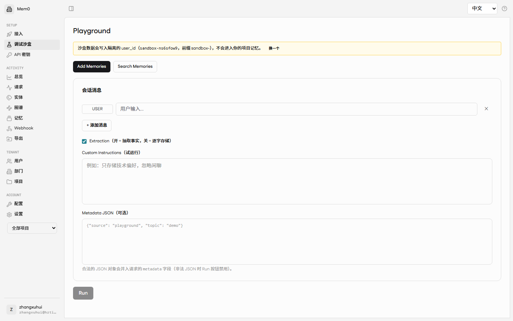

浏览器内直接调用后端记忆能力，用于**验证密钥与配置是否工作**：添加记忆（可加 metadata）、语义搜索。典型用法：创建新 API Key 后，add 一条测试记忆再 search 回来，确认整条链路通。

### 3.2.3 API 密钥（API Keys）

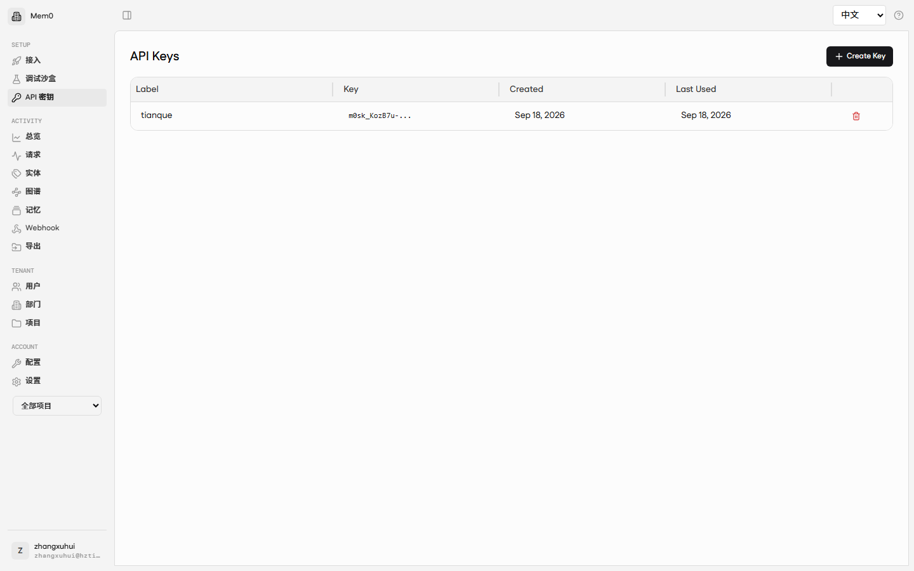

创建带备注的 `m0sk_` 密钥，**仅创建时完整显示一次**（只保存 key_prefix）。该密钥即 AI 工具调用 MCP 时的 `api_key` 参数 / REST 的 `X-API-Key` 头。

### 3.2.4 接入指引（Get Started）

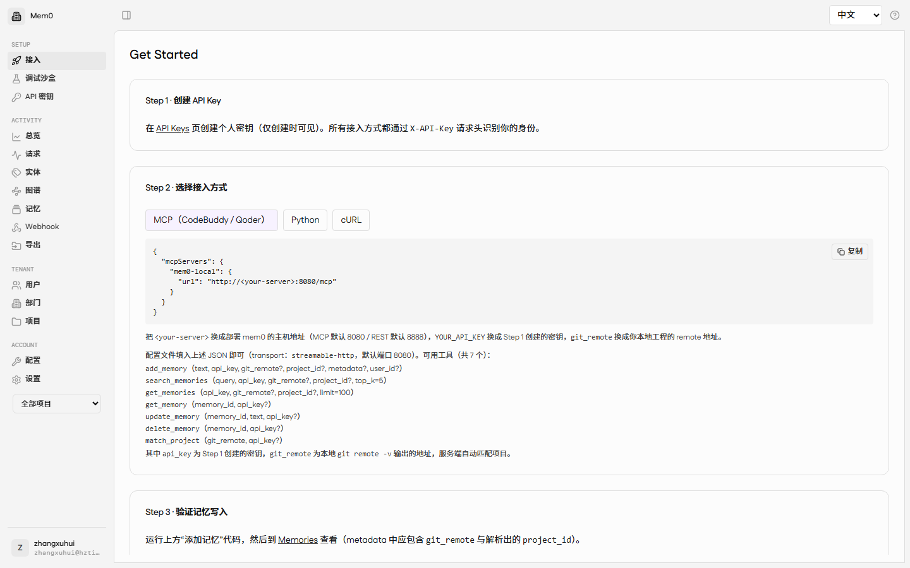

三个标签页给出可直接复制的接入代码：**MCP（CodeBuddy / Qoder）**、**Python**、**cURL**。

### 3.2.5 请求日志（Requests）——审计与排错

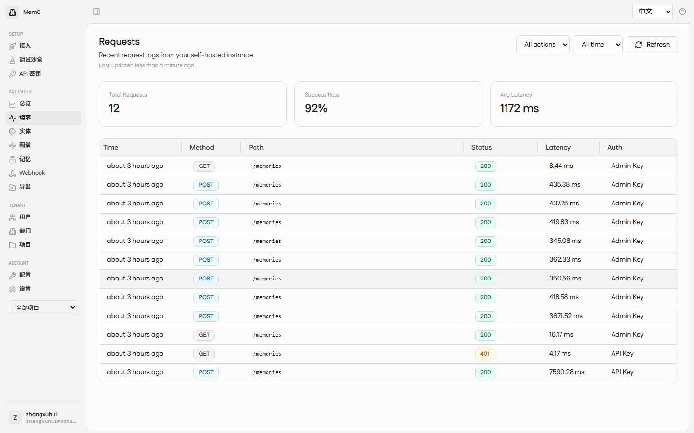

记录每次 API 调用：时间、方法、路径、动作类型（add / search / get_all）、耗时、状态；按动作类型与时间范围筛选。用途：确认 Agent 是否真的在调用记忆（"为什么没记住？"先来这里看）。

### 3.2.6 总览（Overview）

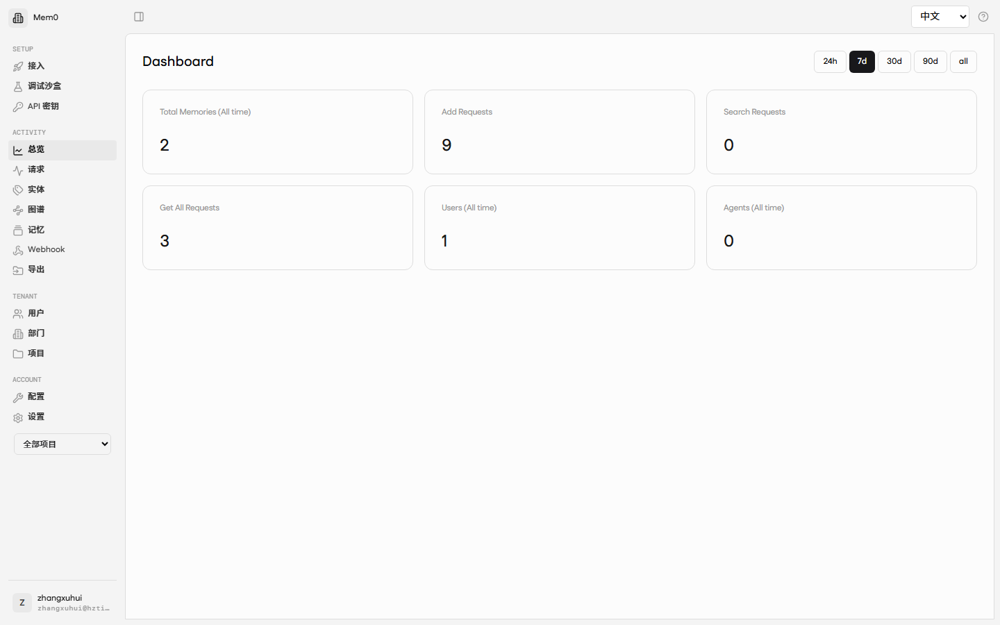

用量统计图表（记忆总量、请求趋势等），用于运维巡检与容量观察。

### 3.2.7 图谱（Graph）——知识图谱可视化

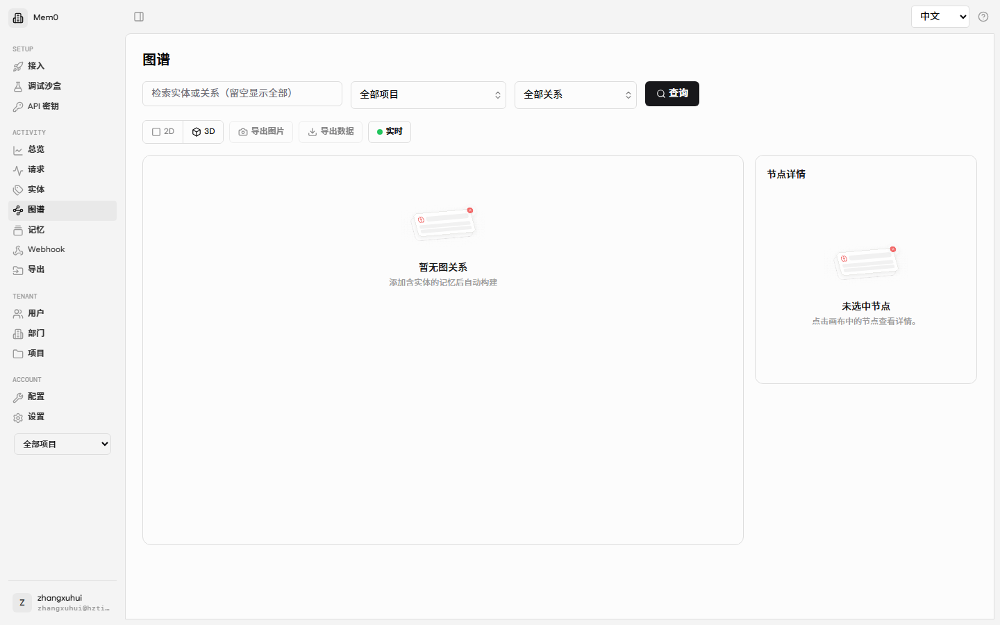

- **构建机制**：`GRAPH_ENABLED=true` 时，写入的记忆经 LLM 抽取实体关系三元组存入 Neo4j，"添加含实体的记忆后自动构建"
- **操作**：顶部检索框查实体/关系；项目/关系类型过滤；**2D/3D** 切换；**实时** 开关；**导出图片 / 导出数据**
- **节点详情**：点击画布节点，右侧显示实体属性与关联关系；节点按类型着色（用户/模块/服务/API/数据模型/需求…）
- 空状态提示"暂无图谱关系"属正常——需先写入含实体的记忆

### 3.2.8 实体（Entities）

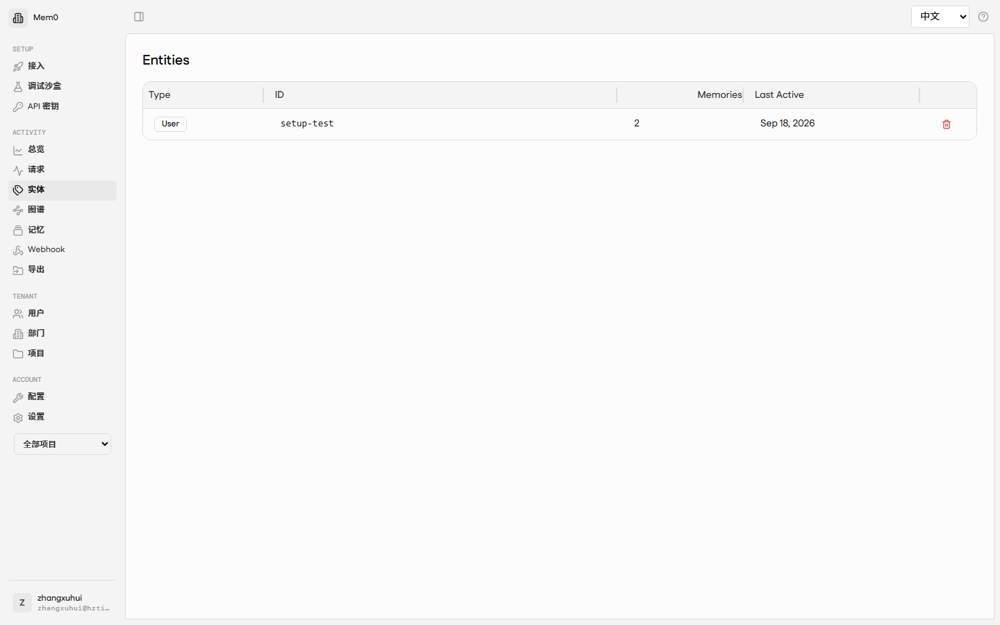

按 user / agent / run 维度聚合的记忆统计（Type、ID、Memories 数、Last Active）。

### 3.2.9 Webhook 与导出

**Webhook**（admin）：订阅 `memory_added` / `memory_updated` / `memory_deleted` 三类事件，推送到指定 URL——用于记忆变更联动。

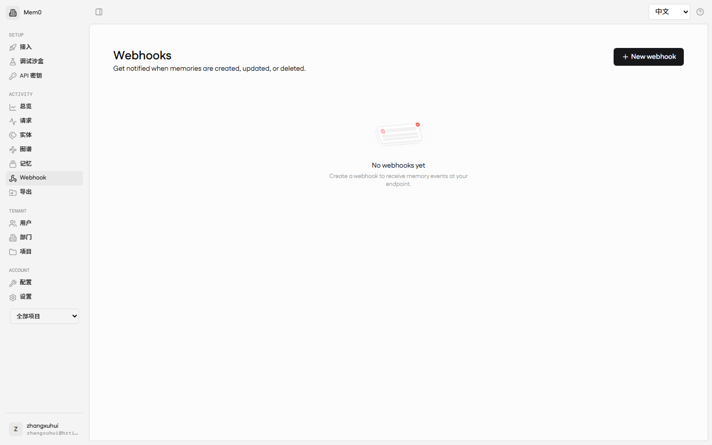

**导出**（admin）：批量导出记忆数据。

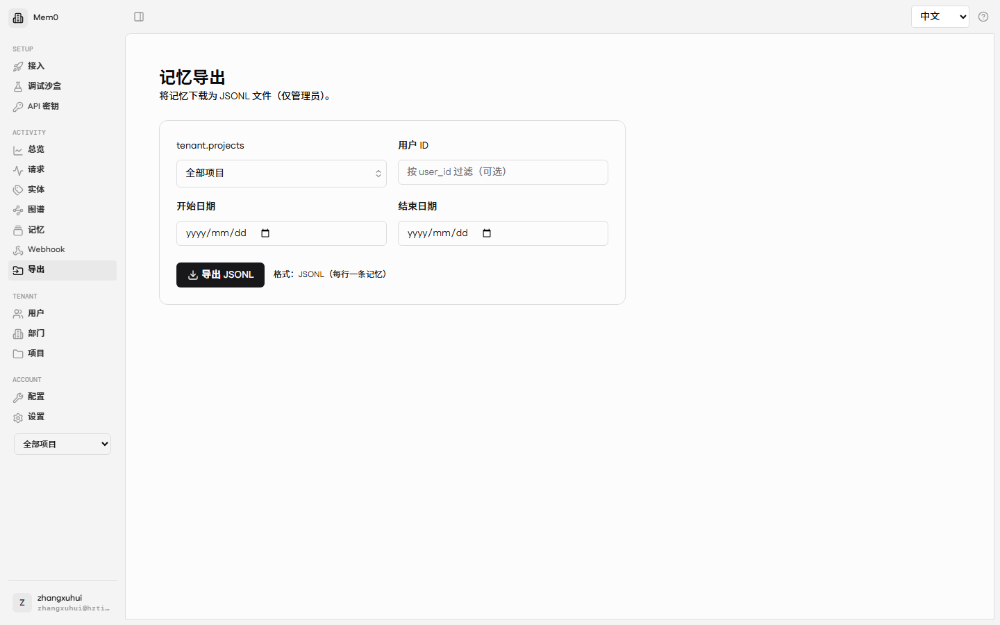

### 3.2.10 模型配置（Configuration）——控制"记性好不好"的开关

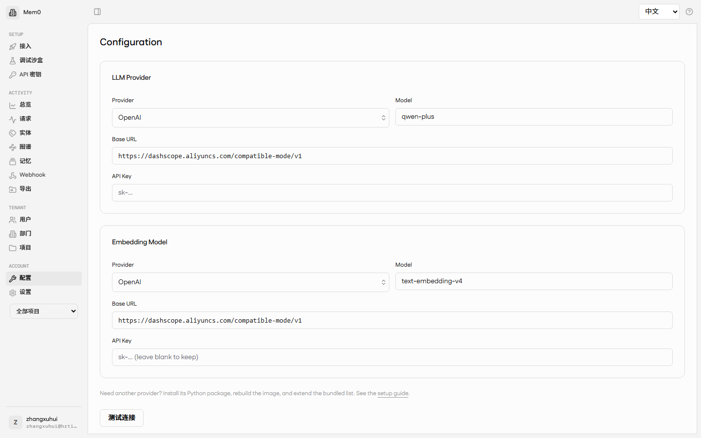

配置记忆处理所用的 **LLM**（抽取/改写）与 **Embedder**（向量化）：

- **供应商预设**一键预填（`base_url` + 默认模型）：OpenAI / **阿里云百炼** / DeepSeek / Anthropic / Gemini / Ollama / vLLM / LM Studio / 自定义 OpenAI 兼容
- 本地预设（Ollama 等）API Key 允许留空；容器内访问宿主机模型用 `host.docker.internal`
- 保存后配置持久化到数据库 `config_overrides`，**优先级高于服务端 `.env` 默认值**——改这里即时生效，无需重启容器
- ⚠️ 换 Embedder 模型会改变向量维度，须与 pgvector 列维度一致（历史上踩过 1024 vs 1536 坑）

### 3.2.11 多租户管理（TENANT，admin）

**用户**（`/dashboard/users`）：创建成员、分配角色（admin / user）、为用户创建 API Key、重置密码。

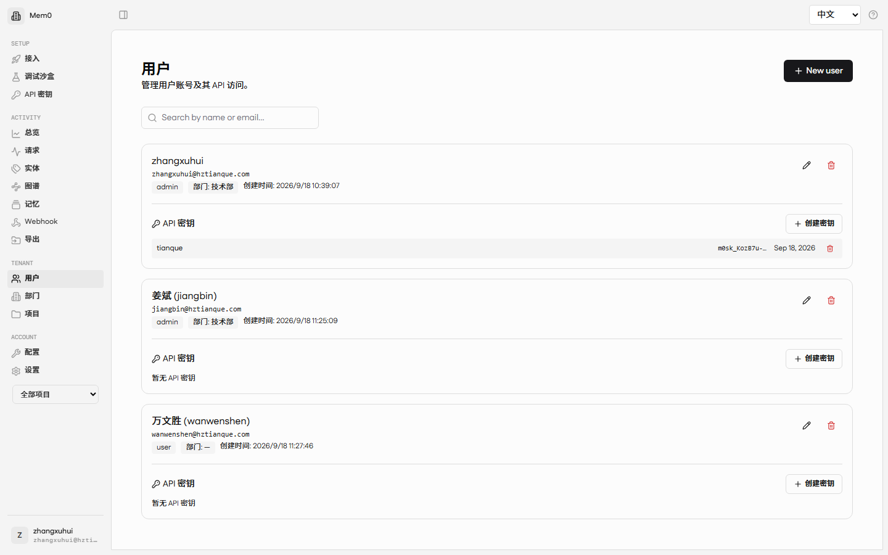

**项目**（`/dashboard/projects`）：管理项目池。项目可由服务端从 `git_remote` 自动解析创建，也可手工登记。

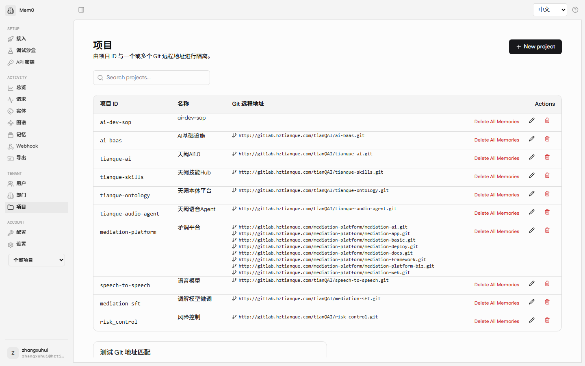

**部门**（`/dashboard/departments`）：组织维度分组（`department_id` 写入记忆 metadata）。

**角色权限矩阵**：

| 能力 | user | admin |
|------|------|-------|
| Memories / Entities / Playground / API Keys / Settings | ✅ | ✅ |
| Overview / Requests / Graph / Webhooks / Exports | ❌ | ✅ |
| Users / Departments / Projects / Configuration | ❌ | ✅ |
| 跨用户读写项目共享池（带 git_remote/project_id） | 读✅ 写归自己 | ✅ |

### 3.2.12 个人设置（Settings）

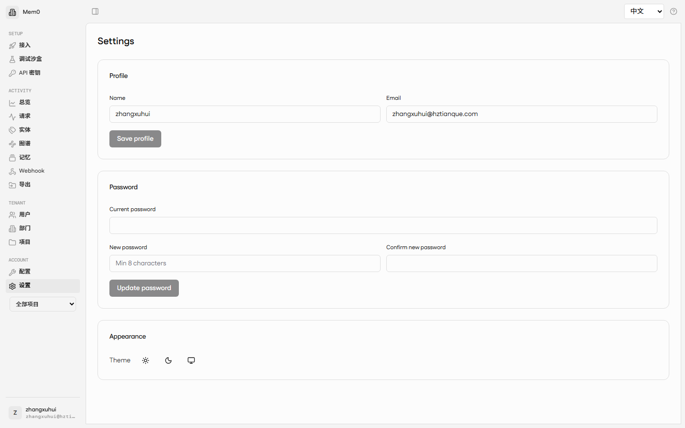

修改昵称与密码（留空密码项则不修改）、切换界面语言。**改密后其他已登录会话仍有效直至过期**；忘记密码由 admin 在用户页重置，或服务端执行 `make reset-admin-password`。

---

# 第四部分 会话内容自动提交（Rule 机制）

## 4.1 机制总览

MCP 配置只解决"Agent **能**调用记忆工具"；要让会话内容**自动**提交，靠的是 **Agent 规则文件**（CodeBuddy 下即仓库根 `CODEBUDDY.md`）：Agent 每次会话自动读取其中的指令，按指令在固定时机调用 `add_memory`。

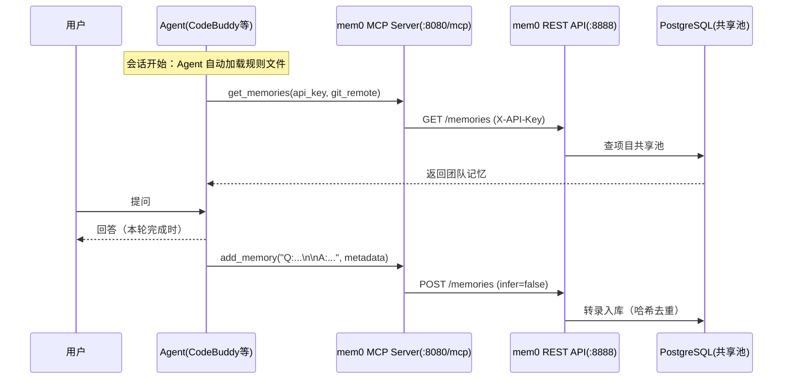

**三类触发条件**（由规则文件约定，缺一不可）：

| # | 触发时机 | 动作 | metadata.type |
|---|----------|------|---------------|
| ① | **会话开始**（每会话一次，主动执行） | `get_memories` 拉取项目共享池 + 召回摘要 | —（只读） |
| ② | **每轮回复完成时**（固定触发，寒暄也入库） | `add_memory` 提交本轮完整执行转录 | `conversation` |
| ③ | **出现持久事实时**（决策/偏好/约束/人员） | `add_memory` 提炼事实 | `fact` / `decision` / `preference` / `note` |

## 4.2 一键落地配置（推荐：mem0-setup 脚本）

本章是**默认推荐路径**：§4.3–§4.7 的手工 5 步流程，均可用一条命令完成，并内置端到端校验。

### 4.2.1 一条命令

Windows（PowerShell）：

```powershell
cd <仓库根目录>
powershell -NoProfile -ExecutionPolicy Bypass -File scripts\mem0-setup.ps1
```

macOS / Linux / WSL：

```bash
cd <仓库根目录>
bash scripts/mem0-setup.sh
```

### 4.2.2 参数

| 作用 | PowerShell | bash | 说明 |
|------|-----------|------|------|
| 指定 IDE | `-Ide codebuddy,cursor,qoder,codex,claude` | `-i ...` | 缺省自动探测已安装 IDE |
| MCP 端点 | `-Url http://host:8080/mcp` | `-u ...` | 本地/远程**只用 URL 区分**，服务名恒为 `mem0` |
| REST 地址 | `-RestUrl http://host:8888` | `-s ...` | 校验用；缺省由 MCP URL 换端口为 8888 |
| API 密钥 | `-ApiKey m0sk_xxx` | `-k m0sk_xxx` | 缺省读环境变量 `MEM0_API_KEY`，再缺省自动打开 Dashboard 密钥页交互粘贴 |
| 目标仓库 | `-Repo <path>` | `-r <path>` | 缺省当前目录 |
| 预演 | `-DryRun` | `-n` | 只打印将写入的内容，不落盘、不写 REST |

### 4.2.3 脚本做了什么（对应手工 5 步）

1. **探测并写 MCP 配置**：扫描 `~/.codebuddy`、`~/.cursor`、`~/.qoder`、`~/.codex`、`~/.claude`；JSON 走**合并写**（保留你已有的其他 MCP 服务，如 Playwright/sqlbot），Codex 走 `config.toml` 的 `[mcp_servers.mem0]`；服务名统一 `mem0`，含 `transport: streamable-http`
2. **写规则文件**：读取 `scripts/templates/mem0-rules.md`，按 IDE 替换占位符后写入 `CODEBUDDY.md` / `.cursor/rules/mem0.mdc` / `.qoder/rules/mem0.md` / `AGENTS.md` / `CLAUDE.md`；已存在 `<!-- mem0:rules:begin -->` / `<!-- mem0:rules:end -->` 标记时**只替换区间**（重复运行安全）
3. **生成凭证文件** `<repo>/.mem0/mem0.config.json`：写入 api_key，并自动执行 `git remote get-url origin` 得到 `git_remote` / `project_id`（无 remote 时由目录名派生并提示）
4. **端到端校验**：MCP 端点存活（GET `/mcp` 返回 406）→ REST 写读往返（`:8888/memories`，`X-API-Key` 头）→ 测试记忆自动清理
5. **输出报告**：逐项 ✓/✗ + 失败项的精确修复指引

### 4.2.4 校验输出解读

| 输出 | 含义 | 处理 |
|------|------|------|
| `MCP 端点存活 … HTTP 406` | 端点正常（streamable-http 对 GET 的正常响应） | 无需处理 |
| `MCP 端点异常（HTTP 000 或其他）` | 服务未启动或 URL 错 | 启动 mem0（`install-all` / `deploy/mem0`）；远程确认 IP 与端口 |
| `REST 写入成功` + `REST 查回成功` | 密钥有效、链路闭环 | 无需处理 |
| `REST 写入失败（HTTP 401）` | 密钥无效或不属于该实例 | 到 Dashboard 重建密钥后重跑 |
| `REST 往返失败（无法连接）` | REST 端口不是 8888 | 用 `-RestUrl` / `-s` 指定实际 REST 地址 |

### 4.2.5 与手工流程的关系

- **新机器接入**：只用本章命令，然后重启 IDE
- **需要理解原理、IDE 装在非默认路径、或需特殊定制**：阅读 §4.3–§4.7 对应章节
- **配完仍不确定**：按 §5.3.1 校验清单 + §5.3.3 常见配置错误表逐项核对
## 4.3 CodeBuddy 落地配置（5 步）
> ⚡ **一键完成**：以上 5 步可由 `scripts/mem0-setup.ps1`（Windows）/ `scripts/mem0-setup.sh`（macOS·Linux）
> 一键完成，服务名自动约定为 `mem0` 并内置端到端校验（MCP 端点存活 + REST 密钥往返 + 配置语法回读）。
> 手工流程保留用于理解原理与特殊场景（一键用法见 §4.2）。

### Step 1：MCP 连接 —— `~/.codebuddy/mcp.json`（用户级）

```json
{
  "mcpServers": {
    "mem0": {
      "url": "http://127.0.0.1:8080/mcp",
      "transport": "streamable-http",
      "disabled": false
    }
  }
}
```

| 键 | 必填 | 说明 |
|----|------|------|
| `url` | ✅ | 二开 MCP 端点；远程换 `http://192.168.110.169:8080/mcp`（服务名可用 `mem0`） |
| `transport` | ✅ | **必须显式写 `streamable-http`**——缺失此字段会导致连接失败、工具不挂载（高频踩坑） |
| `disabled` | - | `false` 启用 |

### Step 2：凭证文件 —— `.mem0/mem0.config.json`（项目级，git-ignored）

规则文件要求 Agent"永远从配置读，不硬编码"，此文件是唯一凭证来源：

```json
{
  "_comment": "Local-only config for the mem0 MCP memory integration. GIT-IGNORED — do not commit (contains api_key).",
  "mcp_server": "mem0",
  "api_url_via_mcp": "http://127.0.0.1:8080/mcp",
  "api_key": "m0sk_你的完整密钥",
  "admin_user_id": "admin@mem0.dev",
  "project_id": "ai-dev-sop",
  "git_remote": "https://github.com/joezxh/ai-dev-sop.git",
  "metadata_defaults": {
    "source": "codebuddy",
    "type_enum": ["fact", "decision", "preference", "note"]
  },
  "roster": [
    { "user_id": "admin@mem0.dev", "name": "owner/admin", "role": "admin",
      "note": "Seed admin account. Add other project members here as they appear, with their mem0 user_id." }
  ],
  "load_on_session_start": true,
  "save_policy": "auto-on-durable-fact"
}
```

| 字段 | 用途 |
|------|------|
| `api_key` | `m0sk_` 密钥；每次工具调用作为 `api_key` 参数传入 |
| `git_remote` | `git remote -v` 的 URL；服务端解析为 `project_id` 并写入 metadata，绑定项目共享池 |
| `project_id` | 与 `git_remote` 等价的显式项目 ID（二选一，模板里两个都传更稳） |
| `admin_user_id` | admin 密钥下 `user_id` 参数的默认值（记忆主体） |
| `roster` | 团队成员花名册；新人首次出现时补入 |
| `load_on_session_start` | 声明"会话开始自动拉取" |
| `save_policy` | `auto-on-durable-fact`：持久事实出现即自动提交 |

### Step 3：.gitignore —— 防止密钥与会话 ID 入库

```gitignore
# mem0 本地凭证与会话标识（含密钥，禁止入库）
.mem0/mem0.config.json
.mem0/.session_id-cb
```

### Step 4：规则文件 —— 仓库根 `CODEBUDDY.md`（核心）

CodeBuddy 每次会话自动把仓库根 `CODEBUDDY.md` 注入 Agent 上下文。以下为完整可粘贴模板（本工程实际在用版本）：

````markdown
# 通过 mem0 MCP 的项目记忆（mem0）

本项目使用自托管的 **mem0** 服务作为长期记忆，通过 `mem0` MCP 服务访问
（在 `~/.codebuddy/mcp.json` 中配置，streamable-http）。实际端点由该配置文件决定
——此处切勿硬编码。下列规则让 Agent **在每轮会话中自动**加载与保存记忆。

> 保密说明：mem0 的 `api_key` 与管理员 `user_id` 存储在长期记忆中，并镜像保存在
> 本地、已被 git 忽略的 `.mem0/mem0.config.json`。请始终从那里读取，
> 切勿在代码中硬编码。

## 1. 加载记忆（自动，会话开始时）

在本仓库的每轮会话首次开始时，通过 `mem0` MCP 服务加载项目记忆池。
从 `.mem0/mem0.config.json` 读取 `api_key`、`git_remote`、`project_id`。

1. 用一次 MCP 调用拉取**整个项目共享池**（包含所有用户）：
   `get_memories(api_key=..., git_remote="<git_remote>")`
   等价写法：`get_memories(api_key=..., project_id="ai-dev-sop")`
2. 如果任务较为具体，再额外调用
   `search_memories(api_key=..., query=<关键词>, project_id="ai-dev-sop", top_k=5)`
3. 给用户 2–3 行的召回摘要。

请主动执行，不要等待用户询问。

## 2. 保存记忆（自动——通过 MCP，无需脚本）

当用户透露关于某人、项目或团队的**持久**事实、决策、偏好或约束时，保存。
不要保存临时性的任务状态。每次都从 `.mem0/mem0.config.json` 读取
`api_key` / `git_remote` / `user_id`。

```python
add_memory(
    text="<对事实的自然语言描述>",
    api_key="<来自配置>",
    git_remote="<来自配置>",
    user_id="<主体；默认 admin>",
    project_id="ai-dev-sop",
    metadata={"type":"fact|decision|preference|note","people":["<姓名>"],"by":"<admin>","created_at":"<ISO8601>"}
)
```

规则：
- **始终传入 `git_remote`**——绑定本仓库的共享池
- `user_id` = 记忆主体；关于项目/团队整体时默认 admin
- 相关事实合并成一条，避免逐句刷屏；mem0 按内容哈希去重，重复提交安全

### 2.1 会话留痕（每轮对话原文强制入库）

本工程要求**每一轮对话的原始文本都强制提交到 mem0**，使服务端 dashboard 能按
`session_id` 把同一工程的不同会话分别显示。纯 MCP 方案无 Hook，故由 Agent 在每轮
回复**完成时固定触发** `add_memory`，不得跳过。

**权威存档目标（本节最高准则）**：mem0 服务端是本会话的**权威完整存档**——
在其他任何端（另一台机器的同款工具、dashboard、REST/MCP 客户端）拉取本会话记忆
并按 Markdown 渲染后，所看到的内容必须与**本端界面当前画面完全一致**。因此提交的
标准不是"摘要够用"，而是"跨端无损还原"：画面上出现过的每一个元素（用户消息、
思考过程、每次工具调用及其结果、最终回复）都必须在存档中有对应记录。**全部内容
以 Markdown 格式为准**——`text` 是唯一权威载体，服务端不保存任何非 Markdown 的
等价副本；Markdown 结构（标题/列表/代码块/表格）必须完整保留，使任何支持
Markdown 渲染的端都能还原同样的画面。

会话 ID（session_id）：
- 每个 Agent 会话使用唯一 `session_id`，格式 `cb-<YYYYMMDD>-<6位hex>`。
- 会话开始时生成，持久化到本地 `.mem0/.session_id-cb`（已 git-ignore）；同会话
  所有轮次复用同一 id；新会话重新生成。
- 若 `.mem0/.session_id-cb` 已存在则直接复用，避免同会话产生多个 id；**但若 id 日期与当天不一致、或用户明确开启新会话，必须重新生成并覆写**（否则今天的内容会混入昨天的 dashboard 会话流）。

提交内容（完全镜像，非摘要，且为 Markdown）：
- **提问与回答都要入库**：每条 memory 的 `text` 写入该轮原始对话，固定格式为
  `Q: <用户原话>\n\nA: <本轮完整执行转录>`（Q 与 A 之间空一行，便于 dashboard
  详情面板按 `Q:`/`A:` 切分两栏显示）。
  **Q 部分必须逐字保留用户本轮的完整消息**（含用户在消息中引用的文件路径、
  附件说明、原文引用块）；界面消息携带的附加信息（@文件引用、系统注入的场景/
  技能提示等）以一行 `> 系统附加上下文：<原文或摘要>` 追加在 Q 末尾。
- **A 部分 = 界面内容的完全镜像**：按**界面实际发生顺序**交错编排，全部逐字、
  全量，无任何要点化/概括许可：
  1. **`### Thinking N（逐字全文）`**——本回合每一段深度思考块整段转录
     （N 从 1 连续递增），插在该段思考实际发生的位置；禁止一行 `> Think:`
     式摘要，禁止把多段思考集中到文末重写。
     **逐字的含义（硬性）**：逐字 = 原样复制本回合思考原文——保留其中英文/
     中英混杂、口语化措辞、未完成的句子与原始标点，**禁止**翻译成统一书面
     中文、禁止改写措辞、禁止"重述要点"。思考原文在回合结束、上下文释放后
     **即不可恢复**，事后补写的 Thinking 必然是改写——因此必须在**每个思考
     块结束的当下**把原文复制进 A 部分草稿（增量式构建的组成部分），回合末
     只做拼接，不做任何"整理"。
  2. **叙述行（逐字）**——界面上的过渡叙述文本，原样穿插在对应位置。
  3. **`### Tool N：`+工具名**——每次工具调用独立一节（N 从 1 连续递增，
     失败/被取消的调用同样全量记录）：节内先以 ```json 代码块原样粘贴**完整
     arguments**，再以 `**输出**：` + ```text 代码块原样粘贴**完整输出**
     （文件编辑类含 old→new 全文，错误信息完整保留）。
     **唯一折叠例外**：单条输出超过 800 行且属纯数据性内容（大文件全文读取、
     超长日志）可折叠为首尾各 50 行并注明 `…（中间省略 N 行，共 M 行）`；
     错误信息、结论行、与任务直接相关的数据行不得折叠。
  4. **`### 最终回复原文（逐字）`**（时间线末尾）——本回合最终回答的完整
     Markdown 一个字符不许改（标题层级、表格含对齐行、代码块含语言标注、
     加粗/行内代码/链接）。
  5. **`### 完成结果`**——任务最终状态（成功/部分完成/失败）、交付物清单
     （文件路径）、验证结论（测试/检查输出）。
- **比对源**：界面显示的思考块/工具卡片/最终回复与本回合 Agent 上下文一一
  对应（均为本回合产生），逐字转录以**本回合上下文**为比对源，无需回看界面。
- **增量式构建（硬性）**：回合中每产生一个界面可见元素（一段思考结束、一次
  工具调用返回、一段叙述行发出）即**当场**把完整内容追加进 A 部分草稿；回合
  末尾只允许拼接与自检，**禁止任何改写或压缩**（事后重建必然失真）。

  推荐的 A 部分结构（dashboard 按 Markdown 渲染）：

  ````markdown
  A: 
  ### Thinking 1（逐字全文）
  <该段深度思考全文，逐字保留>

  <界面上的过渡叙述行，逐字>

  ### Tool 1：`工具名`
  ```json
  <完整 arguments，原样 JSON>
  ```
  **输出**：
  ```text
  <完整输出，原样；文件编辑类含 old→new 全文>
  ```

  ### Thinking 2（逐字全文）
  …

  ### 最终回复原文（逐字）
  <界面最终回复的完整 Markdown，一个字符不改>

  ### 完成结果
  <状态 + 交付物清单（文件路径） + 验证结论>
  ````
- **提交前自检（机械核对，任何一项不满足必须补齐后再提交）**：
  ① Thinking 段数 = 本回合深度思考块数（编号连续且最大编号 = 实际块数），
     且内容为思考原文的**逐字复制**（非翻译/改写/要点化重述）？
  ② Tool 条数 = 本回合实际工具调用次数（含失败调用，编号连续）？
  ③ `### 最终回复原文` 与本回合最终消息逐字一致（每级标题、表格、代码块
     语言标注完全一致）？
  ④ 时间线顺序 = 实际发生顺序（Thinking/叙述/Tool 编号无错位，最终回复在末尾）？
  ⑤ Q 逐字 + 系统附加上下文行齐全？
  ⑥ `created_at` 为提交时刻真实当前时间（取时间命令已执行）、`turn_seq` = 上一轮 +1？
- `agent` 固定为 `"CodeBuddy"`，`created_at` 为该轮完成时的 ISO8601 时间戳。

```python
add_memory(
    text="Q: <用户本轮原始提问>\n\nA: <Thinking N/叙述行/Tool N 按实际发生顺序的完全镜像时间线>\n\n### 最终回复原文（逐字）\n\n### 完成结果\n<状态/交付物/验证>",
    api_key="<来自配置>",
    git_remote="<来自配置>",
    user_id="admin@mem0.dev",
    project_id="ai-dev-sop",
    metadata={
        "type":"conversation",
        "session_id":"cb-20260917-a1b2c3",
        "agent":"CodeBuddy",
        "role":"turn",
        "people":["joezxh"],
        "turn_seq":"<同会话内递增序号，从1>",
        "created_at":"<ISO8601>"
    }
)
```

约束：
- **每轮固定触发**，不挑轮次（确认/寒暄也入库，保证会话流完整）。
- **内容一致性（完全镜像）**：mem0 服务端内容必须与本回合界面显示完全一致——
  A 部分是界面内容的完全镜像（Thinking 全文 + 叙述行 + 每次工具调用完整参数
  与输出 + 最终回复逐字），在任何端拉取并渲染后应能还原同样画面；有工具调用的
  轮次不得只提交最终回复。
- **Markdown 为准**：`text` 是唯一权威载体，全部内容以 Markdown 组织；标题层级、
  列表、代码块、表格必须完整保留，不得退化为无格式纯文本。
- 与 §2 的"持久事实"分开：事实用 `type=fact/decision/preference`，会话流用
  `type=conversation`，互不替代。
- dashboard 按 `metadata.session_id` 过滤/分组各会话；按 `created_at` 或
  `turn_seq` 排序即得会话内顺序。

## 3. 跨用户识别与共享池

- 项目共享池：所有 `project_id="ai-dev-sop"` 的记忆，任何成员可经
  `get_memories(project_id=...)` 读取——admin 密钥即返回完整跨用户池
- 花名册：`.mem0/mem0.config.json` 的 `roster`；相关人员首次出现时补入

## 4. 权限与同步

- 同步策略：**会话开始时拉取，持久事实出现时推送**；追加式 + 哈希去重，无需冲突解决
- 仅当用户明确要求时才删除（`delete_memory`）

## 5. 降级

如果 `mem0.config.json` 缺失或 MCP 服务不可达，请告知用户并停止——不要臆造记忆。
````

**模板要点（改内容不改结构）**：

| 必写段落 | 作用 | 可裁剪性 |
|----------|------|----------|
| 连接声明 + 保密说明 | 防止 Agent 硬编码端点/密钥 | 不可 |
| §1 加载记忆 | 触发条件①：会话启动拉取，须含 "proactive" 措辞 | 不可 |
| §2 保存持久事实 | 触发条件③ | 不可 |
| §2.1 会话留痕 | 触发条件②：**自动提交会话内容的核心条款**（四段转录 + 一致性红线） | 不可（需求主体） |
| §3–§5 共享池/权限/降级 | 幂等、权限边界、失败行为 | 建议保留 |

### Step 5：会话 ID 机制 —— `.mem0/.session_id-cb`

规则文件 §2.1 约定 Agent 在会话开始时生成并持久化 `session_id`（Agent 自主执行；如需手工生成）：

```powershell
$id = "cb-" + (Get-Date -Format "yyyyMMdd") + "-" + (-join ((1..6) | ForEach-Object { '{0:x}' -f (Get-Random -Maximum 16) }))
Set-Content -Path ".codebuddy\.session_id" -Value $id -Encoding UTF8
```

| 规则 | 说明 |
|------|------|
| 格式 | `cb-<YYYYMMDD>-<6位hex>`，如 `cb-20260918-e5d21a` |
| 生命周期 | 会话开始生成 → 写入 `.mem0/.session_id-cb` → 同会话所有轮次复用 → 新会话重新生成 |
| 已存在则复用 | 避免同一会话产生多个 id（dashboard 按 session_id 分组会失散）；**id 日期与当天不一致时须重新生成** |
| git | 必须加入 `.gitignore`（Step 3） |

## 4.4 Qoder 落地配置（5 步）
> ⚡ **一键完成**：以上 5 步可由 `scripts/mem0-setup.ps1`（Windows）/ `scripts/mem0-setup.sh`（macOS·Linux）
> 一键完成，服务名自动约定为 `mem0` 并内置端到端校验（MCP 端点存活 + REST 密钥往返 + 配置语法回读）。
> 手工流程保留用于理解原理与特殊场景（一键用法见 §4.2）。

> MCP 连接细节已在 §2.2.2 详述，此处聚焦"会话自动提交"的完整落地，结构对齐 §4.3。

### Step 1：MCP 连接 —— 个人设置 → MCP 服务（用户级全局）

```json
{
  "mcpServers": {
    "mem0": {
      "url": "http://127.0.0.1:8080/mcp",
      "transport": "streamable-http"
    }
  }
}
```

- 入口：右上角头像 → **个人设置** → **MCP 服务** → **"+"** → 配置文件添加（或表单方式，类型选 SSE/HTTP）
- **前提**：插件 ≥ v2.5.0，且处于**智能体模式**（问答模式无法调用 MCP）
- Qoder 配置为用户级全局，跨工程跨 IDE 生效；连接层无需任何密钥

### Step 2：凭证文件 —— 仓库根 `.mem0/mem0.config.json`（项目级，git-ignored）

规则文件要求 Agent"永远从配置读，不硬编码"，此文件是唯一凭证来源：

```json
{
  "_comment": "Local-only config for the mem0 MCP memory integration. GIT-IGNORED — do not commit (contains api_key).",
  "mcp_server": "mem0",
  "api_url_via_mcp": "http://127.0.0.1:8080/mcp",
  "api_key": "m0sk_你的完整密钥",
  "admin_user_id": "admin@mem0.dev",
  "project_id": "ai-dev-sop",
  "git_remote": "https://github.com/joezxh/ai-dev-sop.git",
  "metadata_defaults": {
    "source": "qoder",
    "type_enum": ["fact", "decision", "preference", "note"]
  },
  "roster": [
    { "user_id": "admin@mem0.dev", "name": "owner/admin", "role": "admin",
      "note": "Seed admin account. Add other project members here as they appear, with their mem0 user_id." }
  ],
  "load_on_session_start": true,
  "save_policy": "auto-on-durable-fact"
}
```

| 字段 | 用途 |
|------|------|
| `api_key` | `m0sk_` 密钥；每次工具调用作为 `api_key` 参数传入 |
| `git_remote` | `git remote -v` 的 URL；服务端解析为 `project_id` 并写入 metadata，绑定项目共享池 |
| `project_id` | 与 `git_remote` 等价的显式项目 ID（二选一，模板里两个都传更稳） |
| `admin_user_id` | admin 密钥下 `user_id` 参数的默认值（记忆主体） |
| `roster` | 团队成员花名册；新人首次出现时补入 |
| `load_on_session_start` | 声明"会话开始自动拉取" |
| `save_policy` | `auto-on-durable-fact`：持久事实出现即自动提交 |

> 凭证文件位于工具无关的 `.mem0/mem0.config.json`，多工具并用时天然共享，无需各 IDE 各存一份。

### Step 3：.gitignore —— 防止密钥与会话 ID 入库

```gitignore
.mem0/mem0.config.json
.mem0/.session_id-qd
```

### Step 4：规则文件（核心）

Qoder 每次会话自动读取 `.qoder/rules/mem0.md`（IDE）/ 仓库根 `AGENTS.md`（CLI）。以下为完整可粘贴内容（Qoder 版）：

````markdown
# 通过 mem0 MCP 的项目记忆（mem0）

Qoder 使用自托管的 **mem0** 服务作为长期记忆，通过 `mem0` MCP 服务访问
（在 Qoder 个人设置 → MCP 服务中配置，streamable-http）。实际端点由该配置文件决定
——此处切勿硬编码。下列规则让 Agent **在每轮会话中自动**加载与保存记忆。

> 保密说明：mem0 的 `api_key` 与管理员 `user_id` 存储在长期记忆中，并镜像保存在
> 本地、已被 git 忽略的 `.mem0/mem0.config.json`。请始终从那里读取，
> 切勿在代码中硬编码。

## 1. 加载记忆（自动，会话开始时）

在本仓库的每轮会话首次开始时，通过 `mem0` MCP 服务加载项目记忆池。
从 `.mem0/mem0.config.json` 读取 `api_key`、`git_remote`、`project_id`。

1. 用一次 MCP 调用拉取**整个项目共享池**（包含所有用户）：
   `get_memories(api_key=..., git_remote="<git_remote>")`
   等价写法：`get_memories(api_key=..., project_id="ai-dev-sop")`
2. 如果任务较为具体，再额外调用
   `search_memories(api_key=..., query=<关键词>, project_id="ai-dev-sop", top_k=5)`
3. 给用户 2–3 行的召回摘要。

请主动执行，不要等待用户询问。

## 2. 保存记忆（自动——通过 MCP，无需脚本）

当用户透露关于某人、项目或团队的**持久**事实、决策、偏好或约束时，保存。
不要保存临时性的任务状态。每次都从 `.mem0/mem0.config.json` 读取
`api_key` / `git_remote` / `user_id`。

```python
add_memory(
    text="<对事实的自然语言描述>",
    api_key="<来自配置>",
    git_remote="<来自配置>",
    user_id="<主体；默认 admin>",
    project_id="ai-dev-sop",
    metadata={"type":"fact|decision|preference|note","people":["<姓名>"],"by":"<admin>","created_at":"<ISO8601>"}
)
```

规则：
- **始终传入 `git_remote`**——绑定本仓库的共享池
- `user_id` = 记忆主体；关于项目/团队整体时默认 admin
- 相关事实合并成一条，避免逐句刷屏；mem0 按内容哈希去重，重复提交安全

### 2.1 会话留痕（每轮对话原文强制入库）

本工程要求**每一轮对话的原始文本都强制提交到 mem0**，使服务端 dashboard 能按
`session_id` 把同一工程的不同会话分别显示。纯 MCP 方案无 Hook，故由 Agent 在每轮
回复**完成时固定触发** `add_memory`，不得跳过。

**权威存档目标（本节最高准则）**：mem0 服务端是本会话的**权威完整存档**——
在其他任何端（另一台机器的同款工具、dashboard、REST/MCP 客户端）拉取本会话记忆
并按 Markdown 渲染后，所看到的内容必须与**本端界面当前画面完全一致**。因此提交的
标准不是"摘要够用"，而是"跨端无损还原"：画面上出现过的每一个元素（用户消息、
思考过程、每次工具调用及其结果、最终回复）都必须在存档中有对应记录。**全部内容
以 Markdown 格式为准**——`text` 是唯一权威载体，服务端不保存任何非 Markdown 的
等价副本；Markdown 结构（标题/列表/代码块/表格）必须完整保留，使任何支持
Markdown 渲染的端都能还原同样的画面。

会话 ID（session_id）：
- 每个 Agent 会话使用唯一 `session_id`，格式 `qd-<YYYYMMDD>-<6位hex>`。
- 会话开始时生成，持久化到本地 `.mem0/.session_id-qd`（已 git-ignore）；同会话
  所有轮次复用同一 id；新会话重新生成。
- 若 `.mem0/.session_id-qd` 已存在则直接复用，避免同会话产生多个 id；**但若 id 日期与当天不一致、或用户明确开启新会话，必须重新生成并覆写**（否则今天的内容会混入昨天的 dashboard 会话流）。

提交内容（完全镜像，非摘要，且为 Markdown）：
- **提问与回答都要入库**：每条 memory 的 `text` 写入该轮原始对话，固定格式为
  `Q: <用户原话>\n\nA: <本轮完整执行转录>`（Q 与 A 之间空一行，便于 dashboard
  详情面板按 `Q:`/`A:` 切分两栏显示）。
  **Q 部分必须逐字保留用户本轮的完整消息**（含用户在消息中引用的文件路径、
  附件说明、原文引用块）；界面消息携带的附加信息（@文件引用、系统注入的场景/
  技能提示等）以一行 `> 系统附加上下文：<原文或摘要>` 追加在 Q 末尾。
- **A 部分 = 界面内容的完全镜像**：按**界面实际发生顺序**交错编排，全部逐字、
  全量，无任何要点化/概括许可：
  1. **`### Thinking N（逐字全文）`**——本回合每一段深度思考块整段转录
     （N 从 1 连续递增），插在该段思考实际发生的位置；禁止一行 `> Think:`
     式摘要，禁止把多段思考集中到文末重写。
     **逐字的含义（硬性）**：逐字 = 原样复制本回合思考原文——保留其中英文/
     中英混杂、口语化措辞、未完成的句子与原始标点，**禁止**翻译成统一书面
     中文、禁止改写措辞、禁止"重述要点"。思考原文在回合结束、上下文释放后
     **即不可恢复**，事后补写的 Thinking 必然是改写——因此必须在**每个思考
     块结束的当下**把原文复制进 A 部分草稿（增量式构建的组成部分），回合末
     只做拼接，不做任何"整理"。
  2. **叙述行（逐字）**——界面上的过渡叙述文本，原样穿插在对应位置。
  3. **`### Tool N：`+工具名**——每次工具调用独立一节（N 从 1 连续递增，
     失败/被取消的调用同样全量记录）：节内先以 ```json 代码块原样粘贴**完整
     arguments**，再以 `**输出**：` + ```text 代码块原样粘贴**完整输出**
     （文件编辑类含 old→new 全文，错误信息完整保留）。
     **唯一折叠例外**：单条输出超过 800 行且属纯数据性内容（大文件全文读取、
     超长日志）可折叠为首尾各 50 行并注明 `…（中间省略 N 行，共 M 行）`；
     错误信息、结论行、与任务直接相关的数据行不得折叠。
  4. **`### 最终回复原文（逐字）`**（时间线末尾）——本回合最终回答的完整
     Markdown 一个字符不许改（标题层级、表格含对齐行、代码块含语言标注、
     加粗/行内代码/链接）。
  5. **`### 完成结果`**——任务最终状态（成功/部分完成/失败）、交付物清单
     （文件路径）、验证结论（测试/检查输出）。
- **比对源**：界面显示的思考块/工具卡片/最终回复与本回合 Agent 上下文一一
  对应（均为本回合产生），逐字转录以**本回合上下文**为比对源，无需回看界面。
- **增量式构建（硬性）**：回合中每产生一个界面可见元素（一段思考结束、一次
  工具调用返回、一段叙述行发出）即**当场**把完整内容追加进 A 部分草稿；回合
  末尾只允许拼接与自检，**禁止任何改写或压缩**（事后重建必然失真）。

  推荐的 A 部分结构（dashboard 按 Markdown 渲染）：

  ````markdown
  A: 
  ### Thinking 1（逐字全文）
  <该段深度思考全文，逐字保留>

  <界面上的过渡叙述行，逐字>

  ### Tool 1：`工具名`
  ```json
  <完整 arguments，原样 JSON>
  ```
  **输出**：
  ```text
  <完整输出，原样；文件编辑类含 old→new 全文>
  ```

  ### Thinking 2（逐字全文）
  …

  ### 最终回复原文（逐字）
  <界面最终回复的完整 Markdown，一个字符不改>

  ### 完成结果
  <状态 + 交付物清单（文件路径） + 验证结论>
  ````
- **提交前自检（机械核对，任何一项不满足必须补齐后再提交）**：
  ① Thinking 段数 = 本回合深度思考块数（编号连续且最大编号 = 实际块数），
     且内容为思考原文的**逐字复制**（非翻译/改写/要点化重述）？
  ② Tool 条数 = 本回合实际工具调用次数（含失败调用，编号连续）？
  ③ `### 最终回复原文` 与本回合最终消息逐字一致（每级标题、表格、代码块
     语言标注完全一致）？
  ④ 时间线顺序 = 实际发生顺序（Thinking/叙述/Tool 编号无错位，最终回复在末尾）？
  ⑤ Q 逐字 + 系统附加上下文行齐全？
  ⑥ `created_at` 为提交时刻真实当前时间（取时间命令已执行）、`turn_seq` = 上一轮 +1？
- `agent` 固定为 `"Qoder"`，`created_at` 为该轮完成时的 ISO8601 时间戳。

```python
add_memory(
    text="Q: <用户本轮原始提问>\n\nA: <Thinking N/叙述行/Tool N 按实际发生顺序的完全镜像时间线>\n\n### 最终回复原文（逐字）\n\n### 完成结果\n<状态/交付物/验证>",
    api_key="<来自配置>",
    git_remote="<来自配置>",
    user_id="admin@mem0.dev",
    project_id="ai-dev-sop",
    metadata={
        "type":"conversation",
        "session_id":"qd-20260917-a1b2c3",
        "agent":"Qoder",
        "role":"turn",
        "people":["joezxh"],
        "turn_seq":"<同会话内递增序号，从1>",
        "created_at":"<ISO8601>"
    }
)
```

约束：
- **每轮固定触发**，不挑轮次（确认/寒暄也入库，保证会话流完整）。
- **内容一致性（完全镜像）**：mem0 服务端内容必须与本回合界面显示完全一致——
  A 部分是界面内容的完全镜像（Thinking 全文 + 叙述行 + 每次工具调用完整参数
  与输出 + 最终回复逐字），在任何端拉取并渲染后应能还原同样画面；有工具调用的
  轮次不得只提交最终回复。
- **Markdown 为准**：`text` 是唯一权威载体，全部内容以 Markdown 组织；标题层级、
  列表、代码块、表格必须完整保留，不得退化为无格式纯文本。
- 与 §2 的"持久事实"分开：事实用 `type=fact/decision/preference`，会话流用
  `type=conversation`，互不替代。
- dashboard 按 `metadata.session_id` 过滤/分组各会话；按 `created_at` 或
  `turn_seq` 排序即得会话内顺序。

## 3. 跨用户识别与共享池

- 项目共享池：所有 `project_id="ai-dev-sop"` 的记忆，任何成员可经
  `get_memories(project_id=...)` 读取——admin 密钥即返回完整跨用户池
- 花名册：`.mem0/mem0.config.json` 的 `roster`；相关人员首次出现时补入

## 4. 权限与同步

- 同步策略：**会话开始时拉取，持久事实出现时推送**；追加式 + 哈希去重，无需冲突解决
- 仅当用户明确要求时才删除（`delete_memory`）

## 5. 降级

如果 `.mem0/mem0.config.json` 缺失或 MCP 服务不可达，请告知用户并停止——不要臆造记忆。
````

**放置位置**：Qoder IDE 放 `.qoder/rules/mem0.md`；Qoder CLI 放仓库根 `AGENTS.md`（内容同上，`agent` 建议改为 `"Qoder CLI"` 以便 dashboard 区分来源）。

### Step 5：会话 ID 机制 —— `.mem0/.session_id-qd`

规则文件 §2.1 约定 Agent 在会话开始时生成并持久化 `session_id`（Agent 自主执行；如需手工生成）：

```powershell
$id = "qd-" + (Get-Date -Format "yyyyMMdd") + "-" + (-join ((1..6) | ForEach-Object { '{0:x}' -f (Get-Random -Maximum 16) }))
New-Item -ItemType Directory -Force -Path ".qoder" | Out-Null
Set-Content -Path ".qoder\.session_id" -Value $id -Encoding UTF8
```

| 规则 | 说明 |
|------|------|
| 格式 | `qd-<YYYYMMDD>-<6位hex>`，如 `qd-20260918-e5d21a` |
| 生命周期 | 会话开始生成 → 写入 `.mem0/.session_id-qd` → 同会话所有轮次复用 → 新会话重新生成 |
| 已存在则复用 | 避免同一会话产生多个 id（dashboard 按 session_id 分组会失散）；**id 日期与当天不一致时须重新生成** |
| git | 必须加入 `.gitignore`（Step 3） |

## 4.5 Cursor 落地配置（5 步）
> ⚡ **一键完成**：以上 5 步可由 `scripts/mem0-setup.ps1`（Windows）/ `scripts/mem0-setup.sh`（macOS·Linux）
> 一键完成，服务名自动约定为 `mem0` 并内置端到端校验（MCP 端点存活 + REST 密钥往返 + 配置语法回读）。
> 手工流程保留用于理解原理与特殊场景（一键用法见 §4.2）。

### Step 1：MCP 连接 —— `~/.cursor/mcp.json`（用户级）

```json
{
  "mcpServers": {
    "mem0": {
      "type": "http",
      "url": "http://127.0.0.1:8080/mcp",
      "transport": "streamable-http"
    }
  }
}
```

一键方式（需 Node.js 18+）：`npx mcp-add --name mem0 --type http --url "http://127.0.0.1:8080/mcp" --clients "cursor"`（详见 §2.2.3）。

### Step 2：凭证文件 —— 仓库根 `.mem0/mem0.config.json`（项目级，git-ignored）

规则文件要求 Agent"永远从配置读，不硬编码"，此文件是唯一凭证来源：

```json
{
  "_comment": "Local-only config for the mem0 MCP memory integration. GIT-IGNORED — do not commit (contains api_key).",
  "mcp_server": "mem0",
  "api_url_via_mcp": "http://127.0.0.1:8080/mcp",
  "api_key": "m0sk_你的完整密钥",
  "admin_user_id": "admin@mem0.dev",
  "project_id": "ai-dev-sop",
  "git_remote": "https://github.com/joezxh/ai-dev-sop.git",
  "metadata_defaults": {
    "source": "cursor",
    "type_enum": ["fact", "decision", "preference", "note"]
  },
  "roster": [
    { "user_id": "admin@mem0.dev", "name": "owner/admin", "role": "admin",
      "note": "Seed admin account. Add other project members here as they appear, with their mem0 user_id." }
  ],
  "load_on_session_start": true,
  "save_policy": "auto-on-durable-fact"
}
```

| 字段 | 用途 |
|------|------|
| `api_key` | `m0sk_` 密钥；每次工具调用作为 `api_key` 参数传入 |
| `git_remote` | `git remote -v` 的 URL；服务端解析为 `project_id` 并写入 metadata，绑定项目共享池 |
| `project_id` | 与 `git_remote` 等价的显式项目 ID（二选一，模板里两个都传更稳） |
| `admin_user_id` | admin 密钥下 `user_id` 参数的默认值（记忆主体） |
| `roster` | 团队成员花名册；新人首次出现时补入 |
| `load_on_session_start` | 声明"会话开始自动拉取" |
| `save_policy` | `auto-on-durable-fact`：持久事实出现即自动提交 |

> 凭证文件位于工具无关的 `.mem0/mem0.config.json`，多工具并用时天然共享，无需各 IDE 各存一份。

### Step 3：.gitignore —— 防止密钥与会话 ID 入库

```gitignore
.mem0/mem0.config.json
.mem0/.session_id-cu
```

### Step 4：规则文件（核心）—— `.cursor/rules/mem0.mdc`

Cursor 必须带 frontmatter（`alwaysApply: true` 保证每会话自动注入）。以下为完整可粘贴内容（Cursor 版）：

````markdown
---
description: mem0 auto memory
globs:
alwaysApply: true
---

# 通过 mem0 MCP 的项目记忆（mem0）

Cursor 使用自托管的 **mem0** 服务作为长期记忆，通过 `mem0` MCP 服务访问
（在 Cursor 的 `~/.cursor/mcp.json` 中配置，streamable-http）。实际端点由该配置文件决定
——此处切勿硬编码。下列规则让 Agent **在每轮会话中自动**加载与保存记忆。

> 保密说明：mem0 的 `api_key` 与管理员 `user_id` 存储在长期记忆中，并镜像保存在
> 本地、已被 git 忽略的 `.mem0/mem0.config.json`。请始终从那里读取，
> 切勿在代码中硬编码。

## 1. 加载记忆（自动，会话开始时）

在本仓库的每轮会话首次开始时，通过 `mem0` MCP 服务加载项目记忆池。
从 `.mem0/mem0.config.json` 读取 `api_key`、`git_remote`、`project_id`。

1. 用一次 MCP 调用拉取**整个项目共享池**（包含所有用户）：
   `get_memories(api_key=..., git_remote="<git_remote>")`
   等价写法：`get_memories(api_key=..., project_id="ai-dev-sop")`
2. 如果任务较为具体，再额外调用
   `search_memories(api_key=..., query=<关键词>, project_id="ai-dev-sop", top_k=5)`
3. 给用户 2–3 行的召回摘要。

请主动执行，不要等待用户询问。

## 2. 保存记忆（自动——通过 MCP，无需脚本）

当用户透露关于某人、项目或团队的**持久**事实、决策、偏好或约束时，保存。
不要保存临时性的任务状态。每次都从 `.mem0/mem0.config.json` 读取
`api_key` / `git_remote` / `user_id`。

```python
add_memory(
    text="<对事实的自然语言描述>",
    api_key="<来自配置>",
    git_remote="<来自配置>",
    user_id="<主体；默认 admin>",
    project_id="ai-dev-sop",
    metadata={"type":"fact|decision|preference|note","people":["<姓名>"],"by":"<admin>","created_at":"<ISO8601>"}
)
```

规则：
- **始终传入 `git_remote`**——绑定本仓库的共享池
- `user_id` = 记忆主体；关于项目/团队整体时默认 admin
- 相关事实合并成一条，避免逐句刷屏；mem0 按内容哈希去重，重复提交安全

### 2.1 会话留痕（每轮对话原文强制入库）

本工程要求**每一轮对话的原始文本都强制提交到 mem0**，使服务端 dashboard 能按
`session_id` 把同一工程的不同会话分别显示。纯 MCP 方案无 Hook，故由 Agent 在每轮
回复**完成时固定触发** `add_memory`，不得跳过。

**权威存档目标（本节最高准则）**：mem0 服务端是本会话的**权威完整存档**——
在其他任何端（另一台机器的同款工具、dashboard、REST/MCP 客户端）拉取本会话记忆
并按 Markdown 渲染后，所看到的内容必须与**本端界面当前画面完全一致**。因此提交的
标准不是"摘要够用"，而是"跨端无损还原"：画面上出现过的每一个元素（用户消息、
思考过程、每次工具调用及其结果、最终回复）都必须在存档中有对应记录。**全部内容
以 Markdown 格式为准**——`text` 是唯一权威载体，服务端不保存任何非 Markdown 的
等价副本；Markdown 结构（标题/列表/代码块/表格）必须完整保留，使任何支持
Markdown 渲染的端都能还原同样的画面。

会话 ID（session_id）：
- 每个 Agent 会话使用唯一 `session_id`，格式 `cu-<YYYYMMDD>-<6位hex>`。
- 会话开始时生成，持久化到本地 `.mem0/.session_id-cu`（已 git-ignore）；同会话
  所有轮次复用同一 id；新会话重新生成。
- 若 `.mem0/.session_id-cu` 已存在则直接复用，避免同会话产生多个 id；**但若 id 日期与当天不一致、或用户明确开启新会话，必须重新生成并覆写**（否则今天的内容会混入昨天的 dashboard 会话流）。

提交内容（完全镜像，非摘要，且为 Markdown）：
- **提问与回答都要入库**：每条 memory 的 `text` 写入该轮原始对话，固定格式为
  `Q: <用户原话>\n\nA: <本轮完整执行转录>`（Q 与 A 之间空一行，便于 dashboard
  详情面板按 `Q:`/`A:` 切分两栏显示）。
  **Q 部分必须逐字保留用户本轮的完整消息**（含用户在消息中引用的文件路径、
  附件说明、原文引用块）；界面消息携带的附加信息（@文件引用、系统注入的场景/
  技能提示等）以一行 `> 系统附加上下文：<原文或摘要>` 追加在 Q 末尾。
- **A 部分 = 界面内容的完全镜像**：按**界面实际发生顺序**交错编排，全部逐字、
  全量，无任何要点化/概括许可：
  1. **`### Thinking N（逐字全文）`**——本回合每一段深度思考块整段转录
     （N 从 1 连续递增），插在该段思考实际发生的位置；禁止一行 `> Think:`
     式摘要，禁止把多段思考集中到文末重写。
     **逐字的含义（硬性）**：逐字 = 原样复制本回合思考原文——保留其中英文/
     中英混杂、口语化措辞、未完成的句子与原始标点，**禁止**翻译成统一书面
     中文、禁止改写措辞、禁止"重述要点"。思考原文在回合结束、上下文释放后
     **即不可恢复**，事后补写的 Thinking 必然是改写——因此必须在**每个思考
     块结束的当下**把原文复制进 A 部分草稿（增量式构建的组成部分），回合末
     只做拼接，不做任何"整理"。
  2. **叙述行（逐字）**——界面上的过渡叙述文本，原样穿插在对应位置。
  3. **`### Tool N：`+工具名**——每次工具调用独立一节（N 从 1 连续递增，
     失败/被取消的调用同样全量记录）：节内先以 ```json 代码块原样粘贴**完整
     arguments**，再以 `**输出**：` + ```text 代码块原样粘贴**完整输出**
     （文件编辑类含 old→new 全文，错误信息完整保留）。
     **唯一折叠例外**：单条输出超过 800 行且属纯数据性内容（大文件全文读取、
     超长日志）可折叠为首尾各 50 行并注明 `…（中间省略 N 行，共 M 行）`；
     错误信息、结论行、与任务直接相关的数据行不得折叠。
  4. **`### 最终回复原文（逐字）`**（时间线末尾）——本回合最终回答的完整
     Markdown 一个字符不许改（标题层级、表格含对齐行、代码块含语言标注、
     加粗/行内代码/链接）。
  5. **`### 完成结果`**——任务最终状态（成功/部分完成/失败）、交付物清单
     （文件路径）、验证结论（测试/检查输出）。
- **比对源**：界面显示的思考块/工具卡片/最终回复与本回合 Agent 上下文一一
  对应（均为本回合产生），逐字转录以**本回合上下文**为比对源，无需回看界面。
- **增量式构建（硬性）**：回合中每产生一个界面可见元素（一段思考结束、一次
  工具调用返回、一段叙述行发出）即**当场**把完整内容追加进 A 部分草稿；回合
  末尾只允许拼接与自检，**禁止任何改写或压缩**（事后重建必然失真）。

  推荐的 A 部分结构（dashboard 按 Markdown 渲染）：

  ````markdown
  A: 
  ### Thinking 1（逐字全文）
  <该段深度思考全文，逐字保留>

  <界面上的过渡叙述行，逐字>

  ### Tool 1：`工具名`
  ```json
  <完整 arguments，原样 JSON>
  ```
  **输出**：
  ```text
  <完整输出，原样；文件编辑类含 old→new 全文>
  ```

  ### Thinking 2（逐字全文）
  …

  ### 最终回复原文（逐字）
  <界面最终回复的完整 Markdown，一个字符不改>

  ### 完成结果
  <状态 + 交付物清单（文件路径） + 验证结论>
  ````
- **提交前自检（机械核对，任何一项不满足必须补齐后再提交）**：
  ① Thinking 段数 = 本回合深度思考块数（编号连续且最大编号 = 实际块数），
     且内容为思考原文的**逐字复制**（非翻译/改写/要点化重述）？
  ② Tool 条数 = 本回合实际工具调用次数（含失败调用，编号连续）？
  ③ `### 最终回复原文` 与本回合最终消息逐字一致（每级标题、表格、代码块
     语言标注完全一致）？
  ④ 时间线顺序 = 实际发生顺序（Thinking/叙述/Tool 编号无错位，最终回复在末尾）？
  ⑤ Q 逐字 + 系统附加上下文行齐全？
  ⑥ `created_at` 为提交时刻真实当前时间（取时间命令已执行）、`turn_seq` = 上一轮 +1？
- `agent` 固定为 `"Cursor"`，`created_at` 为该轮完成时的 ISO8601 时间戳。

```python
add_memory(
    text="Q: <用户本轮原始提问>\n\nA: <Thinking N/叙述行/Tool N 按实际发生顺序的完全镜像时间线>\n\n### 最终回复原文（逐字）\n\n### 完成结果\n<状态/交付物/验证>",
    api_key="<来自配置>",
    git_remote="<来自配置>",
    user_id="admin@mem0.dev",
    project_id="ai-dev-sop",
    metadata={
        "type":"conversation",
        "session_id":"cu-20260917-a1b2c3",
        "agent":"Cursor",
        "role":"turn",
        "people":["joezxh"],
        "turn_seq":"<同会话内递增序号，从1>",
        "created_at":"<ISO8601>"
    }
)
```

约束：
- **每轮固定触发**，不挑轮次（确认/寒暄也入库，保证会话流完整）。
- **内容一致性（完全镜像）**：mem0 服务端内容必须与本回合界面显示完全一致——
  A 部分是界面内容的完全镜像（Thinking 全文 + 叙述行 + 每次工具调用完整参数
  与输出 + 最终回复逐字），在任何端拉取并渲染后应能还原同样画面；有工具调用的
  轮次不得只提交最终回复。
- **Markdown 为准**：`text` 是唯一权威载体，全部内容以 Markdown 组织；标题层级、
  列表、代码块、表格必须完整保留，不得退化为无格式纯文本。
- 与 §2 的"持久事实"分开：事实用 `type=fact/decision/preference`，会话流用
  `type=conversation`，互不替代。
- dashboard 按 `metadata.session_id` 过滤/分组各会话；按 `created_at` 或
  `turn_seq` 排序即得会话内顺序。

## 3. 跨用户识别与共享池

- 项目共享池：所有 `project_id="ai-dev-sop"` 的记忆，任何成员可经
  `get_memories(project_id=...)` 读取——admin 密钥即返回完整跨用户池
- 花名册：`.mem0/mem0.config.json` 的 `roster`；相关人员首次出现时补入

## 4. 权限与同步

- 同步策略：**会话开始时拉取，持久事实出现时推送**；追加式 + 哈希去重，无需冲突解决
- 仅当用户明确要求时才删除（`delete_memory`）

## 5. 降级

如果 `.mem0/mem0.config.json` 缺失或 MCP 服务不可达，请告知用户并停止——不要臆造记忆。
````

### Step 5：会话 ID 机制 —— `.mem0/.session_id-cu`

规则文件 §2.1 约定 Agent 在会话开始时生成并持久化 `session_id`（Agent 自主执行；如需手工生成）：

```powershell
$id = "cu-" + (Get-Date -Format "yyyyMMdd") + "-" + (-join ((1..6) | ForEach-Object { '{0:x}' -f (Get-Random -Maximum 16) }))
New-Item -ItemType Directory -Force -Path ".cursor" | Out-Null
Set-Content -Path ".cursor\.session_id" -Value $id -Encoding UTF8
```

| 规则 | 说明 |
|------|------|
| 格式 | `cu-<YYYYMMDD>-<6位hex>`，如 `cu-20260918-e5d21a` |
| 生命周期 | 会话开始生成 → 写入 `.mem0/.session_id-cu` → 同会话所有轮次复用 → 新会话重新生成 |
| 已存在则复用 | 避免同一会话产生多个 id（dashboard 按 session_id 分组会失散）；**id 日期与当天不一致时须重新生成** |
| git | 必须加入 `.gitignore`（Step 3） |

## 4.6 Codex CLI 与 IDE 落地配置（5 步）
> ⚡ **一键完成**：以上 5 步可由 `scripts/mem0-setup.ps1`（Windows）/ `scripts/mem0-setup.sh`（macOS·Linux）
> 一键完成，服务名自动约定为 `mem0` 并内置端到端校验（MCP 端点存活 + REST 密钥往返 + 配置语法回读）。
> 手工流程保留用于理解原理与特殊场景（一键用法见 §4.2）。

### Step 1：MCP 连接 —— `~/.codex/config.toml`（CLI 与 IDE 共用）

⚠️ `codex mcp add` 命令仅支持 stdio，HTTP 类型直接手写：

```toml
[mcp_servers.mem0]
url = "http://127.0.0.1:8080/mcp"
```

- **Codex CLI**：读取用户级 `~/.codex/config.toml`
- **Codex IDE**（VS Code 扩展）：**与 CLI 共用同一份 `~/.codex/config.toml`**，配置一次两端生效；扩展内启动 Codex 后在 MCP 服务列表确认 `mem0` 已挂载
- 服务名建议用 `mem0`（TOML 键名即服务名）；连接层零密钥配置（详见 §2.2.4）

### Step 2：凭证文件 —— 仓库根 `.mem0/mem0.config.json`（项目级，git-ignored）

规则文件要求 Agent"永远从配置读，不硬编码"，此文件是唯一凭证来源：

```json
{
  "_comment": "Local-only config for the mem0 MCP memory integration. GIT-IGNORED — do not commit (contains api_key).",
  "mcp_server": "mem0",
  "api_url_via_mcp": "http://127.0.0.1:8080/mcp",
  "api_key": "m0sk_你的完整密钥",
  "admin_user_id": "admin@mem0.dev",
  "project_id": "ai-dev-sop",
  "git_remote": "https://github.com/joezxh/ai-dev-sop.git",
  "metadata_defaults": {
    "source": "codex",
    "type_enum": ["fact", "decision", "preference", "note"]
  },
  "roster": [
    { "user_id": "admin@mem0.dev", "name": "owner/admin", "role": "admin",
      "note": "Seed admin account. Add other project members here as they appear, with their mem0 user_id." }
  ],
  "load_on_session_start": true,
  "save_policy": "auto-on-durable-fact"
}
```

| 字段 | 用途 |
|------|------|
| `api_key` | `m0sk_` 密钥；每次工具调用作为 `api_key` 参数传入 |
| `git_remote` | `git remote -v` 的 URL；服务端解析为 `project_id` 并写入 metadata，绑定项目共享池 |
| `project_id` | 与 `git_remote` 等价的显式项目 ID（二选一，模板里两个都传更稳） |
| `admin_user_id` | admin 密钥下 `user_id` 参数的默认值（记忆主体） |
| `roster` | 团队成员花名册；新人首次出现时补入 |
| `load_on_session_start` | 声明"会话开始自动拉取" |
| `save_policy` | `auto-on-durable-fact`：持久事实出现即自动提交 |

> 凭证文件位于工具无关的 `.mem0/mem0.config.json`，多工具并用时天然共享，无需各 IDE 各存一份。

### Step 3：.gitignore —— 防止密钥与会话 ID 入库

```gitignore
.mem0/mem0.config.json
.mem0/.session_id-cx
```

### Step 4：规则文件（核心）—— 仓库根 `AGENTS.md`

Codex CLI 与 IDE 均自动读取仓库根 `AGENTS.md`。以下为完整可粘贴内容（Codex 版）：

````markdown
# 通过 mem0 MCP 的项目记忆（mem0）

Codex 使用自托管的 **mem0** 服务作为长期记忆，通过 `mem0` MCP 服务访问
（在 `~/.codex/config.toml` 中配置，Codex CLI 与 IDE 共用同一份配置）。
实际端点由该配置文件决定——此处切勿硬编码。
下列规则让 Agent **在每轮会话中自动**加载与保存记忆。

> 保密说明：mem0 的 `api_key` 与管理员 `user_id` 存储在长期记忆中，并镜像保存在
> 本地、已被 git 忽略的 `.mem0/mem0.config.json`。请始终从那里读取，
> 切勿在代码中硬编码。

## 1. 加载记忆（自动，会话开始时）

在本仓库的每轮会话首次开始时，通过 `mem0` MCP 服务加载项目记忆池。
从 `.mem0/mem0.config.json` 读取 `api_key`、`git_remote`、`project_id`。

1. 用一次 MCP 调用拉取**整个项目共享池**（包含所有用户）：
   `get_memories(api_key=..., git_remote="<git_remote>")`
   等价写法：`get_memories(api_key=..., project_id="ai-dev-sop")`
2. 如果任务较为具体，再额外调用
   `search_memories(api_key=..., query=<关键词>, project_id="ai-dev-sop", top_k=5)`
3. 给用户 2–3 行的召回摘要。

请主动执行，不要等待用户询问。

## 2. 保存记忆（自动——通过 MCP，无需脚本）

当用户透露关于某人、项目或团队的**持久**事实、决策、偏好或约束时，保存。
不要保存临时性的任务状态。每次都从 `.mem0/mem0.config.json` 读取
`api_key` / `git_remote` / `user_id`。

```python
add_memory(
    text="<对事实的自然语言描述>",
    api_key="<来自配置>",
    git_remote="<来自配置>",
    user_id="<主体；默认 admin>",
    project_id="ai-dev-sop",
    metadata={"type":"fact|decision|preference|note","people":["<姓名>"],"by":"<admin>","created_at":"<ISO8601>"}
)
```

规则：
- **始终传入 `git_remote`**——绑定本仓库的共享池
- `user_id` = 记忆主体；关于项目/团队整体时默认 admin
- 相关事实合并成一条，避免逐句刷屏；mem0 按内容哈希去重，重复提交安全

### 2.1 会话留痕（每轮对话原文强制入库）

本工程要求**每一轮对话的原始文本都强制提交到 mem0**，使服务端 dashboard 能按
`session_id` 把同一工程的不同会话分别显示。纯 MCP 方案无 Hook，故由 Agent 在每轮
回复**完成时固定触发** `add_memory`，不得跳过。

**权威存档目标（本节最高准则）**：mem0 服务端是本会话的**权威完整存档**——
在其他任何端（另一台机器的同款工具、dashboard、REST/MCP 客户端）拉取本会话记忆
并按 Markdown 渲染后，所看到的内容必须与**本端界面当前画面完全一致**。因此提交的
标准不是"摘要够用"，而是"跨端无损还原"：画面上出现过的每一个元素（用户消息、
思考过程、每次工具调用及其结果、最终回复）都必须在存档中有对应记录。**全部内容
以 Markdown 格式为准**——`text` 是唯一权威载体，服务端不保存任何非 Markdown 的
等价副本；Markdown 结构（标题/列表/代码块/表格）必须完整保留，使任何支持
Markdown 渲染的端都能还原同样的画面。

会话 ID（session_id）：
- 每个 Agent 会话使用唯一 `session_id`，格式 `cx-<YYYYMMDD>-<6位hex>`。
- 会话开始时生成，持久化到本地 `.mem0/.session_id-cx`（已 git-ignore）；同会话
  所有轮次复用同一 id；新会话重新生成。
- 若 `.mem0/.session_id-cx` 已存在则直接复用，避免同会话产生多个 id；**但若 id 日期与当天不一致、或用户明确开启新会话，必须重新生成并覆写**（否则今天的内容会混入昨天的 dashboard 会话流）。

提交内容（完全镜像，非摘要，且为 Markdown）：
- **提问与回答都要入库**：每条 memory 的 `text` 写入该轮原始对话，固定格式为
  `Q: <用户原话>\n\nA: <本轮完整执行转录>`（Q 与 A 之间空一行，便于 dashboard
  详情面板按 `Q:`/`A:` 切分两栏显示）。
  **Q 部分必须逐字保留用户本轮的完整消息**（含用户在消息中引用的文件路径、
  附件说明、原文引用块）；界面消息携带的附加信息（@文件引用、系统注入的场景/
  技能提示等）以一行 `> 系统附加上下文：<原文或摘要>` 追加在 Q 末尾。
- **A 部分 = 界面内容的完全镜像**：按**界面实际发生顺序**交错编排，全部逐字、
  全量，无任何要点化/概括许可：
  1. **`### Thinking N（逐字全文）`**——本回合每一段深度思考块整段转录
     （N 从 1 连续递增），插在该段思考实际发生的位置；禁止一行 `> Think:`
     式摘要，禁止把多段思考集中到文末重写。
     **逐字的含义（硬性）**：逐字 = 原样复制本回合思考原文——保留其中英文/
     中英混杂、口语化措辞、未完成的句子与原始标点，**禁止**翻译成统一书面
     中文、禁止改写措辞、禁止"重述要点"。思考原文在回合结束、上下文释放后
     **即不可恢复**，事后补写的 Thinking 必然是改写——因此必须在**每个思考
     块结束的当下**把原文复制进 A 部分草稿（增量式构建的组成部分），回合末
     只做拼接，不做任何"整理"。
  2. **叙述行（逐字）**——界面上的过渡叙述文本，原样穿插在对应位置。
  3. **`### Tool N：`+工具名**——每次工具调用独立一节（N 从 1 连续递增，
     失败/被取消的调用同样全量记录）：节内先以 ```json 代码块原样粘贴**完整
     arguments**，再以 `**输出**：` + ```text 代码块原样粘贴**完整输出**
     （文件编辑类含 old→new 全文，错误信息完整保留）。
     **唯一折叠例外**：单条输出超过 800 行且属纯数据性内容（大文件全文读取、
     超长日志）可折叠为首尾各 50 行并注明 `…（中间省略 N 行，共 M 行）`；
     错误信息、结论行、与任务直接相关的数据行不得折叠。
  4. **`### 最终回复原文（逐字）`**（时间线末尾）——本回合最终回答的完整
     Markdown 一个字符不许改（标题层级、表格含对齐行、代码块含语言标注、
     加粗/行内代码/链接）。
  5. **`### 完成结果`**——任务最终状态（成功/部分完成/失败）、交付物清单
     （文件路径）、验证结论（测试/检查输出）。
- **比对源**：界面显示的思考块/工具卡片/最终回复与本回合 Agent 上下文一一
  对应（均为本回合产生），逐字转录以**本回合上下文**为比对源，无需回看界面。
- **增量式构建（硬性）**：回合中每产生一个界面可见元素（一段思考结束、一次
  工具调用返回、一段叙述行发出）即**当场**把完整内容追加进 A 部分草稿；回合
  末尾只允许拼接与自检，**禁止任何改写或压缩**（事后重建必然失真）。

  推荐的 A 部分结构（dashboard 按 Markdown 渲染）：

  ````markdown
  A: 
  ### Thinking 1（逐字全文）
  <该段深度思考全文，逐字保留>

  <界面上的过渡叙述行，逐字>

  ### Tool 1：`工具名`
  ```json
  <完整 arguments，原样 JSON>
  ```
  **输出**：
  ```text
  <完整输出，原样；文件编辑类含 old→new 全文>
  ```

  ### Thinking 2（逐字全文）
  …

  ### 最终回复原文（逐字）
  <界面最终回复的完整 Markdown，一个字符不改>

  ### 完成结果
  <状态 + 交付物清单（文件路径） + 验证结论>
  ````
- **提交前自检（机械核对，任何一项不满足必须补齐后再提交）**：
  ① Thinking 段数 = 本回合深度思考块数（编号连续且最大编号 = 实际块数），
     且内容为思考原文的**逐字复制**（非翻译/改写/要点化重述）？
  ② Tool 条数 = 本回合实际工具调用次数（含失败调用，编号连续）？
  ③ `### 最终回复原文` 与本回合最终消息逐字一致（每级标题、表格、代码块
     语言标注完全一致）？
  ④ 时间线顺序 = 实际发生顺序（Thinking/叙述/Tool 编号无错位，最终回复在末尾）？
  ⑤ Q 逐字 + 系统附加上下文行齐全？
  ⑥ `created_at` 为提交时刻真实当前时间（取时间命令已执行）、`turn_seq` = 上一轮 +1？
- `agent` 固定为 `"Codex"`，`created_at` 为该轮完成时的 ISO8601 时间戳。

```python
add_memory(
    text="Q: <用户本轮原始提问>\n\nA: <Thinking N/叙述行/Tool N 按实际发生顺序的完全镜像时间线>\n\n### 最终回复原文（逐字）\n\n### 完成结果\n<状态/交付物/验证>",
    api_key="<来自配置>",
    git_remote="<来自配置>",
    user_id="admin@mem0.dev",
    project_id="ai-dev-sop",
    metadata={
        "type":"conversation",
        "session_id":"cx-20260917-a1b2c3",
        "agent":"Codex",
        "role":"turn",
        "people":["joezxh"],
        "turn_seq":"<同会话内递增序号，从1>",
        "created_at":"<ISO8601>"
    }
)
```

约束：
- **每轮固定触发**，不挑轮次（确认/寒暄也入库，保证会话流完整）。
- **内容一致性（完全镜像）**：mem0 服务端内容必须与本回合界面显示完全一致——
  A 部分是界面内容的完全镜像（Thinking 全文 + 叙述行 + 每次工具调用完整参数
  与输出 + 最终回复逐字），在任何端拉取并渲染后应能还原同样画面；有工具调用的
  轮次不得只提交最终回复。
- **Markdown 为准**：`text` 是唯一权威载体，全部内容以 Markdown 组织；标题层级、
  列表、代码块、表格必须完整保留，不得退化为无格式纯文本。
- 与 §2 的"持久事实"分开：事实用 `type=fact/decision/preference`，会话流用
  `type=conversation`，互不替代。
- dashboard 按 `metadata.session_id` 过滤/分组各会话；按 `created_at` 或
  `turn_seq` 排序即得会话内顺序。

## 3. 跨用户识别与共享池

- 项目共享池：所有 `project_id="ai-dev-sop"` 的记忆，任何成员可经
  `get_memories(project_id=...)` 读取——admin 密钥即返回完整跨用户池
- 花名册：`.mem0/mem0.config.json` 的 `roster`；相关人员首次出现时补入

## 4. 权限与同步

- 同步策略：**会话开始时拉取，持久事实出现时推送**；追加式 + 哈希去重，无需冲突解决
- 仅当用户明确要求时才删除（`delete_memory`）

## 5. 降级

如果 `.mem0/mem0.config.json` 缺失或 MCP 服务不可达，请告知用户并停止——不要臆造记忆。
````

### Step 5：会话 ID 机制 —— `.mem0/.session_id-cx`

规则文件 §2.1 约定 Agent 在会话开始时生成并持久化 `session_id`（Agent 自主执行；如需手工生成）：

```powershell
$id = "cx-" + (Get-Date -Format "yyyyMMdd") + "-" + (-join ((1..6) | ForEach-Object { '{0:x}' -f (Get-Random -Maximum 16) }))
New-Item -ItemType Directory -Force -Path ".codex" | Out-Null
Set-Content -Path ".codex\.session_id" -Value $id -Encoding UTF8
```

| 规则 | 说明 |
|------|------|
| 格式 | `cx-<YYYYMMDD>-<6位hex>`，如 `cx-20260918-e5d21a` |
| 生命周期 | 会话开始生成 → 写入 `.mem0/.session_id-cx` → 同会话所有轮次复用 → 新会话重新生成 |
| 已存在则复用 | 避免同一会话产生多个 id（dashboard 按 session_id 分组会失散）；**id 日期与当天不一致时须重新生成** |
| git | 必须加入 `.gitignore`（Step 3） |

## 4.7 Claude Code 落地配置（5 步）
> ⚡ **一键完成**：以上 5 步可由 `scripts/mem0-setup.ps1`（Windows）/ `scripts/mem0-setup.sh`（macOS·Linux）
> 一键完成，服务名自动约定为 `mem0` 并内置端到端校验（MCP 端点存活 + REST 密钥往返 + 配置语法回读）。
> 手工流程保留用于理解原理与特殊场景（一键用法见 §4.2）。

### Step 1：MCP 连接 —— 项目级 `.mcp.json` 或 `claude mcp add`

**方式一：项目级 `.mcp.json`**（仓库根，可提交共享——连接层不含密钥）：

```json
{
  "mcpServers": {
    "mem0": {
      "type": "http",
      "url": "http://127.0.0.1:8080/mcp"
    }
  }
}
```

**方式二：CLI 命令**（用户级 `~/.claude.json`）：

```bash
claude mcp add --transport http mem0 http://127.0.0.1:8080/mcp
```

**方式三：mcp-add 批量**（需 Node.js 18+，详见 §2.2.5）：

```bash
npx mcp-add --name mem0 --type http \
  --url "http://127.0.0.1:8080/mcp" --clients "claude code"
```

### Step 2：凭证文件 —— 仓库根 `.mem0/mem0.config.json`（项目级，git-ignored）

规则文件要求 Agent"永远从配置读，不硬编码"，此文件是唯一凭证来源：

```json
{
  "_comment": "Local-only config for the mem0 MCP memory integration. GIT-IGNORED — do not commit (contains api_key).",
  "mcp_server": "mem0",
  "api_url_via_mcp": "http://127.0.0.1:8080/mcp",
  "api_key": "m0sk_你的完整密钥",
  "admin_user_id": "admin@mem0.dev",
  "project_id": "ai-dev-sop",
  "git_remote": "https://github.com/joezxh/ai-dev-sop.git",
  "metadata_defaults": {
    "source": "claude-code",
    "type_enum": ["fact", "decision", "preference", "note"]
  },
  "roster": [
    { "user_id": "admin@mem0.dev", "name": "owner/admin", "role": "admin",
      "note": "Seed admin account. Add other project members here as they appear, with their mem0 user_id." }
  ],
  "load_on_session_start": true,
  "save_policy": "auto-on-durable-fact"
}
```

| 字段 | 用途 |
|------|------|
| `api_key` | `m0sk_` 密钥；每次工具调用作为 `api_key` 参数传入 |
| `git_remote` | `git remote -v` 的 URL；服务端解析为 `project_id` 并写入 metadata，绑定项目共享池 |
| `project_id` | 与 `git_remote` 等价的显式项目 ID（二选一，模板里两个都传更稳） |
| `admin_user_id` | admin 密钥下 `user_id` 参数的默认值（记忆主体） |
| `roster` | 团队成员花名册；新人首次出现时补入 |
| `load_on_session_start` | 声明"会话开始自动拉取" |
| `save_policy` | `auto-on-durable-fact`：持久事实出现即自动提交 |

> 凭证文件位于工具无关的 `.mem0/mem0.config.json`，多工具并用时天然共享，无需各 IDE 各存一份。

### Step 3：.gitignore —— 防止密钥与会话 ID 入库

```gitignore
.mem0/mem0.config.json
.mem0/.session_id-cc
```

### Step 4：规则文件（核心）—— 仓库根 `CLAUDE.md`

Claude Code 每会话自动读取仓库根 `CLAUDE.md`。以下为完整可粘贴内容（Claude Code 版）：

````markdown
# 通过 mem0 MCP 的项目记忆（mem0）

Claude Code 使用自托管的 **mem0** 服务作为长期记忆，通过 `mem0` MCP 服务访问
（在 Claude Code 的 MCP 配置中配置，streamable-http）。实际端点由该配置文件决定
——此处切勿硬编码。下列规则让 Agent **在每轮会话中自动**加载与保存记忆。

> 保密说明：mem0 的 `api_key` 与管理员 `user_id` 存储在长期记忆中，并镜像保存在
> 本地、已被 git 忽略的 `.mem0/mem0.config.json`。请始终从那里读取，
> 切勿在代码中硬编码。

## 1. 加载记忆（自动，会话开始时）

在本仓库的每轮会话首次开始时，通过 `mem0` MCP 服务加载项目记忆池。
从 `.mem0/mem0.config.json` 读取 `api_key`、`git_remote`、`project_id`。

1. 用一次 MCP 调用拉取**整个项目共享池**（包含所有用户）：
   `get_memories(api_key=..., git_remote="<git_remote>")`
   等价写法：`get_memories(api_key=..., project_id="ai-dev-sop")`
2. 如果任务较为具体，再额外调用
   `search_memories(api_key=..., query=<关键词>, project_id="ai-dev-sop", top_k=5)`
3. 给用户 2–3 行的召回摘要。

请主动执行，不要等待用户询问。

## 2. 保存记忆（自动——通过 MCP，无需脚本）

当用户透露关于某人、项目或团队的**持久**事实、决策、偏好或约束时，保存。
不要保存临时性的任务状态。每次都从 `.mem0/mem0.config.json` 读取
`api_key` / `git_remote` / `user_id`。

```python
add_memory(
    text="<对事实的自然语言描述>",
    api_key="<来自配置>",
    git_remote="<来自配置>",
    user_id="<主体；默认 admin>",
    project_id="ai-dev-sop",
    metadata={"type":"fact|decision|preference|note","people":["<姓名>"],"by":"<admin>","created_at":"<ISO8601>"}
)
```

规则：
- **始终传入 `git_remote`**——绑定本仓库的共享池
- `user_id` = 记忆主体；关于项目/团队整体时默认 admin
- 相关事实合并成一条，避免逐句刷屏；mem0 按内容哈希去重，重复提交安全

### 2.1 会话留痕（每轮对话原文强制入库）

本工程要求**每一轮对话的原始文本都强制提交到 mem0**，使服务端 dashboard 能按
`session_id` 把同一工程的不同会话分别显示。纯 MCP 方案无 Hook，故由 Agent 在每轮
回复**完成时固定触发** `add_memory`，不得跳过。

**权威存档目标（本节最高准则）**：mem0 服务端是本会话的**权威完整存档**——
在其他任何端（另一台机器的同款工具、dashboard、REST/MCP 客户端）拉取本会话记忆
并按 Markdown 渲染后，所看到的内容必须与**本端界面当前画面完全一致**。因此提交的
标准不是"摘要够用"，而是"跨端无损还原"：画面上出现过的每一个元素（用户消息、
思考过程、每次工具调用及其结果、最终回复）都必须在存档中有对应记录。**全部内容
以 Markdown 格式为准**——`text` 是唯一权威载体，服务端不保存任何非 Markdown 的
等价副本；Markdown 结构（标题/列表/代码块/表格）必须完整保留，使任何支持
Markdown 渲染的端都能还原同样的画面。

会话 ID（session_id）：
- 每个 Agent 会话使用唯一 `session_id`，格式 `cc-<YYYYMMDD>-<6位hex>`。
- 会话开始时生成，持久化到本地 `.mem0/.session_id-cc`（已 git-ignore）；同会话
  所有轮次复用同一 id；新会话重新生成。
- 若 `.mem0/.session_id-cc` 已存在则直接复用，避免同会话产生多个 id；**但若 id 日期与当天不一致、或用户明确开启新会话，必须重新生成并覆写**（否则今天的内容会混入昨天的 dashboard 会话流）。

提交内容（完全镜像，非摘要，且为 Markdown）：
- **提问与回答都要入库**：每条 memory 的 `text` 写入该轮原始对话，固定格式为
  `Q: <用户原话>\n\nA: <本轮完整执行转录>`（Q 与 A 之间空一行，便于 dashboard
  详情面板按 `Q:`/`A:` 切分两栏显示）。
  **Q 部分必须逐字保留用户本轮的完整消息**（含用户在消息中引用的文件路径、
  附件说明、原文引用块）；界面消息携带的附加信息（@文件引用、系统注入的场景/
  技能提示等）以一行 `> 系统附加上下文：<原文或摘要>` 追加在 Q 末尾。
- **A 部分 = 界面内容的完全镜像**：按**界面实际发生顺序**交错编排，全部逐字、
  全量，无任何要点化/概括许可：
  1. **`### Thinking N（逐字全文）`**——本回合每一段深度思考块整段转录
     （N 从 1 连续递增），插在该段思考实际发生的位置；禁止一行 `> Think:`
     式摘要，禁止把多段思考集中到文末重写。
     **逐字的含义（硬性）**：逐字 = 原样复制本回合思考原文——保留其中英文/
     中英混杂、口语化措辞、未完成的句子与原始标点，**禁止**翻译成统一书面
     中文、禁止改写措辞、禁止"重述要点"。思考原文在回合结束、上下文释放后
     **即不可恢复**，事后补写的 Thinking 必然是改写——因此必须在**每个思考
     块结束的当下**把原文复制进 A 部分草稿（增量式构建的组成部分），回合末
     只做拼接，不做任何"整理"。
  2. **叙述行（逐字）**——界面上的过渡叙述文本，原样穿插在对应位置。
  3. **`### Tool N：`+工具名**——每次工具调用独立一节（N 从 1 连续递增，
     失败/被取消的调用同样全量记录）：节内先以 ```json 代码块原样粘贴**完整
     arguments**，再以 `**输出**：` + ```text 代码块原样粘贴**完整输出**
     （文件编辑类含 old→new 全文，错误信息完整保留）。
     **唯一折叠例外**：单条输出超过 800 行且属纯数据性内容（大文件全文读取、
     超长日志）可折叠为首尾各 50 行并注明 `…（中间省略 N 行，共 M 行）`；
     错误信息、结论行、与任务直接相关的数据行不得折叠。
  4. **`### 最终回复原文（逐字）`**（时间线末尾）——本回合最终回答的完整
     Markdown 一个字符不许改（标题层级、表格含对齐行、代码块含语言标注、
     加粗/行内代码/链接）。
  5. **`### 完成结果`**——任务最终状态（成功/部分完成/失败）、交付物清单
     （文件路径）、验证结论（测试/检查输出）。
- **比对源**：界面显示的思考块/工具卡片/最终回复与本回合 Agent 上下文一一
  对应（均为本回合产生），逐字转录以**本回合上下文**为比对源，无需回看界面。
- **增量式构建（硬性）**：回合中每产生一个界面可见元素（一段思考结束、一次
  工具调用返回、一段叙述行发出）即**当场**把完整内容追加进 A 部分草稿；回合
  末尾只允许拼接与自检，**禁止任何改写或压缩**（事后重建必然失真）。

  推荐的 A 部分结构（dashboard 按 Markdown 渲染）：

  ````markdown
  A: 
  ### Thinking 1（逐字全文）
  <该段深度思考全文，逐字保留>

  <界面上的过渡叙述行，逐字>

  ### Tool 1：`工具名`
  ```json
  <完整 arguments，原样 JSON>
  ```
  **输出**：
  ```text
  <完整输出，原样；文件编辑类含 old→new 全文>
  ```

  ### Thinking 2（逐字全文）
  …

  ### 最终回复原文（逐字）
  <界面最终回复的完整 Markdown，一个字符不改>

  ### 完成结果
  <状态 + 交付物清单（文件路径） + 验证结论>
  ````
- **提交前自检（机械核对，任何一项不满足必须补齐后再提交）**：
  ① Thinking 段数 = 本回合深度思考块数（编号连续且最大编号 = 实际块数），
     且内容为思考原文的**逐字复制**（非翻译/改写/要点化重述）？
  ② Tool 条数 = 本回合实际工具调用次数（含失败调用，编号连续）？
  ③ `### 最终回复原文` 与本回合最终消息逐字一致（每级标题、表格、代码块
     语言标注完全一致）？
  ④ 时间线顺序 = 实际发生顺序（Thinking/叙述/Tool 编号无错位，最终回复在末尾）？
  ⑤ Q 逐字 + 系统附加上下文行齐全？
  ⑥ `created_at` 为提交时刻真实当前时间（取时间命令已执行）、`turn_seq` = 上一轮 +1？
- `agent` 固定为 `"Claude Code"`，`created_at` 为该轮完成时的 ISO8601 时间戳。

```python
add_memory(
    text="Q: <用户本轮原始提问>\n\nA: <Thinking N/叙述行/Tool N 按实际发生顺序的完全镜像时间线>\n\n### 最终回复原文（逐字）\n\n### 完成结果\n<状态/交付物/验证>",
    api_key="<来自配置>",
    git_remote="<来自配置>",
    user_id="admin@mem0.dev",
    project_id="ai-dev-sop",
    metadata={
        "type":"conversation",
        "session_id":"cc-20260917-a1b2c3",
        "agent":"Claude Code",
        "role":"turn",
        "people":["joezxh"],
        "turn_seq":"<同会话内递增序号，从1>",
        "created_at":"<ISO8601>"
    }
)
```

约束：
- **每轮固定触发**，不挑轮次（确认/寒暄也入库，保证会话流完整）。
- **内容一致性（完全镜像）**：mem0 服务端内容必须与本回合界面显示完全一致——
  A 部分是界面内容的完全镜像（Thinking 全文 + 叙述行 + 每次工具调用完整参数
  与输出 + 最终回复逐字），在任何端拉取并渲染后应能还原同样画面；有工具调用的
  轮次不得只提交最终回复。
- **Markdown 为准**：`text` 是唯一权威载体，全部内容以 Markdown 组织；标题层级、
  列表、代码块、表格必须完整保留，不得退化为无格式纯文本。
- 与 §2 的"持久事实"分开：事实用 `type=fact/decision/preference`，会话流用
  `type=conversation`，互不替代。
- dashboard 按 `metadata.session_id` 过滤/分组各会话；按 `created_at` 或
  `turn_seq` 排序即得会话内顺序。

## 3. 跨用户识别与共享池

- 项目共享池：所有 `project_id="ai-dev-sop"` 的记忆，任何成员可经
  `get_memories(project_id=...)` 读取——admin 密钥即返回完整跨用户池
- 花名册：`.mem0/mem0.config.json` 的 `roster`；相关人员首次出现时补入

## 4. 权限与同步

- 同步策略：**会话开始时拉取，持久事实出现时推送**；追加式 + 哈希去重，无需冲突解决
- 仅当用户明确要求时才删除（`delete_memory`）

## 5. 降级

如果 `.mem0/mem0.config.json` 缺失或 MCP 服务不可达，请告知用户并停止——不要臆造记忆。
````

### Step 5：会话 ID 机制 —— `.mem0/.session_id-cc`

规则文件 §2.1 约定 Agent 在会话开始时生成并持久化 `session_id`（Agent 自主执行；如需手工生成）：

```powershell
$id = "cc-" + (Get-Date -Format "yyyyMMdd") + "-" + (-join ((1..6) | ForEach-Object { '{0:x}' -f (Get-Random -Maximum 16) }))
New-Item -ItemType Directory -Force -Path ".claude" | Out-Null
Set-Content -Path ".claude\.session_id" -Value $id -Encoding UTF8
```

| 规则 | 说明 |
|------|------|
| 格式 | `cc-<YYYYMMDD>-<6位hex>`，如 `cc-20260918-e5d21a` |
| 生命周期 | 会话开始生成 → 写入 `.mem0/.session_id-cc` → 同会话所有轮次复用 → 新会话重新生成 |
| 已存在则复用 | 避免同一会话产生多个 id（dashboard 按 session_id 分组会失散）；**id 日期与当天不一致时须重新生成** |
| git | 必须加入 `.gitignore`（Step 3） |

## 4.8 其他开发工具的 Rule 文件对照

同一份规则内容，按各工具的"项目级规则文件"机制放置。推荐**单源维护**：以仓库根 `CODEBUDDY.md` 为**权威母本**（会话留痕采用"完全镜像"标准，详见其 §2.1），其他工具一行引用；本手册各章内嵌文本为母本快照，修订以母本为准。

| 工具 | 规则文件 | 配置方式 |
|------|----------|----------|
| **CodeBuddy IDE** | 仓库根 `CODEBUDDY.md` | 直接放置（每会话自动注入），完整落地见 §4.3 |
| **Qoder IDE** | `.qoder/rules/mem0.md` | 直接放置母本内容，完整落地见 §4.4 |
| **Qoder CLI** | 仓库根 `AGENTS.md` | 同 Codex，完整落地见 §4.6 |
| **Cursor** | `.cursor/rules/mem0.mdc` | 带 frontmatter：`---\ndescription: mem0 auto memory\nglobs:\nalwaysApply: true\n---` 后接母本内容，完整落地见 §4.5 |
| **Codex（CLI 与 IDE）** | 仓库根 `AGENTS.md` | 内容复制，或写一行 `See CODEBUDDY.md for memory rules.`，完整落地见 §4.6 |
| **Claude Code** | 仓库根 `CLAUDE.md` | 内容为 `@CODEBUDDY.md`（官方 import 语法），完整落地见 §4.7 |
| **VS Code (Copilot)** | `.github/copilot-instructions.md` | 直接放置母本内容 |
| **Windsurf** | `.windsurfrules` 或 `AGENTS.md` | 直接放置母本内容 |

> 无论哪种工具，规则里的工具调用模板**完全相同**（同一套 metadata schema）；差异只在"规则文件放哪、如何被加载"。`agent` metadata 建议按工具取值，便于 dashboard 按来源过滤。

**规则文件编写检查清单**：

- [ ] 开头声明 MCP server 名与配置文件来源，无任何硬编码端点/密钥
- [ ] 拉取规则标注 "proactive"（不等用户开口）
- [ ] 存储规则区分 durable 事实与 ephemeral 状态，metadata schema 固定
- [ ] 每轮留痕有 session_id 生成/持久化规则与 Q:/A: 格式约束（含四段转录要求）
- [ ] 明确 git_remote 必传与哈希去重语义
- [ ] 有失败降级条款（配置缺失/服务不可达 → 停止并告知）
- [ ] 其他工具通过 AGENTS.md/CLAUDE.md 引用同一份规则

## 4.9 数据格式规范

### 4.9.1 `text` 字段（会话留痕）

````
Q: <用户本轮原始提问，逐字保留>
> 系统附加上下文：<@文件引用、系统注入的场景/技能提示等，原文或摘要>

A: 
### Thinking 1（逐字全文）
<该段深度思考全文，逐字保留>

<界面上的过渡叙述行，逐字>

### Tool 1：`工具名`
```json
<完整 arguments，原样 JSON>
```
**输出**：
```text
<完整输出，原样；文件编辑类含 old→new 全文>
```

### Thinking 2（逐字全文）
…

### 最终回复原文（逐字）
<界面最终回复的完整 Markdown，一个字符不改>

### 完成结果
<任务状态 + 交付物清单 + 验证结论>
````

| 规则 | 原因 |
|------|------|
| `Q:` 与 `A:` 各占一行、中间空行 | dashboard 详情面板按 `Q:` / `A:` 标记切分两栏显示 |
| Q 部分逐字保留用户完整消息（含引用的文件路径/附件说明）+ 系统附加上下文行 | 跨端还原时用户消息不失真 |
| 全部内容以 **Markdown 为唯一权威格式**（`text` 是唯一权威载体，标题/列表/代码块/表格完整保留） | 服务端不保存非 Markdown 副本；任何 Markdown 渲染端还原同样画面 |
| **A 部分 = 界面内容的完全镜像**（时间线交错 + 编号小节）：Thinking 逐字全文、每次工具调用完整 arguments JSON 与完整输出、最终回复逐字 | 跨端拉取渲染后须与本端画面完全一致；唯一折叠例外：单条输出 >800 行纯数据性内容可折叠为首尾各 50 行并注明，错误/结论行不得折叠 |
| **提交前自检（机械核对 6 项）**：Thinking 段数一致且为思考原文逐字复制（非翻译/改写）、Tool 条数计数一致、最终回复逐字、时间线顺序、Q 逐字+附加行、created_at 真实时间+turn_seq 连续，缺一即补 | 保证"服务端内容 = 本端画面"的硬性验收 |
| 包含推理过程与工具执行，不只写摘要 | 留痕目的是完整还原执行过程 |
| 不写"今日无事可记"类占位 | 每轮必提交，但内容必须是该轮真实对话 |

### 4.9.2 `metadata` 字段 schema

| 键 | 类型 | 约定 | 用途 |
|----|------|------|------|
| `type` | string | `conversation` \| `fact` \| `decision` \| `preference` \| `note` | 留痕与事实分流；控制台/检索过滤 |
| `session_id` | string | `<前缀>-<YYYYMMDD>-<6hex>`，同会话恒定；前缀按工具取 `cb-`（CodeBuddy）/ `qd-`（Qoder）/ `cu-`（Cursor）/ `cx-`（Codex）/ `cc-`（Claude Code） | dashboard 会话分组 |
| `agent` | string | 工具名（`CodeBuddy`…） | 按来源过滤 |
| `role` | string | 固定 `"turn"` | 一轮含提问+回答 |
| `turn_seq` | string | 会话内从 1 递增 | 会话内排序 |
| `people` | string[] | 相关人员（对齐 roster） | 按人检索 |
| `created_at` | string | 该轮完成时 ISO8601（如 `2026-09-18T06:00:01Z`） | 时间排序 |

### 4.9.3 持久事实（type=fact 等）与留痕的关系

- 一轮对话**可产生两条**记录：1 条 `type=conversation`（转录）+ 0..1 条 `type=fact/decision/...`（提炼事实），互不替代
- 事实类尽量合并（一轮内多个相关事实写一条），避免刷屏
- mem0 服务端按内容哈希去重：重复提交、崩溃后补录均幂等安全

## 4.10 触发时序与传输链路

**触发时序**：

| 时机 | 触发者 | 动作 | 失败处理 |
|------|--------|------|----------|
| 会话开始（首次轮次前） | Agent（规则 §1，proactive） | 读配置 → 生成/复用 `.session_id` → `get_memories` 拉池 → 输出召回摘要 | 配置缺失或 MCP 不可达 → **告知用户并停止，不得臆造记忆** |
| 每轮回复**完成后** | Agent（规则 §2.1，固定触发） | `add_memory(type=conversation)`，`turn_seq` 递增 | MCP 调用失败如实告知用户，下轮补录（哈希去重保证幂等） |
| 出现持久事实时 | Agent（规则 §2） | `add_memory(type=fact/decision/preference/note)` | 同上 |

**"是否该提交"的判据**：

- 会话留痕：**无条件**，每轮都提
- 持久事实：涉及人/项目/团队的事实、决策、偏好、约束、踩坑结论 → 提；临时任务状态（"正在跑测试"）→ 不提

**传输链路与参数**：

```
Agent 工具调用（add_memory）
  └─ MCP 协议（Streamable HTTP, POST http://…:8080/mcp）
       └─ mem0 MCP server（mem0/server/mcp_server.py）
            └─ REST POST http://…:8888/memories，头 X-API-Key: <m0sk_>
                 └─ mem0 REST API（FastAPI）
                      ├─ infer=false → 跳过 LLM 抽取，原文直接入库
                      ├─ git_remote → 解析 project_id，写入 metadata
                      └─ PostgreSQL(pgvector)：memories 表（向量+metadata），内容哈希去重
```

| 环节 | 参数/说明 |
|------|-----------|
| MCP 传输 | 仅 Streamable HTTP；客户端配置 `"transport": "streamable-http"` 必须显式写 |
| 鉴权 | `api_key` 作为**工具参数**传入 → MCP server 转 `X-API-Key` 头；未传时回退 server env `MEM0_API_KEY`（= `ADMIN_API_KEY`） |
| `infer` | 默认 `false`（原文留痕）。`true` 才走 LLM 抽取（消耗供应商额度） |
| 幂等性 | 服务端按内容哈希去重 → 重试/补录/重放安全 |
| 超时 | MCP server → API 的 httpx 超时 120s；`trust_env=false` 不走系统代理 |

---

# 第五部分 使用场景与运维

## 5.1 典型使用场景

### 场景 A：新成员从零接入

```
管理员创建用户+API Key → 成员登录控制台验证 → Playground 冒烟测试
→ 复制 Get Started 的 MCP 配置到本地 AI 工具 → Requests 页确认调用
```

1. 管理员：**用户** 页创建成员（角色 user）→ 为其创建 API Key → 私下交付密钥
2. 成员：登录控制台；**Playground** 用自己的 Key 加一条记忆并搜索回来
3. 成员：**Get Started** 页复制 MCP 配置，按 §2.2 写入 AI 工具
4. 验证：**Requests** 页应出现该用户的 search/add 请求记录

### 场景 B：查看某次 AI 会话的完整留痕

```
从 Agent 日志/约定获得 session_id（如 cb-20260918-e5d21a）
→ 记忆页粘贴到 Filter by Session ID → 按 Created 排序即得逐轮转录
```

### 场景 C：为项目建立团队共享记忆

1. 确认项目存在于 **项目** 页（或让服务端从 `git remote -v` 的 URL 自动解析）
2. 团队成员的 Agent 写入记忆时统一携带 `git_remote` 参数 → 记忆自动进入该项目共享池
3. 任何人 `search_memories(query, git_remote=...)` 即可跨用户召回团队记忆

### 场景 D：切换/更换 LLM 供应商

**配置** 页选预设（如阿里云百炼）→ 预填 base_url 与默认模型 → 填 API Key → 保存即生效（写 `config_overrides`）。之后所有记忆写入/检索走新供应商；Playground 验证一轮。

### 场景 E：记忆变更联动外部系统

**Webhook** 页订阅 `memory_added` 等事件 → 填回调 URL → 每次记忆增删改都会推送。

## 5.2 工具与参数速查

### 5.2.1 读取工具

| 工具 | 关键参数 | 说明 | 示例 |
|------|----------|------|------|
| `get_memories` | `api_key`, `git_remote`/`project_id`, `limit` | 拉取项目共享池（跨用户） | `get_memories(api_key, project_id="ai-dev-sop")` |
| `search_memories` | `query`, `api_key`, `top_k`, `project_id` | 语义搜索 | `search_memories("支付网关决策", top_k=5)` |
| `get_memory` | `memory_id` | 单条读取 | `get_memory("abc123")` |
| `search_graph` | `query`, `api_key`, `limit=25` | 图记忆语义检索（实体关系三元组） | `search_graph("VoiceRTC 依赖", top_k=5)` |
| `get_all_graph` | `api_key`, `limit=100` | 图记忆全量三元组 | - |
| `match_project` | `git_remote` | git remote URL → project_id 解析 | - |

### 5.2.2 写入与更新工具

| 工具 | 关键参数 | 说明 |
|------|----------|------|
| `add_memory` | `text`, `api_key`, `git_remote`, `user_id`, `infer`, `metadata` | 存储记忆（`infer=False` 原文留痕；`True` LLM 抽取） |
| `update_memory` | `memory_id`, `text` | 覆写单条记忆 |

### 5.2.3 删除工具（谨慎）

| 工具 | 说明 |
|------|------|
| `delete_memory` | 按 `memory_id` 删除单条（须用户明确要求） |

### 5.2.4 metadata 约定（速拷）

```json
{
  "type": "fact | decision | preference | note | conversation",
  "people": ["<相关人>"],
  "by": "<提交者>",
  "session_id": "cb-<YYYYMMDD>-<6hex>",
  "agent": "CodeBuddy",
  "created_at": "<ISO8601>"
}
```

### 5.2.5 服务端常用参数

| 参数 | 位置 | 取值 | 说明 |
|------|------|------|------|
| `ADMIN_API_KEY` | 服务端 `.env` | `m0sk_...`（≥16 字符） | 引导管理员；与本地客户端密钥共用同一把即可跨端直通 |
| `AUTH_DISABLED` | 服务端 `.env` | true/false | 本地调试可关认证；对外暴露必须 `false` |
| `JWT_SECRET` | 服务端 `.env` | 随机串 | Dashboard/API 会话签名 |
| `GRAPH_ENABLED` / `GRAPH_THRESHOLD` | 服务端 `.env` | true / 0.7 | 图记忆开关与建边阈值 |
| `DASHBOARD_URL` | compose（dashboard 服务） | 实际访问地址 | 不设会导致 HTTP 部署下登录 cookie 被浏览器丢弃（§5.3） |
| 作用域 `user_id` | 工具参数 | 任意字符串 | 记忆归属；仅 admin key 可指定他人 |
| `git_remote` / `project_id` | 工具参数 | git URL / 项目 ID | 绑定项目共享池 |
| 服务端日志 | 服务器 | - | `docker logs -f mem0-api`；`MEM0_TELEMETRY=false` 关闭遥测 |

## 5.3 配置验证与故障排查

### 5.3.1 自动提交落地验证清单

- [ ] 已运行 `mem0-setup`（`-DryRun` 预览 → 实跑）且全部输出 ✓
- [ ] `~/.codebuddy/mcp.json` 含 `mem0` 且 `transport: "streamable-http"`，面板绿色
- [ ] `.mem0/mem0.config.json` 存在且含 `api_key` / `git_remote` / `project_id`
- [ ] `.gitignore` 覆盖 `.mem0/`（含 `mem0.config.json` 与 `.session_id-*`）
- [ ] 仓库根 `CODEBUDDY.md` 含 §1/§2/§2.1 三个触发段落
- [ ] 新会话开场：Agent 主动输出"已加载本工程记忆 N 条"摘要
- [ ] 任意一轮后：Dashboard → 记忆页 → 粘贴该会话 `session_id` 能看到 Q/A 转录流
- [ ] `metadata.turn_seq` 随轮次递增、`type=conversation` 正确
- [ ] 故意断开 MCP（改错端口）→ Agent 明确告知"服务不可达"而非编造记忆

> 以上清单以 CodeBuddy 为例；Qoder / Cursor / Codex / Claude Code 按 §4.4–§4.7 将对应路径（MCP 配置、凭证文件、规则文件、session_id 文件）替换后逐项自查。

### 5.3.2 常见故障

| 现象 | 原因 | 解决 |
|------|------|------|
| `401 Authentication required` / `Invalid API key` | `m0sk_` 密钥不存在于所连数据库（按用户密钥跨库不可迁移） | 把该密钥同时设为服务端 `.env` 的 `ADMIN_API_KEY`（引导管理员），重建 api 容器 |
| 工具列表为空 | 客户端未重启 / 缺 `"transport": "streamable-http"` | 重启客户端；该字段必须显式写（§2.2.1） |
| 自托管连接拒绝 | 容器未启动 | `docker compose ps`；`docker compose up -d`；确认 Postgres/Neo4j healthy |
| 自托管 404 | URL 少 `/mcp` 路径 | 严格使用 `http://127.0.0.1:8080/mcp` |
| `/mcp` GET 返回 406 | streamable-http 端点对 GET 的正常行为 | 端点存活；正确调用是 MCP 协议 POST |
| Dashboard 登录成功但**不跳转**（HTTP 部署） | 会话 cookie `mem0_refresh_token` 带 `Secure` 被浏览器丢弃 → middleware 弹回 `/login` | compose 的 dashboard 服务必须设 `DASHBOARD_URL=http://<实际地址>:3001`（http → secure:false），重建容器即可 |
| dashboard 镜像构建失败 `ENETUNREACH`（npm） | 容器内访问 npm 官方源走 IPv6 不通 | Dockerfile 已内置 `ARG NPM_REGISTRY=https://registry.npmmirror.com`；必要时 `--build-arg` 覆盖 |
| LLM 写入 502 / provider_timeout | 供应商配置失效 | Dashboard 配置页改供应商（写共享库 `config_overrides`，优先级高于 `.env`） |
| `context deadline exceeded` | 网络/安全拦截 | 复制启动命令到终端跑看详细报错；公司安全软件加白 |
| 模型不调用 MCP 工具 | Qoder 处于问答模式 / 服务未连接 / 服务重名歧义 | 切智能体模式；重启服务；服务命名去重 |
| 记忆检索不到 | user_id 不一致 / 漏传 `git_remote` | 检查各工具调用参数是否统一；项目池检索必须带 `git_remote`/`project_id` |
| Agent 从不调用记忆工具 | 规则文件不存在/未被加载；或工具未挂载 | 确认 `CODEBUDDY.md` 在仓库根；MCP 面板绿色 |
| 同一会话在 dashboard 被拆成多组 | `.session_id` 被删除导致每轮重新生成 | 保留该文件；规则中"已存在则复用"条款不可删 |
| 今天的内容出现在昨天的会话流里 | 跨天继续对话却复用了昨天的 `.session_id` | 重新生成当天日期的 session_id 并覆写（格式 `cb-<YYYYMMDD>-<6位hex>`） |
| 留痕只有摘要没有执行过程 | 规则未强调四段转录 | 保留 §4.3 模板的"一致性红线"条款 |
| 图谱空白 | 属正常——需写入含实体的记忆且 `GRAPH_ENABLED=true` | 确认外部 Neo4j 可达 |
| 检索结果不相关 | Embedder 供应商/模型变更后旧向量不匹配 | 必要时重建记忆或统一模型 |

## 5.3.3 常见配置错误与修正方法（历史踩坑沉淀）

本节汇总实际接入中反复出现的配置错误，按"现象 → 根因 → 修正方法"给出可执行的处置。

| # | 错误现象 | 根因 | 修正方法 |
|---|----------|------|----------|
| **F1** | 服务名三种混用（`mem0-local` / `mem0-remote` / `mem0`）；"本地=mem0-local@127.0.0.1、远程=mem0-remote@192.168.110.169"的表述与实际 `mcp.json` 条目不符；规则文件里写的服务名与实际挂载条目不一致 → MCP 工具找不到、Agent 按降级条款停机 | 服务名被视为自由文本，需在 `mcp.json` 与规则文件**两处人工对齐**，任一处笔误即失效 | 全文统一**约定名 `mem0`**；**环境用 URL 区分，服务名恒定**。同步范围：头部适用范围、§1.1 服务端描述、§2.2 全部 JSON/TOML/命令示例、§2.4.3 差异表、§4.3–4.7 五份规则模板、§5.3.1 校验清单、附录 A |
| **F2** | 今天的内容出现在昨天的会话流里；或同一会话在 dashboard 被拆成多组 | session_id 规则只写"已存在则复用"，**未考虑跨天**——跨天继续对话复用了昨天的 id；另一种相反情形是 `.session_id` 被删除导致每轮重建 | 模板正文与 Step 5 表格补**跨天强制重生成**条款：id 日期与当天不一致、或用户明确开启新会话 → 重新生成并覆写。同时保留 `.session_id` 文件不得删除 |
| **F3** | 凭证文件两套约定并存（CodeBuddy 章用 `.codebuddy/mem0.config.json`，其余工具章用仓库根 `.mem0.config.json`），多工具各存一份、密钥不一致 | 凭证路径约定未统一，随章节演进产生分叉 | 统一为 **`.mem0/mem0.config.json`**（工具无关，多工具天然共享）；CodeBuddy 兼容回退读取旧路径；全文约 40 处同步，并确认 `.gitignore` 覆盖 `.mem0/` |
| **F4** | 手工 5 步流程配错/漏步：`transport` 字段漏写导致工具不挂载、规则文件位置或格式写错、JSON 语法错 | 全流程依赖人肉查手册执行，各 IDE 差异（8 种放置方式）无沉淀 | 改用 **一键脚本**：`scripts/mem0-setup.ps1`（Windows）/ `scripts/mem0-setup.sh`（macOS·Linux），服务名自动为 `mem0`、合并写不覆盖既有 MCP 条目、标记区间幂等更新规则文件。手工流程保留用于理解原理与特殊场景 |
| **F5** | 配完不确定是否正确，只能到 IDE 里反复试错 | 缺少端到端校验环节 | 运行一键脚本的校验段：**MCP 端点存活（GET `/mcp` 返回 406）** + **REST 写读往返（`:8888/memories`，`X-API-Key`）** + **配置语法回读**；§5.3.1 清单增加"已运行 mem0-setup 且全部 ✓"项 |

> 排错顺序建议：**先跑一键脚本看校验输出**（能一次定位 F1/F4/F5 类问题）→ 再按 §5.3.2 故障表逐项比对（F2/F3 类历史遗留）。

## 5.4 安全与权限注意事项

1. **密钥管理**
   - `m0sk_` 密钥只放环境变量或 git-ignored 本地配置（`.mem0/mem0.config.json` / 服务端 `.env`），禁止硬编码进仓库文件
   - 密钥创建后即哈希化，列表不可回看；泄露立即在 Dashboard 重建
   - 不同工具/成员分配**不同密钥**，便于按人撤销与审计
2. **作用域最小化**：普通用户密钥被钉在自己 `user_id`；共享池按 `git_remote` 聚合；`ADMIN_API_KEY` 仅放服务端 `.env`，不下发给客户端
3. **危险操作防护**：`delete_memory` 不可逆，仅在用户明确要求时执行；批量/审计类操作走 REST API 并由 admin 角色收敛
4. **传输与暴露面**：不要将 8080/8888 端口暴露公网；`AUTH_DISABLED` 保持 `false`；远程访问走内网
5. **`infer` 与隐私**：`infer=True` 会把内容送 LLM 抽取——注意 LLM 供应商即数据处理方；纯本地脱敏存档用 `infer=False`
6. **审计**：Dashboard **请求** 页（admin）提供全量调用日志

## 5.5 深入研究指引

| 材料 | 位置 |
|------|------|
| REST API 交互式文档 | `http://<host>:8888/docs`（FastAPI Swagger） |
| MCP server 源码（9 工具定义） | `mem0/server/mcp_server.py` |
| 鉴权实现（三通道） | `mem0/server/auth.py` |
| Dashboard 源码（页面与功能一一对应） | `mem0/server/dashboard/src/app/(root)/dashboard/` |
| 部署编排 | `deploy/mem0/docker-compose.yaml`（本地）· `deploy/mem0/remote/` + `deploy/mem0/deploy.ps1`（远程） |
| 供应商预设与配置语义 | `mem0/server/dashboard/src/utils/self-hosted-config.ts` · `deploy/mem0/PROVIDERS.md` |
| Agent 行为规则范本（自动拉取/留痕） | 仓库根 `CODEBUDDY.md` |

**二开要点速记**（源码阅读切入点）：

- `add_memory` 默认 `infer=False`：跳过 LLM 抽取、原文入库——会话留痕能力的开关（`mcp_server.py` 工具 docstring）
- `git_remote` 由服务端解析为 `project_id` 并写入 metadata（`POST /projects/match` 可手动验证）
- `X-API-Key` 命中环境变量 `ADMIN_API_KEY` 即视为引导管理员（`auth.py: verify_auth`），无需 DB 用户记录
- Dashboard 登录态：httpOnly Cookie + Next.js middleware 校验 `mem0_refresh_token`

---

## 附录 A：各工具最小可用配置速拷

**CodeBuddy（二开自托管，本工程标配）**
```json
{
  "mcpServers": {
    "mem0": {
      "url": "http://127.0.0.1:8080/mcp",
      "transport": "streamable-http",
      "disabled": false
    }
  }
}
```

**Cursor / Claude Code / Windsurf（通用 HTTP）**
```json
{ "mcpServers": { "mem0": { "type": "http", "url": "http://127.0.0.1:8080/mcp" } } }
```

**Codex（`~/.codex/config.toml`）**
```toml
[mcp_servers.mem0]
url = "http://127.0.0.1:8080/mcp"
```

**工具调用模板**（所有客户端通用，密钥在此层传递）
```python
add_memory(
    text="<内容>",
    api_key="m0sk_...",
    git_remote="https://github.com/joezxh/ai-dev-sop.git",
    project_id="ai-dev-sop",
    metadata={"type": "fact", "created_at": "<ISO8601>"}
)
```

## 附录 B：参数速取命令

```powershell
# 当前会话 session_id
Get-Content "d:\projects\ai-dev-sop\.codebuddy\.session_id"

# ISO8601 时间戳（metadata.created_at）
(Get-Date).ToUniversalTime().ToString("yyyy-MM-ddTHH:mm:ssZ")

# 仓库 git_remote（metadata / config 校验）
git -C d:\projects\ai-dev-sop remote get-url origin
```

## 附录 C：参考链接

- 控制台（远程实例）：http://192.168.110.169:3001
- REST API 文档（远程实例）：http://192.168.110.169:8888/docs
- MCP server 源码：`mem0/server/mcp_server.py`
- 部署编排：`deploy/mem0/`
- Agent 行为规则范本：仓库根 `CODEBUDDY.md`
- Qoder MCP 指南：https://docs.qoder.cn/user-guide/guide-for-using-mcp
- CodeBuddy MCP 指南：https://www.codebuddy.ai/docs/zh/ide/User-guide/MCP
