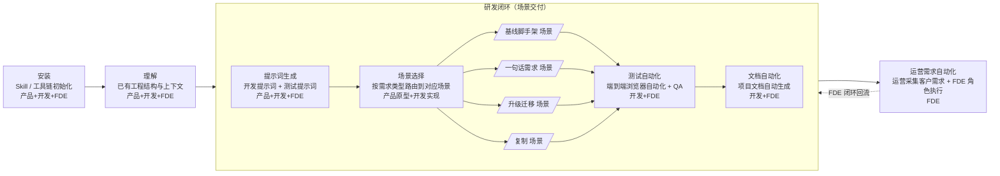

# AI 开发SOP概述

## 1.SOP 目标与用途


本 SOP（Standard Operating Procedure，标准操作流程）文档面向 **business-platform** 项目的全栈开发者、测试工程师及产品经理，旨在为「从需求到交付」的完整研发链路提供一套**可复用、可度量、可自动化**的标准操作指南。

具体而言，本 SOP 用于解决以下三类问题：

- **流程碎片化**：从一句话需求到代码交付，中间环节散落在 PRD、测试、CI、文档、运营多个工种中，缺乏统一串联。
- **AI 协作口径不统一**：不同开发者使用 Cursor / Qoder / CodeBuddy 等 AI IDE 时，提示词模板、模型选型、上下文注入方式各异，产出质量波动大。
- **知识资产沉淀困难**：测试场景、开发提示词、自动化脚本、运营需求等关键资产未能结构化沉淀，复用率低。

本 SOP 文档以**提示词模板 + 流程编排 + 自动化脚本**为载体，让任何一位成员（无论是否熟悉 business-platform 现有架构）都能在短时间内，按图索骥地完成从环境准备到测试交付、再到文档与运营需求自动化的全流程工作。

## 2. 人员角色与 SOP 推广阶段

business-platform 的 SOP 推广按组织成熟度划分为两个阶段：先以**多角色分阶段协作**跑通链路，再随客户场景复杂度上升收敛到**全 FDE**。本节先讲清楚三类角色的职责边界，再讲两个推广阶段的差异。

### 一、三类人员角色与职责边界

| 角色 | 涵盖职能 | 是否与客户直接交流 | 是否承担后端研发 | 关键交付物 |
|------|---------|------------------|----------------|-----------|
| **产品人员** | 原产品 / 解决方案 / 运营 | ✅ 是 | ❌ 否 | 需求清单 / 方案说明 / 前端原型 / 后端接口 MockAPI |
| **开发人员** | 前端 / 后端 / UI / 测试 | ❌ 否 | ✅ 是 | 真实可运行的服务端 + 前端代码、UI 还原、端到端测试 |
| **FDE 角色** | 产品人员 + 开发人员全部职能 | ✅ 是 | ✅ 是 | 客户需求 → 原型 + MockAPI → 真实实现 → 测试 → 文档 → 运营，全链路交付 |

> **关键边界**：开发人员没有直接客户交流工作，专注把产品已对齐的契约（前端原型 + MockAPI）实现为真实链路；产品人员没有后端研发工作，专注把客户需求澄清为可对齐的契约；FDE 角色是产品与开发的合并形态，**包含客户交流与全栈研发的全部工作**，单人即可覆盖从需求到运营的完整闭环。

### 二、SOP 推广两个阶段

| 推广阶段 | 组织形态 | 主要协作模式 | 适用场景 |
|---------|---------|-------------|---------|
| **阶段 A：多角色分阶段协作** | 产品人员与开发人员各司其职，按 SOP 上下游交接 | 产品人员交付「前端原型 + MockAPI」→ 开发人员实现真实链路 → 测试 / 文档 / 运营 | 团队人手充足、需求来源以内部 PRD 为主、SOP 推广早期需要精细化分工 |
| **阶段 B：全 FDE** | 产品 + 开发合并为 FDE 角色，单人跑完全链路 | FDE 既是产品又是开发，按 SOP 七大阶段串行推进，含 §0.7 运营需求自动化 | 客户场景多且分散、需要单点闭环、人手紧张、SOP 推广成熟期 |

> **演进路径**：阶段 A 是 SOP 推广的"起手式"，用产品 / 开发的精细化分工让团队先跑通流程、沉淀资产；阶段 B 是 SOP 推广的"目标态"，把产品 / 开发的边界合并为 FDE，让"客户场景 → 流程模板 → 后续场景复用"形成正循环。客户场景下的运营需求天然由 FDE 直接承接（详见 §0.7 运营需求自动化阶段说明）。

## 3. 开发流程整体视图

business-platform 的开发流程可被抽象为「**七大阶段、串行推进**」的流水线。每一阶段都以前序阶段的产出物为输入，并向后续阶段交付标准化的中间制品，形成可追溯的研发链路：

```
安装  →  理解  ┌─ 提示词生成  →  场景选择  →  各场景  →  测试自动化  ─┐
              │                                                ↓     │
              │                                          文档自动化  │
              │                                                ↓     │
              └────────────  运营需求自动化  ←───────────────────────┘
```

> 图中粗框（含「提示词生成 → 场景选择 → 各场景 → 测试 → 文档自动化」）合称 **「研发闭环（场景交付）」** 父环节，对应单个需求从「写提示词」到「可交付、可测试、可文档化」的完整研发过程；安装 / 理解 在父环节之前完成准备，是独立的前置环节；运营需求自动化 在父环节之后**回流回研发闭环**，形成「研发闭环 → 运营 → 研发闭环」的需求驱动正循环，不再回流到安装 / 理解。

完整流程覆盖从「项目初始化（安装 + 理解）」到「研发闭环（场景交付 + 运营需求）」的全过程。「场景选择」阶段本身即根据需求类型选择对应场景，目前涵盖 **基线脚手架 / 一句话需求 / 升级迁移 / 复制** 四大场景；`pipeline 方案生成` 不是一个独立的前置环节，而是**场景选择阶段的内部分支**。`文档 pipeline` 作为独立阶段单列于「文档自动化」中，不在父环节前半段重复出现。

> **流程阶段 vs SOP 推广阶段**：本节"七大阶段"描述的是**单个项目的执行流程**；§0.2 描述的是**团队/组织层面的 SOP 推广阶段（多角色协作 → 全 FDE）**。两者正交，不冲突。

## 4. SOP 流程图

下面以 Mermaid 流程图形式给出七大阶段的标准顺序与依赖关系。「提示词生成 → 场景选择 → 各场景 → 测试 → 文档自动化」整体作为一个 **「研发闭环（场景交付）」** 父环节（subgraph 表达），其中「场景选择」阶段展开为多个场景子 pipeline；每个阶段标签后括注其主要适用角色，便于在 SOP 推广的不同阶段（多角色协作 / 全 FDE）下查阅：



> 在 SOP 推广**阶段 A（多角色分阶段协作）**下，产品人员负责 ① 安装 → ② 理解 → ③ 提示词生成 → ④ 场景选择中的「前端原型 + MockAPI」交付，开发人员接力完成 ④ 场景选择后的真实场景实现 + ⑤ 测试自动化 + ⑥ 文档自动化；在 SOP 推广**阶段 B（全 FDE）**下，同一个人按上图流程串行跑完「研发闭环（场景交付）」父环节（含 FDE 闭环回流箭头），并直接承担 §7 运营需求自动化。

各阶段在文档中的对应章节如下：

| 阶段 | 流程节点 | 适用角色（SOP 推广阶段 A/B） | 父环节 | 文档对应章节 |
|------|---------|--------------------------|------|-------------|
| 1 | 安装 | 阶段 A：产品 / 开发；阶段 B：FDE | — | §5 Skill 安装 |
| 2 | 理解 | 阶段 A：产品 / 开发；阶段 B：FDE | — | §2 读取理解已有工程 |
| 3 | 提示词生成 | 阶段 A：产品 / 开发；阶段 B：FDE | 研发闭环（场景交付） | §1 开发测试提示词生成 |
| 4 | 场景选择（含 4 个场景分支） | 阶段 A：产品 → 开发；阶段 B：FDE | 研发闭环（场景交付） | §2 测试 / 编码执行 + §3 场景开发 SOP |
| 5 | 测试自动化 | 阶段 A：开发；阶段 B：FDE | 研发闭环（场景交付） | §2.2 执行测试 / 开发 + §3 场景化 pipeline |
| 6 | 文档自动化 | 阶段 A：开发；阶段 B：FDE | 研发闭环（场景交付） | §4 文档编写 + §3.3 docs-pipeline |
| 7 | 运营需求自动化 | 阶段 A：FDE；阶段 B：FDE | — | 运营人员按客户场景采需，FDE 复用 §0~§4 全流程执行 |

## 5. 各阶段主要活动与产出物

| 阶段 | 适用角色（SOP 推广阶段 A/B） | 父环节 | 主要活动 | 关键产出物 |
|------|--------------------------|------|---------|-----------|
| **安装** | 阶段 A：产品 / 开发；阶段 B：FDE | — | 安装 superpower / gstack / get-shit-done / OpenSpec / awesome-design-md 等 Skill 工具链 | 全局可用的技能集、DESIGN.md 设计规范 |
| **理解** | 阶段 A：产品 / 开发；阶段 B：FDE | — | 通过 `/gsd-map-codebase` 检索当前工程，生成架构、关注点、规范、集成、技术栈、结构、测试 7 份认知文件 | `ARCHITECTURE.md` / `CONCERNS.md` / `CONVENTIONS.md` / `INTEGRATIONS.md` / `STACK.md` / `STRUCTURE.md` / `TESTING.md` |
| **提示词生成** | 阶段 A：产品 / 开发；阶段 B：FDE | 研发闭环（场景交付） | 参照 `scene-template.md` 模板，为开发、测试、文档、运营各环节生成结构化提示词 | `<service>-scene.md` / `PRD.md` |
| **场景选择** | 阶段 A：产品交付前端原型 + MockAPI → 开发完成真实场景实现；阶段 B：FDE 跑完全部场景 | 研发闭环（场景交付） | 在 AI IDE（Cursor / Qoder / CodeBuddy）中按需求类型路由到对应场景：**基线脚手架**（§3.1 framework-pipeline，含脚手架与配套文档）/**一句话需求**（§3.2 one-sentence-pipeline）/**升级迁移**（§3.6 java-upgrade-pipeline）/**复制**（§3.4 copy-web / §3.5 copy-app），过程中由人类审核 | 可运行的服务端 + 前端代码、提交记录、场景执行报告；阶段 A 还会产出前端原型与 MockAPI |
| **测试自动化** | 阶段 A：开发；阶段 B：FDE | 研发闭环（场景交付） | 通过 `/qa` 等指令驱动端到端浏览器自动化测试，定位并修复缺陷 | 测试报告、已知问题清单、回归通过的测试用例 |
| **文档自动化** | 阶段 A：开发；阶段 B：FDE | 研发闭环（场景交付） | 类似 Qoder Repo-Wiki 的方式自动生成项目级知识库 | 业务文档、API 文档、运维手册 |
| **运营需求自动化** | 阶段 A 与 B：FDE | — | 运营采集客户需求，并由 FDE（Forward Deployed Engineer，前线部署工程师）角色按本 SOP 各场景完成端到端交付 | 客户需求清单、FDE 执行报告、需求闭环记录 |

> **关于父环节「研发闭环（场景交付）」**：把「提示词生成 → 场景选择 → 各个场景 → 测试 → 文档自动化」5 步聚拢为同一个父环节，强调它们在单个需求里是**一气呵成的研发闭环**；在父环节之前是「安装 / 理解」两个**独立的前置准备阶段**（不参与闭环回流），在父环节之后是「运营需求自动化」回流阶段，回流箭头**回到研发闭环父环节**，不回到安装 / 理解。父环节不会引入新的阶段编号，七大阶段保持不变。

## 6. SOP 如何帮助开发者高效交付

遵循本 SOP，开发者可以获得以下六项核心收益：

1. **降低上手成本**：新人无需通读全部源码即可基于「理解」阶段产出的 7 份文件快速建立心智模型，配合 §5 的 Skill 一键安装，半天内进入实战状态。
2. **统一 AI 协作口径**：所有提示词均按 `scene-template.md` 1:1 对齐，关键 IDE（Cursor / Qoder / CodeBuddy）配套推荐模型，避免「同一需求、不同产出」的协作损耗。
3. **流水线化交付**：七大阶段线性推进，阶段间产出物标准化、可追溯，便于 Code Review、进度度量与质量回溯。
4. **SOP 推广路径清晰**：从阶段 A「多角色分阶段协作」（产品原型 + 开发实现）到阶段 B「全 FDE」（合并产品 + 开发，覆盖客户交流与全栈研发），团队规模与 SOP 流程解耦，组织成熟度可平滑演进。
5. **场景即路由**：场景选择阶段按需求类型路由到基线脚手架 / 一句话需求 / 升级迁移 / 复制 四大场景分支，每种需求类型都有"按图索骥"的执行路径，无需在多个独立流程间反复切换；`文档 pipeline` 不在场景选择环节内重复出现，统一由「文档自动化」阶段承载。
6. **自动化放大产能**：测试、文档、运营三大末端环节均以自动化模板驱动，使开发者从重复劳动中解放出来，聚焦于业务逻辑与架构决策。
7. **沉淀知识资产**：所有 prompt、pipeline、scene 文档以 `docs/scene/` 目录统一归档，形成团队级可复用资产，新需求来临时可直接套用或微调，而非从零开始。

> **使用建议**：首次使用请按文档顺序通读 §0 准备 → §1 提示词生成 → §2 测试执行 → §3 场景 SOP → §4 文档编写，形成对完整链路的整体认知；后续按需跳转到具体章节，结合自身需求类型（基线 / 一句话 / 升级 / 复制 / 文档）选择对应 pipeline 启动。同时明确团队当前处于 §2 的哪个推广阶段（**阶段 A 多角色协作 / 阶段 B 全 FDE**），按对应章节入口推进。

## 7. 运营需求自动化阶段说明

作为整条流水线的**终点与回流出口**，「运营需求自动化」并非独立的内容生产环节，而是对前六个阶段能力的**复用与外延**，并最终**回流回研发闭环（场景交付）父环节**驱动下一轮需求实现：

- **运营视角（需求入口）**：运营同学深入客户业务一线，采集并归集客户在使用 business-platform 过程中提出的真实需求、痛点与定制化场景，沉淀为结构化的需求清单与场景描述。
- **FDE 视角（执行闭环）**：由 FDE（Forward Deployed Engineer，前线部署工程师）角色承接这些运营需求，将客户场景套用回本 SOP 的 **§0 准备 → §1 提示词生成 → §2 测试 → §3 场景 SOP → §4 文档** 全流程，按七大阶段完成从「客户原话」到「可交付、可测试、可文档化」产品的端到端落地。
- **场景复用**：FDE 执行的每一个客户场景，反过来又沉淀为 §3 场景开发 SOP 下的新 pipeline 模板（如 `copy-web-pipeline.md` / `copy-app-pipeline.md` / `java-upgrade-pipeline.md`），形成"客户场景 → 流程模板 → 后续场景复用"的正循环。
- **回流机制**：执行过程中产生的提示词、测试用例、文档与运营分析材料，回填至 `docs/scene/` 资产库，使后续运营采需与 FDE 执行有据可依、越用越准。
