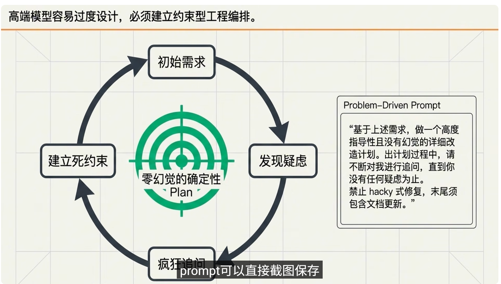
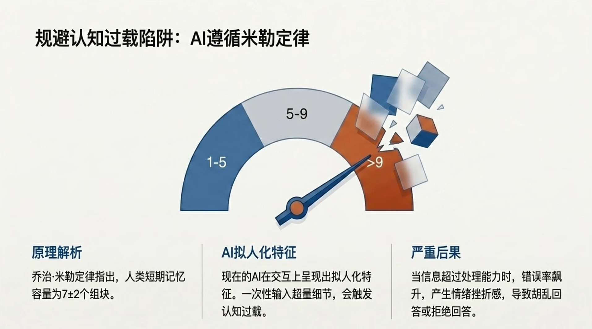
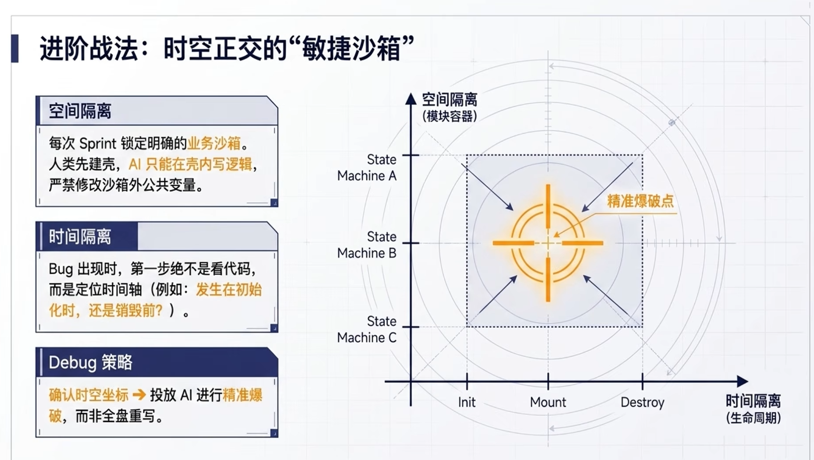
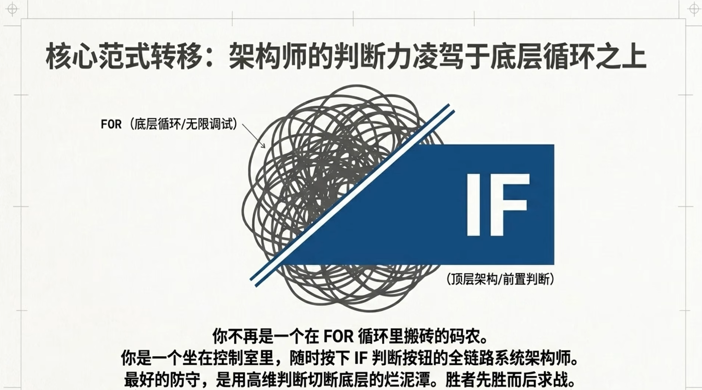
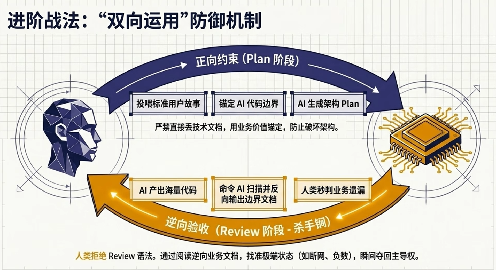
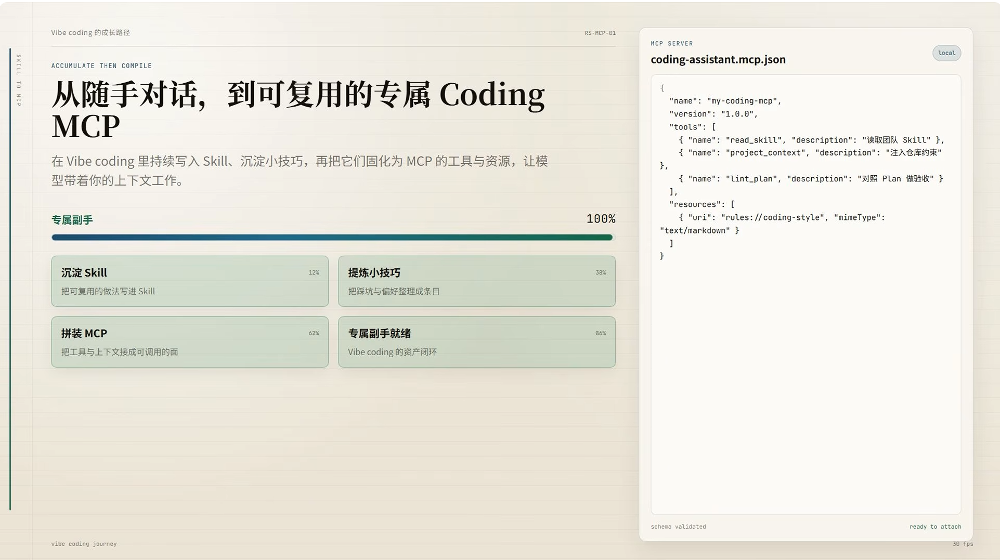

AI编程全是“傻逼”？那是你还在用写代码的思维管理AI！16个Vibe Coding实战技巧分享
https://www.youtube.com/watch?v=A8JU9_GQApg，
16 个 Vibe Coding 实战技巧。这些技巧的核心在于**从“写代码的人”升级为“AI 的管理者”**。

---

### 一、 战略布局篇：模型选择与架构

#### 1. 跨模型协作链（Model Orchestration）

**技巧：** 不要全流程使用单一模型。

* **分工：**
* **逻辑层（GPT-5.5/opus4.7）：** 负责架构规划，将业务需求翻译为技术文档。
* **分析层（Gemini）：** 利用长上下文能力反复审阅分析文档。
* **执行层（Cursor/Codex）：** 负责高频、机械的代码生成 
* **Cursor Harness 第一（Composer）**：负责代码的优化和重构，干脏活。

* **理由：** 强模型（如 opus4.7）适合定调子，但直接写代码可能“想太多”。

#### 2. 代码“记忆宫殿”架构

**技巧：** 架构的核心是“随时好找”，而非“好写”。

* **方法：** 按你自己最熟悉的心智架构（如视频中提到的 SAS 物联网架构）来规范 AI 的输出路径。
* **目的：** 当 AI 产生幻觉时，你能通过熟悉的路径第一时间定位并删除错误。

#### 3. 压榨顶级模型性价比

**技巧：** 用最强的推理模型（opus4.7/GPT5.5）建立 **Plan（计划）**，用执行模型（Composer）干脏活。

* **反直觉：** 有时“低端模型做 Plan，高端模型写代码”效果更好，因为高端模型在做 Plan 时容易“过度设计”。

---

### 二、 指令工程篇：Prompt 实战

#### 4. 约束型需求工程（核心 Prompt）

**技巧：** 强制 AI 通过“追问”来消灭歧义。

* **实战 Prompt：**

> “基于上述需求做一个高度指导性、且没有幻觉的机械执行的 code 改造计划。
> **改造计划过程中，请不断不断对我进行追问，直到你认为没有任何疑虑、绝无幻觉为止。**
> 改告计划禁止任何 Heuristic（启发式）修复。末尾必须包含代码修改后的文档更新。”

#### 5. 即时打断思维

**技巧：** 监控 AI 的 **Thinking** 过程。

* **操作：** 发现 AI 思考跑偏（例如改个按钮颜色却要重构全局路由）时，立刻按下停止键。

#### 6. 六边形终极审查（核心 Prompt）

**技巧：** 完成后使用 Sonnet 4.5 进行闭环审计。

* **实战 Prompt：**

> “请对代码进行六边形审计：
> 1. 是否有幻觉； 
> 2. 是否有额外不必要逻辑； 
> 3. 是否有偏差；
> 4. 是否执行遗漏； 
> 5. 架构/语法是否有问题； 
> 6. 是否有性能问题。”
> 

#### 7. vibe codding时上下文喂养（MCP/Docs）

**技巧：** 避免低级幻觉。

* 技术栈/框架/依赖包版本写死在提示词中 【在Plan里锁死版本与组件库】
* **操作：** 在 Cursor 中挂载官方context 7 MCP，让 AI 查阅最新的 API，防止方法名写错。

#### 8. 使用主动语态指令

**技巧：** 停止“能帮我看看吗”的甜狗语气。

* **操作：** 作为 Leader 直接下达指令：“请重构这段请求，增加 3 次重试逻辑”。

#### 9. 渐进式披露（Progressive Disclosure）

**技巧：** 像画画一样从骨架到分支。

* **方法：** 先搞定整体流程，再逐步让 AI 深入局部细节，避免一次性喂入过多重点导致 AI 失去注意力。

---

### 三、 系统工程篇：稳定性与可控性

#### 10. 时空正交沙盒

**技巧：** 逻辑隔离。

* **空间隔离：** 将功能锁定在明确的业务领域。
* **时间隔离：** 定义功能的生命周期（初始化、运行、销毁），出 Bug 时先定位时间坐标。

#### 11. 状态机集装箱化

**技巧：** 像造集装箱一样做设计。

* **方法：** 每一个功能模块都用状态机封死。模块内部可以随意折腾，但决不能污染外部主程序。

#### 12. 拦截思维：判断大于循环

**技巧：** 保安思维。

* **方法：** 在入口处通过逻辑拦截非法情况，而不是先把数据放进去再在内部进行复杂的循环判断。

#### 13. 保留锚定测试点

**技巧：** 可视化黑盒逻辑。

* **操作：** 无论后端多复杂，优先开发一个前端可视化界面或详尽的结构化日志（Logs），通过观察状态流转来快速评估逻辑是否正确。

---

### 四、 资产积累篇：长期价值

#### 14. 敏捷管理在Vibe Coding中的应用
反向生成用户故事（User Stories）

**技巧：** 快速代码审查。

* **操作：** 当 AI 交付大段代码时，命令它：“请根据你写的代码，反向生成一篇用长线用户故事”。通过读故事判断它是否理解了你的业务逻辑。
```markdown
为我的空单策略altshort，根据实际的代码，来生成纯粹给人类看的用户故事，故事务必要全，不能遗漏。
基于上述需求，做一个高度指导性且没有幻觉的详细到只需要机械执行的用户故事文档生成计划，
在plan过程中，请不断不断对我进行追问，直到你认为没有任何疑虑，绝无幻觉为止。
```

#### 15. 分块输出上限突破

**技巧：** 应对超长任务。

* **操作：** 在 Cloud 遇到 Token 刷新节点中断时，通过特定的终端指令或分块请求来解放输出上限，避免重复工作。
```markdown
export CLAUDE_CODE_MAX_OUTPUT_TOKENS=64000
```

#### 16. 建立动态 Rule/Skill 库（MCP 资产）

**技巧：** 积累复利。

* **方法：** 将解决过的问题固化为自定义 Rules 或 MCP 工具。
* **目标：** 让 AI 遇到关键词就自动执行特定的最佳实践，使 AI 越来越懂你。

---

**总结：**
Vibe Coding 的高手不追求“优雅的打字”，而追求“**确定性的控制**”。通过这 16 个技巧，你可以构建一个低幻觉、高交付质量的自动化编程体系。