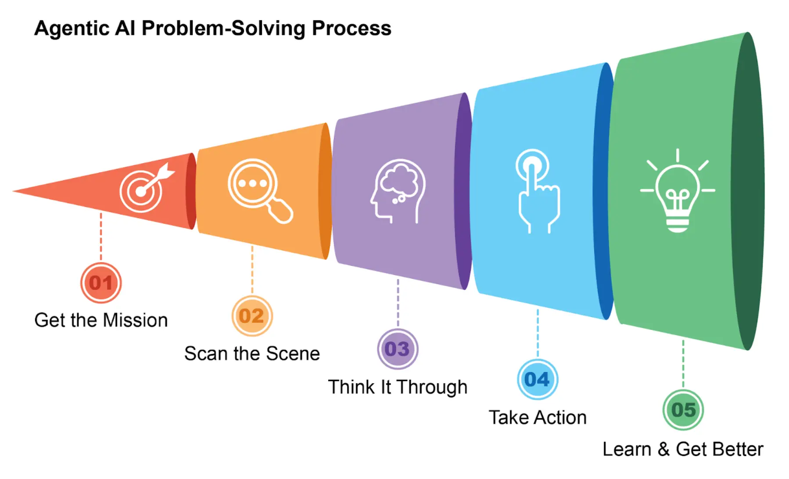
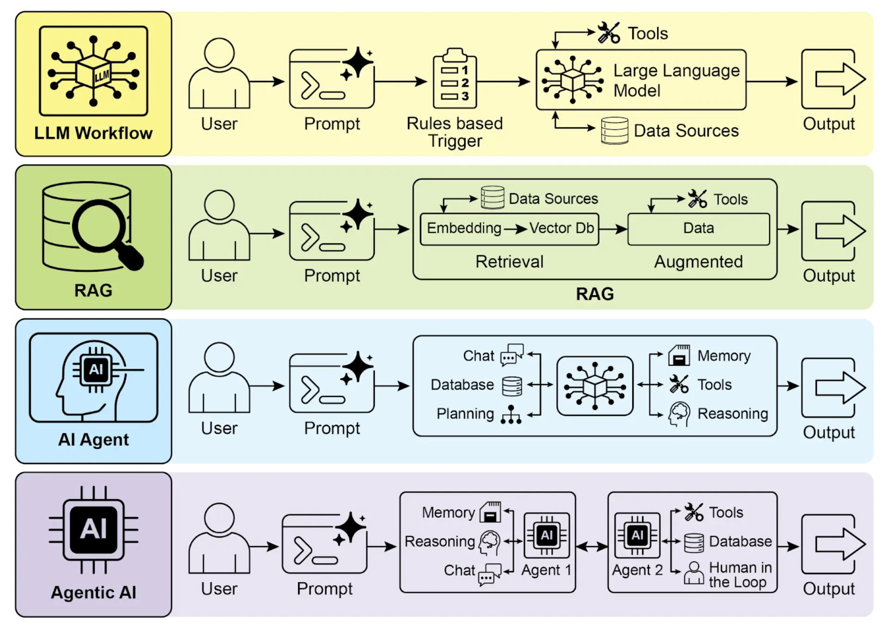
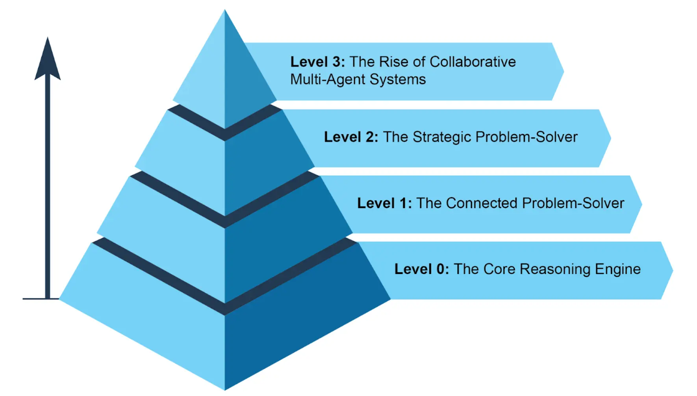

# 智能体的特征

    简单来说，**智能体**是一种能够感知环境并采取行动以实现特定目标的系统。它是从传统大语言模型（LLM）演化而来，具备规划、工具使用和环境交互等能力。可以 把智能体想象成一个能在工作中不断学习的智能助手。它遵循一个简单的五步循环来完成任务（见图 1）：

1. **获取任务目标**：你给它一个目标，比如“帮我安排日程”。
2. **扫描环境信息**：它会收集所有必要的信息——阅读邮件、检查日历、访问联系人——以了解当前状况。
3. **制定计划**：它会思考并制定实现目标的最佳方案。
4. **执行行动**：它会发送邀请、安排会议、更新你的日历来落实计划。
5. **学习与优化**：它会观察结果并不断调整。例如，如果会议被重新安排，系统会从中学习以提升未来表现。

    图 1：智能体像智能助手一样，通过经验不断学习，采用五步循环完成任务。

    智能体正在以惊人的速度普及。最新研究显示，大多数大型 IT 企业都在积极使用智能体，其中五分之一是在过去一年内刚刚开始。金融市场也高度关注这一趋势。到 2024 年底，智能体初创公司融资已超过 20 亿美元，市场规模达到 52 亿美元，预计到 2034 年将激增至近 2000 亿美元。简而言之，智能体将在未来经济中扮演极为重要的角色。

    短短两年间，AI 范式发生了巨大转变，从简单自动化迈向复杂自主系统（见图 2）。最初，工作流依赖基础提示和触发器，利用 LLM 处理数据。随后，检索增强生成（RAG）技术出现，通过事实信息提升模型可靠性。接着，单体智能体诞生，能够调用多种工具。如今，我们正步入智能体式 AI (Agentic AI) 时代，多个专业智能体协作完成复杂目标，AI 的协同能力实现了质的飞跃。

    图 2：从 LLM 到 RAG，再到智能体式，最终迈向智能体式 AI。

    本书旨在探讨专业智能体如何协作、互动以实现复杂目标的设计模式，每一章都将展示一种协作与交互范式。

    在此之前，让我们先看几个智能体复杂度的典型实例（见图 3）。

## Level 0：核心推理引擎

    LLM 本身并不是智能体，但可以作为基础智能体系统的推理核心。在“Level 0”配置下，LLM 不具备工具、记忆或环境交互能力，仅依靠预训练知识进行响应。它擅长解释已知概念，但完全无法感知最新事件。例如，如果 2025 年奥斯卡最佳影片不在其训练数据中，它就无法回答。

## Level 1：连接型问题解决者

    此阶段，LLM 通过连接外部工具成为真正的智能体。它的问题解决能力不再局限于预训练知识，而是能执行一系列操作，从互联网（搜索）或数据库（RAG）等渠道收集和处理信息。详细内容见[第 14 章](ch14-rag.md)。

    例如，查找新电视剧时，智能体会识别需要最新信息，使用搜索工具获取并整合结果。它还能调用专业工具提升准确率，比如通过金融 API 获取 AAPL 的实时股价。跨步骤与外部世界交互，是 Level 1 智能体的核心能力。

## Level 2：战略型问题解决者

    此阶段，智能体能力大幅提升，具备战略规划、主动协助和自我优化，提示工程与上下文工程成为核心技能。

    首先，智能体不再只用单一工具，而是通过战略性问题解决应对复杂多步骤任务。执行过程中，它主动进行上下文工程：即为每一步战略性筛选、打包和管理最相关的信息。例如，查找两地之间的咖啡馆，智能体先用地图工具获取信息，再将输出内容（如街道名列表）精简后传递给本地搜索工具，避免信息过载，确保高效准确。要让 AI 达到最高准确率，必须提供简短、聚焦且高效的上下文。上下文工程正是通过战略性筛选和管理关键信息，实现模型注意力的有效分配。详细内容见[附录 A](../appendix-a-advanced-prompting-techniques/)。

    这一阶段还带来主动、持续的操作。例如，旅行助手连接邮箱后，会从冗长的航班确认邮件中提取关键信息（航班号、日期、地点），再打包给日历和天气 API。

    在软件工程等专业领域，智能体通过上下文工程管理整个工作流。收到 bug 报告后，它会读取报告和代码库，并将大量信息精炼为高效上下文，从而高效编写、测试和提交正确的代码补丁。

    最后，智能体通过优化自身上下文工程实现自我提升。它会主动请求反馈，学习如何更好地整理初始输入，从而自动优化未来任务的信息打包方式，形成强大的自动反馈循环，不断提升准确率和效率。详细内容见[第 17 章](ch17-reasoning.md)。

    图 3：展示智能体复杂度的不同实例。

## Level 3：协作型多智能体系统崛起

    Level 3 标志着 AI 开发范式的重大转变，不再追求单一超级智能体，而是发展复杂的协作型多智能体系统。该模式认为，复杂挑战往往不是由单一通才解决，而是由多个专业团队协作完成。这与人类组织结构高度相似，不同部门分工协作，共同实现多元目标。系统的集体优势正是通过分工与协同实现的。详细内容见第 7 章。

    以新产品发布为例，不是一个智能体包揽所有环节，而是由“项目经理”智能体统筹，分派任务给“市场调研”、“产品设计”、“营销推广”等专业智能体。成功的关键在于各智能体之间的高效沟通与信息共享，确保所有努力协同达成共同目标。

    虽然自主团队式自动化已在开发中，但目前仍面临挑战。多智能体系统的效能受限于所用 LLM 的推理能力，且智能体之间真正互相学习和协同提升还处于初级阶段。突破这些技术瓶颈，是实现自动化全流程业务的关键一步。
