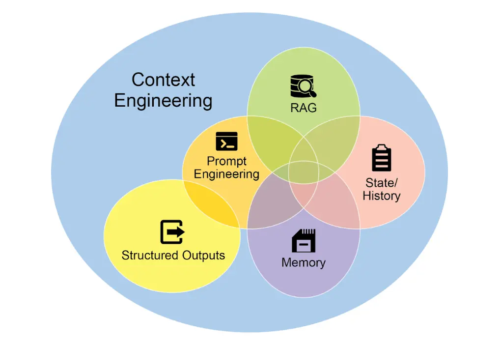
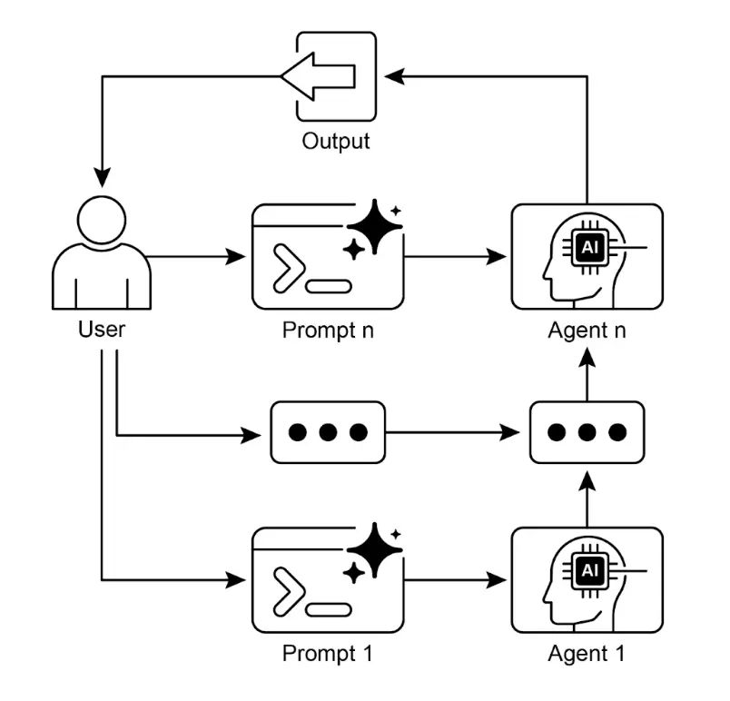

# 第 1 章：提示链（Prompt Chaining）

## 提示链模式概述

    提示链（Prompt Chaining），有时也称为流水线（Pipeline）模式，是在使用大语言模型（LLM）时处理复杂任务的强大范式。与其让 LLM 一步到位解决复杂问题，提示链主张采用分而治之策略，将原本棘手的问题拆解为一系列更小、更易管理的子问题。每个子问题通过专门设计的提示单独处理，并将前一步的输出作为下一步的输入，形成链式依赖。

    这种顺序处理技术为与 LLM 的交互带来了模块化和清晰性。通过拆解复杂任务，可以更容易理解和调试每个步骤，使整体流程更健壮、更易解释。每一步都可针对问题的某一方面精细优化，提升输出的准确性和针对性。

    每一步的输出作为下一步的输入至关重要。这种信息传递建立了依赖链，前序操作的上下文和结果会引导后续处理，使 LLM 能够在前一步基础上不断完善理解，逐步逼近目标解。

    此外，提示链不仅仅是拆解问题，还能集成外部知识和工具。每一步都可以指示 LLM 与外部系统、API 或数据库交互，扩展其知识和能力。这极大提升了 LLM 的潜力，使其不仅是孤立模型，更是智能系统的核心组件。

    提示链的意义远超简单问题求解，它是构建复杂智能体的基础技术。这些智能体可利用提示链自主规划、推理和行动，适应动态环境。通过合理设计提示序列，智能体可完成多步推理、规划和决策任务，模拟人类思维流程，实现更自然、高效的复杂领域交互。

    **单一提示的局限性**：对于多层次任务，单一复杂提示往往效率低下，模型容易忽略部分指令、丢失上下文、错误累积、上下文窗口不足或出现幻觉。例如，要求分析市场调研报告、总结发现、提取数据点并撰写邮件，模型可能只完成部分任务，遗漏关键环节。

    **通过顺序拆解提升可靠性**：提示链通过将复杂任务拆解为聚焦的顺序流程，显著提升可靠性和可控性。以上例为例，链式流程如下：

1. 初始提示（摘要）：“请总结以下市场调研报告的主要发现：[文本]”。模型专注于摘要，准确性更高。
2. 第二步（趋势识别）：“根据摘要，识别三大新兴趋势并提取支持数据点：[第 1 步输出]”。提示更聚焦，建立在已验证结果之上。
3. 第三步（邮件撰写）：“请为市场团队撰写一封简明邮件，概述上述趋势及数据支持：[第 2 步输出]”。

    这种拆解带来更细致的流程控制，每步更简单、明确，降低模型认知负担，提升最终结果的准确性和可靠性。类似于计算流水线，每个函数完成特定操作后将结果传递给下一个。为确保每步任务准确，可为模型分配不同角色，如“市场分析师”“贸易分析师”“文档专家”等。

    **结构化输出的重要性**：提示链的可靠性高度依赖于各步骤间数据的完整性。若某步输出模糊或格式不规范，后续提示可能因输入错误而失败。为此，建议指定结构化输出格式，如 JSON 或 XML。

    例如，趋势识别步骤的输出可采用 JSON 格式：

```json
{
 "trends": [
  {
    "trend_name": "AI 驱动个性化",
    "supporting_data": "73% 消费者更愿意与使用个人信息提升购物体验的品牌合作。"
  },
  {
    "trend_name": "可持续与口碑",
    "supporting_data": "带 ESG 标签产品销量五年增长 28%，无 ESG 标签产品增长 20%。"
  }
 ]
}
```

    结构化格式确保数据可被机器精确解析并传递至下一步，减少自然语言理解带来的错误，是构建多步 LLM 系统的关键。

## 实践应用与场景

    提示链是一种通用模式，适用于构建智能体系统时的多种场景。其核心价值在于将复杂问题拆解为顺序、可管理的步骤。常见应用包括：

    **1. 信息处理流程**：许多任务需对原始信息多次转换，如文档摘要、实体提取、用实体查询数据库、生成报告。提示链流程示例：

* 提示 1：从指定 URL 或文档提取文本内容。
* 提示 2：摘要清洗后的文本。
* 提示 3：从摘要或原文中提取实体（如姓名、日期、地点）。
* 提示 4：用实体查询内部知识库。
* 提示 5：生成包含摘要、实体和查询结果的最终报告。

    该方法广泛用于自动化内容分析、AI 助理开发、复杂报告生成等领域。

    **2. 复杂问答**：回答需多步推理或信息检索的问题，如“1929 年股市崩盘的主要原因及政府政策应对？”

* 提示 1：识别用户问题的核心子问题（崩盘原因、政府应对）。
* 提示 2：检索 1929 崩盘原因相关信息。
* 提示 3：检索政府政策应对相关信息。
* 提示 4：综合第 2、3 步信息，形成完整答案。

    该顺序处理方法是多步推理与信息整合型 AI 系统的基础。复杂查询往往需逻辑步骤串联或多源信息整合。

    例如，自动化研究智能体生成专题报告时，先检索大量相关文章，然后并行提取关键信息。并行处理完成后，需顺序合并数据、综合成初稿、最终审阅完善。后续阶段依赖前序结果，提示链在此发挥作用：合并数据作为综合提示输入，综合文本作为审阅提示输入。复杂流程常结合并行数据采集与链式依赖的综合与优化。

    **3. 数据提取与转换**：将非结构化文本转为结构化格式，通常需多步迭代修正以提升准确性和完整性。

* 提示 1：尝试从发票文档中提取指定字段（如姓名、地址、金额）。
* 处理：检查字段是否齐全且格式正确。
* 提示 2（条件）：若字段缺失或格式错误，重新提示模型查找缺失/错误信息，并提供失败上下文。
* 处理：再次验证结果，必要时重复。
* 输出：输出提取并验证的结构化数据。

    该顺序处理方法适用于表单、发票、邮件等非结构化数据的提取与分析。例如，复杂 OCR 问题（如 PDF 表单处理）更适合多步拆解：先用 LLM 提取文本，再规范化数据（如将“壹仟零五十”转为 1050），最后将算术运算交由外部工具完成，LLM 识别计算需求、调用工具、整合结果。链式流程实现了单步难以可靠完成的精确结果。

    **4. 内容生成流程**：复杂内容创作通常分为主题构思、结构大纲、分段撰写、后续修订等阶段。

* 提示 1：根据用户兴趣生成 5 个主题创意。
* 处理：用户选择或自动选定一个主题。
* 提示 2：基于选定主题生成详细大纲。
* 提示 3：根据大纲第一点撰写草稿。
* 提示 4：根据第二点撰写草稿，并提供前一段上下文，依次完成所有大纲点。
* 提示 5：整体审阅并优化草稿的连贯性、语气和语法。

    该方法适用于自动化创意写作、技术文档等结构化文本生成任务。

    **5. 有状态对话智能体**：虽然完整状态管理架构更复杂，提示链为对话连续性提供基础机制。每轮对话构建新提示，系统性整合前序信息或实体，维护上下文。

* 提示 1：处理用户第 1 轮发言，识别意图和实体。
* 处理：更新对话状态。
* 提示 2：基于当前状态生成回复或识别下一步所需信息。
* 后续轮次重复，每次新发言启动链式流程，利用累积的对话历史（状态）。

    该原则是对话智能体开发的基础，使系统能跨多轮对话保持上下文和连贯性。

    **6. 代码生成与优化**：功能代码生成通常需将问题拆解为一系列逻辑操作，逐步执行。

* 提示 1：理解用户代码需求，生成伪代码或大纲。
* 提示 2：根据大纲撰写初稿代码。
* 提示 3：识别代码潜在错误或改进点（可用静态分析工具或再次调用 LLM）。
* 提示 4：根据问题重写或优化代码。
* 提示 5：补充文档或测试用例。

    AI 辅助开发场景下，提示链通过拆解复杂任务为可管理子问题，降低每步模型复杂度，并允许在模型调用间插入确定性逻辑，实现中间数据处理、输出验证和条件分支。这样，原本难以可靠完成的多层请求被转化为结构化操作序列，由底层执行框架管理。

    **7. 多模态与多步推理**：处理多模态数据集需将问题拆解为多个基于提示的小任务。例如，解析包含嵌入文本、标签和表格的图片时：

* 提示 1：从图片请求中提取并理解文本。
* 提示 2：将提取的文本与标签关联。
* 提示 3：结合表格信息解释并输出所需结果。

## 实战代码示例

    提示链实现方式包括脚本中的顺序函数调用，也可用专门框架管理流程、状态和组件集成。LangChain、LangGraph、Crew AI、Google Agent Development Kit（ADK）等框架为多步流程构建和执行提供了结构化环境，适合复杂架构。

    以 LangChain 和 LangGraph 为例，其核心 API 专为链式和图式操作设计。LangChain 提供线性序列抽象，LangGraph 支持有状态和循环计算，适合更复杂的智能体行为。以下示例聚焦基础线性序列。

    代码实现了两步提示链，作为数据处理流水线。第一步解析非结构化文本并提取信息，第二步将提取结果转为结构化数据格式。

    首先安装所需库：

```bash
pip install langchain langchain-community langchain-openai langgraph
```

    如需更换模型供应商，可替换 `langchain-openai`。随后配置 API 密钥（如 OpenAI、Google Gemini、Anthropic）。

```python
import os
from langchain_openai import ChatOpenAI
from langchain_core.prompts import ChatPromptTemplate
from langchain_core.output_parsers import StrOutputParser

# 推荐用 .env 文件加载环境变量
# from dotenv import load_dotenv
# load_dotenv()
# 确保 OPENAI_API_KEY 已在 .env 文件中设置

# 初始化语言模型（推荐使用 ChatOpenAI）
llm = ChatOpenAI(temperature=0)

# --- 提示 1：信息提取 ---
prompt_extract = ChatPromptTemplate.from_template(
  "请从以下文本中提取技术规格：\n\n{text_input}"
)

# --- 提示 2：转为 JSON ---
prompt_transform = ChatPromptTemplate.from_template(
  "请将以下技术规格转为 JSON 格式，包含 'cpu'、'memory' 和 'storage' 三个键：\n\n{specifications}"
)

# --- 用 LCEL 构建链 ---
# StrOutputParser() 将 LLM 消息输出转为字符串
extraction_chain = prompt_extract | llm | StrOutputParser()

# 全链将提取链的输出作为 'specifications' 变量传递给转换提示
full_chain = (
  {"specifications": extraction_chain}
  | prompt_transform
  | llm
  | StrOutputParser()
)

# --- 运行链 ---
input_text = "新款笔记本配备 3.5GHz 八核处理器、16GB 内存和 1TB NVMe SSD。"

# 用输入文本字典执行链
final_result = full_chain.invoke({"text_input": input_text})

print("\n--- 最终 JSON 输出 ---")
print(final_result)
```

    此 Python 代码演示了如何用 LangChain 处理文本。分两步提示：先从输入字符串提取技术规格，再将规格转为 JSON。用 `ChatOpenAI` 进行模型交互，`StrOutputParser` 保证输出为可用字符串。LangChain 表达式语言（LCEL）优雅地将提示和模型串联。`extraction_chain` 负责提取规格，`full_chain` 用提取结果作为转换提示输入。示例输入为笔记本参数，`full_chain` 依次处理，最终输出 JSON 字符串。

## 上下文工程与提示工程

    上下文工程（见图 1）是一种系统性方法，旨在于 AI 生成前为模型构建完整的信息环境。该方法认为，模型输出质量更多取决于所提供的丰富上下文，而非模型架构本身。



    图 1：上下文工程是为 AI 构建丰富信息环境的学科，优质上下文是实现高级智能体性能的关键。

    上下文工程是传统提示工程的升级，后者仅优化用户即时问题的表达。上下文工程扩展至多层信息，包括**系统提示**（如“你是技术写手，语气需正式且精确”），还可加入外部数据，如检索文档（AI 主动从知识库获取信息）、工具输出（如调用 API 查询日程），以及用户身份、历史交互、环境状态等隐性数据。即使模型再先进，若上下文有限或构建不当，性能也会受限。

    因此，任务不再是简单答疑，而是为智能体构建完整操作视图。例如，经过上下文工程的智能体在回复前会整合用户日程（工具输出）、邮件收件人关系（隐性数据）、会议记录（检索文档），生成高度相关、个性化、实用的输出。工程环节包括构建数据获取与转换管道、建立反馈循环持续优化上下文质量。

    实际应用中，可用专门调优系统自动提升上下文质量，如 Google Vertex AI 提示优化器，可用样例输入和评估指标系统性优化模型响应，无需手动重写。通过为优化器提供样例提示、系统指令和模板，可自动优化上下文输入，实现反馈循环。

    这种结构化方法是区分基础 AI 工具与高级智能系统的关键。它将上下文视为核心，强调智能体“知道什么、何时知道、如何利用”。确保模型全面理解用户意图、历史和当前环境，是将无状态聊天机器人升级为高能力、情境感知系统的关键方法。

## 一图速览

    **是什么**：复杂任务若用单一提示处理，LLM 易因认知负担过重而出错，如忽略指令、丢失上下文、生成错误信息。单一提示难以管理多约束和多步推理，导致输出不可靠、不准确。

    **为什么**：提示链通过将复杂问题拆解为一系列小型、互相关联的子任务，每步用聚焦提示完成特定操作，显著提升可靠性和可控性。每步输出作为下一步输入，形成逻辑流程，逐步逼近最终解。模块化分而治之策略让流程更易管理、调试，并可在步骤间集成外部工具或结构化数据。该模式是构建多步智能体系统（可规划、推理、执行复杂流程）的基础。

    **经验法则**：当任务过于复杂、包含多阶段处理、需在步骤间调用外部工具，或需构建多步推理、状态管理的智能体时，建议采用此模式。

    **视觉总结**



    图 2：提示链模式：智能体依次接收用户提示，每步输出作为下一步输入。

## 关键要点

* 提示链将复杂任务拆解为一系列小型、聚焦步骤，亦称流水线模式。
* 每步链条包含一次 LLM 调用或处理逻辑，以上一步输出为输入。
* 该模式提升了与语言模型复杂交互的可靠性和可管理性。
* LangChain/LangGraph、Google ADK 等框架为多步序列定义、管理和执行提供了强大工具。

## 总结

    通过将复杂问题拆解为一系列更简单、易管理的子任务，提示链为引导大语言模型提供了稳健框架。分而治之策略让模型每次专注于单一操作，显著提升输出的可靠性和可控性。作为基础模式，它支持构建具备多步推理、工具集成和状态管理能力的高级智能体。掌握提示链，是打造具备复杂流程执行能力、上下文感知系统的关键。

## 参考文献

* [LangChain LCEL 文档 - python.langchain.com](https://python.langchain.com/v0.2/docs/core_modules/expression_language/)
* [LangGraph 文档 - langchain-ai.github.io](https://langchain-ai.github.io/langgraph/)
* [Prompt Engineering Guide: Chaining Prompts - promptingguide.ai](https://www.promptingguide.ai/techniques/chaining)
* [OpenAI API 文档：通用提示概念 - platform.openai.com](https://platform.openai.com/docs/guides/gpt/prompting)
* [Crew AI 文档：任务与流程 - docs.crewai.com](https://docs.crewai.com/)
* [Google AI 开发者提示指南 - cloud.google.com](https://cloud.google.com/discover/what-is-prompt-engineering?hl=zh-cn)
* [Vertex Prompt Optimizer - cloud.google.com](https://cloud.google.com/vertex-ai/generative-ai/docs/learn/prompts/prompt-optimizer)
