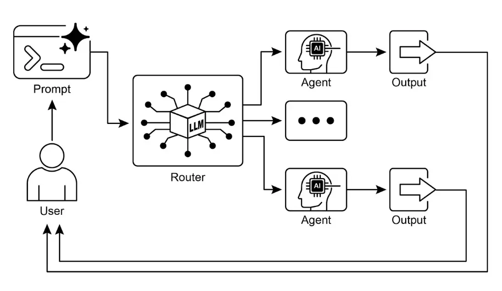

# 第 2 章：路由

## 路由模式概述

    虽然通过提示链实现的顺序处理是利用语言模型执行确定性、线性工作流的基础技术，但在需要自适应响应的场景下，其适用性有限。现实中的智能体系统通常需要根据环境状态、用户输入或前序操作结果等因素，在多个潜在动作之间进行仲裁。这种动态决策能力——即根据特定条件将控制流导向不同的专用函数、工具或子流程——就是通过“路由”机制实现的。

    路由为智能体的操作框架引入了条件逻辑，使其从固定执行路径转变为动态评估特定标准、从一组可能的后续动作中进行选择的模式，从而实现更灵活、具备上下文感知的系统行为。

    例如，一个用于客户咨询的智能体在具备路由功能后，可以首先对用户查询进行分类以判断意图。根据分类结果，查询可以被导向专门的问答智能体、用于账户信息检索的数据库工具，或用于复杂问题升级的流程，而不是始终采用单一、预设的响应路径。因此，一个更高级的路由智能体可以：

1. 分析用户查询。
2. **根据查询意图进行路由**：
   * 如果意图为“查询订单状态”，则路由到与订单数据库交互的子智能体或工具链。
   * 如果意图为“产品信息”，则路由到检索产品目录的子智能体或链。
   * 如果意图为“技术支持”，则路由到访问故障排查指南或升级到人工的链。
   * 如果意图不明确，则路由到澄清意图的子智能体或提示链。

    路由模式的核心组件是执行评估并引导流程的机制，其实现方式包括：

* **基于 LLM 的路由**：通过提示语言模型分析输入，并输出指示下一步或目标的标识符或指令。例如，可以提示 LLM：“分析以下用户查询，仅输出类别：‘订单状态’、‘产品信息’、‘技术支持’或‘其他’”。智能体系统读取输出并据此引导工作流。
* **基于嵌入的路由**：将输入查询转为向量嵌入（参见[第 14 章 RAG](ch14-rag.md)），再与代表不同路由或能力的嵌入进行比对，将查询路由到最相似的路径。适用于语义路由，即决策基于输入的含义而非关键词。
* **基于规则的路由**：使用预定义规则或逻辑（如 if-else、switch case），根据关键词、模式或结构化数据进行路由。此方法比 LLM 路由更快、更确定，但处理复杂或新颖输入的灵活性较低。
* **基于机器学习模型的路由**：采用如分类器等判别模型，在小规模标注数据集上专门训练以实现路由任务。与嵌入方法类似，但其特点是监督微调过程，路由逻辑编码在模型权重中。与 LLM 路由不同，决策组件不是推理时执行提示的生成模型，而是已微调的判别模型。LLM 可用于生成合成训练数据，但不参与实时路由决策。

    路由机制可在智能体操作周期的多个阶段实现：既可用于初始任务分类，也可在处理链中间决定后续动作，或在子流程中选择最合适的工具。

    [LangChain](https://github.com/langchain-ai/langchain)、[LangGraph](https://github.com/langchain-ai/langgraph) 和 Google 的 [Agent Developer Kit (ADK)](https://google.github.io/adk-docs/) 等计算框架提供了定义和管理此类条件逻辑的显式结构。LangGraph 以其基于状态的图架构，尤其适合需要根据系统累积状态进行决策的复杂路由场景。Google ADK 则为智能体能力和交互模型的结构化提供基础组件，便于实现路由逻辑。在这些框架的执行环境中，开发者定义可能的操作路径，以及决定节点间转换的函数或模型评估。

    路由的实现使系统超越了确定性顺序处理，能够开发出更具适应性的执行流，动态响应更广泛的输入和状态变化。

## 实践应用与场景

    路由模式是设计自适应智能体系统的关键控制机制，使其能够根据输入和内部状态动态调整执行路径，广泛应用于多个领域。

    在人机交互场景（如虚拟助手、AI 教师）中，路由用于解析用户意图。系统对自然语言查询进行初步分析，决定后续动作，如调用信息检索工具、升级到人工、或根据用户表现选择下一个课程模块，从而实现超越线性对话流的上下文响应。

    在自动化数据与文档处理流程中，路由承担分类与分发功能。系统根据内容、元数据或格式分析如邮件、工单、API 数据，并将其导向相应工作流，如销售线索导入、针对 JSON/CSV 的数据转换、或紧急问题升级。

    在涉及多个专用工具或智能体的复杂系统中，路由充当高级调度器。例如，研究系统由检索、摘要、分析等智能体组成，路由器根据当前目标分配任务。同样，AI 编程助手会先识别编程语言和用户意图（调试、解释、翻译），再将代码片段交给对应工具处理。

    总之，路由为系统提供了逻辑仲裁能力，是构建功能多样、具备上下文感知系统的基础。它将智能体从静态执行者转变为能根据变化条件做出决策的动态系统。

## 实战代码示例（LangChain）

    代码实现路由需定义可能路径及决策逻辑。LangChain 和 LangGraph 等框架提供了专用组件和结构，LangGraph 的状态图结构尤其适合路由逻辑的可视化和实现。

    以下代码演示了使用 LangChain 和 Google 生成式 AI 构建的简单智能体系统。系统设置一个“协调者”，根据请求意图（预订、信息、或不明确）将用户请求路由到不同的“子智能体”处理器。系统利用语言模型分类请求，并委托给相应处理函数，模拟多智能体架构中的基本委托模式。

    首先，确保安装所需库：

```bash
pip install langchain langgraph google-cloud-aiplatform langchain-google-genai google-adk deprecated pydantic
```

    还需配置语言模型 API 密钥（如 OpenAI、Google Gemini、Anthropic）。

```python
# Copyright (c) 2025 Marco Fago
# https://www.linkedin.com/in/marco-fago/
#
# 本代码采用 MIT 许可证，详见仓库 LICENSE 文件。

from langchain_google_genai import ChatGoogleGenerativeAI
from langchain_core.prompts import ChatPromptTemplate
from langchain_core.output_parsers import StrOutputParser
from langchain_core.runnables import RunnablePassthrough, RunnableBranch

# --- 配置 ---
# 确保环境变量已设置 API 密钥（如 GOOGLE_API_KEY）
try:
   llm = ChatGoogleGenerativeAI(model="gemini-2.5-flash", temperature=0)
   print(f"语言模型初始化成功：{llm.model}")
except Exception as e:
   print(f"语言模型初始化失败：{e}")
   llm = None

# --- 定义模拟子智能体处理器（等同于 ADK sub_agents） ---

def booking_handler(request: str) -> str:
   """模拟预订智能体处理请求。"""
   print("\n--- 委托给预订处理器 ---")
   return f"预订处理器已处理请求：'{request}'。结果：模拟预订动作。"

def info_handler(request: str) -> str:
   """模拟信息智能体处理请求。"""
   print("\n--- 委托给信息处理器 ---")
   return f"信息处理器已处理请求：'{request}'。结果：模拟信息检索。"

def unclear_handler(request: str) -> str:
   """处理无法委托的请求。"""
   print("\n--- 处理不明确请求 ---")
   return f"协调者无法委托请求：'{request}'。请补充说明。"

# --- 定义协调者路由链（等同于 ADK 协调者指令） ---
coordinator_router_prompt = ChatPromptTemplate.from_messages([
   ("system", """分析用户请求，判断应由哪个专属处理器处理。
    - 若请求涉及预订机票或酒店，输出 'booker'。
    - 其他一般信息问题，输出 'info'。
    - 若请求不明确或不属于上述类别，输出 'unclear'。
    只输出一个词：'booker'、'info' 或 'unclear'。"""),
   ("user", "{request}")
])

if llm:
   coordinator_router_chain = coordinator_router_prompt | llm | StrOutputParser()

# --- 定义委托逻辑（等同于 ADK 的 Auto-Flow） ---
branches = {
   "booker": RunnablePassthrough.assign(output=lambda x: booking_handler(x['request']['request'])),
   "info": RunnablePassthrough.assign(output=lambda x: info_handler(x['request']['request'])),
   "unclear": RunnablePassthrough.assign(output=lambda x: unclear_handler(x['request']['request'])),
}

delegation_branch = RunnableBranch(
   (lambda x: x['decision'].strip() == 'booker', branches["booker"]),
   (lambda x: x['decision'].strip() == 'info', branches["info"]),
   branches["unclear"] # 默认分支
)

coordinator_agent = {
   "decision": coordinator_router_chain,
   "request": RunnablePassthrough()
} | delegation_branch | (lambda x: x['output'])

# --- 示例用法 ---
def main():
   if not llm:
       print("\n因 LLM 初始化失败，跳过执行。")
       return

   print("--- 预订请求示例 ---")
   request_a = "帮我预订飞往伦敦的机票。"
   result_a = coordinator_agent.invoke({"request": request_a})
   print(f"最终结果 A: {result_a}")

   print("\n--- 信息请求示例 ---")
   request_b = "意大利的首都是哪里？"
   result_b = coordinator_agent.invoke({"request": request_b})
   print(f"最终结果 B: {result_b}")

   print("\n--- 不明确请求示例 ---")
   request_c = "讲讲量子物理。"
   result_c = coordinator_agent.invoke({"request": request_c})
   print(f"最终结果 C: {result_c}")

if __name__ == "__main__":
   main()
```

    如上，Python 代码利用 LangChain 和 Google 生成式 AI（gemini-2.5-flash）构建了一个简单智能体系统。定义了 `booking_handler`、`info_handler`、`unclear_handler` 三个模拟子智能体处理器，分别处理不同类型请求。

    核心组件 `coordinator_router_chain` 通过 `ChatPromptTemplate` 指示语言模型将用户请求分类为 `booker`、`info` 或 `unclear`。`RunnableBranch` 根据分类结果将原始请求委托给对应处理函数。`coordinator_agent` 组合上述组件，先路由请求，再交由选定处理器，最终输出处理结果。

    `main` 函数演示了三种请求的处理流程，展示了不同输入如何被路由和处理。代码包含语言模型初始化错误处理，结构模拟了多智能体框架中协调者根据意图委托任务的模式。

## 实战代码示例（Google ADK）

    Agent Development Kit (ADK) 是用于工程化智能体系统的框架，提供结构化环境定义智能体能力与行为。与显式计算图架构不同，ADK 路由通常通过定义一组代表智能体功能的“工具”实现。用户查询由底层模型匹配到合适工具，框架内部自动完成路由。

    以下 Python 代码演示了使用 Google ADK 构建的智能体应用。设置了一个“协调者”智能体，根据指令将用户请求路由到专用子智能体（“Booker”负责预订，“Info”负责信息），子智能体通过工具函数模拟处理请求，展示了智能体系统中的基本委托模式。

```python
# Copyright (c) 2025 Marco Fago
#
# 本代码采用 MIT 许可证，详见仓库 LICENSE 文件。

import uuid
from typing import Dict, Any, Optional

from google.adk.agents import Agent
from google.adk.runners import InMemoryRunner
from google.adk.tools import FunctionTool
from google.genai import types
from google.adk.events import Event

# --- 定义工具函数 ---
def booking_handler(request: str) -> str:
   """
   处理机票和酒店预订请求。
   Args:
       request: 用户的预订请求。
   Returns:
       预订处理确认信息。
   """
   print("-------------------------- 预订处理器已调用 ----------------------------")
   return f"已模拟处理预订请求：'{request}'。"

def info_handler(request: str) -> str:
   """
   处理一般信息请求。
   Args:
       request: 用户问题。
   Returns:
       信息检索处理结果。
   """
   print("-------------------------- 信息处理器已调用 ----------------------------")
   return f"信息请求：'{request}'。结果：模拟信息检索。"

def unclear_handler(request: str) -> str:
   """处理无法委托的请求。"""
   return f"协调者无法委托请求：'{request}'。请补充说明。"

# --- 创建工具 ---
booking_tool = FunctionTool(booking_handler)
info_tool = FunctionTool(info_handler)

# 定义配备工具的专用子智能体
booking_agent = Agent(
   name="Booker",
   model="gemini-2.0-flash",
   description="专门处理机票和酒店预订请求，通过 booking tool 实现。",
   tools=[booking_tool]
)

info_agent = Agent(
   name="Info",
   model="gemini-2.0-flash",
   description="专门提供一般信息和答疑，通过 info tool 实现。",
   tools=[info_tool]
)

# 定义父智能体（协调者），包含委托指令
coordinator = Agent(
   name="Coordinator",
   model="gemini-2.0-flash",
   instruction=(
       "你是主协调者，只负责分析用户请求并委托给合适的专用智能体。"
       "不要直接回答用户。\n"
       "- 任何涉及机票或酒店预订的请求，委托给 'Booker' 智能体。\n"
       "- 其他一般信息问题，委托给 'Info' 智能体。"
   ),
   description="负责将用户请求路由到正确专用智能体的协调者。",
   sub_agents=[booking_agent, info_agent]
)

# --- 执行逻辑 ---

async def run_coordinator(runner: InMemoryRunner, request: str):
   """用给定请求运行协调者智能体并委托。"""
   print(f"\n--- 协调者运行请求：'{request}' ---")
   final_result = ""
   try:
       user_id = "user_123"
       session_id = str(uuid.uuid4())
       await runner.session_service.create_session(
           app_name=runner.app_name, user_id=user_id, session_id=session_id
       )

       for event in runner.run(
           user_id=user_id,
           session_id=session_id,
           new_message=types.Content(
               role='user',
               parts=[types.Part(text=request)]
           ),
       ):
           if event.is_final_response() and event.content:
               if hasattr(event.content, 'text') and event.content.text:
                    final_result = event.content.text
               elif event.content.parts:
                   text_parts = [part.text for part in event.content.parts if part.text]
                   final_result = "".join(text_parts)
               break

       print(f"协调者最终响应：{final_result}")
       return final_result
   except Exception as e:
       print(f"处理请求时发生错误：{e}")
       return f"处理请求时发生错误：{e}"

async def main():
   """主函数，运行 ADK 示例。"""
   print("--- Google ADK 路由示例（ADK Auto-Flow 风格）---")
   print("注意：需安装并认证 Google ADK。")

   runner = InMemoryRunner(coordinator)
   # 示例用法
   result_a = await run_coordinator(runner, "帮我预订巴黎的酒店。")
   print(f"最终输出 A: {result_a}")
   result_b = await run_coordinator(runner, "世界最高的山峰是什么？")
   print(f"最终输出 B: {result_b}")
   result_c = await run_coordinator(runner, "说一个随机的事实。") # 应委托给 Info
   print(f"最终输出 C: {result_c}")
   result_d = await run_coordinator(runner, "查找下个月飞往东京的航班。") # 应委托给 Booker
   print(f"最终输出 D: {result_d}")

if __name__ == "__main__":
   import nest_asyncio
   import asyncio
   nest_asyncio.apply()
   asyncio.run(main())
```

    本脚本包含一个主协调者智能体和两个专用子智能体：Booker 和 Info。每个子智能体配备 `FunctionTool`，分别模拟预订和信息检索。`booking_handler` 处理机票和酒店预订，`info_handler` 处理一般信息请求。`unclear_handler` 用于无法委托的请求（当前逻辑未显式使用）。

    协调者智能体的主要职责是分析用户消息并自动委托给 Booker 或 Info，ADK 的 Auto-Flow 机制会根据 `sub_agents` 自动完成委托。`run_coordinator` 函数设置 `InMemoryRunner`，创建用户和会话 ID，通过 `runner` 处理请求并提取最终响应文本。

    `main` 函数演示了不同请求的处理流程，展示了预订请求委托给 Booker，信息请求委托给 Info。

## 一图速览

    **是什么**：智能体系统需应对多样输入和场景，单一线性流程无法根据上下文做决策。缺乏选择合适工具或子流程的机制，系统将变得僵化，难以应对真实世界的复杂请求。

    **为什么**：路由模式通过引入条件逻辑，为智能体提供标准化解决方案。系统可先分析查询意图，再动态将控制流导向最合适的工具、函数或子智能体。决策可由 LLM 提示、规则、嵌入语义相似度等驱动。路由将静态执行路径转变为灵活、具备上下文感知的工作流，能选择最佳动作。

    **经验法则**：当智能体需根据用户输入或当前状态，在多个不同工作流、工具或子智能体间做选择时，应采用路由模式。适用于需对请求进行分流或分类的应用，如客服机器人区分销售、技术支持、账户管理等问题。

    **视觉总结**：



    图 1：路由模式，使用 LLM 作为路由器

## 关键要点

* 路由使智能体可根据条件动态决策下一步流程。
* 智能体可处理多样输入并自适应行为，突破线性执行限制。
* 路由逻辑可用 LLM、规则系统或嵌入相似度实现。
* LangGraph、Google ADK 等框架提供结构化路由定义与管理方式，架构风格各异。

## 总结

    路由模式是构建真正动态、响应式智能体系统的关键一步。通过实现路由，智能体不仅能超越简单线性流程，还能智能决策如何处理信息、响应用户输入、调用工具或子智能体。

    路由可应用于客服机器人、复杂数据处理流程等多领域。分析输入并有条件地引导工作流，是应对真实任务多样性的基础。

    LangChain 和 Google ADK 的代码示例展示了两种有效的路由实现方式。LangGraph 的图结构适合复杂多步流程的显式状态与转换定义，Google ADK 则侧重能力（工具）定义，由框架自动路由，适合动作明确的智能体。

    掌握路由模式，是打造能智能应对不同场景、根据上下文提供定制响应或动作的智能体应用的核心能力。

## 参考资料

* [LangGraph 文档 - langchain.com](https://www.langchain.com/)
* [Google Agent Developer Kit 文档 - google.github.io](https://google.github.io/adk-docs/)
