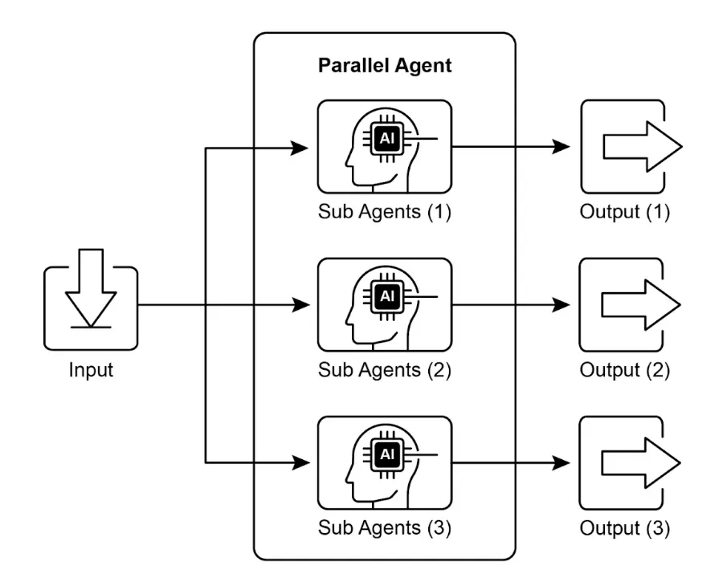
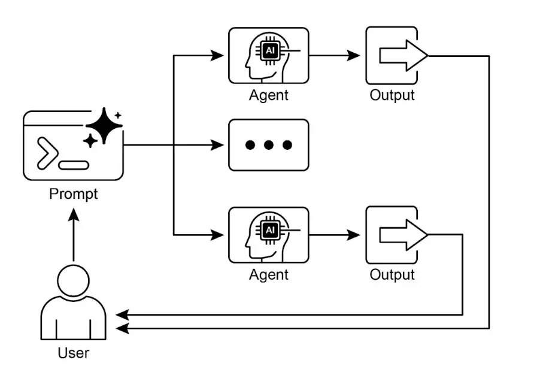

# 第 3 章：并行化

## 并行化模式概述

    在前几章中，我们已经介绍了用于顺序流程的提示链（Prompt Chaining），以及用于动态决策和路径切换的路由（Routing）。虽然这些模式非常重要，但许多复杂的智能体任务其实包含多个可以**同时**执行的子任务，而不是一个接一个地串行处理。这时，**并行化**设计模式就变得至关重要。

    并行化指的是同时执行多个组件，比如 LLM 调用、工具使用，甚至整个子智能体（见图 1）。与等待上一步完成再开始下一步不同，并行执行允许独立任务同时运行，大幅缩短可拆分为独立部分的任务的整体执行时间。

    举例来说，一个用于研究某主题并总结结果的智能体串行流程可能是：

1. 搜索来源 A
2. 总结来源 A
3. 搜索来源 B
4. 总结来源 B
5. 综合 A 和 B 的摘要，生成最终答案

    而并行流程则可以：

1. 同时搜索来源 A *和* 来源 B
2. 两个搜索完成后，同时总结来源 A *和* 来源 B
3. 综合 A 和 B 的摘要（这一步通常是串行的，需等待并行步骤完成）

    核心思想是识别流程中彼此无依赖的部分，并将它们并行执行。尤其在涉及外部服务（如 API 或数据库）有延迟时，可以同时发起多个请求，显著提升效率。

    实现并行化通常需要支持异步执行或多线程/多进程的框架。现代智能体框架普遍支持异步操作，允许你轻松定义可并行运行的步骤。



    图 1. 并行化与子智能体的示例

    LangChain、LangGraph 和 Google ADK 等框架都提供了并行执行机制。在 LangChain Expression Language（LCEL）中，可以通过将多个 `runnable` 对象组合（如 `|` 用于串行，结构化链或图分支用于并行）实现并行执行。LangGraph 通过图结构，允许你定义多个节点在同一状态转换下并发执行，实现流程的并行分支。Google ADK 则原生支持智能体并行执行，极大提升多智能体系统的效率和可扩展性。ADK 框架内置的并行能力让开发者可以设计多个智能体同时运行的解决方案，而非串行处理。

    并行化模式对于提升智能体系统的效率和响应速度至关重要，尤其适用于涉及多个独立查找、计算或外部服务交互的任务，是优化复杂智能体工作流性能的关键技术。

## 实践应用与场景

    并行化是优化智能体性能的强大模式，适用于多种场景：

1. 信息收集与调研：  
       同时从多个来源收集信息是典型用例。

   * **应用场景**：智能体调研某公司
   * **并行任务**：同时搜索新闻、拉取股票数据、检查社交媒体、查询公司数据库
   * **优势**：比串行查找更快获得全面视角
2. 数据处理与分析：  
       并行应用不同分析方法或处理不同数据片段。

   * **应用场景**：智能体分析客户反馈
   * **并行任务**：同时进行情感分析、关键词提取、分类、紧急问题识别
   * **优势**：快速获得多维度分析结果
3. 多 API 或工具交互：  
       并行调用多个独立 API 或工具，获取不同信息或执行不同操作。

   * **应用场景**：旅行规划智能体
   * **并行任务**：同时查机票、酒店、当地活动、餐厅推荐
   * **优势**：更快生成完整旅行方案
4. 多组件内容生成：  
       并行生成复杂内容的不同部分。

   * **应用场景**：智能体创建营销邮件
   * **并行任务**：同时生成主题、正文、图片、CTA 按钮文案
   * **优势**：更高效地组装最终邮件
5. 验证与校验：  
       并行执行多个独立校验任务。

   * **应用场景**：智能体验证用户输入
   * **并行任务**：同时检查邮箱格式、手机号、地址数据库校验、敏感词检测
   * **优势**：更快反馈输入有效性
6. 多模态处理：  
       并行处理同一输入的不同模态（文本、图片、音频）。

   * **应用场景**：智能体分析带图片的社交媒体帖子
   * **并行任务**：同时分析文本情感与关键词 *和* 图片中的物体与场景
   * **优势**：更快整合多模态洞察
7. A/B 测试或多方案生成：  
       并行生成多个响应或输出，便于选择最佳方案。

   * **应用场景**：智能体生成多种创意文案
   * **并行任务**：同时用不同 prompt 或模型生成三种标题
   * **优势**：快速对比并选出最佳选项

    并行化是智能体设计中的基础优化技术，开发者可通过并发执行独立任务，构建更高性能、更具响应性的应用。

## 实战代码示例（LangChain）

    在 LangChain 框架中，并行执行由 LangChain Expression Language（LCEL）实现。主要方法是将多个 `runnable` 组件结构化为字典或列表，当这些集合被传递给链中的下一个组件时，LCEL 运行时会并发执行其中的 `runnable`。

    在 LangGraph 中，这一原理体现在图的拓扑结构。通过设计图结构，使多个无直接依赖的节点可由同一节点并发启动，这些并行路径独立执行，结果在后续汇聚节点整合。

    以下代码演示了用 LangChain 构建的并行处理工作流。该流程针对单一用户查询，同时并发执行两个独立操作，并在最后聚合结果。

    实现前需安装 `langchain`、`langchain-community` 及模型库（如 `langchain-openai`），并配置有效的 API key。

```python
import os
import asyncio
from typing import Optional

from langchain_openai import ChatOpenAI
from langchain_core.prompts import ChatPromptTemplate
from langchain_core.output_parsers import StrOutputParser
from langchain_core.runnables import Runnable, RunnableParallel, RunnablePassthrough

# --- 配置 ---
# 确保环境变量已设置 API key（如 OPENAI_API_KEY）
try:
   llm: Optional[ChatOpenAI] = ChatOpenAI(model="gpt-4o-mini", temperature=0.7)
  
except Exception as e:
   print(f"初始化语言模型出错：{e}")
   llm = None

# --- 定义独立链 ---
# 三个链分别执行不同任务，可并行运行

summarize_chain: Runnable = (
   ChatPromptTemplate.from_messages([
       ("system", "请简明扼要地总结以下主题："),
       ("user", "{topic}")
   ])
   | llm
   | StrOutputParser()
)

questions_chain: Runnable = (
   ChatPromptTemplate.from_messages([
       ("system", "请针对以下主题生成三个有趣的问题："),
       ("user", "{topic}")
   ])
   | llm
   | StrOutputParser()
)

terms_chain: Runnable = (
   ChatPromptTemplate.from_messages([
       ("system", "请从以下主题中提取 5-10 个关键词，用逗号分隔："),
       ("user", "{topic}")
   ])
   | llm
   | StrOutputParser()
)

# --- 构建并行 + 汇总链 ---

# 1. 定义并行任务块，结果与原始 topic 一起传递到下一步
map_chain = RunnableParallel(
   {
       "summary": summarize_chain,
       "questions": questions_chain,
       "key_terms": terms_chain,
       "topic": RunnablePassthrough(),  # 传递原始 topic
   }
)

# 2. 定义最终汇总 prompt，整合并行结果
synthesis_prompt = ChatPromptTemplate.from_messages([
   ("system", """根据以下信息：
    摘要：{summary}
    相关问题：{questions}
    关键词：{key_terms}
    请综合生成完整答案。"""),
   ("user", "原始主题：{topic}")
])

# 3. 构建完整链，将并行结果直接传递给汇总 prompt，再由 LLM 和输出解析器处理
full_parallel_chain = map_chain | synthesis_prompt | llm | StrOutputParser()

# --- 运行链 ---
async def run_parallel_example(topic: str) -> None:
   """
   异步调用并行处理链，输出综合结果。

   Args:
       topic: 传递给 LangChain 的主题输入
   """
   if not llm:
       print("LLM 未初始化，无法运行示例。")
       return

   print(f"\n--- 并行 LangChain 示例，主题：'{topic}' ---")
   try:
       # `ainvoke` 的输入是单个 topic 字符串，
       # 会传递给 map_chain 中的每个 runnable
       response = await full_parallel_chain.ainvoke(topic)
       print("\n--- 最终响应 ---")
       print(response)
   except Exception as e:
       print(f"\n链执行出错：{e}")

if __name__ == "__main__":
   test_topic = "太空探索的历史"
   # Python 3.7+ 推荐用 asyncio.run 执行异步函数
   asyncio.run(run_parallel_example(test_topic))
```

    上述 Python 代码实现了一个 LangChain 应用，通过并行执行提升主题处理效率。注意 `asyncio` 提供的是并发而非真正的并行：它通过事件循环在任务空闲（如等待网络请求）时智能切换，实现多个任务“同时”推进，但实际仍在单线程下受 GIL 限制。

    代码首先导入 `langchain_openai` 和 `langchain_core` 的核心模块，包括模型、prompt、输出解析和 runnable 结构。通过 `try-except` 块初始化 `ChatOpenAI` 实例，指定模型和温度。随后定义三个独立的 LangChain“链”，分别用于主题摘要、问题生成和关键词提取，每个链由定制的 `ChatPromptTemplate`、LLM 和输出解析器组成。

    接着用 `RunnableParallel` 将三条链打包，实现并行执行，并用 `RunnablePassthrough` 保留原始输入。再定义一个汇总 prompt，整合 `summary`、`questions`、`key_terms` 和 `topic`，生成综合答案。最终构建完整处理链 `full_parallel_chain`，并提供异步函数 `run_parallel_example` 演示如何调用。主程序用 `asyncio.run` 执行示例主题“太空探索的历史”。

    本质上，该代码实现了针对单一主题的多路 LLM 并发调用（摘要、问题、关键词），并在最后用 LLM 汇总结果，充分展示了智能体工作流中的并行化核心思想。

## 实战代码示例（Google ADK）

    下面以 Google ADK 框架为例，展示如何用 ADK 原语（如 `ParallelAgent`、`SequentialAgent`）构建高效并发智能体流程。

```python
from google.adk.agents import LlmAgent, ParallelAgent, SequentialAgent
from google.adk.tools import google_search
GEMINI_MODEL="gemini-2.0-flash"

# --- 1. 定义并行运行的调研子智能体---

# 调研员 1：可再生能源
researcher_agent_1 = LlmAgent(
    name="RenewableEnergyResearcher",
    model=GEMINI_MODEL,
    instruction="""你是一名专注于能源领域的 AI 调研助手。
调研“可再生能源最新进展”，使用 Google Search 工具。
请简明总结关键发现（1-2 句），只输出摘要。
""",
    description="调研可再生能源。",
    tools=[google_search],
    output_key="renewable_energy_result"
)

# 调研员 2：电动汽车
researcher_agent_2 = LlmAgent(
    name="EVResearcher",
    model=GEMINI_MODEL,
    instruction="""你是一名专注于交通领域的 AI 调研助手。
调研“电动汽车技术最新进展”，使用 Google Search 工具。
请简明总结关键发现（1-2 句），只输出摘要。
""",
    description="调研电动汽车技术。",
    tools=[google_search],
    output_key="ev_technology_result"
)

# 调研员 3：碳捕集
researcher_agent_3 = LlmAgent(
    name="CarbonCaptureResearcher",
    model=GEMINI_MODEL,
    instruction="""你是一名专注于气候解决方案的 AI 调研助手。
调研“碳捕集方法现状”，使用 Google Search 工具。
请简明总结关键发现（1-2 句），只输出摘要。
""",
    description="调研碳捕集方法。",
    tools=[google_search],
    output_key="carbon_capture_result"
)

# --- 2. 创建并行智能体（并发运行调研员）---
parallel_research_agent = ParallelAgent(
    name="ParallelWebResearchAgent",
    sub_agents=[researcher_agent_1, researcher_agent_2, researcher_agent_3],
    description="并行运行多个调研智能体，收集信息。"
)

# --- 3. 定义合并智能体（并行智能体完成后运行）---
merger_agent = LlmAgent(
    name="SynthesisAgent",
    model=GEMINI_MODEL,
    instruction="""你是一名负责整合调研结果的 AI 助手。
你的任务是将以下调研摘要合成为结构化报告，并明确归属。每个主题用标题分段，确保内容连贯，仅整合输入摘要。

**注意：你的全部回答必须严格基于下方“输入摘要”，不得添加任何外部知识或细节。**

**输入摘要：**

*   **可再生能源：**
    {renewable_energy_result}
*   **电动汽车：**
    {ev_technology_result}
*   **碳捕集：**
    {carbon_capture_result}

**输出格式：**

## 可持续技术最新进展摘要

### 可再生能源发现
（基于 RenewableEnergyResearcher 的摘要，仅整合上述内容）

### 电动汽车发现
（基于 EVResearcher 的摘要，仅整合上述内容）

### 碳捕集发现
（基于 CarbonCaptureResearcher 的摘要，仅整合上述内容）

### 总结
（仅基于上述内容，简要总结 1-2 句）

只输出结构化报告，严格按上述格式，不加其他说明。
""",
    description="整合并行智能体的调研结果，生成结构化报告，仅基于输入内容。",
)

# --- 4. 创建串行智能体（总流程控制）---
sequential_pipeline_agent = SequentialAgent(
    name="ResearchAndSynthesisPipeline",
    sub_agents=[parallel_research_agent, merger_agent],
    description="协调并行调研与结果整合。"
)
root_agent = sequential_pipeline_agent
```

    上述代码定义了一个多智能体系统，用于调研并整合可持续技术进展。三个 Llm 智能体分别作为调研员，聚焦可再生能源、电动汽车和碳捕集，每个智能体使用 `GEMINI_MODEL` 和 `google_search` 工具，摘要结果存入 session state。

    `ParallelAgent` 并行运行三位调研员，调研任务同步进行，节省时间。`ParallelAgent` 完成后，`MergerAgent` 负责整合调研结果，要求输出仅基于输入摘要，结构化分段，不添加外部知识。

    最后，`SequentialAgent` 串行执行并行调研和结果整合，作为主流程入口。整体流程高效收集多源信息并合并为单一结构化报告。

## 一图速览

    **是什么**：许多智能体工作流包含多个子任务，必须全部完成才能达成最终目标。纯串行执行（每步等待前一步完成）效率低下，尤其在依赖外部 I/O（如多 API、数据库查询）时，总耗时为各任务之和，严重影响系统性能和响应速度。

    **为什么**：并行化模式通过同时执行独立任务，显著提升效率。它通过识别流程中无依赖的部分（如工具调用、LLM 推理），并发运行这些组件。LangChain、Google ADK 等框架内置并行构造，主流程可同时触发多个子任务，待全部完成后再进入下一步。这样总耗时大幅缩短。

    **经验法则**：当流程包含多个可独立运行的操作（如多 API 拉取、数据分块处理、多内容生成），应采用并行化模式。

    **视觉摘要**



    图 2：并行化设计模式

## 关键要点

    主要结论如下：

* 并行化是一种通过并发执行独立任务提升效率的设计模式
* 尤其适用于涉及外部资源（如 API 调用）等待的场景
* 并发/并行架构会增加设计、调试和日志等开发复杂度与成本
* LangChain、Google ADK 等框架均支持并行执行定义与管理
* LCEL 中 `RunnableParallel` 是并行运行多个 `runnable` 的关键构造
* Google ADK 可通过 LLM 驱动的委托，实现协调智能体并行处理子任务
* 并行化可显著降低整体延迟，让智能体系统在复杂任务下更具响应性

## 总结

    并行化模式是一种通过同时执行独立子任务优化计算流程的方法，尤其适用于涉及多次模型推理或外部服务调用的复杂操作，可有效降低整体延迟。

    各框架实现机制不同：LangChain 用 `RunnableParallel` 明确定义并行处理链；Google ADK 则可通过多智能体委托，由主协调模型分派子任务并并发执行。

    将并行处理与串行（链式）和条件（路由）控制流结合，可构建高性能、复杂任务管理能力强的智能体系统。

## 参考资料

    进一步阅读并行化设计模式及相关概念：

* [LangChain Expression Language (LCEL) 文档 – 并行处理](https://python.langchain.com/docs/concepts/lcel/)
* [Google Agent Developer Kit (ADK) 文档 – 多智能体系统](https://google.github.io/adk-docs/agents/multi-agents/)
* [Python asyncio 官方文档](https://docs.python.org/3/library/asyncio.html)
