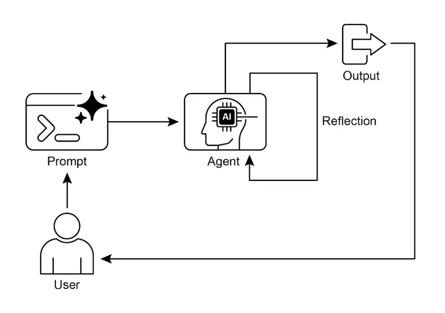
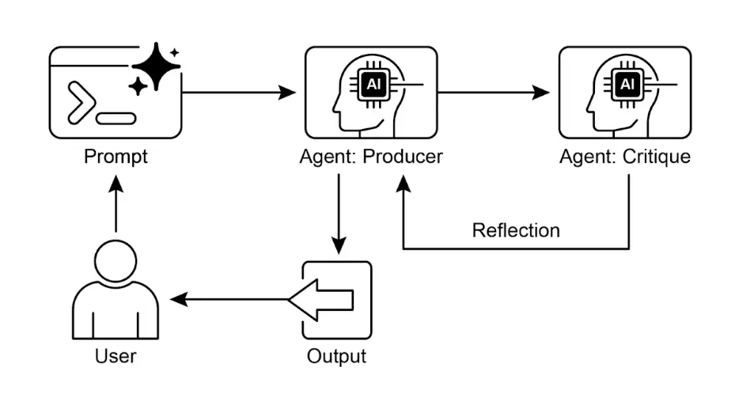

# 第 4 章：反思（Reflection）

## 反思模式概述

    在前几章中，我们已经探讨了基础的智能体模式：链式执行（Chaining）、路径选择（Routing）和并行化（Parallelization）。这些模式让智能体能够更高效、更灵活地完成复杂任务。然而，即使拥有复杂的工作流，智能体的初始输出或计划也可能并不理想、准确或完整。这时，**反思**（Reflection）模式就发挥了作用。

    反思模式指的是智能体对自身的工作、输出或内部状态进行评估，并利用评估结果来提升性能或优化响应。这是一种自我纠错或自我改进机制，使智能体能够根据反馈、内部批判或与目标标准的对比，反复优化输出或调整策略。反思有时也可以由专门负责分析初始智能体输出的独立智能体来实现。

    与简单的链式传递或路径选择不同，反思引入了反馈循环。智能体不仅仅生成输出，还会审视该输出（或生成过程），识别潜在问题或改进空间，并据此生成更优版本或调整后续行为。

    典型流程包括：

1. **执行**：智能体完成任务或生成初始输出。
2. **评估/批判**：Agent（通常通过另一次 LLM 调用或规则集）分析上一步结果，检查事实准确性、连贯性、风格、完整性、是否遵循指令等。
3. **反思/优化**：根据批判结果，智能体决定如何改进，可能生成优化后的输出、调整参数，甚至修改整体计划。
4. **迭代（可选但常见）**：优化后的输出或调整后的方案再次执行，反思过程可重复，直到达到满意结果或满足终止条件。

    一种高效的反思实现方式是将流程分为两个逻辑角色：生产者（Producer）和批评者（Critic），即“生成者 - 批评者”或“生产者 - 审阅者”模型。虽然单一智能体可以自我反思，但采用两个专门智能体（或两次 LLM 调用，分别使用不同系统提示）通常能获得更客观、更结构化的结果。

1. 生产者智能体：负责任务的初步执行，专注于内容生成，如编写代码、撰写博客或制定计划。它根据初始提示生成第一版输出。
2. 批评者智能体：专门评估生产者生成的输出，拥有不同的指令和角色设定（如“你是一名资深软件工程师”、“你是一名严谨的事实核查员”）。批评者根据特定标准（如事实准确性、代码质量、风格要求、完整性等）分析生产者的工作，发现问题、提出改进建议并给出结构化反馈。

    这种分工能有效避免智能体自我评审时的“认知偏差”。批评者以全新视角专注于发现错误和改进空间，其反馈再传递给生产者，指导其生成更优版本。下方 LangChain 和 ADK 的代码示例均采用了双智能体模型：LangChain 示例通过 `reflector_prompt` 创建批评者角色，ADK 示例则明确定义了生产者和审阅者智能体。

    实现反思通常需要在智能体工作流中引入反馈循环，可通过代码中的迭代循环或支持状态管理和条件跳转的框架实现。虽然单步评估和优化可在 LangChain/LangGraph、ADK 或 Crew.AI 链中实现，真正的迭代反思则需要更复杂的编排。

    反思模式对于构建能够输出高质量结果、处理复杂任务、具备一定自我意识和适应性的智能体至关重要。它让智能体不仅仅是执行指令，更具备高级问题解决和内容生成能力。

    反思与目标设定和监控（见[第 11 章](ch11-goal-setting.md)）的结合值得关注。目标为智能体自我评估提供最终标准，监控则跟踪其进展。在实际应用中，反思常作为纠错引擎，利用监控反馈分析偏差并调整策略。这种协同让智能体从被动执行者转变为主动适应目标的系统。

    此外，反思模式在 LLM 具备对话记忆（见[第 8 章](ch08-memory.md)）时效果显著提升。对话历史为评估阶段提供关键上下文，使智能体不仅能孤立地评估输出，还能结合过往互动、用户反馈和目标变化进行判断。智能体能从过去的批判中学习，避免重复错误。没有记忆时，每次反思都是独立事件；有记忆时，反思成为累积过程，每轮迭代都在前一轮基础上进步，实现更智能、具备上下文感知的优化。

## 实践应用与场景

    反思模式适用于对输出质量、准确性或复杂约束要求较高的场景：

1. 创意写作与内容生成：  
       优化生成的文本、故事、诗歌或营销文案。

   * **应用场景**：智能体撰写博客文章。
   * **反思过程**：生成初稿，批判其流畅度、语气和清晰度，然后根据批判重写。重复直到达到质量标准。
   * **优势**：产出更精致、更有效的内容。
2. 代码生成与调试：  
       编写代码、发现错误并修复。

   * **应用场景**：智能体编写 Python 函数。
   * **反思过程**：编写初始代码，运行测试或静态分析，发现错误或低效之处，然后根据发现修改代码。
   * **优势**：生成更健壮、功能更完善的代码。
3. 复杂问题求解：  
       在多步推理任务中评估中间步骤或方案。

   * **应用场景**：智能体解逻辑谜题。
   * **反思过程**：提出一步方案，评估是否更接近解决方案或引入矛盾，如有问题则回溯或选择其他步骤。
   * **优势**：提升智能体在复杂问题空间中的导航能力。
4. 摘要与信息整合：  
       优化摘要的准确性、完整性和简洁性。

   * **应用场景**：智能体总结长文档。
   * **反思过程**：生成初步摘要，与原文关键点对比，优化摘要以补充遗漏信息或提升准确性。
   * **优势**：生成更准确、全面的摘要。
5. 规划与策略制定：  
       评估方案并发现潜在缺陷或改进点。

   * **应用场景**：智能体制定达成目标的行动计划。
   * **反思过程**：生成计划，模拟执行或根据约束评估可行性，依据评估结果修订计划。
   * **优势**：制定更有效、现实的方案。
6. 对话智能体：  
       回顾对话历史，保持上下文、纠正误解或提升响应质量。

   * **应用场景**：客服聊天机器人。
   * **反思过程**：用户回复后，回顾对话历史和上一条消息，确保连贯性并准确回应用户最新输入。
   * **优势**：实现更自然、更有效的对话。

    反思为智能体系统增加了元认知层，使其能从自身输出和过程学习，带来更智能、可靠、高质量的结果。

## 实战代码示例（LangChain）

    完整的迭代反思过程需要状态管理和循环执行机制。虽然图式框架如 LangGraph 或自定义过程代码可原生支持这些机制，单步反思循环可通过 LCEL（LangChain Expression Language）组合语法高效演示。

    以下示例使用 LangChain 库和 OpenAI GPT-4o 模型，迭代生成并优化一个计算阶乘的 Python 函数。流程从任务提示开始，生成初始代码，然后以“资深软件工程师”角色反复批判并优化代码，直到批判阶段认定代码完美或达到最大迭代次数，最后输出优化后的代码。

    首先确保安装必要库：

```bash
pip install langchain langchain-community langchain-openai
```

    还需设置环境变量，配置所选语言模型的 API key（如 OpenAI、Google Gemini、Anthropic）。

```python
import os
from dotenv import load_dotenv
from langchain_openai import ChatOpenAI
from langchain_core.prompts import ChatPromptTemplate
from langchain_core.messages import SystemMessage, HumanMessage

# --- 配置 ---
# 从 .env 文件加载环境变量（用于 OPENAI_API_KEY）
load_dotenv()

# 检查 API key 是否设置
if not os.getenv("OPENAI_API_KEY"):
   raise ValueError("OPENAI_API_KEY 未在 .env 文件中找到，请添加。")

# 初始化 Chat LLM，使用 gpt-4o，低温度保证输出确定性
llm = ChatOpenAI(model="gpt-4o", temperature=0.1)

def run_reflection_loop():
   """
   演示多步 AI 反思循环，逐步优化 Python 函数。
   """
   # --- 核心任务 ---
   task_prompt = """
   你的任务是创建一个名为 `calculate_factorial` 的 Python 函数。
   该函数需满足以下要求：
   1. 只接受一个整数参数 n。
   2. 计算其阶乘（n!）。
   3. 包含清晰的 docstring，说明函数功能。
   4. 处理边界情况：0 的阶乘为 1。
   5. 处理无效输入：若输入为负数则抛出 ValueError。
   """
   # --- 反思循环 ---
   max_iterations = 3
   current_code = ""
   # 构建对话历史，为每步提供上下文
   message_history = [HumanMessage(content=task_prompt)]


   for i in range(max_iterations):
       print("\n" + "="*25 + f" 反思循环：第 {i + 1} 次迭代 " + "="*25)

       # --- 1. 生成/优化阶段 ---
       # 首次迭代为生成，后续为优化
       if i == 0:
           print("\n>>> 阶段 1：生成初始代码...")
           # 首条消息为任务提示
           response = llm.invoke(message_history)
           current_code = response.content
       else:
           print("\n>>> 阶段 1：根据批判优化代码...")
           # 消息历史包含任务、上次代码和批判
           # 指示模型应用批判意见优化代码
           message_history.append(HumanMessage(content="请根据批判意见优化代码。"))
           response = llm.invoke(message_history)
           current_code = response.content

       print("\n--- 生成代码（第 " + str(i + 1) + " 版） ---\n" + current_code)
       message_history.append(response) # 将生成代码加入历史

       # --- 2. 反思阶段 ---
       print("\n>>> 阶段 2：对生成代码进行反思...")

       # 为批判者 Agent 创建专用提示
       # 要求模型以资深代码审查员身份批判代码
       reflector_prompt = [
           SystemMessage(content="""
               你是一名资深软件工程师，精通 Python。
               你的职责是对提供的 Python 代码进行细致代码审查。
               请根据原始任务要求，严格评估代码。
               检查是否有 bug、风格问题、遗漏边界情况及其他可改进之处。
               若代码完美且满足所有要求，仅回复 'CODE_IS_PERFECT'。
               否则，请以项目符号列表形式给出批判意见。
           """),
           HumanMessage(content=f"原始任务：\n{task_prompt}\n\n待审查代码：\n{current_code}")
       ]

       critique_response = llm.invoke(reflector_prompt)
       critique = critique_response.content

       # --- 3. 停止条件 ---
       if "CODE_IS_PERFECT" in critique:
           print("\n--- 批判 ---\n未发现进一步批判，代码已达要求。")
           break

       print("\n--- 批判 ---\n" + critique)
       # 将批判意见加入历史，供下轮优化使用
       message_history.append(HumanMessage(content=f"上次代码批判意见：\n{critique}"))

   print("\n" + "="*30 + " 最终结果 " + "="*30)
   print("\n反思流程优化后的最终代码：\n")
   print(current_code)

if __name__ == "__main__":
   run_reflection_loop()
```

    上述代码首先完成环境配置、API key 加载和强大语言模型初始化（如 GPT-4o，低温度保证输出专注）。核心任务通过提示定义，要求编写一个计算阶乘的 Python 函数，需包含 `docstring`、边界处理（0 的阶乘）、负数报错等。`run_reflection_loop` 函数负责迭代优化流程。循环中，首次迭代根据任务提示生成代码，后续迭代根据上一步批判意见优化代码。批判角色（同样由语言模型扮演，但系统提示不同）以资深工程师身份，针对原始任务要求批判生成代码，若无问题则回复 `CODE_IS_PERFECT`，否则以项目符号列出问题。循环直到代码被认定为完美或达到最大迭代次数。每步都维护对话历史，确保生成/优化和反思阶段有完整上下文。最后输出最终优化后的代码版本。

## 实战代码示例（ADK）

    下面是使用 Google ADK 实现的概念代码示例，采用生成者 - 批评者结构：一部分（Generator）生成初始结果或方案，另一部分（Critic）提供批判性反馈，指导生成者优化输出。

```python
from google.adk.agents import SequentialAgent, LlmAgent

# 第一个 Agent 生成初稿
generator = LlmAgent(
   name="DraftWriter",
   description="根据主题生成初稿内容。",
   instruction="写一段简短、信息丰富的主题段落。",
   output_key="draft_text" # 输出保存到此状态键
)

# 第二个 Agent 批判初稿
reviewer = LlmAgent(
   name="FactChecker",
   description="审查文本的事实准确性并给出结构化批判。",
   instruction="""
   你是一名严谨的事实核查员。
   1. 阅读状态键 'draft_text' 中的文本。
   2. 仔细核查所有事实性表述。
   3. 最终输出必须为包含两个键的字典：
      - "status"：字符串，"ACCURATE" 或 "INACCURATE"。
      - "reasoning"：字符串，清晰解释你的判断，若有问题需具体说明。
   """,
   output_key="review_output" # 结构化字典保存到此
)

# SequentialAgent 保证 generator 先运行，reviewer 后运行
review_pipeline = SequentialAgent(
   name="WriteAndReview_Pipeline",
   sub_agents=[generator, reviewer]
)

# 执行流程：
# 1. generator 运行 -> 输出段落保存到 state['draft_text']。
# 2. reviewer 运行 -> 读取 state['draft_text']，输出字典保存到 state['review_output']。
```

    该代码演示了 Google ADK 的顺序智能体管道，用于文本生成和审查。

* 定义了两个 `LlmAgent`：

  + `generator` 负责生成主题段落，输出保存到 `draft_text`；
  + `reviewer` 作为事实核查员，读取 `draft_text`，核查事实准确性，输出包含 `status` 和 `reasoning` 的结构化字典，保存到 `review_output`。
* `SequentialAgent` 管理执行顺序，确保先生成后批判。整体流程为：`generator` 生成文本并保存，`reviewer` 读取文本、批判并保存结果。此管道实现了内容生成与审查的结构化流程。

    **注意：ADK 还可用 LoopAgent 实现循环反思。**

    最后需要注意，虽然反思模式显著提升输出质量，但也带来重要权衡。迭代过程每次优化都需新的 LLM 调用，导致成本和延迟增加，不适合对时效性要求高的场景。此外，该模式对内存消耗较大，每次迭代都会扩展对话历史，包括初始输出、批判和后续优化内容。

## 一图速览

    **是什么**：智能体初始输出常常不理想，存在不准确、不完整或未满足复杂要求的问题。基础智能体工作流缺乏智能体自我识别和修正错误的机制。通过让智能体自评或引入独立批评者角色，可以避免初始响应质量不达标的问题。

    **为什么**：反思模式通过引入自我纠错和优化机制，建立“生产者”生成输出、“批评者”评估输出的反馈循环。批判意见用于生成更优版本，迭代提升最终结果的质量、准确性和一致性。

    **经验法则**：当最终输出的质量、准确性和细节比速度和成本更重要时，优先采用反思模式。适用于生成高质量长文、代码编写与调试、详细规划等任务。任务需高客观性或专业评估时，建议采用独立批评者智能体。

    **视觉摘要**



    图 1：反思设计模式，自我反思流程



    图 2：反思设计模式，生产者与批评者 Agent

## 关键要点

* 反思模式的核心优势是能迭代自我纠错和优化输出，显著提升质量、准确性和复杂指令的遵循度。
* 包含执行、评估/批判和优化的反馈循环，适用于高质量、准确或复杂输出任务。
* 强大的实现方式是生产者 - 批评者模型，独立智能体评估初始输出，分工提升客观性和结构化反馈。
* 但需权衡延迟和计算成本增加，以及模型上下文窗口溢出或 API 限流风险。
* 完整迭代反思需有状态工作流（如 LangGraph），单步反思可在 LangChain 用 LCEL 实现输出批判和优化。
* Google ADK 可通过顺序工作流实现反思，一智能体输出由另一智能体批判，支持后续优化。
* 该模式让智能体具备自我纠错和持续性能提升能力。

## 总结

    反思模式为智能体工作流提供了关键的自我纠错机制，实现了超越单次执行的迭代优化。其核心是建立一个循环：系统生成输出，按特定标准评估，再利用评估结果生成优化版本。评估可由智能体自评，也可由独立批评者智能体完成，这是该模式中的重要架构选择。

    完整的多步反思过程需要健壮的状态管理架构，但其核心原理可通过单次生成 - 批判 - 优化循环高效演示。作为控制结构，反思可与其他基础模式结合，构建更健壮、功能更复杂的智能体系统。

## 参考资料

    以下资源推荐用于进一步学习反思模式及相关智能体概念：

* [训练语言模型自我纠错的强化学习方法 - arxiv.org](https://arxiv.org/abs/2409.12917)
* [LangChain Expression Language (LCEL) 文档 - python.langchain.com](https://python.langchain.com/docs/introduction/)
* [LangGraph 文档 - langchain.com](https://www.langchain.com/langgraph)
* [Google Agent Developer Kit (ADK) 文档：多 Agent 系统 - google.github.io](https://google.github.io/adk-docs/agents/multi-agents/)
