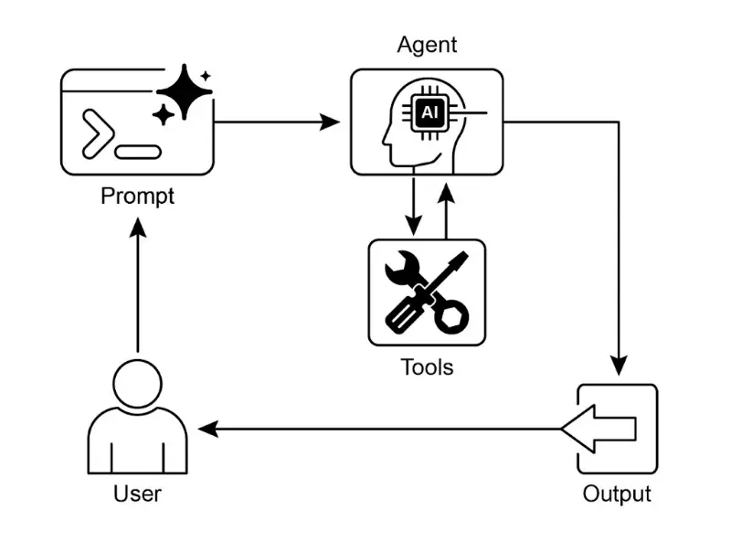

# 第 5 章：工具使用（函数调用）

## 工具使用模式概述

    到目前为止，我们讨论的智能体模式主要涉及在智能体内部工作流中编排语言模型的交互和信息流（如链式、路由、并行化、反思）。然而，要让智能体真正有用并能与现实世界或外部系统交互，就必须具备“工具使用”能力。

    工具使用模式通常通过“函数调用”机制实现，使智能体能够与外部 API、数据库、服务甚至执行代码进行交互。它允许智能体核心的 LLM 根据用户请求或任务当前状态，决定何时以及如何调用特定的外部函数。

    典型流程包括：

1. **工具定义**：向 LLM 描述外部函数或能力，包括函数用途、名称、参数类型及说明。
2. **LLM 决策**：LLM 接收用户请求和可用工具定义，根据理解判断是否需要调用一个或多个工具来完成请求。
3. **函数调用生成**：如果 LLM 决定使用工具，会生成结构化输出（通常为 JSON），指定要调用的工具名称及参数（从用户请求中提取）。
4. **工具执行**：智能体框架或编排层拦截结构化输出，识别请求的工具并用提供的参数实际执行外部函数。
5. **观察/结果**：工具执行的输出或结果返回给智能体。
6. **LLM 处理（可选但常见）**：LLM 将工具输出作为上下文，用于生成最终回复或决定下一步（可能再次调用工具、反思或直接答复）。

    该模式至关重要，因为它突破了 LLM 训练数据的限制，使其能够访问最新信息、执行内部无法完成的计算、操作用户专属数据或触发现实世界动作。函数调用是连接 LLM 推理能力与丰富外部功能的技术桥梁。

    虽然“函数调用”准确描述了调用特定预定义代码函数的过程，但更广义的“工具调用”概念更具包容性。工具不仅可以是传统函数，还可以是复杂的 API 接口、数据库请求，甚至是面向其他智能体的指令。这样可以构建更复杂的系统，例如主智能体将数据分析任务委托给专门的“分析智能体”，或通过 API 查询外部知识库。以“工具调用”为视角，更能体现智能体作为数字资源和其他智能实体编排者的潜力。

    LangChain、LangGraph、Google Agent Developer Kit（ADK）等框架都支持工具定义和集成，通常利用现代 LLM（如 Gemini、OpenAI 系列）的原生函数调用能力。在这些框架中，你可以定义工具，并配置智能体（通常是 LLM 智能体）具备使用这些工具的能力。

    工具使用是构建强大、交互性强、具备外部感知能力智能体的基石模式。

## 实践应用与场景

    工具使用模式几乎适用于所有智能体需要超越文本生成、执行动作或获取动态信息的场景：

1. 外部信息检索：  
       获取 LLM 训练数据之外的实时数据或信息。

   * **案例**：天气智能体
   * **工具**：天气 API，输入地点返回当前天气
   * **流程**：用户问“伦敦天气如何？”，LLM 识别需要天气工具，调用工具，工具返回数据，LLM 格式化回复。
2. 与数据库和 API 交互：  
       查询、更新或操作结构化数据。

   * **案例**：电商智能体
   * **工具**：查询库存、订单状态、支付等 API
   * **流程**：用户问“X 产品有货吗？”，LLM 调用库存 API，工具返回库存数，LLM 告知用户。
3. 计算与数据分析：  
       使用外部计算器、数据分析库或统计工具。

   * **案例**：金融智能体
   * **工具**：计算器函数、股票数据 API、表格工具
   * **流程**：用户问“AAPL 当前价格及买入 100 股的潜在利润”，LLM 调用股票 API，再调用计算器工具，整合结果回复。
4. 发送通讯：  
       发送邮件、消息或调用外部通讯服务 API。

   * **案例**：个人助理智能体
   * **工具**：邮件发送 API
   * **流程**：用户说“给 John 发会议邮件”，LLM 提取收件人、主题、正文，调用邮件工具。
5. 执行代码：  
       在安全环境中运行代码片段完成特定任务。

   * **案例**：编程助手智能体
   * **工具**：代码解释器
   * **流程**：用户提供 Python 代码并问“这段代码做什么？”，LLM 用解释器工具运行并分析输出。
6. 控制其他系统或设备：  
       操作智能家居、物联网平台等。

   * **案例**：智能家居智能体
   * **工具**：控制智能灯的 API
   * **流程**：用户说“关闭客厅灯”，LLM 调用智能家居工具，传递命令和目标设备。

    工具使用让语言模型从文本生成器转变为具备感知、推理和行动能力的智能体（见图 1）。


    图 1：智能体使用工具的示例

## 实战代码示例（LangChain）

    在 LangChain 框架中实现工具使用分为两步：首先定义工具（通常封装现有 Python 函数或可运行组件），然后将工具绑定到语言模型，使模型在需要时能生成结构化的工具调用请求。

    以下代码演示了如何定义一个信息检索工具，并构建一个能使用该工具的智能体。运行需安装 LangChain 核心库和模型相关包，并配置 API 密钥。

```python
import os, getpass
import asyncio
import nest_asyncio
from typing import List
from dotenv import load_dotenv
import logging

from langchain_google_genai import ChatGoogleGenerativeAI
from langchain_core.prompts import ChatPromptTemplate
from langchain_core.tools import tool as langchain_tool
from langchain.agents import create_tool_calling_agent, AgentExecutor

# 安全输入 API 密钥并设置为环境变量
os.environ["GOOGLE_API_KEY"] = getpass.getpass("输入你的 Google API 密钥：")
os.environ["OPENAI_API_KEY"] = getpass.getpass("输入你的 OpenAI API 密钥：")

try:
  # 初始化具备工具调用能力的模型
  llm = ChatGoogleGenerativeAI(model="gemini-2.0-flash", temperature=0)
  print(f"✅ 语言模型已初始化：{llm.model}")
except Exception as e:
  print(f"🛑 初始化语言模型出错：{e}")
  llm = None

# --- 定义工具 ---
@langchain_tool
def search_information(query: str) -> str:
  """
  根据主题提供事实信息。用于回答如“法国首都”或“伦敦天气？”等问题。
  """
  print(f"\n--- 🛠️ 工具调用：search_information, 查询：'{query}' ---")
  # 用预设结果模拟搜索工具
  simulated_results = {
      "weather in london": "伦敦当前天气多云，气温 15°C。",
      "capital of france": "法国的首都是巴黎。",
      "population of earth": "地球人口约 80 亿。",
      "tallest mountain": "珠穆朗玛峰是海拔最高的山峰。",
      "default": f"模拟搜索 '{query}'：未找到具体信息，但该主题很有趣。"
  }
  result = simulated_results.get(query.lower(), simulated_results["default"])
  print(f"--- 工具结果：{result} ---")
  return result

tools = [search_information]

# --- 创建工具调用 Agent ---
if llm:
  agent_prompt = ChatPromptTemplate.from_messages([
      ("system", "你是一个乐于助人的助手。"),
      ("human", "{input}"),
      ("placeholder", "{agent_scratchpad}"),
  ])

  agent = create_tool_calling_agent(llm, tools, agent_prompt)
  agent_executor = AgentExecutor(agent=agent, verbose=True, tools=tools)

async def run_agent_with_tool(query: str):
  """用 Agent 执行查询并打印最终回复。"""
  print(f"\n--- 🏃 Agent 运行查询：'{query}' ---")
  try:
      response = await agent_executor.ainvoke({"input": query})
      print("\n--- ✅ Agent 最终回复 ---")
      print(response["output"])
  except Exception as e:
      print(f"\n🛑 Agent 执行出错：{e}")

async def main():
  """并发运行多个 Agent 查询。"""
  tasks = [
      run_agent_with_tool("What is the capital of France?"),
      run_agent_with_tool("What's the weather like in London?"),
      run_agent_with_tool("Tell me something about dogs.") # 触发默认工具回复
  ]
  await asyncio.gather(*tasks)

nest_asyncio.apply()
asyncio.run(main())
```

    该代码使用 LangChain 和 Google Gemini 模型创建了一个工具调用智能体，定义了 `search_information` 工具，模拟对特定查询的事实回答。模型初始化后，创建了带工具和提示模板的智能体，并用智能体 `Executor` 管理工具调用。`run_agent_with_tool` 异步函数用于执行查询并输出结果，`main` 函数并发运行多个查询，测试工具的特定和默认回复。

## 实战代码示例（CrewAI）

    以下代码展示了如何在 CrewAI 框架中实现函数调用（工具使用），设置了一个能查找股票价格的工具和智能体。

```python
# pip install crewai langchain-openai

import os
from crewai import Agent, Task, Crew
from crewai.tools import tool
import logging

logging.basicConfig(level=logging.INFO, format='%(asctime)s - %(levelname)s - %(message)s')

# 推荐用环境变量或密钥管理工具安全设置 API 密钥
# os.environ["OPENAI_API_KEY"] = "你的 API 密钥"
# os.environ["OPENAI_MODEL_NAME"] = "gpt-4o"

@tool("股票价格查询工具")
def get_stock_price(ticker: str) -> float:
   """
   获取指定股票代码的最新模拟价格。返回 float，未找到则抛出 ValueError。
   """
   logging.info(f"工具调用：get_stock_price, 股票代码 '{ticker}'")
   simulated_prices = {
       "AAPL": 178.15,
       "GOOGL": 1750.30,
       "MSFT": 425.50,
   }
   price = simulated_prices.get(ticker.upper())

   if price is not None:
       return price
   else:
       raise ValueError(f"未找到 '{ticker.upper()}' 的模拟价格。")

financial_analyst_agent = Agent(
 role='高级金融分析师',
 goal='使用工具分析股票数据并报告关键价格。',
 backstory="你是一名经验丰富的金融分析师，擅长使用数据源查找股票信息，回答简明直接。",
 verbose=True,
 tools=[get_stock_price],
 allow_delegation=False,
)

analyze_aapl_task = Task(
 description=(
     "苹果（AAPL）当前模拟股价是多少？请用“股票价格查询工具”查找。"
     "如果未找到代码，需明确说明无法获取价格。"
 ),
 expected_output=(
     "用一句话说明 AAPL 的模拟股价，如：'AAPL 的模拟股价为 $178.15。'"
     "如果无法找到价格，也要明确说明。"
 ),
 agent=financial_analyst_agent,
)

financial_crew = Crew(
 agents=[financial_analyst_agent],
 tasks=[analyze_aapl_task],
 verbose=True
)

def main():
   """主函数运行 Crew。"""
   if not os.environ.get("OPENAI_API_KEY"):
       print("错误：未设置 OPENAI_API_KEY 环境变量。")
       print("请设置后再运行脚本。")
       return

   print("\n## 启动金融 Crew...")
   print("---------------------------------")
  
   result = financial_crew.kickoff()

   print("\n---------------------------------")
   print("## Crew 执行结束。")
   print("\n最终结果:\n", result)

if __name__ == "__main__":
   main()
```

    该代码用 `Crew.ai` 库模拟金融分析任务，定义了 `get_stock_price` 工具，返回指定股票代码的模拟价格或抛出异常。创建了金融分析师智能体并分配工具，定义了任务并组建 Crew，主函数检查 API 密钥后运行任务并输出结果。代码包含日志配置和环境变量管理建议。

## 实战代码（Google ADK）

    Google Agent Developer Kit（ADK）内置了可直接集成到智能体能力中的工具库。

    **Google 搜索**：这是一个直接连接 Google 搜索引擎的工具，智能体可用它进行网页检索和外部信息获取。

```python
from google.adk.agents import Agent
from google.adk.runners import Runner
from google.adk.sessions import InMemorySessionService
from google.adk.tools import google_search
from google.genai import types
import nest_asyncio
import asyncio

APP_NAME="Google Search_agent"
USER_ID="user1234"
SESSION_ID="1234"

root_agent = ADKAgent(
  name="basic_search_agent",
  model="gemini-2.0-flash-exp",
  description="通过 Google 搜索回答问题的 Agent。",
  instruction="我可以通过搜索互联网回答你的问题，尽管问我任何事！",
  tools=[google_search]
)

async def call_agent(query):
  """调用 Agent 并输出回复。"""
  session_service = InMemorySessionService()
  session = await session_service.create_session(app_name=APP_NAME, user_id=USER_ID, session_id=SESSION_ID)
  runner = Runner(agent=root_agent, app_name=APP_NAME, session_service=session_service)

  content = types.Content(role='user', parts=[types.Part(text=query)])
  events = runner.run(user_id=USER_ID, session_id=SESSION_ID, new_message=content)

  for event in events:
      if event.is_final_response():
          final_response = event.content.parts[0].text
          print("Agent 回复：", final_response)

nest_asyncio.apply()
asyncio.run(call_agent("最新的 AI 新闻有哪些？"))
```

    该代码演示了如何用 Google ADK 创建一个能用 Google 搜索工具回答问题的智能体。定义了智能体、会话服务和 `Runner`，通过 `call_agent` 函数发送查询并输出最终回复。

    **代码执行**：Google ADK 集成了专用任务组件，包括内置代码执行工具，允许智能体在沙箱环境运行 Python 代码，适用于需要确定性逻辑和精确计算的问题。

```python
import os, getpass
import asyncio
import nest_asyncio
from typing import List
from dotenv import load_dotenv
import logging
from google.adk.agents import Agent as ADKAgent, LlmAgent
from google.adk.runners import Runner
from google.adk.sessions import InMemorySessionService
from google.adk.tools import google_search
from google.adk.code_executors import BuiltInCodeExecutor
from google.genai import types

APP_NAME="calculator"
USER_ID="user1234"
SESSION_ID="session_code_exec_async"

code_agent = LlmAgent(
  name="calculator_agent",
  model="gemini-2.0-flash",
  code_executor=BuiltInCodeExecutor(),
  instruction="""你是一个计算器 Agent。
  收到数学表达式时，编写并执行 Python 代码计算结果。
  只返回最终数值结果，勿用 markdown 或代码块。""",
  description="执行 Python 代码完成计算。",
)

async def call_agent_async(query):
  session_service = InMemorySessionService()
  session = await session_service.create_session(app_name=APP_NAME, user_id=USER_ID, session_id=SESSION_ID)
  runner = Runner(agent=code_agent, app_name=APP_NAME, session_service=session_service)

  content = types.Content(role='user', parts=[types.Part(text=query)])
  print(f"\n--- 运行查询：{query} ---")
  try:
      async for event in runner.run_async(user_id=USER_ID, session_id=SESSION_ID, new_message=content):
          if event.content and event.content.parts and event.is_final_response():
              for part in event.content.parts:
                  if part.executable_code:
                      print(f"  调试：生成代码:\n```python\n{part.executable_code.code}\n```")
                  elif part.code_execution_result:
                      print(f"  调试：代码执行结果：{part.code_execution_result.outcome} - 输出:\n{part.code_execution_result.output}")
                  elif part.text and not part.text.isspace():
                      print(f"  文本：'{part.text.strip()}'")
              text_parts = [part.text for part in event.content.parts if part.text]
              final_result = "".join(text_parts)
              print(f"==> Agent 最终回复：{final_result}")

  except Exception as e:
      print(f"运行出错：{e}")
  print("-" * 30)

async def main():
  await call_agent_async("计算 (5 + 7) * 3 的值")
  await call_agent_async("10 的阶乘是多少？")

try:
  nest_asyncio.apply()
  asyncio.run(main())
except RuntimeError as e:
  if "cannot be called from a running event loop" in str(e):
      print("\n已在事件循环环境（如 Colab/Jupyter）运行。请直接用 `await main()`。")
  else:
      raise e
```

    该脚本用 Google ADK 创建了一个能编写并执行 Python 代码的计算器智能体。主逻辑在 `call_agent_async` 函数，异步发送查询并处理事件，输出生成代码和执行结果，`main` 函数演示了两个数学问题的计算过程。

    **企业搜索**：该代码用 `google.adk` 库定义了一个 `VSearchAgent`，能通过 Vertex AI Search 数据库检索并回答问题。配置好 `DATASTORE_ID` 后，定义智能体、Runner 和会话服务，异步函数 `call_vsearch_agent_async` 用于发送查询并流式输出回复，支持源信息归因和异常处理。

```python
import asyncio
from google.genai import types
from google.adk import agents
from google.adk.runners import Runner
from google.adk.sessions import InMemorySessionService
import os

DATASTORE_ID = os.environ.get("DATASTORE_ID")
APP_NAME = "vsearch_app"
USER_ID = "user_123"
SESSION_ID = "session_456"

vsearch_agent = agents.VSearchAgent(
   name="q2_strategy_vsearch_agent",
   description="用 Vertex AI Search 回答 Q2 战略文档相关问题。",
   model="gemini-2.0-flash-exp",
   datastore_id=DATASTORE_ID,
   model_parameters={"temperature": 0.0}
)

runner = Runner(
   agent=vsearch_agent,
   app_name=APP_NAME,
   session_service=InMemorySessionService(),
)

async def call_vsearch_agent_async(query: str):
   print(f"用户：{query}")
   print("Agent:", end="", flush=True)

   try:
       content = types.Content(role='user', parts=[types.Part(text=query)])
       async for event in runner.run_async(
           user_id=USER_ID,
           session_id=SESSION_ID,
           new_message=content
       ):
           if hasattr(event, 'content_part_delta') and event.content_part_delta:
               print(event.content_part_delta.text, end="", flush=True)
           if event.is_final_response():
               print()
               if event.grounding_metadata:
                   print(f"（来源归因：{len(event.grounding_metadata.grounding_attributions)} 个来源）")
               else:
                   print("（未找到来源元数据）")
               print("-" * 30)

   except Exception as e:
       print(f"\n出错：{e}")
       print("请检查 datastore ID 是否正确及服务账号权限。")
       print("-" * 30)

async def run_vsearch_example():
   await call_vsearch_agent_async("总结 Q2 战略文档的要点。")
   await call_vsearch_agent_async("实验室 X 的安全流程有哪些？")

if __name__ == "__main__":
   if not DATASTORE_ID:
       print("错误：未设置 DATASTORE_ID 环境变量。")
   else:
       try:
           asyncio.run(run_vsearch_example())
       except RuntimeError as e:
           if "cannot be called from a running event loop" in str(e):
               print("事件循环环境下跳过执行，请直接运行脚本。")
           else:
               raise e
```

    该代码为构建基于 Vertex AI Search 的对话式 AI 应用提供了基础框架，支持定义智能体、Runner、异步交互和流式输出。

    **Vertex 扩展**：Vertex AI 扩展是一种结构化 API 封装，使模型能连接外部 API 实现实时数据处理和动作执行。扩展具备企业级安全、数据隐私和性能保障，可用于代码生成与运行、网站查询、私有数据分析等。Google 提供了常用扩展（如代码解释器、Vertex AI Search），也支持自定义。扩展的主要优势是自动执行和企业集成，而函数调用则需用户或客户端手动执行。

## 一图速览

    **是什么**：LLM 是强大的文本生成器，但本质上与外部世界隔离，知识静态且有限，无法执行动作或获取实时信息。这一限制使其难以解决需要与外部 API、数据库或服务交互的实际问题。

    **为什么**：工具使用模式（函数调用）为此提供了标准化解决方案。通过向 LLM 描述可用外部函数（工具），智能体可根据用户请求决定是否需要工具，并生成结构化数据（如 JSON）指定调用哪个函数及参数。编排层执行函数调用，获取结果并反馈给 LLM，使其能整合最新外部信息或动作结果，具备行动能力。

    **经验法则**：只要智能体需要突破 LLM 内部知识、与外部世界交互（如实时数据、私有信息、精确计算、代码执行、系统控制），就应采用工具使用模式。

    **视觉总结**：



    图 2：工具使用设计模式

## 关键要点

* 工具使用（函数调用）让智能体能与外部系统交互，获取动态信息。
* 需定义工具并清晰描述参数，便于 LLM 理解。
* LLM 决定何时使用工具并生成结构化调用请求。
* 智能体框架实际执行工具调用并返回结果。
* 工具使用是构建能执行现实动作、提供最新信息智能体的关键。
* LangChain 用 `@tool` 装饰器简化工具定义，并提供 `create_tool_calling_agent` 和智能体 `Executor` 构建工具智能体。
* Google ADK 内置了如 Google 搜索、代码执行、Vertex AI Search 等实用工具。

## 总结

    工具使用模式是扩展大语言模型功能边界的关键架构原则。通过让模型能与外部软件和数据源接口，智能体可执行动作、计算和信息检索。该过程包括模型在判断需要时生成结构化请求调用外部工具。LangChain、Google ADK、Crew AI 等框架提供了工具集成的结构化抽象和组件，简化了工具规范暴露和调用请求解析，助力开发能与外部数字环境交互的智能体系统。

## 参考文献

* [LangChain 文档（工具） - python.langchain.com](https://python.langchain.com/docs/integrations/tools/)
* [Google Agent Developer Kit (ADK) 文档（工具） - google.github.io](https://google.github.io/adk-docs/tools/)
* [OpenAI 函数调用文档 - platform.openai.com](https://platform.openai.com/docs/guides/function-calling)
* [CrewAI 文档（工具） - docs.crewai.com](https://docs.crewai.com/concepts/tools)
