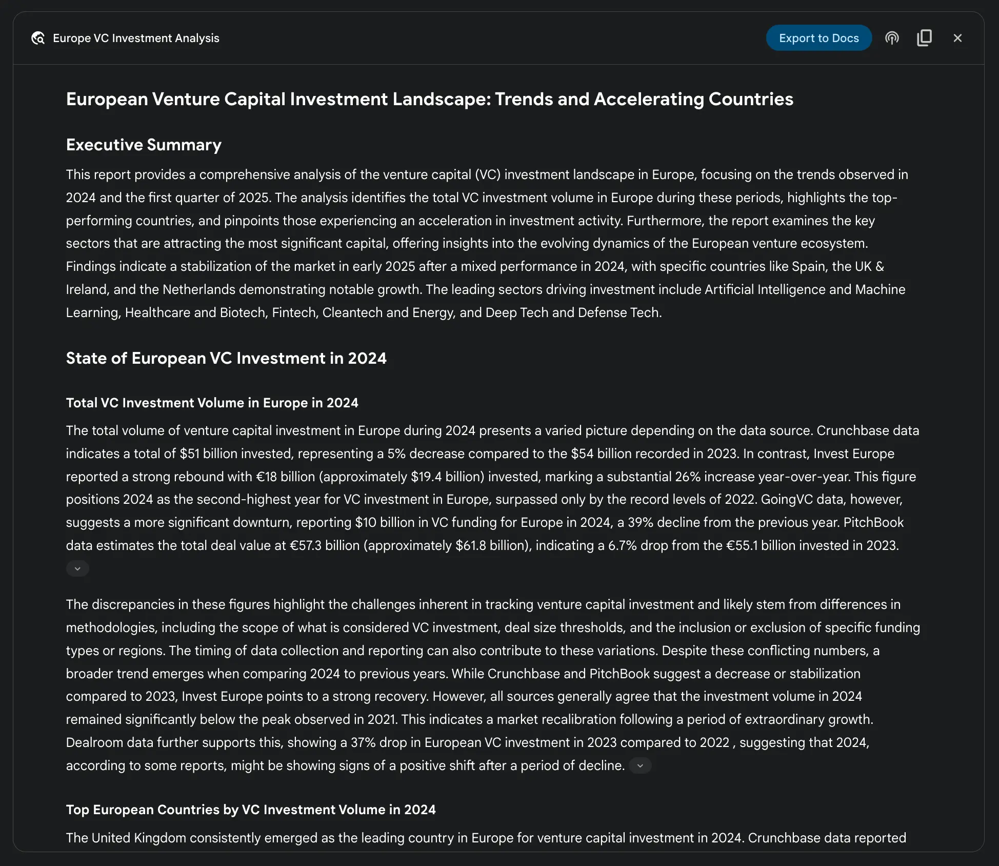
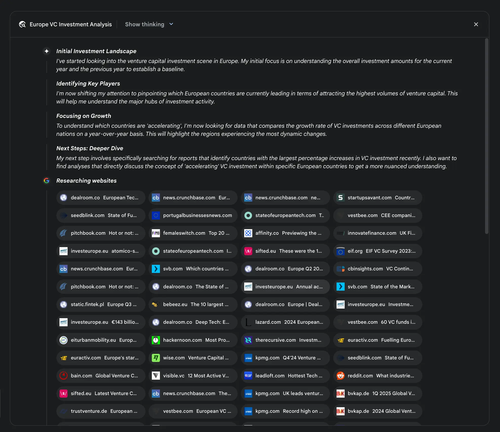
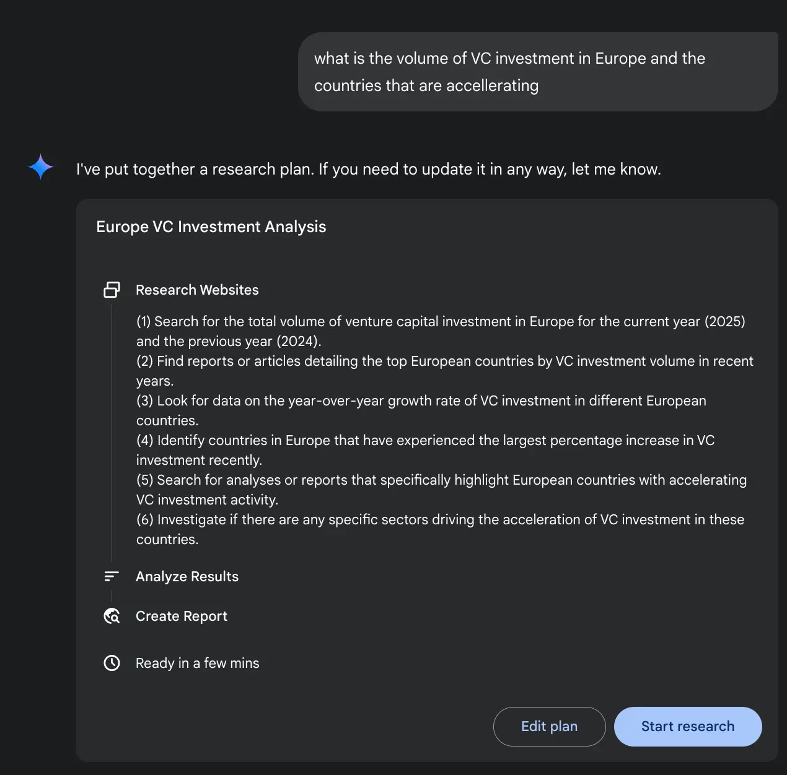
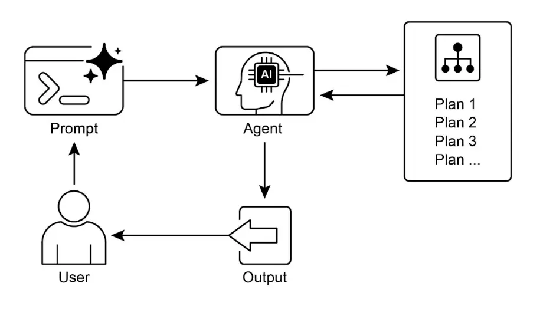

# 第 6 章：规划

    智能行为不仅仅是对当前输入做出反应，更需要前瞻性思考，将复杂任务拆解为可管理的小步骤，并制定实现目标的策略。这正是“规划”模式的核心。规划本质上是智能体或智能体系统能够制定一系列行动，从初始状态逐步迈向目标状态的能力。

## 规划模式概述

    在 AI 领域，可以将规划智能体视为你委托复杂目标的专家。当你让它“组织一次团队团建”，你定义的是“做什么”——目标及约束条件，而不是“怎么做”。智能体的核心任务是自主制定通往目标的路径。它首先要理解初始状态（如预算、参与人数、期望日期）和目标状态（成功预订团建活动），然后发现连接两者的最优行动序列。计划并非预先设定，而是根据请求动态生成。

    这一过程的显著特征是适应性。初始计划只是起点，而非死板剧本。智能体的真正能力在于能根据新信息调整方向，灵活应对障碍。例如，如果首选场地不可用或餐饮供应商已满，优秀的智能体不会直接失败，而是会适应变化，重新评估选项，制定新计划，比如建议替代场地或调整日期。

    但也要认识到灵活性与可预测性之间的权衡。动态规划是一种特定工具，并非万能方案。当问题的解决路径已知且可重复时，约束智能体按照预定、固定流程执行更有效。这种方式限制了智能体的自主性，减少了不确定性和不可预测行为，确保结果可靠一致。因此，是否采用规划智能体，关键在于“怎么做”需不需要探索，还是已经明确。

## 实践应用与场景

    规划模式是自主系统中的核心计算过程，使智能体能够在动态或复杂环境下，合成一系列行动以达成指定目标，将高层目标转化为结构化、可执行的步骤。

    在流程自动化领域，规划用于编排复杂工作流。例如，企业新员工入职流程可拆解为创建系统账号、分配培训模块、协调各部门等子任务。智能体生成计划，按逻辑顺序执行这些步骤，调用必要工具或与系统交互以管理依赖关系。

    在机器人与自主导航领域，规划是状态空间遍历的基础。无论是实体机器人还是虚拟系统，都需生成路径或行动序列，从初始状态到目标状态，优化时间或能耗等指标，同时遵守环境约束，如避障或遵守交通规则。

    该模式也适用于结构化信息合成。例如，生成复杂报告时，智能体可制定计划，分阶段进行信息收集、数据摘要、内容结构化和迭代完善。在多步骤客户支持场景中，智能体可制定并执行系统化的诊断、解决和升级流程。

    总之，规划模式让智能体超越简单反应，具备面向目标的行为，为解决需要一系列相互依赖操作的问题提供逻辑框架。

## 实战代码（Crew AI）

    以下代码演示了如何用 Crew AI 框架实现规划者模式。智能体首先制定多步骤计划以解决复杂问题，然后按顺序执行。

```python
import os
from dotenv import load_dotenv
from crewai import Agent, Task, Crew, Process
from langchain_openai import ChatOpenAI

# 加载 .env 文件中的环境变量，保障安全
load_dotenv()

# 1. 明确指定语言模型
llm = ChatOpenAI(model="gpt-4-turbo")

# 2. 定义专注且目标明确的智能体
planner_writer_agent = Agent(
   role='文章规划与写作专家',
   goal='规划并撰写指定主题的简明、吸引人的摘要。',
   backstory=(
       '你是一名资深技术写手和内容策略师。'
       '你的优势在于写作前先制定清晰可执行的计划，'
       '确保最终摘要既信息丰富又易于理解。'
   ),
   verbose=True,
   allow_delegation=False,
   llm=llm # 绑定指定 LLM
)

# 3. 定义结构化且具体的任务
topic = "强化学习在 AI 中的重要性"
high_level_task = Task(
   description=(
       f"1. 针对主题“{topic}”制定摘要的要点计划（项目符号列表）。\n"
       f"2. 根据计划撰写约 200 字的摘要。"
   ),
   expected_output=(
       "最终报告包含两个部分：\n\n"
       "### 计划\n"
       "- 摘要主要观点的项目符号列表。\n\n"
       "### 摘要\n"
       "- 主题的简明、结构化总结。"
   ),
   agent=planner_writer_agent,
)

# 创建 Crew，指定顺序处理流程
crew = Crew(
   agents=[planner_writer_agent],
   tasks=[high_level_task],
   process=Process.sequential,
)

# 执行任务
print("## 正在运行规划与写作任务 ##")
result = crew.kickoff()

print("\n\n---\n## 任务结果 ##\n---")
print(result)
```

    上述代码使用 CrewAI 库创建了一个智能体，负责规划并撰写指定主题的摘要。首先导入必要库并加载环境变量，明确指定 ChatOpenAI 语言模型。创建名为 `planner_writer_agent` 的智能体，设定其角色和目标，强调规划与技术写作能力。定义任务，要求先制定摘要计划，再根据计划撰写内容，并规定输出格式。组建 Crew，指定顺序处理，最后调用 `crew.kickoff()` 执行任务并输出结果。

## Google DeepResearch

    Google Gemini DeepResearch（见图 1）是一个面向自主信息检索与合成的智能体系统。它通过多步骤智能体管道，动态迭代地调用 Google 搜索，系统性地探索复杂主题。系统能够处理大量网页资源，评估数据相关性与知识空缺，并据此进行后续搜索。最终输出为结构化、多页摘要，并附有原始来源引用。

    系统运行并非一次性问答，而是受控的长流程。它首先将用户请求拆解为多点研究计划（见图 1），并展示给用户审核和修改，实现协同规划。计划确认后，智能体管道启动迭代搜索与分析循环。智能体不仅执行预设搜索，还会根据收集到的信息动态调整查询，主动发现知识空缺、验证数据点、解决矛盾。



    图 1：Google Deep Research 智能体生成使用 Google 搜索的执行计划。

    系统架构的关键在于异步管理流程，确保即使分析数百个来源也能抵抗单点故障，用户可随时离开并在任务完成后收到通知。系统还可整合用户私有文档，将内部信息与网络数据融合。最终输出不仅是信息列表，而是结构化、多页报告。合成阶段，模型对收集信息进行评估，提炼主题，按逻辑分节组织内容。报告通常包含音频概览、图表和原始引用链接，便于用户验证和深入探索。模型还会返回所有检索和参考的来源列表（见图 2），以引用形式呈现，确保透明和可追溯。这一流程将简单查询转化为全面、系统化的知识成果。



    图 2：Deep Research 执行计划示例，智能体使用 Google 搜索工具检索多种网络资源。

    Gemini DeepResearch 显著降低了手动数据收集与合成的时间和资源消耗，尤其适用于复杂、多维度研究任务。

    例如，在竞品分析中，智能体可系统性收集市场趋势、竞品参数、网络舆情和营销策略等数据，自动化流程替代人工跟踪，分析师可专注于战略解读而非数据收集（见图 3）。



    图 3：Google Deep Research 智能体生成的最终输出，分析通过 Google 搜索获得的来源。

    在学术探索中，系统可高效完成文献综述，识别和总结基础论文，追踪概念发展，梳理领域前沿，加速学术调研的初始阶段。

    该方法的效率源于自动化迭代搜索与筛选环节，这是人工研究的核心瓶颈。系统能处理远超人工的数据量和多样性，提升分析广度，减少选择偏差，更易发现关键但不显眼的信息，从而获得更全面、可靠的理解。

## OpenAI Deep Research API

    OpenAI Deep Research API 是专为自动化复杂研究任务设计的工具。它采用先进的智能体模型，能自主推理、规划并从真实世界来源合成信息。与简单问答模型不同，它会将高层查询拆解为子问题，利用内置工具进行网络搜索，最终生成结构化、带引用的报告。API 提供完整流程的编程访问，目前支持如 `o3-deep-research-2025-06-26`（高质量合成）和 `o4-mini-deep-research-2025-06-26`（低延迟应用）等模型。

    该 API 的优势在于自动化原本需数小时的人工研究，输出专业级、数据驱动的报告，适用于业务决策、投资分析或政策建议。主要特点包括：

* **结构化带引用输出**：生成有条理的报告，内嵌引用并关联来源元数据，确保结论可验证、数据有据可查。
* **透明性**：与 ChatGPT 的黑箱过程不同，API 公开所有中间步骤，包括智能体推理、具体搜索查询和代码执行，便于调试和深入分析。
* **可扩展性**：支持 Model Context Protocol (MCP)，开发者可连接私有知识库和内部数据，实现公私融合检索。

    使用方法：向 `client.responses.create` 端点发送请求，指定模型、输入提示和可用工具。输入通常包括定义智能体角色和输出格式的 `system_message`，以及用户查询。必须包含 `web_search_preview` 工具，可选添加 `code_interpreter` 或 MCP 工具（见第十章）用于内部数据。

```python
from openai import OpenAI

# 用你的 API 密钥初始化客户端
client = OpenAI(api_key="YOUR_OPENAI_API_KEY")

# 定义智能体角色和用户研究问题
system_message = """你是一名专业研究员，需撰写结构化、数据驱动的报告。
关注数据洞见，使用可靠来源，并在正文中插入引用。"""
user_query = "研究司美格鲁肽对全球医疗体系的经济影响。"

# 创建 Deep Research API 调用
response = client.responses.create(
 model="o3-deep-research-2025-06-26",
 input=[
   {
     "role": "developer",
     "content": [{"type": "input_text", "text": system_message}]
   },
   {
     "role": "user",
     "content": [{"type": "input_text", "text": user_query}]
   }
 ],
 reasoning={"summary": "auto"},
 tools=[{"type": "web_search_preview"}]
)

# 获取并打印最终报告
final_report = response.output[-1].content[0].text
print(final_report)

# --- 获取内嵌引用和元数据 ---
print("--- 引用 ---")
annotations = response.output[-1].content[0].annotations

if not annotations:
   print("报告中未发现引用。")
else:
   for i, citation in enumerate(annotations):
       # 被引用的文本片段
       cited_text = final_report[citation.start_index:citation.end_index]

       print(f"引用 {i+1}:")
       print(f"  被引用文本：{cited_text}")
       print(f"  标题：{citation.title}")
       print(f"  链接：{citation.url}")
       print(f"  位置：字符 {citation.start_index}–{citation.end_index}")
print("\n" + "="*50 + "\n")

# --- 检查中间步骤 ---
print("--- 中间步骤 ---")

# 1. 推理步骤：模型生成的内部计划和摘要
try:
   reasoning_step = next(item for item in response.output if item.type == "reasoning")
   print("\n[发现推理步骤]")
   for summary_part in reasoning_step.summary:
       print(f"  - {summary_part.text}")
except StopIteration:
   print("\n未发现推理步骤。")

# 2. 网络搜索调用：智能体实际执行的搜索查询
try:
   search_step = next(item for item in response.output if item.type == "web_search_call")
   print("\n[发现网络搜索调用]")
   print(f"  执行查询：'{search_step.action['query']}'")
   print(f"  状态：{search_step.status}")
except StopIteration:
   print("\n未发现网络搜索步骤。")

# 3. 代码执行：智能体使用代码解释器运行的代码
try:
   code_step = next(item for item in response.output if item.type == "code_interpreter_call")
   print("\n[发现代码执行步骤]")
   print("  输入代码：")
   print(f"  ```python\n{code_step.input}\n  ```")
   print("  输出结果：")
   print(f"  {code_step.output}")
except StopIteration:
   print("\n未发现代码执行步骤。")
```

    上述代码利用 OpenAI API 执行“深度研究”任务。首先用 API 密钥初始化客户端，定义智能体角色和用户研究问题。构造 API 调用，指定模型、输入和工具，要求自动推理摘要并启用网络搜索。调用后，提取并打印最终报告。

    随后，尝试获取报告中的引用和元数据，包括被引用文本、标题、链接和位置。最后，检查并输出模型的中间步骤，如推理、搜索和代码执行，便于分析智能体的推理和操作过程。

## 一图速览

    **是什么**：复杂问题往往无法通过单一行动解决，需要前瞻性思考才能实现目标。没有结构化方法，智能体系统难以应对多步骤、依赖关系复杂的请求，难以将高层目标拆解为可执行的小任务，导致面对复杂目标时策略不足，结果不完整或错误。

    **为什么**：规划模式通过让智能体系统先制定解决目标的连贯计划，标准化了流程。它将高层目标拆解为一系列可执行的小步骤或子目标，使系统能有序管理复杂工作流、协调工具、处理依赖。大模型尤其擅长根据任务描述生成合理有效的计划。结构化方法让智能体从被动反应者转变为主动战略执行者，能适应变化并动态调整计划。

    **经验法则**：当用户请求过于复杂，无法通过单一行动或工具完成时，应采用规划模式。它非常适合自动化多步骤流程，如生成详细研究报告、新员工入职或执行竞品分析。只要任务需要一系列相互依赖的操作以实现最终综合结果，都建议应用规划模式。

    **可视化总结**



    图 4：规划设计模式

## 关键要点

* 规划使智能体能够将复杂目标拆解为可执行的、顺序化的步骤。
* 该模式对于处理多步骤任务、工作流自动化和复杂环境导航至关重要。
* 大语言模型可根据任务描述生成逐步规划，实现自动化分解与执行。
* 明确提示或设计任务要求规划步骤，可在智能体框架中激发此类行为。
* Google Deep Research 是一个智能体，利用 Google 搜索工具为用户分析信息来源，具备反思、规划和执行能力。

## 总结

    综上，规划模式是推动智能体系统从简单反应者向战略型、目标导向执行者转变的基础。现代大语言模型具备自动将高层目标分解为连贯可执行步骤的核心能力。该模式既适用于如 Crew 智能体制定并执行写作计划的顺序任务，也能扩展到更复杂、动态的系统。Google DeepResearch 智能体则展示了高级应用，通过持续信息收集，迭代生成和调整研究计划。归根结底，规划为复杂问题搭建了人类意图与自动化执行之间的桥梁，使智能体能够管理复杂工作流，输出全面、结构化的结果。

## 参考资料

* [Google DeepResearch（Gemini 功能）- gemini.google.com](https://gemini.google.com)
* [OpenAI：Introducing Deep Research - openai.com](https://openai.com/index/introducing-deep-research/)
* [Perplexity：Introducing Perplexity Deep Research - perplexity.ai](https://www.perplexity.ai/hub/blog/introducing-perplexity-deep-research)
