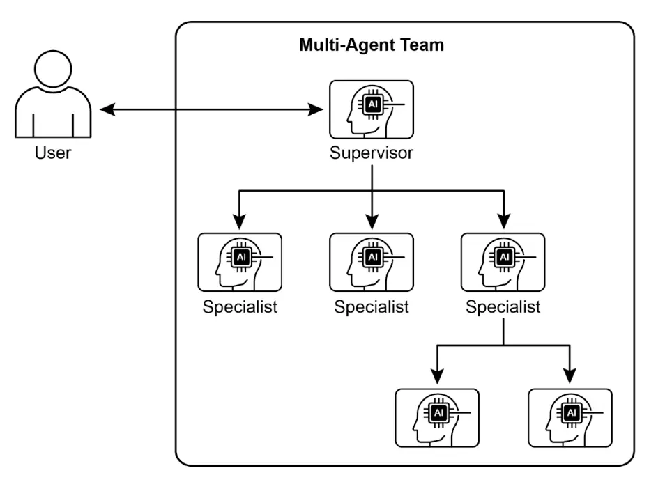
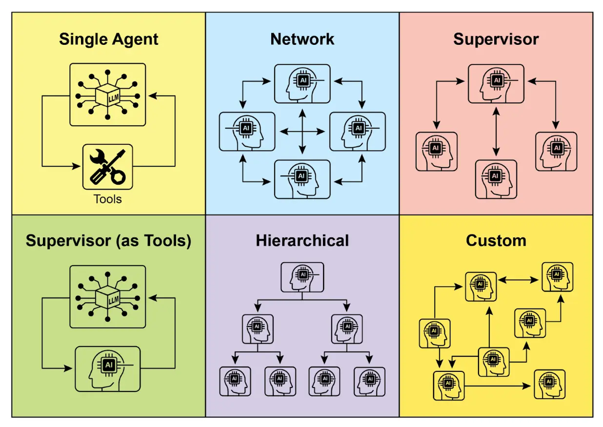
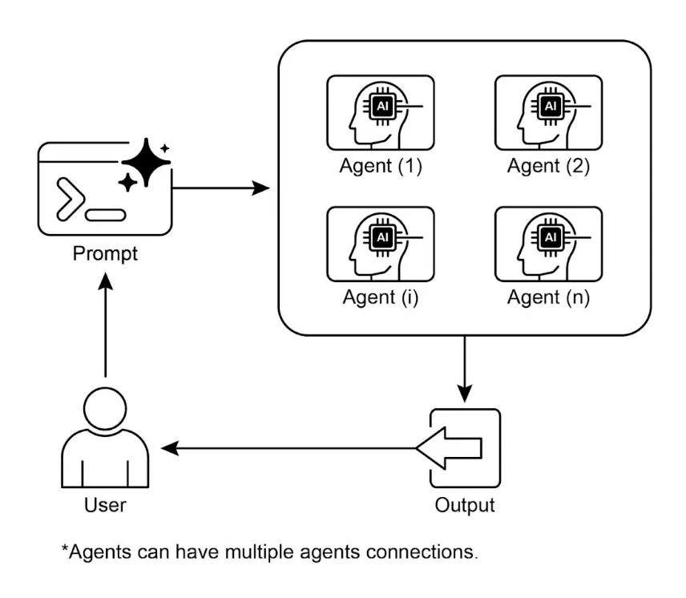

# 第 7 章：多智能体协作

    虽然单一智能体架构在处理明确问题时较为高效，但面对复杂、多领域任务时，其能力往往受限。多智能体协作模式通过将系统结构化为多个独立且专用的智能体协作团队，解决了这一局限。该模式基于任务分解原则，将高层目标拆分为若干子问题，并分配给具备相应工具、数据访问或推理能力的智能体。

    例如，复杂的研究查询可拆分为信息检索由“研究智能体”负责，统计分析由“数据分析智能体”完成，最终报告由“综合智能体”生成。系统的高效不仅源于分工，更依赖于智能体间的通信机制——这需要标准化的通信协议和共享本体，使智能体能够交换数据、委派子任务并协调行动，确保最终输出一致。

    这种分布式架构具备模块化、可扩展和健壮性等优势，单一智能体故障不会导致系统整体失效。协作带来的协同效应，使多智能体系统的整体性能远超任何单一智能体。

## 多智能体协作模式概述

    多智能体协作模式设计系统时，多个独立或半独立智能体共同实现目标。每个智能体有明确角色、目标，并可能访问不同工具或知识库。该模式的核心在于智能体间的互动与协同。

    协作形式包括：

* **顺序交接**：一个智能体完成任务后，将输出传递给下一个智能体（类似规划模式，但明确涉及不同智能体）。
* **并行处理**：多个智能体同时处理问题不同部分，结果后续合并。
* **辩论与共识**：智能体基于不同视角和信息源讨论，最终达成共识或更优决策。
* **层级结构**：管理者智能体根据工具或插件能力动态分配任务给工作智能体，并综合结果。每个智能体可管理相关工具组，而非单一智能体处理所有工具。
* **专家团队**：不同领域专长智能体（如研究员、写作者、编辑）协作完成复杂输出。
* **批评 - 审查者**：智能体生成初步输出（如计划、草稿、答案），另一组智能体对其进行政策、安全、合规、正确性、质量和目标对齐等评审，原作者或最终智能体根据反馈修订。该模式在代码生成、研究写作、逻辑检查和伦理对齐等场景尤为有效，优势包括健壮性提升、质量改善和减少幻觉或错误。

    多智能体系统（见图 1）本质包括智能体角色与职责划分、通信通道建立，以及任务流程或交互协议的制定。



    图 1：多智能体系统示例

    Crew AI、Google ADK 等框架为该模式提供智能体、任务及交互流程的规范化结构，尤其适用于需要多领域知识、多个阶段或并行处理与信息互证的复杂挑战。

## 实践应用与场景

    多智能体协作广泛适用于各类领域：

* **复杂研究与分析**：团队智能体协作完成研究项目，如一智能体专注学术检索，另一智能体负责总结，第三智能体发现趋势，第四智能体综合成报告，类似人类研究团队分工。
* **软件开发**：智能体协作开发软件，如需求分析、代码生成、测试、文档编写等角色分工，输出逐步传递与验证。
* **创意内容生成**：营销活动可由市场调研、文案、设计（图像生成工具）、社媒排期等智能体协作完成。
* **金融分析**：多智能体系统分析金融市场，如数据抓取、新闻情绪分析、技术分析、投资建议等分工。
* **客户支持升级**：前线支持智能体处理初步问题，复杂问题升级至专家智能体（如技术或账单专家），体现基于问题复杂度的顺序交接。
* **供应链优化**：智能体代表供应链各节点（供应商、制造商、分销商），协作优化库存、物流与排程，应对需求变化或突发事件。
* **网络分析与修复**：自治运维场景下，智能体架构有助于故障定位，多智能体协作进行分级处理与修复，并可集成传统机器学习模型与工具，兼顾现有系统与生成式 AI 优势。

    通过智能体专长划分与关系精细编排，开发者可构建具备更强模块化、可扩展性和复杂问题处理能力的系统。

## 多智能体协作：关系与通信结构探析

    理解智能体间的交互与通信方式，是设计高效多智能体系统的基础。如下图 2 所示，智能体关系与通信模型从最简单的单智能体到复杂的定制协作结构，呈现多样化选择。每种模型有独特优势与挑战，影响系统整体效率、健壮性与适应性。

1. **单智能体**：最基础模型，智能体独立运行，无需与其他实体交互，适合可拆分为独立子问题的场景，但能力受限。
2. **网络型**：多个智能体以去中心化方式直接交互，点对点通信，信息、资源和任务共享，具备弹性，但通信管理和决策一致性较难。
3. **监督者**：专门智能体“监督者”协调下属智能体，负责通信、任务分配和冲突解决，层级结构清晰，易于管理，但存在单点故障和瓶颈风险。
4. **工具型监督者**：监督者不直接指挥，而是为其他智能体提供资源、指导或分析支持，赋能而非强制控制，提升灵活性。
5. **层级型**：多层监督者结构，高层监督者管理低层监督者，底层为操作智能体，适合复杂问题分层管理，便于扩展和分布式决策。
6. **定制型**：最灵活模型，针对具体问题或应用定制独特关系与通信结构，可混合前述模型或创新设计，适合优化特定性能、动态环境或领域知识集成。定制模型需深入理解多智能体原理，慎重设计通信协议、协调机制与涌现行为。



    图 2：智能体间多种通信与交互方式

    综上，多智能体系统的关系与通信模型选择至关重要，应结合任务复杂度、智能体数量、自治需求、健壮性和通信开销等因素权衡。未来多智能体系统将持续探索和优化这些模型，推动协同智能新范式发展。

## 实战代码（Crew AI）

    以下 Python 代码展示如何用 CrewAI 框架定义一个 AI 协作团队生成 AI 趋势博客。首先加载环境变量和 API 密钥，定义两名智能体：研究员负责查找并总结 AI 趋势，写作者根据研究结果撰写博客。

    对应定义两个任务：研究任务和写作任务，写作任务依赖研究任务输出。将智能体和任务组装为 Crew，指定顺序执行流程，使用 Gemini 2.0 Flash 模型。主函数通过 `kickoff()` 方法执行团队协作，最终输出生成的博客内容。

```python
import os
from dotenv import load_dotenv
from crewai import Agent, Task, Crew, Process
from langchain_google_genai import ChatGoogleGenerativeAI

def setup_environment():
    """加载环境变量并检查 API 密钥。"""
    load_dotenv()
    if not os.getenv("GOOGLE_API_KEY"):
         raise ValueError("GOOGLE_API_KEY 未设置，请在 .env 文件中配置。")

def main():
    """
    初始化并运行内容创作 AI 团队，使用最新 Gemini 模型。
    """
    setup_environment()

    # 指定语言模型
    llm = ChatGoogleGenerativeAI(model="gemini-2.0-flash")

    # 定义 Agent 角色与目标
    researcher = Agent(
         role='高级研究分析师',
         goal='查找并总结 AI 最新趋势。',
         backstory="你是一名经验丰富的研究分析师，擅长发现关键趋势并整合信息。",
         verbose=True,
         allow_delegation=False,
    )

    writer = Agent(
         role='技术内容写作者',
         goal='根据研究结果撰写清晰易懂的博客。',
         backstory="你是一名技术写作高手，能将复杂技术转化为通俗内容。",
         verbose=True,
         allow_delegation=False,
    )

    # 定义任务
    research_task = Task(
         description="调研 2024-2025 年 AI 三大新兴趋势，关注实际应用与影响。",
         expected_output="详细总结三大 AI 趋势，包括要点与来源。",
         agent=researcher,
    )

    writing_task = Task(
         description="根据研究结果撰写一篇 500 字博客，内容通俗易懂。",
         expected_output="完整的 500 字 AI 趋势博客。",
         agent=writer,
         context=[research_task],
    )

    # 创建团队
    blog_creation_crew = Crew(
         agents=[researcher, writer],
         tasks=[research_task, writing_task],
         process=Process.sequential,
         llm=llm,
         verbose=2
    )

    # 执行团队任务
    print("## 使用 Gemini 2.0 Flash 运行博客创作团队... ##")
    try:
         result = blog_creation_crew.kickoff()
         print("\n------------------\n")
         print("## 团队最终输出 ##")
         print(result)
    except Exception as e:
         print(f"\n发生异常：{e}")

if __name__ == "__main__":
    main()
```

    接下来将深入 Google ADK 框架示例，重点介绍层级、并行、顺序协调范式及“智能体即工具”实现。

## 实战代码（Google ADK）

    以下代码演示在 Google ADK 中建立层级智能体结构，通过父子关系实现协作。定义两类智能体：LlmAgent 和自定义 `TaskExecutor`（继承自 BaseAgent）。`TaskExecutor` 用于非 LLM 任务，此例简单返回"任务成功完成"事件。`greeterAgent` 负责问候，`task_doer` 执行具体任务。coordinator 作为父智能体，指导如何分配任务。通过 `sub_agents` 参数建立父子关系，并断言关系正确。

```python
from google.adk.agents import LlmAgent, BaseAgent
from google.adk.agents.invocation_context import InvocationContext
from google.adk.events import Event
from typing import AsyncGenerator

class TaskExecutor(BaseAgent):
    """自定义非 LLM 行为 Agent。"""
    name: str = "TaskExecutor"
    description: str = "执行预定义任务。"

    async def _run_async_impl(self, context: InvocationContext) -> AsyncGenerator[Event, None]:
         yield Event(author=self.name, content="任务成功完成。")

greeter = LlmAgent(
    name="Greeter",
    model="gemini-2.0-flash-exp",
    instruction="你是一名友好的问候者。"
)
task_doer = TaskExecutor()

coordinator = LlmAgent(
    name="Coordinator",
    model="gemini-2.0-flash-exp",
    description="协调问候与任务执行。",
    instruction="问候时委托 Greeter，执行任务时委托 TaskExecutor。",
    sub_agents=[
         greeter,
         task_doer
    ]
)

assert greeter.parent_agent == coordinator
assert task_doer.parent_agent == coordinator

print("Agent 层级关系创建成功。")
```

    下例展示 `LoopAgent` 在 Google ADK 中实现迭代流程。定义 `ConditionCheckerAgent` 检查 session 状态，若"status"为"completed"则终止循环，否则继续。`ProcessingStepAgent` 负责处理任务并在最后一步设置状态为"completed"。`LoopAgent` 配置最大迭代次数 10，包含上述两个智能体，循环执行直到条件满足或达到最大次数。

```python
import asyncio
from typing import AsyncGenerator
from google.adk.agents import LoopAgent, LlmAgent, BaseAgent
from google.adk.events import Event, EventActions
from google.adk.agents.invocation_context import InvocationContext

class ConditionChecker(BaseAgent):
    """检查流程是否完成并控制循环。"""
    name: str = "ConditionChecker"
    description: str = "检查流程完成状态并通知循环终止。"

    async def _run_async_impl(
         self, context: InvocationContext
    ) -> AsyncGenerator[Event, None]:
         status = context.session.state.get("status", "pending")
         is_done = (status == "completed")

         if is_done:
              yield Event(author=self.name, actions=EventActions(escalate=True))
         else:
              yield Event(author=self.name, content="条件未满足，继续循环。")

process_step = LlmAgent(
    name="ProcessingStep",
    model="gemini-2.0-flash-exp",
    instruction="你是流程中的一步，完成任务。若为最后一步，将 session 状态设为 'completed'。"
)

poller = LoopAgent(
    name="StatusPoller",
    max_iterations=10,
    sub_agents=[
         process_step,
         ConditionChecker()
    ]
)
```

    下例阐释 `SequentialAgent` 模式，构建线性流程。step1 Agent 输出存入 `session.state["data"]`，step2 Agent 分析该数据并给出总结。`SequentialAgent` 依次执行子 Agent，实现多步 AI 或数据处理流水线。

```python
from google.adk.agents import SequentialAgent, Agent

step1 = Agent(name="Step1_Fetch", output_key="data")

step2 = Agent(
    name="Step2_Process",
    instruction="分析 state['data'] 信息并给出总结。"
)

pipeline = SequentialAgent(
    name="MyPipeline",
    sub_agents=[step1, step2]
)
```

    下例展示 ParallelAgent 并行执行多个智能体任务。`weather_fetcher` 获取天气并存入 `session.state["weather_data"]`，`news_fetcher` 获取新闻并存入 `session.state["news_data"]`。`ParallelAgent` 并行调度两者，结果可在最终状态中访问。

```python
from google.adk.agents import Agent, ParallelAgent

weather_fetcher = Agent(
    name="weather_fetcher",
    model="gemini-2.0-flash-exp",
    instruction="获取指定地点天气，仅返回天气报告。",
    output_key="weather_data"
)

news_fetcher = Agent(
    name="news_fetcher",
    model="gemini-2.0-flash-exp",
    instruction="获取指定主题头条新闻，仅返回新闻内容。",
    output_key="news_data"
)

data_gatherer = ParallelAgent(
    name="data_gatherer",
    sub_agents=[
         weather_fetcher,
         news_fetcher
    ]
)
```

    最后代码示例说明"智能体即工具"模式，父智能体 `artist_agent` 通过 `AgentTool` 调用 `image_generator_agent` 生成图片。`generate_image` 函数模拟图片生成，`image_generator_agent` 负责根据文本提示调用该工具，`artist_agent` 首先生成创意提示，再通过工具生成图片，实现分层智能体协作。

```python
from google.adk.agents import LlmAgent
from google.adk.tools import agent_tool
from google.genai import types

def generate_image(prompt: str) -> dict:
    print(f"TOOL: 正在为提示 '{prompt}' 生成图片")
    mock_image_bytes = b"mock_image_data_for_a_cat_wearing_a_hat"
    return {
         "status": "success",
         "image_bytes": mock_image_bytes,
         "mime_type": "image/png"
    }

image_generator_agent = LlmAgent(
    name="ImageGen",
    model="gemini-2.0-flash",
    description="根据详细文本提示生成图片。",
    instruction=(
         "你是图片生成专家，使用 `generate_image` 工具根据用户请求生成图片。"
         "用户请求作为工具的 'prompt' 参数。工具返回图片字节后，必须输出图片。"
    ),
    tools=[generate_image]
)

image_tool = agent_tool.AgentTool(
    agent=image_generator_agent,
    description="用于生成图片，输入为描述性提示。"
)

artist_agent = LlmAgent(
    name="Artist",
    model="gemini-2.0-flash",
    instruction=(
         "你是一名创意艺术家，先创造图片提示，再用 `ImageGen` 工具生成图片。"
    ),
    tools=[image_tool]
)
```

## 一图速览

    **是什么**：单一 LLM 智能体难以应对复杂问题，缺乏多样化专长或工具，成为系统瓶颈，降低效率与可扩展性，难以完成多领域目标。

    **为什么**：多智能体协作模式通过将复杂问题拆分为可管理子问题，分配给具备专长的智能体，智能体通过顺序交接、并行处理或层级委托等协议协作，实现单一智能体无法完成的目标。

    **经验法则**：当任务过于复杂，需拆分为需专长或工具的子任务时，适合采用该模式。适用于多领域、并行处理或多阶段结构化流程，如复杂研究、软件开发、创意内容生成等。

    **视觉总结**



    图 3：多智能体设计模式

## 关键要点

* 多智能体协作即多个智能体共同实现目标。
* 该模式利用专长分工、任务分布与智能体间通信。
* 协作形式包括顺序交接、并行处理、辩论或层级结构。
* 适用于需多领域专长或多阶段复杂问题。

## 总结

    本章介绍了多智能体协作模式，阐述了多专长智能体协同系统的优势。通过多种协作模型，强调该模式在解决复杂、多元问题中的关键作用。理解智能体协作后，下一步将探讨其与外部环境的交互。

## 参考文献

* [多智能体协作机制：LLM 综述 - arxiv.org](https://arxiv.org/abs/2501.06322)
* [多智能体系统——协作的力量 - medium.com](https://aravindakumar.medium.com/introducing-multi-agent-frameworks-the-power-of-collaboration-e9db31bba1b6)
