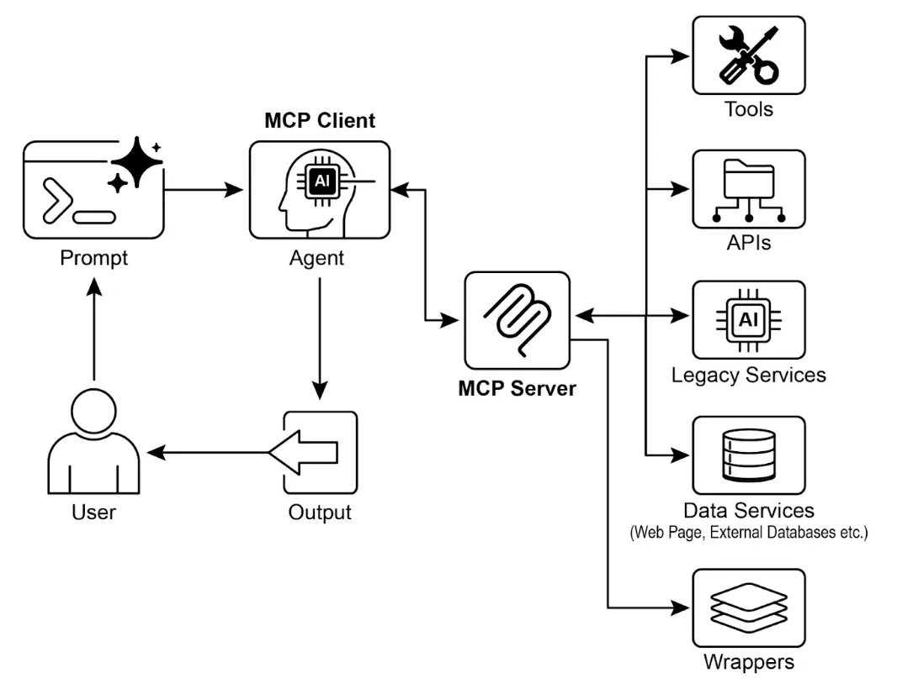

# 第 10 章：模型上下文协议（MCP）

    为了让大语言模型（LLM）能够有效地作为智能体（Agent）工作，其能力必须超越多模态生成，能够与外部环境交互，包括访问实时数据、调用外部软件、执行具体操作任务。模型上下文协议（MCP）正是为此而设计，它为 LLM 与外部资源的对接提供了标准化接口，是实现一致性和可预测集成的关键机制。

## MCP 模式概述

    可以将 MCP 想象成一个通用适配器，让任何 LLM 都能无缝连接到任何外部系统、数据库或工具，无需为每种组合单独开发集成。MCP 是一项开放标准，旨在规范 Gemini、OpenAI GPT、Mixtral、Claude 等 LLM 与外部应用、数据源和工具的通信方式。它就像一个通用连接机制，简化了 LLM 获取上下文、执行操作、与各种系统交互的流程。

    MCP 采用客户端 - 服务器架构。MCP 服务器负责暴露数据（资源）、交互模板（即 Prompt）和可执行功能（工具），而 MCP 客户端则负责消费这些能力，客户端可以是 LLM 宿主应用或智能体本身。这种标准化方式极大降低了 LLM 集成到多样化业务环境的复杂度。

    需要注意的是，MCP 本质上是一种“智能体接口”契约，其效果高度依赖于底层 API 的设计。如果开发者只是简单地将传统 API 包装为 MCP 接口，而不做优化，智能体的表现可能很差。例如，某工单系统 API 只能逐条获取工单详情，智能体要汇总高优先级工单时就会很慢且不准确。要真正发挥智能体优势，底层 API 应支持确定性特性，如过滤和排序，帮助智能体高效工作。智能体并不能神奇地替代确定性流程，往往需要更强的确定性支持。

    此外，MCP 可以包装任何 API，但如果 API 的输入输出格式智能体无法理解，依然无效。例如，文档存储 API 只返回 PDF 文件，智能体无法解析 PDF 内容，这样的 MCP 服务就没有实际意义。更好的做法是先开发一个能返回文本（如 Markdown）的 API，让智能体能直接读取和处理。这说明开发者不仅要关注连接方式，更要关注数据本身的可用性，确保真正的兼容性。

## MCP 与工具函数调用的区别

    模型上下文协议（MCP）与工具函数调用是 LLM 扩展外部能力的两种机制。二者都能让 LLM 执行文本生成之外的操作，但在抽象层次和实现方式上有明显区别。

    工具函数调用是 LLM 直接向某个预定义工具或函数发起请求（“工具”和“函数”在此语境下可互换）。这种方式是一对一通信，LLM 根据用户意图格式化请求，应用代码执行后返回结果。不同 LLM 厂商实现方式各异，通常是专有的。

    而 MCP 则是一个标准化接口，让 LLM 能够发现、通信并调用外部能力。它是开放协议，支持 LLM 与各种工具和系统的交互，目标是建立一个任何合规工具都能被任何合规 LLM 访问的生态系统，促进互操作性、可组合性和复用性。采用联邦模型后，能显著提升系统间的协同和资产价值。只需将传统服务包装为 MCP 接口，无需重写底层系统，就能将其纳入现代智能体生态，实现敏捷复用。

    以下是 MCP 与工具函数调用的核心区别：

    | 特性 | 工具函数调用 | 模型上下文协议（MCP） |
    | --- | --- | --- |
    | **标准化** | 专有、厂商定制，格式和实现各异 | 开放标准协议，促进 LLM 与工具间互操作 |
    | **范围** | LLM 直接请求某个预定义函数 | LLM 与外部工具发现和通信的通用框架 |
    | **架构** | LLM 与应用工具逻辑一对一交互 | 客户端 - 服务器架构，LLM 应用可连接多个 MCP 服务器 |
    | **发现机制** | 需显式告知 LLM 可用工具 | 支持动态发现，客户端可查询服务器能力 |
    | **复用性** | 工具集成与应用和 LLM 高度耦合 | 支持开发可复用、独立的 MCP 服务器，任何应用可访问 |

    工具函数调用就像给 AI 配一套专用工具（如特定扳手和螺丝刀），适合固定任务场景；而 MCP 则像通用电源插座系统，不直接提供工具，但允许任何合规工具接入，打造动态、可扩展的智能体工作坊。

    简言之，函数调用适合简单场景，MCP 则是复杂、互联 AI 系统不可或缺的标准化通信框架。

## MCP 的更多考量

    MCP 虽强大，但实际应用需综合考虑以下关键因素：

* **工具、资源与 Prompt 的区别**：资源是静态数据（如 PDF、数据库记录），工具是可执行功能（如发邮件、API 查询），Prompt 是引导 LLM 与资源或工具交互的模板，确保结构化和高效互动。
* **可发现性**：MCP 客户端可动态查询服务器能力，实现“即时发现”，智能体无需重启即可适应新功能。
* **安全性**：任何协议暴露工具和数据都需强安全措施。MCP 实现必须支持认证和授权，控制客户端访问权限和操作范围。
* **实现复杂度**：MCP 虽为开放标准，但实现可能较复杂。部分厂商（如 Anthropic、FastMCP）已推出 SDK，简化开发流程。
* **错误处理**：协议需定义错误（如工具执行失败、服务器不可用、请求无效）如何反馈给 LLM，便于智能体理解并尝试替代方案。
* **本地与远程服务器**：MCP 服务器可部署在本地或远程。本地适合敏感数据和高性能场景，远程则便于组织共享和扩展。
* **按需与批量处理**：MCP 支持实时交互和批量处理，适用于对话型智能体和数据分析流水线等不同场景。
* **传输机制**：本地通信采用 JSON-RPC over STDIO，高效进程间交互；远程则用 Streamable HTTP 和 SSE，支持持久高效的客户端 - 服务器通信。

    MCP 采用客户端 - 服务器模型，标准化信息流。理解各组件交互是实现高级智能体行为的关键：

1. **LLM**：核心 Agent，处理用户请求、制定计划、决定何时访问外部信息或执行操作。
2. **MCP 客户端**：LLM 的应用或包装层，将 LLM 意图转化为 MCP 标准请求，负责发现、连接和通信。
3. **MCP 服务器**：外部世界的入口，向授权客户端暴露工具、资源和 Prompt，通常负责某一领域（如数据库、邮件服务、API）。
4. **第三方服务**：实际的外部工具、应用或数据源，由 MCP 服务器管理和暴露，是最终执行操作的终点（如数据库查询、SaaS 平台、天气 API）。

    交互流程如下：

1. **发现**：MCP 客户端代表 LLM 查询服务器能力，服务器返回工具、资源和 Prompt 清单。
2. **请求构造**：LLM 决定使用某工具（如发邮件），构造请求并指定参数（收件人、主题、正文）。
3. **客户端通信**：MCP 客户端将请求按标准格式发送至 MCP 服务器。
4. **服务器执行**：MCP 服务器认证客户端、校验请求，调用底层软件执行操作（如邮件 API 的 send 函数）。
5. **响应与上下文更新**：服务器返回标准化响应（如邮件发送确认 ID），客户端将结果反馈给 LLM，更新上下文，智能体继续后续任务。

## 实践应用与场景

    MCP 极大拓展了 AI/LLM 能力，常见九大应用场景：

* **数据库集成**：智能体可通过 MCP 无缝访问结构化数据库，如用 MCP 数据库工具箱查询 Google BigQuery，实时获取信息、生成报告或更新记录，全部由自然语言驱动。
* **生成式媒体编排**：智能体可集成高级生成媒体服务，如通过 MCP 工具调用 Google Imagen 生成图片、Veo 生成视频、Chirp 3 HD 生成语音、Lyria 生成音乐，实现 AI 应用中的动态内容创作。
* **外部 API 交互**：MCP 为 LLM 调用外部 API 提供标准化方式，智能体可获取实时天气、股票价格、发送邮件、对接 CRM 系统，能力远超基础模型。
* **推理型信息抽取**：利用 LLM 强推理能力，MCP 支持智能体按需抽取信息，超越传统检索工具。智能体可分析文本，精准提取回答复杂问题的关键句段。
* **自定义工具开发**：开发者可用 FastMCP 等框架快速开发自定义工具，并通过 MCP 服务器暴露，无需修改 LLM 即可让智能体访问专有功能。
* **标准化 LLM-应用通信**：MCP 为 LLM 与应用间通信提供一致层，降低集成成本，促进不同厂商和宿主应用间互操作，简化复杂智能体系统开发。
* **复杂流程编排**：智能体可组合多种 MCP 工具和数据源，实现多步骤复杂流程，如获取客户数据、生成营销图片、撰写邮件并发送，全部自动化完成。
* **物联网设备控制**：智能体可通过 MCP 控制 IoT 设备，如智能家居、工业传感器、机器人，实现自然语言驱动的自动化。
* **金融服务自动化**：在金融领域，智能体可通过 MCP 对接数据源、交易平台、合规系统，实现市场分析、自动交易、个性化建议和合规报告，确保安全和标准化通信。

    简言之，MCP 让智能体能访问数据库、API 和网页等实时信息，也能执行发邮件、更新记录、控制设备等复杂任务，并支持 AI 应用中的媒体生成工具集成。

## ADK 实操代码示例

    本节介绍如何连接本地 MCP 服务器，实现 ADK 智能体与本地文件系统交互。

### 智能体配置与 MCP 工具集

    要配置智能体访问文件系统，可在`./adk_agent_samples/mcp_agent/agent.py`创建如下代码。`MCPToolset`实例需在`LlmAgent`的`tools`列表中，并将`"/path/to/your/folder"`替换为本地绝对路径，作为文件操作的根目录。

```python
import os
from google.adk.agents import LlmAgent
from google.adk.tools.mcp_tool.mcp_toolset import MCPToolset, StdioServerParameters

# 获取 agent.py 同级目录下'mcp_managed_files'文件夹的绝对路径
TARGET_FOLDER_PATH = os.path.join(os.path.dirname(os.path.abspath(__file__)), "mcp_managed_files")
os.makedirs(TARGET_FOLDER_PATH, exist_ok=True)

root_agent = LlmAgent(
    model='gemini-2.0-flash',
    name='filesystem_assistant_agent',
    instruction=(
         '帮助用户管理文件。你可以列出、读取和写入文件。'
         f'你的操作目录为：{TARGET_FOLDER_PATH}'
    ),
    tools=[
         MCPToolset(
              connection_params=StdioServerParameters(
                    command='npx',
                    args=[
                         "-y",
                         "@modelcontextprotocol/server-filesystem",
                         TARGET_FOLDER_PATH,
                    ],
              ),
              # 可选：限制暴露的工具，如只允许读取
              # tool_filter=['list_directory', 'read_file']
         )
    ],
)
```

    `npx`是 npm 自带的包执行工具，无需全局安装即可运行 Node.js 包。许多社区 MCP 服务器都以 Node.js 包形式分发，可直接用 npx 运行。

    为确保 `agent.py` 被 ADK 识别为 Python 包，还需在同目录下创建`__init__.py`：

```python
# ./adk_agent_samples/mcp_agent/__init__.py
from . import agent
```

    当然，也可连接其他命令，如 python3：

```python
connection_params = StdioConnectionParams(
 server_params={
      "command": "python3",
      "args": ["./agent/mcp_server.py"],
      "env": {
         "SERVICE_ACCOUNT_PATH":SERVICE_ACCOUNT_PATH,
         "DRIVE_FOLDER_ID": DRIVE_FOLDER_ID
      }
 }
)
```

    UVX 是 Python 命令行工具，利用 uv 临时隔离环境运行 Python 包，无需全局安装。可通过 MCP 服务器调用：

```python
connection_params = StdioConnectionParams(
 server_params={
    "command": "uvx",
    "args": ["mcp-google-sheets@latest"],
    "env": {
      "SERVICE_ACCOUNT_PATH":SERVICE_ACCOUNT_PATH,
      "DRIVE_FOLDER_ID": DRIVE_FOLDER_ID
    }
 }
)
```

    MCP 服务器创建后，下一步是连接 ADK Web。

### MCP 服务器与 ADK Web 连接

    首先执行`adk web`。在终端进入 mcp\_agent 的父目录（如 adk\_agent\_samples），运行：

```bash
cd ./adk_agent_samples
adk web
```

    浏览器加载 ADK Web 界面后，选择`filesystem_assistant_agent`，可尝试如下 Prompt：

* “显示该文件夹内容。”
* “读取`sample.txt`文件。”（假设该文件在`TARGET_FOLDER_PATH`下）
* “`another_file.md`里有什么？”

### 用 FastMCP 创建 MCP 服务器

    FastMCP 是高层 Python 框架，简化 MCP 服务器开发。它通过 Python 装饰器快速定义工具、资源和 Prompt，并自动生成 AI 模型接口规范，极大减少手动配置和出错。

    FastMCP 还支持服务器组合和智能体，便于模块化开发复杂系统，并优化分布式、可扩展 AI 应用。

#### FastMCP 服务器示例

    如下代码实现一个"greet"工具，ADK Agent 和其他 MCP 客户端可通过 HTTP 访问：

```python
# fastmcp_server.py
# pip install fastmcp
from fastmcp import FastMCP, Client

mcp_server = FastMCP()

@mcp_server.tool
def greet(name: str) -> str:
     """
     生成个性化问候语。

     Args:
          name: 要问候的人名。

     Returns:
          问候语字符串。
     """
     return f"你好，{name}！很高兴认识你。"

if __name__ == "__main__":
     mcp_server.run(
          transport="http",
          host="127.0.0.1",
          port=8000
     )
```

    该脚本定义了一个 greet 函数，通过 `@tool` 装饰器注册为 MCP 工具。文档字符串和类型提示会被 FastMCP 自动用于工具描述和接口规范。脚本运行后，服务器监听本地 8000 端口，greet 工具即可被智能体远程调用。

### ADK Agent 消费 FastMCP 服务器

    ADK Agent 可作为 MCP 客户端连接 FastMCP 服务器，只需配置 `HttpServerParameters` 为服务器地址（如 `http://localhost:8000`），并可用 `tool_filter` 限制工具访问。

### 使用 ADK Agent 消费 FastMCP 服务器

    ADK Agent 可作为 MCP 客户端连接已启动的 FastMCP 服务器。只需在配置中设置 `HttpServerParameters`，指定 FastMCP 服务器的网络地址（通常为 `http://localhost:8000`）。

    可通过 `tool_filter` 参数限制智能体可用的工具，例如只允许使用 greet。收到如“向 John Doe 问好”的请求时，Agent 内嵌的 LLM 会识别 MCP 提供的 greet 工具，传入参数“John Doe”，并返回服务器响应。该过程展示了如何将自定义工具通过 MCP 集成到 ADK Agent 中。

    具体配置方法如下，需要在 `./adk_agent_samples/fastmcp_client_agent/` 目录下创建 agent.py 文件，实例化 ADK Agent 并通过 `HttpServerParameters` 连接 FastMCP 服务器：

```python
# ./adk_agent_samples/fastmcp_client_agent/agent.py
import os
from google.adk.agents import LlmAgent
from google.adk.tools.mcp_tool.mcp_toolset import MCPToolset, HttpServerParameters

# 定义 FastMCP 服务器地址
# 请确保 fastmcp_server.py 已在该端口运行
FASTMCP_SERVER_URL = "http://localhost:8000"

root_agent = LlmAgent(
    model='gemini-2.0-flash', # 可替换为其他模型
    name='fastmcp_greeter_agent',
    instruction='你是一个友好的助手，可以通过 "greet" 工具向人问好。',
    tools=[
         MCPToolset(
              connection_params=HttpServerParameters(
                    url=FASTMCP_SERVER_URL,
              ),
              # 可选：限制 MCP 服务器暴露的工具
              # 本例只允许使用 'greet'
              tool_filter=['greet']
         )
    ],
)
```

    该脚本定义了一个名为 `fastmcp_greeter_agent` 的智能体，使用 Gemini 语言模型，并指定其任务为友好问候。通过 `MCPToolset` 连接本地 8000 端口的 FastMCP 服务器，并只开放 greet 工具。这样，Agent 就能理解自己的目标是向人问好，并知道要调用哪个外部工具来实现。

    在 `fastmcp_client_agent` 目录下创建 `__init__.py` 文件，确保该智能体 被 ADK 识别为可发现的 Python 包。

    操作步骤如下：首先在新终端运行 `python fastmcp_server.py` 启动 FastMCP 服务器。然后进入 `fastmcp_client_agent` 的父目录（如 adk\_agent\_samples），执行 `adk web`。浏览器加载 ADK Web UI 后，选择 `fastmcp_greeter_agent`，输入如“向 John Doe 问好”的 Prompt，Agent 会调用 FastMCP 服务器上的 greet 工具生成响应。

## 一图速览

    **是什么**：为了让 LLM 成为真正的智能体，必须具备与外部环境交互的能力，访问实时数据、调用外部软件。没有标准化通信协议，每次集成都需定制开发，难以复用，阻碍了复杂 AI 系统的扩展和互联。

    **为什么**：模型上下文协议（MCP）通过开放标准，成为 LLM 与外部系统的通用接口。它定义了能力发现和调用的标准流程，采用客户端 - 服务器架构，服务器可向任意合规客户端暴露工具、数据资源和 Prompt。LLM 应用作为客户端，能动态发现和使用资源，极大促进了可复用、可组合的智能体生态，简化了复杂工作流开发。

    **经验法则**：构建复杂、可扩展或企业级智能体系统，需与多样化外部工具、数据源和 API 交互时，优先采用 MCP。尤其当需要不同 LLM 与工具互操作、智能体可动态发现新能力时，MCP 是最佳选择。若仅需固定少量函数，直接工具调用即可。



    图 1: Model Context protocol

## 关键要点

* MCP 是开放标准，规范 LLM 与外部应用、数据源和工具的通信。
* 采用客户端 - 服务器架构，定义资源、Prompt 和工具的暴露与消费方式。
* ADK 支持消费现有 MCP 服务器，也可将自身工具暴露为 MCP 服务。
* FastMCP 简化 MCP 服务器开发，尤其适合 Python 工具的快速集成。
* MCP Genmedia 工具支持智能体集成 Google Cloud 生成式媒体服务（Imagen、Veo、Chirp 3 HD、Lyria）。
* MCP 让 LLM 和智能体能访问真实世界系统、动态信息，并执行超越文本生成的操作。

## 总结

    模型上下文协议（MCP）是连接大语言模型（LLM）与外部系统的开放标准。它采用客户端 - 服务器架构，让 LLM 能通过标准化工具访问资源、利用 Prompt、执行操作。MCP 支持数据库访问、生成式媒体编排、物联网控制和金融自动化等场景。文中通过文件系统服务器和 FastMCP 服务器的智能体集成示例，展示了 MCP 与 ADK 的实际应用。MCP 是打造具备交互能力的智能体系统不可或缺的核心组件。

## 参考资料

* [Model Context Protocol (MCP) 官方文档 – google.github.io](https://google.github.io/adk-docs/mcp/)
* [FastMCP 文档 – github.com/jlowin/fastmcp](https://github.com/jlowin/fastmcp)
* [MCP Genmedia 工具 – google.github.io](https://google.github.io/adk-docs/mcp/#mcp-servers-for-google-cloud-genmedia)
* [MCP 数据库工具箱文档 – google.github.io](https://google.github.io/adk-docs/mcp/databases/)
