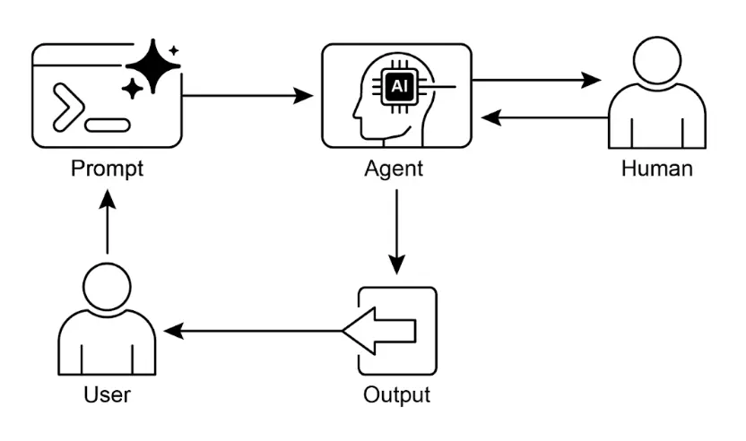

# 第 13 章：人类参与环节（Human-in-the-Loop）

    人类参与环节（Human-in-the-Loop，简称 HITL）模式是智能体开发与部署中的关键策略。它有意识地将人类认知的独特优势——如判断力、创造力和细致理解——与 AI 的计算能力和高效性相结合。这种战略性集成不仅是可选项，往往还是必需，尤其是在 AI 系统日益嵌入关键决策流程的背景下。

    HITL 的核心原则是确保 AI 在伦理边界内运行，遵循安全协议，并以最佳效果达成目标。这些问题在复杂、模糊或高风险领域尤为突出，因为 AI 的错误或误判可能带来重大影响。在此类场景下，完全自主——即 AI 系统无须人类干预独立运行——往往并不明智。HITL 正视这一现实，强调即使 AI 技术快速发展，人类监督、战略输入和协作互动仍不可或缺。

    HITL 方法本质上强调人工智能与人类智能的协同作用。它并不把 AI 视为人类工作的替代者，而是定位为增强和提升人类能力的工具。这种增强可以体现在自动化日常任务、为人类决策提供数据驱动洞察等方面。最终目标是打造一个协作生态系统，让人类与智能体各自发挥优势，实现单独无法达成的成果。

    在实际应用中，HITL 可通过多种方式实现。常见做法包括：人类作为验证者或审查员，检查 AI 输出以确保准确性并发现潜在错误；人类实时指导 AI 行为，提供反馈或纠正；在更复杂的场景下，人类与 AI 作为合作伙伴，通过互动对话或共享界面共同解决问题或做出决策。无论具体实现方式如何，HITL 都强调保持人类控制和监督，确保 AI 系统始终与人类伦理、价值观、目标和社会期望保持一致。

## 人类参与环节模式概述

    Human-in-the-Loop（HITL）模式将人工智能与人类输入结合，以增强智能体能力。该方法承认，在高复杂度或伦理要求场景下，AI 的最佳表现往往需要自动化处理与人类洞察的结合。HITL 的目标不是取代人类输入，而是通过人类理解确保关键判断和决策的质量。

    HITL 涵盖多个关键方面：人类监督，指通过日志审查或实时仪表盘监控智能体表现和输出，确保遵循规范并防止不良结果；干预与纠正，当智能体遇到错误或模糊场景时可请求人类介入，操作员可纠正错误、补充数据或引导 Agent，这也有助于智能体后续改进；人类反馈用于学习，收集并用于优化 AI 模型，典型如“人类反馈强化学习”，人类偏好直接影响智能体学习轨迹；决策增强，智能体为人类提供分析和建议，由人类做最终决策，通过 AI 洞察提升人类决策而非完全自动化；人机协作，指人类与智能体各自发挥优势，智能体处理常规数据，人类负责创造性问题或复杂谈判；最后，升级策略，即智能体遇到超出能力范围的任务时，按既定协议将任务升级给人类操作员，防止错误发生。

    HITL 的实施使智能体可用于敏感领域，在无法实现完全自动化的场景下提供解决方案，并通过反馈循环持续改进。例如，金融领域的大额企业贷款最终需由人类信贷员评估领导力等定性因素；法律领域，正义与责任原则要求人类法官对判决等关键决策拥有最终权力，这涉及复杂的道德推理。

    **注意事项**：HITL 的主要缺点是可扩展性不足。虽然人类监督能保证高准确率，但操作员无法管理数百万任务，因此常需自动化与 HITL 混合以兼顾规模与准确性。此外，模式效果高度依赖人类操作员的专业水平，例如 AI 可生成代码，但只有专业开发者才能发现细微错误并正确指导修复。用于训练数据生成时，人工标注者也需专门培训，确保能以高质量方式纠正 AI。最后，HITL 实施涉及隐私问题，敏感信息需严格匿名化后才能暴露给人类操作员，增加了流程复杂性。

## 实践应用与案例

    HITL 模式在众多行业和应用场景中至关重要，尤其是在准确性、安全性、伦理或细致理解至关重要的领域。

* **内容审核**：智能体可快速筛查大量在线内容，发现违规（如仇恨言论、垃圾信息）。但对于模糊或边界内容，会升级给人类审核员进行复查和最终裁决，确保细致判断和复杂政策的执行。
* **自动驾驶**：自动驾驶汽车可自主完成大部分驾驶任务，但在复杂、不可预测或危险场景（如极端天气、异常路况）下，会将控制权交还给人类驾驶员。
* **金融欺诈检测**：AI 系统可根据模式标记可疑交易，但高风险或模糊警报通常由人类分析师进一步调查、联系客户，并最终判断是否为欺诈。
* **法律文档审查**：AI 可快速扫描和分类大量法律文档，识别相关条款或证据。人类法律专业人士随后复查 AI 结果，确保准确性、语境和法律影响，尤其在关键案件中。
* **客户支持（复杂问题）**：聊天机器人可处理常规客户咨询。当用户问题过于复杂、情绪激烈或需同理心时，系统会自动转接给人类客服。
* **数据标注与注释**：AI 模型训练常需大量标注数据。人类参与准确标注图像、文本或音频，为 AI 提供学习的真实数据。随着模型迭代，这一过程持续进行。
* **生成式 AI 优化**：当大模型生成创意内容（如营销文案、设计方案）时，人类编辑或设计师会复查并优化输出，确保符合品牌规范、契合目标受众并保持质量。
* **自动化网络管理**：AI 系统可分析告警、预测网络问题和流量异常，利用关键性能指标和模式。但关键决策（如高风险告警处理）常升级给人类分析师，由其进一步调查并最终决定网络变更是否批准。

    该模式是 AI 实施的实用方法，兼顾规模与效率，同时通过人类监督确保质量、安全和伦理合规。

    “Human-on-the-loop”是该模式的变体，人类专家制定总体策略，AI 负责即时执行以确保合规。举例说明：

* **自动化金融交易系统**：人类金融专家制定投资策略和规则，如“保持 70% 科技股、30% 债券，不投资于单一公司超过 5%，任何股票跌破买入价 10% 自动卖出”。AI 实时监控市场，按人类设定的策略即时交易。AI 负责高速执行，人类负责慢速战略。
* **现代呼叫中心**：人类经理制定客户互动的高层政策，如“提及‘服务中断’的来电立即转技术支持”，“客户语气高度沮丧时系统应主动提供转接人工客服”。AI 负责初步客户互动，实时识别需求并自动执行经理政策，无需每个案例都人工干预。这样 AI 可按人类战略指导高效处理大量即时事务。

## 实践代码示例

    为演示 HITL 模式，ADK 智能体可识别需人工审核的场景并启动升级流程。这样可在智能体自主决策能力有限或需复杂判断时实现人工干预。其他主流框架也支持类似能力，如 LangChain 也提供相关工具。

```python
from google.adk.agents import Agent
from google.adk.tools.tool_context import ToolContext
from google.adk.callbacks import CallbackContext
from google.adk.models.llm import LlmRequest
from google.genai import types
from typing import Optional

# 工具占位（实际应用请替换为真实实现）
def troubleshoot_issue(issue: str) -> dict:
   return {"status": "success", "report": f"故障排查步骤：{issue}。"}

def create_ticket(issue_type: str, details: str) -> dict:
   return {"status": "success", "ticket_id": "TICKET123"}

def escalate_to_human(issue_type: str) -> dict:
   # 实际系统中通常会转人工队列
   return {"status": "success", "message": f"{issue_type} 已升级给人工专家处理。"}

technical_support_agent = Agent(
   name="technical_support_specialist",
   model="gemini-2.0-flash-exp",
   instruction="""
你是一家电子产品公司的技术支持专家。
首先，检查 state["customer_info"]["support_history"] 是否有用户支持历史。如有，请在回复中引用该历史。
技术问题处理流程：
1. 使用 troubleshoot_issue 工具分析问题。
2. 指导用户完成基础排查步骤。
3. 如问题未解决，使用 create_ticket 工具登记问题。
复杂问题超出基础排查时：
1. 使用 escalate_to_human 工具转人工专家处理。
保持专业且富有同理心的语气。认可技术问题带来的困扰，并提供清晰的解决步骤。
""",
   tools=[troubleshoot_issue, create_ticket, escalate_to_human]
)

def personalization_callback(
   callback_context: CallbackContext, llm_request: LlmRequest
) -> Optional[LlmRequest]:
   """为 LLM 请求添加个性化信息。"""
   # 从 state 获取客户信息
   customer_info = callback_context.state.get("customer_info")
   if customer_info:
       customer_name = customer_info.get("name", "尊贵客户")
       customer_tier = customer_info.get("tier", "标准")
       recent_purchases = customer_info.get("recent_purchases", [])

       personalization_note = (
           f"\n重要个性化信息：\n"
           f"客户姓名：{customer_name}\n"
           f"客户等级：{customer_tier}\n"
       )
       if recent_purchases:
           personalization_note += f"最近购买：{', '.join(recent_purchases)}\n"

       if llm_request.contents:
           # 在第一个内容前插入系统消息
           system_content = types.Content(
               role="system", parts=[types.Part(text=personalization_note)]
           )
           llm_request.contents.insert(0, system_content)
   return None # 返回 None 以继续处理修改后的请求
```

    上述代码展示了如何用 Google ADK 构建基于 HITL 框架的技术支持 Agent。该智能体作为智能化第一线支持，配置了详细指令，并集成了 `troubleshoot_issue`、`create_ticket` 和 `escalate_to_human` 等工具，覆盖完整支持流程。升级工具是 HITL 设计的核心，确保复杂或敏感问题能及时转人工专家处理。

    架构的一大亮点是深度个性化能力，通过专用回调函数，在联系 LLM 前动态获取客户姓名、等级、购买历史等信息，并作为系统消息注入提示，实现高度定制化和有针对性的回复。结合结构化工作流、必要的人类监督和动态个性化，该代码是 ADK 支持开发高水平 AI 支持解决方案的实用范例。

## 一图速览

    **是什么**：AI 系统（包括先进的大模型）在需要细致判断、伦理推理或复杂模糊语境理解的任务上常常力不从心。在高风险环境中部署完全自主 AI 存在重大风险，错误可能导致严重安全、财务或伦理后果。这些系统缺乏人类的创造力和常识推理。因此，在关键决策流程中仅依赖自动化往往不明智，也会损害系统的有效性和可信度。

    **为什么**：Human-in-the-Loop（HITL）模式通过战略性引入人类监督，为 AI 工作流提供标准化解决方案。这种智能体方法实现了 AI 负责计算和数据处理、人类负责关键验证、反馈和干预的协同。这样既确保 AI 行为符合人类价值和安全规范，又通过人类输入持续学习提升系统能力。最终实现更强健、准确和伦理的结果，是人类与 AI 单独无法达成的。

    **经验法则**：在错误可能带来重大安全、伦理或财务后果的领域（如医疗、金融、自动化系统）部署 AI 时应采用该模式。对于 LLM 难以可靠处理的模糊和细致任务（如内容审核、复杂客服升级）尤为重要。需要用高质量人工标注数据持续优化 AI 模型，或对生成式 AI 输出进行质量把控时，也应采用 HITL。

    **视觉总结**：



    图 1：人类参与环节设计模式

## 关键要点

    主要要点包括：

* Human-in-the-Loop（HITL）将人类智能和判断力融入 AI 工作流。
* 在复杂或高风险场景下，安全、伦理和效果至关重要。
* 关键方面包括人类监督、干预、学习反馈和决策增强。
* 升级策略让智能体知道何时应交由人类处理。
* HITL 支持负责任的 AI 部署和持续改进。
* HITL 的主要缺点是可扩展性不足，需在准确性与处理量之间权衡，并高度依赖领域专家的有效干预。
* 实施过程中还需培训人工操作员生成数据，并通过匿名化处理敏感信息以应对隐私挑战。

## 总结

    本章深入探讨了 Human-in-the-Loop（HITL）模式，强调其在构建强健、安全和伦理 AI 系统中的重要作用。我们讨论了将人类监督、干预和反馈集成到智能体工作流如何显著提升其性能和可信度，尤其在复杂和敏感领域。实践应用展示了 HITL 在内容审核、医疗诊断、自动驾驶和客户支持等领域的广泛价值。代码示例则展示了 ADK 如何通过升级机制促进人机互动。随着 AI 能力不断提升，HITL 仍是负责任 AI 开发的基石，确保人类价值和专业知识始终是智能系统设计的核心。

## 参考文献

* [机器学习中的人类参与综述 – arxiv.org](https://arxiv.org/abs/2108.00941)
