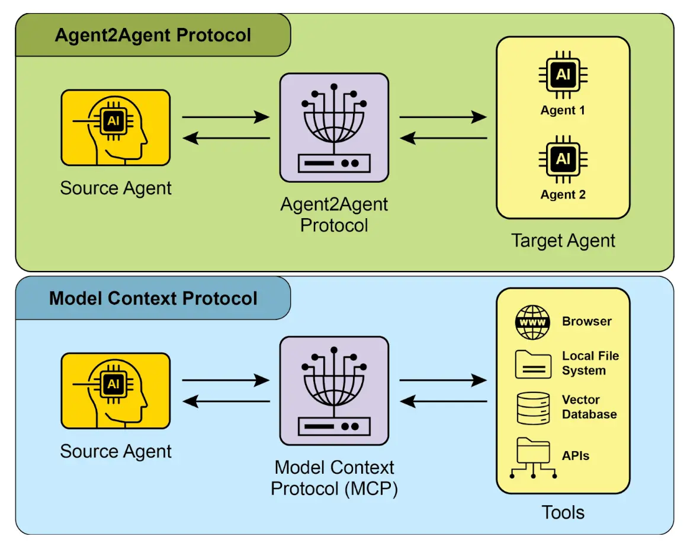
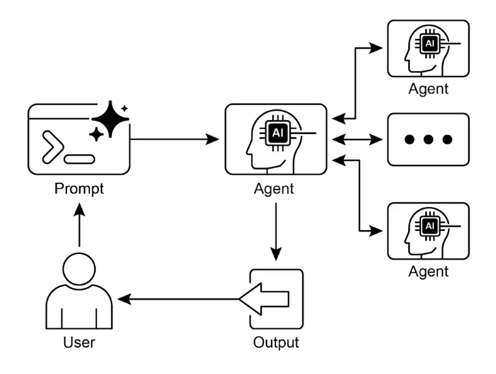

# 第 15 章：智能体间通信（A2A）

    单个智能体即使具备强大能力，在面对复杂、多层次问题时仍然存在局限。为了解决这一难题，Agent 间通信（A2A）使得不同框架构建的智能体能够高效协作，实现无缝协调、任务委托和信息交换。

    Google 的 A2A 协议是一项开放标准，旨在促进智能体之间的通用通信。本章将介绍 A2A 的原理、实际应用及其在 Google ADK 中的实现。

## Agent 间通信模式概述

    Agent2Agent（A2A）协议是一项开放标准，旨在实现不同智能体框架之间的通信与协作。它确保了互操作性，使得基于 LangGraph、CrewAI 或 Google ADK 等技术开发的智能体能够跨平台协同工作。

    A2A 得到了众多科技公司和服务商的支持，包括 Atlassian、Box、LangChain、MongoDB、Salesforce、SAP 和 ServiceNow。微软计划将 A2A 集成到 Azure AI Foundry 和 Copilot Studio，彰显了对开放协议的重视。此外，Auth0 和 SAP 也在其平台和智能体中集成了 A2A 支持。

    作为开源协议，A2A 鼓励社区贡献，推动其不断发展和广泛应用。

### A2A 核心概念

    A2A 协议为智能体交互提供了结构化方法，包含多个核心概念。理解这些基础对于开发或集成 A2A 兼容系统至关重要。A2A 的基础包括核心参与者、Agent Card、Agent 发现、通信与任务、交互机制和安全性，下面将详细介绍。

    **核心参与者**：A2A 涉及三类主要实体：

* 用户：发起智能体协助请求。
* A2A 客户端（客户端 Agent）：代表用户请求操作或信息的应用或智能体。
* A2A 服务器（远程 Agent）：提供 HTTP 端点以处理客户端请求并返回结果的智能体或系统。远程智能体作为“黑盒”系统，客户端无需了解其内部实现细节。

    **Agent Card**：Agent 的数字身份由 Agent Card 定义，通常为 JSON 文件。该文件包含与客户端交互和自动发现所需的关键信息，如智能体身份、端点 URL 和版本号，还包括支持的能力（如流式传输或推送通知）、具体技能、默认输入/输出模式及认证要求。以下是 `WeatherBot` 的 Agent Card 示例：

```python
# WeatherBot Agent Card 示例
agent_card = {
    "name": "WeatherBot",
    "description": "提供准确的天气预报和历史数据。",
    "url": "http://weather-service.example.com/a2a",
    "version": "1.0.0",
    "capabilities": {
        "streaming": True,
        "pushNotifications": False,
        "stateTransitionHistory": True
    },
    "authentication": {
        "schemes": [
            "apiKey"
        ]
    },
    "defaultInputModes": [
        "text"
    ],
    "defaultOutputModes": [
        "text"
    ],
    "skills": [
        {
            "id": "get_current_weather",
            "name": "获取当前天气",
            "description": "检索任意地点的实时天气。",
            "inputModes": [
                "text"
            ],
            "outputModes": [
                "text"
            ],
            "examples": [
                "巴黎现在的天气如何？",
                "东京当前天气状况"
            ],
            "tags": [
                "weather",
                "current",
                "real-time"
            ]
        },
        {
            "id": "get_forecast",
            "name": "获取天气预报",
            "description": "获取 5 天的天气预测。",
            "inputModes": [
                "text"
            ],
            "outputModes": [
                "text"
            ],
            "examples": [
                "纽约未来 5 天的天气预报",
                "伦敦本周末会下雨吗？"
            ],
            "tags": [
                "weather",
                "forecast",
                "prediction"
            ]
        }
    ]
}
```

    **Agent 发现**：客户端可通过多种方式发现 Agent Card，了解可用 A2A 服务器的能力：

* Well-Known URI：Agent 在标准路径（如 `/.well-known/agent.json`）托管 Agent Card，便于公开或域内自动访问。
* 管理型注册表：集中式目录，Agent 可在此发布 Agent Card，并按条件查询，适合企业环境的集中管理与访问控制。
* 直接配置：Agent Card 信息嵌入或私下共享，适用于紧密耦合或私有系统，无需动态发现。

    无论采用哪种方式，都应保障 Agent Card 端点安全，可通过访问控制、双向 TLS（mTLS）或网络限制实现，尤其当卡片包含敏感（但非密钥）信息时。

    **通信与任务**：在 A2A 框架中，通信围绕异步任务展开，任务是长流程的基本工作单元。每个任务有唯一标识，并经历提交、处理中、完成等状态，支持复杂操作的并行处理。Agent 间通过消息进行通信。

    消息包含属性（如优先级、创建时间等元数据）和一个或多个内容部分（如文本、文件或结构化 JSON 数据）。Agent 在任务中生成的实际输出称为 artifact（工件），与消息类似也由多个部分组成，可按需流式传输。所有 A2A 通信均通过 HTTP(S) 并采用 JSON-RPC 2.0 协议。为保持多次交互的上下文，服务器会生成 contextId 以关联相关任务。

    **交互机制**：请求/响应（轮询）、服务器推送事件（SSE）。A2A 提供多种交互方式，满足不同 AI 应用需求：

* 同步请求/响应：适用于快速操作，客户端发送请求并等待服务器一次性返回完整响应。
* 异步轮询：适合耗时任务，客户端发送请求，服务器立即返回“处理中”状态和任务 ID，客户端可定期轮询任务状态，直到完成或失败。
* 流式更新（SSE）：适用于实时、增量结果，建立服务器到客户端的单向持久连接，服务器可持续推送状态或部分结果，无需客户端多次请求。
* 推送通知（Webhook）：适合超长或资源密集型任务，客户端注册 webhook URL，服务器在任务状态显著变化时异步推送通知。

    Agent Card 会声明智能体是否支持流式传输或推送通知。A2A 支持多模态数据（如文本、音频、视频），可实现丰富的 AI 应用。

```python
# 同步请求示例
sync_request = {
    "jsonrpc": "2.0",
    "id": "1",
    "method": "sendTask",
    "params": {
        "id": "task-001",
        "sessionId": "session-001",
        "message": {
            "role": "user",
            "parts": [
                {
                    "type": "text",
                    "text": "美元兑欧元汇率是多少？"
                }
            ]
        },
        "acceptedOutputModes": ["text/plain"],
        "historyLength": 5
    }
}
```

    同步请求使用 `sendTask` 方法，客户端期望一次性获得完整答案。流式请求则用 `sendTaskSubscribe` 方法建立持久连接，Agent 可持续返回多次增量结果。

```python
# 流式请求示例
streaming_request = {
    "jsonrpc": "2.0",
    "id": "2",
    "method": "sendTaskSubscribe",
    "params": {
        "id": "task-002",
        "sessionId": "session-001",
        "message": {
            "role": "user",
            "parts": [
                {
                    "type": "text",
                    "text": "今天日元兑英镑汇率是多少？"
                }
            ]
        },
        "acceptedOutputModes": ["text/plain"],
        "historyLength": 5
    }
}
```

    **安全性**：Agent 间通信（A2A）是系统架构的重要组成部分，确保智能体间数据安全、可靠交换，具备多项内置机制：

* 双向 TLS：建立加密和认证连接，防止未授权访问和数据泄露，保障通信安全。
* 完整审计日志：记录所有智能体间通信，包括信息流、参与智能体和操作，便于审计、排查和安全分析。
* Agent Card 声明：认证要求在 Agent Card 中明确声明，集中管理智能体身份、能力和安全策略。
* 凭证处理：Agent 通常通过 OAuth 2.0 令牌或 API Key 认证，凭证通过 HTTP 头传递，避免暴露在 URL 或消息体中，提高安全性。

### A2A 与 MCP 对比

    A2A 协议与 Anthropic 的 Model Context Protocol（MCP）互为补充（见图 1）。MCP 关注智能体与外部数据和工具的上下文结构化，而 A2A 专注于智能体间的协调与通信，实现任务委托与协作。



    图 1：A2A 与 MCP 协议对比

    A2A 的目标是提升效率、降低集成成本、促进创新和互操作性，助力复杂多智能体系统开发。因此，深入理解 A2A 的核心组件和运行方式，是设计、实现和应用协作型智能体系统的基础。

## 实践应用与场景

    Agent 间通信是构建复杂 AI 解决方案不可或缺的基础，带来模块化、可扩展性和智能增强。

* **多框架协作**：A2A 的核心应用是让不同框架（如 ADK、LangChain、CrewAI）构建的独立智能体实现通信与协作。适用于多智能体系统，各智能体专注于问题的不同方面。
* **自动化工作流编排**：在企业场景下，A2A 可实现智能体间任务委托与协调。例如，一个智能体负责数据采集，另一个负责分析，第三个生成报告，三者通过 A2A 协议协同完成复杂流程。
* **动态信息检索**：Agent 可互相请求和交换实时信息。主智能体可向专门的数据获取智能体请求市场数据，后者通过外部 API 获取并返回结果。

## 实战代码示例

    A2A 协议的实际应用可参考 [samples](https://github.com/google-a2a/a2a-samples/tree/main/samples)，其中包含 Java、Go 和 Python 示例，展示 LangGraph、CrewAI、Azure AI Foundry、AG2 等框架智能体如何通过 A2A 通信。所有代码均采用 Apache 2.0 许可。以下以 ADK 智能体为例，介绍如何用 Google 认证工具搭建 A2A 服务器。完整代码见 [GitHub](https://github.com/google-a2a/a2a-samples/blob/main/samples/python/agents/birthday_planner_adk/calendar_agent/adk_agent.py)。

```python
import datetime
from google.adk.agents import LlmAgent # type: ignore[import-untyped]
from google.adk.tools.google_api_tool import CalendarToolset # type: ignore[import-untyped]

async def create_agent(client_id, client_secret) -> LlmAgent:
    """构建 ADK Agent。"""
    toolset = CalendarToolset(client_id=client_id, client_secret=client_secret)
    return LlmAgent(
        model='gemini-2.0-flash-001',
        name='calendar_agent',
        description="可帮助管理用户日历的 Agent",
        instruction=f"""
你是一个可以帮助用户管理日历的 Agent。

用户会请求日历状态信息或修改日历。请使用提供的工具与日历 API 交互。

如未指定，默认使用 'primary' 日历。

使用 Calendar API 工具时，请采用规范的 RFC3339 时间戳。

今天是 {datetime.datetime.now()}。
""",
        tools=await toolset.get_tools(),
    )
```

    上述 Python 代码定义了异步函数 `create_agent`，用于构建 ADK `LlmAgent`。首先通过客户端凭证初始化 `CalendarToolset`，访问 Google Calendar API。随后创建 LlmAgent 实例，配置 Gemini 模型、名称和管理日历的说明，并集成 `CalendarToolset` 工具，实现日历查询和修改。说明中动态插入当前日期，便于时序上下文。

    以下代码展示了如何定义智能体的具体说明和工具，完整文件见 [GitHub](https://github.com/a2aproject/a2a-samples/blob/main/samples/python/agents/birthday_planner_adk/calendar_agent/__main__.py)。

```python
import os
import asyncio
import uvicorn
from starlette.applications import Starlette
from starlette.routing import Route
from starlette.requests import Request
from starlette.responses import PlainTextResponse

# 假设这些导入来自相关的 A2A 和 ADK 库
from a2a import (AgentSkill, AgentCard, AgentCapabilities, 
                 DefaultRequestHandler, A2AStarletteApplication)
from adk import (Runner, InMemoryArtifactService, InMemorySessionService, 
                 InMemoryMemoryService, ADKAgentExecutor, InMemoryTaskStore)

def main(host: str, port: int):
    # 检查 API Key 是否设置。
    # 使用 Vertex AI API 时无需设置。
    if os.getenv('GOOGLE_GENAI_USE_VERTEXAI') != 'TRUE' and not os.getenv(
        'GOOGLE_API_KEY'
    ):
        raise ValueError(
            '未设置 GOOGLE_API_KEY 环境变量，且 GOOGLE_GENAI_USE_VERTEXAI 不是 TRUE。'
        )

    skill = AgentSkill(
        id='check_availability',
        name='检查可用性',
        description="使用 Google Calendar 检查用户某一时间段的空闲情况",
        tags=['calendar'],
        examples=['我明天上午 10 点到 11 点有空吗？'],
    )

    agent_card = AgentCard(
        name='Calendar Agent',
        description="可管理用户日历的 Agent",
        url=f'http://{host}:{port}/',
        version='1.0.0',
        defaultInputModes=['text'],
        defaultOutputModes=['text'],
        capabilities=AgentCapabilities(streaming=True),
        skills=[skill],
    )

    adk_agent = asyncio.run(create_agent(
        client_id=os.getenv('GOOGLE_CLIENT_ID'),
        client_secret=os.getenv('GOOGLE_CLIENT_SECRET'),
    ))
    runner = Runner(
        app_name=agent_card.name,
        agent=adk_agent,
        artifact_service=InMemoryArtifactService(),
        session_service=InMemorySessionService(),
        memory_service=InMemoryMemoryService(),
    )
    agent_executor = ADKAgentExecutor(runner, agent_card)

    async def handle_auth(request: Request) -> PlainTextResponse:
        await agent_executor.on_auth_callback(
            str(request.query_params.get('state')), str(request.url)
        )
        return PlainTextResponse('认证成功。')

    request_handler = DefaultRequestHandler(
        agent_executor=agent_executor, task_store=InMemoryTaskStore()
    )

    a2a_app = A2AStarletteApplication(
        agent_card=agent_card, http_handler=request_handler
    )
    routes = a2a_app.routes()
    routes.append(
        Route(
            path='/authenticate',
            methods=['GET'],
            endpoint=handle_auth,
        )
    )
    app = Starlette(routes=routes)

    uvicorn.run(app, host=host, port=port)

if __name__ == '__main__':
    main()
```

    上述 Python 代码演示了如何搭建一个符合 A2A 协议的“日历 Agent”，用于检查用户日历空闲时间。包括 API Key 或 Vertex AI 配置认证、`AgentCard` 能力和技能定义、ADK 智能体创建、内存服务配置、Starlette Web 应用初始化、认证回调和 A2A 协议处理，并通过 Uvicorn 以 HTTP 方式暴露智能体服务。

    这些示例展示了从能力定义到 Web 服务运行的 A2A 智能体构建流程。通过智能体 Card 和 ADK，开发者可创建可与 Google Calendar 等工具集成的互操作智能体，构建多智能体生态系统。

    更多 A2A 实践可参考 [How to Build Your First Google A2A Project: A Step-by-Step Tutorial](https://www.trickle.so/blog/how-to-build-google-a2a-project)，该链接提供 Python 和 JavaScript 示例客户端与服务器、多智能体 Web 应用、命令行工具及多种框架实现。

## 一图速览

    **是什么**：不同框架构建的单一智能体在面对复杂、多层次问题时常常力不从心。主要挑战在于缺乏统一协议，无法高效沟通与协作，导致各自为政，难以组合专长解决更大任务。没有标准化方法，集成成本高、周期长，阻碍了更强大、协同 AI 系统的开发。

    **为什么**：Agent 间通信（A2A）协议为此问题提供了开放、标准化解决方案。它基于 HTTP 协议，实现互操作性，使不同技术栈的智能体能够无缝协调、任务委托和信息共享。核心组件是 Agent Card，描述智能体能力、技能和通信端点，便于发现和交互。A2A 支持同步和异步多种交互机制，满足多样化场景。统一标准促进了模块化、可扩展的多智能体系统生态。

    **使用原则**：当需要编排两个或以上智能体协作，尤其是跨框架（如 Google ADK、LangGraph、CrewAI）时，建议采用此模式。适合构建复杂、模块化应用，各智能体专注于工作流不同环节，如数据分析委托给一个智能体，报告生成交由另一个。Agent 需动态发现和调用其他智能体能力时也适用。

    **视觉摘要**



    图 2：A2A 智能体间通信模式

## 关键要点

* Google A2A 协议是一项开放、基于 HTTP 的标准，促进不同框架智能体间的通信与协作。
* AgentCard 是智能体的数字身份，便于其他智能体自动发现和理解其能力。
* A2A 支持同步请求 - 响应（`tasks/send`）和流式更新（`tasks/sendSubscribe`），满足不同通信需求。
* 协议支持多轮对话，包括 `input-required` 状态，Agent 可请求补充信息并保持上下文。
* A2A 鼓励模块化架构，专用智能体可独立运行于不同端口，实现系统可扩展和分布式部署。
* Trickle AI 等工具可可视化和跟踪 A2A 通信，便于开发者监控、调试和优化多智能体系统。
* A2A 专注于智能体间任务和工作流管理，MCP 则为 LLM 与外部资源交互提供标准接口。

## 总结

    Agent 间通信（A2A）协议为打破单体智能体孤岛提供了关键开放标准。通过统一的 HTTP 框架，实现了不同平台（如 Google ADK、LangGraph、CrewAI）Agent 的无缝协作与互操作。Agent Card 作为数字身份，清晰定义智能体能力，支持动态发现。协议灵活，涵盖同步请求、异步轮询和实时流式等多种交互模式，满足广泛应用需求。

    A2A 支持模块化、可扩展架构，专用智能体可组合编排复杂自动化流程。安全性为核心，内置 mTLS 和认证机制保障通信安全。A2A 与 MCP 等标准互补，专注于高层智能体协调与任务委托。主流科技公司支持和丰富实践案例，彰显其重要性。A2A 为开发者构建更复杂、分布式、智能化多智能体系统奠定了基础，是协作型 AI 生态的关键支柱。

## 参考文献

* [陈博（2025 年 4 月 22 日）《Google A2A 项目入门教程》- trickle.so](https://www.trickle.so/blog/how-to-build-google-a2a-project)
* [Google A2A GitHub 仓库 - github.com](https://github.com/google-a2a/A2A)
* [Google Agent Development Kit (ADK) - google.github.io](https://google.github.io/adk-docs/)
* [Agent-to-Agent (A2A) 协议入门 - codelabs.developers.google.com](https://codelabs.developers.google.com/intro-a2a-purchasing-concierge#0)
* [Google AgentDiscovery - a2a-protocol.org](https://a2a-protocol.org/latest/)
* [LangGraph、CrewAI、Google ADK 等框架智能体间通信 - trickle.so](https://www.trickle.so/blog/how-to-build-google-a2a-project#setting-up-your-a2a-development-environment)
* [使用 A2A 协议设计协作型多智能体系统 - oreilly.com](https://www.oreilly.com/radar/designing-collaborative-multi-agent-systems-with-the-a2a-protocol/)
