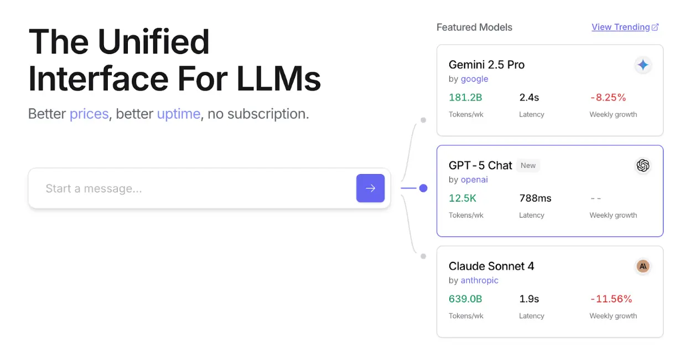
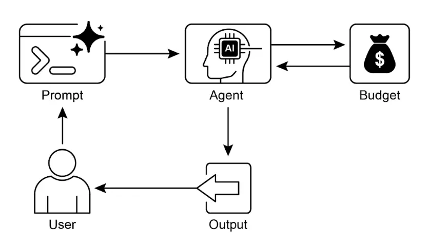

# 第 16 章：资源感知优化

    资源感知优化使智能体能够在运行过程中动态监控和管理计算、时间和财务资源。这与仅关注动作序列的简单规划不同，资源感知优化要求智能体在执行动作时做出决策，以在指定资源预算内实现目标或优化效率。这包括在更准确但昂贵的模型与更快、低成本模型之间进行选择，或决定是否分配更多算力以获得更精细的响应，还是返回更快但较为粗略的答案。

    例如，假设一个智能体为金融分析师分析大型数据集。如果分析师需要立即获得初步报告，智能体可能会使用更快、更经济的模型快速总结关键趋势。而如果分析师需要用于重要投资决策的高精度预测，并且有更充足的预算和时间，智能体则会分配更多资源，采用功能更强大但速度较慢的高精度预测模型。此类场景中的关键策略是回退机制：当首选模型因过载或限流不可用时，系统自动切换到默认或更经济的模型，保证服务连续性而非完全失败。

## 实践应用与用例

    实际应用场景包括：

* **成本优化的 LLM 使用**：智能体根据预算约束，决定复杂任务使用大型昂贵 LLM，简单查询则用小型经济模型。
* **延迟敏感操作**：在实时系统中，智能体选择更快但可能不够全面的推理路径，以确保及时响应。
* **能效优化**：部署在边缘设备或电量有限环境下的智能体，通过优化处理流程节省电池寿命。
* **服务可靠性回退**：当主模型不可用时，智能体自动切换到备选模型，确保服务不中断并实现优雅降级。
* **数据使用管理**：智能体选择摘要数据而非完整数据集下载，以节省带宽或存储空间。
* **自适应任务分配**：在多智能体系统中，智能体根据自身算力负载或可用时间自我分配任务。

## 实战代码示例

    一个智能问答系统可以根据问题难度动态选择模型。简单问题用经济型语言模型（如 Gemini Flash），复杂问题则考虑更强大但昂贵的模型（如 Gemini Pro），同时还会根据预算和时间约束决定是否调用高阶模型，实现动态模型选择。

    例如，假设一个分层智能体的旅行规划器。高层规划（理解复杂请求、拆解多步行程、逻辑决策）由功能强大的 LLM（如 Gemini Pro）负责，这类“规划者”智能体需要深度理解和推理能力。而具体任务如查航班价格、酒店可用性、餐厅评价等，则是简单重复的网页查询，可由更快、更经济的模型（如 Gemini Flash）完成。这样，复杂规划用高阶模型，简单工具调用用经济模型，既保证逻辑严密，又节约资源。

    Google ADK 支持多智能体架构，允许模块化和可扩展应用。不同智能体可处理专门任务，模型灵活性支持直接调用 Gemini Pro、Gemini Flash 或通过 LiteLLM 集成其他模型。ADK 的编排能力支持动态、LLM 驱动的路由，实现自适应行为。内置评估功能可系统性评测智能体表现，用于系统优化（详见评估与监控章节）。

    下面定义两个使用不同模型和成本的智能体：

```python
# 概念性 Python 结构，非可运行代码

from google.adk.agents import Agent
# from google.adk.models.lite_llm import LiteLlm # 如需调用 ADK 默认 Agent 不支持的模型

# 使用昂贵 Gemini Pro 2.5 的 Agent
gemini_pro_agent = Agent(
    name="GeminiProAgent",
    model="gemini-2.5-pro", # 实际模型名如有不同请替换
    description="复杂查询的高能力 Agent。",
    instruction="你是复杂问题解决的专家助手。"
)

# 使用经济型 Gemini Flash 2.5 的 Agent
gemini_flash_agent = Agent(
    name="GeminiFlashAgent",
    model="gemini-2.5-flash", # 实际模型名如有不同请替换
    description="简单问题的快速高效 Agent。",
    instruction="你是简单问题的快速助手。"
)
```

    路由智能体可根据查询长度等简单指标分流：短问题用经济模型，长问题用高阶模型。更复杂的路由智能体可用 LLM 或 ML 模型分析查询复杂度，决定最合适的下游语言模型。例如，事实回忆类问题分流到 Flash 模型，深度分析类问题分流到 Pro 模型。

    优化技术可进一步提升路由效果。提示工程通过精心设计提示词引导路由 LLM 做出更优决策。对路由 LLM 在问题与最佳模型选择数据集上微调，可提升准确率和效率。动态路由能力实现响应质量与成本的平衡。

```python
# 概念性 Python 结构，非可运行代码

from google.adk.agents import Agent, BaseAgent
from google.adk.events import Event
from google.adk.agents.invocation_context import InvocationContext
import asyncio

class QueryRouterAgent(BaseAgent):
    name: str = "QueryRouter"
    description: str = "根据复杂度将用户查询路由到合适的 LLM Agent。"

    async def _run_async_impl(self, context: InvocationContext) -> AsyncGenerator[Event, None]:
         user_query = context.current_message.text # 假设输入为文本
         query_length = len(user_query.split()) # 简单指标：词数

         if query_length < 20: # 简单与复杂的示例阈值
              print(f"短问题（长度：{query_length}）路由到 Gemini Flash Agent")
              response = await gemini_flash_agent.run_async(context.current_message)
              yield Event(author=self.name, content=f"Flash Agent 处理结果：{response}")
         else:
              print(f"长问题（长度：{query_length}）路由到 Gemini Pro Agent")
              response = await gemini_pro_agent.run_async(context.current_message)
              yield Event(author=self.name, content=f"Pro Agent 处理结果：{response}")
```

    批判智能体（Critique 智能体）评估语言模型的响应，提供反馈以实现自我纠错和质量提升。它能识别错误或不一致，促使答题智能体优化输出；也能系统性评估响应表现（如准确性、相关性），用于性能监控和优化。

    此外，批判智能体的反馈可用于强化学习或微调：如持续发现 Flash 模型响应不足，可优化路由逻辑。虽然不直接管理预算，但通过识别不合理分流（如简单问题用 Pro 模型、复杂问题用 Flash 模型）间接优化资源分配和成本。

    批判智能体可配置为仅评审答题智能体生成文本，或同时评审原始问题和生成文本，实现全面评估。

```text
CRITIC_SYSTEM_PROMPT = """
你是 **批判智能体**，负责我们协作研究助手系统的质量保障。你的主要职责是**细致审查和挑战**研究智能体的信息，确保**准确、完整和无偏见**。
你的任务包括：
* **评估研究结果**的事实正确性、全面性和潜在倾向。
* **识别缺失数据**或推理不一致之处。
* **提出关键问题**以完善或扩展当前理解。
* **提供建设性建议**以优化或探索不同角度。
* **验证最终输出的全面性**和均衡性。
所有批评必须是建设性的，目标是强化研究而非否定。请结构化反馈，明确指出需修订的具体点。你的终极目标是确保最终研究成果达到最高质量标准。
"""
```

    批判智能体根据预设系统提示词运作，明确其角色、职责和反馈方式。良好的提示词需清晰界定评审功能、关注重点，并强调建设性反馈而非简单否定，同时鼓励识别优缺点，并指导反馈结构和表达方式。

## OpenAI 实战代码

    该系统采用资源感知优化策略高效处理用户查询。首先将每个问题分类为三类，决定最合适且经济的处理路径，避免简单问题浪费算力，同时确保复杂问题获得充分关注。三类分别为：

* simple：直接可答的简单问题，无需复杂推理或外部数据。
* reasoning：需逻辑推理或多步思考的问题，分流到高阶模型。
* internet\_search：需最新信息的问题，自动触发 Google 搜索获取实时答案。

    代码采用 MIT 许可，开源于 [GitHub](https://github.com/mahtabsyed/21-Agentic-Patterns/blob/main/16_Resource_Aware_Opt_LLM_Reflection_v2.ipynb)。

```python
# MIT License
# Copyright (c) 2025 Mahtab Syed
# https://www.linkedin.com/in/mahtabsyed/

import os
import requests
import json
from dotenv import load_dotenv
from openai import OpenAI

# 加载环境变量
load_dotenv()
OPENAI_API_KEY = os.getenv("OPENAI_API_KEY")
GOOGLE_CUSTOM_SEARCH_API_KEY = os.getenv("GOOGLE_CUSTOM_SEARCH_API_KEY")
GOOGLE_CSE_ID = os.getenv("GOOGLE_CSE_ID")

if not OPENAI_API_KEY or not GOOGLE_CUSTOM_SEARCH_API_KEY or not GOOGLE_CSE_ID:
    raise ValueError(
         "请在 .env 文件中设置 OPENAI_API_KEY、GOOGLE_CUSTOM_SEARCH_API_KEY 和 GOOGLE_CSE_ID。"
    )

client = OpenAI(api_key=OPENAI_API_KEY)

# --- 步骤 1：问题分类 ---
def classify_prompt(prompt: str) -> dict:
    system_message = {
         "role": "system",
         "content": (
              "你是一个分类器，分析用户问题并只返回以下三类之一：\n\n"
              "- simple\n"
              "- reasoning\n"
              "- internet_search\n\n"
              "规则：\n"
              "- 直接事实问题且无需推理或时事，用 'simple'。\n"
              "- 逻辑、数学或多步推理问题，用 'reasoning'。\n"
              "- 涉及时事、最新数据或训练数据外内容，用 'internet_search'。\n\n"
              "仅用如下 JSON 回复：\n"
              '{ "classification": "simple" }'
         ),
    }

    user_message = {"role": "user", "content": prompt}

    response = client.chat.completions.create(
         model="gpt-4o", messages=[system_message, user_message], temperature=1
    )

    reply = response.choices[0].message.content
    return json.loads(reply)

# --- 步骤 2：Google 搜索 ---
def google_search(query: str, num_results=1) -> list:
    url = "https://www.googleapis.com/customsearch/v1"
    params = {
         "key": GOOGLE_CUSTOM_SEARCH_API_KEY,
         "cx": GOOGLE_CSE_ID,
         "q": query,
         "num": num_results,
    }

    try:
         response = requests.get(url, params=params)
         response.raise_for_status()
         results = response.json()

         if "items" in results and results["items"]:
              return [
                    {
                         "title": item.get("title"),
                         "snippet": item.get("snippet"),
                         "link": item.get("link"),
                    }
                    for item in results["items"]
              ]
         else:
              return []
    except requests.exceptions.RequestException as e:
         return {"error": str(e)}

# --- 步骤 3：生成响应 ---
def generate_response(prompt: str, classification: str, search_results=None) -> str:
    if classification == "simple":
         model = "gpt-4o-mini"
         full_prompt = prompt
    elif classification == "reasoning":
         model = "o4-mini"
         full_prompt = prompt
    elif classification == "internet_search":
         model = "gpt-4o"
         # 将搜索结果转为可读字符串
         if search_results:
              search_context = "\n".join(
                    [
                         f"Title: {item.get('title')}\nSnippet: {item.get('snippet')}\nLink: {item.get('link')}"
                         for item in search_results
                    ]
              )
         else:
              search_context = "未找到搜索结果。"
         full_prompt = f"""请用以下网页结果回答用户问题：

{search_context}

问题：{prompt}"""

    response = client.chat.completions.create(
         model=model,
         messages=[{"role": "user", "content": full_prompt}],
         temperature=1,
    )

    return response.choices[0].message.content, model

# --- 步骤 4：综合路由 ---
def handle_prompt(prompt: str) -> dict:
    classification_result = classify_prompt(prompt)
    classification = classification_result["classification"]

    search_results = None
    if classification == "internet_search":
         search_results = google_search(prompt)

    answer, model = generate_response(prompt, classification, search_results)
    return {"classification": classification, "response": answer, "model": model}
test_prompt = "澳大利亚的首都是什么？"
# test_prompt = "解释量子计算对密码学的影响。"
# test_prompt = "澳网 2026 什么时候开始，请给出完整日期？"

result = handle_prompt(test_prompt)
print("🔍 分类：", result["classification"])
print("🧠 使用模型：", result["model"])
print("🧠 响应：\n", result["response"])
```

    该 Python 代码实现了一个问题路由系统。首先加载 OpenAI 和 Google 搜索 API 密钥，然后将用户问题分为 `simple`、`reasoning` 或 `internet_search` 三类。分类用 OpenAI 模型完成，若需时事信息则调用 Google 搜索 API。根据分类选择合适的 OpenAI 模型生成最终答案，`internet_search` 类问题会将搜索结果作为上下文。主函数 `handle_prompt` 负责整体流程，返回分类、使用模型和生成答案。该系统高效分流不同类型问题，实现响应质量与资源优化。

## OpenRouter 实战代码

    OpenRouter 提供统一接口，支持数百种 AI 模型，具备自动故障转移和成本优化，可通过任意 SDK 或框架集成。

```python
import requests
import json
response = requests.post(
 url="https://openrouter.ai/api/v1/chat/completions",
 headers={
    "Authorization": "Bearer <OPENROUTER_API_KEY>",
    "HTTP-Referer": "<YOUR_SITE_URL>", # 可选，站点 URL 用于 openrouter.ai 排名
    "X-Title": "<YOUR_SITE_NAME>", # 可选，站点名称用于 openrouter.ai 排名
 },
 data=json.dumps({
    "model": "openai/gpt-4o", # 可选
    "messages": [
      {
         "role": "user",
         "content": "生命的意义是什么？"
      }
    ]
 })
)
```

    该代码片段通过 requests 库调用 OpenRouter API，向 chat completion 端点发送用户消息。请求包含 API 密钥和可选站点信息，目标是获取指定语言模型（如 “openai/gpt-4o”）的响应。

    OpenRouter 支持两种路由和模型选择方式：

* **自动模型选择**：根据用户问题内容自动从可用模型中选取最优模型，响应元数据返回实际处理模型标识。

  ```json
  {
    "model": "openrouter/auto",
    ... // 其他参数
  }
  ```
* **顺序模型回退**：用户可指定模型优先级列表，系统先用首选模型处理，如遇故障（服务不可用、限流、内容过滤等）自动切换到下一个模型，直到有模型成功响应或列表耗尽。最终费用和模型标识以实际完成请求的模型为准。

  ```json
  {
    "models": ["anthropic/claude-3.5-sonnet", "gryphe/mythomax-l2-13b"],
    ... // 其他参数
  }
  ```

    OpenRouter 提供详细排行榜（ <https://openrouter.ai/rankings>），按累计 token 产出排名各模型，并支持多家最新模型（ChatGPT、Gemini、Claude）（见图 1）。



    图 1：OpenRouter 网站

## 超越动态模型切换：智能体资源优化技术谱系

    资源感知优化是开发高效智能体系统的核心。除动态模型切换外，还有多种优化技术：

* **动态模型切换**：根据任务复杂度和可用算力，智能体战略性选择大型或轻量 LLM。简单问题用经济型模型，复杂问题用高阶模型。
* **自适应工具选择**：智能体可从工具库中智能选取最适合的工具，综合考虑 API 成本、延迟和执行时间，优化外部服务调用效率。
* **上下文剪枝与摘要**：智能体通过智能摘要和选择性保留交互历史中的关键信息，减少处理 token 数量和推理成本，避免不必要的算力消耗。
* **主动资源预测**：智能体预测未来工作负载和系统需求，提前分配和管理资源，保证响应性并防止瓶颈。
* **成本敏感探索**：多智能体系统中，优化通信成本与计算成本，智能体协作和信息共享策略以最小化整体资源消耗。
* **能效部署**：针对资源受限环境，智能体优化能耗，延长运行时间并降低整体成本。
* **并行与分布式计算感知**：智能体利用分布式资源提升算力和吞吐量，将计算任务分散到多台机器或处理器，实现更高效率和更快任务完成。
* **学习型资源分配策略**：引入学习机制，智能体根据反馈和性能指标不断优化资源分配策略，实现持续效率提升。
* **优雅降级与回退机制**：智能体系统在资源极度受限时仍能维持基本功能，通过性能降级和替代策略保证系统持续运行。

## 一图速览速读

    **是什么**：资源感知优化解决智能系统在计算、时间和财务资源消耗上的管理难题。LLM 应用常常昂贵且缓慢，任务全用最优模型并不高效，需在输出质量与资源消耗间权衡。缺乏动态管理策略，系统无法适应任务复杂度变化或预算与性能约束。

    **为什么**：标准化解决方案是构建智能体系统，智能监控并分配资源。通常采用“路由智能体”先分类请求复杂度，再分流到最合适的 LLM 或工具——简单问题用快速经济模型，复杂推理用高阶模型。“批判智能体”进一步评估响应质量，反馈优化路由逻辑。多智能体动态协作，实现高效运行，平衡质量与成本。

    **经验法则**：当需严格控制 API 调用成本或算力、构建延迟敏感应用、部署在电池有限的边缘设备、程序化平衡响应质量与成本、或管理多步骤复杂工作流时，推荐采用本模式。

    **视觉摘要**



    图 2：资源感知优化设计模式

## 关键要点

* 资源感知优化至关重要：智能体可动态管理计算、时间和财务资源，依据实时约束和目标做出模型和执行路径决策。
* 多智能体架构实现可扩展性：Google ADK 提供多智能体框架，支持模块化设计，不同智能体（答题、路由、批判）各司其职。
* 动态 LLM 路由：路由智能体根据查询复杂度和预算分流到 Gemini Flash（简单）或 Gemini Pro（复杂），优化成本与性能。
* 批判智能体功能：专用批判智能体提供自我纠错、性能监控和路由逻辑优化反馈，提升系统效能。
* 反馈与灵活性优化：评估能力和模型集成灵活性促成系统自适应和自我提升。
* 其他资源优化技术：包括自适应工具选择、上下文剪枝与摘要、主动资源预测、多智能体成本敏感探索、能效部署、并行与分布式计算、学习型资源分配策略、优雅降级与回退机制、关键任务优先级分配等。

## 总结

    资源感知优化是智能体开发的基础，使其在现实约束下高效运行。通过管理计算、时间和财务资源，智能体可实现性能与成本的最优平衡。动态模型切换、自适应工具选择、上下文剪枝等技术至关重要。学习型资源分配策略和优雅降级机制进一步增强智能体的适应性和韧性。将这些优化原则融入智能体设计，是构建可扩展、健壮和可持续 AI 系统的关键。

## 参考文献

* [Google Agent Development Kit (ADK) - google.github.io](https://google.github.io/adk-docs/)
* [Gemini Flash 2.5 & Gemini 2.5 Pro - aistudio.google.com](https://aistudio.google.com/)
* [OpenRouter - openrouter.ai](https://openrouter.ai/docs/quickstart)
