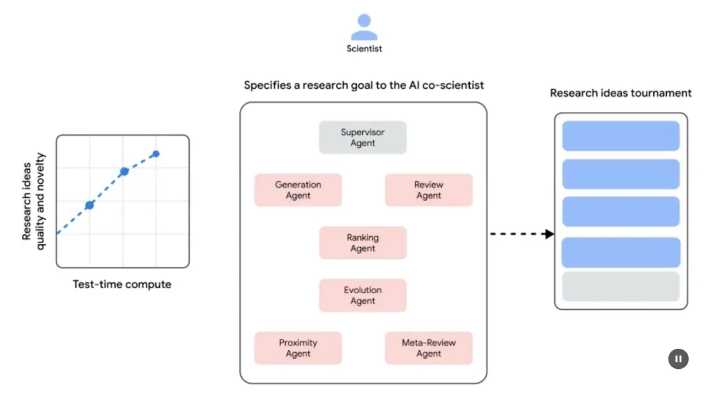
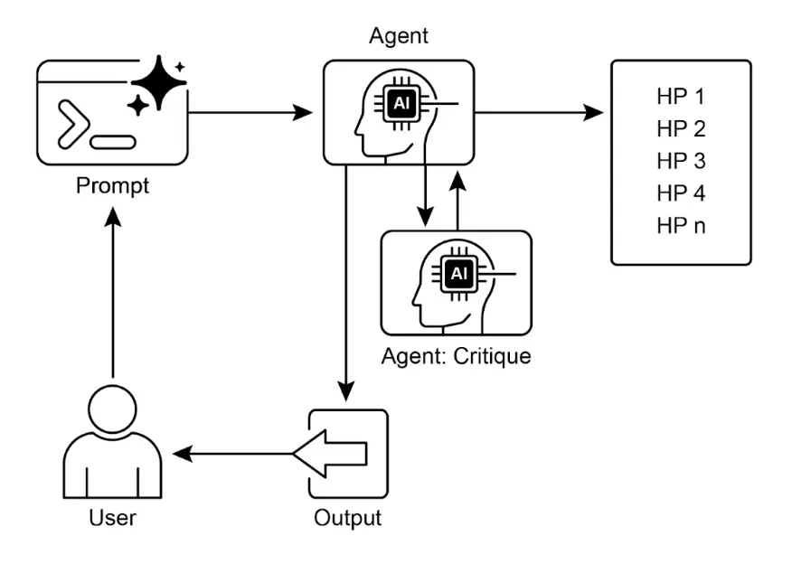

# 第 21 章：探索与发现

    本章介绍了使智能体能够主动寻找新信息、发现新可能性并识别“未知的未知”模式。探索与发现不同于反应式行为或在预定义解空间内的优化，其核心在于智能体主动进入陌生领域，尝试新方法，并生成新的知识或理解。这一模式对于在开放式、复杂或快速变化领域中工作的智能体至关重要，因为静态知识或预编程方案已无法满足需求。它强调智能体扩展自身认知和能力的能力。

## 实践应用与场景

    智能体具备智能优先排序和探索能力，广泛应用于各领域。通过自主评估和排序潜在行动，这些智能体能够在复杂环境中导航、发现隐藏洞见并推动创新。优先探索能力使其能够优化流程、发现新知识并生成内容。

    示例：

* **科学研究自动化**：智能体设计并运行实验，分析结果，提出新假设，发现新材料、药物候选或科学原理。
* **游戏策略生成**：智能体探索游戏状态，发现新策略或识别环境漏洞（如 AlphaGo）。
* **市场调研与趋势发现**：智能体扫描社交媒体、新闻、报告等非结构化数据，识别趋势、消费者行为或市场机会。
* **安全漏洞发现**：智能体主动检测系统或代码库，寻找安全缺陷或攻击向量。
* **创意内容生成**：智能体探索风格、主题或数据组合，生成艺术作品、音乐或文学内容。
* **个性化教育与培训**：AI 教师根据学生进度、学习风格和薄弱环节优先规划学习路径和内容。

## Google Co-Scientist

    AI 联合科学家是 Google Research 开发的科学协作 AI 系统，旨在辅助人类科学家进行假设生成、方案完善和实验设计。该系统基于 Gemini LLM 构建。

    AI 联合科学家解决了科研中的诸多挑战，包括处理海量信息、生成可验证假设和管理实验规划。它通过大规模信息处理和综合，帮助研究者发现数据间的潜在关系，提升认知能力，专注于早期研究阶段的计算密集型任务。

    **系统架构与方法论**：AI 联合科学家采用多智能体框架，模拟协作与迭代过程。架构集成了多个专职智能体，每个智能体在研究目标中承担特定角色。主管智能体负责管理和协调各智能体活动，异步任务执行框架支持计算资源的灵活扩展。

    核心智能体及其功能（见图 1）：

* **生成智能体**：通过文献探索和模拟科学辩论，提出初步假设。
* **反思智能体**：作为同行评审，评估假设的正确性、新颖性和质量。
* **排序智能体**：采用 Elo 排名，通过模拟辩论比较、排序和优先假设。
* **进化智能体**：持续优化高排名假设，简化概念、综合观点并探索非常规推理。
* **邻近智能体**：计算邻近图，聚类相似观点，辅助探索假设空间。
* **元评审智能体**：综合所有评审和辩论结果，识别共性并反馈，推动系统持续改进。

    系统依托 Gemini，具备语言理解、推理和生成能力。采用“测试时计算扩展”机制，动态分配更多计算资源以迭代优化输出。系统可处理和综合学术文献、网络数据和数据库等多源信息。



    图 1：（作者提供）AI 联合科学家：从构思到验证

    系统遵循“生成 - 辩论 - 进化”迭代流程，模拟科学方法。人类科学家输入科学问题后，系统自我循环生成、评估和优化假设。假设经过智能体间内部评估和锦标赛式排名机制系统性审查。

    **验证与结果**：AI 联合科学家已在生物医学等领域通过自动化基准、专家评审和端到端实验验证其效用。

    **自动化与专家评估**：在 GPQA 基准测试中，系统内部 Elo 评分与结果准确率高度一致，“钻石集”难题 top-1 准确率达 78.4%。在 200 多个研究目标中，测试时计算扩展可持续提升假设质量。针对 15 个挑战性问题，AI 联合科学家表现优于其他先进 AI 模型和人类专家“最佳猜测”。小规模评估中，生物医学专家认为其输出更具新颖性和影响力。系统生成的药物再利用方案（NIH Specific Aims 格式）也被六位肿瘤学专家评为高质量。

    **端到端实验验证**：

    药物再利用：针对急性髓性白血病（AML），系统提出了新药物候选，如 KIRA6，之前未有相关临床证据。后续体外实验证实 KIRA6 及其他建议药物在多种 AML 细胞系中能有效抑制肿瘤细胞活性。

    新靶点发现：系统发现了肝纤维化的新表观遗传靶点。人源肝类器官实验验证了这些发现，相关药物具有显著抗纤维化活性。其中一种药物已获 FDA 批准用于其他疾病，具备再利用潜力。

    抗菌耐药性：AI 联合科学家独立复现了未发表的实验发现。系统被要求解释为何某些移动遗传元件（cf-PICIs）广泛存在于多种细菌中。两天内，系统提出 cf-PICIs 与多种噬菌体尾部相互作用以扩展宿主范围，这与独立研究团队十余年后实验验证的发现一致。

    **增强与局限性**：AI 联合科学家强调增强人类研究而非完全自动化。研究者通过自然语言与系统互动，反馈、贡献观点并引导 AI 探索，实现“科学家在环”协作。系统局限包括仅依赖开放文献，可能遗漏付费墙后的重要成果；对负面实验结果获取有限，而这些对资深科学家至关重要。此外，系统受限于底层 LLM，可能出现事实错误或“幻觉”。

    **安全性**：系统高度重视安全，所有研究目标和生成假设均进行安全审查，防止用于不安全或不道德研究。初步安全评估（1200 个对抗性目标）显示系统能有效拒绝危险输入。系统通过 Trusted Tester Program 向更多科学家开放，收集真实反馈以确保负责任发展。

## 实践代码示例

    以下是“Agent Laboratory”项目（Samuel Schmidgall 开发，MIT 许可）在探索与发现中的实际应用。

    “Agent Laboratory”是一个自主科研工作流框架，旨在增强而非取代人类科学研究。系统利用专用 LLM 自动化科研各阶段，使研究者能将更多精力投入于构思和批判性分析。

    框架集成了“AgentRxiv”，一个去中心化的自主研究智能体成果库，支持智能体成果的存储、检索和开发。

    Agent Laboratory 研究流程分为以下阶段：

1. **文献综述**：专用 LLM 智能体自动收集并分析相关学术文献，利用 arXiv 等数据库，识别、综合和分类研究，建立后续阶段的知识基础。
2. **实验阶段**：包括实验设计、数据准备、实验执行和结果分析。智能体可调用 Python 代码生成与执行、Hugging Face 模型访问等工具，实现自动化实验，并根据实时结果迭代优化实验流程。
3. **报告撰写**：系统自动生成完整研究报告，将实验结果与文献综述结合，按学术规范结构化文档，并集成 LaTeX 等工具实现专业排版和图表生成。
4. **知识共享**：AgentRxiv 平台支持自主研究智能体共享、访问和协作推进科学发现，促进研究成果的积累和进步。

    Agent Laboratory 的模块化架构保证了计算灵活性，目标是通过自动化任务提升科研效率，同时保持人类主导。

    **代码分析**：由于篇幅限制，无法全面分析代码，但这里提供关键思路，鼓励读者自行深入研究。

    **评审机制**：系统采用三智能体评审机制模拟人类多元评判。三位自主智能体分别从不同角度评估输出，模拟人类评审的复杂性和多样性，实现更全面的质量把控。

```python
class ReviewersAgent:
    def __init__(self, model="gpt-4o-mini", notes=None, openai_api_key=None):
        if notes is None: 
            self.notes = []
        else: 
            self.notes = notes
        self.model = model
        self.openai_api_key = openai_api_key

    def inference(self, plan, report):
        reviewer_1 = "你是一个严苛但公正的评审，关注实验是否带来研究洞见。"
        review_1 = get_score(outlined_plan=plan, latex=report, reward_model_llm=self.model, reviewer_type=reviewer_1, openai_api_key=self.openai_api_key)

        reviewer_2 = "你是一个严苛且批判但公正的评审，关注研究是否对领域有影响。"
        review_2 = get_score(outlined_plan=plan, latex=report, reward_model_llm=self.model, reviewer_type=reviewer_2, openai_api_key=self.openai_api_key)

        reviewer_3 = "你是一个严苛但公正且开放的评审，关注是否有前所未有的新观点。"
        review_3 = get_score(outlined_plan=plan, latex=report, reward_model_llm=self.model, reviewer_type=reviewer_3, openai_api_key=self.openai_api_key)

        return f"评审 #1:\n{review_1}, \n评审 #2:\n{review_2}, \n评审 #3:\n{review_3}"
```

    评审智能体通过特定提示词模拟人类专家的认知框架和评判标准，分析输出时关注相关性、连贯性、事实准确性和整体质量。通过贴近人类评审流程的提示词，系统力求实现接近人类水平的评判能力。

```python
def get_score(outlined_plan, latex, reward_model_llm, reviewer_type=None, attempts=3, openai_api_key=None):
    e = str()
    for _attempt in range(attempts):
        try:
            template_instructions = """
            请按如下格式回复：

            思考：
            <THOUGHT>

            评审 JSON:
            ```json
                <JSON>
            ```

            在 <THOUGHT> 部分，简要说明你的直觉和评判理由，详细阐述你的高层次观点、必要选择和期望结果。不要泛泛而谈，要针对当前论文具体分析。视为评审的笔记阶段。

            在 <JSON> 部分，按顺序给出如下字段：
            - "Summary": 论文内容及贡献摘要
            - "Strengths": 优点列表
            - "Weaknesses": 缺点列表
            - "Originality": 1-4（低、中、高、极高）
            - "Quality": 1-4（低、中、高、极高）
            - "Clarity": 1-4（低、中、高、极高）
            - "Significance": 1-4（低、中、高、极高）
            - "Questions": 需作者回答的问题
            - "Limitations": 局限性及潜在负面影响
            - "Ethical Concerns": 是否有伦理问题（布尔值）
            - "Soundness": 1-4（差、一般、好、优秀）
            - "Presentation": 1-4（差、一般、好、优秀）
            - "Contribution": 1-4（差、一般、好、优秀）
            - "Overall": 1-10（强烈拒绝到获奖质量）
            - "Confidence": 1-5（低、中、高、极高、绝对）
            - "Decision": 仅用 Accept 或 Reject

            "Decision" 字段只用 Accept 或 Reject，不用弱接受、边界接受、边界拒绝或强烈拒绝。JSON 格式需精确，便于自动解析。
            """
            
            # 这里应该有实际的模型调用逻辑
            # 为了示例完整性，这里省略具体实现
            break
            
        except Exception as ex:
            e = str(ex)
            continue
    
    return template_instructions
```

    在多智能体系统中，研究流程围绕专职角色展开，模拟学术团队层级，优化协作与产出。

    **教授智能体**：作为研究总负责人，制定研究议程、定义问题并分配任务，确保战略方向与项目目标一致。

```python
class ProfessorAgent(BaseAgent):
    def __init__(self, model="gpt4omini", notes=None, max_steps=100, openai_api_key=None):
        super().__init__(model, notes, max_steps, openai_api_key)
        self.phases = ["报告撰写"]

    def generate_readme(self):
        sys_prompt = f"""你是{self.role_description()} \n 这是已完成的论文 \n{self.report}。任务说明：你的目标是整合所有知识、代码、报告和笔记，生成 github 仓库的 readme.md。"""
        history_str = "\n".join([_[1] for _ in self.history])
        prompt = (
            f"""历史记录: {history_str}\n{'~' * 10}\n"""
            f"请用 markdown 生成 readme：\n")
        model_resp = query_model(model_str=self.model, system_prompt=sys_prompt, prompt=prompt, openai_api_key=self.openai_api_key)
        return model_resp.replace("```markdown", "")
```

    **博士后智能体**：负责具体研究执行，包括文献综述、实验设计与实施、论文撰写。可编写和执行代码，实现实验协议和数据分析，是主要研究成果生产者。

```python
class PostdocAgent(BaseAgent):
    def __init__(self, model="gpt4omini", notes=None, max_steps=100, openai_api_key=None):
        super().__init__(model, notes, max_steps, openai_api_key)
        self.phases = ["方案制定", "结果解读"]

    def context(self, phase):
        sr_str = str()
        if self.second_round:
            sr_str = (
                f"以下为前次实验结果\n",
                f"前次实验代码：{self.prev_results_code}\n"
                f"前次结果：{self.prev_exp_results}\n"
                f"前次结果解读：{self.prev_interpretation}\n"
                f"前次报告：{self.prev_report}\n"
                f"{self.reviewer_response}\n\n\n"
            )
        if phase == "方案制定":
            return (
                sr_str,
                f"当前文献综述：{self.lit_review_sum}",
            )
        elif phase == "结果解读":
            return (
                sr_str,
                f"当前文献综述：{self.lit_review_sum}\n"
                f"当前方案：{self.plan}\n"
                f"当前数据集代码：{self.dataset_code}\n"
                f"当前实验代码：{self.results_code}\n"
                f"当前结果：{self.exp_results}"
            )
        return ""
```

    **评审智能体**：对博士后智能体的研究成果进行评估，关注论文和实验结果的质量、有效性和科学性，模拟学术同行评审流程，确保研究输出达标。

    **机器学习工程智能体**：作为 ML 工程师，与博士生协作开发代码，主要负责数据预处理，结合文献综述和实验方案，生成简单实用的数据准备代码，确保数据适用于实验。

```text
"你是机器学习工程师，由博士生指导协作写代码，可通过对话互动。\n"
"你的目标是为指定实验生成数据准备代码，代码应尽量简单，结合文献综述和方案，完成数据预处理。\n"
```

    **软件工程智能体**：指导 ML 工程师，协助其生成简单的数据准备代码，结合文献综述和实验方案，确保代码简洁且紧贴研究目标。

```text
"你是软件工程师，指导机器学习工程师写代码，可通过对话互动。\n"
"你的目标是帮助 ML 工程师为指定实验生成数据准备代码，代码应尽量简单，结合文献综述和方案，完成数据预处理。\n"
```

    综上，“Agent Laboratory”是一个高度自动化的科研框架，通过自动化各阶段并促进 AI 协作，增强人类研究能力。系统通过管理常规任务提升效率，同时保持人类主导。

## 一图速览

    **是什么**：智能体通常依赖预定义知识，难以应对新情境或开放式问题。在复杂动态环境中，静态信息不足以实现真正创新或发现。关键挑战是让智能体超越简单优化，主动寻找新信息和“未知的未知”，实现从被动反应到主动探索的范式转变，扩展系统认知和能力。

    **为什么**：标准做法是构建专为自主探索与发现设计的智能体系统，通常采用多智能体框架，专用 LLM 协作模拟科学方法。不同智能体负责假设生成、评审和进化，结构化协作使系统能智能导航信息空间、设计实验并生成新知识。自动化探索环节，增强人类智力，加速发现进程。

    **经验法则**：当任务处于开放式、复杂或快速变化领域，解空间未完全定义时，优先采用探索与发现模式。适用于需要生成新假设、策略或洞见的场景，如科学研究、市场分析和创意内容生成。目标是发现“未知的未知”，而非仅优化已知流程。

    **视觉摘要**



    图 2：探索与发现设计模式

## 关键要点

* AI 的探索与发现能力使智能体能主动获取新信息和可能性，适应复杂动态环境。
* Google Co-Scientist 等系统展示了智能体如何自主生成假设和设计实验，辅助人类科研。
* Agent Laboratory 的多智能体框架通过自动化文献综述、实验和报告撰写提升科研效率。
* 这些智能体通过管理计算密集型任务，增强人类创造力和问题解决能力，加速创新与发现。

## 总结

    探索与发现模式是真正智能体系统的核心，定义了智能体超越被动执行、主动探索环境的能力。这种内在驱动力使 AI 能在复杂领域自主行动，不仅完成任务，还能独立设定子目标，发现新信息。多智能体框架最能体现高级智能体行为，每个智能体在协作中承担主动角色。例如，Google Co-Scientist 通过智能体自主生成、辩论和进化科学假设。

    Agent Laboratory 进一步通过模拟人类科研团队层级结构，实现整个发现生命周期的自我管理。该模式的核心在于协调涌现的智能体行为，使系统能以最小人类干预追求长期开放目标，提升人机协作水平，让 AI 成为真正的自主探索伙伴。将主动探索任务交由智能体系统，极大增强人类智力，加速创新。开发强大智能体能力也需高度安全与伦理保障。最终，该模式为打造真正智能体 (Agentic AI) 提供蓝图，让计算工具转变为独立、目标驱动的知识伙伴。

## 参考文献

* [探索 - 利用困境 – 维基百科](https://zh.wikipedia.org/wiki/%E6%8E%A2%E7%B4%A2%E2%80%93%E5%88%A9%E7%94%A8%E5%9B%B0%E5%A2%83)
* [Google Co-Scientist – research.google.com](https://research.google/blog/accelerating-scientific-breakthroughs-with-an-ai-co-scientist/)
* [Agent Laboratory – GitHub](https://github.com/SamuelSchmidgall/AgentLaboratory)
* [AgentRxiv – agentrxiv.github.io](https://agentrxiv.github.io/)
