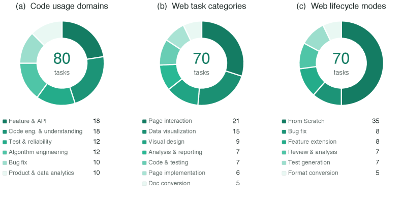
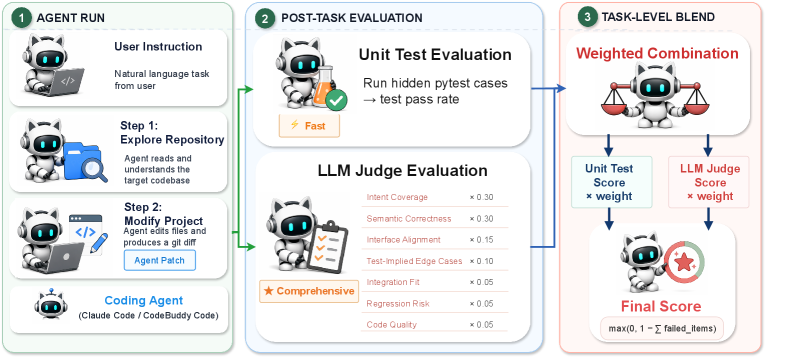
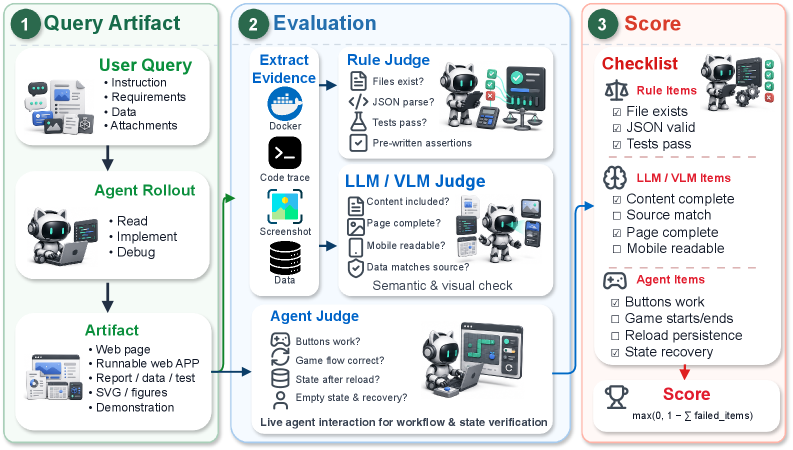
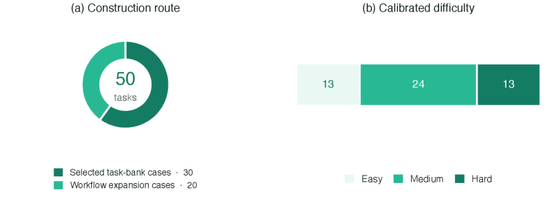
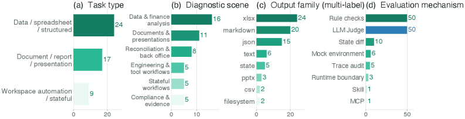
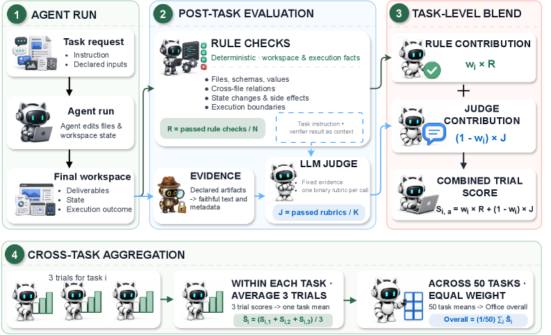
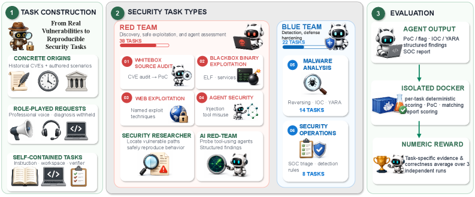
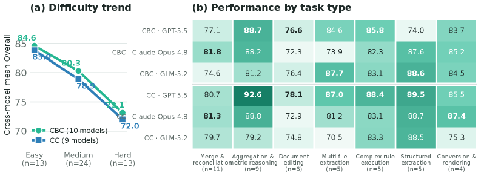

# Coding Agent Bench：一种具有抗污染任务构造的多领域编码智能体基准

**Coding Agent Bench Team**
Coding Agent Bench Team

---

## 摘要

本文提出腾讯 Coding Agent Bench，一套面向代码智能体的多领域评测套件；本报告阐述该评测套件的构建方法、打分规则以及跨模型排行榜。该套件的核心是一套统一评测框架，可构建并执行贴合真实分布的代码智能体任务，覆盖四大工作领域：代码、网页、办公与安全。
本评测集并未直接复用公开的问题文本，所有任务均由真实提交记录、合并请求或业务场景逆向推导而来，并改写为简短、口语化的角色扮演式需求。因此，无法通过网络搜索原始问题、合并请求或提交记录来还原任务提示词。该数据集完全开源发布，包含任务目录、环境镜像、评测驱动程序、测试用例以及参考解法；其抗数据污染能力依靠这套任务构建方式与数据集版本管理机制实现，而非依靠数据保密。
四大子数据集分别对应仓库级工程开发、前端开发、办公业务工作流、红蓝对抗安全场景，从不同维度模拟真实工作，各子数据集拥有独立的验证方式。全部任务采用统一的任务目录格式封装，可基于两套智能体运行框架（CodeBuddy Code、Claude Code），按照统一、可复现的流程执行。完整开源版本支持端到端复现评测结果，第三方可重新运行每一项任务并查看全部内容，具备可审计性。
由于各子数据集采用不同打分机制，不同子集之间分数不具备可比性，本套件不提供整体平均分。文中给出了多系列模型的跨模型评测排行榜。

---

## 1 引言


**图 1：Coding Agent Bench 概览。** 真实的提交（commits）、拉取请求（pull requests）、办公工作流和安全案例被逆向工程为口语化的角色请求，任务分布与真实使用情况匹配（左）；四个赛道——代码（Code）、Web、办公（Office）和安全（Security）——共享一个开放的任务目录格式（中）；每个任务在隔离的沙箱中由两种智能体框架（agent harnesses）评分（右）。

**为什么这四个领域属于同一套件。** 当编码智能体被置于真实组织工作中时，它不再仅仅编辑代码：同一个智能体还被要求构建 Web 前端、生成或协调办公文档，以及推理安全工件。代码、Web、办公和安全是该工作跨越的四个工件和工作流边界，该套件将它们视为一体，因为在每个边界处任务形态是相同的——智能体被放入工作空间，从自然语言请求中生成工件，并由一个它永远看不到的验证器评分。正是这种共享形态（而非共享评分规则）使四个子集成为一个套件。

任务分布由真实使用分析提供信息，而非重用真实使用数据。每个子集的类别、任务模式和难度分布与内部使用分类法（查询意图类别和请求结构模式）相匹配，例如代码的 80 个任务涵盖五种请求者角色和远超错误修复的任务类型（第 3 节）。被分析和匹配的是真实请求的*分布*，而非请求本身：没有原始用户提示、会话或用户数据在发布的任务中被重用或暴露。这也是该套件可以完整发布和公开审计的原因，而基于原始会话的基准面临限制披露的隐私约束。

简而言之，本报告提供三方面内容：套件的设计、各子集的当前任务集组成，以及跨模型排行榜。表 1 总结了四个子集。

**表 1：套件概览：四个子集，均在双框架（CodeBuddy Code 和 Claude Code）下评分。所有子集均为初始公开发布版本。**

| 子集 | 领域 | 规模 | 指标 |
| --- | --- | --- | --- |
| Code | 仓库级软件工程 | 80 个任务 | 每次运行的隐藏测试分数 |
| Web | 前端 / GUI | 70 个任务 | 评分标准评分（规则 / LLM-VLM / 智能体） |
| Office | 办公数据与文件工作流 | 50 个任务 | 任务特定的规则/评判混合 |
| Security | 红蓝队安全 | 60 个任务 | 程序化评分脚本（无 LLM 评判） |

报告的其余部分组织如下：第 6 节首先将该套件与代码和 Web 领域的现有公共及供应商生产智能体基准进行对比。第 2 节描述套件的共享设计原则、任务格式和执行模型，随后是详述四个子集、评估框架和评分方法论、结果及局限性的各节。

---

## 2 任务构造
本节阐述腾讯 Coding Agent Bench 套件级别的构建规范。代码、网页、办公、安全四大子数据集的任务均遵循统一的核心流程：素材来源采集、改写为真实业务需求、组装智能体可见工作空间、在任务会话结束前隔离评测资源，最后将每项任务封装为独立完整目录。整个构建过程全程规避用户原始数据。
各子数据集的打分工具与准入校验规则并不统一：代码子集采用隐藏测试用例；网页子集结合规则、大模型 / 多模态大模型以及智能体评判打分细则；办公子集混合使用确定性规则校验与基于事实依据的大模型评判标准；安全子集则使用确定性的 scoring.py 脚本。由于评判工具各不相同，各子集得分不可横向对比，本评测套件不输出整体平均分；该设计为刻意选择，而非有待修复的缺陷。本节主要介绍任务构建与封装；任务执行与各赛道打分规则将统一在第 4 章说明。  

#### 任务来源
所有任务均锚定两类真实原始素材之一：一类是真实上游产出物，即开源仓库中的历史提交记录、合并请求（代码子集），或是真实历史 CVE 漏洞（安全子集的白盒审计任务）；另一类是真实业务场景（网页、办公子集，以及代码、安全子集中的合成任务系列）。任务类型与占比参照内部业务使用分类体系确定：每个子集的类别、任务模式、角色、难度配比贴合真实业务请求的分布特征，但不会直接复用原始请求文本。
所有任务均不引入原始用户提示词、会话记录或其他用户数据；构建仅参考整体业务分布统计。在业务场景类任务中，办公子集包含两种构建路径：基于任务规格与目标能力重构任务，以及对抽象办公工作流进行拓展生成任务。两类任务均封装为独立工作空间，仅包含可公开分享的输入数据，并统一通过工作空间完整性、评测资源、校准、发布就绪度校验。

#### 改写规范

任务不会写成规整的问题标题或教科书式习题。如果任务源自上游真实素材，则对原始上下文逆向还原，改写为简短、口语化、信息不完备的自然语言需求；如果基于业务场景创作，则直接采用相同口吻编写需求。无论哪种来源，需求读起来都如同同事或客户提出的真实诉求。其中代码子集还会为每个任务分配五种请求者身份之一（开发工程师、算法工程师、产品经理、测试工程师、运维人员），安全子集也会为各任务分配对应专业角色。
指令会刻意隐藏根本原因、参考代码变更片段以及任何能够直接泄露解法的提示信息，智能体必须自行在工作空间中定位相关内容后，才能开展工作。这与那些直接提供详尽、已经完成问题诊断报告的评测基准形成鲜明对比。

#### 刻意欠规范

四大子集的需求均模拟真实同事的沟通方式：只给出业务意图与约束条件，而非完整完备的技术规格，刻意保留信息缺口。需求通常不会指明目标文件或模块、确切的数据结构与接口、边界条件处理逻辑，以及改动的精确范围。
补齐这些缺失信息本身就是任务的一部分：智能体必须从工作空间（代码仓库、测试数据、现有代码与接口）挖掘缺失上下文，并做出合理的隐性假设，而非直接获得预设条件。该设计为有意为之，并非疏漏：评测不仅考察代码生成能力，同样考验需求理解澄清与现实场景落地能力，这也是真实业务需求和规整的 issue 标题的核心区别。
任务奖励分数由专属校验逻辑、评分细则或评测流程计算得出，并非简单匹配某一份参考实现或文本表述。评测工具会编码任务预期约束，即便输出结果看似合理，一旦违背约束依旧判定失败。评判智能体的依据是满足任务约定要求，而非复刻某一套标准答案。

#### 回合后评估隔离

在整个回合（episode）中，智能体只看到任务指令和声明的工作空间，而非评分资产。只有在智能体完成所有操作后，任务特定的检查、评分标准或评估程序才会被引入沙箱或由评估管线调用。"隐藏"或"保留"因此描述的是求解时的可见性，而非发布后的保密：评估资产与数据集的其余部分一起公开。其形式仍然是子集特定的——代码的隐藏测试、Web 的评分标准评估器、Office 的规则-评判评估和安全的确定性评分器——而共享属性是行动与评分之间的时间边界。代码的诊断性黄金补丁（gold patch）和预言机门控准入在第 3 节的代码子节中描述。

#### 任务目录格式

任务使用 Harbor [6] 风格的任务目录约定进行打包，与原始 Harbor 布局有一个小的差异，将智能体可见的工作空间与回合后评估资产分开：

```
tasks/<task-name>/
  task.toml
  instruction.md
  environment/
    Dockerfile
  workspace/
  tests/
    test.sh
  grading/
    gold.patch  （可选；代码诊断参考）
```

#### 执行

打包任务的执行方式——沙箱容器生命周期、模型连接、框架后端以及每个赛道的评分规则——在第 4 节中统一规定。

#### 抗污染任务构造

#### 版本命名

每个子集带有一个内部版本标识符，结合主要索引和日期戳，但主要索引的语义是子集特定的而非统一顺序的，因此版本号在子集之间不可直接比较。

### 2.1 发布内容

**表 2：开放发布：数据集包含运行、评分和审计任务所需的每个组件。**

| 组件 | 状态 |
| --- | --- |
| 任务目录骨架和打包约定（本节） | 已发布 |
| 任务提示和指令文本 | 已发布 |
| 工作空间/环境镜像（用于离线第三方测试） | 已发布 |
| 评估框架和分数聚合代码 | 已发布 |
| 评分测试（在求解时对智能体保留的验证器） | 已发布 |
| 黄金补丁和参考解决方案 | 已发布 |
| 每任务和聚合分数，以及公开排行榜 | 已发布 |
| 任何类型的用户数据 | 完全未使用——不存在可发布的数据 |

---

## 3 基准测试

Coding Agent Bench 组织为四个互补的子集——代码（Code）、Web、办公（Office）和安全（Security），每个子集针对一类独特的现实智能体任务，同时共享通用的任务格式和评分理念。本节介绍代码子集；后续章节依次介绍 Web、Office 和 Security。

### 3.1 代码（Code）

代码子集衡量智能体能否对完整的开源仓库执行真实的、角色化的工程请求——不是单文件玩具问题，也不是预先诊断好的错误报告。智能体被放入一个检出到基线提交的项目中，必须跨模块定位相关代码、做出更改，并保持项目的隐藏测试通过。该子集的独特之处在于其角色和任务类型多样性：每个任务由五种请求者角色之一发出——开发者（developer）、算法工程师（algo）、产品经理（pm）、质量保证（qa）和运维（ops）——涵盖的范围远超错误修复（表 4，图 2(a)）。

#### 任务来源

每个任务将其目标变更表达为自然语言的角色化请求，因此求解它需要阅读和推理仓库本身。在 80 个任务中，34 个锚定到真实上游提交 against 实际 OSS 快照（家族 A）；其余 46 个没有上游代码，并在近似内部分布上分为：清洁室重新实现（家族 B，24 个任务，包括 4 个将 JavaScript/TypeScript/Rust 目标移植到 Python 的任务）和完全合成工作空间（家族 C，22 个任务），如表 3 所总结。

**表 3：代码子集来源家族。计数总和为 80 个任务发布：A = 34，B + C = 46。**

| 家族 | 定义 | 计数 | 示例 |
| --- | --- | --- | --- |
| A | 真实 OSS 快照在上游提交处；黄金补丁是实际的人工修复 | 34 | Django, Flask, pytest, Black, Pydantic, httpx, Celery（约 18 个仓库） |
| B | 目标库公共 API 的清洁室 *_like 重新实现，未复制原始代码；包括 4 个跨语言移植（JS/TS/Rust 原始版本的 Python 移植） | 24 | fastapi_like/openapi.py 存根而非 FastAPI 本身 |
| C | 完全合成工作空间，带有 CSV/JSON 固定数据，为直接锻炼角色的工作流而编写 | 22 | algo 工作空间（12）和 pm 数据工作空间（10） |

#### 规模和发布

代码子集包含 80 个任务。每个任务以自包含的 Harbor 风格任务目录发布——instruction.md、task.toml 元数据、目标仓库的 environment/ Docker 快照，以及包含隐藏测试和诊断 gold.patch 的 tests/ 目录——遵循第 2 节的任务目录格式。

#### 预言机门控准入

每个候选代码任务在准入前通过两次运行验证。首先构建任务镜像，并针对未更改的基线工作空间运行验证器。然后任务的 solution/solve.sh 应用诊断性黄金补丁，之后再次运行验证器。准入要求基线奖励 ≤ 0.3 且预言机奖励 = 1.0。这移除了初始工作空间已经满足过多预期契约的任务，以及黄金补丁无法达到完整验证器奖励的任务。黄金补丁仅用于此验证的诊断参考，不是唯一正确的解决方案；任何满足隐藏测试的补丁都会获得相应的奖励。

**表 4：代码子集组成（80 个任务开放发布）。**

| 维度 | 分布 |
| --- | --- |
| 角色 | developer 30 · algo 19 · pm 15 · ops 10 · qa 6 |
| 难度（编辑） | easy 7 · medium 31 · hard 42 |
| 难度（L 阶梯） | L2 4 · L3 27 · L4 40 · L5 9（集中在 L4） |
| 准入门控 | 基线 ≤ 0.3，预言机（黄金补丁）== 1.0（针对隐藏测试） |

#### 领域和难度

任务携带 18 个细粒度类别之一，合并为六个使用领域以提高可读性（图 2(a)）。错误修复仅占 80 个任务中的 10 个；其余五个领域——功能和接口工作、代码工程、测试、算法工程和产品/数据分析——承担剩余的 70 个，这是对早期基准"修复错误、添加功能"框架的有意扩展。难度主要来自跨模块探索——找到*在哪里*编辑而非*如何*编辑——并随仓库规模和结构增长，因为任务沿 L 阶梯攀升，这是一个从 L2（小型、少量模块）到 L5（大型多模块代码库）的仓库复杂度量表。表 4 给出了角色和难度分布。

在构建过程中的早期评估运行展示了仓库规模下的失败模式：主要的零分模式是智能体在测试文件编辑上循环直到超时，以及智能体在大型代码库中迷失方向并编辑了完全错误的文件——这表明难度来自导航和定位而非代码合成。



**图 2：代码和 Web 任务组成。** (a) 从 18 个细粒度类别合并的六个代码使用领域；错误修复占 80 个任务中的 10 个。(b) 七个 Web 任务类别。(c) 六个 Web 生命周期模式；从零开始（From Scratch）占 70 个任务中的 35 个。

一个代表性的角色化请求（产品经理，产品分析，signup_funnel，困难）：

> "结账副本实验结束了；我想知道新版本是否更好。数据有曝光和购买事件——请计算每组的转化率、收入和一个简单的结论，不要计算很久之后发生的购买。"

该请求陈述了意图和约束，而非实现计划：它既没有命名相关文件、预期模式，也没有规定排除延迟购买的归因窗口应如何划定，留给智能体从仓库本身恢复该上下文。

#### 评分

每个任务由智能体补丁应用后在其 Docker 镜像内运行的每任务验证器评分；代码的主要指标是运行级分数，即每任务隐藏测试分数的每运行平均值。第 4 节完整给出了三种验证器形式、黄金补丁处理和参考读数。图 3 总结了该任务和评估工作流。



**图 3：代码任务和评估工作流。** 编码智能体阅读自然语言请求，探索仓库，并生成补丁（左）；补丁由隐藏单元测试评分，并作为诊断参考由按评分标准加权的 LLM 评判评分（中）。代码的主要指标是隐藏测试分数；LLM 评判读数及其混合仅作为参考值报告，不进入主要指标（右）。

### 3.2 Web

Web 子集测试模型能否交付一个可运行的、可检查的前端工件——而不仅仅是在聊天回合中发出看似合理的 HTML。每个任务都携带工件而非聊天契约：智能体必须在声明的输出路径生成可运行的工件（例如 HTML 入口点）；无论内容如何，如果该路径没有工件，则写得再好的答案也会失败。在 70 个任务中，覆盖范围涵盖前端工件生成、修改、分析和质量保证——页面实现、页面交互、数据可视化、视觉设计、分析报告、代码测试和文档转换。

任务组织为七个类别（图 2(b)）：页面交互（21 个任务）和数据可视化（15）占主导，合计占 70 个任务中的 36 个，其余涵盖视觉设计、前端项目分析、代码测试、页面实现和文档转换——这些是传统前端生成基准很少涉及的工作。

正交地，每个任务被编写为锻炼 Web 开发生命周期中的一个点（图 2(c)）。仅从零开始（From Scratch）只能探测生成能力，因此一半的套件反而要求修复前端状态、运行时或视觉缺陷，扩展现有页面或应用，审查 Web 项目证据，生成回归测试，或将源材料转换为面向前端的交付物——这样只能创建而不能维护的模型不会得到不成比例的奖励。

在面板 (c) 中，从零开始恰好占套件的一半（70 个任务中的 35 个），另一半分布在错误修复（8）、功能扩展（8）、审查与分析（7）、测试生成（7）和格式转换（5）。

第三个轴跟踪交互和状态复杂度。25 个任务是非交互式前端项目工件，45 个需要交互或状态：单流程状态变更（15）、持久化/离线或跨状态行为（13）、多步工作流（9）和轻度交互（8）。这个轴防止子集坍缩为静态页面生成：许多任务需要工件的状态在用户操作下变更、恢复或保持一致。

一个来自页面交互类别的代表性请求（移动商店预约）：

> "我想要一个移动商店预约页面：用户选择服务和时间段，填写联系信息，然后确认。已满的时间段不可选择，提交前应有审查步骤。"

该请求命名了意图和几个约束——时间段容量、提交前的审查步骤——而非完整规范，留给智能体生成可运行的工件供评分标准验证请求的行为。



**图 4：Web 任务和评估工作流。** 从查询和智能体部署到交付的工件（左），通过规则、LLM/VLM 和智能体评判对提取的证据进行评判（中），到评分标准项目清单评分（右），结合确定性检查、语义和视觉判断，以及对交付工件的实时交互。

评分使用由规则检查、LLM/VLM 评判和智能体评判的评分标准项目。规则检查涵盖确定性交付约束，如文件、格式、预检查和可执行测试；LLM/VLM 评判审查文本、结构化、DOM、截图和视觉证据；智能体评判驱动运行中的工件以检查工作流、状态变化和持久化。运行仍必须在声明的输出路径交付声明的工件，且任务运行时无法访问实时互联网、外部账户、密钥或实时数据。第 4 节完整给出了项目计数、聚合规则和模型评判风险。

### 3.3 Office（办公）

Office 子集测试智能体能否在包含混合格式文件的本地工作空间中完成自然语言工作请求。输入包括电子表格、文档、PDF、JSON 导出、Markdown 笔记和文件树；输出包括更新的工作簿、报告、结构化记录、状态文件和交接材料。智能体必须生成请求的交付物，保持跨文件信息一致，更新相关状态，保留证据供审查，并尊重任务特定的执行约束。评估检查工作空间最终状态，这能捕获文本答案分数遗漏的失败，例如写了一个看似合理的摘要但未更新其描述的工作簿，或创建了文件但留下依赖状态不一致。

#### 规模和覆盖

难度报告为三个校准层级：13 个简单、24 个中等和 13 个困难任务。输出家族使用多标签计数：24 个任务生成电子表格，20 个 Markdown，15 个 JSON，6 个纯文本，5 个工作空间或状态输出，对演示文稿、CSV、清单、文件系统和审计日志交付物有较小覆盖。发布是文本优先的：其核心任务和评估不要求 OCR、视觉语言模型或像素级布局判断。



**图 5：50 个任务 Office 发布按构造路径和校准难度的组成。**



**图 6：Office 在任务类型、诊断场景、输出家族和评估机制上的覆盖。** 排列为单行四个条形图。输出家族和机制使用多标签计数；场景组描述基准覆盖范围，不是生产请求流量的估计。

#### 构造和难度

每个任务从目标能力或工作流开始。然后构建智能体可见的工作空间和分离的评估资产，在保存的提交上测试评估器，校准难度，并运行发布检查。在执行期间，智能体只看到请求和声明的输入；参考答案、预期状态、规则检查、语义评分标准和评估支持文件仅在智能体完成后使用。发布前，保存提交的回放检查评估器是否覆盖客观要求，为语义评分标准提供足够证据，且不惩罚有效的髙质量输出。

难度来自解决方案路径而非仅文件数量。常见要求包括跨文件键匹配和别名解析、时间或状态依赖、规则优先级、冲突或缺失证据，以及跨多个交付物的一致性。困难任务可能要求智能体协调多个来源、保留未解决的冲突、同时更新主要交付物和状态记录，并避免禁止的副作用。这些要求有助于区分模型能力，而不依赖实时服务或未公开的账户。

#### 评分

每个 Office 任务使用两个评分组件：确定性规则检查和基于证据的 LLM 评判。规则检查是可精确评估的客观要求的二元测试，如所需文件、模式、值、源关系、状态转换、副作用和执行约束。每个语义评分标准定义一个二元质量条件，由评判从任务结束后生成的固定证据中评估。评判不检查工作空间或更改记录的规则检查结果。所有 50 个任务同时使用两个组件。第 4 节定义每个任务如何组合规则和评判分数。



**图 7：Office 任务、评估和评分流程。** 智能体对工作空间进行操作并留下最终状态（左）；确定性规则检查评估可验证的工作空间状态，LLM 评判仅评估固定的任务后证据（中）；每个任务将两个分数与其自身权重组合，试验在每个任务内取平均，任务分数以等权重宏平均（右）。

### 3.4 Security（安全）

安全子集包含 60 个任务，跨越六个细粒度领域，汇总为红蓝队两个方向的四个块（表 5，图 8）。按学科分组，套件偏向红队——38 个任务对比 22 个蓝队任务——但仍锻炼完整的防御/检测循环，难度设计上偏向困难，反映真实安全工作的平衡，困难案例多于简单案例。

**表 5：安全子集组成，以四块粒度显示（60 个任务）。**

| 块 | 角色 | 任务数 | 学科 |
| --- | --- | --- | --- |
| 漏洞发现与利用 | 安全研究员 | 32 | 红队 |
| 恶意软件分析 | 反病毒工程师 | 14 | 蓝队 |
| 安全运营 | SOC 分析师 / 检测工程 | 8 | 蓝队 |
| 智能体安全 | AI 红队 | 6 | 红队 |

难度设计上偏向困难。



**图 8：Coding Agent Bench 安全概览。** 任务从真实历史漏洞和编写场景构建为可复现、自包含的案例（左）；它们跨越六个红蓝队任务类型——白盒源代码审计、黑盒二进制利用、Web 利用、智能体安全、恶意软件分析和安全运营——涵盖 38 个红队和 22 个蓝队任务（中）；每个由隔离 Docker 容器内的每任务确定性程序评分，输出数值奖励（右）。

每个任务的确定性评分器在隔离 Docker 容器内执行并直接写入数值奖励，因此同一输出重新评分两次会返回相同数字（图 8，右）。第 4 节给出每评分器定义——PoC 和标志验证、IOC 匹配、零假阳性约束下的 YARA 匹配率，以及宏平均-F1/Kendall-tau 报告评分。

#### 反作弊

为在完全自动化的非评判验证下保持分数有意义，每个任务位于五层反作弊基础设施之后，沿输入、代码和输出轴封闭硬编码和枚举：

- 禁止字面量扫描对抗硬编码答案。
- 重命名输入测试检查提取器是否解析结构而非依赖文件名。
- 覆盖/篡改测试对抗尾数据操纵。
- 编码依赖测试要求检测规则锚定字节而非明文。
- 低权重诱饵字段抑制盲枚举的奖励。

与其他子集一样，安全在 CodeBuddy Code 和 Claude Code 框架下均以思考模式评分，三次运行平均；结果见第 5 节。

---

## 4 评估框架和评分

#### 沙箱执行和模型连接

#### 框架后端

#### 评分形式化

赛道任务集 \(\mathcal{T}\) 中的每个任务 \(t\) 产生验证器奖励 \(r_t \in [0,1]\)，模型的赛道分数为未加权平均：

\[S = \frac{1}{|\mathcal{T}|} \sum_{t \in \mathcal{T}} r_t\]

在独立运行间取平均（当赛道评分超过一次时）。每任务奖励因赛道而异。对于代码，\(r_t\) 是智能体补丁的隐藏测试通过率。对于 Web，奖励从任务特定的评分项目集合计算：每个项目返回通过/失败；设 \(F_t\) 为失败的非致命项目集合，每个带有惩罚 \(p_{t,i}\)；任何致命失败将任务奖励设为零：

\[r_t = \begin{cases} 0, & \text{如果任何致命项目失败} \\ \max(0, 1 - \sum_{i \in F_t} p_{t,i}), & \text{其他} \end{cases}\]

对于 Office，任务奖励是确定性规则分数和基于证据的评判分数的任务特定混合；对于安全，每任务确定性评分器组合三个程序化项：\(r_t = w_1 \cdot \text{artifact} + w_2 \cdot \text{correctness} + w_3 \cdot \text{robustness}\)（图 8），三次运行平均。

#### 每赛道评分

每个任务的打包和执行方式相同，但计算的奖励是赛道特定的：

- **代码** —— Harbor 框架计算的运行级分数：每任务隐藏测试分数的每运行平均值，这是本报告中代码的主要指标。验证器采用三种形式之一——pytest 注入套件（80 个任务中的 22 个）、不需要 pytest 或网络访问的功能布尔断言（80 个中的 54 个），或仓库理解任务的 JSON 报告评分器（80 个中的 4 个）；黄金补丁仅为诊断用，任何满足补丁都得满分。
- **Web** —— 786 个评分项目的评分标准评分。规则检查覆盖 62 个确定性交付和预检查项目；LLM/VLM 评判覆盖 676 个项目；智能体评判覆盖 48 个需要操作运行工件的项目。失败项目减去配置的惩罚（0.1/0.2/0.3），致命失败将任务奖励设为零。
- **Office** —— 两个独立保留的评分通道，每个由二元检查组成。确定性规则检查验证文件、结构、值、跨文件关系、状态变化、副作用和执行边界中的客观事实。每个语义评分标准指定一个二元、基于证据的质量条件，由 LLM 评判在任务结束后评估。
- **Security** —— 隐藏测试验证，无 LLM 评判：每个任务附带 scoring.py，在隔离容器中运行，直接写入数值奖励。每个分数取三次独立运行平均。五层反作弊基础设施防护跨输入、代码和输出轴的硬编码。

#### Office 规则-评判组合

对于模型 \(m\) 在 Office 任务 \(i\) 的试验 \(a\) 上，设 \(P_{m,i,a}\) 为任务的 \(N_i\) 个确定性规则检查中通过的数量。规则分数为：

\[R_{m,i,a} = \frac{P_{m,i,a}}{N_i}\]

如果任务 \(i\) 有 \(K_i\) 个语义评分标准，且评分标准 \(k\) 返回 \(b_{m,i,a,k} \in \{0,1\}\)，评判分数为：

\[J_{m,i,a} = \frac{1}{K_i} \sum_{k=1}^{K_i} b_{m,i,a,k}\]

试验分数使用任务的预配置规则权重 \(w_i\)：

\[S_{m,i,a} = w_i R_{m,i,a} + (1 - w_i) J_{m,i,a}\]

每个任务固定 \(w_i\) 在 0.70 和 0.95 之间；Office 不使用单一全局规则权重。设 \(A_i\) 为任务 \(i\) 的可用试验数。这些试验首先取平均，然后如果有 \(T\) 个任务至少有一个可用试验，Office 分数是它们的等权重宏平均。

#### 基于评判的组件和评分风险

#### 推理超参数

模型的有效采样行为可以在三个不同层级设置——供应商自己的服务端默认值、基准的路由/网关层，以及作业配置中的显式覆盖——因此项目维护每模型超参数记录，以避免混淆三者。

#### 披露政策

---

## 5 结果

本节报告 Coding Agent Bench 排行榜，对照套件构建要回答的问题：智能体能力在四类真实工作——代码、Web、办公和安全——中如何排名，以及当框架本身变化时该排名有多稳健。每个分数是三次独立运行在思考模式下的平均值，所有四个子集均在 CodeBuddy Code (cbc) 和 Claude Code (cc) 框架下评分。

**表 6：Coding Agent Bench 排行榜。分数为 0–100，思考模式，三次运行平均，在 CodeBuddy Code (cbc) 和 Claude Code (cc) 框架下。**

| 模型 | Code cbc | Code cc | Web cbc | Web cc | Office cbc | Office cc | Security cbc | Security cc |
| --- | --- | --- | --- | --- | --- | --- | --- | --- |
| Claude Opus 4.8 | 74.43 | 77.90‡ | 68.14 | 69.86 | 82.37 | 83.23 | 64.37 | 65.87 |
| GPT-5.5 | 72.90 | 76.63 | 61.14 | 64.86 | 81.96 | 86.05 | 64.39 | 77.91 |
| GLM-5.2 | 71.54 | 77.06 | 67.43 | 60.71 | 79.60 | 79.57 | 76.32 | 80.86 |
| HY-3 | 62.90 | 66.26 | 67.71 | 66.43 | 82.08 | 80.08 | 64.50 | 65.59 |
| MiniMax-M3 | 60.14 | 66.42 | 58.00 | 52.57 | 78.28 | 76.30 | 74.14 | 59.30 |
| DeepSeek-V4-Pro | 58.92 | 64.59 | 54.57 | 51.57 | 79.11 | 78.71 | 70.04 | 58.73 |
| DeepSeek-V4-Flash | 55.73 | 61.89 | 47.29 | 50.29 | 77.47 | 77.54 | 67.11 | 53.90 |

‡ Claude Opus 4.8 在 Claude Code 下的代码分数来自修改指令运行：在禁用 AskUserQuestion 工具的基础上，添加了显式的"不要提问、一次性完成"指令。

**每赛道领先者。** 没有单一模型在每个排行榜上都居首。在表 6 的八个排行榜中，领导力分三路：Claude Opus 4.8 领先五个——两个框架下的代码、两个框架下的 Web，以及 cbc 下的 Office；GLM-5.2 领先两个——两个框架下的安全；GPT-5.5 领先一个，cc 下的 Office (86.05)。开源权重模型 GLM-5.2 在两个安全排行榜上都居首，这本身就是一个发现：在该套件上，开源权重和封闭前沿模型之间的差距是排行榜依赖的而非均匀的。

**安全上的拒绝。** 少量安全运行在安全风格请求上以任务级拒绝结束。在三次运行中，Claude Opus 4.8 在 Claude Code 下记录了 13 次拒绝（CodeBuddy Code 下为零），GPT-5.5 在 CodeBuddy Code 下记录了 2 次，所有其他模型记录为零。

**哪些代码类别最难。** 代码子集的每类别分布显示最难的两个类别是 bug_fix（平均 0.47）和 api_contract（平均 0.47），最容易的是 feature_pipeline（0.94）和 testing（0.88）。几个产品/分析类别显示异常宽的模型差距（product_analytics 从 0.08 到 1.00）。

**Web 能力切片。** Web 切片结果指向一致模式：视觉设计和分析报告是最强的类别，代码测试和页面实现次之，而页面交互和数据可视化语义暴露了最多失败。



**图 9：Office 结果按难度和任务类型。** (a) 每个框架内按校准难度的平均 Office 分数。(b) 七个诊断任务类型的等权重任务平均。

### 5.1 Token 和回合效率

**表 7：代码子集每运行平均值，按框架：回合数、输出 token 和输入 token（千）。**

| 模型 | cbc 平均回合 | cbc 输出(k) | cbc 输入(k) | cc 平均回合 | cc 输出(k) | cc 输入(k) |
| --- | --- | --- | --- | --- | --- | --- |
| Claude Opus 4.8 | 29.51 | 22.3 | 928.7 | 13.2‡ | 4.7‡ | 646.5‡ |
| GPT-5.5 | 26.92 | 6.9 | 753.2 | 30.44 | 8.7 | 696.5 |
| GLM-5.2 | 33.06 | 12.3 | 861.4 | 33.73 | 22.0 | 1243.3 |
| HY-3 | 26.02 | 9.3 | 586.8 | 18.07 | 13.9 | 659.2 |
| MiniMax-M3 | 28.89 | 8.5 | 1021.4 | 33.90 | 10.6 | 1308.3 |
| DeepSeek-V4-Pro | 44.01 | 10.2 | 800.0 | 24.20 | 23.7 | 642.3 |
| DeepSeek-V4-Flash | 40.30 | 9.8 | 700.5 | 23.12 | 28.6 | 771.4 |

#### 跨子集

代码预算配置不是通用的。Office 运行最精简——16–42 回合和 10–30k 输出 token——Web 居中（13–39 回合），而安全以显著优势是最重的赛道，每运行 30–89 回合。在所有四个赛道中，GPT-5.5 始终是最精简的高分者。

---

## 6 相关工作

我们首先将 Coding Agent Bench 与代码、Web、办公和安全领域的现有智能体基准进行对比。

**Web。** Design2Code [3] 和 Interaction2Code [13] 评估从参考设计进行的静态和轻度交互式页面复现；FrontendBench [14] 将自动评判扩展到更广泛的前端生成任务；WebArena [4] 和 VisualWebArena [15] 评估操作现有浏览器环境的智能体而非从头生成可运行工件。每个在一两个轴上很强，但没有一个结合页面/UI 工作、数据和图表工件、前端项目文档、测试和分析、非零起点生命周期覆盖、运行时交互/状态检查，以及规则、LLM/VLM 和智能体评判。

**表 8：Web 基准能力矩阵。**

| 基准 | 工作表面: UI | App | 数据 | 文档/测试 | 生命周期: 零起点 | 修复/扩展 | 审查/转换 | 运行时证据: 动作 | 状态 | Oracle: 规则 | VLM | 智能体 |
| --- | --- | --- | --- | --- | --- | --- | --- | --- | --- | --- | --- | --- |
| Vibe Code Bench v1.1 | ● | ● | ○ | | ● | | | ● | ○ | ● | | ○ |
| CursorBench 3.1 | ○ | | | ○ | ○ | ● | ● | | | ○ | | ● |
| Design2Code | ● | | | | ● | | | | | ○ | ● | |
| Interaction2Code | ● | ● | | | ● | | | ● | ○ | ● | ○ | |
| FrontendBench | ● | ○ | | | ● | | | ● | ○ | ● | | |
| WebArena | | ● | | | | | | ● | ● | ● | | |
| VisualWebArena | | ● | | | | | | ● | ● | ● | ○ | |
| Coding Agent Bench Web | ● | ● | ● | ● | ● | ● | ● | ● | ● | ● | ● | ● |

● = 完整覆盖，○ = 部分覆盖，空白 = 未覆盖或不适用。

**Office。** 近期基准覆盖办公智能体工作的互补部分。Workspace-Bench 1.0 [16] 评估具有大规模异构文件依赖的任务；ClawsBench [17] 评估快照恢复模拟中的能力和安全；OdysseyBench [18] 针对长期、多应用工作流；SpreadsheetBench 2 [19] 探测复杂多表工作簿中的端到端构建、修复和可视化。

Coding Agent Bench-Office 专注于包含多文件格式的本地工作空间中的完整交接。智能体必须将源信息带入交付物，保持相关文件和状态一致，并尊重执行约束。

---

## 7 局限性与结论

本节讨论本报告中 Coding Agent Bench 的当前局限性，以及计划中的近期工作。

- **一个排行榜单元格使用修改指令设置。** 所有七个模型在所有四个赛道的两个框架下评分。一个可比性注意事项是 Claude Opus 4.8 在 Claude Code 下的代码分数：如表 6 所述，在禁用 AskUserQuestion 工具的基础上添加了显式的"不要提问、一次性完成"指令。

- **代码中的单语言侧重。** 代码子集的开放发布以 Python 任务为主；跨语言覆盖仅限于少量将目标行为从 JavaScript、TypeScript 或 Rust 项目移植到 Python 的任务。

- **开放发布带杶发布后污染风险。** Coding Agent Bench 完全开放发布——任务目录、环境镜像、评估代码、评分测试和参考解决方案都是公开的。开放性的代价是发布的任务内容从发布时起就暴露在被抓取进未来模型训练数据的风险中。这通过数据集版本化缓解而非消除。

- **基于评判的组件携带模型评判偏差。** Web 评分结合规则检查和 LLM/VLM 及智能体评判；Office 结合确定性规则检查和 LLM 评判；代码还计算诊断性 LLM 评判分数。模型评判可能偏向它们发现熟悉或易读的响应风格，独立于任务正确性。

- **分数与特定服务和服务条件绑定。** HY（混元）端点由其提供商一方服务，而其他模型通过第三方服务端点访问。

- **Office 是文本优先的。** 当前 Office 发布不要求 OCR、视觉语言模型、像素级布局判断或原生桌面 GUI 交互。

近期工作集中在校准上：继续 Web 评分标准校准，并在可行时将一个修改指令配置（Claude Opus 4.8 在 Claude Code 下的代码）纳入标准指令协议。

本报告描述了已发布的 Coding Agent Bench：四个子集共享一个任务目录格式、一个准入协议和一个执行框架，以及其排行榜和上述局限性。该套件完全开放发布——任务目录、环境镜像、评估代码、评分测试和参考解决方案都是公开的，供离线第三方测试和审计。

---

## 贡献者

Siqi Cai¹*, Shaopeng Chen⁴*, Xiang Fei¹*, Yong Mao¹*, Zihan Xu¹*, Zhiheng Lyu³*, Zhijian Shao²*, Yuchen Shi¹, Shuwen Zhang¹, Chaofan Qiu¹, Linjie Che³, Xiaoxi Zhao³, Feng Wu³, Kai Zhang³, Chaofan Zhu³, Yubin Qi³, Xiaoyun Liang³, Peijie Dong³, Yunhao Zhang³, Yuanjie Zhu, Ling Jiang², Xianjun Zhang², Zhehang Chu², Anyuan Sang², Zhen Feng², Sen Nie², Shi Wu², Yuanzhen Xu⁴, Xin Li⁴, Ning Yang⁴, Zhiqiang Dong⁴, Hande Dong³, Qiang Lin³, Yi Liu³, Yunsheng Wu¹, Ke Li¹†, Xing Sun¹

¹Youtu Lab · ²Keen Security Lab · ³Coding Agent Bench · ⁴Yunding Security Lab

*这些作者对本工作贡献相同。作者顺序按字母序排列。
†项目负责人。

---

## 参考文献

[1] Jimenez et al. SWE-bench: Can language models resolve real-world github issues? ICLR 2024. https://arxiv.org/abs/2310.06770

[2] OpenAI. Introducing SWE-bench verified. OpenAI blog, 2024.

[3] Si et al. Design2Code: How far are we from automating front-end engineering? ACL 2024. https://arxiv.org/abs/2403.03163

[4] Zhou et al. WebArena: A realistic web environment for building autonomous agents. ICLR 2024. https://arxiv.org/abs/2307.13854

[5] Cursor. How we compare model quality in Cursor. 2026. https://cursor.com/blog/cursorbench

[6] Harbor Framework Team. Harbor: A framework for evaluating and optimizing agents and models in container environments. 2026. DOI: 10.5281/zenodo.20953922

[7] Zhao et al. Commit0: Library generation from scratch, 2024. https://arxiv.org/abs/2412.01769

[8] Jain et al. LiveCodeBench: Holistic and contamination free evaluation of large language models for code, 2024. https://arxiv.org/abs/2403.07974

[9] Liu et al. RepoBench: Benchmarking repository-level code auto-completion systems. ICLR 2024. https://arxiv.org/abs/2306.03091

[10] Gauthier. Aider polyglot benchmark. 2024. https://aider.chat/docs/leaderboards/

[11] Terminal-Bench Team. Terminal-bench: A benchmark for AI agents in terminal environments. 2024. https://www.tbench.ai/

[12] Tran et al. Vibe Code Bench: Evaluating AI models on end-to-end web application development. ACM CAIS 2026. https://arxiv.org/abs/2603.04601

[13] Xiao et al. Interaction2Code: Benchmarking MLLM-based interactive webpage code generation. 2024. https://arxiv.org/abs/2411.03292

[14] Zhu et al. FrontendBench: A benchmark for evaluating LLMs on front-end development. 2025. https://arxiv.org/abs/2506.13832

[15] Koh et al. VisualWebArena: Evaluating multimodal agents on realistic visual web tasks. ACL 2024. https://arxiv.org/abs/2401.13649

[16] Tang et al. Workspace-Bench 1.0: Benchmarking AI agents on workspace tasks with large-scale file dependencies. 2026. https://arxiv.org/abs/2605.03596

[17] Li et al. ClawsBench: Evaluating capability and safety of LLM productivity agents in simulated workspaces. 2026. https://arxiv.org/abs/2604.05172

[18] Wang et al. OdysseyBench: Evaluating LLM agents on long-horizon complex office application workflows. 2025. https://arxiv.org/abs/2508.09124

[19] Zhu et al. SpreadsheetBench 2: Evaluating agents on end-to-end business spreadsheet workflows. 2026. https://arxiv.org/abs/2606.29955

[20] Zhang et al. Cybench: A framework for evaluating cybersecurity capabilities and risks of language models. ICLR 2025. https://arxiv.org/abs/2408.08926

[21] Shao et al. NYU CTF Bench: A scalable open-source benchmark dataset for evaluating LLMs in offensive security. NeurIPS 2024. https://arxiv.org/abs/2406.05590

[22] Yang et al. InterCode: Standardizing and benchmarking interactive coding with execution feedback. NeurIPS 2023. https://arxiv.org/abs/2306.14898

[23] Zhu et al. CVE-Bench: A benchmark for AI agents' ability to exploit real-world web application vulnerabilities. ICML 2025. https://arxiv.org/abs/2503.17332

[24] Bhatt et al. CyberSecEval 2: A wide-ranging cybersecurity evaluation suite for large language models. 2024. https://arxiv.org/abs/2404.13161

[25] Wan et al. CyberSecEval 3: Advancing the evaluation of cybersecurity risks and capabilities in large language models. 2024. https://arxiv.org/abs/2408.01605