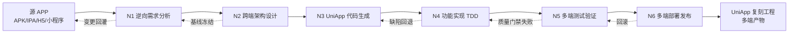
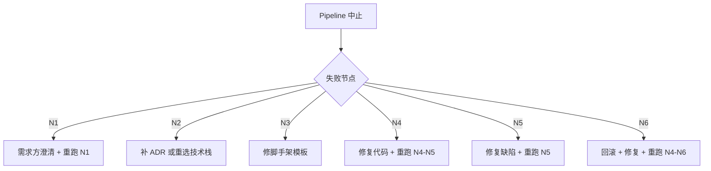

# 逆向分析 + UniApp 跨端复刻 — 自动化 Pipeline

> 本文档定义一套**"以任意移动 APP 为输入,产出 UniApp 跨端复刻工程"**的端到端自动化 Pipeline。
> 输出物是一个**功能等价、可在 iOS / Android / H5 / 微信小程序 / 支付宝小程序等多端一致运行**的 UniApp 3 + Vue 3 + TypeScript 项目。
> 6 个节点 **N1–N6** 对应**逆向分析 → 架构设计 → 代码生成 → 功能实现 → 测试验证 → 部署发布**,每节点给出**职责、操作步骤、AI 提示词模板、输入/输出契约**。
> 文档继承 `framework-pipeline.md` 的总体编排思路,并针对"逆向 + 跨端复刻"场景做了特化。

---

## 目录

- [1. 总体设计](#1-总体设计)
  - [1.1 设计目标](#11-设计目标)
  - [1.2 Pipeline 节点总览](#12-pipeline-节点总览)
  - [1.3 节点依赖与执行顺序](#13-节点依赖与执行顺序)
  - [1.4 与已有 Skills / 文档的映射](#14-与已有-skills--文档的映射)
  - [1.5 适用场景与边界](#15-适用场景与边界)
- [2. N1 — 逆向需求分析节点](#2-n1--逆向需求分析节点)
  - [2.1 节点职责](#21-节点职责)
  - [2.2 操作步骤](#22-操作步骤)
  - [2.3 提示词模板](#23-提示词模板)
  - [2.4 输入 / 输出契约](#24-输入--输出契约)
- [3. N2 — 跨端架构设计节点](#3-n2--跨端架构设计节点)
  - [3.1 节点职责](#31-节点职责)
  - [3.2 操作步骤](#32-操作步骤)
  - [3.3 提示词模板](#33-提示词模板)
  - [3.4 输入 / 输出契约](#34-输入--输出契约)
- [4. N3 — UniApp 代码生成节点](#4-n3--uniapp-代码生成节点)
  - [4.1 节点职责](#41-节点职责)
  - [4.2 操作步骤](#42-操作步骤)
  - [4.3 提示词模板](#43-提示词模板)
  - [4.4 输入 / 输出契约](#44-输入--输出契约)
  - [4.5 UniApp 复刻项目目录模板](#45-uniapp-复刻项目目录模板)
- [5. N4 — 功能实现与质量节点](#5-n4--功能实现与质量节点)
  - [5.1 节点职责](#51-节点职责)
  - [5.2 操作步骤](#52-操作步骤)
  - [5.3 提示词模板](#53-提示词模板)
  - [5.4 输入 / 输出契约](#54-输入--输出契约)
- [6. N5 — 多端测试验证节点](#6-n5--多端测试验证节点)
  - [6.1 节点职责](#61-节点职责)
  - [6.2 操作步骤](#62-操作步骤)
  - [6.3 提示词模板](#63-提示词模板)
  - [6.4 输入 / 输出契约](#64-输入--输出契约)
- [7. N6 — 多端部署发布节点](#7-n6--多端部署发布节点)
  - [7.1 节点职责](#71-节点职责)
  - [7.2 操作步骤](#72-操作步骤)
  - [7.3 提示词模板](#73-提示词模板)
  - [7.4 输入 / 输出契约](#74-输入--输出契约)
- [8. 节点间输入输出矩阵](#8-节点间输入输出矩阵)
- [9. Pipeline 编排与触发](#9-pipeline-编排与触发)
- [10. 附录](#10-附录)
  - [10.1 默认技术栈](#101-默认技术栈)
  - [10.2 占位符说明](#102-占位符说明)
  - [10.3 文档版本](#103-文档版本)

---

## 1. 总体设计

### 1.1 设计目标

| # | 目标 | 验收标准 |
|---|------|----------|
| G1 | 系统化逆向分析源 APP | 产出 `reverse-spec.md`,含功能树、UI/UX 表、API 规约、数据模型 |
| G2 | 跨端一致性 | 同一份代码在 H5、微信小程序、Android、iOS 上"功能等价 + 视觉一致" |
| G3 | UniApp 工程化脚手架 | 一次命令即可产出可运行的 UniApp 3 + Vue 3 + TS 工程,含 ESLint/Prettier/Vitest/CI |
| G4 | TDD 驱动的功能实现 | 每个功能模块先写测试再写实现,覆盖率 ≥ 80% |
| G5 | 多端自动化测试 | H5(Playwright)+ 小程序(uni-automator)+ App(Appium)三层 E2E 绿通 |
| G6 | 多端一键发布 | H5→Nginx,小程序→微信开发者工具,Android→APK/AAB,iOS→IPA 全链路可脚本化 |
| G7 | 全流程可追溯 | 每个节点产物落盘到 `docs/scene/reverse/`,N+1 可消费 N 的输出 |
| G8 | 质量门禁 | 任意节点失败 → Pipeline 中止,自动生成回退指令 |

### 1.2 Pipeline 节点总览



| 节点 | 名称 | 核心目标 | 主用 Skill | 副用 Skill |
|------|------|----------|------------|------------|
| **N1** | 逆向需求分析 | 反编译/抓包/录屏,产出 `reverse-spec.md` | `superpowers:brainstorming` | `openspec:proposal`、Cursor MCP(adb/Charles/Mockingbot) |
| **N2** | 跨端架构设计 | 跨端技术栈冻结、ADR 落盘、平台差异表 | `gstack:/cso` + `/design-consultation` | `gsd:/map-codebase`、`awesome-design-md` |
| **N3** | UniApp 代码生成 | 一次性生成跨端脚手架 + 平台条件编译骨架 | `gsd:/new-project` | `openspec:proposal` |
| **N4** | 功能实现 | TDD 逐模块实现、平台适配 | `superpowers:test-driven-development` | `gsd:/execute-phase`、Cursor IDE |
| **N5** | 多端测试验证 | H5 + 小程序 + App 三层 E2E + 质量门禁 | `gstack:/qa` + `/qa-only` | `superpowers:systematic-debugging` |
| **N6** | 多端部署发布 | 多端打包、签名、上架、文档发布 | `gsd:/ship` | `gstack:/document-release` + `/land-and-deploy` |

### 1.3 节点依赖与执行顺序

- **强顺序**:`N1 → N2 → N3 → N4 → N5 → N6`,任一节点失败则 Pipeline 中止并产出回退工单。
- **反馈回路**:
  - `N1 ↔ 需求方`(源 APP 新版本 → 重跑 N1 增量分析)
  - `N3 → N2`(脚手架模板缺失某平台时回退到 N2 补 ADR)
  - `N4 → N3`(发现脚手架缺陷时回退补模板)
  - `N5 → N4`(测试不通过回到 N4 修复)
  - `N6 → N5`(发布后监控发现严重 Bug 触发回滚)
- **可并发**:
  - N3 中"H5 端脚手架"与"小程序端脚手架"可并行(均为 Vue SFC,差异在 `manifest.json` 条件编译)
  - N4 中"当事人端"与"业务专员端"页面族可并行
  - N5 中"单元测试"与"H5 E2E"与"小程序 E2E"可并行
  - N6 中"Android 打包"与"iOS 打包"可并行

### 1.4 与已有 Skills / 文档的映射

| Pipeline 阶段 | 调用入口 | 落地产物 |
|---------------|----------|----------|
| 头脑风暴 → N1 | `superpowers:brainstorming` | `reverse-spec.md` 草稿 |
| 抓包逆向 → N1 | Cursor MCP + Charles/Frida | `api-mapping.md`、`data-model.md` |
| 规范驱动 → N1 | `openspec:proposal` | `openspec/changes/reverse-<app>/proposal.md` |
| 产品咨询 → N2 | `gstack:/cso` | `decisions/consultation.md` |
| 设计评审 → N2 | `gstack:/design-review` + `awesome-design-md` | `design-system/tokens.md`、`screen-blueprints.md` |
| 项目规划 → N2→N3 | `gsd:/new-project` | `.planning/roadmap.md` |
| 脚手架生成 → N3 | `gsd:/map-codebase` + UniApp 模板引擎 | 完整 UniApp 目录结构 |
| 阶段执行 → N4 | `gsd:/execute-phase` | 模块代码 + 单元测试 |
| TDD 开发 → N4 | `superpowers:test-driven-development` | 测试 + 实现 |
| 质量门禁 → N5 | `gstack:/qa` + `/qa-only` | `qa-reports/*.md` |
| 工程审查 → N4→N5 | `gstack:/devex-review` | `reviews/devex-*.md` |
| 文档发布 → N6 | `gstack:/document-release` | `RELEASE-NOTES.md` |
| 发布管理 → N6 | `gsd:/ship` | 多端产物 + Tag + 文档 |

### 1.5 适用场景与边界

| 维度 | 适用范围 | 不适用范围 |
|------|----------|------------|
| 源 APP 类型 | iOS / Android 原生、Flutter、React Native、纯 H5、微信小程序、wepy/taro 历史工程 | Web 后台管理系统(应改用 `framework-pipeline.md`) |
| 复刻目标 | UniApp 3 + Vue 3 + TypeScript 多端 | 纯 Web 端、Node/SSR 端 |
| 合规 | 已获得源 APP 授权或本团队自有工程 | 未授权的商业 APP 反编译(可能违反协议与法律) |
| 数据 | 可重放 API 请求并生成 Mock 数据 | 需破解加密或绕过付费墙 |

---

## 2. N1 — 逆向需求分析节点

### 2.1 节点职责

- **静态逆向**:反编译 APK/IPA(用 `apktool` / `class-dump` / `Hopper` / `wxappUnpacker`)提取资源、类名、路由、API。
- **动态逆向**:抓包(Charles/mitmproxy)+ 录屏(Mockingbot/ADB screenrecord)+ Hook(Frida),还原真实交互。
- **结构化产出**:将逆向结果规整为"功能树 / UI 表 / API 规约 / 数据模型 / 用户故事"五大件。
- **基线冻结**:与产品/法务对齐功能范围、差异点(刻意不一致项)、版权风险。
- **形成 OpenSpec 变更提案**:把"复刻"当作一次标准 OpenSpec 变更驱动后续 N2-N6。

### 2.2 操作步骤

| 步骤 | 动作 | 输出 |
|------|------|------|
| 1 | 准备源物料:APK/IPA/小程序包/H5 链接,确认已获授权 | `reverse-raw/`(源文件) |
| 2 | 静态逆向:反编译 + 资源提取 + 路由表生成 | `reverse-raw/static-analysis.md` |
| 3 | 动态逆向:抓包(Charles)+ 录屏(ADB)+ Hook(Frida) | `reverse-raw/network-capture.har`、`reverse-raw/screenshots/` |
| 4 | 调用 `superpowers:brainstorming`,汇总功能点并分类(MUST/SHOULD/MAY) | `reverse-raw/feature-catalog.md` |
| 5 | 整理 API 规约(请求/响应/错误码/鉴权方式) | `api-mapping.md` |
| 6 | 整理数据模型(实体/字段/约束) | `data-model.md` |
| 7 | 整理 UI 表(页面/组件/状态/事件),含平台差异 | `screen-blueprints.md` |
| 8 | 输出统一 `reverse-spec.md` 作为 N2 输入 | `reverse-spec.md` |
| 9 | 调用 `openspec:proposal` 形成 OpenSpec 提案 | `openspec/changes/reverse-{{APP}}/{proposal,tasks}.md` |
| 10 | 与利益相关方(产品/法务/设计)签收 | `openspec/changes/reverse-{{APP}}/approval.md` |
| 11 | 触发 N2 | 移交 |

### 2.3 提示词模板

````text
# N1 提示词模板 — 逆向需求分析

[角色] 你是资深逆向工程师 + 产品经理 + 法务顾问,擅长 Android/iOS/H5/小程序的静态/动态逆向分析。

[输入]
  1. 源 APP 物料: {{SOURCE_TYPE}} (apk/ipa/h5-link/mp-package/flutter)
  2. 源 APP 名称: {{APP_NAME}}
  3. 复刻目标平台: {{TARGET_PLATFORMS}} (h5/mp-weixin/app-android/app-ios/alipay/baidu/qq/toutiao/...)
  4. 授权声明: 已获得合法授权 (是/否),若否必须终止
  5. 业务背景: 1~3 句说明

[任务]
  1. **静态逆向**(根据源类型选其一):
     - Android: apktool d / jadx / classyshark
     - iOS: class-dump / Hopper / frida-ios-dump
     - 微信小程序: wxappUnpacker / 解包 .wxapkg
     - H5/React Native/Flutter: 抓包 + DOM/AST 解析
     输出 `reverse-raw/static-analysis.md`,至少包含:入口、路由表、关键类/函数、资源清单。

  2. **动态逆向**:
     - Charles 抓 HTTPS 接口,导出 .har
     - ADB screenrecord 录屏主要流程(登录/首页/详情/支付/...)
     - Frida Hook 关键加密/签名函数
     输出 `reverse-raw/network-capture.har` 与 `reverse-raw/screenshots/`。

  3. **功能树与分级**:调用 superpowers:brainstorming,输出 `feature-catalog.md`。
     树形结构 + 优先级标签 [MUST] / [SHOULD] / [MAY] / [OUT-OF-SCOPE]。
     必含:账号体系(登录/注册/重置/三方登录)、设置、个人中心、业务模块(以源 APP 为准)。

  4. **API 规约**:整理每个接口为:
     | 方法 | 路径 | 入参 | 出参 | 错误码 | 鉴权 | 频率限制 | 备注 |
     落盘 `api-mapping.md`,标注哪些接口是"可复用公共服务",哪些是"业务私有"。

  5. **数据模型**:从响应体/数据库反推,输出 `data-model.md`,字段含类型/约束/中文名/示例值。

  6. **UI 表**:按页面整理 `screen-blueprints.md`,每页含:
     - 页面路径与触发条件
     - 主要组件清单与状态(loading/empty/error)
     - 关键事件与跳转关系
     - 平台差异点(例如 iOS 左滑返回、微信小程序胶囊)
     - 涉及原生能力(camera/location/websocket/ble)

  7. **OpenSpec 提案**:
     openspec/changes/reverse-{{APP}}/
       ├── proposal.md   # Why + What(刻意不一致项 + 法律风险 + 复刻收益)
       ├── tasks.md      # 验收项与拆分(M1..Mn)
       └── design.md     # 关键决策(可选)

  8. **汇总** reverse-spec.md,作为 N2 唯一输入。

[输出要求]
  - Markdown 格式,层级 ≤ 3 层
  - 所有功能点可测、可证伪
  - 刻意不一致项必须在 proposal.md 单独成节"Intended Divergences"
  - 标注 [OPEN QUESTION] 的待澄清问题 ≤ 5 条
  - 至少给出 1 张功能树 Mermaid 图 + 1 张用户旅程图

[下游契约 — N2 必须能直接消费的字段]
  - 目标平台清单 + 各自占比(决定 N3 条件编译侧重)
  - 核心业务模块清单(M1..Mn)及其优先级
  - 必须复刻的关键页面(影响 N3 路由骨架)
  - 必须对接的 API 列表(含鉴权方案)
  - 必须支持的原生能力清单
````

### 2.4 输入 / 输出契约

| 方向 | 内容 | 格式 |
|------|------|------|
| 输入 | 源 APP 物料 + 授权声明 + 业务背景 | 物理文件 + 自由文本 |
| 输出 | `reverse-spec.md`<br>`feature-catalog.md`<br>`api-mapping.md`<br>`data-model.md`<br>`screen-blueprints.md`<br>`openspec/changes/reverse-{{APP}}/{proposal,tasks}.md` | Markdown + HAR + JSON |
| 验收 | 5 大件齐全 + OpenSpec 提案评审通过 + 利益相关方签收 | `approval.md` 含签名/时间戳 |
| 移交 N2 | `reverse-spec.md` + 5 大件 + OpenSpec 提案 | — |

---

## 3. N2 — 跨端架构设计节点

### 3.1 节点职责

- 基于 N1 产出的 `reverse-spec.md`,为 UniApp 多端复刻选型与冻结技术栈。
- 明确**目标平台支持矩阵、跨端技术栈、模块边界、数据流、安全模型、性能基线、平台差异策略**。
- 落盘**ADR(Architecture Decision Record)**,标记 `[LOCKED]` 与 `[FLEX]` 项。
- 输出一份 `baseline-stack.json` 作为 N3 的直接输入。

### 3.2 操作步骤

| 步骤 | 动作 | 输出 |
|------|------|------|
| 1 | 调用 `gstack:/cso` 启动一轮产品-技术-设计三方咨询 | `decisions/consultation.md` |
| 2 | 生成平台支持矩阵(H5/小程序/Android/iOS 各端支持度 100% / 95% / 80% / 不可用) | `platform-matrix.md` |
| 3 | 关键技术决策 → 编写 ADR(至少 3 份) | `decisions/ADR-0001-uniapp-engine.md`、`ADR-0002-state-mgmt.md`、`ADR-0003-platform-polyfill.md` 等 |
| 4 | 调用 `gstack:/design-consultation` + `awesome-design-md` 确认 UI/UX 体系 | `design-system/tokens.md`、`design-system/components.md` |
| 5 | 调用 `gsd:/map-codebase`(若已存在部分代码) | `.planning/codebase/ARCHITECTURE.md` |
| 6 | 输出 `baseline-stack.json`(供 N3 直接消费) | `baseline-stack.json` |
| 7 | 输出跨端模块边界图与 C4 Container 图 | `architecture/c4-container.md`、`architecture/modules.md` |
| 8 | 触发 N3 | 移交 |

### 3.3 提示词模板

````text
# N2 提示词模板 — 跨端架构设计

[角色] 你是首席架构师(Chief Software Architect),专长跨端架构(UniApp/Taro/RN/Flutter)。

[输入]
  - N1 产出的 reverse-spec.md、feature-catalog.md、api-mapping.md、data-model.md、screen-blueprints.md
  - 目标平台清单: {{TARGET_PLATFORMS}}
  - 既有架构约束(若复用现有 business-platform 工程)

[任务]
  1. **平台支持矩阵** `platform-matrix.md`:
     | 端 | 支持度 | 主要差异 | 不支持项 | 原因 | 复刻策略 |
     |---|--------|----------|----------|------|----------|
     | H5 | 100% | 无 | - | - | - |
     | 微信小程序 | 95% | 无摄像头扫码 | 蓝牙 | 平台限制 | 条件编译跳过 |
     | Android | 90% | 推送通道 | - | - | - |
     | iOS | 90% | 支付 SDK | - | - | - |

  2. **跨端技术栈选型**(默认推荐):
     - 框架: UniApp 3.x (Vue 3 + Vite)
     - 语言: TypeScript 5.x(主)+ SCSS(辅)
     - 状态管理: Pinia 2.x
     - UI 库: uView Plus 3.x(也可选 uni-ui / NutUI)
     - 网络: 自封装 `request.ts`(参考源 APP 的 `utils/request.ts`)
     - 实时通信: WebSocket(小程序端走 wx.connectSocket)
     - 测试: Vitest(单元) + Playwright(H5 E2E) + uni-automator(小程序/App E2E)
     - 质量: ESLint + Prettier + Stylelint + vue-tsc

  3. **至少 3 份 ADR**,每份包含:
     - 背景与问题
     - 备选方案(≥ 2 个)
     - 决策与理由
     - 后果与回滚成本
     - Status: [LOCKED] / [FLEX]

     必含 ADR:
     - ADR-0001 引擎选型(UniApp 3 vs Taro 4 vs RN vs Flutter)
     - ADR-0002 状态管理(Pinia vs Vuex 4 vs Mobx)
     - ADR-0003 平台差异处理策略(条件编译 vs 运行时判断 vs 抽象适配层)
     - ADR-0004 鉴权与 Token 刷新方案
     - ADR-0005 多端构建与发布流水线

  4. **baseline-stack.json**(字段固定):
     {
       "app": {
         "name": "{{APP_NAME}}",
         "version": "0.1.0",
         "description": "...",
         "targets": {{TARGET_PLATFORMS}}
       },
       "frontend": {
         "framework": "UniApp 3",
         "engine": "Vue 3",
         "lang": "TypeScript 5",
         "build": "Vite 5",
         "ui": "uView Plus 3",
         "state": "Pinia 2",
         "router": "uni-pages",
         "test_unit": "Vitest",
         "test_e2e_h5": "Playwright",
         "test_e2e_miniprogram": "uni-automator",
         "test_e2e_app": "Appium"
       },
       "network": {
         "http": "uni.request + 自封装拦截器",
         "websocket": "uni.connectSocket",
         "upload": "uni.uploadFile + XHR 双通道"
       },
       "auth": {
         "scheme": "JWT",
         "storage": "uni.storage",
         "refresh_strategy": "401 触发刷新,合并并发请求"
       },
       "quality": {
         "lint": "ESLint + Prettier + Stylelint",
         "type_check": "vue-tsc",
         "coverage_min": 80,
         "format": "Prettier"
       },
       "delivery": {
         "ci": "GitHub Actions / GitLab CI",
         "h5_cdn": "Nginx + CDN",
         "miniprogram_upload": "微信开发者工具 CLI",
         "android": "Gradle + APK/AAB",
         "ios": "Xcode + IPA"
       }
     }

  5. **C4 Container 草图** + **模块边界图**(Mermaid):
     - 容器:H5 SPA / 微信小程序 / Android App / iOS App / 后端 API
     - 模块:api / store / pages / components / utils / websocket

  6. **平台差异策略文档** `platform-divergence.md`:
     - 条件编译规范: `// #ifdef MP-WEIXIN` ... `// #endif`
     - 统一封装层:`@/utils/platform.ts`、`@/utils/request.ts`
     - 错误码映射、H5 与小程序的 storage 差异、支付/分享/登录的差异

[输出要求]
  - 所有 [LOCKED] 项不可变更(变更需新开 ADR)
  - [FLEX] 项可在 N3-N4 微调
  - 至少 1 张 C4 图 + 1 张模块依赖图 + 1 张平台差异矩阵
````

### 3.4 输入 / 输出契约

| 方向 | 内容 | 格式 |
|------|------|------|
| 输入 | N1 全部 5 大件 + 目标平台清单 | Markdown + HAR + JSON |
| 输出 | `baseline-stack.json`<br>`decisions/ADR-*.md`<br>`platform-matrix.md`<br>`platform-divergence.md`<br>`design-system/{tokens,components}.md`<br>`architecture/{c4-container,modules}.md` | Markdown + JSON |
| 验收 | 所有 [LOCKED] 项被基线化,变更需新开 ADR | ADR 内 Status 字段 |
| 移交 N3 | `baseline-stack.json` + ADR 列表 + 平台支持矩阵 | — |

---

## 4. N3 — UniApp 代码生成节点

### 4.1 节点职责

- 一次性产出**完整、可运行**的 UniApp 跨端复刻脚手架。
- 包含:目录结构、依赖配置、平台条件编译骨架、CI 模板、Docker(H5 端)、测试、文档骨架。
- 落地产物可被 N4 直接 `pnpm install` 后开始编码,各端 `pnpm dev:*` 能立即预览。
- 在脚手架中**预置** N1 解析出的页面骨架、API 桩、Pinia store 骨架,使 N4 专注业务实现。

### 4.2 操作步骤

| 步骤 | 动作 | 输出 |
|------|------|------|
| 1 | 读取 N2 的 `baseline-stack.json` | 内存对象 |
| 2 | 选择 UniApp 模板(`vue3+vite+ts`官方模板 + uView Plus) | 模板路径 |
| 3 | 调用 `gsd:/new-project` 生成 `.planning/` 目录 | `.planning/roadmap.md` |
| 4 | 渲染目录骨架(脚本/模板引擎),按 N1 页面清单预置空页面 | 物理目录 |
| 5 | 生成 `manifest.json` 平台条件编译块 | `manifest.json` |
| 6 | 生成 `pages.json` 路由表(N1 解析结果) | `pages.json` |
| 7 | 生成 `utils/request.ts`(参考源 APP 的网络层) | `utils/request.ts` |
| 8 | 生成 `utils/platform.ts` 平台差异适配层 | `utils/platform.ts` |
| 9 | 生成 `api/*` 接口桩(N1 的 `api-mapping.md`) | `api/` |
| 10 | 生成 `store/*` Pinia 骨架(用户/案件/业务/应用) | `store/` |
| 11 | 生成 `components/*` 公共组件骨架(NavBar/CaseCard/EmptyState/FileUploader) | `components/` |
| 12 | 生成 CI 模板(`.github/workflows/{ci,build-h5,build-mp,build-android,build-ios}.yml`) | YAML |
| 13 | 生成 Docker 配置(H5 端:`Dockerfile` + `nginx.conf`) | Docker 文件 |
| 14 | 生成测试与代码质量配置(`.eslintrc`、`.prettierrc`、`vitest.config.ts`、`.stylelintrc`) | 配置文件 |
| 15 | 生成文档骨架(README、CHANGELOG、API 文档) | Markdown |
| 16 | 初始化 git 并打 tag `v0.1.0-baseline` | git tag |
| 17 | 触发 N4 | 移交 |

### 4.3 提示词模板

````text
# N3 提示词模板 — UniApp 代码生成

[角色] 你是 DevOps 工程师 + UniApp 脚手架生成器,熟悉 vue-cli + Vite 两种 UniApp 工程形态。

[输入]
  - baseline-stack.json (N2 产出)
  - reverse-spec.md、feature-catalog.md、api-mapping.md (N1 产出)
  - 项目元信息:name / description / license / author / repo-url

[任务]
  1. **选择并执行 UniApp 3 + Vue 3 + Vite + TypeScript 模板**:
     命令参考:
       pnpm create uni@latest --template vue3-ts-uv-plus {{APP_NAME}}
     必要依赖:
       - @dcloudio/uni-app
       - pinia 2.x
       - uview-plus 3.x
       - dayjs
       - vue-tsc / typescript
       - vitest / @vue/test-utils
       - @playwright/test
       - eslint / prettier / stylelint

  2. **预置目录结构**(对齐 business-app 的 11 个子域):
     business-{{APP}}/
     ├── src/
     │   ├── api/
     │   │   ├── uaa/             # 认证服务
     │   │   ├── system/          # 字典/文件/通知
     │   │   ├── modules/         # 业务模块
     │   │   └── index.ts
     │   ├── components/
     │   │   ├── common/          # NavBar / CaseCard / EmptyState / FileUploader / StatusBar
     │   │   ├── party/           # 当事人端组件
     │   │   └── staff/        # 业务专员端组件
     │   ├── pages/
     │   │   ├── party/
     │   │   │   ├── login/
     │   │   │   ├── register/
     │   │   │   ├── index/       # 首页
     │   │   │   ├── case/        # 案件列表/详情/提交
     │   │   │   ├── business/   # 业务会话
     │   │   │   ├── knowledge/
     │   │   │   ├── notice/
     │   │   │   └── mine/
     │   │   └── staff/        # 工作台/待签收/案件/业务会话/我的
     │   ├── store/               # Pinia:user/case/business/app
     │   ├── utils/               # request.ts / platform.ts / index.ts
     │   ├── websocket/           # business.ts
     │   ├── styles/base.css      # CSS Variables
     │   ├── App.vue
     │   ├── main.ts              # createSSRApp + Pinia
     │   ├── pages.json           # 路由 + TabBar
     │   └── manifest.json        # 多端配置
     ├── tests/
     │   ├── unit/
     │   ├── e2e/h5/              # Playwright
     │   └── e2e/miniprogram/     # uni-automator
     ├── .github/workflows/
     │   ├── ci.yml
     │   ├── build-h5.yml
     │   ├── build-mp-weixin.yml
     │   ├── build-android.yml
     │   └── build-ios.yml
     ├── docker/
     │   ├── Dockerfile.h5
     │   └── nginx.conf
     ├── .env.example / .env.development / .env.production
     ├── .eslintrc.cjs / .prettierrc / .stylelintrc / vitest.config.ts
     ├── .gitignore / .editorconfig
     ├── docs/                    # reverse/ 下的逆向资产 + 文档
     ├── package.json / pnpm-lock.yaml / pnpm-workspace.yaml
     ├── tsconfig.json / vite.config.ts / uno.config.ts
     ├── Makefile                 # make install/dev/build/test/lint/smoke/ship
     ├── CHANGELOG.md
     └── README.md

  3. **pages.json 预置**:
     - pages 数组按 N1 feature-catalog.md 顺序生成
     - tabBar 4 项(首页/案件/业务/我的)
     - easycom 自动引入 uview-plus

  4. **manifest.json 多端配置**:
     - vueVersion: "3"
     - app-plus: 权限/SDK/推送
     - mp-weixin: appid / setting.urlCheck
     - h5: router.mode=hash / devServer.port=3000 / proxy
     - 各端 SDK 开关(微信支付/分享/登录/位置)

  5. **utils/request.ts 模板**:
     - 拦截器: 请求附加 Token / 响应 401 刷新
     - 错误统一处理 + Toast
     - 文件上传双通道(uni.uploadFile + XHR)
     - TS 类型完整

  6. **CI 模板**:
     - ci.yml:install + lint + type-check + test
     - build-h5.yml: 产物上传到 S3/OSS/Nginx
     - build-mp-weixin.yml: 微信开发者工具 CLI miniprogram-ci
     - build-android.yml: Gradle assembleRelease → AAB
     - build-ios.yml: xcodebuild archive → IPA

  7. **强制约束**:
     - pnpm-lock.yaml 必须生成且提交
     - 必须包含 CI cache 步骤
     - 必须包含至少 1 个单元测试样例 + 1 个 H5 E2E 样例
     - 必须配置代码所有者 CODEOWNERS

  8. **调用 gsd:/new-project** 生成 .planning/roadmap.md
  9. **初始化 git**,提交信息:`chore: bootstrap uniapp reverse-app scaffold v0.1.0`
  10. **打 tag**: `v0.1.0-baseline`

[输出要求]
  - 一次性命令完成(可使用 `Makefile: make bootstrap`)
  - `pnpm dev:h5` / `pnpm dev:mp-weixin` / `pnpm dev:app` 至少 H5 端能跑通空白页
  - 给出 `.planning/codebase/{STACK,ARCHITECTURE,CONVENTIONS}.md`
  - 给出 `docs/reverse/` 软链或副本指向 N1 产物
````

### 4.4 输入 / 输出契约

| 方向 | 内容 | 格式 |
|------|------|------|
| 输入 | `baseline-stack.json` + N1 全部 5 大件 + 项目元信息 | JSON + Markdown + YAML |
| 输出 | 完整 UniApp 目录 + `manifest.json` + `pages.json` + CI 模板 + Docker + `.planning/` + git tag | 物理文件 |
| 验收 | `make smoke` 通过(包含 install / lint / type-check / test / build-h5) | 命令退出码 0 |
| 移交 N4 | git 仓库(分支:`main`,tag:`v0.1.0-baseline`)+ `.planning/roadmap.md` | — |

### 4.5 UniApp 复刻项目目录模板

```
business-{{APP}}/
├── README.md
├── CHANGELOG.md
├── LICENSE
├── Makefile                            # make install/dev/build/test/lint/smoke/ship
├── package.json
├── pnpm-lock.yaml
├── pnpm-workspace.yaml
├── tsconfig.json
├── vite.config.ts                      # uni 插件 + uview-plus + proxy
├── uno.config.ts
├── .env.example                        # BASE_URL / API_PREFIX / APP_ID / WX_SECRET / ...
├── .env.development / .env.production / .env.test
├── .gitignore
├── .editorconfig
├── .prettierrc
├── .eslintrc.cjs
├── .stylelintrc.cjs
├── .npmrc
├── vitest.config.ts
├── docker/
│   ├── Dockerfile.h5                   # nginx + dist
│   └── nginx.conf
├── .github/
│   ├── CODEOWNERS
│   └── workflows/
│       ├── ci.yml
│       ├── build-h5.yml
│       ├── build-mp-weixin.yml
│       ├── build-android.yml
│       └── build-ios.yml
├── docs/
│   ├── reverse/                        # 软链到 N1 产物
│   │   ├── reverse-spec.md
│   │   ├── feature-catalog.md
│   │   ├── api-mapping.md
│   │   ├── data-model.md
│   │   └── screen-blueprints.md
│   ├── ARCHITECTURE.md
│   ├── API.md
│   └── CHANGELOG.md
├── src/
│   ├── api/
│   │   ├── index.ts                    # 统一导出
│   │   ├── uaa/                        # auth.ts / user.ts / staff.ts
│   │   ├── system/                     # dict.ts / file.ts / notify.ts / notice.ts
│   │   └── modules/                    # case.ts / business.ts
│   ├── components/
│   │   ├── common/                     # NavBar / CaseCard / EmptyState / FileUploader / StatusBar
│   │   ├── party/
│   │   └── staff/
│   ├── pages/
│   │   ├── party/                      # login / register / index / case / business / knowledge / notice / mine
│   │   └── staff/                   # login / index / case / business / mine
│   ├── store/
│   │   ├── index.ts
│   │   ├── user.ts
│   │   ├── case.ts
│   │   ├── business.ts
│   │   └── app.ts
│   ├── utils/
│   │   ├── index.ts                    # dayjs / 验证 / 导航 / UI 提示
│   │   ├── request.ts                  # 拦截器 / Token 刷新 / 文件上传
│   │   └── platform.ts                 # 平台差异适配
│   ├── websocket/
│   │   └── business.ts
│   ├── styles/
│   │   └── base.css                    # CSS Variables + 工具类
│   ├── static/
│   │   ├── tabbar/
│   │   ├── images/
│   │   └── icons/
│   ├── App.vue
│   ├── main.ts                         # createSSRApp + Pinia
│   ├── pages.json                      # 路由 + TabBar
│   └── manifest.json                   # 多端配置
├── tests/
│   ├── unit/
│   │   ├── request.spec.ts
│   │   ├── platform.spec.ts
│   │   └── store/*.spec.ts
│   ├── e2e/
│   │   ├── h5/                         # Playwright: login.spec.ts / case-list.spec.ts
│   │   └── miniprogram/                # uni-automator: login.spec.js
│   └── fixtures/
└── .planning/
    ├── roadmap.md
    └── codebase/
        ├── STACK.md
        ├── ARCHITECTURE.md
        ├── CONVENTIONS.md
        └── STRUCTURE.md
```

---

## 5. N4 — 功能实现与质量节点

### 5.1 节点职责

- 在 N3 脚手架基础上,**逐模块 TDD 实现** 源 APP 的功能。
- 严格遵循 `superpowers:test-driven-development`:红 → 绿 → 重构。
- 每个功能模块输出**单元测试 + H5 集成测试 + 平台适配代码**。
- 内置平台条件编译,确保一份代码在所有目标端行为一致(差异点遵循 N2 的 `platform-divergence.md`)。
- 维护 `MODULES.md` 记录每个模块的状态(待开发/进行中/已完成/已测试)。

### 5.2 操作步骤

| 步骤 | 动作 | 输出 |
|------|------|------|
| 1 | 从 `.planning/roadmap.md` 取下一个 M_i 模块 | `MODULES.md` 更新 |
| 2 | 调用 `superpowers:test-driven-development` | 测试文件先写 |
| 3 | 编写 `api/{module}.ts` 接口函数(对接后端或 Mock) | `api/` |
| 4 | 编写 `store/{module}.ts` 状态(state/getters/actions) | `store/` |
| 5 | 编写 `pages/{role}/{module}/*.vue` 页面(模板/脚本/样式) | `pages/` |
| 6 | 编写 `components/...` 复用组件 | `components/` |
| 7 | 平台条件编译处理(`#ifdef MP-WEIXIN` 等) | 代码内 |
| 8 | 运行 `pnpm test` + `pnpm type-check` + `pnpm lint` | 报告 |
| 9 | 在 H5 端手动验证(可用 Cursor MCP 浏览器) | 录屏/截图 |
| 10 | 更新 `MODULES.md` 状态为"已实现" | `MODULES.md` |
| 11 | 重复步骤 1-10 直到所有 MUST 模块完成 | — |
| 12 | 调用 `gsd:/execute-phase` 收尾该阶段 | `.planning/phases/...` |
| 13 | 触发 N5 | 移交 |

### 5.3 提示词模板

````text
# N4 提示词模板 — 功能实现(TDD)

[角色] 你是资深 UniApp/Vue 3 跨端开发工程师,精通 TDD 与平台条件编译。

[输入]
  - N3 脚手架 + git tag v0.1.0-baseline
  - N1 的 feature-catalog.md(必含:登录/注册/重置密码/账号设置)
  - N1 的 api-mapping.md
  - N1 的 data-model.md
  - N1 的 screen-blueprints.md
  - N2 的 platform-divergence.md
  - 当前模块: M_i(从 roadmap.md 取)
  - 测试基线: 覆盖率 ≥ 80%

[任务 — 严格 TDD]
  1. **红(Red)**:先写测试。
     - 单元测试:store 行为、utils 函数、request 拦截器
     - 组件测试:@vue/test-utils 渲染 + 交互
     - E2E 测试(H5):登录/案件列表/案件详情关键路径
  2. **绿(Green)**:写最小实现让测试通过。
  3. **重构(Refactor)**:消除重复、提取公共组件、规范化命名。
  4. **平台适配**:为每个差异点用条件编译或 platform.ts 处理。
  5. **类型完备**:所有 API 都有 TS 类型定义,避免 any。

[必含功能模块 — 复刻 business-app 登录/账号体系]
  ### M1 — 账号密码登录
    - pages/party/login/index.vue:手机号+密码登录、记住密码、忘记密码入口
    - pages/staff/login/index.vue:业务专员登录(含审核状态提示)
    - store/user.ts:login/logout/getUserInfo actions
    - api/uaa/auth.ts:login/logout/refresh
    - utils/request.ts:Token 自动附加 + 401 刷新 + 并发合并
    - 测试:登录成功/失败/密码错误/账号锁定/Token 过期刷新

  ### M2 — 短信验证码
    - 发送验证码按钮 60s 倒计时
    - 图形验证码(防刷)
    - 测试:倒计时、频次限制

  ### M3 — 注册
    - 手机号+验证码+密码+确认密码
    - 协议勾选
    - 测试:字段校验、协议强制勾选、密码强度

  ### M4 — 重置密码
    - 步骤条:输入手机号 → 验证码 → 新密码 → 完成
    - 测试:每步校验、整体流程

  ### M5 — 个人中心
    - 头像/昵称/手机号脱敏显示
    - 实名认证入口(状态徽章)
    - 修改密码/退出登录
    - 测试:信息加载、退出确认

  ### M6 — 设置
    - 消息通知开关(推送/震动/声音)
    - 清除缓存
    - 关于我们
    - 测试:开关持久化、缓存大小计算

  ### M7 — 案件提交与列表
    - 提交纠纷:类型选择/案情描述/证据上传/被申请人
    - 案件列表:Tab 分组(待处理/进行中/已结案)
    - 测试:表单校验、文件上传进度

  ### M8 — 在线业务(WebSocket)
    - 文字消息、图片/文件
    - 输入状态提示 TYPING
    - 自动重连(指数退避,最多 5 次)
    - 测试:断网重连、消息去重

[质量要求]
  - ESLint 0 error / 0 warning
  - vue-tsc 通过,无 any 滥用
  - 单元测试覆盖率 ≥ 80%
  - 关键路径 100% 覆盖
  - 每个 PR 关联 issue/任务号
  - commit 规范:feat/fix/refactor/test/docs/chore(scope): subject

[平台适配规范]
  - 条件编译块必须注释说明平台与原因
  - 平台特定功能在 platform.ts 暴露统一接口
  - H5 / 小程序 / App 的差异在 docs/platform-divergence.md 持续更新
````

### 5.4 输入 / 输出契约

| 方向 | 内容 | 格式 |
|------|------|------|
| 输入 | N3 脚手架 + N1 全部产物 + N2 ADR 与差异策略 + roadmap 当前阶段 | 文件 + JSON |
| 输出 | `src/` 下完整业务代码 + `tests/` 下完整测试 + `MODULES.md` 进度 | 物理文件 |
| 验收 | `make test` + `make type-check` + `make lint` 全部退出码 0,覆盖率 ≥ 80% | 命令 + 报告 |
| 移交 N5 | git 分支 `feature/M_i` 或 PR + `MODULES.md` + `qa-handoff.md` | — |

---

## 6. N5 — 多端测试验证节点

### 6.1 节点职责

- 在 N4 实现的代码基础上,执行**多端、多层次**测试验证。
- 三层测试:**单元(单端)→ 集成(单端)→ E2E(多端)**。
- 端覆盖:**H5(Playwright) + 微信小程序(uni-automator) + Android/iOS(Appium)**。
- 输出**质量门禁报告**,含功能覆盖率、平台差异表现、性能基线、安全扫描。
- 任一门禁失败 → Pipeline 中止,回退到 N4 修复。

### 6.2 操作步骤

| 步骤 | 动作 | 输出 |
|------|------|------|
| 1 | 运行单元测试 `pnpm test` | `qa-reports/unit.html` |
| 2 | 运行类型检查 `pnpm type-check` | 控制台日志 |
| 3 | 运行 ESLint + Stylelint `pnpm lint` | `qa-reports/lint.txt` |
| 4 | 构建 H5 端 `pnpm build:h5` + 用 Playwright 跑 E2E | `qa-reports/e2e-h5.html` |
| 5 | 构建小程序端 `pnpm build:mp-weixin` + uni-automator 跑 E2E | `qa-reports/e2e-mp.html` |
| 6 | 必要时构建 Android `pnpm build:app` + Appium 跑 E2E | `qa-reports/e2e-android.html` |
| 7 | 性能基线(H5 Lighthouse + 小程序性能面板) | `qa-reports/perf.md` |
| 8 | 安全扫描(npm audit + 敏感信息扫描) | `qa-reports/security.md` |
| 9 | 平台差异表现核对(对照 N2 `platform-matrix.md`) | `qa-reports/platform-check.md` |
| 10 | 调用 `gstack:/qa` 生成综合 QA 报告 | `qa-reports/qa-summary.md` |
| 11 | 调用 `gstack:/devex-review` 工程审查 | `reviews/devex-{{DATE}}.md` |
| 12 | 质量门禁判定(PASS/FAIL) | `qa-reports/gate.md` |
| 13 | 触发 N6(若 PASS) | 移交 |

### 6.3 提示词模板

````text
# N5 提示词模板 — 多端测试验证

[角色] 你是资深 QA 工程师 + 测试架构师,精通 Playwright / uni-automator / Appium。

[输入]
  - N4 产出的完整代码 + 测试
  - N1 全部产物(用于核对功能完整性)
  - N2 platform-matrix.md / platform-divergence.md
  - 当前模块: M_i 的 qa-handoff.md

[任务]
  1. **单元测试**:pnpm test --coverage,要求 ≥ 80% 且关键路径 100%。

  2. **H5 E2E**(Playwright):
     - 配置浏览器矩阵:Chromium / WebKit(Safari) / Firefox
     - 用例:登录/注册/重置密码/首页加载/案件列表/案件详情/业务会话/个人中心
     - 视觉回归:对比基准截图(Pixelmatch)
     - 性能:Lighthouse CI ≥ 90 分

  3. **小程序 E2E**(uni-automator):
     - 用微信开发者工具 CLI 启动自动化
     - 用例同上(去掉支付/推送等平台独占)
     - 截图存档
     - 注意:wx.connectSocket / wx.request 与 uni API 的桥接差异

  4. **App E2E**(Appium,可选):
     - Android:Real Device / Emulator
     - iOS:Simulator(若无真机)
     - 用例:推送/扫码/相机/相册/蓝牙等原生能力
     - 性能:启动时间 < 3s,首屏 < 1.5s

  5. **平台差异核对**(对照 platform-matrix.md):
     | 端 | 用例 | 预期 | 实测 | 结果 |
     逐项勾选,任何 [LOCKED] 端点失败即 FAIL。

  6. **安全扫描**:
     - npm audit --audit-level=high
     - 敏感信息扫描:git secrets / truffleHog
     - 依赖许可合规

  7. **性能基线**:
     - H5:Lighthouse Performance ≥ 90
     - 小程序:setData 频率 + 包体积 < 2MB
     - App:启动时间 / 内存占用

  8. **质量门禁**(全部满足才 PASS):
     - 单元覆盖率 ≥ 80%
     - 三端 E2E 100% PASS
     - Lint 0 error
     - Type check 通过
     - 平台矩阵无 [LOCKED] 失败
     - 无 high 级别安全漏洞
     - 性能基线达标

  9. **调用 gstack:/qa** 生成 qa-summary.md,含:
     - 测试金字塔各层通过率
     - 平台差异表(实际表现 vs N2 矩阵)
     - 已知问题清单(按严重度分级)
     - 修复建议

  10. **调用 gstack:/devex-review** 生成工程审查报告。
  11. **调用 superpowers:systematic-debugging** 处理失败用例。

[输出要求]
  - qa-reports/ 下 6 份报告
  - 视觉/性能基线截图存档
  - 失败用例必须有可复现的最小步骤
  - 门禁报告必须可机读(JSON 或 Markdown frontmatter)
````

### 6.4 输入 / 输出契约

| 方向 | 内容 | 格式 |
|------|------|------|
| 输入 | N4 完整代码 + 测试 + N1/N2 全部产物 + qa-handoff.md | 文件 + 文档 |
| 输出 | `qa-reports/{unit,e2e-h5,e2e-mp,e2e-android,perf,security,platform-check,qa-summary,gate}.{html,md}` | HTML/Markdown/JSON |
| 验收 | 7 项门禁全 PASS | `gate.md` PASS 状态 |
| 移交 N6 | qa-summary.md(必需)+ 全部报告 + 视觉基线 | — |

---

## 7. N6 — 多端部署发布节点

### 7.1 节点职责

- 在 N5 全部 PASS 的基础上,执行**多端构建、签名、上传、发布**。
- 多端产物: **H5 静态包**(Nginx/CDN)/ **微信小程序包**(微信开发者工具 CLI 或 miniprogram-ci)/ **Android APK+AAB**(应用市场)/ **iOS IPA**(App Store/TestFlight)。
- 维护**版本号、变更日志、灰度策略、回滚预案**。
- 输出 **RELEASE-NOTES.md** 与 **发布报告**,供运维与产品查阅。

### 7.2 操作步骤

| 步骤 | 动作 | 输出 |
|------|------|------|
| 1 | 从 N5 gate.md 读取 PASS 状态 | — |
| 2 | 版本号策略(semver):递增 patch/minor/major | `package.json` version |
| 3 | 生成 CHANGELOG(从 commit 历史) | `CHANGELOG.md` |
| 4 | 触发多端构建(可并发):build-h5 / build-mp-weixin / build-android / build-ios | 产物包 |
| 5 | H5 → 打包 dist → 上传 S3/OSS → CDN 刷新 → Nginx 切换 | 线上 H5 URL |
| 6 | 小程序 → miniprogram-ci upload → 提交审核(可选) | 微信后台 |
| 7 | Android → Gradle assembleRelease → 签名 → 输出 APK/AAB → 上传应用市场 | 应用市场 |
| 8 | iOS → xcodebuild archive → 签名 → TestFlight / App Store | TestFlight |
| 9 | 灰度策略(可选):H5 5% → 20% → 100% | 灰度配置 |
| 10 | 回滚预案就绪(保留上一版本 H5/小程序体验版/Android 历史包) | rollback.md |
| 11 | 调用 `gstack:/document-release` 生成 RELEASE-NOTES.md | RELEASE-NOTES.md |
| 12 | 调用 `gstack:/land-and-deploy` 发布记录 | 发布日志 |
| 13 | git 打 tag `v{{VERSION}}` 并创建 GitHub/GitLab Release | tag + Release |
| 14 | 触发监控与告警(可选) | 监控面板 |

### 7.3 提示词模板

````text
# N6 提示词模板 — 多端部署发布

[角色] 你是 DevOps 发布工程师 + Release Manager,精通多端上架流程。

[输入]
  - N5 gate.md(PASS 状态)
  - 当前版本号 + 上一版本号
  - 目标发布渠道:
    {{H5_CDN_URL}}
    {{MP_APPID}} + {{MP_VERSION}}
    {{ANDROID_KEYSTORE}} + {{ANDROID_PACKAGE_NAME}}
    {{IOS_BUNDLE_ID}} + {{IOS_TEAM_ID}}

[任务]
  1. **版本号**:根据改动量递增 semver。
     - 修复:patch
     - 新功能:minor
     - 破坏性:major
     写入 package.json。

  2. **CHANGELOG**:调用 gstack:/document-release 自动从 conventional commits 生成。

  3. **多端构建**(可并发):
     - H5:pnpm build:h5 && pnpm build:h5 -- --mode production
       产物: dist/build/h5/
     - 小程序:pnpm build:mp-weixin
       产物: dist/build/mp-weixin/
     - Android:pnpm build:app && cd dist/build/app--plus && gradle assembleRelease
       产物: APK + AAB
     - iOS:pnpm build:app-ios && xcodebuild archive
       产物: IPA

  4. **签名与上传**:
     - H5:上传 S3/OSS,刷新 CDN,invalidate index.html
     - 小程序:miniprogram-ci upload --pp {{MP_APPID}} --pkp {{MP_PRIVATE_KEY}} --appid {{MP_APPID}} --uv {{MP_VERSION}}
     - Android:apksigner + 上传应用市场后台(华为/小米/OPPO/VIVO/应用宝)
     - iOS:altool/xcrun altool --upload-app --type ios --file {{IPA}}

  5. **灰度策略**:
     - H5:CDN 配置 5% → 20% → 100% 权重
     - 小程序:微信后台"分阶段发布"5% → 50% → 100%
     - Android:应用市场"灰度发布"
     - iOS:Phased Release for App Store

  6. **回滚预案** rollback.md:
     - 保留上一版本产物 ≥ 7 天
     - H5:切回旧版本 dist 目录
     - 小程序:微信后台"回退版本"
     - Android:无法回滚,需发修复包
     - iOS:无法回滚,需发修复包
     - 监控告警:错误率 > 1% 触发自动回滚

  7. **RELEASE-NOTES.md**:
     ```markdown
     # v{{VERSION}} ({{DATE}})
     ## ✨ 新功能
     ## 🐛 修复
     ## ⚠️ 破坏性变更
     ## 📦 端支持
     | 端 | 版本 | 状态 |
     ## 🔗 链接
     ```

  8. **git tag + Release**:
     git tag -a v{{VERSION}} -m "release: v{{VERSION}}"
     git push origin v{{VERSION}}
     gh release create v{{VERSION}} --notes-file RELEASE-NOTES.md

  9. **通知**:
     - 团队 IM
     - 监控面板更新
     - 文档站点更新

  10. **调用 gstack:/land-and-deploy** 记录发布事件。

[输出要求]
  - 5 份产物(可选 + 必须标记)
  - 1 份 RELEASE-NOTES.md
  - 1 份 rollback.md
  - 1 份 release-report.md
  - git tag + GitHub/GitLab Release
  - 监控告警配置
````

### 7.4 输入 / 输出契约

| 方向 | 内容 | 格式 |
|------|------|------|
| 输入 | N5 gate.md + 当前/上一版本号 + 渠道凭证 | JSON + 文件 |
| 输出 | 5 端产物 + `RELEASE-NOTES.md` + `rollback.md` + `release-report.md` + git tag + Release | 物理文件 + 标签 |
| 验收 | 5 端全部上传成功 + Release 创建 + 监控告警就绪 | 发布报告 PASS |
| 终态 | 流水线结束,反馈给 N1 触发下一轮迭代 | — |

---

## 8. 节点间输入输出矩阵

| 从 \ 到 | N1 接收 | N2 接收 | N3 接收 | N4 接收 | N5 接收 | N6 接收 |
|---------|----------|----------|----------|----------|----------|----------|
| **用户/上游** | 源 APP 物料 + 授权声明 + 业务背景 | N1 全部 5 大件 + OpenSpec 提案 | N2 baseline-stack.json + ADR + 平台矩阵 | N3 脚手架 + N1/N2 全部产物 + roadmap | N4 完整代码 + 测试 + qa-handoff | N5 gate.md + 渠道凭证 |
| **N1** | — | `reverse-spec.md` `feature-catalog.md` `api-mapping.md` `data-model.md` `screen-blueprints.md` `openspec/changes/.../proposal.md` | — | — | — | — |
| **N2** | — | — | `baseline-stack.json` `decisions/ADR-*.md` `platform-matrix.md` `platform-divergence.md` `design-system/{tokens,components}.md` `architecture/*.md` | — | — | — |
| **N3** | — | — | — | git tag `v0.1.0-baseline` + 完整 UniApp 工程 + `.planning/roadmap.md` + `MODULES.md` | — | — |
| **N4** | — | — | — | — | git 分支 + `MODULES.md` + `qa-handoff.md` + 全部测试 | — |
| **N5** | — | — | — | — | — | `gate.md` (PASS) + `qa-summary.md` + 全部 qa-reports |
| **N6** | — | — | — | — | — | `RELEASE-NOTES.md` + `rollback.md` + `release-report.md` + git tag |

---

## 9. Pipeline 编排与触发

### 9.1 触发方式

| 触发方式 | 命令 | 说明 |
|----------|------|------|
| 全量执行 | `/copy-app-pipeline run --source {{SOURCE}} --target {{PLATFORMS}}` | 一次性跑完 N1-N6 |
| 增量执行 | `/copy-app-pipeline resume --from {{NODE}}` | 从指定节点继续 |
| 单节点 | `/copy-app-pipeline run-node {{NODE}}` | 仅跑一个节点(用于调试) |
| 监听源 APP 新版本 | `watcher.yml`(GitHub Actions) | 源 APP 更新时自动触发 N1 |

### 9.2 中止条件

任一节点失败立即中止并产出 `abort-report.md`:
- N1:授权缺失 / 关键功能无法还原
- N2:技术栈冲突无法调和
- N3:`make smoke` 失败
- N4:覆盖率 < 80% 或测试连续 3 次红
- N5:门禁失败(7 项任一 FAIL)
- N6:多端任一端上传失败

### 9.3 反馈回路触发



### 9.4 与框架级 Pipeline 的关系

| 维度 | 框架级 (`framework-pipeline.md`) | 本 Pipeline (`copy-app-pipeline.md`) |
|------|----------------------------------|--------------------------------------|
| 输入 | 业务诉求(0→1) | 既有源 APP(1→1) |
| 起点 | N1 头脑风暴 | N1 静态/动态逆向 |
| N3 产物 | 通用脚手架 | 预置页面/API/store 骨架的 UniApp 工程 |
| 关键差异 | 重视"范围"与"选型" | 重视"还原度"与"平台差异" |
| 共用节点 | N4/N5/N6 设计可参考 | 复用框架级 N4/N5/N6 的质量门禁思路 |

---

## 10. 附录

### 10.1 默认技术栈

| 维度 | 默认 | 备选 |
|------|------|------|
| 框架 | UniApp 3.x | Taro 4 / Remax |
| 引擎 | Vue 3 | React 18(对应 Taro) |
| 语言 | TypeScript 5 | JavaScript |
| 构建 | Vite 5 | Webpack 5 |
| UI 库 | uView Plus 3 | uni-ui / NutUI / Vant |
| 状态 | Pinia 2 | Vuex 4 |
| 网络 | 自封装 `request.ts` | axios(需条件编译) |
| WebSocket | uni.connectSocket | socket.io(仅 H5) |
| 单元测试 | Vitest | Jest |
| H5 E2E | Playwright | Cypress |
| 小程序 E2E | uni-automator | miniprogram-cli |
| App E2E | Appium | atx(二次开发) |
| CI | GitHub Actions | GitLab CI / Jenkins |
| 包管理 | pnpm | npm / yarn |
| Lint | ESLint + Prettier + Stylelint | Biome |
| 容器 | Docker(H5 端) | — |

### 10.2 占位符说明

```
{{APP_NAME}}            复刻目标 APP 短名,例: business / reverse-app
{{APP_TITLE}}           中文标题,例: 矛盾纠纷业务平台
{{SOURCE_TYPE}}         源类型,例: apk / ipa / h5-link / mp-package / flutter
{{TARGET_PLATFORMS}}    目标平台数组,例: ["h5","mp-weixin","app-android","app-ios"]
{{PORT}}                后端端口,例: 8080
{{SOURCE_DIR}}          源 APP 物料目录,例: reverse-raw/
{{OUTPUT_DIR}}          复刻工程输出目录,例: business-{{APP_NAME}}/
{{H5_CDN_URL}}          H5 CDN 地址,例: https://h5.example.com
{{MP_APPID}}            微信小程序 AppID
{{MP_PRIVATE_KEY}}      微信小程序私钥路径
{{MP_VERSION}}          微信小程序体验版版本号
{{ANDROID_KEYSTORE}}    Android 签名 keystore 路径
{{ANDROID_PACKAGE_NAME}} Android 包名,例: com.example.business
{{IOS_BUNDLE_ID}}       iOS Bundle ID
{{IOS_TEAM_ID}}         Apple Developer Team ID
{{DATE}}                当前日期,例: 2026-06-17
{{VERSION}}             语义化版本号,例: 1.0.0
{{NODE}}                节点编号,例: N1 / N2 / ... / N6
```

### 10.3 文档版本

| 版本 | 日期 | 作者 | 变更 |
|------|------|------|------|
| v1.0.0 | 2026-06-17 | gstack + GSD | 初版,基于 business-app(UniApp 3 + Vue 3 + TS)作为复刻目标样本 |
