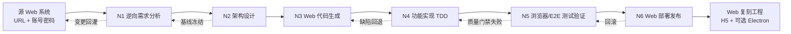
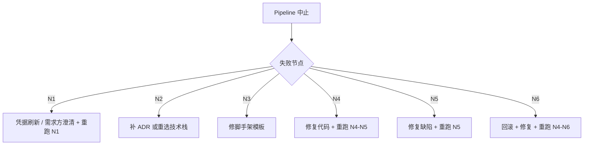
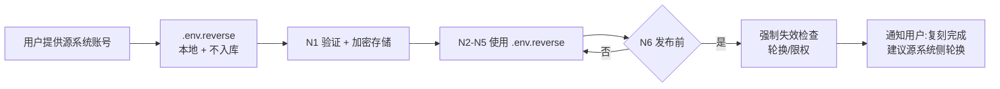

# 逆向分析 + Web 复刻 — 自动化 Pipeline

> 本文档定义一套**"以任意线上 Web 系统(含登录账号密码)为输入,产出功能等价的 Web 复刻工程"**的端到端自动化 Pipeline。
> 输出物是一个**功能等价、可在浏览器/桌面(Electron)/PWA 一致运行**的 Vue 3 + Vite + TypeScript 工程 + 对应后端微服务(若需同步复刻)。
> 6 个节点 **N1–N6** 对应**逆向分析 → 架构设计 → 代码生成 → 功能实现 → 测试验证 → 部署发布**,每节点给出**职责、操作步骤、AI 提示词模板、输入/输出契约**。
> 文档继承 `framework-pipeline.md` 的总体编排思路与 `copy-app-pipeline.md` 的"逆向 + 复刻"模式,并针对 **Web 复刻** 场景做了特化(浏览器抓包代替移动抓包,Web E2E 代替多端 E2E)。

---

## 目录

- [1. 总体设计](#1-总体设计)
  - [1.1 设计目标](#11-设计目标)
  - [1.2 Pipeline 节点总览](#12-pipeline-节点总览)
  - [1.3 节点依赖与执行顺序](#13-节点依赖与执行顺序)
  - [1.4 与已有 Skills / 文档的映射](#14-与已有-skills--文档的映射)
  - [1.5 适用场景与边界](#15-适用场景与边界)
  - [1.6 与 copy-app-pipeline / framework-pipeline 的关系](#16-与-copy-app-pipeline--framework-pipeline-的关系)
- [2. N1 — 逆向需求分析节点](#2-n1--逆向需求分析节点)
  - [2.1 节点职责](#21-节点职责)
  - [2.2 操作步骤](#22-操作步骤)
  - [2.3 提示词模板](#23-提示词模板)
  - [2.4 输入 / 输出契约](#24-输入--输出契约)
- [3. N2 — 架构设计节点](#3-n2--架构设计节点)
  - [3.1 节点职责](#31-节点职责)
  - [3.2 操作步骤](#32-操作步骤)
  - [3.3 提示词模板](#33-提示词模板)
  - [3.4 输入 / 输出契约](#34-输入--输出契约)
- [4. N3 — Web 代码生成节点](#4-n3--web-代码生成节点)
  - [4.1 节点职责](#41-节点职责)
  - [4.2 操作步骤](#42-操作步骤)
  - [4.3 提示词模板](#43-提示词模板)
  - [4.4 输入 / 输出契约](#44-输入--输出契约)
  - [4.5 Web 复刻项目目录模板](#45-web-复刻项目目录模板)
- [5. N4 — 功能实现与质量节点](#5-n4--功能实现与质量节点)
  - [5.1 节点职责](#51-节点职责)
  - [5.2 操作步骤](#52-操作步骤)
  - [5.3 提示词模板](#53-提示词模板)
  - [5.4 输入 / 输出契约](#54-输入--输出契约)
- [6. N5 — 浏览器/E2E 测试验证节点](#6-n5--浏览器e2e-测试验证节点)
  - [6.1 节点职责](#61-节点职责)
  - [6.2 操作步骤](#62-操作步骤)
  - [6.3 提示词模板](#63-提示词模板)
  - [6.4 输入 / 输出契约](#64-输入--输出契约)
- [7. N6 — Web 部署发布节点](#7-n6--web-部署发布节点)
  - [7.1 节点职责](#71-节点职责)
  - [7.2 操作步骤](#72-操作步骤)
  - [7.3 提示词模板](#73-提示词模板)
  - [7.4 输入 / 输出契约](#74-输入--输出契约)
- [8. 节点间输入输出矩阵](#8-节点间输入输出矩阵)
- [9. Pipeline 编排与触发](#9-pipeline-编排与触发)
- [10. 附录](#10-附录)
  - [10.1 默认技术栈](#101-默认技术栈)
  - [10.2 占位符说明](#102-占位符说明)
  - [10.3 复刻账号与凭据管理规范](#103-复刻账号与凭据管理规范)
  - [10.4 文档版本](#104-文档版本)

---

## 1. 总体设计

### 1.1 设计目标

| # | 目标 | 验收标准 |
|---|------|----------|
| G1 | 系统化逆向分析源 Web 系统 | 产出 `reverse-spec.md`,含功能树、UI/UX 表、API 规约、数据模型、鉴权链路 |
| G2 | 鉴权链路 1:1 复刻 | 登录、Token 存储、刷新、注销、权限码 5 项行为与源系统对齐(可使用提供的账号密码直接登录) |
| G3 | Web 工程化脚手架 | 一次命令即可产出可运行的 Vue 3 + Vite + TS 工程,含 ESLint/Prettier/Vitest/Playwright/CI |
| G4 | 后端可同源复刻(可选) | 若需后端同步,Spring Cloud 微服务脚手架可一键生成;否则接 Mock/Proxy 即可 |
| G5 | TDD 驱动的功能实现 | 每个功能模块先写测试再写实现,覆盖率 ≥ 80% |
| G6 | 浏览器自动化 E2E | Playwright 覆盖 Chromium/WebKit/Firefox 三浏览器,关键路径 100% 绿通 |
| G7 | 一键 Web 发布 | Docker 镜像 + Nginx 部署 / Electron 桌面壳打包 / 静态托管,全链路可脚本化 |
| G8 | 全流程可追溯 | 每个节点产物落盘到 `docs/scene/reverse/`,N+1 可消费 N 的输出 |
| G9 | 质量门禁 | 任意节点失败 → Pipeline 中止,自动生成回退指令 |
| G10 | 复刻账号安全 | 提供的源系统账号密码不进入版本库,使用 Secrets 管理 + Mock Account 隔离 |

### 1.2 Pipeline 节点总览



| 节点 | 名称 | 核心目标 | 主用 Skill | 副用 Skill |
|------|------|----------|------------|------------|
| **N1** | 逆向需求分析 | 浏览器抓包+录屏+DOM 嗅探,产出 `reverse-spec.md` | `superpowers:brainstorming` | `openspec:proposal`、Cursor MCP(Playwright/Charles/Mockingbot) |
| **N2** | 架构设计 | Web 技术栈冻结、ADR 落盘、Mock/Proxy 策略 | `gstack:/cso` + `/design-consultation` | `gsd:/map-codebase`、`awesome-design-md` |
| **N3** | Web 代码生成 | 一次性生成 Vue 3 + 后端脚手架 + Mock Server | `gsd:/new-project` | `openspec:proposal` |
| **N4** | 功能实现 | TDD 逐模块实现、API 接入或 Mock | `superpowers:test-driven-development` | `gsd:/execute-phase`、Cursor IDE |
| **N5** | 浏览器/E2E 验证 | Playwright 三浏览器 + 视觉回归 + 质量门禁 | `gstack:/qa` + `/qa-only` | `superpowers:systematic-debugging` |
| **N6** | Web 部署发布 | Docker 镜像、Nginx 部署、Electron 打包、文档发布 | `gsd:/ship` | `gstack:/document-release` + `/land-and-deploy` |

### 1.3 节点依赖与执行顺序

- **强顺序**:`N1 → N2 → N3 → N4 → N5 → N6`,任一节点失败则 Pipeline 中止并产出回退工单。
- **反馈回路**:
  - `N1 ↔ 源系统`(源系统新版本 → 重跑 N1 增量分析)
  - `N3 → N2`(脚手架模板缺失某模块时回退到 N2 补 ADR)
  - `N4 → N3`(发现脚手架缺陷时回退补模板)
  - `N5 → N4`(测试不通过回到 N4 修复)
  - `N6 → N5`(发布后监控发现严重 Bug 触发回滚)
- **可并发**:
  - N3 中"前端脚手架"与"后端脚手架"可并行
  - N3 中"Mock Server"与"API 客户端"可并行
  - N4 中各业务模块(用户/订单/案件/...)可并行实现
  - N5 中"Chromium / WebKit / Firefox"三浏览器可并行
  - N5 中"单元测试"与"组件测试"与"E2E"可并行
  - N6 中"前端镜像构建"与"后端镜像构建"与"Electron 打包"可并行

### 1.4 与已有 Skills / 文档的映射

| Pipeline 阶段 | 调用入口 | 落地产物 |
|---------------|----------|----------|
| 头脑风暴 → N1 | `superpowers:brainstorming` | `reverse-spec.md` 草稿 |
| 抓包逆向 → N1 | Cursor MCP + Playwright(已登录) + Charles/Mitmproxy | `api-mapping.md`、`data-model.md`、`auth-flow.md` |
| 规范驱动 → N1 | `openspec:proposal` | `openspec/changes/reverse-<id>/proposal.md` |
| 产品咨询 → N2 | `gstack:/cso` | `decisions/consultation.md` |
| 设计评审 → N2 | `gstack:/design-review` + `awesome-design-md` | `design-system/tokens.md`、`screen-blueprints.md` |
| 项目规划 → N2→N3 | `gsd:/new-project` | `.planning/roadmap.md` |
| 脚手架生成 → N3 | `gsd:/map-codebase` + 模板引擎 | 完整 Web 目录结构 |
| 阶段执行 → N4 | `gsd:/execute-phase` | 模块代码 + 单元测试 |
| TDD 开发 → N4 | `superpowers:test-driven-development` | 测试 + 实现 |
| 质量门禁 → N5 | `gstack:/qa` + `/qa-only` | `qa-reports/*.md` |
| 工程审查 → N4→N5 | `gstack:/devex-review` | `reviews/devex-*.md` |
| 文档发布 → N6 | `gstack:/document-release` | `RELEASE-NOTES.md` |
| 发布管理 → N6 | `gsd:/ship` | Docker 镜像 + Tag + 文档 |

### 1.5 适用场景与边界

| 维度 | 适用范围 | 不适用范围 |
|------|----------|------------|
| 源系统类型 | Web 后台管理系统(B 端 SaaS / ERP / CRM / OA / 后台运营)、C 端 H5、控制台 | 移动 App(应改用 `copy-app-pipeline.md`)、纯前端静态站 |
| 鉴权方式 | 用户名/密码、邮箱/密码、手机号+验证码、SSO(OAuth2/SAML/CAS)、JWT、Cookie | 硬件 Key、生物识别独占 |
| 复刻目标 | Vue 3 + Vite + TS + Pinia + Ant Design Vue / Element Plus;Spring Cloud 后端(可选同步) | React/Next.js、Node SSR |
| 合规 | 已获得源系统授权(本团队自有工程,或经书面授权的复刻) | 未授权的商业 SaaS 复刻(违反协议与法律) |
| 数据 | 可重放 API 请求并生成 Mock 数据 | 需破解加密或绕过付费墙 |

### 1.6 与 copy-app-pipeline / framework-pipeline 的关系

| 维度 | 框架级 (`framework-pipeline.md`) | App 复刻 (`copy-app-pipeline.md`) | Web 复刻 (`copy-web-pipeline.md`,本文档) |
|------|----------------------------------|-----------------------------------|------------------------------------------|
| 输入 | 业务诉求(0→1) | 既有移动 APP(1→1) | 既有 Web 系统 + 账号密码(1→1) |
| 起点 | N1 头脑风暴 | N1 静态/动态逆向 | N1 浏览器抓包 + 录屏 + 鉴权链路分析 |
| 鉴权重 | 无 | 弱(仅 APP 登录) | **强**(账号密码即授权凭证,需安全处理) |
| N3 产物 | 通用脚手架 | UniApp 跨端工程 | Vue 3 + Vite + Mock Server(含可选后端) |
| 关键差异 | 重视"范围"与"选型" | 重视"还原度"与"平台差异" | 重视"鉴权链路 1:1" + "API Mock 完整" + "浏览器一致性" |
| 测试侧重 | 单元 + 集成 | 多端 E2E | 浏览器 E2E(Chromium/WebKit/Firefox)+ 视觉回归 |
| 共用节点 | N1-N6 设计可参考 | 复用 N4/N5/N6 的质量门禁思路 | 复用 N2/N4/N5/N6 模板 |

---

## 2. N1 — 逆向需求分析节点

### 2.1 节点职责

- **凭据接入**:使用用户提供的源系统账号密码,通过 Cursor MCP 浏览器或本地 Playwright 完成"已登录态"的逆向,避免每次都重新登录。
- **网络抓包**:Charles / Mitmproxy / 浏览器 DevTools 抓取 HTTPS 接口,导出 .har。
- **DOM/录屏逆向**:用 Playwright + 录屏工具对核心流程(登录、首页、列表、详情、表单、支付、消息)做 DOM 嗅探和录屏。
- **静态资源嗅探**:获取首屏 HTML、CSS、JS Bundle、字体、图标、Token、关键 Header(用于还原 UI/UX)。
- **结构化产出**:将逆向结果规整为"功能树 / UI 表 / API 规约 / 数据模型 / 鉴权链路 / 用户故事"六大件。
- **基线冻结**:与产品/法务对齐功能范围、差异点(刻意不一致项)、版权风险。
- **形成 OpenSpec 变更提案**:把"复刻"当作一次标准 OpenSpec 变更驱动后续 N2-N6。

### 2.2 操作步骤

| 步骤 | 动作 | 输出 |
|------|------|------|
| 1 | **凭据准备**:用户提供 `{{SOURCE_URL}}` + `{{SOURCE_ACCOUNT}}` + `{{SOURCE_PASSWORD}}` + `{{TOTP_SECRET}}`(若开启 2FA) | `.env.reverse`(本地,**不入库**) |
| 2 | **凭据验证**:用 Playwright headless 验证账号密码可登录,失败则中止 | `reverse-raw/auth-check.json` |
| 3 | **登录态持久化**:保存登录后的 Cookie / LocalStorage / SessionStorage 到加密文件,后续所有抓包复用 | `.auth/cookies.enc`(加密) |
| 4 | **网络抓包**:Charles 开启 SSL Proxying + Socks5 代理;导出主流程 .har | `reverse-raw/network-capture.har` |
| 5 | **DOM/路由嗅探**:用 Playwright 遍历所有页面,记录 URL、面包屑、关键 DOM、API 端点 | `reverse-raw/route-map.json` |
| 6 | **录屏**:核心流程录屏(登录/首页/列表/详情/表单/支付/...),生成 .mp4 列表 | `reverse-raw/screenshots/*.mp4` |
| 7 | **资源嗅探**:下载首屏静态资源(图片/字体/图标),提取颜色变量、字体家族 | `reverse-raw/assets/`、`reverse-raw/design-tokens.json` |
| 8 | **调用 `superpowers:brainstorming`**,汇总功能点并分类(MUST/SHOULD/MAY) | `reverse-raw/feature-catalog.md` |
| 9 | **整理 API 规约**(请求/响应/错误码/鉴权方式/Token 刷新/限流) | `api-mapping.md` |
| 10 | **整理数据模型**(实体/字段/约束/字典项) | `data-model.md` |
| 11 | **整理 UI 表**(页面/组件/状态/事件/路由),含关键交互 | `screen-blueprints.md` |
| 12 | **整理鉴权链路**(登录方式/Token 格式/刷新/注销/权限码) | `auth-flow.md` |
| 13 | **输出统一 `reverse-spec.md`** 作为 N2 输入 | `reverse-spec.md` |
| 14 | **调用 `openspec:proposal`** 形成 OpenSpec 提案 | `openspec/changes/reverse-{{APP}}/{proposal,tasks}.md` |
| 15 | **与利益相关方(产品/法务/设计)签收** | `openspec/changes/reverse-{{APP}}/approval.md` |
| 16 | **触发 N2** | 移交 |

### 2.3 提示词模板

````text
# N1 提示词模板 — Web 逆向需求分析

[角色] 你是资深 Web 逆向工程师 + 产品经理 + 法务顾问,擅长浏览器抓包、DOM 嗅探、API 还原、鉴权链路分析。

[输入]
  1. 源 Web 系统 URL: {{SOURCE_URL}}         # 例: https://admin.example.com
  2. 登录账号: {{SOURCE_ACCOUNT}}            # 例: admin
  3. 登录密码: {{SOURCE_PASSWORD}}            # 例: ******** (用户提供,不入库)
  4. 2FA/TOTP 密钥(可选): {{TOTP_SECRET}}
  5. 源系统名称: {{APP_NAME}}                 # 例: mediation-platform
  6. 复刻目标类型: web-spa / web-mpa / web-with-electron / web-with-pwa
  7. 授权声明: 已获得合法授权 (是/否),若否必须终止
  8. 业务背景: 1~3 句说明
  9. 复刻目标产物: vue3-web / react-web / 其它

[任务]
  1. **凭据验证(优先,失败即中止)**:
     - 启动 Playwright,打开 {{SOURCE_URL}}/login
     - 自动填写账号 {{SOURCE_ACCOUNT}} + 密码 {{SOURCE_PASSWORD}}
     - 若有 2FA,根据 {{TOTP_SECRET}} 计算 6 位 TOTP 并填写
     - 提交后验证是否跳转到 {{SOURCE_URL}}/dashboard 或 200 OK
     - 失败重试 3 次,仍失败则输出 `auth-check.json` 含错误信息并中止

  2. **登录态持久化(关键)**:
     - 保存 Cookie + LocalStorage + SessionStorage 到 `.auth/cookies.enc`(AES-256 加密,密码 = {{SOURCE_PASSWORD}})
     - 后续所有抓包、嗅探必须先 `restore_auth()` 再操作,避免重复登录
     - 加密文件路径写入 `.gitignore`

  3. **网络抓包**:
     - Charles SSL Proxying(配置域名白名单 {{SOURCE_URL_HOST}})
     - 浏览器 DevTools Network 面板:导出主流程为 .har
     - 抓取范围:登录、首页、列表、详情、表单提交、上传、支付、WebSocket
     - 输出 `reverse-raw/network-capture.har`

  4. **DOM/路由嗅探**:
     - 用 Playwright + 已登录态遍历所有可点击菜单/链接/Breadcrumb
     - 记录:URL、Page Title、面包屑、关键 DOM 节点 (data-testid/data-id)、API 端点
     - 抓取 Sidebar 菜单完整结构
     - 输出 `reverse-raw/route-map.json`

  5. **录屏**:
     - 用 Playwright `recordVideo` 对核心流程录屏(登录/首页/列表/详情/表单/支付/消息)
     - 视频分辨率 1280x720,30fps
     - 输出 `reverse-raw/screenshots/<flow>.mp4`

  6. **资源嗅探**:
     - DevTools Network:下载首屏关键资源(图片/字体/图标)
     - Computed Styles:提取颜色变量、字体家族、间距、阴影
     - 输出 `reverse-raw/assets/` + `reverse-raw/design-tokens.json`

  7. **功能树与分级**:调用 superpowers:brainstorming,输出 `feature-catalog.md`。
     - 树形结构 + 优先级标签 [MUST] / [SHOULD] / [MAY] / [OUT-OF-SCOPE]
     - 必含:账号体系(登录/注册/重置/三方登录)、个人中心、设置、业务模块(以源系统为准)
     - 必须区分"鉴权前后可见功能"和"权限码控功能"

  8. **API 规约**:整理每个接口为:
     | 方法 | 路径 | 入参 | 出参 | 错误码 | 鉴权 | 频率限制 | 备注 |
     - 落盘 `api-mapping.md`,标注哪些接口是"可复用公共服务",哪些是"业务私有"
     - 标注 BASE_URL / 前缀 / 网关路径(如 /api/v1)

  9. **数据模型**:从响应体/页面表单反推,输出 `data-model.md`
     - 字段含类型/约束/中文名/示例值/字典项
     - 标注哪些是主键、外键、索引候选

  10. **UI 表**:按页面整理 `screen-blueprints.md`,每页含:
      - 页面路径与触发条件(URL + 菜单路径)
      - 主要组件清单与状态(loading/empty/error/success)
      - 关键事件与跳转关系
      - 关键 DOM 节点(data-testid 优先)
      - 涉及三方组件(图标库、表格、表单、编辑器)

  11. **鉴权链路**:输出 `auth-flow.md`,必含:
      - 登录方式:用户名密码 / 手机验证码 / SSO / OAuth2
      - Token 格式:JWT / Opaque / 自定义
      - Token 存储:Cookie(LocalStorage/SessionStorage)
      - 刷新策略:静默刷新 / 401 触发 / 轮询
      - 注销:前端清空 + 后端 revoke
      - 权限码:角色/权限字符串(例: admin / system:user:list)
      - 路由守卫:白名单 / 黑名单 / 动态权限

  12. **OpenSpec 提案**:
      openspec/changes/reverse-{{APP}}/
        ├── proposal.md   # Why + What(刻意不一致项 + 法律风险 + 复刻收益)
        ├── tasks.md      # 验收项与拆分(M1..Mn)
        └── design.md     # 关键决策(可选)

  13. **汇总** reverse-spec.md,作为 N2 唯一输入。

[输出要求]
  - Markdown 格式,层级 ≤ 3 层
  - 所有功能点可测、可证伪
  - 刻意不一致项必须在 proposal.md 单独成节"Intended Divergences"
  - 标注 [OPEN QUESTION] 的待澄清问题 ≤ 5 条
  - 至少给出 1 张功能树 Mermaid 图 + 1 张用户旅程图 + 1 张鉴权链路时序图
  - **关键**:`.auth/cookies.enc` 与 `{{SOURCE_PASSWORD}}` 严禁提交到 git

[下游契约 — N2 必须能直接消费的字段]
  - 复刻目标类型 + 技术栈偏好(影响 N3 脚手架选型)
  - 核心业务模块清单(M1..Mn)及其优先级
  - 必须复刻的关键页面(影响 N3 路由骨架)
  - 必须对接的 API 列表(含 BASE_URL + 鉴权方案)
  - 必须支持的鉴权能力(影响 N3 拦截器与 store)
  - 复刻的边界(MUST / SHOULD / MAY)
  - 源系统截图与录屏(供 N2 设计评审参考)
````

### 2.4 输入 / 输出契约

| 方向 | 内容 | 格式 |
|------|------|------|
| 输入 | 源 Web URL + 账号密码 + 2FA + 业务背景 + 复刻目标类型 | URL + 自由文本(**凭据仅入本地 .env.reverse**) |
| 输出 | `reverse-spec.md`<br>`feature-catalog.md`<br>`api-mapping.md`<br>`data-model.md`<br>`screen-blueprints.md`<br>`auth-flow.md`<br>`reverse-raw/network-capture.har`<br>`reverse-raw/route-map.json`<br>`reverse-raw/screenshots/*.mp4`<br>`reverse-raw/design-tokens.json`<br>`openspec/changes/reverse-{{APP}}/{proposal,tasks}.md`<br>`.auth/cookies.enc`(加密,**不入库**) | Markdown + HAR + JSON + 加密文件 |
| 验收 | 6 大件齐全 + 鉴权链路时序图完整 + OpenSpec 提案评审通过 + 利益相关方签收 | `approval.md` 含签名/时间戳 |
| 移交 N2 | `reverse-spec.md` + 6 大件 + OpenSpec 提案 + 录屏(可选) | — |

---

## 3. N2 — 架构设计节点

### 3.1 节点职责

- 基于 N1 产出的 `reverse-spec.md`,为 Web 复刻选型与冻结技术栈。
- 明确**目标产物形态、复刻技术栈、Mock/Proxy 策略、鉴权实现、数据流、性能基线、刻意差异策略**。
- 落盘**ADR(Architecture Decision Record)**,标记 `[LOCKED]` 与 `[FLEX]` 项。
- 输出一份 `baseline-stack.json` 作为 N3 的直接输入。

### 3.2 操作步骤

| 步骤 | 动作 | 输出 |
|------|------|------|
| 1 | 调用 `gstack:/cso` 启动一轮产品-技术-设计三方咨询 | `decisions/consultation.md` |
| 2 | 生成**复刻产物形态矩阵**(Web SPA / Web + Electron / Web + PWA / Web + 后端) | `delivery-matrix.md` |
| 3 | 关键技术决策 → 编写 ADR(至少 4 份) | `decisions/ADR-0001-frontend-engine.md`、`ADR-0002-ui-library.md`、`ADR-0003-auth-impl.md`、`ADR-0004-mock-strategy.md` 等 |
| 4 | 调用 `gstack:/design-consultation` + `awesome-design-md` 确认 UI/UX 体系 | `design-system/tokens.md`、`design-system/components.md` |
| 5 | 调用 `gsd:/map-codebase`(若已存在部分代码) | `.planning/codebase/ARCHITECTURE.md` |
| 6 | 输出 `baseline-stack.json`(供 N3 直接消费) | `baseline-stack.json` |
| 7 | 输出 C4 Container 草图与模块边界图 | `architecture/c4-container.md`、`architecture/modules.md` |
| 8 | 输出刻意差异策略文档 | `intentional-divergence.md` |
| 9 | 触发 N3 | 移交 |

### 3.3 提示词模板

````text
# N2 提示词模板 — Web 架构设计

[角色] 你是首席架构师(Chief Software Architect),专长 Web SPA 架构(Vue 3 / React + Vite + 微前端)。

[输入]
  - N1 产出的 reverse-spec.md、feature-catalog.md、api-mapping.md、data-model.md、screen-blueprints.md、auth-flow.md
  - 复刻目标类型: {{DELIVERY_FORM}} (web-spa / web-mpa / web-with-electron / web-with-pwa)
  - 既有架构约束(若复用现有 mediation-platform 工程)

[任务]
  1. **复刻产物形态矩阵** `delivery-matrix.md`:
     | 形态 | 适用场景 | 关键技术 | 优点 | 缺点 | 决策 |
     |------|----------|----------|------|------|------|
     | Web SPA (Vue 3) | 标准后台 | Vite + Pinia + Ant Design Vue | 上手快、生态全 | 离线能力弱 | 推荐 |
     | Web + Electron | 桌面客户端 | SPA + Electron 壳 | 离线/系统集成 | 包体积大 | 可选 |
     | Web + PWA | 移动 H5 + 离线 | Service Worker | 安装到桌面 | iOS 支持弱 | 视需求 |
     | Web + 后端同步 | 全栈复刻 | Vue + Spring Cloud | 数据自主 | 维护成本 | 视需求 |

  2. **Web 技术栈选型**(默认推荐):
     - 框架: Vue 3.5+ (Composition API + script setup)
     - 语言: TypeScript 5.x(主) + SCSS(辅)
     - 构建: Vite 6.x
     - 状态管理: Pinia 3.x + pinia-plugin-persistedstate
     - 路由: Vue Router 4.x
     - UI 库: Ant Design Vue 4.x(也可选 Element Plus / Naive UI)
     - 图标: @ant-design/icons-vue + @iconify/vue
     - 网络: Axios 1.x + 自封装 `request.ts`(拦截器/Token 刷新/取消)
     - 表单: vee-validate + zod
     - 实时通信: WebSocket(原生 + 心跳/重连)
     - 富文本: @wangeditor/editor
     - 图表: ECharts 6.x
     - CSS: UnoCSS(原子化)或 Sass(分层)
     - 测试: Vitest(单元) + @vue/test-utils(组件) + Playwright(E2E)
     - 质量: ESLint + Prettier + Stylelint + vue-tsc
     - 桌面(可选): Electron 42 + electron-builder + electron-updater

  3. **Mock 策略**(关键决策,影响 N3):
     - 选项 A:Mock Service Worker(MSW) - 拦截真实 fetch,无需后端
     - 选项 B:Vite 内置 Mock 插件(mockjs / vite-plugin-mock) - 仅开发期
     - 选项 C:本地 Node Mock Server(json-server / Express) - 独立服务
     - 选项 D:对接源系统(带鉴权) - 真实数据,合规风险
     - 默认: A (MSW) + C (关键 API 兜底)

  4. **鉴权实现策略**(影响 N3 store + 路由守卫):
     - Token 存储:Cookie(httpOnly 优先) / localStorage
     - 刷新策略:401 触发 + 并发请求合并 + 队列等待
     - 路由守卫:全局 beforeEach + 动态权限(从用户信息加载)
     - 权限码:字符串列表(例: ['system:user:list','system:user:create']) + v-has-permi 指令
     - 注销:清 Token + 跳登录 + revoke(可选)

  5. **至少 4 份 ADR**,每份包含:
     - 背景与问题
     - 备选方案(≥ 2 个)
     - 决策与理由
     - 后果与回滚成本
     - Status: [LOCKED] / [FLEX]

     必含 ADR:
     - ADR-0001 前端框架选型(Vue 3 vs React 18)
     - ADR-0002 UI 库选型(Ant Design Vue vs Element Plus vs Naive UI)
     - ADR-0003 鉴权实现方案(参考源系统 auth-flow.md)
     - ADR-0004 Mock 策略(MSW vs vite-plugin-mock vs json-server)
     - ADR-0005 状态管理(Pinia vs Vuex 4)
     - ADR-0006 构建与发布流水线(Vite + Docker + Nginx)

  6. **baseline-stack.json**(字段固定):
     {
       "app": {
         "name": "{{APP_NAME}}",
         "version": "0.1.0",
         "description": "...",
         "delivery_form": "{{DELIVERY_FORM}}"
       },
       "frontend": {
         "framework": "Vue 3.5+",
         "build": "Vite 6",
         "lang": "TypeScript 5",
         "ui": "Ant Design Vue 4",
         "state": "Pinia 3",
         "router": "Vue Router 4",
         "http": "Axios 1 + request.ts 拦截器",
         "form": "vee-validate + zod",
         "rich_editor": "@wangeditor/editor",
         "chart": "ECharts 6",
         "icons": "@ant-design/icons-vue + @iconify/vue",
         "css": "UnoCSS + SCSS",
         "test_unit": "Vitest",
         "test_component": "@vue/test-utils",
         "test_e2e": "Playwright",
         "lint": "ESLint + Prettier + Stylelint",
         "type_check": "vue-tsc"
       },
       "electron": {
         "enabled": {{ELECTRON_ENABLED}},
         "version": "42.x",
         "builder": "electron-builder",
         "updater": "electron-updater"
       },
       "auth": {
         "scheme": "{{AUTH_SCHEME}}",          // jwt / oauth2 / cookie-session
         "login_url": "{{LOGIN_URL}}",
         "token_storage": "localStorage",      // 或 httpOnly cookie
         "refresh_strategy": "401_triggered_with_concurrent_merge",
         "permission_model": "role_permission_string_array",
         "permission_directive": "v-has-permi"
       },
       "mock": {
         "primary": "msw",                     // msw / vite-plugin-mock / json-server
         "fallback": "json-server",            // 兜底
         "auth_mock": true,                    // 鉴权也可被 Mock
         "data_source": "reverse-raw/network-capture.har"
       },
       "delivery": {
         "ci": "GitHub Actions / GitLab CI",
         "container": "Docker (nginx:alpine)",
         "web_server": "Nginx",
         "static_hosting": "支持(Nginx/S3/OSS/CDN)",
         "desktop_packaging": "electron-builder(mac/win/linux)"
       },
       "quality": {
         "coverage_min": 80,
         "format": "Prettier",
         "commit_lint": "commitlint + husky"
       }
     }

  7. **C4 Container 草图** + **模块边界图**(Mermaid):
     - 容器:Web SPA / Mock Server / 源系统(可选代理) / 后端 API(可选同步)
     - 模块:api / store / router / views / components / utils / composables / directives

  8. **刻意差异策略文档** `intentional-divergence.md`:
     - 商标/Logo 必须替换为本项目
     - 版权信息替换
     - 文案避免 100% 一致(避免直接抄袭)
     - 不实现的源系统私有功能(标注 [OUT-OF-SCOPE])

[输出要求]
  - 所有 [LOCKED] 项不可变更(变更需新开 ADR)
  - [FLEX] 项可在 N3-N4 微调
  - 至少 1 张 C4 图 + 1 张模块依赖图 + 1 张复刻差异矩阵
````

### 3.4 输入 / 输出契约

| 方向 | 内容 | 格式 |
|------|------|------|
| 输入 | N1 全部 6 大件 + 复刻目标类型 + 既有约束 | Markdown + HAR + JSON |
| 输出 | `baseline-stack.json`<br>`decisions/ADR-*.md`<br>`delivery-matrix.md`<br>`intentional-divergence.md`<br>`design-system/{tokens,components}.md`<br>`architecture/{c4-container,modules}.md` | Markdown + JSON |
| 验收 | 所有 [LOCKED] 项被基线化,变更需新开 ADR | ADR 内 Status 字段 |
| 移交 N3 | `baseline-stack.json` + ADR 列表 + 复刻产物形态 + 鉴权策略 + Mock 策略 | — |

---

## 4. N3 — Web 代码生成节点

### 4.1 节点职责

- 一次性产出**完整、可运行**的 Web 复刻脚手架(含前端 + Mock Server + 可选后端 + 可选 Electron 壳)。
- 包含:目录结构、依赖配置、路由骨架、API 桩、Pinia store 骨架、Mock 数据、鉴权实现、CI 模板、Docker 配置、测试。
- 落地产物可被 N4 直接 `pnpm install` 后开始编码,`pnpm dev` 能立即打开空白页 + Mock 数据。
- 在脚手架中**预置** N1 解析出的页面骨架、API 桩、Pinia store 骨架、Mock 数据,使 N4 专注业务实现。

### 4.2 操作步骤

| 步骤 | 动作 | 输出 |
|------|------|------|
| 1 | 读取 N2 的 `baseline-stack.json` | 内存对象 |
| 2 | 选择 Vue 3 + Vite + TS 模板(`pnpm create vite@latest --template vue-ts`) | 模板路径 |
| 3 | 调用 `gsd:/new-project` 生成 `.planning/` 目录 | `.planning/roadmap.md` |
| 4 | 渲染目录骨架(脚本/模板引擎),按 N1 页面清单预置空页面/路由 | 物理目录 |
| 5 | 生成 `vite.config.ts`(Vue 插件 + 路径别名 + Proxy + 跨域) | `vite.config.ts` |
| 6 | 生成 `src/router/index.ts`(N1 解析的路由表 + 守卫) | `src/router/` |
| 7 | 生成 `src/api/**`(N1 的 `api-mapping.md`) | `src/api/` |
| 8 | 生成 `src/utils/request.ts`(拦截器 + Token 刷新 + 错误统一) | `src/utils/request.ts` |
| 9 | 生成 `src/stores/**`(user/permission/app/dict/...)骨架 | `src/stores/` |
| 10 | 生成 `src/directives/hasPermi.ts`(v-has-permi 指令) | `src/directives/` |
| 11 | 生成 `src/views/**`(N1 解析的页面清单) | `src/views/` |
| 12 | 生成 `src/components/**`(公共组件:DictSelect/DictTag/FormModal/...) | `src/components/` |
| 13 | 生成 `src/layouts/**`(Default/Layout/Auth/Blank) | `src/layouts/` |
| 14 | 生成 Mock Server(MSW + json-server 兜底) | `mock/` |
| 15 | 生成 `src/composables/**`(useDict/useTable/useForm/useWebSocket) | `src/composables/` |
| 16 | 生成 CI 模板(`.github/workflows/{ci,build-web,build-electron,deploy}.yml`) | YAML |
| 17 | 生成 Docker 配置(`Dockerfile` + `nginx.conf`) | Docker 文件 |
| 18 | 生成测试与代码质量配置(`.eslintrc`、`.prettierrc`、`vitest.config.ts`、`playwright.config.ts`) | 配置文件 |
| 19 | 生成 `commitlint` + `husky` + `lint-staged` | 配置文件 |
| 20 | 生成 `commitizen` 交互式提交 | `cz-config.js` |
| 21 | 生成文档骨架(README、CHANGELOG、API 文档、ADR 索引) | Markdown |
| 22 | 初始化 git 并打 tag `v0.1.0-baseline` | git tag |
| 23 | 触发 N4 | 移交 |

### 4.3 提示词模板

````text
# N3 提示词模板 — Web 代码生成

[角色] 你是 DevOps 工程师 + Vue 3 脚手架生成器,熟悉 Vite 生态与 Monorepo。

[输入]
  - baseline-stack.json (N2 产出)
  - reverse-spec.md、feature-catalog.md、api-mapping.md、auth-flow.md (N1 产出)
  - 项目元信息:name / description / license / author / repo-url

[任务]
  1. **选择并执行 Vue 3 + Vite + TypeScript 模板**:
     命令参考:
       pnpm create vite@latest {{APP_NAME}} --template vue-ts
     必要依赖:
       - vue 3.5+ / vue-router 4 / pinia 3
       - pinia-plugin-persistedstate
       - ant-design-vue 4 / @ant-design/icons-vue
       - @iconify/vue + @iconify-json/ant-design
       - axios 1.x / dayjs / lodash-es
       - vee-validate / zod
       - @wangeditor/editor / @wangeditor/editor-for-vue
       - echarts 6.x / nprogress
       - vue-i18n
       - @vueuse/core
       - msw(开发依赖) / json-server(开发依赖)
       - vitest / @vue/test-utils / happy-dom
       - @playwright/test
       - eslint / prettier / stylelint / @typescript-eslint / eslint-plugin-vue
       - vue-tsc / typescript
       - unocss / @unocss/preset-uno
       - sass-embedded
       - electron + electron-builder + electron-updater(若启用 Electron)
       - vite-plugin-electron + vite-plugin-electron-renderer(若启用 Electron)
       - @commitlint/cli @commitlint/config-conventional husky lint-staged commitizen cz-git
       - rollup-plugin-visualizer(打包分析)

  2. **预置目录结构**(对齐 mediation-web 的实际布局):
     {{APP_NAME}}/
     ├── src/
     │   ├── api/                          # 与 N1 api-mapping.md 一致
     │   │   ├── index.ts                  # 统一导出
     │   │   ├── uaa/                      # 认证服务
     │   │   │   ├── auth.ts               # login/logout/refresh
     │   │   │   ├── user.ts
     │   │   │   └── menu.ts
     │   │   ├── system/                   # 字典/文件/通知
     │   │   │   ├── dict.ts
     │   │   │   ├── file.ts
     │   │   │   └── notify.ts
     │   │   └── modules/                  # 业务模块(以源系统为准)
     │   ├── components/
     │   │   ├── common/                   # DictSelect/DictTag/FormModal/PageHeader/EmptyState
     │   │   ├── form/                     # 表单组件
     │   │   ├── table/                    # 表格组件
     │   │   └── business/                 # 业务组件
     │   ├── views/                        # 页面(以 N1 解析结果预置)
     │   │   ├── login/                    # 登录
     │   │   ├── dashboard/                # 首页
     │   │   ├── uaa/                      # 用户/角色/菜单
     │   │   ├── system/                   # 系统管理
     │   │   ├── error/                    # 403/404/500
     │   │   └── modules/                  # 业务模块
     │   ├── router/
     │   │   ├── index.ts
     │   │   ├── routes.ts
     │   │   └── guards.ts                 # 鉴权守卫
     │   ├── stores/                       # Pinia
     │   │   ├── index.ts
     │   │   ├── user.ts                   # 用户/Token/权限
     │   │   ├── permission.ts             # 动态路由/权限码
     │   │   ├── app.ts                    # 全局应用状态
     │   │   ├── dict.ts                   # 字典
     │   │   └── tags.ts                   # 标签栏
     │   ├── composables/                  # useDict/useTable/useForm/useWebSocket
     │   ├── directives/                   # v-has-permi / v-copy
     │   ├── hooks/                        # 通用 hooks
     │   ├── utils/
     │   │   ├── request.ts                # 拦截器/Token刷新/取消
     │   │   ├── auth.ts                   # Token 读写
     │   │   ├── dict.ts                   # 字典转换
     │   │   ├── validate.ts               # 表单校验
     │   │   └── index.ts
     │   ├── layouts/
     │   │   ├── DefaultLayout.vue
     │   │   ├── AuthLayout.vue
     │   │   └── BlankLayout.vue
     │   ├── locales/                      # i18n
     │   ├── types/                        # 全局 TS 类型 + components.d.ts
     │   ├── assets/
     │   ├── styles/                       # base.scss / variables.scss / mixins.scss
     │   ├── App.vue
     │   ├── main.ts                       # createApp + Pinia + Router + Antd
     │   └── env.d.ts
     ├── mock/                             # Mock Server
     │   ├── handlers.ts                   # MSW handlers(从 N1 .har 生成)
     │   ├── browser.ts
     │   ├── node.ts
     │   ├── json-server/                  # 兜底(可选)
     │   │   └── db.json
     │   └── README.md
     ├── tests/
     │   ├── unit/                         # Vitest
     │   ├── component/                    # @vue/test-utils
     │   ├── e2e/                          # Playwright
     │   │   ├── fixtures/
     │   │   ├── auth.spec.ts              # 登录/注销/Token 刷新
     │   │   ├── dashboard.spec.ts
     │   │   ├── uaa.spec.ts               # 用户/角色/菜单
     │   │   └── system.spec.ts
     │   └── README.md
     ├── electron/                         # 可选
     │   ├── main.ts
     │   ├── preload.ts
     │   └── builder.json
     ├── .github/
     │   ├── CODEOWNERS
     │   └── workflows/
     │       ├── ci.yml                    # install + lint + type-check + test
     │       ├── build-web.yml             # Vite build + Docker
     │       ├── build-electron.yml        # electron-builder
     │       └── deploy.yml                # Nginx / S3 / OSS
     ├── docker/
     │   ├── Dockerfile                    # nginx:alpine + dist
     │   ├── nginx.conf                    # SPA fallback / gzip / cache
     │   └── docker-compose.yml
     ├── .vscode/                          # 推荐插件/设置
     ├── .env.example                      # VITE_API_BASE_URL / VITE_APP_TITLE
     ├── .env.development / .env.production / .env.test
     ├── .env.reverse                      # 源系统凭据(**不入库**)
     ├── .gitignore                        # 必须包含 .env.reverse / .auth/
     ├── .editorconfig
     ├── .prettierrc
     ├── .eslintrc.cjs
     ├── .stylelintrc.cjs
     ├── .npmrc                            # 国内镜像
     ├── .nvmrc
     ├── vitest.config.ts
     ├── playwright.config.ts
     ├── commitlint.config.cjs
     ├── .husky/
     │   ├── pre-commit                    # lint-staged
     │   └── commit-msg                    # commitlint
     ├── tsconfig.json / tsconfig.app.json / tsconfig.node.json
     ├── vite.config.ts                    # Vue + 路径别名 + Proxy + 跨域 + UnoCSS + MSW + Electron(可选)
     ├── uno.config.ts
     ├── package.json / pnpm-lock.yaml
     ├── docker-compose.yml                # 本地一体化:web + mock + db(可选)
     ├── Makefile                          # make install/dev/build/test/lint/e2e/smoke/ship
     ├── CHANGELOG.md
     ├── LICENSE
     ├── README.md
     ├── docs/
     │   ├── reverse/                      # 软链到 N1 产物
     │   │   ├── reverse-spec.md
     │   │   ├── feature-catalog.md
     │   │   ├── api-mapping.md
     │   │   ├── data-model.md
     │   │   ├── screen-blueprints.md
     │   │   └── auth-flow.md
     │   ├── ARCHITECTURE.md
     │   ├── API.md
     │   ├── DEPLOY.md
     │   ├── CHANGELOG.md
     │   ├── decisions/                    # 软链到 N2 ADR
     │   └── design-system/
     └── .planning/
         ├── roadmap.md
         └── codebase/
             ├── STACK.md
             ├── ARCHITECTURE.md
             ├── CONVENTIONS.md
             ├── STRUCTURE.md
             └── TESTING.md

  3. **vite.config.ts 预置**:
     - Vue 插件 + 路径别名(@/@views/@api/@utils/...)
     - UnoCSS 插件
     - unplugin-vue-components(自动注册)
     - devServer.proxy: /api → {{SOURCE_URL}} 后端(开发期,可切换到 Mock)
     - MSW 开发期自动启动

  4. **src/router/index.ts 预置**:
     - createRouter + createWebHistory
     - 静态路由(登录/403/404/500)
     - 动态路由(从 /auth/menus 加载,转换为路由树)
     - 全局守卫:beforeEach
       - 白名单(/login、/register、/forgot)
       - 已登录访问 /login → 重定向 /dashboard
       - 未登录访问受限页 → 重定向 /login?redirect=
       - 权限码校验(v-has-permi)

  5. **src/utils/request.ts 模板**(关键,影响 N4 业务对接):
     - axios 实例 + baseURL(从 .env 读)
     - 请求拦截器:附加 Authorization / Tenant-Id / Accept-Language
     - 响应拦截器:
       - code === 0: 返回 data
       - code === 401: 触发刷新,合并并发请求,失败跳登录
       - code === 403/404/500: 统一 Toast + 跳转
     - 错误处理:网络错误 / 超时 / 取消
     - 文件上传双通道
     - TS 类型完整:RequestConfig<T>、Response<T>、PageResult<T>

  6. **src/stores/user.ts 模板**:
     - state: token / userInfo / roles / permissions / tenantId
     - actions: login / logout / fetchUserInfo / fetchMenus / refreshToken
     - persist: token 与 userInfo 持久化(pinia-plugin-persistedstate)
     - 完整 TS 类型

  7. **MSW Mock 预置**:
     - 从 N1 的 `network-capture.har` 自动生成 handlers(若自动化失败,提供 starter 模板)
     - 覆盖:login/logout/refresh/info/menus/dict/...所有 N1 抓到的接口
     - 启动:`pnpm dev` 时自动启用

  8. **CI 模板**:
     - ci.yml:install + lint + type-check + unit + build
     - build-web.yml: Vite build + Docker build + push 到 GHCR / 阿里云
     - build-electron.yml: electron-builder(mac/win/linux 三平台)
     - deploy.yml: SSH 到服务器 + docker-compose up / 上传 S3-OSS / CDN 刷新

  9. **Docker 配置**:
     - Dockerfile: 多阶段构建(node:22-alpine 构建 + nginx:alpine 运行)
     - nginx.conf: SPA fallback (try_files $uri $uri/ /index.html) + gzip + 缓存策略
     - docker-compose.yml: web + mock(可选) + db(可选)

  10. **强制约束**:
      - pnpm-lock.yaml 必须生成且提交
      - 必须包含 CI cache 步骤
      - 必须包含至少 1 个单元测试 + 1 个组件测试 + 1 个 E2E 样例
      - 必须配置 husky + lint-staged + commitlint
      - **关键**:`.env.reverse` 与 `.auth/cookies.enc` 必须加入 `.gitignore`
      - 必须配置 CODEOWNERS
      - 必须在 README 中说明"复刻账号使用规范"与"安全注意事项"

  11. **调用 gsd:/new-project** 生成 .planning/roadmap.md
  12. **初始化 git**,提交信息:`chore: bootstrap web reverse-app scaffold v0.1.0`
  13. **打 tag**: `v0.1.0-baseline`

[输出要求]
  - 一次性命令完成(可使用 `Makefile: make bootstrap`)
  - `pnpm dev` 能跑通空白页 + Mock 数据
  - `pnpm build` 能产出 dist/ 目录
  - 给出 `.planning/codebase/{STACK,ARCHITECTURE,CONVENTIONS,STRUCTURE,TESTING}.md`
  - 给出 `docs/reverse/` 软链或副本指向 N1 产物
  - 给出 `CHANGELOG.md` 与 `README.md`(含复刻账号使用规范)
````

### 4.4 输入 / 输出契约

| 方向 | 内容 | 格式 |
|------|------|------|
| 输入 | `baseline-stack.json` + N1 全部 6 大件 + 项目元信息 | JSON + Markdown + YAML + HAR |
| 输出 | 完整 Web 目录 + `vite.config.ts` + `src/router/` + `src/stores/` + `mock/` + CI 模板 + Docker + `.planning/` + git tag | 物理文件 |
| 验收 | `make smoke` 通过(包含 install / lint / type-check / test / build / dev 烟测) | 命令退出码 0 |
| 移交 N4 | git 仓库(分支:`main`,tag:`v0.1.0-baseline`)+ `.planning/roadmap.md` | — |

### 4.5 Web 复刻项目目录模板

```
{{APP_NAME}}/
├── README.md                              # 含复刻账号使用规范 + 安全注意事项
├── CHANGELOG.md
├── LICENSE
├── Makefile                               # make install/dev/build/test/lint/e2e/smoke/ship
├── package.json
├── pnpm-lock.yaml
├── .npmrc
├── .nvmrc
├── tsconfig.json
├── tsconfig.app.json
├── tsconfig.node.json
├── vite.config.ts                         # Vue + 路径别名 + Proxy + UnoCSS + Components + Electron(可选) + MSW
├── uno.config.ts
├── vitest.config.ts
├── playwright.config.ts
├── commitlint.config.cjs
├── .env.example                           # VITE_API_BASE_URL / VITE_APP_TITLE / VITE_USE_MOCK
├── .env.development
├── .env.production
├── .env.test
├── .env.reverse                           # 源系统凭据(本地,**不入库**)
├── .gitignore                             # 必须包含 .env.reverse / .auth/
├── .editorconfig
├── .prettierrc
├── .eslintrc.cjs
├── .stylelintrc.cjs
├── .husky/
│   ├── pre-commit                         # lint-staged
│   └── commit-msg                         # commitlint
├── docker/
│   ├── Dockerfile                         # 多阶段:node:22-alpine → nginx:alpine
│   ├── nginx.conf                         # SPA fallback + gzip + 缓存
│   └── docker-compose.yml                 # web + mock + db(可选)
├── electron/                              # 可选
│   ├── main.ts
│   ├── preload.ts
│   └── builder.json
├── .github/
│   ├── CODEOWNERS
│   └── workflows/
│       ├── ci.yml                         # install + lint + type-check + test
│       ├── build-web.yml                  # Vite build + Docker
│       ├── build-electron.yml             # electron-builder
│       └── deploy.yml                     # Nginx / S3 / OSS
├── .vscode/
│   ├── settings.json
│   └── extensions.json
├── docs/
│   ├── reverse/                           # 软链到 N1 产物
│   │   ├── reverse-spec.md
│   │   ├── feature-catalog.md
│   │   ├── api-mapping.md
│   │   ├── data-model.md
│   │   ├── screen-blueprints.md
│   │   └── auth-flow.md
│   ├── ARCHITECTURE.md
│   ├── API.md
│   ├── DEPLOY.md
│   ├── CHANGELOG.md
│   ├── decisions/                         # 软链到 N2 ADR
│   │   ├── ADR-0001-frontend-engine.md
│   │   ├── ADR-0002-ui-library.md
│   │   ├── ADR-0003-auth-impl.md
│   │   ├── ADR-0004-mock-strategy.md
│   │   ├── ADR-0005-state-mgmt.md
│   │   └── ADR-0006-build-deploy.md
│   └── design-system/
│       ├── tokens.md
│       └── components.md
├── mock/                                  # MSW + json-server
│   ├── handlers.ts                        # 从 N1 .har 生成
│   ├── browser.ts
│   ├── node.ts
│   ├── json-server/                       # 兜底
│   │   └── db.json
│   └── README.md
├── src/
│   ├── api/
│   │   ├── index.ts                       # 统一导出
│   │   ├── uaa/
│   │   │   ├── auth.ts                    # login/logout/refresh
│   │   │   ├── user.ts
│   │   │   ├── role.ts
│   │   │   └── menu.ts
│   │   ├── system/
│   │   │   ├── dict.ts
│   │   │   ├── file.ts
│   │   │   ├── notify.ts
│   │   │   └── config.ts
│   │   └── modules/                       # 业务模块(以源系统为准)
│   │       ├── case.ts
│   │       ├── mediation.ts
│   │       └── ...
│   ├── components/
│   │   ├── common/                        # PageHeader/EmptyState/Loading/ErrorBoundary
│   │   ├── form/                          # FormModal/FormItem/SearchForm
│   │   ├── table/                         # ProTable/TableAction/TableColumnSetting
│   │   ├── dict/                          # DictSelect/DictTag/DictSwitch
│   │   ├── layout/                        # Sidebar/Header/Tabs/Breadcrumb
│   │   └── business/                      # 业务组件
│   ├── views/
│   │   ├── login/
│   │   ├── register/
│   │   ├── forgot-password/
│   │   ├── dashboard/
│   │   ├── uaa/                           # 用户/角色/菜单/部门
│   │   ├── system/                        # 字典/通知/文件/参数
│   │   ├── error/                         # 403/404/500
│   │   └── modules/                       # 业务模块
│   ├── router/
│   │   ├── index.ts
│   │   ├── routes.ts                      # 静态路由
│   │   ├── async-routes.ts                # 动态路由生成
│   │   └── guards.ts                      # 鉴权守卫
│   ├── stores/
│   │   ├── index.ts
│   │   ├── user.ts                        # 用户/Token/权限
│   │   ├── permission.ts                  # 动态路由/权限码
│   │   ├── app.ts                         # 全局应用状态
│   │   ├── dict.ts                        # 字典
│   │   ├── tags.ts                        # 标签栏
│   │   └── settings.ts                    # 主题/布局
│   ├── composables/
│   │   ├── useDict.ts
│   │   ├── useTable.ts
│   │   ├── useForm.ts
│   │   ├── useWebSocket.ts
│   │   └── useLoading.ts
│   ├── directives/
│   │   ├── index.ts
│   │   ├── hasPermi.ts                    # v-has-permi
│   │   └── copy.ts                        # v-copy
│   ├── hooks/
│   ├── utils/
│   │   ├── index.ts
│   │   ├── request.ts                     # 拦截器/Token刷新/取消
│   │   ├── auth.ts                        # Token 读写
│   │   ├── dict.ts                        # 字典转换
│   │   ├── validate.ts                    # 表单校验
│   │   ├── download.ts                    # 文件下载
│   │   └── format.ts                      # 格式化
│   ├── layouts/
│   │   ├── DefaultLayout.vue
│   │   ├── AuthLayout.vue
│   │   └── BlankLayout.vue
│   ├── locales/                           # i18n(zh-CN/en-US)
│   ├── types/
│   │   ├── api.d.ts
│   │   ├── router.d.ts
│   │   ├── store.d.ts
│   │   └── components.d.ts                # 自动生成
│   ├── assets/
│   │   ├── images/
│   │   ├── icons/
│   │   └── logo.svg
│   ├── styles/
│   │   ├── index.scss
│   │   ├── variables.scss
│   │   ├── mixins.scss
│   │   └── reset.scss
│   ├── App.vue
│   ├── main.ts                            # createApp + Pinia + Router + Antd + i18n
│   └── env.d.ts
├── tests/
│   ├── unit/                              # Vitest
│   │   ├── request.spec.ts
│   │   ├── auth.spec.ts
│   │   └── stores/*.spec.ts
│   ├── component/                         # @vue/test-utils + happy-dom
│   │   ├── DictSelect.spec.ts
│   │   └── FormModal.spec.ts
│   ├── e2e/                               # Playwright
│   │   ├── fixtures/
│   │   │   └── auth.ts                    # 已登录态 fixture
│   │   ├── auth.spec.ts                   # 登录/注销/Token刷新
│   │   ├── dashboard.spec.ts
│   │   ├── uaa.spec.ts
│   │   ├── system.spec.ts
│   │   └── modules/*.spec.ts
│   └── README.md
└── .planning/
    ├── roadmap.md
    └── codebase/
        ├── STACK.md
        ├── ARCHITECTURE.md
        ├── CONVENTIONS.md
        ├── STRUCTURE.md
        └── TESTING.md
```

---

## 5. N4 — 功能实现与质量节点

### 5.1 节点职责

- 在 N3 脚手架基础上,**逐模块 TDD 实现** 源 Web 系统的功能。
- 严格遵循 `superpowers:test-driven-development`:红 → 绿 → 重构。
- 每个功能模块输出**单元测试 + 组件测试 + E2E 测试 + 业务实现**。
- 接入鉴权链路(基于 N1 的 `auth-flow.md`),实现 Token 刷新、路由守卫、权限码指令。
- 维护 `MODULES.md` 记录每个模块的状态(待开发/进行中/已完成/已测试)。

### 5.2 操作步骤

| 步骤 | 动作 | 输出 |
|------|------|------|
| 1 | 从 `.planning/roadmap.md` 取下一个 M_i 模块 | `MODULES.md` 更新 |
| 2 | 调用 `superpowers:test-driven-development` | 测试文件先写 |
| 3 | 编写 `api/{module}.ts` 接口函数(对接后端或 Mock) | `api/` |
| 4 | 编写 `stores/{module}.ts` 状态(state/getters/actions) | `stores/` |
| 5 | 编写 `views/{module}/*.vue` 页面(模板/脚本/样式) | `views/` |
| 6 | 编写 `components/...` 复用组件 | `components/` |
| 7 | 接入鉴权(v-has-permi / 路由守卫) | 代码内 |
| 8 | 运行 `pnpm test` + `pnpm type-check` + `pnpm lint` | 报告 |
| 9 | 在浏览器手动验证(可用 Cursor MCP Playwright) | 录屏/截图 |
| 10 | 更新 `MODULES.md` 状态为"已实现" | `MODULES.md` |
| 11 | 重复步骤 1-10 直到所有 MUST 模块完成 | — |
| 12 | 调用 `gsd:/execute-phase` 收尾该阶段 | `.planning/phases/...` |
| 13 | 触发 N5 | 移交 |

### 5.3 提示词模板

````text
# N4 提示词模板 — 功能实现(TDD)

[角色] 你是资深 Vue 3 跨端开发工程师,精通 TDD、Pinia、Vue Router、Ant Design Vue。

[输入]
  - N3 脚手架 + git tag v0.1.0-baseline
  - N1 的 feature-catalog.md(必含:登录/注册/重置密码/账号设置)
  - N1 的 api-mapping.md
  - N1 的 data-model.md
  - N1 的 screen-blueprints.md
  - N1 的 auth-flow.md
  - N2 的 ADR-0003(鉴权实现) + ADR-0004(Mock 策略)
  - 当前模块: M_i(从 roadmap.md 取)
  - 测试基线: 覆盖率 ≥ 80%

[任务 — 严格 TDD]
  1. **红(Red)**:先写测试。
     - 单元测试:store 行为、utils 函数、request 拦截器、composables
     - 组件测试:@vue/test-utils + happy-dom 渲染 + 交互
     - E2E 测试(Playwright):登录/首页/列表/详情关键路径

  2. **绿(Green)**:写最小实现让测试通过。
     - 优先使用 N3 预置的 MSW Mock 数据
     - 真实接口接入:在 .env 中切换 VITE_USE_MOCK=false

  3. **重构(Refactor)**:消除重复、提取公共组件、规范化命名。

  4. **鉴权接入**(关键,基于 auth-flow.md):
     - 登录页对接 /api/v1/auth/login
     - Token 写入 localStorage(pinia-plugin-persistedstate)
     - 请求拦截器自动附加 Authorization
     - 401 触发刷新,合并并发请求
     - 路由守卫:已登录访问 /login → /dashboard;未登录访问受限页 → /login?redirect=
     - 动态权限:从 /auth/menus + /auth/permissions 加载,生成动态路由
     - v-has-permi 指令控制按钮显隐

  5. **类型完备**:所有 API 都有 TS 类型定义,避免 any。

[必含功能模块 — 复刻 mediation-web 登录/账号体系]
  ### M1 — 账号密码登录
    - views/login/index.vue:账号+密码+记住密码+忘记密码入口+图形验证码
    - stores/user.ts:login/logout/fetchUserInfo actions
    - api/uaa/auth.ts:login/logout/refresh
    - utils/request.ts:Token 自动附加 + 401 刷新 + 并发合并
    - 测试:登录成功/失败/密码错误/账号锁定/Token 过期刷新/记住密码

  ### M2 — 图形验证码
    - 验证码图片懒加载 + 刷新
    - 测试:点击刷新、过期、错误次数限制

  ### M3 — 注册
    - 账号+密码+确认密码+手机验证码
    - 协议勾选 + 强度校验
    - 测试:字段校验、协议强制、密码强度

  ### M4 — 重置密码
    - 步骤条:输入账号 → 验证码 → 新密码 → 完成
    - 测试:每步校验、整体流程

  ### M5 — 个人中心
    - 头像/昵称/账号脱敏显示
    - 角色/权限徽章
    - 修改密码/退出登录
    - 测试:信息加载、退出确认

  ### M6 — 设置
    - 主题切换(亮/暗)
    - 语言切换(zh-CN/en-US)
    - 消息通知开关
    - 清除缓存
    - 关于我们
    - 测试:主题持久化、语言切换、缓存大小计算

  ### M7 — 用户管理(CRUD)
    - 用户列表(分页/搜索/筛选)
    - 新增/编辑/删除/重置密码/分配角色
    - 导入/导出 Excel
    - 测试:CRUD 全流程 + 边界 + 权限码控按钮

  ### M8 — 角色与权限
    - 角色列表 + 权限分配(树形)
    - 菜单权限 / 按钮权限
    - 测试:权限树加载、勾选持久化

  ### M9 — 菜单管理
    - 树形菜单(目录/菜单/按钮 三级)
    - 拖拽排序
    - 图标选择器
    - 测试:树形 CRUD、图标库

  ### M10 — 字典管理
    - 字典类型 + 字典项
    - DictSelect/DictTag/DictSwitch 全局组件
    - 测试:类型→项 联动、组件消费

  ### M11 — 业务模块(以源系统为准)
    - 按 N1 feature-catalog.md 中标记 [MUST] 的模块逐个实现
    - 每个模块都遵循:list + form + detail + e2e

[质量要求]
  - ESLint 0 error / 0 warning
  - vue-tsc 通过,无 any 滥用
  - 单元测试覆盖率 ≥ 80%
  - 关键路径 100% 覆盖
  - 每个 PR 关联 issue/任务号
  - commit 规范:feat/fix/refactor/test/docs/chore(scope): subject
  - **关键**:绝不允许 .env.reverse 或源系统密码进入代码

[鉴权与 Mock 规范]
  - 路由守卫在 src/router/guards.ts 集中维护
  - v-has-permi 指令支持单权限、权限数组、角色判断
  - MSW 拦截按 N1 .har 生成的 handlers;真实接口在 .env 中切换
  - Token 刷新失败的兜底:跳登录 + 清 store + Toast
````

### 5.4 输入 / 输出契约

| 方向 | 内容 | 格式 |
|------|------|----------|
| 输入 | N3 脚手架 + N1 全部产物 + N2 ADR 与差异策略 + roadmap 当前阶段 | 文件 + JSON |
| 输出 | `src/` 下完整业务代码 + `tests/` 下完整测试 + `MODULES.md` 进度 | 物理文件 |
| 验收 | `make test` + `make type-check` + `make lint` 全部退出码 0,覆盖率 ≥ 80% | 命令 + 报告 |
| 移交 N5 | git 分支 `feature/M_i` 或 PR + `MODULES.md` + `qa-handoff.md` | — |

---

## 6. N5 — 浏览器/E2E 测试验证节点

### 6.1 节点职责

- 在 N4 实现的代码基础上,执行**多层次**测试验证。
- 三层测试:**单元(单模块)→ 组件(单组件)→ E2E(浏览器端到端)**。
- 端覆盖:**Chromium / WebKit(Safari) / Firefox** 三浏览器矩阵。
- 输出**质量门禁报告**,含功能覆盖率、视觉回归、性能基线、安全扫描、Lighthouse 评分。
- 任一门禁失败 → Pipeline 中止,回退到 N4 修复。

### 6.2 操作步骤

| 步骤 | 动作 | 输出 |
|------|------|------|
| 1 | 运行单元测试 `pnpm test:unit --coverage` | `qa-reports/unit.html` + `coverage/` |
| 2 | 运行组件测试 `pnpm test:component` | `qa-reports/component.html` |
| 3 | 运行类型检查 `pnpm type-check` | 控制台日志 |
| 4 | 运行 ESLint + Stylelint `pnpm lint` | `qa-reports/lint.txt` |
| 5 | 构建 H5 `pnpm build` + 启动 preview server | `dist/` |
| 6 | 用 Playwright 跑 E2E(三浏览器矩阵) | `qa-reports/e2e-{chromium,webkit,firefox}.html` |
| 7 | 视觉回归(Playwright + pixelmatch 截图对比) | `qa-reports/visual-diff/` |
| 8 | 性能基线(Lighthouse CI) | `qa-reports/lighthouse.html` |
| 9 | 安全扫描(npm audit + 敏感信息扫描 + 凭据检查) | `qa-reports/security.md` |
| 10 | 鉴权链路验证(基于 N1 auth-flow.md 全部场景) | `qa-reports/auth-check.md` |
| 11 | Mock 一致性验证(MSW 拦截率 = 100%) | `qa-reports/mock-coverage.md` |
| 12 | 调用 `gstack:/qa` 生成综合 QA 报告 | `qa-reports/qa-summary.md` |
| 13 | 调用 `gstack:/devex-review` 工程审查 | `reviews/devex-{{DATE}}.md` |
| 14 | 质量门禁判定(PASS/FAIL) | `qa-reports/gate.md` |
| 15 | 触发 N6(若 PASS) | 移交 |

### 6.3 提示词模板

````text
# N5 提示词模板 — 浏览器/E2E 测试验证

[角色] 你是资深 QA 工程师 + 测试架构师,精通 Playwright / Vitest / @vue/test-utils。

[输入]
  - N4 产出的完整代码 + 测试
  - N1 全部产物(用于核对功能完整性与鉴权链路)
  - N2 ADR(Mock 策略 + 鉴权实现)
  - 当前模块: M_i 的 qa-handoff.md

[任务]
  1. **单元测试**:pnpm test:unit --coverage,要求 ≥ 80% 且关键路径 100%。

  2. **组件测试**:@vue/test-utils + happy-dom
     - 公共组件:DictSelect / FormModal / ProTable / SearchForm
     - 业务组件:与业务模块对齐
     - 覆盖率纳入整体统计

  3. **H5 E2E**(Playwright):
     - 配置浏览器矩阵:Chromium / WebKit(Safari) / Firefox
     - projects 维度:[chromium, webkit, firefox]
     - 用例(从 N1 feature-catalog.md 提取 MUST 列表):
       a. 登录/注册/重置密码
       b. 首页加载(路由跳转、菜单渲染)
       c. 列表页(分页/搜索/筛选/CRUD)
       d. 详情页(数据回填/操作)
       e. 表单页(校验/提交/取消)
       f. 个人中心(信息加载/退出)
       g. 鉴权链路:未登录跳转、Token 刷新、权限码控按钮
     - visual regression:对比基准截图(pixelmatch)
     - 性能:Lighthouse CI ≥ 90 分(Performance/Accessibility/Best Practices/SEO)

  4. **鉴权链路专项测试**(关键,基于 auth-flow.md):
     | 场景 | 步骤 | 预期 |
     |------|------|------|
     | 正确账号登录 | 填账号+密码→提交 | 跳 /dashboard,Token 写入 |
     | 错误密码 | 填错密码 | Toast 提示,停留 /login |
     | 空字段 | 不填 | 前端校验,不发请求 |
     | 记住密码 | 勾选+登录 | 二次访问自动填充 |
     | 注销 | 点头像→注销 | 清 Token,跳 /login |
     | Token 过期 | 模拟 401 | 自动刷新或跳登录 |
     | 未登录访问受限 | 直访 /dashboard | 跳 /login?redirect= |
     | 权限码不足 | 用低权限账号访问 /admin | 跳 403 |
     | 多 Tab 同步 | Tab A 注销,Tab B 操作 | Tab B 自动跳登录 |

  5. **Mock 一致性核对**(对照 N2 ADR-0004):
     - MSW 启动:开发期 network 面板可见 "[MSW] Mocking enabled"
     - 拦截命中率:100%(E2E 跑时所有请求都被 MSW 拦截)
     - 数据真实度:从 N1 .har 抓到的响应结构完整
     - 切换真实接口:.env 中 VITE_USE_MOCK=false 后请求打到源系统

  6. **安全扫描**:
     - npm audit --audit-level=high(零 high)
     - 敏感信息扫描:git-secrets / truffleHog(零命中,尤其 .env.reverse)
     - 依赖许可合规
     - CSP / X-Frame-Options / X-Content-Type-Options(nginx.conf 校验)

  7. **性能基线**:
     - H5:Lighthouse Performance ≥ 90
     - 首屏 < 1.5s,TTI < 3s
     - 包体积:dist < 2MB(gzip)
     - 路由懒加载率 100%

  8. **质量门禁**(全部满足才 PASS):
     - 单元覆盖率 ≥ 80%(关键路径 100%)
     - 三浏览器 E2E 100% PASS
     - 鉴权链路 9 项全 PASS
     - Mock 拦截率 100%
     - Lint 0 error
     - Type check 通过
     - 无 high 级别安全漏洞
     - 性能基线达标
     - 视觉回归无差异(或差异已在评审中)

  9. **调用 gstack:/qa** 生成 qa-summary.md,含:
     - 测试金字塔各层通过率
     - 鉴权链路核对表
     - 平台/浏览器差异表(实际表现 vs N2 矩阵)
     - 已知问题清单(按严重度分级)
     - 修复建议

  10. **调用 gstack:/devex-review** 生成工程审查报告。
  11. **调用 superpowers:systematic-debugging** 处理失败用例。

[输出要求]
  - qa-reports/ 下 8 份报告(unit/component/e2e/visual/perf/security/auth-check/mock-coverage/qa-summary/gate)
  - 视觉/性能基线截图存档
  - 失败用例必须有可复现的最小步骤
  - 门禁报告必须可机读(JSON 或 Markdown frontmatter)
````

### 6.4 输入 / 输出契约

| 方向 | 内容 | 格式 |
|------|------|------|
| 输入 | N4 完整代码 + 测试 + N1/N2 全部产物 + qa-handoff.md | 文件 + 文档 |
| 输出 | `qa-reports/{unit,component,e2e-*,visual,perf,security,auth-check,mock-coverage,qa-summary,gate}.{html,md}` | HTML/Markdown/JSON |
| 验收 | 9 项门禁全 PASS | `gate.md` PASS 状态 |
| 移交 N6 | qa-summary.md(必需)+ 全部报告 + 视觉基线 | — |

---

## 7. N6 — Web 部署发布节点

### 7.1 节点职责

- 在 N5 全部 PASS 的基础上,执行**多形态构建、上传、发布**。
- 多形态产物: **Web 静态包**(Nginx / S3 / OSS / CDN)/ **Docker 镜像** / **Electron 安装包**(mac/win/linux,可选)。
- 维护**版本号、变更日志、灰度策略、回滚预案**。
- 输出 **RELEASE-NOTES.md** 与 **发布报告**,供运维与产品查阅。

### 7.2 操作步骤

| 步骤 | 动作 | 输出 |
|------|------|------|
| 1 | 从 N5 gate.md 读取 PASS 状态 | — |
| 2 | 版本号策略(semver):递增 patch/minor/major | `package.json` version |
| 3 | 生成 CHANGELOG(从 commit 历史) | `CHANGELOG.md` |
| 4 | 触发多形态构建(可并发):build-web / build-electron / build-docker | 产物包 |
| 5 | Web → 打包 dist → Docker 镜像 → push 到 GHCR/阿里云 | 镜像 + dist |
| 6 | Docker 部署:SSH 到服务器 + docker-compose up / k8s apply | 线上 URL |
| 7 | 静态托管(可选):上传 S3/OSS → CDN 刷新 → invalidate index.html | CDN URL |
| 8 | Electron(可选):electron-builder → 产物 + 签名 → S3 / GitHub Release | 安装包 |
| 9 | 灰度策略:CDN 权重 5% → 20% → 100% / Nginx 蓝绿 | 灰度配置 |
| 10 | 回滚预案就绪(保留上一版本镜像 ≥ 7 天) | rollback.md |
| 11 | 调用 `gstack:/document-release` 生成 RELEASE-NOTES.md | RELEASE-NOTES.md |
| 12 | 调用 `gstack:/land-and-deploy` 发布记录 | 发布日志 |
| 13 | git 打 tag `v{{VERSION}}` 并创建 GitHub/GitLab Release | tag + Release |
| 14 | 触发监控与告警(可选) | 监控面板 |

### 7.3 提示词模板

````text
# N6 提示词模板 — Web 部署发布

[角色] 你是 DevOps 发布工程师 + Release Manager,精通 Docker / Nginx / Electron / CDN。

[输入]
  - N5 gate.md(PASS 状态)
  - 当前版本号 + 上一版本号
  - 目标发布渠道:
    {{WEB_DEPLOY_TARGET}}    # docker / s3 / nginx / k8s
    {{DOCKER_REGISTRY}}       # ghcr.io / registry.cn-hangzhou.aliyuncs.com
    {{CDN_URL}}
    {{ELECTRON_TARGET}}       # mac/win/linux + 签名证书路径
    {{SERVER_SSH_CONFIG}}     # ssh config 别名

[任务]
  1. **版本号**:根据改动量递增 semver。
     - 修复:patch
     - 新功能:minor
     - 破坏性:major
     写入 package.json。

  2. **CHANGELOG**:调用 gstack:/document-release 自动从 conventional commits 生成。

  3. **多形态构建**(可并发):
     - Web:pnpm build
       产物: dist/
     - Docker:docker build -t {{APP_NAME}}:{{VERSION}} -f docker/Dockerfile .
       产物: Docker 镜像
     - Electron(可选):pnpm electron:build:all
       产物: dist-electron/*.dmg/*.exe/*.AppImage

  4. **签名与上传**:
     - Web:Docker 镜像 → push 到 {{DOCKER_REGISTRY}}
     - Web(静态):dist → 上传 S3/OSS → CDN 刷新 → invalidate /*.html
     - Electron:electron-builder + 代码签名 → S3 / GitHub Release

  5. **部署**:
     - Docker:SSH 到服务器 → docker pull → docker-compose up -d
     - K8s:kubectl set image deployment/{{APP_NAME}} ...
     - 静态:CDN 切换权重
     - 验证:curl {{DEPLOY_URL}}/healthz + Playwright 烟测

  6. **灰度策略**:
     - Web:CDN 权重 5% → 20% → 100%(按城市/地域)
     - Nginx 蓝绿:upstream weight 调整
     - Electron:分阶段发布(开发组 → 全员 → 公开发布)

  7. **回滚预案** rollback.md:
     - 保留上一版本镜像 ≥ 7 天
     - Docker:docker-compose down && docker-compose up -d 旧版本
     - K8s:kubectl rollout undo
     - 静态:CDN 切回旧版本
     - Electron:无法回滚,需发修复包
     - 监控告警:错误率 > 1% 触发自动回滚

  8. **RELEASE-NOTES.md**:
     ```markdown
     # v{{VERSION}} ({{DATE}})
     ## ✨ 新功能
     ## 🐛 修复
     ## ⚠️ 破坏性变更
     ## 📦 形态支持
     | 形态 | 版本 | 状态 |
     ## 🔗 链接
     ```

  9. **git tag + Release**:
     git tag -a v{{VERSION}} -m "release: v{{VERSION}}"
     git push origin v{{VERSION}}
     gh release create v{{VERSION}} --notes-file RELEASE-NOTES.md

  10. **安全合规检查**(发布前必做):
      - 确认 .env.reverse 未被打入任何构建产物
      - 确认 dist/ 中无源系统密码、Token、内部 URL
      - 确认 nginx.conf 启用了 CSP / X-Frame-Options / HTTPS

  11. **通知**:
      - 团队 IM
      - 监控面板更新
      - 文档站点更新
      - 复刻账号管理:提醒"该账号仅用于本次复刻,完成后应在源系统轮换/失效"

  12. **调用 gstack:/land-and-deploy** 记录发布事件。

[输出要求]
  - 3 份产物(Docker 镜像 / Web 静态包 / Electron 安装包,可选)
  - 1 份 RELEASE-NOTES.md
  - 1 份 rollback.md
  - 1 份 release-report.md
  - git tag + GitHub/GitLab Release
  - 监控告警配置
  - 复刻账号使用记录(已用/已失效/已轮换)
````

### 7.4 输入 / 输出契约

| 方向 | 内容 | 格式 |
|------|------|------|
| 输入 | N5 gate.md + 当前/上一版本号 + 渠道凭证 + 服务器配置 | JSON + 文件 |
| 输出 | 3 形态产物 + `RELEASE-NOTES.md` + `rollback.md` + `release-report.md` + git tag + Release | 物理文件 + 标签 |
| 验收 | 3 形态全部上传成功 + Release 创建 + 监控告警就绪 + 安全合规检查通过 | 发布报告 PASS |
| 终态 | 流水线结束,反馈给 N1 触发下一轮迭代 | — |

---

## 8. 节点间输入输出矩阵

| 从 \ 到 | N1 接收 | N2 接收 | N3 接收 | N4 接收 | N5 接收 | N6 接收 |
|---------|----------|----------|----------|----------|----------|----------|
| **用户/上游** | 源 Web URL + 账号密码 + 2FA + 业务背景 + 复刻目标类型 | N1 全部 6 大件 + OpenSpec 提案 | N2 baseline-stack.json + ADR + 复刻产物形态 | N3 脚手架 + N1/N2 全部产物 + roadmap | N4 完整代码 + 测试 + qa-handoff | N5 gate.md + 渠道凭证 + 服务器配置 |
| **N1** | — | `reverse-spec.md` `feature-catalog.md` `api-mapping.md` `data-model.md` `screen-blueprints.md` `auth-flow.md` `openspec/changes/.../proposal.md` `.auth/cookies.enc`(加密) | — | — | — | — |
| **N2** | — | — | `baseline-stack.json` `decisions/ADR-*.md` `delivery-matrix.md` `intentional-divergence.md` `design-system/{tokens,components}.md` `architecture/*.md` | — | — | — |
| **N3** | — | — | — | git tag `v0.1.0-baseline` + 完整 Web 工程 + `.planning/roadmap.md` + `MODULES.md` | — | — |
| **N4** | — | — | — | — | git 分支 + `MODULES.md` + `qa-handoff.md` + 全部测试 | — |
| **N5** | — | — | — | — | — | `gate.md` (PASS) + `qa-summary.md` + 全部 qa-reports |
| **N6** | — | — | — | — | — | `RELEASE-NOTES.md` + `rollback.md` + `release-report.md` + git tag |

---

## 9. Pipeline 编排与触发

### 9.1 触发方式

| 触发方式 | 命令 | 说明 |
|----------|------|------|
| 全量执行 | `/copy-web-pipeline run --url {{SOURCE_URL}} --account {{SOURCE_ACCOUNT}}` | 一次性跑完 N1-N6(凭据通过参数或交互式输入) |
| 增量执行 | `/copy-web-pipeline resume --from {{NODE}}` | 从指定节点继续 |
| 单节点 | `/copy-web-pipeline run-node {{NODE}}` | 仅跑一个节点(用于调试) |
| 监听源系统新版本 | `watcher.yml`(GitHub Actions / 定时任务) | 源系统更新时自动触发 N1(需对比 hash/etag) |

### 9.2 中止条件

任一节点失败立即中止并产出 `abort-report.md`:

- N1:账号密码错误 / 凭据失效 / 关键功能无法还原
- N2:技术栈冲突无法调和
- N3:`make smoke` 失败
- N4:覆盖率 < 80% 或测试连续 3 次红
- N5:门禁失败(9 项任一 FAIL)
- N6:多形态任一端上传失败 / 安全合规检查不通过

### 9.3 反馈回路触发



### 9.4 与框架级 Pipeline 的关系

| 维度 | 框架级 (`framework-pipeline.md`) | App 复刻 (`copy-app-pipeline.md`) | Web 复刻 (`copy-web-pipeline.md`,本文档) |
|------|----------------------------------|-----------------------------------|------------------------------------------|
| 输入 | 业务诉求(0→1) | 既有移动 APP(1→1) | 既有 Web 系统 + 账号密码(1→1) |
| 起点 | N1 头脑风暴 | N1 静态/动态逆向 | N1 浏览器抓包 + 鉴权链路分析 |
| 鉴权重 | 无 | 弱 | **强** |
| N3 产物 | 通用脚手架 | UniApp 跨端工程 | Vue 3 + Vite + Mock Server |
| 关键差异 | 重视"范围"与"选型" | 重视"还原度"与"平台差异" | 重视"鉴权链路 1:1" + "Mock 完整" + "浏览器一致性" |
| 共用节点 | N4/N5/N6 设计可参考 | 复用 N4/N5/N6 质量门禁 | 复用 N2/N4/N5/N6 模板 |

### 9.5 复刻账号全生命周期管理



| 阶段 | 操作 | 凭据存放 | 安全控制 |
|------|------|----------|----------|
| 提供 | 用户交互输入 | 内存 + `.env.reverse` | 不入 git、不入 LLM 上下文 |
| N1 验证 | Playwright 自动登录 | `.auth/cookies.enc` (AES-256) | 密码 = SOURCE_PASSWORD |
| N2-N5 使用 | 代码读 `.env.reverse` | `.env.reverse` | `.gitignore` + 敏感信息扫描 |
| N6 发布前 | 安全合规检查 | — | 强制确认凭据未泄露 |
| 完成后 | 建议轮换 | — | 提醒用户在源系统侧轮换/失效 |

---

## 10. 附录

### 10.1 默认技术栈

| 维度 | 默认 | 备选 |
|------|------|------|
| 框架 | Vue 3.5+ | React 18 / Svelte 5 |
| 引擎 | Vue 3 Composition API | Options API(legacy) |
| 语言 | TypeScript 5 | JavaScript |
| 构建 | Vite 6 | Webpack 5 / Rspack |
| UI 库 | Ant Design Vue 4 | Element Plus / Naive UI / Vuetify |
| 状态 | Pinia 3 | Vuex 4 |
| 路由 | Vue Router 4 | unplugin-vue-router |
| 持久化 | pinia-plugin-persistedstate | 手写 storage |
| HTTP | Axios 1 + request.ts | ofetch / ky |
| 表单 | vee-validate + zod | Element Form / Ant Form |
| 富文本 | @wangeditor/editor | Quill / Tiptap |
| 图表 | ECharts 6 | Chart.js / D3 |
| 图标 | @ant-design/icons-vue + @iconify/vue | Font Awesome |
| CSS | UnoCSS + SCSS | Tailwind / Sass |
| i18n | vue-i18n | naive-ui-i18n |
| 实时通信 | WebSocket(原生) | socket.io-client |
| Mock | MSW + json-server | vite-plugin-mock / mswjs |
| 桌面(可选) | Electron 42 + electron-builder | Tauri |
| 单元测试 | Vitest | Jest |
| 组件测试 | @vue/test-utils + happy-dom | Vue Testing Library |
| E2E | Playwright | Cypress / Puppeteer |
| Lint | ESLint + Prettier + Stylelint | Biome / oxlint |
| 提交规范 | commitlint + husky + commitizen | simple-git-hooks |
| CI | GitHub Actions | GitLab CI / Jenkins |
| 包管理 | pnpm | npm / yarn |
| 容器 | Docker (nginx:alpine) | — |
| 静态托管 | S3 / OSS / CDN | Vercel / Netlify |

### 10.2 占位符说明

```
{{APP_NAME}}                复刻目标 Web 系统短名,例: mediation-copy / reverse-app
{{APP_TITLE}}               中文标题,例: 矛盾纠纷调解平台 - 复刻版
{{SOURCE_URL}}              源 Web 系统 URL,例: https://admin.example.com
{{SOURCE_ACCOUNT}}          源系统登录账号(用户提供,**不入库**)
{{SOURCE_PASSWORD}}         源系统登录密码(用户提供,**不入库**)
{{TOTP_SECRET}}             2FA/TOTP 密钥(可选,用户提供)
{{SOURCE_URL_HOST}}         源 URL 主机名(用于 Charles 白名单),例: admin.example.com
{{DELIVERY_FORM}}           复刻产物形态,例: web-spa / web-with-electron
{{ELECTRON_ENABLED}}        是否启用 Electron 桌面壳,布尔
{{AUTH_SCHEME}}             鉴权方案,例: jwt / oauth2 / cookie-session
{{LOGIN_URL}}               登录接口路径,例: /api/v1/auth/login
{{TARGET_PLATFORMS}}        目标平台数组(仅当启用 Electron/PWA 时有意义)
{{PORT}}                    前端 dev server 端口,例: 5173
{{OUTPUT_DIR}}              复刻工程输出目录,例: mediation-copy/
{{WEB_DEPLOY_TARGET}}       部署目标,例: docker / s3 / nginx / k8s
{{DOCKER_REGISTRY}}         镜像仓库,例: ghcr.io/org/mediation-copy
{{CDN_URL}}                 CDN 地址,例: https://cdn.example.com
{{ELECTRON_TARGET}}         Electron 目标,例: mac/win/linux
{{SERVER_SSH_CONFIG}}       服务器 SSH 别名,例: prod-server
{{DATE}}                    当前日期,例: 2026-06-17
{{VERSION}}                 语义化版本号,例: 1.0.0
{{NODE}}                    节点编号,例: N1 / N2 / ... / N6
```

### 10.3 复刻账号与凭据管理规范

#### 10.3.1 提供方式

| 方式 | 命令 | 适用 |
|------|------|------|
| 交互式输入 | `/copy-web-pipeline run` 启动后提示输入 | 一次性、临时 |
| 环境变量 | `SOURCE_URL=... SOURCE_ACCOUNT=... SOURCE_PASSWORD=...` | 自动化、CI |
| 本地文件 | `.env.reverse` (`.gitignore` 强制) | 开发期、跨 N1-N5 |
| Secrets 管理 | GitHub Secrets / GitLab CI Variables / Vault | 生产 CI |

#### 10.3.2 存储规范

- **绝不**入 git 仓库
- **绝不**入 LLM 上下文(若需 LLM 帮助,使用占位符 `{{SOURCE_PASSWORD}}`)
- **绝不**入构建产物(构建前 `.env.reverse` 必须从镜像中排除)
- **必须**用 `.gitignore` 屏蔽:`.env.reverse`、`.env.*.local`、`.auth/`
- **必须**用 pre-commit / CI 扫描:git-secrets / truffleHog / gitleaks

#### 10.3.3 .env.reverse 模板

```bash
# .env.reverse - 源系统凭据 (不入库,不入构建)
# 警告:此文件包含源系统敏感信息,严禁提交

SOURCE_URL=https://admin.example.com
SOURCE_ACCOUNT=admin
SOURCE_PASSWORD=********
TOTP_SECRET=***************

# 可选:为复刻场景申请专用子账号(强烈建议)
# 源系统管理员应创建独立 read-only 或受限账号,用于复刻
```

#### 10.3.4 复刻完成后的安全建议

1. **立即在源系统侧**:轮换/失效复刻账号密码
2. **审计日志**:导出复刻期间源系统侧的访问日志
3. **数据隔离**:复刻工程的 Mock 数据严禁包含生产 PII
4. **凭据回收**:清理 `.env.reverse`、`.auth/cookies.enc`、本地 Shell 历史

### 10.4 文档版本

| 版本 | 日期 | 作者 | 变更 |
|------|------|------|------|
| v1.0.0 | 2026-06-17 | gstack + GSD | 初版,基于 mediation-web(Vue 3 + Vite + TS + Ant Design Vue + Pinia)作为复刻目标样本 |

---

## 相关文档

- [framework-pipeline.md](./framework-pipeline.md) — 基线脚手架与自动化 Pipeline(0→1)
- [copy-app-pipeline.md](./copy-app-pipeline.md) — 逆向分析 + UniApp 跨端 App 复刻 Pipeline(1→1,移动端)
- [one-sentence-pipeline.md](./one-sentence-pipeline.md) — 一句话需求到前端原型
- [docs-pipeline.md](./docs-pipeline.md) — 项目文档自动化
- [develop-sop.md](./develop-sop.md) — 开发 SOP 总览
