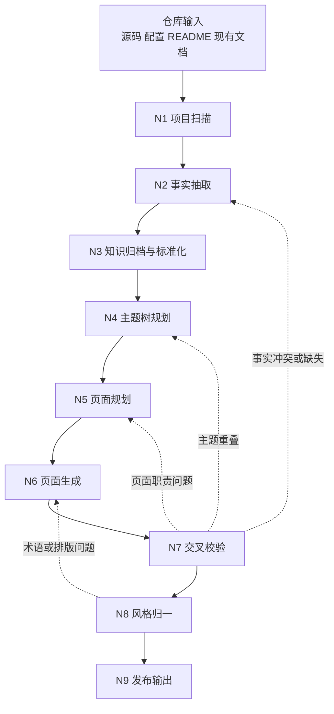
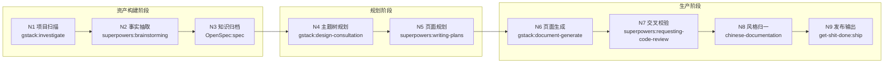

# AI 自动化文档生成 Pipeline

> 本文档从 `@.qoder/repowiki/zh/content` 的既有知识库产物出发，逆向抽象出一条面向 AI Agent 自动执行的通用文档生成 Pipeline。
> 目标不是解释单篇文档如何写，而是说明如何从仓库事实稳定生成一整套主题化、分层化、可追溯的技术文档树。

---

## 目录

- [1. 目标与逆向范围](#1-目标与逆向范围)
- [2. 现有文档树分析](#2-现有文档树分析)
- [3. 通用 Pipeline 总览](#3-通用-pipeline-总览)
- [4. 节点设计 N1-N9](#4-节点设计-n1-n9)
- [5. Skills 编排方案](#5-skills-编排方案)
- [6. 质量控制标准](#6-质量控制标准)
- [7. 可复用框架](#7-可复用框架)
- [8. 执行建议](#8-执行建议)
- [9. 附录](#9-附录)

---

## 1. 目标与逆向范围

### 1.1 目标

本 Pipeline 回答一个底层问题：**如何从当前工程自动生成类似 `@.qoder/repowiki/zh/content` 这样的完整文档树**，而非若干孤立页面。

具体目标：

- 逆向分析既有文档树的目录结构与内容组织规律
- 抽象出完整文档树生成所需的关键节点、输入输出和依赖关系
- 为每个节点提供可直接复用的**提示词模板**和**Skill 调用链**
- 定义可回流的质量控制机制
- 形成可迁移到其他工程的通用框架

### 1.2 逆向依据

本 Pipeline 基于对 `@.qoder/repowiki/zh/content`（约 159 篇文档、10 大知识域）的逆向分析。关键发现：

- 顶层目录按**主题域**组织，而非源码目录镜像
- 页面呈"总览页 + 聚合页 + 叶子页"递归结构
- 大量页面共享稳定章节骨架（`<cite>` → 目录 → 简介 → 项目结构 → 核心组件 → …）
- 内容普遍带有来源追溯（引用文件、图表来源、章节来源）

### 1.3 适用边界

- 适用于已有源码、配置、README、设计文档或现有知识库产物的工程
- 适用于批量生成文档树，而非仅生成单页说明
- 不直接涵盖工作流引擎实现或 Agent 调度器实现

---

## 2. 现有文档树分析

### 2.1 目录分层规律

`@.qoder/repowiki/zh/content` 的顶层按知识域划分，而非源码目录映射：

| 知识域 | 文档数 | 说明 |
|--------|--------|------|
| 项目概述 | ~6 | 项目简介、快速开始、核心概念 |
| 架构设计 | ~25 | 整体架构、模块化设计、数据流、安全架构 |
| 核心模块 | ~39 | 图谱管理、本体、搜索、实体/关系管理 |
| API 接口文档 | ~18 | 各接口组（系统管理、知识图谱、数据导入） |
| 开发指南 | ~10 | 代码规范、测试策略、环境搭建 |
| 数据库设计 | ~8 | 关系数据库、图数据库、数据访问层 |
| AI 集成 | ~6 | AI 提供商、向量嵌入、实体关系抽取 |
| 前端应用 | ~8 | Vue 架构、组件设计、路由导航 |
| 最佳实践 | ~7 | 性能优化、安全合规、代码质量 |
| 故障排查 | ~6 | 常见问题、数据库故障、性能诊断 |

**核心结论**：生成逻辑是"一个知识域消费一组事实资产，再按读者视角组织页面树"。

### 2.2 页面类型规律

| 类型 | 职责 | 典型示例 |
|------|------|----------|
| **总览页** | 定义主题范围、摘要、导航入口 | `架构设计.md`、`核心模块.md` |
| **聚合页** | 对下级主题做拆分归类和导航 | `模块化设计.md`、`数据流设计.md` |
| **叶子页** | 解释单一模块/接口组/专题 | `搜索引擎.md`、`实体去重.md` |

### 2.3 页面骨架规律

抽样显示大量页面共享固定章节序列：

```
标题 → <cite>引用文件清单 → 目录 → 简介 → 项目结构 → 核心组件
→ 架构总览 → 详细组件分析 → 依赖分析 → 性能考虑
→ 故障排查指南 → 结论 → 附录
```

这说明页面并非自由写作，而是由"页面类型 + 主题职责 + 事实资产"驱动的模板化渲染。

### 2.4 逆向结论

稳定复现这类文档树的合理抽象不是"一页一提示词"，而是**知识资产流驱动的 Pipeline**：

1. 先扫描仓库并抽取结构化事实
2. 再对事实做标准化和主题归档
3. 再规划主题树和页面职责
4. 最后批量生成页面、交叉校验并归一输出

---

## 3. 通用 Pipeline 总览

### 3.1 设计思路

采用"知识资产层驱动页面层"的设计。将仓库中的源码、配置、README、现有文档先转成可复用的事实资产，再由事实资产驱动主题树规划、页面规划和最终页面生成。

原因：

- 避免页面生成阶段自由发挥，降低事实漂移
- 不同页面可安全复用同一组事实，以不同粒度表达
- 质检节点能定位问题发生在事实层、规划层还是页面层

### 3.2 总体流程图



### 3.3 核心原则

- **事实先行**：页面只消费已归档的事实资产，不直接回读整仓库自由生成
- **规划前置**：先有目录树和页面 brief，再进入正文生成
- **分层渲染**：总览页、聚合页、叶子页采用不同粒度和模板
- **可追溯**：章节和图表保留来源映射
- **可回流**：质检发现问题后，必须能退回上游节点重做

### 3.4 Skills 编排架构

每个节点由特定 Skill 驱动，Skill 间通过中间产物传递数据：



---

## 4. 节点设计 N1-N9

### 4.1 N1 项目扫描

| 项目 | 内容 |
|------|------|
| **目标** | 建立仓库资产清单，识别可抽取区域和高优先级分析对象 |
| **驱动 Skill** | `gstack:investigate` — 系统化扫描仓库结构 |
| **输入** | 仓库根目录、忽略规则（`target`、`node_modules`、二进制产物） |
| **操作** | 扫描源码/配置/SQL/脚本/README/设计文档/现有 docs；识别模块边界、技术栈、前后端区域、数据库区域和部署区域；输出候选文件清单 |
| **输出** | `repo_inventory.json`、`module_map.json`、`source_priority_list.json` |
| **依赖** | 无 |
| **回流条件** | 后续节点发现遗漏模块或遗漏知识域时返回重新扫描 |

**提示词模板：**

```text
/investigate
你是仓库资产扫描器。

任务：
扫描当前仓库，建立完整的资产清单和模块边界地图。

要求：
1. 扫描范围包括：源码目录、配置目录、SQL 脚本、构建脚本、README、设计文档和现有 docs 目录。
2. 必须识别：技术栈（语言、框架、构建工具）、模块边界（Maven 模块/npm 包）、前后端区域、数据库区域、部署区域。
3. 输出字段：
   - repo_inventory：包含 path、type（source/config/sql/doc/script）、language、line_count
   - module_map：包含 module_name、root_path、responsibility、dependencies、tech_stack
   - source_priority_list：按抽取优先级排序的文件列表
4. 忽略 target/、node_modules/、.git/、dist/ 等非源码目录。
5. 输出  JSON 到文件 manual/graph.json，不附加解释性文字。

自检：
- 是否覆盖了所有顶层目录？
- 是否遗漏了 SQL 或配置文件？
- 模块依赖关系是否完整？
```

**质量门禁：**

- 模块覆盖率 = 100%（无遗漏顶层目录）
- 每个模块必须有 `responsibility` 和 `dependencies` 字段
- 文件清单不为空

---

### 4.2 N2 事实抽取

| 项目 | 内容 |
|------|------|
| **目标** | 将非结构化仓库内容转成结构化事实资产 |
| **驱动 Skill** | `superpowers:brainstorming` — 深度分析源码，结构化抽取事实 |
| **输入** | `repo_inventory.json`、`module_map.json`、源码/配置/README/现有文档 |
| **操作** | 抽取模块职责、接口路由、核心服务、数据流、配置项、运行方式、依赖关系、数据库对象、运维组件；为每条事实记录来源文件/片段/事实类型/置信度/主题候选；区分"硬事实"和"推断事实" |
| **输出** | `fact_catalog.json`、`api_fact_sheet.json`、`module_fact_sheet.json`、`dataflow_fact_sheet.json`、`ops_fact_sheet.json` |
| **依赖** | N1 项目扫描 |
| **回流条件** | 质检发现事实冲突、事实缺口或错误归因时返回重抽 |

**提示词模板：**

```text
/brainstorming
你是仓库事实抽取器。

任务：
参考 manual/graph.json 中 repo_inventory、module_map，从提供的源码、配置、README 和现有文档片段中抽取可用于技术文档生成的结构化事实。

要求：
1. 只提取有明确依据的事实，不得补充未经证实的信息。
2. 每条事实必须包含：
   - fact_id：唯一标识
   - fact_type：枚举（module/api/dataflow/config/dependency/runtime/database/ops）
   - summary：一句话事实摘要
   - evidence_files：来源文件数组
   - evidence_excerpt：来源代码或文本片段
   - confidence：high/medium/low
   - topic_candidates：可归属的知识域候选数组
   - is_inferred：是否为推断事实
3. 若信息不足，标记 needs_inference=true，不得编造。
4. 相同事实可合并，但必须保留来源数组。
5. 输出 JSON 数组 到文件 manual/facts.json，不附加解释性文字。

自检：
- 每条事实是否都有 evidence_files？
- confidence=low 的事实是否标记了 needs_inference？
- 是否覆盖了所有模块的核心职责？
```

**质量门禁：**

- 每条事实必须有 `evidence_files`，非空
- `confidence` 字段不为空
- 模块事实覆盖率 ≥ 95%

---

### 4.3 N3 知识归档与标准化

| 项目 | 内容 |
|------|------|
| **目标** | 去重事实、统一术语、建立可复用知识资产层 |
| **驱动 Skill** | `OpenSpec:spec` — 规范化术语，建立知识资产规范 |
| **输入** | `fact_catalog.json`、事实子表 |
| **操作** | 去重同义事实和重复表述；标准化模块名/服务名/接口组名/目录名/术语；建立术语表、别名表和可复用摘要池 |
| **输出** | `normalized_fact_base.json`、`term_glossary.json`、`entity_alias_map.json`、`reusable_summary_bank.json` |
| **依赖** | N2 事实抽取 |
| **回流条件** | 发现命名冲突、术语混乱或重复摘要时返回处理 |

**提示词模板：**

```text
/spec
你是知识资产管理员。

任务：
根据 manual/facts.json 中的事实资产，对原始事实资产进行去重、标准化和归档，建立可复用的知识资产底座。

要求：
1. 去重规则：
   - 同一事实被多个来源证实的，合并为一条，保留所有来源
   - 同义不同表述的，统一为主名，保留别名词典
2. 标准化规则：
   - 模块名统一为 pom.xml/package.json 中的正式名称
   - 接口组名统一为 Controller 类名去掉后缀
   - 目录名统一为实际路径
3. 输出字段：
   - normalized_fact_base：fact_id、canonical_name、fact_type、summary、evidence、related_facts
   - term_glossary：term、canonical_form、aliases、definition、source
   - entity_alias_map：alias → canonical 映射
   - reusable_summary_bank：fact_id、summary（不同粒度的摘要）
4. 输出 JSON 到文件 manual/normalized_fact_base.json、manual/term_glossary.json、manual/entity_alias_map.json、manual/reusable_summary_bank.json，不附加解释性文字。

自检：
- 是否存在同一模块有两个不同名称的情况？
- 术语表是否覆盖了所有专有名词？
- 是否存在孤立事实（无关联的其他事实）？
```

**质量门禁：**

- 术语表无重复主名
- 所有别名已收敛到主名
- 标准化事实库无 `canonical_name` 为空的记录

---

### 4.4 N4 主题树规划

| 项目 | 内容 |
|------|------|
| **目标** | 将事实资产映射为最终文档树 |
| **驱动 Skill** | `gstack:design-consultation` + `superpowers:writing-plans` — 信息架构规划 |
| **输入** | `normalized_fact_base.json`、`term_glossary.json`、已有知识域偏好或现有文档树样例 |
| **操作** | 划分顶层知识域；为每个知识域设计父子层级；区分总览页/聚合页/叶子页；约束页面职责边界 |
| **输出** | `doc_tree.yaml`、`topic_responsibility_matrix.json` |
| **依赖** | N3 知识归档与标准化 |
| **回流条件** | 页面间职责冲突严重、主题遗漏或目录层级不合理时返回重规划 |

**提示词模板：**

```text
/design-consultation /writing-plans
你是知识库信息架构规划师。

任务：
基于 manual/normalized_fact_base.json、manual/term_glossary.json、已有知识域偏好或现有文档树样例 标准化事实资产，为当前仓库规划一套中文知识库目录树。

要求：
1. 采用主题树，而不是源码目录镜像。
2. 顶层至少覆盖：项目概述、架构设计、核心模块、API 接口文档、开发指南、数据库设计、部署运维。
3. 每个主题节点必须包含：
   - title：主题标题
   - level：层级深度（1-4）
   - page_type：overview / aggregate / leaf
   - responsibility：一句话职责描述
   - parent：父节点 ID
   - children：子节点 ID 数组
   - required_facts：本主题需引用的 fact_id 数组
4. 避免主题职责重叠。
5. 总览页不超过每知识域 1 个，聚合页不超过 3 个。
6. 输出 YAML 到文件 manual/doc_tree.yaml, manual/topic_responsibility_matrix.json，不附加解释性文字。

自检：
- 是否每个 fact_id 都至少被一个主题引用？
- 是否存在两个主题职责描述高度相似？
- 层级深度是否超过 4 层？
```

**质量门禁：**

- 无孤立主题节点（每个节点至少被引用一次）
- 页面类型分布合理（总览页 ≤ 知识域数，聚合页 ≤ 3/域）
- 层级深度 ≤ 4

---

### 4.5 N5 页面规划

| 项目 | 内容 |
|------|------|
| **目标** | 为每个页面生成可执行的页面 brief |
| **驱动 Skill** | `superpowers:writing-plans` — 为每页生成执行计划 |
| **输入** | `doc_tree.yaml`、`topic_responsibility_matrix.json`、`normalized_fact_base.json` |
| **操作** | 定义每页标题/类型/读者/章节骨架/引用事实/建议图表；标记上下游和禁止重叠主题；生成页面依赖图 |
| **输出** | `page_briefs/<slug>.json`、`page_dependency_map.json` |
| **依赖** | N4 主题树规划 |
| **回流条件** | 页面职责过重、章节骨架与页面类型不匹配时返回重规划 |

**提示词模板：**

```text
/writing-plans
你是页面规划器。

任务：
根据manual/doc_tree.yaml, manual/topic_responsibility_matrix.json, manual/normalized_fact_base.json 为指定主题节点生成页面 brief，供后续 AI 批量写作使用。

要求：
1. 输出字段必须包含：
   - page_title：页面标题
   - page_type：overview / aggregate / leaf
   - audience：目标读者
   - summary_goal：页面要传达的核心信息
   - required_sections：章节骨架数组（与页面类型匹配）
   - required_facts：引用的 fact_id 数组（必须引用事实资产 ID）
   - optional_diagrams：建议的 Mermaid 图表类型
   - forbidden_overlap：禁止重叠的主题列表
   - upstream_pages：上游页面
   - downstream_pages：下游页面
2. 页面类型与章节骨架对应关系：
   - overview：简介 → 范围定义 → 子主题导航 → 关键概念
   - aggregate：简介 → 子主题概览 → 归类逻辑 → 导航入口
   - leaf：简介 → 项目结构 → 核心组件 → 详细分析 → 依赖分析 → 故障排查 → 结论
3. required_facts 必须引用事实资产 ID，不用自由文本。
4. 输出 JSON 到文件 manual/page_briefs/<slug>.json, manual/page_dependency_map.json，不附加解释性文字。

自检：
- 每个 brief 是否都有 required_facts？
- leaf 页是否都有"详细分析"章节？
- 是否存在两个 brief 的 required_facts 高度重叠？
```

**质量门禁：**

- 每个 brief 有 `required_facts` 引用，非空
- 章节骨架与页面类型匹配
- 无循环依赖

---

### 4.6 N6 页面生成

| 项目 | 内容 |
|------|------|
| **目标** | 基于页面 brief 和事实资产生成 Markdown 页面 |
| **驱动 Skill** | `gstack:document-generate` — 基于 brief 批量生成文档 |
| **输入** | `page_briefs/<slug>.json`、`normalized_fact_base.json`、`reusable_summary_bank.json` |
| **操作** | 按页面类型选择生成模板；生成标题/目录/正文/图表/引用文件清单/图表来源/章节来源；事实不足时标记"待补事实"而非虚构 |
| **输出** | `draft_docs/**/*.md` |
| **依赖** | N5 页面规划 |
| **回流条件** | 页面内容与 brief 不一致或事实支撑不足时返回修正 |

**提示词模板：**

```text
/document-generate
你是技术文档作者。

任务：
根据manual/page_briefs/<slug>.json和manual/normalized_fact_base.json，
根据每个页面 brief 和已提供的事实资产，批量生成中文 Markdown 技术文档。

要求：
1. 只能使用输入中的事实，不得自行补充未证实的信息。
2. 文档结构必须包含：
   - 标题（# 级）
   - <cite>引用文件清单（从 evidence_files 提取）
   - 目录
   - brief 中 required_sections 指定的所有章节
   - 图表来源（若有 Mermaid 图表）
   - 章节来源（每个主要章节标注来源 fact_id）
3. 若事实不足以支撑某章节，明确输出"待补事实：[需要的信息]"，不得虚构。
4. 文风要求专业、克制、结构清晰，避免冗余句和空话。
5. Mermaid 图表仅使用基础语法，不加样式。
6. 输出 Markdown 正文 到文件 manual/draft_docs/<brief>.md，不附加解释性前言。

自检：
- 是否所有章节都已生成？
- <cite> 区域是否包含了所有 evidence_files？
- 是否存在"待补事实"标记超过 3 处？（超过则说明事实抽取不足）
- 图表是否都有图表来源？
```

**质量门禁：**

- 页面章节与 brief 的 `required_sections` 完全匹配
- "待补事实"标记 ≤ 3 处/页
- 每页至少有 1 个 `<cite>` 引用

---

### 4.7 N7 交叉校验

| 项目 | 内容 |
|------|------|
| **目标** | 从全局维度检查一致性、覆盖度和追溯性 |
| **驱动 Skill** | `superpowers:requesting-code-review` + `gstack:qa-only` — 全局一致性审查 |
| **输入** | `draft_docs/**/*.md`、`normalized_fact_base.json`、`doc_tree.yaml` |
| **操作** | 检查事实冲突/重复内容/孤儿页面/死链/缺失来源/缺失主题/职责越界；将问题路由回具体节点 |
| **输出** | `qa_report.json`、`coverage_report.json`、`link_check_report.json` |
| **依赖** | N6 页面生成 |
| **回流条件** | 事实问题→N2/N3，目录问题→N4，页面结构问题→N5/N6 |

**提示词模板：**

```text
/requesting-code-review /qa-only
你是知识库质检员。

任务：
根据manual/draft_docs/**/*.md、manual/normalized_fact_base.json、manual/doc_tree.yaml，
对整批 Markdown 文档做一致性、覆盖度和可追溯性检查。

要求：
1. 检查项必须包括：
   - 事实冲突：同一事实在不同页面表述矛盾
   - 页面职责冲突：两个页面覆盖相同主题
   - 重复内容：大段相似文本
   - 孤儿页面：不在 doc_tree 中的页面
   - 死链：引用了不存在的页面或文件
   - 缺失来源：图表无来源标注
   - 缺失主题：doc_tree 中有规划但无对应页面
2. 每个问题必须包含：
   - issue_id、severity（critical/major/minor）
   - page、problem_type、description
   - suggested_backtrack_node：建议回流的节点（N2-N6）
3. 输出 JSON 到文件 manual/qa_report.json, manual/coverage_report.json, manual/link_check_report.json，不附加解释性文字。
4. 不要直接修改文档，只输出问题清单和建议回流节点。

自检：
- 是否检查了所有页面？
- critical 问题是否都标注了回流节点？
- 覆盖度报告是否统计了 doc_tree 中每个节点的完成状态？
```

**质量门禁：**

- critical 问题数 = 0
- 覆盖度 ≥ 95%（doc_tree 中的节点都有对应页面）
- 无孤儿页面

---

### 4.8 N8 风格归一

| 项目 | 内容 |
|------|------|
| **目标** | 统一文风、排版、术语和图表表现 |
| **驱动 Skill** | `gstack:chinese-documentation` — 中文技术文档排版规范 |
| **输入** | `draft_docs/**/*.md`、`term_glossary.json`、`qa_report.json` |
| **操作** | 统一标题层级/章节顺序/术语用法/图表命名/来源标注；修正 AI 常见噪音（冗余句、重复句、术语不一致、排版问题） |
| **输出** | `normalized_docs/**/*.md` |
| **依赖** | N7 交叉校验 |
| **回流条件** | 风格归一过程中发现事实问题或结构问题时，回流到相应节点 |

**提示词模板：**

```text
/chinese-documentation
你是中文技术文档排版师。

任务：
根据manual/draft_docs/**/*.md、manual/term_glossary.json、manual/qa_report.json，

对批量生成的 Markdown 文档执行风格归一化，确保全库文风、排版和术语一致。

要求：
1. 排版规范（参照中文技术文档排版标准）：
   - 中英文之间加空格（如"使用 Vue 3 构建"）
   - 全角标点用于中文语境，半角标点用于代码和英文
   - 专有名词保持原始大小写（如 Neo4j、PostgreSQL）
2. 术语规范：
   - 按 term_glossary.json 统一术语用法
   - 将别名词典中的别名替换为主名
3. 结构规范：
   - 标题层级从 # 开始，不跳级
   - 章节顺序与同类型页面保持一致
   - <cite> 格式统一
4. 清理 AI 噪音：
   - 删除"总而言之"、"综上所述"等冗余总结句
   - 删除"本文将详细介绍"等无信息量前言
   - 修正重复段落
5. 直接修改文档，输出归一化后的完整 Markdown 到文件 manual/normalized_docs/<brief>.md，不附加解释性前言。

自检：
- 中英文间距是否统一？
- 术语是否与术语表一致？
- 是否清除了所有冗余句？
```

**质量门禁：**

- 术语一致性通过率 = 100%（所有术语与 `term_glossary.json` 一致）
- 中英文间距规范通过
- 无 AI 噪音句

---

### 4.9 N9 发布输出

| 项目 | 内容 |
|------|------|
| **目标** | 将归一化结果写入目标知识库目录并生成交付摘要 |
| **驱动 Skill** | `get-shit-done:ship` — 最终交付和变更摘要 |
| **输入** | `normalized_docs/**/*.md`、`doc_tree.yaml`、`coverage_report.json` |
| **操作** | 按目录树写入最终 content 目录；输出缺口清单/抽检建议/变更摘要/人工复核建议；形成可提交或继续审校的交付包 |
| **输出** | `content/**/*.md`、`generation_summary.md`、`manual_review_checklist.md` |
| **依赖** | N8 风格归一 |

**提示词模板：**

```text
/ship   
你是文档发布管理员。

任务：
根据manual/normalized_docs/**/*.md、manual/doc_tree.yaml、manual/coverage_report.json，

将归一化文档写入目标目录，并生成交付摘要和人工复核清单。

要求：
1. 写入规则：
   - 按 doc_tree.yaml 的层级结构创建目录和文件
   - 文件名使用 slug 化后的标题（中文保留、空格替换为连字符）
   - 确保每个文件都在 doc_tree 中有对应节点
2. 交付摘要（generation_summary.md）必须包含：
   - 生成时间
   - 总页面数和按知识域分布
   - 事实覆盖率
   - "待补事实"清单
   - 与上一版本的变更差异（若有）
3. 人工复核清单（manual_review_checklist.md）必须包含：
   - 建议优先复核的页面（总览页和高引用页面）
   - "待补事实"对应的待验证信息
   - 质检中发现但未自动修复的问题
4. 输出 Markdown 到文件 manual/content/**/*.md，不附加解释性前言。

自检：
- 写入的文件数是否与 doc_tree 节点数匹配？
- 是否存在孤儿文件？
- 交付摘要是否覆盖了所有统计项？
```

**质量门禁：**

- 写入文件数 = doc_tree 节点数
- 无孤儿文件
- `generation_summary.md` 和 `manual_review_checklist.md` 已生成

---

## 5. Skills 编排方案

### 5.1 Skills → 节点映射总表

| 节点 | 驱动 Skill | Skill 角色 | 说明 |
|------|-----------|-----------|------|
| N1 | `gstack:investigate` | 仓库扫描器 | 系统化扫描仓库结构，输出模块地图 |
| N2 | `superpowers:brainstorming` | 事实抽取器 | 深度分析源码，结构化抽取事实 |
| N3 | `OpenSpec:spec` | 知识资产管理员 | 规范化术语，建立知识资产规范 |
| N4 | `gstack:design-consultation` + `superpowers:writing-plans` | 信息架构规划师 | 规划文档树结构和页面职责 |
| N5 | `superpowers:writing-plans` | 页面规划器 | 为每页生成执行 brief |
| N6 | `gstack:document-generate` | 技术文档作者 | 基于 brief 批量生成 Markdown |
| N7 | `superpowers:requesting-code-review` + `gstack:qa-only` | 质检员 | 全局一致性和覆盖度检查 |
| N8 | `gstack:chinese-documentation` | 排版师 | 统一中文排版和术语 |
| N9 | `get-shit-done:ship` | 发布管理员 | 最终交付和变更摘要 |

### 5.2 全局编排策略

采用 `get-shit-done` 作为顶层编排器，分 3 个阶段执行：

```
阶段 1：资产构建（N1-N3）
├── 执行 N1 → 质量门禁检查
├── 执行 N2 → 质量门禁检查（按模块分批）
└── 执行 N3 → 质量门禁检查

阶段 2：规划与生成（N4-N6）
├── 执行 N4 → 质量门禁检查（人工审查 doc_tree）
├── 执行 N5 → 质量门禁检查
└── 执行 N6 → 质量门禁检查（按页面类型分批：先总览页，再聚合页，最后叶子页）

阶段 3：收敛与发布（N7-N9）
├── 执行 N7 → 质量门禁检查 → 如有 critical 问题则回流
├── 执行 N8 → 质量门禁检查
└── 执行 N9 → 生成交付包
```

### 5.3 分批执行计划

N6 页面生成是最耗时的节点，建议按以下顺序分批执行：

1. **第 1 批**：所有总览页（~10 篇）— 确立各知识域的框架
2. **第 2 批**：所有聚合页（~15 篇）— 填充子主题导航
3. **第 3 批**：叶子页按知识域分批（每批 10-20 篇）
4. 每批完成后执行一次轻量级 N7 检查

### 5.4 回流与重试策略

| 问题类型 | 回流目标 | 触发条件 |
|---------|---------|---------|
| 事实错误/缺失 | N2/N3 | N7 发现 critical 事实冲突 |
| 主题树不合理 | N4 | N7 发现大面积主题重叠或遗漏 |
| 页面职责不清 | N5 | N7 发现页面间职责交叉 |
| 页面内容偏差 | N6 | N7 发现内容与 brief 不一致 |
| 术语/排版问题 | N8 | N8 自检发现大量术语不一致 |

回流时只重做受影响的子集，不全量重做。

### 5.5 增量更新模式

对于已有知识库的持续更新：

1. 只扫描变更文件及受影响知识域（N1 局部扫描）
2. 只重建受影响页面的事实和 brief（N2-N5 局部执行）
3. 保持未受影响页面不重生成
4. 仍执行一次轻量级 N7 链接和覆盖检查

---

## 6. 质量控制标准

### 6.1 事实准确性

- 页面中的关键结论必须能映射到事实资产（fact_id）
- 不允许无依据的架构推断、接口说明或配置描述
- 发现事实冲突时必须进入质检报告，不自行拍板覆盖

### 6.2 结构完整性

- 文档树必须覆盖项目的主要知识域
- 总览页/聚合页/叶子页的职责边界必须清晰
- 页面章节必须与其页面类型匹配

### 6.3 内容可读性

- 摘要准确、克制，不堆砌空话
- 同一事实在不同页面复用时允许粒度不同，但不得语义冲突
- 图表必须服务理解，不为凑图而生成

### 6.4 可追溯性

- 图表带有图表来源
- 核心章节带有章节来源（fact_id）
- 页面至少能回溯到一组有效来源文件

### 6.5 术语一致性

- 模块名、服务名、目录名、接口组名前后一致
- 中英文混排、数字和专有名词写法统一
- 别名通过术语表收敛为主名

### 6.6 发布前检查项

- [ ] 无未覆盖主题
- [ ] 无孤儿页面
- [ ] 无死链
- [ ] 无缺失来源的图表
- [ ] 无页面职责交叉污染
- [ ] 无大段重复内容
- [ ] 术语一致性通过
- [ ] 排版规范通过

---

## 7. 可复用框架

### 7.1 适配其他仓库的前提条件

- 仓库中存在可抽取的源码、配置、README、设计文档或脚本
- 可以识别出相对稳定的模块边界和知识域
- 允许引入结构化中间产物，而不是一步直出最终 Markdown

### 7.2 可配置项

| 配置项 | 说明 | 默认值 |
|--------|------|--------|
| `knowledge_domains` | 顶层知识域集合 | 项目概述/架构设计/核心模块/API/开发指南/数据库/部署运维 |
| `page_templates` | 不同页面类型的章节模板 | 总览/聚合/叶子三套 |
| `fact_types` | 允许抽取的事实类型 | module/api/dataflow/config/dependency/runtime/database/ops |
| `diagram_policies` | 图表生成策略 | 仅叶子页生成 Mermaid 图表 |
| `quality_thresholds` | 质检通过阈值 | critical=0, coverage≥95% |
| `output_language` | 输出语言 | zh-CN |
| `link_policy` | 来源链接策略 | `<cite>` + 章节来源 |

### 7.3 中间产物清单

| 产物 | 生成节点 | 用途 |
|------|----------|------|
| `repo_inventory.json` | N1 | 仓库资产清单 |
| `module_map.json` | N1 | 模块边界映射 |
| `fact_catalog.json` | N2 | 原始事实池 |
| `api_fact_sheet.json` | N2 | API 事实子集 |
| `module_fact_sheet.json` | N2 | 模块事实子集 |
| `normalized_fact_base.json` | N3 | 标准化事实底座 |
| `term_glossary.json` | N3 | 术语统一表 |
| `entity_alias_map.json` | N3 | 别名映射 |
| `reusable_summary_bank.json` | N3 | 可复用摘要池 |
| `doc_tree.yaml` | N4 | 文档树规划 |
| `topic_responsibility_matrix.json` | N4 | 主题职责矩阵 |
| `page_briefs/*.json` | N5 | 页面级执行说明 |
| `page_dependency_map.json` | N5 | 页面依赖关系 |
| `draft_docs/**/*.md` | N6 | 页面初稿 |
| `qa_report.json` | N7 | 质检问题清单 |
| `coverage_report.json` | N7 | 覆盖度报告 |
| `link_check_report.json` | N7 | 链接检查报告 |
| `normalized_docs/**/*.md` | N8 | 归一化成品 |
| `generation_summary.md` | N9 | 发布摘要 |
| `manual_review_checklist.md` | N9 | 人工复核清单 |

### 7.4 数据流规则

- 页面只消费标准化事实，不直接消费未处理的原始仓库文本
- 主题树只消费知识资产层，不直接依据某一个源码目录即席生成
- 页面生成必须依赖页面 brief，避免页面职责漂移
- 质检结果必须能定位回具体节点，否则无法形成有效回流
- 交付产物必须保留对来源文件的映射能力

---

## 8. 执行建议

### 8.1 推荐执行顺序

1. **N1-N3**：先建立稳定事实资产（建议预留充足时间做 N2 深度抽取）
2. **N4-N5**：再规划目录树和页面职责（N4 建议人工审查 doc_tree 后再继续）
3. **N6**：按总览页→聚合页→叶子页顺序批量生成
4. **N7-N8**：做全局收敛（N7 如 critical > 0 则必须先回流修复）
5. **N9**：统一发布输出

### 8.2 全量生成建议

- 首次生成时不要直接并发所有页面
- 先完成主题树和页面 brief，再按页面类型分批生成
- 优先生成总览页和聚合页，再生成叶子页，以减少主题漂移

### 8.3 增量更新建议

- 先识别受影响的事实资产和知识域
- 若只是单点改动，避免重建整个文档树
- 仍执行至少一次链接检查和主题覆盖检查

### 8.4 失败回流策略

| 问题类型 | 回流节点 |
|---------|---------|
| 事实错误 | N2/N3 |
| 主题树不合理 | N4 |
| 页面职责不清或缺章节 | N5 |
| 文风、排版、术语问题 | N8 或重新生成 N6 |

### 8.5 人工抽检建议

即使 Pipeline 以 AI 自动执行为主，最终仍建议做小比例人工抽检，重点：

- 顶层总览页是否准确概括了主题域
- 多页面复用的关键事实是否一致
- 图表是否与正文匹配
- 章节来源和图表来源是否可追溯

---

## 9. 附录

### 9.1 目标交付物清单

- 一套按知识域组织的中文文档树（`content/**/*.md`）
- 一套中间资产（事实清单、主题树、页面 brief、质检报告）
- 一份发布摘要（`generation_summary.md`）和人工复核清单（`manual_review_checklist.md`）

### 9.2 本文档的推荐用法

- 为现有工程构建首版仓库知识库
- 为持续演进的工程建立文档自动更新流水线
- 为多 Agent 或工作流引擎定义节点职责和提示词模板
- 为人工审校提供统一的质量标准和回流路径

### 9.3 相关文档

- 现有文档树产物：`@.qoder/repowiki/zh/content`
- 设计规格文档：`docs/superpowers/specs/2026-06-18-docs-pipeline-design.md`
- 场景文档目录：`docs/scene/`
