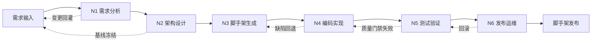

# 基线脚手架与自动化 Pipeline

> 本文档定义一套**通用、可复用**的"基线脚手架 + 自动化 Pipeline",覆盖从需求分析到脚手架发布的全流程。
> 文档不绑定具体业务场景,可作为任意全栈项目(Vue/React + Java/Node + DB + Docker + CI/CD)的开箱脚手架。
> 文中 6 个节点(N1-N6)分别对应需求、架构、生成、实现、验证、发布 6 个阶段,每个节点都给出**职责、操作步骤、提示词模板、输入/输出契约**。

---

## 目录

- [1. 总体设计](#1-总体设计)
  - [1.1 设计目标](#11-设计目标)
  - [1.2 Pipeline 节点总览](#12-pipeline-节点总览)
  - [1.3 节点依赖与执行顺序](#13-节点依赖与执行顺序)
  - [1.4 与已有 Skills 的映射](#14-与已有-skills-的映射)
- [2. N1 — 需求分析节点](#2-n1--需求分析节点)
  - [2.1 节点职责](#21-节点职责)
  - [2.2 操作步骤](#22-操作步骤)
  - [2.3 提示词模板](#23-提示词模板)
  - [2.4 输入 / 输出契约](#24-输入--输出契约)
- [3. N2 — 架构设计节点](#3-n2--架构设计节点)
  - [3.1 节点职责](#31-节点职责)
  - [3.2 操作步骤](#32-操作步骤)
  - [3.3 提示词模板](#33-提示词模板)
  - [3.4 输入 / 输出契约](#34-输入--输出契约)
- [4. N3 — 基线脚手架生成节点](#4-n3--基线脚手架生成节点)
  - [4.1 节点职责](#41-节点职责)
  - [4.2 操作步骤](#42-操作步骤)
  - [4.3 提示词模板](#43-提示词模板)
  - [4.4 输入 / 输出契约](#44-输入--输出契约)
  - [4.5 基线脚手架目录模板](#45-基线脚手架目录模板)
- [5. N4 — 代码实现与质量节点](#5-n4--代码实现与质量节点)
  - [5.1 节点职责](#51-节点职责)
  - [5.2 操作步骤](#52-操作步骤)
  - [5.3 提示词模板](#53-提示词模板)
  - [5.4 输入 / 输出契约](#54-输入--输出契约)
- [6. N5 — 测试与验证节点](#6-n5--测试与验证节点)
  - [6.1 节点职责](#61-节点职责)
  - [6.2 操作步骤](#62-操作步骤)
  - [6.3 提示词模板](#63-提示词模板)
  - [6.4 输入 / 输出契约](#64-输入--输出契约)
- [7. N6 — 发布与运维节点](#7-n6--发布与运维节点)
  - [7.1 节点职责](#71-节点职责)
  - [7.2 操作步骤](#72-操作步骤)
  - [7.3 提示词模板](#73-提示词模板)
  - [7.4 输入 / 输出契约](#74-输入--输出契约)
- [8. 节点间输入输出矩阵](#8-节点间输入输出矩阵)
- [9. Pipeline 编排与触发](#9-pipeline-编排与触发)
- [10. 附录](#10-附录)
  - [10.1 基线技术栈默认值](#101-基线技术栈默认值)
  - [10.2 文档版本](#102-文档版本)

---

## 1. 总体设计

### 1.1 设计目标

| # | 目标 | 验收标准 |
|---|------|----------|
| G1 | 自动化生成项目基础结构 | 一次命令即可产出含前后端 + DB + Docker + CI 的可运行脚手架 |
| G2 | 集成代码质量检查工具 | ESLint/Checkstyle/Spotless 在 N4 中强制运行,违规即阻塞 |
| G3 | 配置开发环境与依赖管理 | 提供 `.env.example`、`docker-compose.yml`、锁文件(pnpm-lock/lockfile) |
| G4 | 设置测试框架与覆盖率检查 | 单元/集成/E2E 三层覆盖,门槛 ≥ 80%,CI 报告可见 |
| G5 | 配置 CI/CD 流水线 | 提供 GitHub Actions / GitLab CI / Jenkins 模板(任选其一) |
| G6 | 生成项目文档模板 | 产出 README、CHANGELOG、ARCHITECTURE、API 文档骨架 |
| G7 | 强制代码规范与最佳实践 | 通过 pre-commit + CI 双层校验,违规率 < 1% |

### 1.2 Pipeline 节点总览



| 节点 | 名称 | 核心目标 | 主用 Skill | 副用 Skill |
|------|------|----------|------------|------------|
| **N1** | 需求分析 | 产出 OpenSpec 变更提案与功能规约 | OpenSpec | Superpowers(头脑风暴) |
| **N2** | 架构设计 | 选型、技术栈冻结、ADR 落盘 | gstack(cso/design-consultation) | GSD(map-codebase)、awesome-design-md |
| **N3** | 脚手架生成 | 一次性生成完整项目骨架与配置 | GSD(new-project) | OpenSpec |
| **N4** | 编码实现 | TDD + 静态检查 + 模块化产出 | Superpowers(TDD) | GSD(execute-phase) |
| **N5** | 测试验证 | 单元/集成/E2E + 质量门禁 | gstack(/qa) | Superpowers(test-driven-development) |
| **N6** | 发布运维 | 容器化、CI/CD、文档、版本发布 | GSD(ship) | gstack(document-release) |

### 1.3 节点依赖与执行顺序

- **强顺序**:N1 → N2 → N3 → N4 → N5 → N6(任一节点失败则 Pipeline 中止)
- **反馈回路**:
  - N1 ↔ 需求方(变更 → 重跑 N1)
  - N3 → N2(脚手架模板缺失时回退到 N2 补 ADR)
  - N4 → N3(发现脚手架缺陷时回退补模板)
  - N5 → N4(测试不通过则回到 N4 修复)
  - N6 → N5(发布后监控发现严重 Bug 触发回滚)
- **可并发**:
  - N3 中"前端脚手架"与"后端脚手架"可并行
  - N5 中"单元测试"与"E2E 测试"可并行
  - N6 中"镜像构建"与"文档生成"可并行

### 1.4 与已有 Skills 的映射

| Pipeline 阶段 | 调用入口 | 落地产物 |
|---------------|----------|----------|
| 头脑风暴 → N1 | `superpowers:brainstorming` | `requirements.md` 草稿 |
| 规范驱动 → N1 | `openspec:proposal` | `openspec/changes/<id>/proposal.md` |
| 产品咨询 → N2 | `gstack:/cso` | `decisions/ADR-000x.md` |
| 设计评审 → N2 | `gstack:/design-review` + `awesome-design-md` | `design-system/tokens.md` |
| 项目规划 → N2→N3 | `gsd:/new-project` | `.planning/roadmap.md` |
| 脚手架生成 → N3 | `gsd:/map-codebase` + 模板引擎 | 完整目录结构 |
| 阶段执行 → N4 | `gsd:/execute-phase` | 模块代码 + 单元测试 |
| TDD 开发 → N4 | `superpowers:test-driven-development` | 测试 + 实现 |
| 质量门禁 → N5 | `gstack:/qa` + `/qa-only` | `qa-reports/*.md` |
| 工程审查 → N4→N5 | `gstack:/devex-review` | `reviews/devex-*.md` |
| 文档发布 → N6 | `gstack:/document-release` | `RELEASE-NOTES.md` |
| 发布管理 → N6 | `gsd:/ship` | 镜像 + Tag + 文档 |

---

## 2. N1 — 需求分析节点

### 2.1 节点职责

- 将业务诉求转化为**可执行、可验收**的需求规约
- 形成 OpenSpec 变更提案(Proposal)
- 明确**范围、非范围、验收标准、风险**
- 区分"MUST / SHOULD / MAY"优先级

### 2.2 操作步骤

| 步骤 | 动作 | 输出 |
|------|------|------|
| 1 | 调用 `superpowers:brainstorming` 厘清目标 | `requirements.md` |
| 2 | 调研同类项目与最佳实践 | `references.md` |
| 3 | 调用 `openspec:proposal` 起草提案 | `openspec/changes/<id>/proposal.md` |
| 4 | 拆分任务与验收标准(Why/What/How) | `openspec/changes/<id>/tasks.md` |
| 5 | 与利益相关方对齐并签收 | `openspec/changes/<id>/approval.md` |
| 6 | 触发 N2(若需) | 交付至 N2 |

### 2.3 提示词模板

```text
# N1 提示词模板
[角色] 你是资深产品经理 + 系统分析师
[输入]
  1. 业务诉求(自然语言)
  2. 目标用户与场景
  3. 期望收益与关键指标
  4. 约束(预算/时间/合规)

[任务]
  1. 使用 superpowers:brainstorming 进行多角度发散
  2. 输出一份 OpenSpec 风格提案,目录结构:
     - openspec/changes/<change-id>/
       ├── proposal.md   # Why + What(不写 How)
       ├── tasks.md      # 验收项与拆分
       └── design.md     # 可选:关键决策
  3. 严格区分 MUST/SHOULD/MAY
  4. 列出非范围(Out of Scope)
  5. 给出风险与缓解措施

[输出要求]
  - Markdown 格式,层级不超过 3 层
  - 每个验收项需可测、可证伪
  - 标注 [OPEN QUESTION] 的待澄清问题不超过 5 条
```

### 2.4 输入 / 输出契约

| 方向 | 内容 | 格式 |
|------|------|------|
| 输入 | 业务诉求、目标、约束 | Markdown / 自由文本 |
| 输出 | `openspec/changes/<id>/proposal.md`  |
|      | `openspec/changes/<id>/tasks.md`  |
|      | `requirements.md` | Markdown |
| 验收 | 提案评审通过 + 利益相关方签收 | `approval.md` 含签名/时间戳 |
| 移交 N2 | `proposal.md`、`tasks.md`、基线技术栈约束(如指定) | — |

---

## 3. N2 — 架构设计节点

### 3.1 节点职责

- 选型与 ADR(Architecture Decision Record)落盘
- 明确**技术栈、模块边界、数据流、安全模型、性能基线**
- 输出**基线脚手架技术清单**(将作为 N3 的输入)

### 3.2 操作步骤

| 步骤 | 动作 | 输出 |
|------|------|------|
| 1 | 调用 `gstack:/cso` 进行产品-技术-设计三方咨询 | `decisions/consultation.md` |
| 2 | 关键技术决策 → 编写 ADR | `decisions/ADR-0001-xxx.md` … |
| 3 | 调用 `gstack:/design-consultation` 确认 UI/UX 体系 | `design-system/tokens.md` |
| 4 | 调用 `gsd:/map-codebase`(若复用既有项目) | `.planning/codebase/ARCHITECTURE.md` |
| 5 | 输出**基线技术栈表**(供 N3 直接消费) | `baseline-stack.json` |
| 6 | 触发 N3 | 移交 |

### 3.3 提示词模板

```text
# N2 提示词模板
[角色] 你是首席架构师(Chief Software Architect)
[输入]
  - N1 产出的 proposal.md / tasks.md
  - 既有架构约束(若复用)

[任务]
  1. 使用 gstack:/cso 启动一轮架构咨询,产出 consultation.md
  2. 至少生成 3 份 ADR,每份包含:
     - 背景与问题
     - 备选方案(≥ 2 个)
     - 决策与理由
     - 后果与回滚成本
  3. 输出一份 baseline-stack.json,字段:
     {
       "frontend": { "framework": "Vue 3", "ui": "Ant Design Vue", "build": "Vite", "test": "Vitest" },
       "backend":  { "framework": "Spring Boot 3", "lang": "Java 21", "orm": "MyBatis-Plus" },
       "database": { "primary": "PostgreSQL", "graph": "Neo4j", "cache": "Redis" },
       "infra":    { "container": "Docker", "orchestration": "docker-compose", "ci": "GitHub Actions" },
       "quality":  { "lint": "ESLint+Checkstyle", "coverage_min": 80, "format": "Prettier+Spotless" }
     }
  4. 标注 [LOCKED] 不可变更的项,以及 [FLEX] 允许后续阶段微调的项

[输出要求]
  - 所有决策可追溯
  - 给出 1 张 C4 模型的 Container 草图
```

### 3.4 输入 / 输出契约

| 方向 | 内容 | 格式 |
|------|------|------|
| 输入 | N1 提案 + 既有架构(可选) | Markdown |
| 输出 | `decisions/ADR-*.md`  |
|      | `baseline-stack.json`  |
|      | `design-system/tokens.md`  |
|      | `.planning/codebase/ARCHITECTURE.md` | Markdown + JSON |
| 验收 | 所有 [LOCKED] 项被基线化,变更需新开 ADR | ADR 内"Status" 字段 |
| 移交 N3 | `baseline-stack.json` + ADR 列表 | — |

---

## 4. N3 — 基线脚手架生成节点

### 4.1 节点职责

- 一次性产出**完整、可运行**的脚手架
- 包含:目录结构、依赖配置、CI 模板、Docker、测试、文档骨架
- 落地产物可被 N4 直接 `git clone` 后开始编码

### 4.2 操作步骤

| 步骤 | 动作 | 输出 |
|------|------|------|
| 1 | 读取 N2 的 `baseline-stack.json` | 内存对象 |
| 2 | 选择脚手架模板(React/Vue/Node/Java/Go) | 模板路径 |
| 3 | 调用 `gsd:/new-project` 生成 `.planning/` 目录 | `.planning/roadmap.md` |
| 4 | 渲染目录骨架(脚本/模板引擎) | 物理目录 |
| 5 | 生成 CI 模板(`.github/workflows/*.yml`) | YAML 文件 |
| 6 | 生成 Docker 配置(`Dockerfile` + `docker-compose.yml`) | Docker 文件 |
| 7 | 生成测试与代码质量配置(`.eslintrc`、`checkstyle.xml`、`.prettierrc`) | 配置文件 |
| 8 | 生成文档骨架(README、CHANGELOG、API 文档) | Markdown |
| 9 | 初始化 git 并打 tag `v0.1.0-baseline` | git tag |
| 10 | 触发 N4 | 移交 |

### 4.3 提示词模板

```text
# N3 提示词模板
[角色] 你是 DevOps 工程师 + 脚手架生成器
[输入]
  - baseline-stack.json(N2 产出)
  - 项目元信息(name / description / license / author)

[任务]
  1. 选择并执行以下模板之一(以 baseline-stack.json 为准):
     - vue3-springboot-postgres
     - react-nodejs-mysql
     - react-nestjs-mongo
     - nextjs-fastapi-postgres
     - vue3-golang-postgres
  2. 必须生成:
     ├── <project>/
     │   ├── frontend/        # 完整可运行 SPA
     │   ├── backend/         # 完整可运行 API
     │   ├── db/              # 初始化 SQL + 迁移脚本
     │   ├── docker/          # Dockerfile + docker-compose.yml
     │   ├── .github/workflows/ci.yml
     │   ├── docs/
     │   │   ├── README.md
     │   │   ├── ARCHITECTURE.md
     │   │   ├── CHANGELOG.md
     │   │   └── API.md
     │   ├── .env.example
     │   ├── .gitignore
     │   ├── .editorconfig
     │   ├── .eslintrc.cjs
     │   ├── .prettierrc
     │   └── README.md
  3. 强制约束:
     - 锁文件必须生成(pnpm-lock.yaml / package-lock.json / pom.xml 验证有效)
     - 必须包含 CI 的 cache 步骤
     - 必须包含至少 1 个 E2E 测试样例
  4. 调用 gsd:/new-project 生成 .planning/roadmap.md
  5. 初始化 git 仓库,提交信息:chore: bootstrap baseline scaffold v0.1.0
  6. 打 tag: v0.1.0-baseline

[输出要求]
  - 一次性命令完成(可使用 Makefile: `make bootstrap`)
  - 脚手架可直接 `docker compose up` 跑通
  - 给出 .planning/codebase/{STACK,ARCHITECTURE,CONVENTIONS}.md
```

### 4.4 输入 / 输出契约

| 方向 | 内容 | 格式 |
|------|------|------|
| 输入 | `baseline-stack.json` + 项目元信息 | JSON + YAML |
| 输出 | 完整目录 + 配置文件 + `.planning/` + git tag | 物理文件 |
| 验收 | `make smoke` 通过(包含 install / lint / test / build) | 命令退出码 0 |
| 移交 N4 | git 仓库(分支:`main`,tag:`v0.1.0-baseline`) | — |

### 4.5 基线脚手架目录模板

```
<project-root>/
├── README.md                         # 项目入口文档
├── CHANGELOG.md                      # 版本变更记录
├── LICENSE
├── Makefile                          # 一键命令(make install/build/test/lint/smoke/ship)
├── .env.example                      # 环境变量模板
├── .gitignore
├── .editorconfig
├── .prettierrc
├── .eslintrc.cjs
├── docker-compose.yml                # 一键启动依赖(Postgres/Redis/Neo4j)
├── docker/
│   ├── Dockerfile.frontend
│   ├── Dockerfile.backend
│   └── docker-compose.yml
├── .github/
│   └── workflows/
│       ├── ci.yml                    # PR + push 触发
│       ├── release.yml               # tag 触发
│       └── codeql.yml                # 安全扫描
├── docs/
│   ├── ARCHITECTURE.md               # C4 模型 + 模块依赖图
│   ├── API.md                        # OpenAPI 入口
│   ├── CONVENTIONS.md                # 命名/提交/分支规范
│   └── RUNBOOK.md                    # 常见运维操作
├── frontend/                         # SPA
│   ├── package.json
│   ├── pnpm-lock.yaml                # 锁文件
│   ├── vite.config.ts
│   ├── tsconfig.json
│   ├── index.html
│   ├── src/
│   │   ├── main.ts
│   │   ├── App.vue
│   │   ├── router/
│   │   ├── store/
│   │   ├── api/                      # Axios 封装
│   │   ├── views/                    # 页面级组件
│   │   ├── components/               # 业务组件
│   │   ├── composables/              # 组合式 API hooks
│   │   ├── utils/
│   │   ├── styles/
│   │   └── types/
│   ├── public/
│   └── tests/
│       ├── unit/                     # Vitest
│       └── e2e/                      # Playwright
├── backend/                          # API 服务
│   ├── pom.xml                       # 或 package.json
│   ├── mvnw
│   ├── src/
│   │   ├── main/
│   │   │   ├── java/com/example/
│   │   │   │   ├── Application.java
│   │   │   │   ├── common/           # 通用响应/异常
│   │   │   │   ├── config/           # 配置类
│   │   │   │   ├── security/         # 安全/JWT
│   │   │   │   ├── module/           # 业务模块
│   │   │   │   │   └── <feature>/
│   │   │   │   │       ├── controller/
│   │   │   │   │       ├── service/
│   │   │   │   │       ├── dal/      # MyBatis-Plus Mapper
│   │   │   │   │       ├── dto/
│   │   │   │   │       └── vo/
│   │   │   │   └── framework/        # Web/拦截器
│   │   │   └── resources/
│   │   │       ├── application.yml
│   │   │       ├── application-dev.yml
│   │   │       ├── application-prod.yml
│   │   │       ├── mapper/           # MyBatis XML
│   │   │       ├── db/migration/     # Flyway/Liquibase
│   │   │       └── logback-spring.xml
│   │   └── test/
│   │       ├── java/com/example/     # 单元/集成测试
│   │       └── resources/
│   └── checkstyle.xml
├── db/
│   ├── schema.sql                    # 基础结构
│   ├── seed.sql                      # 种子数据
│   └── migrations/                   # Flyway V*.sql
├── scripts/
│   ├── bootstrap.sh                  # 一次性初始化
│   ├── smoke.sh                      # 烟雾测试
│   └── release.sh                    # 发布脚本
└── .planning/                        # 由 gsd:new-project 生成
    ├── PROJECT.md
    ├── REQUIREMENTS.md
    ├── ROADMAP.md
    └── codebase/
        ├── STACK.md
        ├── ARCHITECTURE.md
        ├── CONVENTIONS.md
        └── INTEGRATIONS.md
```

---

## 5. N4 — 代码实现与质量节点

### 5.1 节点职责

- 在 N3 脚手架上**按模块编码**
- 强制 TDD:先写测试,再写实现
- 实时运行 lint / format / 单元测试
- 产出可独立 review 的 PR

### 5.2 操作步骤

| 步骤 | 动作 | 输出 |
|------|------|------|
| 1 | 从 `.planning/roadmap.md` 取出当前 phase | phase plan |
| 2 | 调用 `gsd:/execute-phase` 解析计划 | 任务列表 |
| 3 | 对每个任务:调用 `superpowers:test-driven-development` | 测试 + 实现 |
| 4 | 提交前本地检查:`make lint test` | 检查报告 |
| 5 | 阶段性调用 `gstack:/devex-review` | 审查报告 |
| 6 | PR 评审通过后合并 → 触发 N5 | git history |

### 5.3 提示词模板

```text
# N4 提示词模板
[角色] 你是高级软件工程师 + TDD 实践者
[输入]
  - N3 脚手架(从 tag v0.1.0-baseline 拉取)
  - 当前 phase plan(由 gsd:/plan-phase 产出)
  - N2 的 baseline-stack.json

[任务]
  1. 对每个 feature,严格按 Red → Green → Refactor 循环:
     a. 先写失败测试(单元 + 集成)
     b. 写最小实现使测试通过
     c. 重构并保持测试绿
  2. 静态检查必须通过:
     - 前端:npm run lint && npm run type-check
     - 后端:mvn checkstyle:check && mvn test
  3. 提交规范(参考 Conventional Commits):
     - feat: <module>: add <feature>
     - test: <module>: cover <case>
     - refactor: <module>: <change>
     - chore(deps): bump <pkg> to <ver>
  4. 每个 feature 独立 PR,PR 模板包含:
     - 关联 N1 任务 ID
     - 测试覆盖说明
     - 截图(若涉及 UI)
  5. 阶段性(每完成 1 个 phase)调用 gstack:/devex-review

[输出要求]
  - 覆盖率 ≥ 80%(backend 行覆盖 / frontend 行覆盖)
  - 无新增 lint warning
  - 无新增 type error
  - 每个 PR 都有对应测试
```

### 5.4 输入 / 输出契约

| 方向 | 内容 | 格式 |
|------|------|------|
| 输入 | 脚手架仓库 + phase plan | git + Markdown |
| 输出 | 模块代码 + 测试 + commit 历史 | git history |
| 验收 | CI 绿 + 覆盖率达标 + 评审通过 | CI badge + review 记录 |
| 移交 N5 | 待测分支(可多个 feature 分支) | — |

---

## 6. N5 — 测试与验证节点

### 6.1 节点职责

- 单元 / 集成 / E2E / 性能 四层验证
- 质量门禁:覆盖率、性能阈值、可访问性、安全扫描
- 形成可发布的 `qa-report.md`

### 6.2 操作步骤

| 步骤 | 动作 | 输出 |
|------|------|------|
| 1 | 拉取 N4 已合并分支 | git working copy |
| 2 | 启动完整 stack:`docker compose up -d` | running services |
| 3 | 运行单元 + 集成测试 | `coverage/index.html` |
| 4 | 运行 E2E(Playwright/Cypress) | `e2e-report/` |
| 5 | 调用 `gstack:/qa --tier standard` | `qa-reports/qa-*.md` |
| 6 | 安全扫描:Trivy / npm audit / OWASP dependency-check | `security-report.md` |
| 7 | 性能基线(k6/Lighthouse) | `perf-report.md` |
| 8 | 汇总 → `qa-report.md`,通过则触发 N6 | `qa-report.md` |

### 6.3 提示词模板

```text
# N5 提示词模板
[角色] 你是 QA Lead + 性能测试工程师
[输入]
  - N4 已合并代码
  - N2 baseline-stack.json(性能阈值)
  - N1 验收标准

[任务]
  1. 四层测试必须全部执行:
     a. 单元(行覆盖 ≥ 80%,分支覆盖 ≥ 70%)
     b. 集成(MockMvc / Supertest,覆盖所有 Controller 端点)
     c. E2E(Playwright,覆盖关键 user journey)
     d. 性能(k6,核心接口 P95 < 500ms,错误率 < 0.1%)
  2. 调用 gstack:/qa --tier standard 完成浏览器端到端测试
  3. 安全扫描:
     - npm audit --production (高危 0)
     - mvn org.owasp:dependency-check-maven:check
     - docker scout cves(若使用容器)
  4. 失败用例必须含:
     - 复现步骤
     - 期望 / 实际
     - 控制台/网络日志
     - 截图
  5. 全部通过 → 触发 N6;任一失败 → 回退 N4

[输出要求]
  - 报告目录:qa-reports/&lt;yyyy-mm-dd&gt;/
  - 包含 summary.md + 详细子报告
  - 最终质量门禁结论:[PASS] / [FAIL] / [WARN]
```

### 6.4 输入 / 输出契约

| 方向 | 内容 | 格式 |
|------|------|------|
| 输入 | N4 已合并代码 | git |
| 输出 | 覆盖率报告 + E2E 报告 + 性能报告 + `qa-report.md` | HTML + Markdown |
| 验收 | 全部覆盖率/性能/安全指标达标 | 报告内 Gate 状态 |
| 移交 N6 | `qa-report.md` + git tag `v<ver>-rc<rc>` | — |

---

## 7. N6 — 发布与运维节点

### 7.1 节点职责

- 版本号与变更日志
- 容器镜像构建与推送
- CI/CD 流水线验证
- 文档与发布说明发布
- 监控/告警接入

### 7.2 操作步骤

| 步骤 | 动作 | 输出 |
|------|------|------|
| 1 | 语义化版本号(SemVer):基于 N1 范围确定 major/minor/patch | `VERSION` 文件 |
| 2 | 生成 CHANGELOG(Conventional Commits → CHANGELOG) | `CHANGELOG.md` 更新 |
| 3 | 构建并推送镜像(前后端) | 镜像 tag |
| 4 | 触发 `release.yml`,部署到 staging | staging URL |
| 5 | 烟雾测试(staging) | smoke-report.md |
| 6 | 人工 sign-off 后,发布到 prod | production |
| 7 | 调用 `gstack:/document-release` 生成 release notes | `RELEASE-NOTES.md` |
| 8 | 调用 `gsd:/ship` 关闭 phase | 归档 `.planning/` |

### 7.3 提示词模板

```text
# N6 提示词模板
[角色] 你是 Release Manager + SRE
[输入]
  - N5 报告(PASS)
  - 当前 release 分支 / rc tag

[任务]
  1. 决定版本号(MAJOR.MINOR.PATCH),写 VERSION
  2. 用 conventional-changelog-cli(或类似)生成 CHANGELOG
  3. 构建并推送镜像:
     - docker build -t <registry>/<project>-frontend:<ver> ./docker/Dockerfile.frontend
     - docker build -t <registry>/<project>-backend:<ver>  ./docker/Dockerfile.backend
     - docker push ...
  4. 触发 .github/workflows/release.yml:
     - 自动部署到 staging
     - 烟雾测试通过 → 等待人工 sign-off
     - 手动批准 → 部署到 prod(蓝绿或滚动)
  5. 调用 gstack:/document-release 生成 RELEASE-NOTES.md
  6. 调用 gsd:/ship 关闭本里程碑,归档到 .planning/milestones/
  7. 创建 GitHub/GitLab Release,附 release notes

[输出要求]
  - 所有产物可追溯(commit → image → release)
  - 失败立即回滚(rollback job 已在 CI 模板中预留)
  - 监控接入:健康检查、关键指标、告警阈值
```

### 7.4 输入 / 输出契约

| 方向 | 内容 | 格式 |
|------|------|------|
| 输入 | N5 通过报告 + rc tag | git + md |
| 输出 | 镜像 + release tag + `RELEASE-NOTES.md` + 部署记录 | 多格式 |
| 验收 | staging + prod 烟雾测试全绿 | smoke-report |
| 移交 | 生产环境 + 监控告警 + 文档站点 | — |

---

## 8. 节点间输入输出矩阵

| 节点 ↓ \ 输出 → | 文档 | 代码 | 配置 | 制品 | 标签/版本 |
|------------------|------|------|------|------|-----------|
| **N1 需求分析** | proposal.md、tasks.md、approval.md | — | — | — | change-id |
| **N2 架构设计** | ADR-*.md、tokens.md、ARCHITECTURE.md | — | baseline-stack.json | — | — |
| **N3 脚手架生成** | README、CONVENTIONS.md | 模板代码 | Dockerfile、CI、lint | 完整目录 | v0.1.0-baseline |
| **N4 编码实现** | — | 业务代码 + 测试 | — | commit/PR | feature branches |
| **N5 测试验证** | qa-report.md | 测试代码 | — | 报告制品 | v<ver>-rc<rc> |
| **N6 发布运维** | RELEASE-NOTES.md、CHANGELOG.md | — | — | 镜像 + 部署 | v<ver> |

### 8.1 节点间反馈回路

| 回路 | 触发条件 | 回退目标 | 处理方式 |
|------|----------|----------|----------|
| L1 | 需求变更/范围调整 | N1 | 新开 OpenSpec change,重新走 N1-N6 |
| L2 | 脚手架模板缺关键能力 | N2 | 补 ADR,更新 baseline-stack.json |
| L3 | 脚手架运行报错 | N3 | 修复模板,re-tag v0.1.0-baseline |
| L4 | 编码期发现脚手架缺陷 | N3 | 提交 PR 至脚手架仓库 |
| L5 | 单元/E2E 测试失败 | N4 | 修复后重跑 N5 |
| L6 | 性能/安全不达标 | N4 | 优化后重跑 N5 |
| L7 | 发布后监控告警 | N5 | 回滚 release,修复后重发 |

---

## 9. Pipeline 编排与触发

### 9.1 触发方式

| 阶段 | 触发方式 | 工具 |
|------|----------|------|
| N1 | 人工(产品/PM 发起) | OpenSpec CLI / Web |
| N2 | 流水线自动 | `gsd:/new-project` + `gstack:/cso` |
| N3 | 流水线自动 | `Makefile` + `gsd:/map-codebase` |
| N4 | PR 提交 / 手动 | GitHub Actions |
| N5 | PR 合并 / 手动 | `gstack:/qa` + CI |
| N6 | tag 推送 / 手动 | `gsd:/ship` + Release workflow |

### 9.2 Pipeline 总入口(Makefile 示例)

```makefile
# 一键启动 Pipeline
.PHONY: pipeline n1 n2 n3 n4 n5 n6

PIPELINE := gsd openspec superpowers gstack

pipeline: n1 n2 n3 n4 n5 n6

n1:    ## 需求分析
	@echo ">> N1 需求分析"
	@openspec proposal new

n2:    ## 架构设计
	@echo ">> N2 架构设计"
	@gsd new-project --from=openspec/changes

n3:    ## 脚手架生成
	@echo ">> N3 脚手架生成"
	@make bootstrap

n4:    ## 编码实现
	@echo ">> N4 编码实现"
	@gsd execute-phase

n5:    ## 测试验证
	@echo ">> N5 测试验证"
	@make test-coverage
	@echo "y" | gstack /qa --tier standard

n6:    ## 发布
	@echo ">> N6 发布"
	@gsd ship --tag=v$$(cat VERSION)
```

### 9.3 流水线总览(可视化)

```
[N1 需求]  → [N2 架构]  → [N3 脚手架] → [N4 编码]   → [N5 测试]   → [N6 发布]
   OpenSpec    gstack/cso   gsd/new-proj   superpowers    gstack/qa     gsd/ship
   Superpowers gstack/des   scripts/       gsd/exec      superpowers   gstack/doc-rel
   /brainstorm /map-cb      Makefile                                     CI release.yml
                                                                ↓
                                                         [生产环境 + 监控]
```

---

## 10. 附录

### 10.1 基线技术栈默认值

| 层 | 默认选型 | 备选 |
|----|----------|------|
| 前端框架 | Vue 3 + Vite | React 18、Next.js |
| UI 库 | Ant Design Vue | Element Plus、Naive UI |
| 状态 | Pinia | Vuex、Redux |
| 路由 | Vue Router 4 | React Router |
| HTTP | Axios | Fetch、SWR |
| 后端框架 | Spring Boot 3 (Java 21) | NestJS (Node.js)、FastAPI (Python) |
| ORM | MyBatis-Plus | JPA、TypeORM、Prisma |
| 安全 | Spring Security + JWT | Passport、Keycloak |
| 主库 | PostgreSQL 16 | MySQL 8、MongoDB |
| 图库 | Neo4j 5 | ArangoDB、JanusGraph |
| 缓存 | Redis 7 | Caffeine + Redis |
| 容器化 | Docker + docker-compose | Podman、Kubernetes |
| CI | GitHub Actions | GitLab CI、Jenkins |
| 测试 | JUnit 5、Vitest、Playwright | Jest、Cypress |
| 覆盖率门槛 | 80% | 70%(低风险模块) |
| 性能阈值 | P95 < 500ms | P95 < 1s(后台) |
| 安全扫描 | Trivy、npm audit、OWASP DC | Snyk、SonarQube |

### 10.2 文档版本

| 版本 | 日期 | 修改内容 | 作者 |
|------|------|---------|------|
| 1.0.0 | 2026-06-17 | 初版:定义 6 节点通用 Pipeline(N1-N6)、节点职责、操作步骤、提示词模板、I/O 契约、依赖与反馈回路 | AI Agent |
