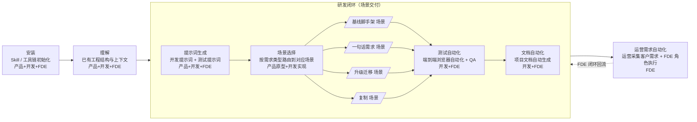

# 开发SOP

## 0 文档概述

### 0.1 SOP 目标与用途

本 SOP（Standard Operating Procedure，标准操作流程）文档面向 **business-platform** 项目的全栈开发者、测试工程师及产品经理，旨在为「从需求到交付」的完整研发链路提供一套**可复用、可度量、可自动化**的标准操作指南。

具体而言，本 SOP 用于解决以下三类问题：

- **流程碎片化**：从一句话需求到代码交付，中间环节散落在 PRD、测试、CI、文档、运营多个工种中，缺乏统一串联。
- **AI 协作口径不统一**：不同开发者使用 Cursor / Qoder / CodeBuddy 等 AI IDE 时，提示词模板、模型选型、上下文注入方式各异，产出质量波动大。
- **知识资产沉淀困难**：测试场景、开发提示词、自动化脚本、运营需求等关键资产未能结构化沉淀，复用率低。

本 SOP 文档以**提示词模板 + 流程编排 + 自动化脚本**为载体，让任何一位成员（无论是否熟悉 business-platform 现有架构）都能在短时间内，按图索骥地完成从环境准备到测试交付、再到文档与运营需求自动化的全流程工作。

### 0.2 人员角色与 SOP 推广阶段

business-platform 的 SOP 推广按组织成熟度划分为两个阶段：先以**多角色分阶段协作**跑通链路，再随客户场景复杂度上升收敛到**全 FDE**。本节先讲清楚三类角色的职责边界，再讲两个推广阶段的差异。

#### 一、三类人员角色与职责边界

| 角色 | 涵盖职能 | 是否与客户直接交流 | 是否承担后端研发 | 关键交付物 |
|------|---------|------------------|----------------|-----------|
| **产品人员** | 原产品 / 解决方案 / 运营 | ✅ 是 | ❌ 否 | 需求清单 / 方案说明 / 前端原型 / 后端接口 MockAPI |
| **开发人员** | 前端 / 后端 / UI / 测试 | ❌ 否 | ✅ 是 | 真实可运行的服务端 + 前端代码、UI 还原、端到端测试 |
| **FDE 角色** | 产品人员 + 开发人员全部职能 | ✅ 是 | ✅ 是 | 客户需求 → 原型 + MockAPI → 真实实现 → 测试 → 文档 → 运营，全链路交付 |

> **关键边界**：开发人员没有直接客户交流工作，专注把产品已对齐的契约（前端原型 + MockAPI）实现为真实链路；产品人员没有后端研发工作，专注把客户需求澄清为可对齐的契约；FDE 角色是产品与开发的合并形态，**包含客户交流与全栈研发的全部工作**，单人即可覆盖从需求到运营的完整闭环。

#### 二、SOP 推广两个阶段

| 推广阶段 | 组织形态 | 主要协作模式 | 适用场景 |
|---------|---------|-------------|---------|
| **阶段 A：多角色分阶段协作** | 产品人员与开发人员各司其职，按 SOP 上下游交接 | 产品人员交付「前端原型 + MockAPI」→ 开发人员实现真实链路 → 测试 / 文档 / 运营 | 团队人手充足、需求来源以内部 PRD 为主、SOP 推广早期需要精细化分工 |
| **阶段 B：全 FDE** | 产品 + 开发合并为 FDE 角色，单人跑完全链路 | FDE 既是产品又是开发，按 SOP 七大阶段串行推进，含 §0.7 运营需求自动化 | 客户场景多且分散、需要单点闭环、人手紧张、SOP 推广成熟期 |

> **演进路径**：阶段 A 是 SOP 推广的"起手式"，用产品 / 开发的精细化分工让团队先跑通流程、沉淀资产；阶段 B 是 SOP 推广的"目标态"，把产品 / 开发的边界合并为 FDE，让"客户场景 → 流程模板 → 后续场景复用"形成正循环。客户场景下的运营需求天然由 FDE 直接承接（详见 §0.7 运营需求自动化阶段说明）。

### 0.3 开发流程整体视图

business-platform 的开发流程可被抽象为「**七大阶段、串行推进**」的流水线。每一阶段都以前序阶段的产出物为输入，并向后续阶段交付标准化的中间制品，形成可追溯的研发链路：

```
安装  →  理解  ┌─ 提示词生成  →  场景选择  →  各场景  →  测试自动化  ─┐
              │                                                ↓     │
              │                                          文档自动化  │
              │                                                ↓     │
              └────────────  运营需求自动化  ←───────────────────────┘
```

> 图中粗框（含「提示词生成 → 场景选择 → 各场景 → 测试 → 文档自动化」）合称 **「研发闭环（场景交付）」** 父环节，对应单个需求从「写提示词」到「可交付、可测试、可文档化」的完整研发过程；安装 / 理解 在父环节之前完成准备，是独立的前置环节；运营需求自动化 在父环节之后**回流回研发闭环**，形成「研发闭环 → 运营 → 研发闭环」的需求驱动正循环，不再回流到安装 / 理解。

完整流程覆盖从「项目初始化（安装 + 理解）」到「研发闭环（场景交付 + 运营需求）」的全过程。「场景选择」阶段本身即根据需求类型选择对应场景，目前涵盖 **基线脚手架 / 一句话需求 / 升级迁移 / 复制** 四大场景；`pipeline 方案生成` 不是一个独立的前置环节，而是**场景选择阶段的内部分支**。`文档 pipeline` 作为独立阶段单列于「文档自动化」中，不在父环节前半段重复出现。

> **流程阶段 vs SOP 推广阶段**：本节"七大阶段"描述的是**单个项目的执行流程**；§0.2 描述的是**团队/组织层面的 SOP 推广阶段（多角色协作 → 全 FDE）**。两者正交，不冲突。

### 0.4 SOP 流程图

下面以 Mermaid 流程图形式给出七大阶段的标准顺序与依赖关系。「提示词生成 → 场景选择 → 各场景 → 测试 → 文档自动化」整体作为一个 **「研发闭环（场景交付）」** 父环节（subgraph 表达），其中「场景选择」阶段展开为多个场景子 pipeline；每个阶段标签后括注其主要适用角色，便于在 SOP 推广的不同阶段（多角色协作 / 全 FDE）下查阅：



> 在 SOP 推广**阶段 A（多角色分阶段协作）**下，产品人员负责 ① 安装 → ② 理解 → ③ 提示词生成 → ④ 场景选择中的「前端原型 + MockAPI」交付，开发人员接力完成 ④ 场景选择后的真实场景实现 + ⑤ 测试自动化 + ⑥ 文档自动化；在 SOP 推广**阶段 B（全 FDE）**下，同一个人按上图流程串行跑完「研发闭环（场景交付）」父环节（含 FDE 闭环回流箭头），并直接承担 §0.7 运营需求自动化。

各阶段在文档中的对应章节如下：

| 阶段 | 流程节点 | 适用角色（SOP 推广阶段 A/B） | 父环节 | 文档对应章节 |
|------|---------|--------------------------|------|-------------|
| 1 | 安装 | 阶段 A：产品 / 开发；阶段 B：FDE | — | §0.5 Skill 安装 |
| 2 | 理解 | 阶段 A：产品 / 开发；阶段 B：FDE | — | §0.2 读取理解已有工程 |
| 3 | 提示词生成 | 阶段 A：产品 / 开发；阶段 B：FDE | 研发闭环（场景交付） | §1 开发测试提示词生成 |
| 4 | 场景选择（含 4 个场景分支） | 阶段 A：产品 → 开发；阶段 B：FDE | 研发闭环（场景交付） | §2 测试 / 编码执行 + §3 场景开发 SOP |
| 5 | 测试自动化 | 阶段 A：开发；阶段 B：FDE | 研发闭环（场景交付） | §2.2 执行测试 / 开发 + §3 场景化 pipeline |
| 6 | 文档自动化 | 阶段 A：开发；阶段 B：FDE | 研发闭环（场景交付） | §4 文档编写 + §3.3 docs-pipeline |
| 7 | 运营需求自动化 | 阶段 A：FDE；阶段 B：FDE | — | 运营人员按客户场景采需，FDE 复用 §0~§4 全流程执行 |

### 0.5 各阶段主要活动与产出物

| 阶段 | 适用角色（SOP 推广阶段 A/B） | 父环节 | 主要活动 | 关键产出物 |
|------|--------------------------|------|---------|-----------|
| **安装** | 阶段 A：产品 / 开发；阶段 B：FDE | — | 安装 superpower / gstack / get-shit-done / OpenSpec / awesome-design-md 等 Skill 工具链 | 全局可用的技能集、DESIGN.md 设计规范 |
| **理解** | 阶段 A：产品 / 开发；阶段 B：FDE | — | 通过 `/gsd-map-codebase` 检索当前工程，生成架构、关注点、规范、集成、技术栈、结构、测试 7 份认知文件 | `ARCHITECTURE.md` / `CONCERNS.md` / `CONVENTIONS.md` / `INTEGRATIONS.md` / `STACK.md` / `STRUCTURE.md` / `TESTING.md` |
| **提示词生成** | 阶段 A：产品 / 开发；阶段 B：FDE | 研发闭环（场景交付） | 参照 `scene-template.md` 模板，为开发、测试、文档、运营各环节生成结构化提示词 | `<service>-scene.md` / `PRD.md` |
| **场景选择** | 阶段 A：产品交付前端原型 + MockAPI → 开发完成真实场景实现；阶段 B：FDE 跑完全部场景 | 研发闭环（场景交付） | 在 AI IDE（Cursor / Qoder / CodeBuddy）中按需求类型路由到对应场景：**基线脚手架**（§3.1 framework-pipeline，含脚手架与配套文档）/**一句话需求**（§3.2 one-sentence-pipeline）/**升级迁移**（§3.6 java-upgrade-pipeline）/**复制**（§3.4 copy-web / §3.5 copy-app），过程中由人类审核 | 可运行的服务端 + 前端代码、提交记录、场景执行报告；阶段 A 还会产出前端原型与 MockAPI |
| **测试自动化** | 阶段 A：开发；阶段 B：FDE | 研发闭环（场景交付） | 通过 `/qa` 等指令驱动端到端浏览器自动化测试，定位并修复缺陷 | 测试报告、已知问题清单、回归通过的测试用例 |
| **文档自动化** | 阶段 A：开发；阶段 B：FDE | 研发闭环（场景交付） | 类似 Qoder Repo-Wiki 的方式自动生成项目级知识库 | 业务文档、API 文档、运维手册 |
| **运营需求自动化** | 阶段 A 与 B：FDE | — | 运营采集客户需求，并由 FDE（Forward Deployed Engineer，前线部署工程师）角色按本 SOP 各场景完成端到端交付 | 客户需求清单、FDE 执行报告、需求闭环记录 |

> **关于父环节「研发闭环（场景交付）」**：把「提示词生成 → 场景选择 → 各个场景 → 测试 → 文档自动化」5 步聚拢为同一个父环节，强调它们在单个需求里是**一气呵成的研发闭环**；在父环节之前是「安装 / 理解」两个**独立的前置准备阶段**（不参与闭环回流），在父环节之后是「运营需求自动化」回流阶段，回流箭头**回到研发闭环父环节**，不回到安装 / 理解。父环节不会引入新的阶段编号，七大阶段保持不变。

### 0.6 SOP 如何帮助开发者高效交付

遵循本 SOP，开发者可以获得以下六项核心收益：

1. **降低上手成本**：新人无需通读全部源码即可基于「理解」阶段产出的 7 份文件快速建立心智模型，配合 §0.5 的 Skill 一键安装，半天内进入实战状态。
2. **统一 AI 协作口径**：所有提示词均按 `scene-template.md` 1:1 对齐，关键 IDE（Cursor / Qoder / CodeBuddy）配套推荐模型，避免「同一需求、不同产出」的协作损耗。
3. **流水线化交付**：七大阶段线性推进，阶段间产出物标准化、可追溯，便于 Code Review、进度度量与质量回溯。
4. **SOP 推广路径清晰**：从阶段 A「多角色分阶段协作」（产品原型 + 开发实现）到阶段 B「全 FDE」（合并产品 + 开发，覆盖客户交流与全栈研发），团队规模与 SOP 流程解耦，组织成熟度可平滑演进。
5. **场景即路由**：场景选择阶段按需求类型路由到基线脚手架 / 一句话需求 / 升级迁移 / 复制 四大场景分支，每种需求类型都有"按图索骥"的执行路径，无需在多个独立流程间反复切换；`文档 pipeline` 不在场景选择环节内重复出现，统一由「文档自动化」阶段承载。
6. **自动化放大产能**：测试、文档、运营三大末端环节均以自动化模板驱动，使开发者从重复劳动中解放出来，聚焦于业务逻辑与架构决策。
7. **沉淀知识资产**：所有 prompt、pipeline、scene 文档以 `docs/scene/` 目录统一归档，形成团队级可复用资产，新需求来临时可直接套用或微调，而非从零开始。

> **使用建议**：首次使用请按文档顺序通读 §0 准备 → §1 提示词生成 → §2 测试执行 → §3 场景 SOP → §4 文档编写，形成对完整链路的整体认知；后续按需跳转到具体章节，结合自身需求类型（基线 / 一句话 / 升级 / 复制 / 文档）选择对应 pipeline 启动。同时明确团队当前处于 §0.2 的哪个推广阶段（**阶段 A 多角色协作 / 阶段 B 全 FDE**），按对应章节入口推进。

### 0.7 运营需求自动化阶段说明

作为整条流水线的**终点与回流出口**，「运营需求自动化」并非独立的内容生产环节，而是对前六个阶段能力的**复用与外延**，并最终**回流回研发闭环（场景交付）父环节**驱动下一轮需求实现：

- **运营视角（需求入口）**：运营同学深入客户业务一线，采集并归集客户在使用 business-platform 过程中提出的真实需求、痛点与定制化场景，沉淀为结构化的需求清单与场景描述。
- **FDE 视角（执行闭环）**：由 FDE（Forward Deployed Engineer，前线部署工程师）角色承接这些运营需求，将客户场景套用回本 SOP 的 **§0 准备 → §1 提示词生成 → §2 测试 → §3 场景 SOP → §4 文档** 全流程，按七大阶段完成从「客户原话」到「可交付、可测试、可文档化」产品的端到端落地。
- **场景复用**：FDE 执行的每一个客户场景，反过来又沉淀为 §3 场景开发 SOP 下的新 pipeline 模板（如 `copy-web-pipeline.md` / `copy-app-pipeline.md` / `java-upgrade-pipeline.md`），形成"客户场景 → 流程模板 → 后续场景复用"的正循环。
- **回流机制**：执行过程中产生的提示词、测试用例、文档与运营分析材料，回填至 `docs/scene/` 资产库，使后续运营采需与 FDE 执行有据可依、越用越准。

### 0.8 各阶段实施验证状态

下表记录本 SOP 各阶段在实际项目中的验证情况，「✅ 已验证」表示该阶段已在真实项目中执行并产出预期交付物；「🔄 验证中」表示正在实践中迭代；「⏳ 待验证」表示流程已定义但尚未在真实场景中落地。

验证范围涵盖 §4 场景开发 SOP 下的 6 个场景分支（含 4.6 的 2 个子场景），各子场景独立一行：

| 阶段 | 验证状态 | 验证负责人 | 验证说明 | 最近验证时间 |
|------|---------|---------|-------------|-------------|
| 1 · 安装 | ✅ 已验证 | — | Skill 工具链安装流程已写入文档，尚未在真实项目中完整执行并记录结果 | — |
| 2 · 理解 | ✅ 已验证 | — | `/gsd-map-codebase` 已在本项目（business-platform）中执行，7 份认知文件已产出并存于 `.planning/codecase/` | 2026-06-18 |
| 3 · 提示词生成 | ✅ 已验证 | — | 已参照 `scene-template.md` 生成 `<service>-scene.md` 等提示词文档，实际用于开发 / 测试 / 文档各环节 | 2026-06-18 |
| 4 · 场景选择 | ⏳ 待验证 | — | 以下 6 个场景分支尚未逐一在真实需求中完整跑通 | — |
| 4.1 · 基线脚手架开发 | ⏳ 待验证 | — | 参照 `copy-web-pipeline.md` 初始化基线工程结构，路由与依赖链路待验证 | — |
| 4.2 · 一句话需求到前端原型 | ⏳ 待验证 | — | 零手工代码纯 AI 生成场景，提示词质量与产出可验收性待验证 | — |
| 4.3 · 项目文档自动化 | ⏳ 待验证 | — | docs-pipeline 文档自动生成场景，参照 §4.3 SOP 执行，尚未在真实项目中触发并验证产出质量 | — |
| 4.4 · 线上已有 Web 项目复制 | ⏳ 待验证 | — | 参照 `copy-web-pipeline.md` 复制已有 Web 场景到新服务，尚未在真实项目中跑通 | — |
| 4.5 · 复制移动 App | ⏳ 待验证 | — | 参照 `copy-app-pipeline.md` 复制已有 App 场景，尚未在真实项目中跑通 | — |
| 4.6 · 升级已有源码工程 | ⏳ 待验证 | — | 以下 2 个子场景分支尚未逐一触发实际升级项目 | — |
| 4.6.1 · 开发语言变更（Python → Java） | ⏳ 待验证 | — | 参照 `java-upgrade-pipeline.md` 执行 Python→Java 迁移，尚未在真实项目中触发 | — |
| 4.6.2 · 原技术栈升级（同语言版本升级） | ⏳ 待验证 | — | 同语言版本升级（如 Spring Boot 3.x），尚未在真实项目中触发 | — |
| 5 · 测试自动化 | ✅ 已验证 | — | 已通过 `/qa` 指令驱动端到端浏览器自动化测试，OntoGraph Console 登录/注销/首页展示测试用例已执行并产生报告 | 2026-06-18 |
| 6 · 文档自动化 | ✅ 已验证 | — | docs-pipeline 文档自动生成流程已写入 §3.3，尚未在真实项目中触发并验证产出质量 | — |
| 7 · 运营需求自动化 | ⏳ 待验证 | — | 运营采集 + FDE 承接模式已在本 SOP 中定义，待实际客户场景触发后方可验证闭环回流 | — |


> **验证记录约定**：每次在真实项目中跑通某个阶段后，请在此表中更新对应行的「验证状态」与「最近验证时间」，并可选在 `docs/scene/` 下新建 `verification/<stage>-YYYY-MM-DD.md` 留存验证细节（如输入输出截图、遇到的问题与解决方案），使 SOP 本身成为一个随项目迭代持续被验证的活文档。

---

## 1.准备

### 1.1 读取理解已有工程：
```
/gsd-map-codebase 检索当前工程的代码并理解, 输出结果使用简体中文，将结果写入  @docs/scene/graph-graphiti.md  ，覆盖该文件
```
在当前工作区的 .planning/codecase 下会产生7个当前工程信息的文件:

| 文件名             | 说明   |
|-----------------|------|
| ARCHITECTURE.md | 架构设计 |
| CONCERNS.md     | 关注点  |
| CONVENTIONS.md  | 规范   |
| INTEGRATIONS.md | 集成   |
| STACK.md        | 技术栈  |
| STRUCTURE.md    | 结构   |
| TESTING.md      | 测试   |

### 1.2 Skill 安装

####  1.2.1 通用
```
# 角色与任务
你现在是一个资深的 DevOps 工程师和全栈自动化专家。你的任务是帮助我自动化安装和配置以下5个工具/Skill包，并确保它们在我的当前工作环境中可用。

# 待安装清单
1. superpower
2. gstack
3. get-shit-done
4. OpenSpec
5. Agent-skills
6. awesome-design-md

# 执行步骤与规范（请严格按顺序执行）：

**第一步：环境与来源侦测**
在执行任何安装命令之前，请先利用你的联网搜索能力或内置知识，确认这5个包的最佳安装方式（例如：它们是 NPM 包、Python pip 包、Homebrew 工具，还是需要 git clone 的开源项目？）。
- 分析我当前的操作系统和项目环境。
- 向我输出一个简短的清单，说明你打算用什么命令安装每一个包。

**第二步：静默与安全的安装**
在获得我的（即使是默认的）允许后，请直接在终端（Terminal）中执行安装命令。
- 如果遇到需要 sudo 权限的全局安装，请先询问我，或者尝试安装在局部环境（如 `npm install -D` 或用户目录下）。
- 如果某个包（如 awesome-design-md）是一个知识库或文档库，请帮我在当前项目根目录下创建一个 `skills` 或 `docs` 文件夹，并将其 clone 进去。

**第三步：错误处理**
如果安装过程中终端报错（如网络超时、依赖冲突、包名拼写错误），请自动分析终端输出的错误日志，并尝试更换国内镜像源（如 npm 的 taobao 源，或 pip 的 tsinghua 源）或修复依赖后重新执行，最多重试2次。

**第四步：验证与总结**
全部安装完成后，请在终端中运行相应的验证命令（如 `[工具名] --version`），并向我输出一份最终的**安装报告**，说明哪些成功了，哪些失败了以及如何调用它们。

现在，请开始执行第一步。
```
注意： 各个skills如果本地已经git clone过，就把仓库clone的路径加入以上提示词，待安装清单第三列

#### 1.2.2 专用

```
请帮我自动完成以下 5 个 Skill 包/工具的安装配置，全程自动执行终端命令、自动确认所有选项，无需我手动交互，安装完成后逐一验证：

1. superpowers 工程纪律技能包
- 安装方式：通过 skills CLI 全局安装
- 执行命令：npx skills add obra/superpowers -a qoder --global
- 验证：全局技能列表可检索到 superpowers 全量子技能

2. gstack 全流程审查技能包
- 安装方式：通过 skills CLI 全局安装
- 执行命令：npx skills add garrytan/gstack -a qoder --global
- 验证：技能列表可识别 gstack 全套流程技能

3. get-shit-done (GSD) 原子化执行技能包
- 安装方式：官方安装器适配 Qoder 全局安装
- 执行命令：npx get-shit-done-cc@latest --qoder --global
- 验证：输入 /gsd:help 可返回完整命令手册

4. OpenSpec 规格驱动开发工具
- 安装方式：npm 全局安装
- 执行命令：npm install -g @fission-ai/openspec@latest
- 验证：终端执行 openspec --version 正常输出版本号

5. awesome-design-md 设计规范包
- 操作：克隆仓库，将 Vercel 风格 DESIGN.md 放置到当前项目根目录
- 参考命令：
  git clone https://github.com/VoltAgent/awesome-design-md.git temp-design
  cp temp-design/design-md/vercel/DESIGN.md ./DESIGN.md
  rm -rf temp-design
- 验证：项目根目录存在完整 DESIGN.md 文件

安装要求：
- 先检查 Node.js、Git 依赖是否满足
- 所有技能默认全局安装，所有选项自动确认
- 安装完成后输出每个包的状态、生效路径和验证结果
- 安装失败项给出具体报错原因与可执行修复方案
```

注意： 各个skills如果本地已经git clone过，就把仓库clone的路径加入以上提示词，待安装清单第三列


### 1.3 Project Rules 安装

```
根据当前的后端代码模块 @business-basic/business-module-uaa 与前端代码模块 @business-web 的现有架构和技术栈，为整个业务平台工程项目制定并实施一套统一的开发约束和代码规范，并生成为当前开发工具cursor的Project Rules,并安装。

具体要求：
1. 分析现有代码结构，识别当前使用的编码规范、技术栈和最佳实践
2. 制定涵盖前后端的统一代码规范，包括但不限于：
   - Java 后端规范（命名约定、注释标准、异常处理、日志记录等）
   - TypeScript/Vue 前端规范（命名约定、组件结构、API 调用模式、类型定义等）
   - 数据库设计规范
   - API 设计规范
   - Git 提交规范
3. 为所有开发任务配置相应的代码质量工具：
   - ESLint、Prettier 配置
   - Checkstyle、SonarQube 等静态分析工具
   - 提交钩子（husky/lint-staged）配置
4. 确保规范对所有现有和未来的开发任务生效，包括：
   - 现有模块的逐步规范化改造
   - 新模块开发必须遵循规范
   - CI/CD 流程中集成代码质量检查
5. 提供详细的规范文档和实施指南，确保团队成员能够理解和遵循
6. 验证规范实施效果，确保不影响现有功能的正常运行
```
提示：请根据上述要求，生成一份完整的 Project Rules 文档，并安装相应的代码质量工具。  
规范文件列表：
 - api-design.md
 - code-quality.md
 - database.md
 - frontend.md
 - general.md
 - git-commit.md
 - java-backend.md

安装 [可以使用提示词自动安装]：
 - Qoder: 拷贝到当前工程的根目录： .qoder/rules/ 下;
 - Cursor: 拷贝到当前工程的根目录： .cursor/rules/ 下;
 - CodeBuddy: 拷贝到当前工程的根目录： .codebuddy/rules/ 下;

### 1.4 AI IDE配置：

#### 1.4.1 Qoder
 - 关闭Agent 确认提示：
    Integrations Browser Agent等都配置为 Auto-run
    .qoder/settings.json 配置为：
```json
{
  "general": {
    "defaultPermissionMode": "auto"
  }
}
```
 - MCP 安装
   必须安装：
   playwright
   memplace MCP
   
#### 1.4.2 Cursor
- Tools 确认提示：
  
- MCP 安装
  必须安装：
  playwright
  memplace MCP

#### 1.4.3 CodeBuddy

- MCP 安装
  必须安装：
  playwright
  memplace MCP

## 2.开发测试提示词生成

### 2.1 已有工程提示词
从已有工程生成。

系统模块
```
/brainstorm
参照模板 以@business-web/docs/scene/scene-template.md 的结构与风格，生成一份完整的服务端到端浏览器自动化测试开发文档。模板的所有章节顺序、命名、子节、表格列、代码块结构、占位符语义都必须 1:1 对齐:
-   后端 @business-basic/business-module-system服务名：system 端口 8082
-   前端 views目录：@business-web/src/api/systemapi模块: @business-web/src/views/system

输出文件路径：`business-web/docs/scene/system-scene.md`
文档更新要求：对已有文件中的各个测试场景进行维护，只能添加新场景或细化现有场景，严禁删除任何已有功能的测试场景。必须确保遍历每个页面的所有功能，页面上的每个按钮、每个交互元素的功能都必须有对应的测试场景覆盖，保证测试的完整性和全面性。
特别强调：System 服务测试模块 必须完成所有模块的测试提示词的编写
```

AI模块
```
参照模板 以@business-web/docs/scene/scene-template.md 的结构与风格，生成一份完整的服务端到端浏览器自动化测试开发文档。模板的所有章节顺序、命名、子节、表格列、代码块结构、占位符语义都必须 1:1 对齐:
-   后端  business-harness-module 服务名：harness 端口 8087
-   前端 views目录：@business-web/src/api/harness  api模块: @business-web/src/views/harness

文档更新要求：对已有文件中的各个测试场景进行维护，只能添加新场景或细化现有场景，严禁删除任何已有功能的测试场景。必须确保遍历每个页面的所有功能，页面上的每个按钮、每个交互元素的功能都必须有对应的测试场景覆盖，保证测试的完整性和全面性。
输出文件路径：`business-web/docs/scene/harness-scene.md`
特别强调：harness 服务测试模块 必须完成所有模块的测试提示词的编写
```

单个模块测试提示词
```
/brainstorm
根据页面 @business-web/src/views/kms/legal/area 以及常规行政区域管理功能的需求，对 KMS-08 的测试场景进行详细细化和完善。请分析该行政区域管理页面的实际功能特性，包括但不限于列表展示、搜索筛选、新增、编辑、删除等操作，并基于真实的页面交互流程和业务逻辑，制定更加全面和贴近实际使用的测试场景。
```

测试提示词转换为开发提示词
```
使用 /qa skill 执行测试时，针对模板 ​ @business-web/docs/scene/scene-template.md ​ 中   @scene-template.md (246-365)  模块的测试场景，如果发现这些功能尚未开发实现，请将测试流程转换为模块开发流程。

请提供一个完整的提示词转换方案，将原本的测试提示词转化为开发提示词，并生成相应的 Skill 配置。

具体要求：
1. 将测试场景（CRUD 操作验证）转换为对应的开发任务（前端页面 + 后端接口实现）
2. 保持原有的模块结构和功能边界不变
3. 生成完整的开发提示词，完整开发流程必须包含以下几点：
   - 前端页面组件 (Vue 文件)
   - 前端 API 接口封装 (TypeScript 文件) 
   - 后端 Controller、Service、DTO、DO、Mapper 等 Java 文件
   - 数据库表结构（如需要）
   - 菜单权限配置
   - 字典数据初始化（如需要）

4. 生成对应的 Skill 配置文件，用于自动化执行开发任务
5. 确保开发完成后能够满足原测试场景的所有验证要求

---

**/qa-dev Skill (二合一-增强版)**

`/qa-dev` = `/qa` + 浏览器测试 + 报告生成 + 自动修复 + 无人值守批量执行。

Skill 文件: `@.claude/skills/qa-dev/SKILL.md`

```
┌────────────────────────────────────────────────────────────────────────────┐
│                              /qa-dev                                       │
├────────────────────────────────────────────────────────────────────────────┤
│  Phase 1: 浏览器自动化测试 → Phase 2: 测试报告 → Phase 3: 自动开发       │
└────────────────────────────────────────────────────────────────────────────┘
```

**使用方式:**

```bash
# 完整流程: 测试 → 报告 → 修复 → 开发 → 验证
/qa-dev --file docs/scene/system-scene.md --module SYS-01

# 仅测试不开发
/qa-dev --test-only --file docs/scene/system-scene.md --module SYS-01

# 仅开发不测试
/qa-dev --dev-only --module SYS-01

# ========== 无人值守批量执行 ==========

# 无人值守批量执行所有模块
/qa-dev --batch --unattended --file docs/scene/system-scene.md

# 无人值守批量执行指定范围
/qa-dev --batch --unattended --file docs/scene/system-scene.md --from SYS-01 --to SYS-10

# 仅测试无人值守
/qa-dev --batch --test-only --unattended --file docs/scene/system-scene.md

# 仅开发失败模块无人值守
/qa-dev --batch --dev-only --failed --unattended --file docs/scene/system-scene.md
```

**核心能力对比:**

| 能力 | /qa | /qa-dev |
|------|-----|---------|
| 浏览器自动化测试 | ✅ | ✅ |
| 端到端交互测试 | ✅ | ✅ |
| 测试报告生成 | ✅ | ✅ |
| 自动修复问题 | ✅ | ✅ |
| **无人值守批量执行** | ❌ | ✅ |
| **开发代码生成** | ❌ | ✅ |
| **回归验证** | ❌ | ✅ |

**无人值守模式特性:**
- 无任何提示、选择或确认请求
- 所有决策自动执行
- 自动处理失败和错误
- 完成后生成完整报告

**Skill 安装清单:**
- [x] `.claude/skills/qa-dev/SKILL.md` (增强版)
- [x] `.claude/skills/qa-dev/QUICKSTART.md`
- [x] `.claude/skills/qa-dev/scripts/run.sh`

---

**/qa-to-dev Skill (二阶段)**

`/qa-to-dev` = `/qa` + 转换为开发提示词，需要手动执行开发。

Skill 文件: `@.claude/skills/qa-to-dev/SKILL.md`

**Skill 安装清单:**
- [x] `.claude/skills/qa-to-dev/SKILL.md`
- [x] `docs/scene/qa-to-dev-complete-solution.md`

---

**Skill 对比:**

| Skill | 功能 | 使用场景 |
|-------|------|---------|
| `/qa` | 仅测试 + 报告 | 已知功能已开发 |
| `/qa-to-dev` | 测试→开发提示词 | 手动执行开发 |
| `/qa-dev` | 测试→报告→开发→验证 | **一体化自动化+无人值守** |

---

┌─────────────────────────────────────────────────────────────┐
│  1. 执行 /qa-dev 测试                                       │
│     ↓                                                       │
│  2. 浏览器自动化测试 + 生成报告                             │
│     ↓                                                       │
│  3. 发现功能未开发 → 自动分析缺失项                        │
│     ↓                                                       │
│  4. 自动生成代码 + 执行开发                                 │
│     ↓                                                       │
│  5. 回归验证                                               │
│     ↓                                                       │
│  6. 全部通过 ✓ / 失败模块记录 ✓                           │
└─────────────────────────────────────────────────────────────┘

**Cursor 模型推荐 Claude-opus-4.8-thinging-high 模型**  
**Qoder 模型推荐 QWen3.7-MAX 模型**  

提示词生成，其中的测试提示词各个场景等要认证审核Review，与产品需求一致

### 2.2 需求转为提示词

需求转为提示词，生成一份完整的AI开发场景技能字典文档。
```
根据提供的标准需求PRD文档，以 scene-template.md 文件作为模板，生成一个完整的AI开发场景技能字典文档。

具体要求如下：

1. 文档结构：
   - 保持与 scene-template.md 相同的整体结构和章节组织
   - 包含测试前置条件、全局测试策略、Skill调用方式、问题发现与修复流程等章节
   - 为XX服务的优先级模块（XXX-1至XXX-24）创建完整的测试模块定义

2. 模块整理：
   - 整理出以下N个XX模块的具体实现方案：[需修改，模块通过全局整理提示给出]
     * SYS-18 API 访问日志 - 记录所有 API 请求日志
     * SYS-19 API 错误日志 - 记录 API 错误日志  

3. 测试提示词开发：
   - 为每个模块编写详细的测试场景和测试提示词
   - 包含前置操作、测试步骤、预期结果、API端点对照等
   - 遵循现有的测试模式（页面加载、数据加载、交互响应、表单验证等）

4. 代码开发提示词：
   - 为每个模块提供前端页面组件开发提示词（位于xxx目录下）
   - 提供后端API接口和业务逻辑开发提示词
   - 包含文件路径、权限标识、API端点等详细信息

5. AI开发工具集成：
   - 充分利用现有的Skill工具，如：
     * /qa, /qa-only, /open-gstack-browser, MCP Playwright
     * brainstorming, writing-plans, gsd-*系列命令
     * agent-skills的/spec, /plan, /build等功能
   - 提供具体的Skill调用方式和参数示例
   - 确保提示词能够指导AI工具完成完整的开发、测试、验证流程

6. 一致性要求：
   - 保持与现有xxx模块的一致性
   - 遵循现有的代码规范和架构模式
   - 确保前后端集成测试通过
```

### 2.3 一句话PRD文档生成

```
# 角色
你是 business-platform 资深产品经理 + 架构师,负责将一句话需求转换为 PRD。

# 输入
- 一句话需求:`{{USER_INPUT}}`
- 服务短名:`{{NAME}}`
- 中文标题:`{{NAME_TITLE}}`
- 后端端口:`{{PORT}}`
- 输出路径:`{{PRD_FILE}}`

# 任务
生成完整 PRD 文档,章节结构 **1:1 对齐** `business-web/docs/scene/scene-template.md` 的 §1 ~ §8 骨架。
本 PRD 是后续 N2~N5 的唯一数据源,请最大化信息密度。

# 输出文档骨架(必须严格遵循)

```markdown
# {{NAME_TITLE}} 服务 — PRD 文档

> 一句话需求原文:{{USER_INPUT}}
> 服务名:{{NAME}}(:{{PORT}})
> 文档版本:1.0.0 (YYYY-MM-DD)

---

## 目录
- [1.项目背景与目标](#1-项目背景与目标)
- [2.用户角色与权限模型](#2-用户角色与权限模型)
- [3.功能需求](#3-功能需求)
- [4.非功能需求](#4-非功能需求)
- [5.接口契约(API 草案)](#5-接口契约api-草案)
- [6.数据模型(初稿)](#6-数据模型初稿)
- [7.UI/UX 规范](#7-uiux-规范)
- [8.验收标准](#8-验收标准)
- [9.风险与依赖](#9-风险与依赖)
- [10.子模块拆分(由 N2 填充)](#10-子模块拆分由-n2-填充)

---

## 1.项目背景与目标
- 1.1 业务背景
- 1.2 业务目标
- 1.3 范围(包含 / 不包含)
- 1.4 成功指标(KPI)

## 2.用户角色与权限模型
| 角色 | 权限码前缀 | 关键权限 | 备注 |

## 3.功能需求
按 Epic → Story → Acceptance Criteria 三级展开
### 3.1 Epic-1 <名称>
#### Story 1.1 <用户故事>
**AC**:
- [ ] AC1
- [ ] AC2

## 4.非功能需求
- 4.1 性能(QPS / RT / 并发)
- 4.2 安全(鉴权 / 脱敏 / 审计)
- 4.3 可用性(SLA / 容灾)
- 4.4 可观测性(日志 / 指标 / 链路)

## 5.接口契约(API 草案)
| 模块 | 操作 | 方法 | 路径 | 入参 | 出参 | 权限码 |

## 6.数据模型(初稿)
| 表名 | 字段 | 类型 | 索引 | 备注 |

## 7.UI/UX 规范
- UI 库:ant-design-vue
- 业务组件复用:DictSelect / DictTag / DictSwitch / FormModal
- 列表规范:列定义 / 分页 / 搜索 / 操作列
- 表单规范:必填 / 校验 / 回填 / 联动
- 反馈规范:message / confirm / notification

## 8.验收标准
- 8.1 功能验收
- 8.2 性能验收
- 8.3 安全验收
- 8.4 文档交付

## 9.风险与依赖
| 风险 | 等级 | 缓解措施 | 负责人 |


# 规则
1. 章节顺序、命名、子节编号、表格列 **不得改动**。
2. 信息不全时,使用 `<待定>` 占位,**不要省略章节**。
3. 字段命名、字典类型、权限码命名遵循 business-platform 现有规范(case:manage:* / system:config:* / ai:model:*)。
4. 完成后输出文件路径与字节数。
```

### 2.4 一句话需求完成开发

参考[one-sentence-pipeline.md](one-sentence-pipeline.md)


## 3.测试与开发

### 3.1 执行全新开发

拷贝1生成的提示词，执行全新开发。

```
请实现【向量存储】CRUD + 导出功能。

【模块信息】
- 服务: AI(:8086)
- 页面: vectorStore/index.vue
- 权限: ai:vector-store:create/update/delete/export

【功能需求】
1. 存储列表(分页):存储名称、类型、地址、维度、状态、创建时间、操作
2. 搜索:存储名称、存储类型(Select)
3. 新增/编辑:名称(必填)、类型(必填)、地址(必填)、端口(必填)、维度(必填,默认1536)、API Key、状态
4. 存储类型 Tag 颜色映射
5. 维度输入校验(正整数)
6. 导出 Excel

【交付物清单】
- [ ] 前端 index.vue + VectorStoreFormModal.vue
- [ ] API vectorStore.ts
- [ ] 后端 Controller + Service + DO + Mapper
- [ ] 路由 + 菜单 + 权限码注册
- [ ] 通过 5.4.2 所有测试场景
```


### 3.2 /qa-dev 批量执行功能

**🚀 批量执行命令** 

 执行所有24个模块

```bash
/qa-dev --batch --file docs/scene/system-scene.md
```

**分批执行**

```bash
# SYS-01 ~ SYS-05
/qa-dev --batch --file docs/scene/system-scene.md --from SYS-01 --to SYS-05

# 仅邮件/短信模块
/qa-dev --batch --file docs/scene/system-scene.md --from SYS-07 --to SYS-17
```

**智能流程**

```bash
# 1. 先批量测试所有模块
/qa-dev --batch --test-only --file docs/scene/system-scene.md

# 2. 仅开发失败的模块
/qa-dev --batch --dev-only --failed --file docs/scene/system-scene.md

# 3. 重新验证
/qa-dev --batch --file docs/scene/system-scene.md
```


**批量执行流程**

```
┌────────────────────────────────────────────────────────────────────┐
│  1. 解析文件 → 提取24个模块                                        │
│  2. 过滤模块 (--from/--to/--failed)                              │
│  3. 逐个执行: 测试 → 开发 → 验证                                   │
│  4. 生成汇总报告                                                   │
└────────────────────────────────────────────────────────────────────┘
```

| AI IDE | 推荐模型 |
| ---- | ---- |
| cursor | composer-2.5 |
| qoder | Lite |
| CodeBuddy | Hy3 |

### 3.3 执行测试/开发

拷贝1生成的提示词，执行测试. 

```
/qa
打开 OntoGraph Console,执行完整的登录、注销与首页信息展示测试。

【前置操作】
1. 确认前端(:3000)和后端(:9090)均已启动
2. 确认浏览器无已登录 Cookie(建议用无痕/隐私模式)

---

【测试场景 1:登录页渲染】
1. 打开 http://localhost:3000/login
2. 验证页面正常渲染,无白屏、无 JS 错误
3. 验证包含以下元素:
  - Logo 区域(OntoGraph Console 标题)
  - 用户名输入框(username)
  - 密码输入框(password)
  - 登录按钮(Login / 登录)
  - 语言切换组件(如存在)
4. 验证表单布局美观、输入框对齐

预期结果:
✅ 页面 8 列完整
✅ Logo 标题显示
✅ 用户名/密码输入框存在
✅ 登录按钮可点击

---

【测试场景 2:正确账号登录】
1. 在用户名输入框输入:admin
2. 在密码输入框输入:admin123
3. 点击「登录」按钮
4. 验证:
  - API POST /auth/login 成功返回 token
  - 页面跳转到首页 /dashboard
  - Header 右上角显示用户昵称(admin)
  - 左侧 Sidebar 正确加载四大分组菜单
  - 控制台无 Error 级别报错

预期结果:
✅ 登录 API 返回成功
✅ 跳转到 /dashboard
✅ Header 显示用户名
✅ Sidebar 菜单完整渲染

---

【测试场景 3:错误密码登录】
1. 在用户名输入框输入:admin
2. 在密码输入框输入:wrongpassword
3. 点击「登录」按钮
4. 验证:
  - API POST /auth/login 返回错误(code≠0 或 HTTP 401)
  - 页面不跳转,停留在登录页
  - 显示错误提示信息(「用户名或密码错误」)

预期结果:
✅ 错误提示显示
✅ 页面不跳转
✅ 可重新输入

---

【测试场景 4:空账号登录(前端校验)】
1. 不填写任何内容,直接点击「登录」
2. 验证浏览器前端表单校验生效
3. 验证必填提示(如:请输入用户名)

预期结果:
✅ 前端表单校验生效
✅ 提示「请输入用户名」
✅ 不触发后端请求

---

【测试场景 5:注销功能】
1. 在首页右上角找到用户下拉菜单(点击头像或用户名)
2. 点击「注销」或「Logout」
3. 验证:
  - API POST /auth/logout 成功
  - 页面跳转到登录页 /login
  - localStorage/SessionStorage 中的 Token 被清除
  - 再次访问 /dashboard 被重定向到 /login

预期结果:
✅ 注销成功跳转
✅ Token 已清除
✅ 受限页面重定向正常

---

【测试场景 6:首页信息展示(Header + Sidebar)】
1. 登录成功后停留在首页 /dashboard
2. 验证 Header 组件:
  - Logo 区域(OntoGraph Console 文字/图标)可点击
  - 点击 Logo 返回首页
  - 右上角:语言切换器
  - 右上角:通知铃铛(带 Badge)
  - 右上角:用户名/头像下拉菜单(个人中心/注销)
3. 验证 Sidebar 组件:
  - 四大分组菜单:
    a. 「图谱管理」(含图谱列表/Graph IDE/时序历史/社区发现)
    b. 「数据管理」(含类管理/属性管理/约束管理/实体管理/边管理/导入/导出/法律知识图谱)
    c. 「工具」(含混合搜索/自定义指令/Prompt 管理)
    d. 「系统管理」(含用户管理/角色管理/菜单管理/参数配置/操作日志/系统监控)
  - 每个分组可折叠/展开
  - 当前激活菜单项高亮显示

预期结果:
✅ Header Logo 可点击
✅ 语言切换器存在
✅ 通知铃铛存在
✅ 用户下拉菜单正常
✅ Sidebar 四大分组完整
✅ 菜单可折叠/展开
✅ 当前页菜单高亮

---

【测试场景 7:首页内容展示(Dashboard)】
1. 停留在 /dashboard 页面
2. 验证 Dashboard 页面内容加载:
  - 页面标题/欢迎语
  - 统计数据卡片(如图谱数量、实体数量等)
  - 内容区域正常渲染
  - 无 Loading 卡死
  - 无 JS 错误

预期结果:
✅ Dashboard 页面完整渲染
✅ 无 JS 错误

---

【测试场景 8:未登录访问受限页(重定向)】
1. 清除浏览器 Cookie 和 Token
2. 直接访问 http://localhost:5173/dashboard
3. 验证页面自动重定向到 /login
4. 登录后验证正确跳转回 /dashboard

预期结果:
✅ 未登录时重定向到 /login
✅ 登录后正确跳转

---

【API 端点对照】

| 操作 | API 方法 | 路径 |
|------|---------|------|
| 用户登录 | POST | /auth/login |
| 用户注销 | POST | /auth/logout |
| 获取用户信息 | GET | /auth/info |
| 获取菜单树 | GET | /auth/menus |

---

【问题诊断】
- 登录页白屏 → 检查 Vue 路由配置 login 组件是否正确注册
- 登录后不跳转 → 检查 authStore.login() 是否正确处理 LoginResult.token
- Header 不显示用户名 → 检查 authApi.getInfo() 返回的 nickname/username 字段
- Sidebar 菜单不加载 → 检查 authApi.getMenus() 返回的 MenuItem[] 树结构
- 注销后仍能访问 → 检查路由守卫 beforeEach 是否正确拦截
- Token 不存储 → 检查 auth.ts login() 返回后是否写入 localStorage/sessionStorage
- 登录 API 404 → 检查后端 AuthController 是否映射 /auth/login
```

自动测试完毕，然后突出3个待修复问题：

 已知未修复问题

| 问题 | 说明 | 影响 |
|------|------|------|
| 动态菜单子项为空 | 后端 `/auth/menus` 返回扁平列表，前端按 `parentId` 分组后 children 为空 | 侧边栏展开后无子菜单（静态备用菜单在动态菜单加载后不显示） |
| 仪表盘菜单重复 | 静态 "Dashboard" + 动态 "nav.dashboard" 两项并存 | 侧边栏有两个 Dashboard 入口 |
| 登录页无语言切换组件 | 语言切换仅在 Header 中，登录页未集成 | 非中文用户无法在登录前切换语言 |

导出菜单sql数据到文件，给qoder,然后修正问题完成开发

**推荐模型**：  

| AI IDE | 推荐模型 |
| ---- | ---- |
| cursor | composer-2.5 |
| qoder | Lite |
| CodeBuddy | Hy3 |


## 4.场景开发SOP

### 4.1 基线脚手架开发
```
实现目标：
基于已知技术栈与要求，开发一个基线脚手架（baseline scaffold）并建立完整的自动化Pipeline,将实现过程写入 @docs/scene 下 jixian-pipeline.md。

具体要求：
1. 基线脚手架应包含完整的项目结构、配置文件、基础依赖、代码规范、测试框架、CI/CD模板等基础设施
2. 技术栈要求：现代全栈架构（如React/Vue前端 + Node.js/Java后端 + 数据库 + Docker + CI/CD）
3. 需要建立一个可复用的通用Pipeline，涵盖从需求分析到脚手架发布的完整流程

请整理一个通用的Pipeline实现以上目标，包括：
- Pipeline的各个节点（N1-N6）及其职责定义
- 每个节点的具体操作步骤
- 每个节点对应的提示词模板
- 节点间的输入输出关系
- Pipeline的执行顺序和依赖关系

可使用的Skills工具：
1. Superpowers - 用于头脑风暴、计划制定、TDD开发等创造性工作
2. gstack - 用于产品咨询、设计评审、工程审查、QA测试等
3. Get Shit Done (GSD) - 用于项目初始化、阶段规划、执行验证、发布管理等
4. OpenSpec - 用于需求规格化、变更提案、规范驱动开发等
5. awesome-design-md - 用于设计系统规范、UI组件标准、视觉一致性等

Pipeline需要能够：
- 自动化生成项目基础结构
- 集成代码质量检查工具
- 配置开发环境和依赖管理
- 设置测试框架和覆盖率检查
- 配置CI/CD流水线
- 生成项目文档模板
- 确保代码规范和最佳实践
```
[framework-pipeline.md](framework-pipeline.md)

### 4.2 一句话需求到前端原型

```
使用 这些skills：

1. superpower;
2.gstack
3.get-shit-done
4.OpenSpec
5.awesome-design-md 

目标：实现从一句话需求生成完整PRD文档，并根据文档按照最小级别子模块，生成 在ai coding 工具cursor 可以使用的提示词，包括完整测试提示词语开发提示词，结构参考@business-web/docs/scene/scene-template.md。
输出： pipeline实现的流程与各个节点的操作，包括提示词


范例提示词：
参照模板 以@business-web/docs/scene/scene-template.md 的结构与风格，生成一份完整的服务端到端浏览器自动化测试开发文档。模板的所有章节顺序、命名、子节、表格列、代码块结构、占位符语义都必须 1:1 对齐:
-   后端 @business-basic/business-module-system服务名：system 端口 8082
-   前端 views目录：@business-web/src/api/systemapi模块: @business-web/src/views/system

输出文件路径：`business-web/docs/scene/system-scene.md`
特别强调：System 服务测试模块 必须完成所有模块的测试提示词、开发提示词的编写
```

[one-sentence-pipeline.md](one-sentence-pipeline.md)

### 4.3 项目文档自动化
实现类似Qoder Repo-wkik的文档  
```
目标：从当前工程生成位于 @.qoder/repowiki/zh/content 的完整文档，参考其结构与目录，逆向整理出实现该目标的通用pipeline，包括各节点的具体操作与提示词。
输出： @docs/scene 下 docs-pipeline.md
具体要求：
1. 分析当前工程中 @.qoder/repowiki/zh/content 目录下的文档结构和内容组织方式
2. 识别文档生成的关键节点和流程步骤
3. 逆向设计一个通用的文档生成pipeline，包含：
   - 每个节点的具体操作内容
   - 每个节点对应的提示词模板
   - 节点间的依赖关系和数据流转
   - 文档质量控制标准

可使用的skills组合如下：
- superpowers: 用于头脑风暴、计划制定、TDD开发、系统化调试、代码审查等
- gstack: 用于产品咨询、设计评审、工程审查、QA测试、安全审计等
- get-shit-done: 用于项目管理、阶段执行、工作流编排
- OpenSpec: 用于规范驱动开发、提案制定、变更管理
- awesome-design-md: 用于设计系统规范、UI/UX指导

最终输出应包括：
- 详细的pipeline流程图或步骤说明
- 每个节点的输入/输出定义
- 操作指南和提示词模板
- 可复用的文档生成框架
```

[docs-pipeline.md](docs-pipeline.md)

### 4.4 线上已有Web项目复制

```
实现目标：
已知线上系统，包括登录账号密码，复制其功能实现一样系统；
整理一个通用的pipeline实现以上目标,包括各节点的操作与提示词，整理内容写入文档：@business-web/docs/scene  copy-web-pipeline.md。

具体要求：
1. 基于现有线上系统进行逆向工程分析，包括但不限于：
   - 分析系统功能模块和业务流程
   - 识别技术架构和数据流向
   - 提取API接口和数据结构
   - 分析用户界面和交互逻辑

2. 设计一个完整的开发pipeline，包含以下阶段：
   - 需求分析与规格制定
   - 系统架构设计
   - 数据库设计
   - 前后端开发
   - 测试验证
   - 部署上线

3. 每个pipeline节点需要包含：
   - 具体操作步骤
   - AI提示词模板
   - 预期输出产物
   - 质量验收标准

4. 可使用的skills：
   - superpowers: 用于头脑风暴、计划制定、TDD开发、系统化调试、代码审查等
   - gstack: 用于产品咨询、设计评审、工程审查、QA测试、安全审计等
   - get-shit-done: 用于项目管理、阶段执行、工作流编排
   - OpenSpec: 用于规范驱动开发、提案制定、变更管理
   - awesome-design-md: 用于设计系统规范、UI/UX指导

5. pipeline需要覆盖从需求分析到系统上线的完整生命周期，确保可复用性和可扩展性。

6. 最终输出应包含完整的pipeline文档，详细说明每个节点的操作方法和对应的AI提示词。
```

[copy-web-pipeline.md](copy-web-pipeline.md)
### 4.5 复制移动App

```
实现目标：
1. 分析现有的移动APP（包含登录、账号、密码等功能模块），全面理解其功能架构和实现逻辑
2. 使用uniapp框架开发一个功能相同的跨平台应用（支持iOS、Android、H5、小程序等多端）
3. 设计并实现一个完整的自动化Pipeline，涵盖从需求分析到部署发布的全流程

具体要求：
- 逆向分析目标APP的功能点、UI界面、交互逻辑和数据流程
- 基于uniapp框架实现相同功能，确保各端体验一致
- 设计Pipeline包含以下节点：需求分析(N1) → 架构设计(N2) → 代码生成(N3) → 功能实现(N4) → 测试验证(N5) → 部署发布(N6)
- 每个节点需定义具体操作步骤和AI提示词模板
- 将完整的Pipeline文档写入文件：business-web/docs/scene/copy-app-pipeline.md

可使用的Skills工具集：
1. Superpowers - 用于头脑风暴、TDD开发、系统化调试
2. gstack - 用于多角色评审、QA测试、工程管理
3. Get Shit Done (GSD) - 用于项目管理和阶段性执行
4. OpenSpec - 用于需求规范化和变更管理
5. awesome-design-md - 用于UI设计规范和视觉一致性

输出产物：
- copy-app-pipeline.md文档，包含完整的6节点Pipeline流程
- 每个节点的详细操作说明
- 每个节点对应的AI提示词模板
- Pipeline的执行验证和质量保障机制
```

[copy-app-pipeline.md](copy-app-pipeline.md)

### 4.6 升级已有源码工程【技术栈语言变更】

#### 4.6.1 开发语言变更 Python-->Java


#### 4.6.2 原技术栈升级
```
实现目标：
将已有工程进行现代化升级：
1. 后端 Java 8 工程升级到 Java 21，包括：
   - Java 版本从 8 升级到 21
   - Spring Framework 相关依赖包升级到兼容 Java 21 的最新版本
   - 相关第三方库和插件升级到兼容 Java 21 的版本
   - 代码语法和 API 调用适配 Java 21 特性

2. 前端 Vue 2 工程升级到 Vue 3 + Ant Design + Vite，包括：
   - Vue 从 2.x 升级到 3.x
   - 集成 Ant Design Vue 组件库
   - 构建工具从 Webpack 迁移到 Vite
   - 代码语法从 Options API 迁移到 Composition API
   - 相关依赖库升级到兼容 Vue 3 的版本

在 Cursor/QoDer 开发工具中，整理一个通用的自动化 pipeline，通过零编码方式实现以上升级目标。该 pipeline 需要包含：
- 各个升级节点的具体操作步骤
- 每个节点对应的 AI 提示词（prompts）
- 错误处理和回滚机制
- 升级前后对比验证步骤

将整理好的 pipeline 内容详细写入文档：@business-web/docs/scene/java-upgrade-pipeline.md
文档应包含完整的升级流程、技术栈变更说明、注意事项和最佳实践。
```
[java-upgrade-pipeline.md](java-upgrade-pipeline.md)


## 5. mem0 记忆共享

mem0 提供向量记忆（PostgreSQL + pgvector）与图记忆（Neo4j），采用原文留痕 +
可选事实抽取两种写入模式，支持项目共享池跨成员检索与会话留痕回放。

### 5.1 架构与端点

```
AI IDE ──MCP──► mem0-api :8080/mcp ──► PostgreSQL(pgvector) + Neo4j
                  │ REST :8888
                  └──► Dashboard :3001（管理/检索/回放）
```

| 端点 | 地址 | 用途 |
|------|------|------|
| MCP | `http://127.0.0.1:8080/mcp` | IDE 接入 |
| REST API | `http://localhost:8888`（Docs `/docs`） | 脚本/SDK 批量读写 |
| Dashboard | `http://localhost:3001` | 记忆浏览/验证/管理 |

### 5.2 安装与部署

```bash
# 一键安装（mem0 服务）
./scripts/install-all.sh          # Linux/macOS
./scripts/install-all.ps1         # Windows

# 或手动
cd deploy/mem0 && docker compose up -d
curl -s http://localhost:8888/docs > /dev/null && echo "API OK"
```

详细步骤见 [SOP-M1: mem0 记忆系统安装配置指南](/guide/ready#1-记忆体安装-mem0)。

### 5.3 凭证与作用域

| 配置 | 位置 | 内容 |
|------|------|------|
| MCP 连接 | `~/.codebuddy/mcp.json` → `mem0-local` | 端点与传输方式 |
| 凭证/作用域 | `.codebuddy/mem0.config.json`（git-ignored） | `api_key` / `admin_user_id` / `project_id` / `git_remote` / `roster` |
| 行为规则 | 根 `CODEBUDDY.md` | 自动拉取/提交约定 |

- **项目共享池**：`add_memory` 携带 `git_remote`，服务端解析为 `project_id`；
  `get_memories(project_id=...)` 跨成员读取全池。
- **个人隔离**：不带 `project_id` 写入的记忆仅本人 `user_id` 可见。

### 5.4 核心工具速查

| 工具 | 用途 | 示例 |
|------|------|------|
| `add_memory` | 写入记忆 | `add_memory(text=..., git_remote=..., metadata={"type":"decision"})` |
| `search_memories` | 语义检索 | `search_memories(query="支付网关 决策", top_k=5)` |
| `get_memories` | 全量拉取共享池 | `get_memories(api_key, project_id="ai-dev-sop")` |
| `update_memory` | 更新记忆 | `update_memory(memory_id, text)` |
| `delete_memory` | 删除单条（须用户明示） | - |
| `list_entities` / `list_events` | 实体与操作流水 | - |

写入模式：`infer=False` 原文留痕（默认，会话归档）；`infer=True` LLM 事实抽取（提炼偏好/知识）。

### 5.5 自动化约定（CODEBUDDY.md）

| 行为 | 时机 | 说明 |
|------|------|------|
| 自动拉取 | 每会话首轮 | `get_memories(project_id=...)` 全池 + 按需 `search_memories`，并向用户汇报召回摘要 |
| 自动提交（事实） | 发现 durable 事实/决策/偏好时 | `metadata.type = fact/decision/preference/note` |
| 自动提交（留痕） | 每轮回复完成时 | `Q: <用户原话>\n\nA: <完整回复>`，`metadata.type=conversation`，按 `session_id` 分组 |

### 5.6 团队协作与知识沉淀

- 成员权限（Can Read / Can Edit / Admin）与邀请流程：Dashboard → Settings → Members
- 知识沉淀规范（metadata.type 分类、质量标准、归纳/蒸馏流程）：
  [SOP-M4: 知识沉淀指南](/guide/SOP-M4-knowledge)
- 团队协作（共享池、ADR 管理、Onboarding）：[SOP-M5: 团队协作指南](/guide/SOP-M5-collaboration)
- 各 IDE 配置模板：IDE MCP 配置模板：仓库 `docs/ide-config/ide-mcp-templates.md`
- mem0 完整手册（部署/接入/控制台/自动提交）：[mem0 配置手册](/guide/mem0-manual)

## 6.文档编写

### 6.1 产品研究与设计  

#### 6.1.1 新产品设计：  
设计提示词：  
```
/brainstorming  基于AI技术开发面向金融行业【证券与加密货币】的投资与分析解决方案，目标用户包括投资者、基金、证券机构等。请参考类似OpenClaw的龙虾技术方案，结合以下GitHub项目和当前工程：
- https://github.com/agentscope-ai/CoPaw.git
- https://github.com/higress-group/hiclaw.git
- https://github.com/brokermr810/QuantDinger 
- https://github.com/Fincept-Corporation/FinceptTerminal 
- https://github.com/TauricResearch/TradingAgents 
- https://github.com/wbh604/UZI-Skill 
- https://github.com/muxuuu/serenity-skill 
- https://github.com/agi-now/buffett-skills 

为我制定详细的技术实施方案，并进行市场前景分析。

具体要求：
1. 技术方案应包含：系统架构设计、核心技术组件、AI模型选择、数据处理流程、用户交互界面等
2. 方案需考虑金融行业的特殊性：合规、投资模拟、投资预测、企业/投资账号数据图关系，明星企业供应链关系等专业需求
3. 应考虑实现的功能不会被基础大模型的发展所替代：包括skill等新技术，基础模型新功能等
4. 投资分析功能应支持：数据分析、模拟仿真、趋势预测、情绪预测、企业、账号关系分析等
5. 市场前景分析需涵盖：目标市场规模、竞争格局、商业模式、盈利预测、风险评估等
6. 结合当前AI技术发展趋势，提出可行的实施路线图和关键里程碑
写一份方案在  @docs/bp 

```

**Cursor 模型推荐 Claude-opus-4.8-thinging-high/GPT5.5 模型[高端模型]**  
**Qoder 模型推荐 QWen3.7-MAX 模型[高端模型]**  

#### 6.1.2 产品完整文档：  
紧接编写： 产品完整文档

```
A. 编写商业计划书 BP 50-100 页完整 BP
B. 编写投资人简报 10-15 页 PPT
C. 编写产品白皮书 技术 + 业务 30-50 页
D. 编写技术架构白皮书 30-50 页技术架构
E. 编写 MVP 产品 PRD 教学版 1.0 详细 PRD
F. 编写融资材料 商业模型 + 财务模型 + 股权设计
G. 编写组织设计 团队 + 薪酬 + 期权 + 招聘
H. 编写合规手册 全法规 + 措施 + 流程
深入编写以上文档，写入  @docs/product  目录下。
```
### 6.2 市场调研

#### 6.2.1  市场规模和总可寻址市场分析

```
你是麦肯锡级别的市场分析师。我需要针对【你的行业/产品】的总可寻址市场（TAM）分析。

请提供：
• 自上而下方法：从全球市场到细分市场
• 自下而上方法：从单位经济学×潜在客户计算
• TAM、SAM、SOM详细分解
• 未来5年增长率预测（CAGR）
• 每项估计背后的关键假设

格式为投资者就绪的市场规模幻灯片。
```
#### 6.2.2  竞争格局深度分析


```
你是贝恩公司的高级战略顾问。我需要【你的行业】的完整竞争格局分析。

请提供：
• 直接竞争者：按市场份额、收入、融资排名前10
• 间接竞争者：5家可能进入市场的相邻公司
• 各竞争者分析：定价模式、核心功能、目标受众、优劣势、最新战略举措
• 市场定位图及竞争护城河分析

格式为结构化竞争情报报告。
```

#### 6.2.3 客户画像与细分

```
你是世界级消费者研究专家。我需要为【你的产品/服务】创建深度客户画像。

请构建4个详细画像，每个包含：
• 人口统计学：年龄、收入、教育、地点、职务
• 心理特征：价值观、信念、生活方式、性格特征
• 痛点：日常经历的5大挫折
• 购买行为：如何发现、评估、购买产品
• 媒体消费：在线和离线时间分配
• 价格敏感性：各细分市场的支付意愿

还需提供：细分市场规模和优先级矩阵。
```

#### 6.2.4 行业趋势分析

```

你是高盛研究部的高级分析师。我需要【你的行业】板块的全面趋势报告。

请提供：
• 宏观趋势：塑造该行业的5大全球力量
• 微观趋势：过去12个月的7个新兴模式
• 技术颠覆：什么新技术改变游戏规则及何时主流化
• 监管变化：即将出台的法规或政策变化
• 消费者行为变化：购买偏好如何演变
• 投资信号：聪明钱流向何处（VC交易、并购、IPO）

格式为趋势情报简报，各趋势附影响评分。
```

#### 6.2.5  SWOT + 波特五力分析

```
你是哈佛商学院战略教授。我需要【你的公司/产品】的SWOT和波特五力组合分析。

SWOT分析：
• 优势：7个内部优势及证据
• 劣势：7个内部限制及诚实评估
• 机会：7个可利用的外部因素
• 威胁：7个可能伤害的外部因素

波特五力分析：
• 供应商势力、买方势力、竞争强度
• 替代品威胁、新进入者威胁

各要素评分（1-10）及行业整体吸引力评分。
```

#### 6.2.6 定价策略分析

```
你是与财富500强公司合作过的定价策略顾问。我需要【你的产品/服务】的全面定价分析。

请提供：
• 竞争对手定价审计：市场地图与定价比较
• 基于价值的定价模型：根据客户价值计算价格
• 成本加成分析：从成本结构确定底线价格
• 价格需求弹性估算
• 心理定价策略：锚定、魅力定价、诱饵策略
• 分层推荐：3个定价档次与功能分配
• 折扣策略：何时折扣、折扣幅度、针对对象

格式为定价策略方案附具体美元建议。
```

#### 6.2.7 上市战略

```
你是启动过20+产品的首席战略官。我需要【你的产品】的完整上市计划。

请提供：
• 上市分阶段：预上市（60天）、上市（第1周）、上市后（90天）
• 渠道策略：按预期ROI排名前7个获客渠道
• 信息框架：核心价值主张、3个支撑信息、证明点
• 内容策略：漏斗各阶段所需内容
• 合作伙伴机会：5个加速增长的战略伙伴
• 预算分配：【预算】跨渠道的分配
• KPI框架：10个关键指标及目标基准

格式为可操作的上市手册。
```

#### 6.2.8 客户旅程地图

```
你是顶级咨询公司的客户体验战略师。我需要【你的产品/服务】的完整客户旅程地图。

请绘制客户生命周期各阶段：
• 认知：首次发现？什么触发搜索？
• 考虑：他们比较什么？需要什么信息？
• 决策：什么让他们转化？什么阻止他们？
• 入职：前7天体验如何影响留存？
• 参与：什么让他们回访？激活时刻？
• 忠诚：什么将用户变成倡导者？
• 流失：为什么离开？早期警告信号？

格式为详细旅程地图附情感曲线描述。
```

#### 6.2.9 财务建模与单位经济学

```
你是高增长初创公司的财务副总裁。我需要【你的业务】的完整单位经济学和财务模型。

请提供：
• 单位经济学细分：CAC、LTV、LTV:CAC比率、回收期
• 毛利率和贡献利润分析
• 3年财务预测：第1年每月、第2-3年每季度
• 成本结构细分：固定vs变动成本
• 盈亏平衡分析、现金流预测、敏感性分析
• 关键假设表及基准对比

格式为财务模型摘要附清晰表格和公式。
```

#### 6.2.10 风险评估与情景规划

```
你是德勤的风险管理合伙人。我需要【你的业务/项目】的全面风险分析和情景规划。

请列出15项风险：
• 市场风险、运营风险、财务风险、监管风险、声誉风险

各风险提供：
• 概率评分（1-5）、影响严重程度（1-5）、风险得分
• 早期预警指标、缓解策略、应急计划

情景规划：
• 最好情况、基础情况、最坏情况、黑天鹅事件
• 各情景的收入影响、时间表和战略应对

格式为风险矩阵优先级排序的执行报告。
```

#### 6.2.11 市场进入与扩张战略

```
你是协助公司进入30+市场的全球扩张战略师。我需要【你的业务】进入【目标市场/地理/细分】的市场进入分析。

请提供：
• 市场吸引力评分：市场规模、增长率、竞争强度、监管环境评分
• 进入方式分析：直接进入、合资、并购、许可、数字优先方式的优劣
• 本地化需求：产品适配、定价调整、文化营销、法规合规
• 12个月进入路线图：月度行动计划与里程碑
• 投资需求：预算估算及资源分配

格式为可执行的扩张蓝图附成功指标。
```

#### 6.2.12 执行战略综合（终极提示词）

```

你是麦肯锡的资深合伙人向CEO汇报。我需要将【你的业务】所有方面综合成一项战略建议。

请提供：
• 执行摘要：CEO可2分钟读完的3段战略概览
• 当前状况：业务现状（诚实评估）
• 战略选项：3条不同路径，各含预期成果、投资、时间表、风险
• 推荐战略及理由
• 优先举措：未来90天排名前5个最高影响力行动
• 资源需求：人员、资金、工具

格式为麦肯锡风格战略甲板附清晰建议和后续步骤。
```


