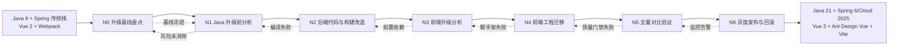
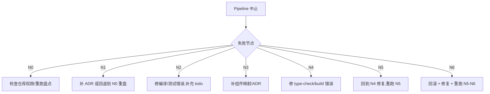

# Java 8 → 21 与 Vue 2 → 3 现代化升级 — 自动化 Pipeline

> 本文档定义一套**"以 Java 8 + Spring 传统栈 + Vue 2 工程为输入,产出 Java 21 + Spring 6/Cloud 2025 + Vue 3 + Ant Design Vue + Vite 工程"**的端到端自动化 Pipeline。
> 输出物是**功能等价、API 兼容、零业务改写即可热切换**的双端升级工程(后端 Spring 体系 + 前端 Web 端)。
> 6 个节点 **N0–N6** 对应**基线盘点 → 后端升级分析 → 后端代码/构建改造 → 前端升级分析 → 前端工程迁移 → 全量对比验证 → 灰度发布与回滚**,每节点给出**职责、操作步骤、AI 提示词模板、输入/输出契约、错误处理与回滚机制**。
> 文档继承 `framework-pipeline.md` 的总体编排思路与 `copy-app-pipeline.md` 的提示词/契约风格,并针对"零编码自动化升级"场景做了特化。
> **零编码原则**:在 Cursor/QoDer 等 AI IDE 中,所有节点的操作步骤均由 AI 提示词驱动完成,人工只做审核与决策,不在本 pipeline 中编写业务代码(测试与脚手架可由 AI 生成)。

---

## 目录

- [1. 总体设计](#1-总体设计)
    - [1.1 设计目标](#11-设计目标)
    - [1.2 Pipeline 节点总览](#12-pipeline-节点总览)
    - [1.3 节点依赖与执行顺序](#13-节点依赖与执行顺序)
    - [1.4 与已有 Skills / 文档的映射](#14-已有-skills--文档的映射)
    - [1.5 适用场景与边界](#15-适用场景与边界)
    - [1.6 升级前后对照速览](#16-升级前后对照速览)
- [2. N0 — 升级基线盘点节点](#2-n0--升级基线盘点节点)
    - [2.1 节点职责](#21-节点职责)
    - [2.2 操作步骤](#22-操作步骤)
    - [2.3 提示词模板](#23-提示词模板)
    - [2.4 输入 / 输出契约](#24-输入--输出契约)
    - [2.5 错误处理与回滚](#25-错误处理与回滚)
- [3. N1 — Java 升级前分析节点](#3-n1--java-升级前分析节点)
    - [3.1 节点职责](#31-节点职责)
    - [3.2 操作步骤](#32-操作步骤)
    - [3.3 提示词模板](#33-提示词模板)
    - [3.4 输入 / 输出契约](#34-输入--输出契约)
    - [3.5 错误处理与回滚](#35-错误处理与回滚)
- [4. N2 — 后端代码与构建改造节点](#4-n2--后端代码与构建改造节点)
    - [4.1 节点职责](#41-节点职责)
    - [4.2 操作步骤](#42-操作步骤)
    - [4.3 提示词模板](#43-提示词模板)
    - [4.4 输入 / 输出契约](#44-输入--输出契约)
    - [4.5 错误处理与回滚](#45-错误处理与回滚)
    - [4.6 后端升级目录与配置模板](#46-后端升级目录与配置模板)
- [5. N3 — 前端升级分析节点](#5-n3--前端升级分析节点)
    - [5.1 节点职责](#51-节点职责)
    - [5.2 操作步骤](#52-操作步骤)
    - [5.3 提示词模板](#53-提示词模板)
    - [5.4 输入 / 输出契约](#54-输入--输出契约)
    - [5.5 错误处理与回滚](#55-错误处理与回滚)
- [6. N4 — 前端工程迁移节点](#6-n4--前端工程迁移节点)
    - [6.1 节点职责](#61-节点职责)
    - [6.2 操作步骤](#62-操作步骤)
    - [6.3 提示词模板](#63-提示词模板)
    - [6.4 输入 / 输出契约](#64-输入--输出契约)
    - [6.5 前端升级目录与配置模板](#65-前端升级目录与配置模板)
    - [6.6 错误处理与回滚](#66-错误处理与回滚)
- [7. N5 — 全量对比验证节点](#7-n5--全量对比验证节点)
    - [7.1 节点职责](#71-节点职责)
    - [7.2 操作步骤](#72-操作步骤)
    - [7.3 提示词模板](#73-提示词模板)
    - [7.4 输入 / 输出契约](#74-输入--输出契约)
    - [7.5 错误处理与回滚](#75-错误处理与回滚)
- [8. N6 — 灰度发布与回滚节点](#8-n6--灰度发布与回滚节点)
    - [8.1 节点职责](#81-节点职责)
    - [8.2 操作步骤](#82-操作步骤)
    - [8.3 提示词模板](#83-提示词模板)
    - [8.4 输入 / 输出契约](#84-输入--输出契约)
    - [8.5 错误处理与回滚](#85-错误处理与回滚)
- [9. 节点间输入输出矩阵](#9-节点间输入输出矩阵)
- [10. Pipeline 编排与触发](#10-pipeline-编排与触发)
    - [10.1 触发方式](#101-触发方式)
    - [10.2 中止条件](#102-中止条件)
    - [10.3 反馈回路触发](#103-反馈回路触发)
    - [10.4 与框架级 Pipeline 的关系](#104-与框架级-pipeline-的关系)
- [11. 附录](#11-附录)
    - [11.1 升级前后版本对照表](#111-升级前后版本对照表)
    - [11.2 占位符说明](#112-占位符说明)
    - [11.3 错误码与回滚指令速查](#113-错误码与回滚指令速查)
    - [11.4 文档版本](#114-文档版本)

---

## 1. 总体设计

### 1.1 设计目标

| #   | 目标 | 验收标准 |
|-----|------|----------|
| G1  | 后端 Java 8 → 21 升级 | 全部子模块 `mvn -q -DskipTests package` 通过,`mvn -q verify` 通过;`jdeps` 检查无 JDK 8 私有 API |
| G2  | Spring 体系兼容 | Spring Boot ≥ 3.2、Spring Cloud ≥ 2023、Spring Cloud Alibaba ≥ 2023;`javax.*` 0 残留,`jakarta.*` 100% 替换 |
| G3  | 第三方库兼容 | 无 Java 21 不兼容依赖;Lombok ≥ 1.18.30;`mvn dependency-check:check` 无 HIGH 漏洞 |
| G4  | 前端 Vue 2 → 3 升级 | `package.json` 中 `vue@^3`、`vue-router@^4` 或更新、`vite@^5/6`;无 `vue-cli-service` 残留;`pnpm build` 退出码 0 |
| G5  | Ant Design Vue 集成 | `ant-design-vue@^4` 已安装并按需引入;关键页面(登录/列表/表单/详情)使用 antdv 组件替代 Element UI/IView |
| G6  | 构建工具迁移 Webpack → Vite | 删除 `vue.config.js`、移除 `webpack.*` 配置;`vite.config.ts` 已生成并支持 dev/build/preview/type-check |
| G7  | Options API → Composition API | 全量代码 `grep -RE "export\s+default\s+\{"` 占比 ≤ 10%(允许少量第三方包装);`<script setup lang="ts">` ≥ 90% |
| G8  | 零业务改写 | 业务功能 100% 等价(对照功能点清单);API 接口契约 100% 不变(请求/响应字段/错误码) |
| G9  | 全流程可追溯 | 每个节点产物落盘到 `docs/upgrade/`;N+1 可消费 N 的输出;`upgrade-report.md` 记录全量变更 |
| G10 | 错误处理与回滚 | 任一节点失败可回退到上一节点基线;`upgrade-state.json` 记录当前节点与可回退标签 |
| G11 | 升级前后对比验证 | 升级前后运行同一组回归用例,通过率差异 ≤ 1%;性能基线(响应时间/启动时间)波动 ≤ ±10% |

### 1.2 Pipeline 节点总览



| 节点 | 名称 | 核心目标 | 主用 Skill | 副用 Skill |
|------|------|----------|------------|------------|
| **N0** | 升级基线盘点 | 备份/打标/现状画像/影响面估算 | `gsd:/map-codebase` | `superpowers:brainstorming`、Cursor IDE |
| **N1** | Java 升级前分析 | API 破坏清单 + 依赖兼容性矩阵 + 风险 ADR | `gsd:/plan-phase` | `superpowers:brainstorming`、`gstack:/cso` |
| **N2** | 后端代码与构建改造 | Java 21 语法适配 + 依赖升级 + `javax→jakarta` + Spring 配置迁移 | `gsd:/execute-phase` | `gsd:/ui-phase`(配置文件)、Cursor IDE |
| **N3** | 前端升级分析 | Vue 2/3 破坏清单 + 组件库选型 + 路由/状态迁移评估 | `gsd:/plan-phase` | `awesome-design-md`、`gstack:/design-consultation` |
| **N4** | 前端工程迁移 | Webpack→Vite + Vue 3 语法 + Ant Design Vue + 组合式 API | `gsd:/execute-phase` | `gsd:/ui-phase`、`superpowers:test-driven-development` |
| **N5** | 全量对比验证 | 单元/集成/E2E 三层 + 性能基线 + 视觉回归 + 契约对比 | `gstack:/qa` + `/qa-only` | `gstack:/devex-review`、`superpowers:systematic-debugging` |
| **N6** | 灰度发布与回滚 | 双轨部署 + 流量切换 + 监控告警 + 一键回退 | `gsd:/ship` | `gstack:/document-release` + `/land-and-deploy` |

### 1.3 节点依赖与执行顺序

- **强顺序**:`N0 → N1 → N2 → N3 → N4 → N5 → N6`,任一节点失败则 Pipeline 中止并产出回退工单。
- **反馈回路**:
    - `N1 ↔ N0`(API 破坏清单出现关键阻塞 → 重新盘点,确认是否值得升级)
    - `N2 → N1`(编译失败或运行期异常 → 回到 N1 补充未识别的 API/依赖)
    - `N3 → N2`(N3 启动前必须确认 N2 已合入 main,且 N5 的契约测试已具备最小集)
    - `N4 → N3`(脚手架生成失败或依赖冲突 → 回到 N3 重选/重定 ADR)
    - `N5 → N4`(对比验证失败 → 回到 N4 修复)
    - `N6 → N5`(灰度期监控告警 → 立即触发回滚并重跑 N5 复盘)
- **可并发**:
    - N2 中"依赖升级 BOM 改造"与"代码 `javax→jakarta` 批量替换"可并行
    - N2 中不同子模块的"语法适配"可并行
    - N4 中"工程脚手架生成"与"页面组件迁移"在脚手架稳定后并行
    - N5 中"后端回归"与"前端 E2E"与"契约对比"可并行
- **门禁机制**:
    - N0 结束必须产出 `upgrade-state.json` 记录基线 tag
    - N1 结束必须 ADR 全部签字,否则 N2 不启动
    - N2 结束必须 `mvn verify` 通过,否则 N3 不启动
    - N4 结束必须 `pnpm type-check` 与 `pnpm build` 通过,否则 N5 不启动
    - N5 结束必须 `gate.md` PASS,否则 N6 不启动

### 1.4 与已有 Skills / 文档的映射

| Pipeline 阶段 | 调用入口 | 落地产物 |
|---------------|----------|----------|
| 基线盘点 → N0 | `gsd:/map-codebase` | `docs/upgrade/00-baseline/inventory.md`、`upgrade-state.json` |
| 风险评审 → N1 | `gsd:/plan-phase` + `superpowers:brainstorming` | `docs/upgrade/01-analysis/{api-breaking,dependency-matrix,risks}.md` + ADR |
| 依赖升级 → N2 | `gsd:/execute-phase` | `pom.xml` 升级产物 + `jakarta-migration.log` + 编译/测试通过 |
| 前端评估 → N3 | `gsd:/plan-phase` + `gstack:/design-consultation` | `docs/upgrade/03-frontend-analysis/{vue3-breaking,component-pick,state-plan}.md` |
| 前端实施 → N4 | `gsd:/execute-phase` + `gsd:/ui-phase` | Vite 工程 + 组合式 API 代码 + `vite.config.ts` |
| 对比验证 → N5 | `gstack:/qa` + `/qa-only` | `docs/upgrade/05-qa/{unit,e2e,contract,perf,gate}.md` |
| 灰度发布 → N6 | `gsd:/ship` + `gstack:/land-and-deploy` | `docs/upgrade/06-release/{release-notes,rollback,monitoring}.md` + tag |

### 1.5 适用场景与边界

| 维度 | 适用范围 | 不适用范围 |
|------|----------|------------|
| 后端语言 | Java 8/11/17 升级到 21(LTS 路径) | 任意跨语言迁移(如 Java→Kotlin) |
| Spring 体系 | Spring Boot 2.x → 3.x、Spring Cloud Hoxton/2020/2021 → 2023/2025 | 非 Spring 体系(Spring Cloud → Dubbo 迁移) |
| 前端 | Vue 2.5/2.6/2.7 → Vue 3.x | Vue 2 → React/Svelte 跨框架 |
| UI 库 | Element UI / IView / 自研 → Ant Design Vue 4 | Element Plus(已 Vue 3 兼容) |
| 构建 | vue-cli/Webpack 4/5 → Vite 5/6 | Vite → Rspack/Turbopack(已属于 Vite 之后的演进) |
| 业务 | 业务功能 100% 等价,API 契约不变 | 业务重构 + 升级同时进行(应分两期) |
| 数据 | 兼容现有数据库与中间件 | 数据库版本跨大版本升级(如 MySQL 5.6 → 8.0)同时进行 |

### 1.6 升级前后对照速览

| 维度 | 升级前(基线) | 升级后(目标) | 关键变化 |
|------|--------------|--------------|----------|
| JDK | Java 8(1.8.0_xxx) | Java 21 LTS | 新特性:虚拟线程、模式匹配、record、密封类;`jakarta.*` 命名空间 |
| 构建 | Maven 3.6.x + `maven-compiler-plugin` 3.8.x | Maven 3.9.x + `maven-compiler-plugin` 3.13.x | 编译器目标 21;Surefire/Failsafe 升级 |
| Spring Boot | 2.3.x / 2.5.x / 2.7.x | 3.2.x / 3.3.x / 3.5.x | Jakarta EE 9+ 命名空间;`spring.factories` → `AutoConfiguration.imports` |
| Spring Cloud | Hoxton.S / 2020.0.x / 2021.0.x | 2023.0.x / 2025.0.x | Spring Cloud Commons 配置属性重命名 |
| Spring Cloud Alibaba | 2.2.x | 2023.0.1.x / 2025.0.0.0 | 与新 Spring Cloud 对齐 |
| Lombok | 1.18.10–1.18.20 | ≥ 1.18.30 | 兼容 JDK 21 字节码 |
| Hutool | 5.7.x / 5.8.x | 5.8.41+ 或 6.x | 6.x 适配 JDK 21 |
| MyBatis-Plus | 3.4.x | 3.5.14+ | 兼容 JDK 17/21 |
| Swagger | 2.x(springfox) | springdoc-openapi 2.x | 移除 springfox,使用 springdoc;Knife4j 4.x |
| 前端框架 | Vue 2.6/2.7 | Vue 3.4/3.5 | 响应式 Proxy;`<script setup>`;移除 `Vue.extend` |
| 路由 | vue-router 3.x | vue-router 4.x | 动态路由 `addRoute` 行为变更 |
| 状态 | Vuex 3.x | Pinia 2.x / 3.x | 移除 mutations,Composition 风格 |
| UI 库 | Element UI 2.x / IView 4 | Ant Design Vue 4.x | API 不同,需做组件映射 |
| 构建工具 | vue-cli 5 + Webpack 4/5 | Vite 5/6 | 冷启动 < 1s,HMR 极速 |
| 语法 | Options API | Composition API(`<script setup>`) | 逻辑复用从 mixin → composable |
| 样式 | SCSS / Less | SCSS + UnoCSS(可选 Tailwind) | 原子化样式 |
| 类型 | JS(部分 TS 2.x) | TS 5.x + `vue-tsc` | 严格模式;模板类型检查 |

---

## 2. N0 — 升级基线盘点节点

### 2.1 节点职责

- **基线备份**:对后端 Git 仓库与前端 Git 仓库分别打 `upgrade-baseline` 标签,记录 commit SHA;导出当前依赖树与构建产物清单。
- **现状画像**:扫描后端 JDK 版本、Spring 版本、第三方依赖、构建插件;扫描前端 Vue/Node/Webpack/UI 库版本;统计代码规模(Java 类数、Vue SFC 数、API 路径数)。
- **影响面估算**:初步识别升级影响面(后端模块数 / 前端页面数 / 接口数 / 外部依赖),形成影响面评分。
- **零编码前置**:生成 `upgrade-state.json`,包含 `phase`、`baseline_tag`、`backend_commit`、`frontend_commit`、`inventory` 等字段,作为 N1-N6 的状态机。
- **基线冻结**:触发"升级前最后一次"完整测试 + 制品归档,后续节点全部以此为对照基线。

### 2.2 操作步骤

| 步骤 | 动作 | 输出 |
|------|------|------|
| 1 | 准备源仓库(后端 `business-platform` + 前端 `business-web`),确认权限与分支策略 | 仓库就绪 |
| 2 | 创建升级分支 `upgrade/java21-vue3`(以 main 为基线) | git branch |
| 3 | **后端盘点**:`mvn -q -DskipTests dependency:tree > inventory/backend-deps.txt`、`mvn -q help:effective-pom > inventory/backend-effective-pom.xml` | `inventory/backend-deps.txt`、`backend-effective-pom.xml` |
| 4 | **后端 JDK 扫描**:`jdeps --list-deps <module>.jar`(找 JDK 内部 API)、`jdeprscan <module>.jar`(找已弃用 API) | `inventory/backend-jdeps.txt`、`backend-jdeprscan.txt` |
| 5 | **后端代码统计**:Java 文件数、源文件总行数、模块数、Controller/Service/Mapper 数 | `inventory/backend-stats.json` |
| 6 | **前端盘点**:`pnpm list --depth=0 > inventory/frontend-deps.txt`、`node -v`、`pnpm -v` | `inventory/frontend-deps.txt`、`frontend-env.txt` |
| 7 | **前端构建分析**:`cat package.json | jq .scripts`、`ls -la build/ dist/`(Webpack 产物) | `inventory/frontend-scripts.json` |
| 8 | **前端代码统计**:Vue 文件数、`.vue`/`.js`/`.ts` 比例、Options API 占比、Element UI 组件使用频次 | `inventory/frontend-stats.json` |
| 9 | **API 路径扫描**:从后端 Controller 注解 + 前端 `api/*.ts/js` 文件中提取全部 RESTful 路径与 HTTP 方法 | `inventory/api-routes.json` |
| 10 | **依赖图绘制**:`mvn com.github.ferstl:depgraph-maven-plugin:graph`、`pnpm ls --depth=1 --json` | `inventory/dependency-graph.{dot,json}` |
| 11 | 归档当前制品:`mvn -DskipTests package`(后端) + `pnpm build`(前端) | `inventory/baseline-artifacts/` |
| 12 | 触发后端与前端**基线测试**:`mvn test`(后端) + `pnpm test`(前端,若存在) | `inventory/baseline-test-report.{xml,html}` |
| 13 | **基线打标**:`git tag -a upgrade-baseline -m "upgrade: baseline before java21+vue3"` | tag `upgrade-baseline` |
| 14 | 写入 `upgrade-state.json`(后续节点读写) | `docs/upgrade/00-baseline/upgrade-state.json` |
| 15 | 产出 `inventory.md`(人类可读盘点报告) | `docs/upgrade/00-baseline/inventory.md` |
| 16 | 触发 N1 | 移交 |

### 2.3 提示词模板

````text
# N0 提示词模板 — 升级基线盘点

[角色] 你是资深 DevOps + 架构师,擅长 Java/Spring/Vue 全栈工程盘点与升级基线建立。

[输入]
  1. 后端仓库: {{BACKEND_REPO}} (默认: business-platform)
  2. 前端仓库: {{FRONTEND_REPO}} (默认: business-web)
  3. 升级目标: Java 8→21 + Vue 2→3 + Ant Design Vue + Vite
  4. 升级分支: {{UPGRADE_BRANCH}} (默认: upgrade/java21-vue3)
  5. 业务背景: 1~3 句说明

[任务 — 全程零编码,所有操作通过 AI 提示词完成]
  1. **创建升级分支**(以 main 为基线):
     git checkout main && git pull
     git checkout -b {{UPGRADE_BRANCH}}
     git push -u origin {{UPGRADE_BRANCH}}

  2. **后端依赖盘点**:
     - mvn -q -DskipTests dependency:tree > docs/upgrade/00-baseline/inventory/backend-deps.txt
     - mvn -q help:effective-pom > docs/upgrade/00-baseline/inventory/backend-effective-pom.xml
     - mvn -q versions:display-dependency-updates > docs/upgrade/00-baseline/inventory/backend-updates.txt
     - mvn -q versions:display-plugin-updates > docs/upgrade/00-baseline/inventory/backend-plugin-updates.txt
     - 读取 pom.xml 提取 <properties> 中的版本号到 inventory/backend-versions.json

  3. **后端 JDK 扫描**:
     - 对每个子模块执行 jdeps --list-deps <module>.jar > inventory/backend-jdeps.txt
     - 执行 jdeprscan <module>.jar > inventory/backend-jdeprscan.txt
     - 关注:com.sun.* / sun.* / javax.annotation.* / javax.xml.bind.* / javax.activation.*

  4. **后端代码统计**:
     - find . -name "*.java" | wc -l → Java 文件数
     - find . -name "*.java" -exec cat {} \; | wc -l → 总行数
     - 统计模块数、Controller 数(@RestController)、Service 数(@Service)、Mapper 数
     - 输出 inventory/backend-stats.json

  5. **前端依赖盘点**:
     - pnpm list --depth=0 > docs/upgrade/00-baseline/inventory/frontend-deps.txt
     - pnpm list --depth=1 --json > docs/upgrade/00-baseline/inventory/frontend-deps.json
     - node -v && pnpm -v > inventory/frontend-env.txt
     - 读取 package.json 提取 scripts 与 dependencies 到 inventory/frontend-pkg.json

  6. **前端代码统计**:
     - find src -name "*.vue" | wc -l → Vue SFC 数
     - find src -name "*.ts" -o -name "*.js" | wc -l → 脚本数
     - grep -rE "export\s+default\s+\{" src/ | wc -l → Options API 计数
     - grep -rE "el-(\w+)" src/ | wc -l → Element UI 组件使用频次
     - grep -rE "Element|IView|i-view" src/ | sort | uniq -c
     - 输出 inventory/frontend-stats.json

  7. **API 路径扫描**:
     - 后端:grep -rE "@(Get|Post|Put|Delete|Patch)Mapping" --include="*.java" | sort
     - 前端:grep -rE "(get|post|put|delete|patch)\(["] --include="*.ts" --include="*.js" src/api/
     - 输出 inventory/api-routes.json,字段:method / path / backend_class / frontend_caller

  8. **基线制品归档**:
     - 后端:mvn -q -DskipTests package;复制 target/*.jar 到 inventory/baseline-artifacts/backend/
     - 前端:pnpm build;复制 dist/* 到 inventory/baseline-artifacts/frontend/
     - 计算 SHA256,写入 inventory/baseline-artifacts/SHA256SUMS

  9. **基线测试**:
     - 后端:mvn -q test -Dmaven.test.failure.ignore=false > inventory/baseline-test-report.txt
       或: mvn -q surefire-report:report(生成 HTML)
     - 前端:pnpm test -- --reporter=html --outputFile=inventory/baseline-test-report.html
       若前端无测试,记录"前端无基线测试"并标记为后续 N4 阶段任务

  10. **基线打标**:
      git tag -a upgrade-baseline -m "upgrade: baseline before java21+vue3"
      git push origin upgrade-baseline

  11. **写入 upgrade-state.json**:
      {
        "phase": "N0",
        "status": "completed",
        "baseline_tag": "upgrade-baseline",
        "backend_commit": "{{BACKEND_COMMIT}}",
        "frontend_commit": "{{FRONTEND_COMMIT}}",
        "upgrade_branch": "{{UPGRADE_BRANCH}}",
        "created_at": "{{ISO_DATETIME}}",
        "rollback_command": "git checkout main && git branch -D {{UPGRADE_BRANCH}} && git tag -d upgrade-baseline",
        "metrics": {
          "backend_java_files": 0,
          "backend_modules": 0,
          "backend_apis": 0,
          "frontend_vue_files": 0,
          "frontend_options_api_count": 0,
          "frontend_element_ui_count": 0
        }
      }

  12. **生成 inventory.md**(人类可读):
      - 标题:升级基线盘点报告
      - 章节:后端概览 / 前端概览 / API 总览 / 影响面评分 / 风险预警 / 后续节点对接

[输出要求]
  - 所有产物落盘到 docs/upgrade/00-baseline/
  - upgrade-state.json 必含 baseline_tag / rollback_command(任何节点失败时执行)
  - 至少给出 1 张依赖图(PNG/SVG)+ 1 张 API 路径分布表
  - 不在 N0 阶段修改任何业务代码(只读)

[零编码约束]
  - 不要手写 Java/JS/TS/Shell 业务逻辑
  - 所有命令与配置改动通过 AI 提示词执行
  - 人只审核产物与做"是否进入 N1"的决策
````

### 2.4 输入 / 输出契约

| 方向 | 内容 | 格式 |
|------|------|------|
| 输入 | 后端 + 前端 Git 仓库 + 升级目标 + 业务背景 | Git + 自由文本 |
| 输出 | `docs/upgrade/00-baseline/` 下:`inventory.md`、`upgrade-state.json`、`inventory/` 子目录(依赖树、扫描、统计、API、制品、测试) | Markdown + JSON + TXT |
| 验收 | `upgrade-state.json.phase = "N0"` 且 `status = "completed"`;`baseline_tag` 已推送;`rollback_command` 可执行 | JSON + git tag |
| 移交 N1 | `inventory.md` + `upgrade-state.json` + `inventory/backend-jdeps.txt` + `inventory/api-routes.json` | — |

### 2.5 错误处理与回滚

| 失败场景 | 检测方式 | 回滚操作 |
|----------|----------|----------|
| 后端 `mvn` 命令失败 | exit code ≠ 0 | 停止盘点,记录错误日志到 `inventory/n0-errors.log`,人工排查(Maven 仓库、网络、插件版本) |
| 前端 `pnpm` 命令失败 | exit code ≠ 0 | 同上,检查 Node 版本(pipeline 要求 ≥ 18)与 pnpm-lock 是否损坏 |
| 仓库权限不足 | git push 403 | 申请权限后重试,失败则中止 pipeline |
| 基线测试本身不通过 | 已有失败用例 | 记录但不阻断盘点,在 `inventory.md` "已知问题" 章节标注,需 N5 阶段统一处理 |
| 打 tag 失败 | git 错误 | 修复后重试,或先 `git tag -d upgrade-baseline` 再重建 |
| 任何 N0 子步骤失败 | AI 工具调用返回错误 | 立即暂停,生成 `abort-report.md`,等待人工决策 |

**回滚指令**(N0 → 上游):

```bash
# 完整回滚到 main
git checkout main
git branch -D upgrade/java21-vue3
git push origin --delete upgrade/java21-vue3
git tag -d upgrade-baseline
git push origin --delete upgrade-baseline
rm -rf docs/upgrade/
```

---

## 3. N1 — Java 升级前分析节点

### 3.1 节点职责

- **API 破坏清单**:基于 Java 8 → 21 升级指南与 Spring Boot 2.x → 3.x 迁移指南,识别本工程中受影响的 API(`javax.*`、反射、字节码工具、URLClassLoader、`sun.misc.*`、SecurityManager 等)。
- **依赖兼容性矩阵**:为每个第三方依赖标注"目标版本"与"是否兼容 Java 21",识别需要升级或替换的依赖。
- **风险 ADR**:对每类风险生成 ADR(Architecture Decision Record),含"背景 / 备选 / 决策 / 后果 / 回滚成本 / Status"。
- **零编码可执行清单**:生成 `java-upgrade-todo.md`,作为 N2 节点的零编码任务清单,每条任务都对应一段 AI 提示词。
- **影响面评分**:用 HIGH/MEDIUM/LOW 标注每个模块的升级影响,排序后决定 N2 阶段实施顺序。

### 3.2 操作步骤

| 步骤 | 动作 | 输出 |
|------|------|------|
| 1 | 读取 N0 产出的 `inventory.md` 与 `backend-jdeps.txt`、`backend-jdeprscan.txt` | 内存上下文 |
| 2 | 加载官方升级指南:Java 8→21 兼容矩阵 + Spring Boot 2.x→3.x 迁移指南 + Spring Cloud 2025 兼容性矩阵 | 参考知识 |
| 3 | 用 grep 扫描工程中的 `javax.*` 引用,生成 `javax-usage.json`(文件:行号:符号) | `api-breaking/javax-usage.json` |
| 4 | 用 grep 扫描 `sun.misc.*`、`com.sun.*`、`SecurityManager`、`URLClassLoader` 等 | `api-breaking/internal-api-usage.json` |
| 5 | 扫描反射调用:`Class.forName`、`getDeclaredMethod`、`setAccessible` | `api-breaking/reflection-usage.json` |
| 6 | 扫描序列化:`Serializable` 实现、`serialVersionUID`、`Jackson` 注解 | `api-breaking/serialization-usage.json` |
| 7 | 扫描动态代理:`Proxy.newProxyInstance`、`CGLIB` 引用 | `api-breaking/proxy-usage.json` |
| 8 | 对照 N0 的依赖树,生成 `dependency-matrix.md`,标注每个依赖的"目标版本 / Java 21 兼容性 / 升级风险" | `dependency-matrix.md` |
| 9 | 至少编写 5 份 ADR:`ADR-0001-jdk-target.md`、`ADR-0002-spring-boot-3.md`、`ADR-0003-jakarta-migration.md`、`ADR-0004-lombok-version.md`、`ADR-0005-hutool-5-vs-6.md` | `decisions/ADR-*.md` |
| 10 | 编写 `java-upgrade-todo.md`,每条任务含:任务描述 / 涉及文件范围 / AI 提示词 / 验收标准 / 回滚指令 | `java-upgrade-todo.md` |
| 11 | 更新 `upgrade-state.json.phase = "N1"` | `upgrade-state.json` |
| 12 | 与利益相关方(架构师 / 后端 TL / SRE)评审 ADR,签字 | `decisions/approval.md` |
| 13 | 触发 N2 | 移交 |

### 3.3 提示词模板

````text
# N1 提示词模板 — Java 升级前分析

[角色] 你是 Java/Jakarta EE 升级专家 + Spring 生态架构师,主导过多个 Java 8→17/21 + Spring Boot 2→3 升级项目。

[输入]
  - N0 inventory.md / upgrade-state.json / backend-jdeps.txt / backend-jdeprscan.txt
  - 升级目标:Java 21 + Spring Boot 3.2+ + Spring Cloud 2023+ + Spring Cloud Alibaba 2023+
  - 业务背景: 1~3 句

[任务 — 零编码,产出文档与清单]
  1. **API 破坏扫描**:
     - grep -rn "javax\." --include="*.java" src/ > api-breaking/javax-usage.txt
     - 分类:javax.annotation.* / javax.servlet.* / javax.persistence.* / javax.validation.* / javax.xml.bind.* / javax.activation.* / javax.transaction.*
     - 输出 api-breaking/javax-usage.json,结构:{file, line, symbol, suggested_replacement}

  2. **JDK 内部 API 扫描**:
     - grep -rn "sun\.misc\." --include="*.java" src/ > api-breaking/sun-misc.txt
     - grep -rn "com\.sun\." --include="*.java" src/ > api-breaking/com-sun.txt
     - grep -rn "SecurityManager" --include="*.java" src/ > api-breaking/security-manager.txt
     - Java 21 中 SecurityManager 已废弃,需在 ADR 中明确迁移策略

  3. **反射与动态代理扫描**:
     - grep -rn "Class\.forName\|getDeclaredMethod\|setAccessible" --include="*.java" src/ > api-breaking/reflection.txt
     - grep -rn "Proxy\.newProxyInstance\|CGLIB\|Enhancer" --include="*.java" src/ > api-breaking/proxy.txt
     - Java 17+ 默认禁止反射访问 JDK 内部,需 --add-opens 参数,ADR 中说明

  4. **依赖兼容性矩阵**:
     读取 inventory/backend-deps.txt 与 pom.xml,生成 dependency-matrix.md:
     | 依赖 | 当前版本 | 目标版本 | Java 21 兼容 | 升级风险 | 替换方案 | 备注 |
     必须覆盖:
     - spring-boot-starter-* (全部)
     - spring-cloud-* / spring-cloud-alibaba-*
     - mybatis-plus / dynamic-datasource / druid
     - hutool-5 vs hutool-6(选其一,需在 ADR 中决策)
     - lombok(必须 ≥ 1.18.30)
     - swagger(springfox 替换为 springdoc-openapi)
     - fastjson / jackson(注意 CVE)
     - velocity / freemarker / thymeleaf(模板引擎)
     - jaxb 相关(Java 21 已移除,需引入 jaxb-api 依赖)

  5. **至少 5 份 ADR**,每份含:Status / Date / Context / Decision / Consequences / Rollback
     - ADR-0001 JDK 8→21:目标版本、LTS 选型、新特性启用范围(虚拟线程/record/模式匹配)
     - ADR-0002 Spring Boot 2→3.2/3.3/3.5:与 Spring Cloud 对齐策略
     - ADR-0003 javax→jakarta:批量替换方案(IntelliJ 迁移工具 / OpenRewrite / 手工)
     - ADR-0004 Lombok 版本:Lombok ≥ 1.18.30,与 JDK 21 字节码兼容
     - ADR-0005 Hutool 5 vs 6:Hutool 5 维护期已结束,需选 5.8.41+ 或迁移到 6.x
     可选 ADR:mybatis-plus / swagger 替换 / 模板引擎去留 / SecurityManager 替代

  6. **java-upgrade-todo.md**(N2 节点直接消费):
     每条任务:
     ### TASK-J1.1 — 升级 lombok 到 1.18.32
       - 涉及文件: business-dependencies/pom.xml
       - AI 提示词: "将 business-dependencies/pom.xml 中 lombok.version 从 {{OLD}} 升级到 1.18.32,保留 <lombok.version>1.18.32</lombok.version> 格式"
       - 验收: mvn -q validate 通过
       - 回滚: git checkout upgrade-baseline -- business-dependencies/pom.xml
     必含任务类别:
     - 依赖版本升级(Lombok / MyBatis-Plus / Hutool / Spring 全家桶 / Swagger)
     - 命名空间替换(javax.* → jakarta.*)
     - 配置文件迁移(application.yml / bootstrap.yml / spring.factories)
     - 代码语法适配(record / switch 模式匹配 / 文本块 / 虚拟线程)
     - 移除弃用 API(SecurityManager / URLClassLoader / Vector/Hashtable 残留)
     - 测试与构建升级(Surefire / Failsafe / maven-compiler-plugin)

  7. **影响面评分**:
     每个 Maven 模块给一个 0-100 分:
     - 0-30:LOW(几乎无变化)
     - 31-60:MEDIUM(需少量改动)
     - 61-100:HIGH(需大量改动)
     排序后决定 N2 阶段实施顺序(先低后高 / 先基础设施后业务)

  8. **更新 upgrade-state.json**:
     {
       "phase": "N1",
       "status": "completed",
       "adrs": ["ADR-0001", "ADR-0002", "ADR-0003", "ADR-0004", "ADR-0005"],
       "high_risk_modules": [],
       "todo_count": 0
     }

[输出要求]
  - 所有产物落盘到 docs/upgrade/01-analysis/
  - 至少 5 份 ADR 全部签字(approval.md)
  - 至少 1 张依赖兼容性矩阵图(Mermaid)
  - 至少 1 张影响面评分表(模块 / 评分 / 风险项)

[零编码约束]
  - 本节点只产出文档与清单
  - 不修改任何业务代码与 pom.xml
  - 所有"应该怎么改"在 todo 中描述,实际改动在 N2 执行
````

### 3.4 输入 / 输出契约

| 方向 | 内容 | 格式 |
|------|------|------|
| 输入 | N0 inventory.md / upgrade-state.json / backend-jdeps.txt / backend-jdeprscan.txt / backend-deps.txt | 文件 |
| 输出 | `docs/upgrade/01-analysis/`:`api-breaking/`、`decisions/ADR-*.md`、`decisions/approval.md`、`dependency-matrix.md`、`java-upgrade-todo.md`、`impact-score.md` | Markdown + JSON |
| 验收 | ADR 数量 ≥ 5 且全部 [APPROVED];`java-upgrade-todo.md` 任务数 ≥ 20;`impact-score.md` 覆盖全部 Maven 模块 | 人工评审 |
| 移交 N2 | `java-upgrade-todo.md`(核心) + ADR 列表 + dependency-matrix.md | — |

### 3.5 错误处理与回滚

| 失败场景 | 检测方式 | 回滚操作 |
|----------|----------|----------|
| ADR 评审未通过 | approval.md 缺失或 NACK | 修订 ADR 后重评,或回退到 N0 重新盘点 |
| 发现 N0 未识别的关键 API | jdeps/jdeprscan 新发现 blocked API | 在 N1 补充 ADR,必要时回退到 N0 重新执行扫描 |
| 依赖矩阵出现"无 Java 21 兼容版本" | 矩阵中红色项 | 评估替换方案或锁定旧版本,记录到 ADR |
| `java-upgrade-todo.md` 任务遗漏 | N2 编译失败 | 回到 N1 补 todo,重新评审 |
| 任何 N1 子步骤失败 | AI 工具调用返回错误 | 暂停,生成 abort-report.md,等待人工 |

**回滚指令**(N1 → N0):

```bash
# 回滚到 N0 末态(upgrade-baseline tag)
git checkout upgrade-baseline
git checkout -b upgrade/java21-vue3-resume
rm -rf docs/upgrade/01-analysis/
# 修订 ADR / todo 后重跑 N1
```

---

## 4. N2 — 后端代码与构建改造节点

### 4.1 节点职责

- **依赖升级**:按 `java-upgrade-todo.md` 逐项升级 BOM 中的版本号(Spring Boot / Spring Cloud / Lombok / MyBatis-Plus / Hutool / Swagger 等)。
- **命名空间替换**:批量将 `javax.*` 替换为 `jakarta.*`,重点关注 `javax.annotation.*`、`javax.servlet.*`、`javax.persistence.*`、`javax.validation.*`、`javax.transaction.*`、`javax.inject.*`。
- **配置文件迁移**:`spring.factories` → `AutoConfiguration.imports`、`bootstrap.yml` → `spring.config.import`、`META-INF/spring.factories` 调整。
- **代码语法适配**:Java 17+ 新特性(`var`、`record`、`sealed`、`switch` 模式匹配、文本块、instanceof 模式匹配、序列集合工厂方法)。
- **构建与插件升级**:Maven Compiler Plugin 目标 21、Surefire/Failsafe 升级、JDK 21 字节码参数(`--add-opens` via `argLine`)。
- **测试与冒烟**:每改一个模块立即 `mvn -q -pl <module> -am test`,最后 `mvn -q verify` 全量通过。

### 4.2 操作步骤

| 步骤 | 动作 | 输出 |
|------|------|------|
| 1 | 读取 `java-upgrade-todo.md`,按影响面评分从低到高排序 | 任务队列 |
| 2 | **任务 T1:升级根 POM 与 BOM**(`business-dependencies/pom.xml`) | 修改后 POM |
| 3 | **任务 T2:升级 Spring Boot Starter 模块**(`business-starter-*` 全部 16 个) | 修改后 POM |
| 4 | **任务 T3:升级基础模块**(`business-module-system`、`business-module-uaa`) | 修改后代码 + POM |
| 5 | **任务 T4:业务模块升级**(`business-module-business`、`business-module-case`、`business-module-dispatch`) | 修改后代码 + POM |
| 6 | **任务 T5:AI 模块升级**(`business-ai-module`、`business-harness-module`) | 修改后代码 + POM |
| 7 | **任务 T6:网关升级**(`business-gateway`) | 修改后代码 + POM |
| 8 | 每个任务完成后,执行 `mvn -q -pl <module> -am -DskipTests compile` 验证 | 编译日志 |
| 9 | 跑 `mvn -q -pl <module> -am test` 验证 | 测试报告 |
| 10 | **批量替换 javax → jakarta**:用 IntelliJ Migration Tool / OpenRewrite 或 `sed`(白名单) | `jakarta-migration.log` |
| 11 | **配置文件迁移**:`spring.factories` → `AutoConfiguration.imports` | 重写后文件 |
| 12 | **关键 API 修复**:`javax.annotation.PostConstruct` → `jakarta.annotation.PostConstruct`;`javax.servlet.*` → `jakarta.servlet.*`;`javax.persistence.*` → `jakarta.persistence.*`;`javax.validation.*` → `jakarta.validation.*` | 代码补丁 |
| 13 | **移除/替换弃用 API**:SecurityManager / URLClassLoader / 弃用集合 API | 代码补丁 |
| 14 | **可选:Java 17+ 新特性适配**(人工决策哪些特性启用) | 代码补丁 |
| 15 | `mvn -q -DskipTests package` 全模块编译 | `mvn-package.log` |
| 16 | `mvn -q verify` 全量测试 + 校验 | `mvn-verify.log` |
| 17 | 运行 Spring Boot 3 启动验证:`mvn -q -pl business-module-uaa/business-module-uaa-server spring-boot:run`(后台)→ 探活 `/actuator/health` | `startup-probe.log` |
| 18 | git commit:每个任务一个 commit,信息遵循 `chore(deps):` / `refactor(java):` / `feat(spring):` | git log |
| 19 | 更新 `upgrade-state.json.phase = "N2"` + `java_state.completed_tasks` | `upgrade-state.json` |
| 20 | 触发 N3 | 移交 |

### 4.3 提示词模板

````text
# N2 提示词模板 — 后端代码与构建改造

[角色] 你是 Java 21 + Spring Boot 3 升级工程师,精通 Jakarta EE 9+ 命名空间迁移与 OpenRewrite 自动化。

[输入]
  - N1 java-upgrade-todo.md(必须按此执行)
  - N1 dependency-matrix.md(目标版本权威来源)
  - N0 inventory/backend-effective-pom.xml
  - 当前分支: upgrade/java21-vue3
  - Java 21 已安装:JAVA_HOME={{JAVA_HOME_21}}

[任务 — 零编码,每条任务对应一段 AI 提示词]

  ## 阶段 A:依赖升级(按 BOM 顺序)
  ### TASK-J2.1 — 升级根 POM BOM
    AI 提示词: "修改 business-dependencies/pom.xml 的 <properties>:
      - spring.boot.version → 3.2.5(或 3.5.x,根据 ADR-0002 决策)
      - spring.cloud.version → 2023.0.1(或 2025.0.x)
      - spring.cloud.alibaba.version → 2023.0.1.0(或 2025.0.0.0)
      - lombok.version → 1.18.32
      - mybatis-plus.version → 3.5.14
      - hutool-5.version → 5.8.41
      - springdoc.version → 2.3.0
      - knife4j.version → 4.5.0
      保持原有注释结构。修改后执行 mvn -q validate 验证。"
    验收: mvn -q validate 退出码 0
    回滚: git checkout HEAD -- business-dependencies/pom.xml

  ### TASK-J2.2 — 升级各 starter 模块 POM
    对每个 business-starter-* 模块,执行:
      AI 提示词: "修改 {{starter}}/pom.xml:
        - parent.version → 与新 BOM 一致
        - 移除 javax.* 依赖(如 javax.annotation:javax.annotation-api)
        - 添加 jakarta.* 依赖(如 jakarta.annotation:jakarta.annotation-api)
        - Spring Boot starter 依赖保持,版本由 BOM 继承
        修改后执行 mvn -q -pl {{starter}} -am validate。"
    验收: 所有 starter 编译通过

  ### TASK-J2.3 — 升级基础模块
    对 business-module-system、business-module-uaa:
      - pom.xml 同步 BOM 版本
      - 删除 springfox 依赖,添加 springdoc-openapi-starter-webmvc-ui
      - 替换 javax.annotation.PostConstruct → jakarta.annotation.PostConstruct
      - 替换 javax.persistence.* → jakarta.persistence.*
      - 替换 javax.servlet.* → jakarta.servlet.*
      - 替换 javax.validation.* → jakarta.validation.*

  ### TASK-J2.4 — 升级业务模块
    对 business-module-business、business-module-case、business-module-dispatch、business-ai-module、business-harness-module、business-gateway:
      - 与 TASK-J2.3 同样的 javax→jakarta 替换
      - 适配 Spring Security 6 新 API(SecurityFilterChain 替代 WebSecurityConfigurerAdapter)
      - 适配 Spring Boot 3 自动配置(移除 spring.factories,使用 AutoConfiguration.imports)
      - application.yml / bootstrap.yml 中 spring.config.import 显式声明
      - 处理 Spring Cloud Alibaba 2023 配置项变化(Nacos / Sentinel / Seata)

  ## 阶段 B:命名空间批量替换
    AI 提示词: "用 IntelliJ Migration Tool 或 OpenRewrite 批量替换:
      javax.annotation.* → jakarta.annotation.*
      javax.servlet.* → jakarta.servlet.*
      javax.persistence.* → jakarta.persistence.*
      javax.validation.* → jakarta.validation.*
      javax.transaction.* → jakarta.transaction.*
      javax.inject.* → jakarta.inject.*
      白名单(不要替换):
        javax.crypto.* / javax.net.ssl.*(JDK 自身,不属于 Jakarta EE)
        javax.naming.*(JDK 自身)
        javax.security.auth.*(JDK 自身)
      输出 jakarta-migration.log 记录每次替换(文件:行号:旧→新)。
      执行后用 grep -rn 'javax\.' --include='*.java' src/ 验证只剩白名单。"
    验收: 替换覆盖率 = 100%(白名单外)

  ## 阶段 C:配置文件迁移
    AI 提示词: "对每个 starter 模块的 src/main/resources/META-INF/spring.factories:
      - 替换为 src/main/resources/META-INF/spring/org.springframework.boot.autoconfigure.AutoConfiguration.imports
      - 内容为原 spring.factories 中 org.springframework.boot.autoconfigure.EnableAutoConfiguration= 后列出的类全名,每行一个
      - 删除原 spring.factories 文件
      - 如果存在 spring.profiles.active 在 application.yml,保留"
    验收: 全工程 grep -r "spring.factories" 0 命中(只在 AutoConfiguration.imports 找到)

  ## 阶段 D:构建与测试
    ### TASK-J2.D1 — 升级 Maven 插件
      AI 提示词: "修改根 pom.xml 的 pluginManagement:
        - maven-compiler-plugin → 3.13.0
        - maven-surefire-plugin → 3.2.5
        - maven-failsafe-plugin → 3.2.5
        - maven-deploy-plugin → 3.1.1
        - flatten-maven-plugin → 1.7.2
        编译参数:
          <configuration>
            <release>21</release>
            <source>21</source>
            <target>21</target>
            <compilerArgs>
              <arg>--enable-preview</arg>(可选,如启用虚拟线程)
            </compilerArgs>
          </configuration>"

    ### TASK-J2.D2 — 测试运行时 JDK 21 反射访问
      AI 提示词: "在 surefire-plugin 的 argLine 中加入:
        --add-opens java.base/java.lang=ALL-UNNAMED
        --add-opens java.base/java.lang.reflect=ALL-UNNAMED
        --add-opens java.base/java.io=ALL-UNNAMED
        --add-opens java.base/java.util=ALL-UNNAMED
        --add-opens java.base/java.net=ALL-UNNAMED
        以兼容 MyBatis / Hutool / 各类字节码工具的反射调用。"

    ### TASK-J2.D3 — 全量验证
      AI 提示词: "依次执行:
        mvn -q -DskipTests clean
        mvn -q -DskipTests package(必须全模块通过)
        mvn -q verify(全量测试)
        若失败,记录失败模块与原因,触发 N1 反馈回路。"

  ## 阶段 E:启动冒烟
    AI 提示词: "启动 business-module-uaa-server:
      mvn -q -pl business-module-uaa/business-module-uaa-server spring-boot:run &> startup.log &
      等待 30s,执行 curl -sf http://localhost:8080/actuator/health 验证
      期望:返回 {\"status\":\"UP\"}
      停止:kill %1
      输出 startup-probe.log"

[输出要求]
  - 每个 commit 独立、可回退
  - mvn -q -DskipTests package 退出码 0
  - mvn -q verify 退出码 0
  - startup-probe.log 显示 status=UP
  - 单元测试覆盖率与基线相比波动 ≤ ±5%

[零编码约束]
  - 所有代码改动通过 AI 提示词完成
  - 人只做"修改后是否正确"的审核
  - 任何编译/测试失败立即回滚该任务的 commit
````

### 4.4 输入 / 输出契约

| 方向 | 内容 | 格式 |
|------|------|------|
| 输入 | N1 java-upgrade-todo.md + dependency-matrix.md + ADR 列表 + upgrade-state.json | 文件 + JSON |
| 输出 | 升级后代码 + 升级后 POM + `jakarta-migration.log` + `mvn-verify.log` + `startup-probe.log` + git commits(每个任务一 commit) | 物理文件 + git log |
| 验收 | `mvn -q -DskipTests package` 退出码 0;`mvn -q verify` 退出码 0;`/actuator/health` 返回 UP;无 HIGH 级别 `dependency-check` 漏洞 | 命令退出码 + 日志 |
| 移交 N3 | 升级后分支(可合并到 main 或保持 upgrade 分支) + `startup-probe.log` + 变更摘要 | — |

### 4.5 错误处理与回滚

| 失败场景 | 检测方式 | 回滚操作 |
|----------|----------|----------|
| 单模块编译失败 | `mvn compile` 退出码 ≠ 0 | `git revert HEAD`(当前任务 commit)→ 重新执行 AI 提示词 → 仍失败则回退到 N1 补 todo |
| 命名空间替换遗漏 | `grep -rE "javax\.(annotation\|servlet\|persistence\|validation\|transaction\|inject)"` 命中 > 0 | 重新执行阶段 B,补充白名单外项 |
| 全量测试失败 | `mvn verify` 退出码 ≠ 0 | 查看 surefire-reports,定位失败用例,若是 N0 已存在的则继续,若是升级引入的则回滚该 commit |
| 启动失败 | `/actuator/health` 返回非 UP 或超时 | 抓取 `startup.log` 关键异常(常见:CGLIB/SecurityManager/反射权限),按 ADR 加 `--add-opens` 或回滚 |
| Lombok 编译错误 | `error: cannot find symbol` | 升级 Lombok 到 ≥ 1.18.30(已在 BOM 中固定,检查是否被覆盖) |
| Spring Security 6 API 不兼容 | `WebSecurityConfigurerAdapter` 找不到 | 重写为 `SecurityFilterChain` Bean |
| MyBatis-Plus 3.5.x 行为变化 | 分页 / 乐观锁 / 租户插件行为差异 | 参考官方升级指南调整 SQL 与配置 |
| 任何阶段失败 | 任何命令退出码 ≠ 0 | 立即暂停 pipeline,生成 `abort-report.md`,等待人工 |

**回滚指令**(N2 → N1):

```bash
# 查看 N2 任务 commits
git log --oneline upgrade-baseline..HEAD
# 整体回滚(谨慎,会丢失 N2 全部工作)
git reset --hard upgrade-baseline
# 部分回滚(推荐:逐个 revert)
git revert <commit-sha-1> <commit-sha-2> ...
git push origin upgrade/java21-vue3 --force-with-lease
```

### 4.6 后端升级目录与配置模板

升级后的关键文件结构(节选,对照 business-platform 当前结构):

```
business-platform/
├── pom.xml                                    # 根 POM(parent 引用 business-dependencies)
├── business-framework/
│   ├── pom.xml                                # 聚合 POM
│   ├── business-dependencies/
│   │   └── pom.xml                            # 依赖管理 BOM(版本中心)
│   │       └── <properties>                   # spring.boot=3.2.5 / spring.cloud=2023.0.1 / lombok=1.18.32
│   ├── business-common/
│   │   ├── pom.xml
│   │   └── src/main/java/                     # 通用工具类
│   └── business-starter-*/
│       ├── pom.xml
│       └── src/main/
│           ├── java/                           # 自动配置类
│           └── resources/
│               └── META-INF/
│                   └── spring/
│                       └── org.springframework.boot.autoconfigure.AutoConfiguration.imports
├── business-basic/
│   ├── business-module-uaa/                  # 认证模块
│   ├── business-module-system/               # 系统模块
│   └── business-gateway/                     # Spring Cloud Gateway
├── business-platform-biz/                    # 业务模块
│   ├── business-module-business/
│   ├── business-module-case/
│   └── business-module-dispatch/
├── business-ai/                              # AI 模块
└── docs/upgrade/                              # Pipeline 产物落盘
    ├── 00-baseline/
    ├── 01-analysis/
    ├── 02-backend/
    │   ├── jakarta-migration.log
    │   ├── mvn-verify.log
    │   └── startup-probe.log
    ├── 03-frontend-analysis/
    ├── 04-frontend/
    ├── 05-qa/
    └── 06-release/
```

**根 POM 模板**(节选,Java 21 关键配置):

```xml
<properties>
    <maven.compiler.source>21</maven.compiler.source>
    <maven.compiler.target>21</maven.compiler.target>
    <maven.compiler.release>21</maven.compiler.release>
    <project.build.sourceEncoding>UTF-8</project.build.sourceEncoding>
    <project.reporting.outputEncoding>UTF-8</project.reporting.outputEncoding>
</properties>

<build>
    <pluginManagement>
        <plugins>
            <plugin>
                <groupId>org.apache.maven.plugins</groupId>
                <artifactId>maven-compiler-plugin</artifactId>
                <version>3.13.0</version>
                <configuration>
                    <release>21</release>
                </configuration>
            </plugin>
            <plugin>
                <groupId>org.apache.maven.plugins</groupId>
                <artifactId>maven-surefire-plugin</artifactId>
                <version>3.2.5</version>
                <configuration>
                    <argLine>
                        --add-opens java.base/java.lang=ALL-UNNAMED
                        --add-opens java.base/java.lang.reflect=ALL-UNNAMED
                        --add-opens java.base/java.io=ALL-UNNAMED
                        --add-opens java.base/java.util=ALL-UNNAMED
                    </argLine>
                </configuration>
            </plugin>
        </plugins>
    </pluginManagement>
</build>
```

**AutoConfiguration.imports 模板**(替代 spring.factories):

```
# business-starter-mybatis/src/main/resources/META-INF/spring/org.springframework.boot.autoconfigure.AutoConfiguration.imports
com.example.business.starter.mybatis.MybatisAutoConfiguration
com.example.business.starter.mybatis.DynamicDataSourceAutoConfiguration
com.example.business.starter.mybatis.MybatisPlusAutoConfiguration
```

---

## 5. N3 — 前端升级分析节点

### 5.1 节点职责

- **Vue 2 → 3 破坏清单**:基于 Vue 3 官方迁移指南,识别本工程中受影响的 API(`Vue.extend`、`$on/$off/$once`、`filters`、`$children`、`slot` 具名插槽语法、`v-model` 破坏性变化、`mixin` 用法等)。
- **组件库选型评估**:对比 Element UI 2.x → Ant Design Vue 4.x 的组件映射关系,识别无直接对应组件的差异点(如 `el-table` 列固定 / `el-form` 动态校验)。
- **状态管理评估**:Vuex 3.x → Pinia 2.x 迁移路径,识别 store 模块拆分与持久化方案。
- **构建工具评估**:Webpack 4/5 → Vite 5/6 的兼容性,识别自定义 loader、插件、alias、环境变量。
- **UI/UX 适配评估**:Ant Design Vue 与 Element UI 在主题、间距、图标、交互细节上的差异,生成 `design-tokens-mapping.md`。
- **零编码可执行清单**:生成 `vue-upgrade-todo.md`,作为 N4 节点的零编码任务清单。

### 5.2 操作步骤

| 步骤 | 动作 | 输出 |
|------|------|------|
| 1 | 读取 N0 inventory/frontend-stats.json / frontend-deps.txt | 内存上下文 |
| 2 | 加载 Vue 2→3 迁移指南、Vite 迁移指南、Ant Design Vue 4 文档 | 参考知识 |
| 3 | 扫描 `Vue.extend` / `Vue.component` / `Vue.mixin` / `Vue.use` 等全局 API | `vue3-breaking/global-api.json` |
| 4 | 扫描 `$on` / `$off` / `$once` / `$children` / `$listeners` / `$scopedSlots` | `vue3-breaking/instance-api.json` |
| 5 | 扫描 `filters` 用法(`{{ x | filter }}` 与 `filters: {}`) | `vue3-breaking/filters.json` |
| 6 | 扫描 `slot="header"` 与 `slot-scope`(应改为 `<template #header>`) | `vue3-breaking/slot-syntax.json` |
| 7 | 扫描 `v-model` 用法(组件级 v-model 行为变化) | `vue3-breaking/v-model.json` |
| 8 | 扫描 `mixins` 用法(需转为 composable) | `vue3-breaking/mixins.json` |
| 9 | 扫描 Element UI 组件:`grep -rE "el-[a-z-]+" src/` | `component-mapping/element-usage.json` |
| 10 | 扫描 vue-router 3.x API:`mode: 'history'` / `addRoutes` / `beforeRouteEnter` 等 | `vue3-breaking/router-api.json` |
| 11 | 扫描 Vuex 3.x API:`mapState` / `mapMutations` / `mapActions` / `store.commit` / `store.dispatch` | `vue3-breaking/vuex-api.json` |
| 12 | 扫描 Webpack 配置:`vue.config.js` / `chainWebpack` / `configureWebpack` / 自定义 loader | `vite-migration/webpack-config.json` |
| 13 | 生成 Element UI → Ant Design Vue 4 组件映射表 | `component-mapping/element-to-antdv.md` |
| 14 | 生成设计 token 映射表(颜色 / 字号 / 圆角 / 阴影) | `component-mapping/design-tokens.md` |
| 15 | 编写至少 3 份前端 ADR:`ADR-1001-vue3-strategy.md`、`ADR-1002-component-pick.md`、`ADR-1003-state-mgmt.md` | `decisions/ADR-1001..1003.md` |
| 16 | 编写 `vue-upgrade-todo.md`,每条任务含:任务描述 / 涉及文件 / AI 提示词 / 验收 / 回滚 | `vue-upgrade-todo.md` |
| 17 | 更新 `upgrade-state.json.phase = "N3"` | `upgrade-state.json` |
| 18 | 评审 + 触发 N4 | 移交 |

### 5.3 提示词模板

````text
# N3 提示词模板 — 前端升级分析

[角色] 你是 Vue 2/3 升级专家 + 前端架构师,精通 Vite 5/6、Ant Design Vue 4、Pinia 2。

[输入]
  - N0 inventory/frontend-stats.json / frontend-deps.txt / frontend-pkg.json
  - N0 inventory/api-routes.json(API 契约)
  - 升级目标:Vue 3.4+ + Vite 5/6 + Ant Design Vue 4 + Pinia 2/3 + Composition API
  - 业务背景: 1~3 句

[任务 — 零编码,产出分析文档与清单]

  1. **Vue 2 全局 API 扫描**:
     - grep -rn "Vue\.extend\|Vue\.component\|Vue\.mixin\|Vue\.use\|Vue\.directive\|Vue\.filter" --include="*.js" --include="*.ts" --include="*.vue" src/ > vue3-breaking/global-api.txt
     - 输出 vue3-breaking/global-api.json,标注每处用法的 Vue 3 替代方案

  2. **Vue 实例 API 扫描**:
     - grep -rn "\\\$on\|\\\$off\|\\\$once\|\\\$children\|\\\$listeners\|\\\$scopedSlots" --include="*.vue" src/ > vue3-breaking/instance-api.txt
     - Vue 3 移除 $on/$off/$once(改用 mitt 事件总线)
     - Vue 3 移除 $children(改用 ref)
     - Vue 3 移除 $listeners(并入 $attrs)
     - Vue 3 移除 $scopedSlots(并入 $slots)

  3. **filters 扫描**:
     - grep -rn "filters:" --include="*.vue" src/ > vue3-breaking/filters-decl.txt
     - grep -rnE "\\|\\s*[a-zA-Z_]+\\s*\\}" --include="*.vue" src/ > vue3-breaking/filters-usage.txt
     - Vue 3 移除 filters,改用 computed 或 method

  4. **slot 语法扫描**:
     - grep -rn 'slot="[a-zA-Z_-]\+"' --include="*.vue" src/ > vue3-breaking/slot-named.txt
     - grep -rn "slot-scope" --include="*.vue" src/ > vue3-breaking/slot-scope.txt
     - 改用 <template #name> 与 <template #default="scope">

  5. **v-model 扫描**:
     - grep -rn "v-model" --include="*.vue" src/ | wc -l
     - 检查自定义组件 v-model(Vue 3 改用 modelValue + update:modelValue)

  6. **mixin 扫描**:
     - grep -rn "mixins:" --include="*.vue" src/ > vue3-breaking/mixins.txt
     - 改用 composable(useXxx.ts)

  7. **Element UI 组件扫描**:
     - grep -rohE "el-[a-z-]+" --include="*.vue" src/ | sort | uniq -c | sort -rn > element-usage-frequency.txt
     - 至少包含:el-form / el-input / el-select / el-table / el-dialog / el-button / el-menu / el-tabs / el-pagination
     - 生成 component-mapping/element-to-antdv.md,每个 el-* 给出 ant-design-vue 对应组件名与差异说明

  8. **vue-router 3.x 扫描**:
     - grep -rn "new VueRouter" --include="*.js" --include="*.ts" src/ > router-config.txt
     - mode: 'history' → Vue 3 用 createWebHistory
     - addRoutes() → addRoute()(注意顺序)
     - beforeRouteEnter 中 this 不可用 → 改用 beforeRouteEnter(to, from, next) { next(vm => ...) }

  9. **Vuex 3.x 扫描**:
     - grep -rn "new Vuex\.Store\|mapState\|mapMutations\|mapActions\|mapGetters" --include="*.js" --include="*.ts" src/ > vuex-usage.txt
     - 评估:是否可保留 Vuex 4(若坚持 Vuex)/ 迁移到 Pinia(推荐)
     - Pinia 用 defineStore,无 mutations,actions 支持同步/异步

  10. **Webpack 配置扫描**:
      - cat vue.config.js > vite-migration/vue.config.js
      - cat .babelrc / babel.config.js > vite-migration/babel-config.txt
      - 提取:alias / publicPath / chainWebpack / configureWebpack / devServer / proxy
      - 生成 vite-migration/webpack-to-vite.md,逐项给出 Vite 等价配置

  11. **设计 token 映射**:
      读取 src/styles/variables.scss 等,生成:
      | Element UI token | 含义 | Ant Design Vue token | 取值 |
      | --primary | 主题色 | --ant-color-primary | #1890ff |
      | --border-radius-base | 圆角 | --ant-border-radius | 2px |
      完整 token 对照表,生成 component-mapping/design-tokens.md

  12. **至少 3 份 ADR**:
      - ADR-1001 Vue 3 升级策略:整体升级(单次切换) vs 渐进式(Composition API 优先,Options 兼容)
        → 推荐整体升级(本工程体量适用)
      - ADR-1002 组件库选型:Ant Design Vue 4 vs Element Plus vs Naive UI
        → 默认 Ant Design Vue 4(企业后台体验好,生态成熟)
      - ADR-1003 状态管理:Pinia 2 vs Vuex 4 vs 保持 Vuex
        → 推荐 Pinia 2/3(Composition 风格,支持 setup store)
      可选 ADR:TypeScript 严格模式策略 / 国际化方案 / 单元测试选型

  13. **vue-upgrade-todo.md**(N4 节点直接消费):
      ### TASK-V4.1 — 新建 Vite 工程骨架(不动旧工程)
        AI 提示词: "在同级目录创建 business-web-vite3,初始化:
          pnpm create vite@latest business-web-vite3 -- --template vue-ts
          cd business-web-vite3
          pnpm add ant-design-vue@^4 pinia@^2 vue-router@^4 dayjs
          pnpm add -D @vitejs/plugin-vue unplugin-vue-components vite-plugin-style-import
        验收:pnpm dev 能启动空白页"
        回滚: rm -rf business-web-vite3

      ### TASK-V4.2 — 迁移工具链配置
      ### TASK-V4.3 — 迁移路由(router/index.ts)
      ### TASK-V4.4 — 迁移状态管理(store/)
      ### TASK-V4.5 — 迁移工具方法(utils/)
      ### TASK-V4.6 — 迁移公共组件(components/)
      ### TASK-V4.7 — 迁移布局(Layout)
      ### TASK-V4.8 — 迁移业务页面(pages/)
      ### TASK-V4.9 — 替换 Element UI 组件
      ### TASK-V4.10 — 适配 Ant Design Vue 主题
      ### TASK-V4.11 — 集成权限/指令/国际化
      ### TASK-V4.12 — 完整构建与冒烟

[输出要求]
  - 所有产物落盘到 docs/upgrade/03-frontend-analysis/
  - vue-upgrade-todo.md 任务数 ≥ 30(覆盖路由/状态/工具/组件/页面/样式)
  - 至少 1 张组件映射矩阵(Excel 风格表格)+ 1 张设计 token 对照表

[零编码约束]
  - 本节点只产出分析文档与 todo
  - 不创建新工程、不写 .vue / .ts / .js
  - 实际迁移在 N4 执行
````

### 5.4 输入 / 输出契约

| 方向 | 内容 | 格式 |
|------|------|------|
| 输入 | N0 inventory/frontend-* + api-routes.json + upgrade-state.json | 文件 |
| 输出 | `docs/upgrade/03-frontend-analysis/`:`vue3-breaking/`、`component-mapping/`、`vite-migration/`、`decisions/ADR-1001..1003.md`、`vue-upgrade-todo.md` | Markdown + JSON |
| 验收 | ADR ≥ 3 且 [APPROVED];`vue-upgrade-todo.md` 任务数 ≥ 30;组件映射覆盖 ≥ 95% 现有 Element UI 组件;设计 token 映射完整 | 人工评审 |
| 移交 N4 | `vue-upgrade-todo.md`(核心)+ `component-mapping/element-to-antdv.md` + `vite-migration/webpack-to-vite.md` | — |

### 5.5 错误处理与回滚

| 失败场景 | 检测方式 | 回滚操作 |
|----------|----------|----------|
| 组件映射缺失(无 antd 对应) | `component-mapping/element-to-antdv.md` 中"无对应"项 | 评估:自研组件 / 使用其他库 / 保留 Element Plus 兜底 |
| 关键 mixin 难以迁移 | `vue3-breaking/mixins.json` 中关键 mixin | 评估:保留为 Options 组件(本文件保留 Vue 2 子集) vs 强制 composable 化 |
| Webpack 自定义插件无 Vite 等价 | `vite-migration/webpack-to-vite.md` 中 "需自研插件" 项 | 评估:用 Vite 插件实现 / 用 Vite 兼容层(vite-plugin-commonjs) |
| ADR 评审未通过 | approval.md 缺失 | 修订 ADR 重评,或回退到 N0 重新盘点前端 |
| 任何 N3 子步骤失败 | AI 工具调用返回错误 | 暂停,生成 abort-report.md |

**回滚指令**(N3 → N2):

```bash
# N3 主要是文档产出,无代码改动
rm -rf docs/upgrade/03-frontend-analysis/
# 若 N3 中错误地初始化了新工程(违反零编码约束)
rm -rf business-web-vite3
```

---

## 6. N4 — 前端工程迁移节点

### 6.1 节点职责

- **Vite 工程脚手架**:初始化 Vite 5/6 + Vue 3 + TS 工程,安装 Ant Design Vue 4、Pinia、vue-router 4。
- **构建配置迁移**:`vue.config.js` → `vite.config.ts`(alias、proxy、环境变量、optimizeDeps、build.rollupOptions)。
- **路由迁移**:vue-router 3.x → 4.x(history 模式、动态路由、路由守卫)。
- **状态管理迁移**:Vuex 3 → Pinia 2/3(setup store / option store 选择)。
- **代码迁移**:`.vue` / `.ts` / `.js` 改造为 `<script setup lang="ts">` + Composition API。
- **组件库迁移**:Element UI → Ant Design Vue 4(按组件映射表批量替换)。
- **主题/样式适配**:SCSS 变量 + Ant Design Vue ConfigProvider + UnoCSS 集成(可选)。
- **测试与冒烟**:`pnpm type-check` + `pnpm build` + `pnpm preview` 通过。

### 6.2 操作步骤

| 步骤 | 动作 | 输出 |
|------|------|------|
| 1 | 读取 N3 `vue-upgrade-todo.md`,按依赖顺序排序 | 任务队列 |
| 2 | **任务 V1:初始化 Vite 工程**(在同级新目录或就地替换) | `business-web/` 新结构 |
| 3 | **任务 V2:迁移配置文件**:`vite.config.ts` / `tsconfig.json` / `.env.*` | 配置文件 |
| 4 | **任务 V3:迁移入口**:`main.ts` / `App.vue` / `index.html` | 入口文件 |
| 5 | **任务 V4:迁移路由**:`router/index.ts` | 路由文件 |
| 6 | **任务 V5:迁移状态**:`store/*.ts` (Pinia) | 状态文件 |
| 7 | **任务 V6:迁移工具方法**:`utils/*.ts` | 工具文件 |
| 8 | **任务 V7:迁移 API 层**:`api/*.ts`(基于 N0 api-routes.json) | API 文件 |
| 9 | **任务 V8:迁移公共组件**:`components/common/*` | 公共组件 |
| 10 | **任务 V9:迁移布局**:`layout/*` | 布局组件 |
| 11 | **任务 V10:迁移业务页面**:`views/*`(按模块分批) | 业务页面 |
| 12 | **任务 V11:替换 Element UI 组件**(按 component-mapping 批量改) | 修改后文件 |
| 13 | **任务 V12:适配 Ant Design Vue 主题**:`ConfigProvider` + 主题 token | 主题文件 |
| 14 | **任务 V13:集成权限/指令/国际化** | 集成代码 |
| 15 | **任务 V14:运行 `pnpm type-check`**(必须 0 错误) | `type-check.log` |
| 16 | **任务 V15:运行 `pnpm build`**(必须 0 错误) | `build.log` |
| 17 | **任务 V16:运行 `pnpm preview` + 关键路径冒烟** | `smoke-test.log` |
| 18 | git commit:每完成一组(路由/状态/工具/组件/页面)一 commit | git log |
| 19 | 更新 `upgrade-state.json.phase = "N4"` | `upgrade-state.json` |
| 20 | 触发 N5 | 移交 |

### 6.3 提示词模板

````text
# N4 提示词模板 — 前端工程迁移

[角色] 你是 Vue 3 + Vite 6 + Ant Design Vue 4 资深前端工程师,精通组合式 API、TypeScript 严格模式、Pinia 2/3。

[输入]
  - N3 vue-upgrade-todo.md(执行依据)
  - N3 component-mapping/element-to-antdv.md(组件替换表)
  - N3 vite-migration/webpack-to-vite.md(构建配置迁移)
  - 旧工程目录: {{OLD_PROJECT_DIR}} (默认: src/)
  - 新工程目录: {{NEW_PROJECT_DIR}} (默认: business-web/ 同级替换)
  - Node ≥ 18,pnpm ≥ 8

[任务 — 零编码,每条任务对应一段 AI 提示词]

  ## 阶段 A:工程脚手架
  ### TASK-V4.A1 — 初始化 Vite 工程
    AI 提示词: "在 {{NEW_PROJECT_DIR}} 初始化:
      pnpm create vite@latest . -- --template vue-ts
      pnpm add ant-design-vue@^4 @ant-design/icons-vue@^7 pinia@^2 pinia-plugin-persistedstate@^4 vue-router@^4 dayjs axios
      pnpm add -D @vitejs/plugin-vue @types/node sass unplugin-vue-components unplugin-auto-import @vue/tsconfig typescript@^5 vue-tsc
      删除 src/components/HelloWorld.vue、src/style.css、src/assets/vue.svg
      修改 package.json 的 name=business-web、version=1.0.0
      验收:pnpm dev 启动成功,空白首页可见"
    回滚: rm -rf {{NEW_PROJECT_DIR}}/* 恢复 git

  ### TASK-V4.A2 — 集成 Ant Design Vue 按需引入
    AI 提示词: "配置 vite.config.ts:
      import { defineConfig } from 'vite'
      import vue from '@vitejs/plugin-vue'
      import AutoImport from 'unplugin-auto-import/vite'
      import Components from 'unplugin-vue-components/vite'
      import { AntDesignVueResolver } from 'unplugin-vue-components/resolvers'
      import path from 'path'

      export default defineConfig({
        plugins: [
          vue(),
          AutoImport({ resolvers: [AntDesignVueResolver()] }),
          Components({ resolvers: [AntDesignVueResolver()] })
        ],
        resolve: {
          alias: { '@': path.resolve(__dirname, 'src') }
        },
        server: {
          host: '0.0.0.0',
          port: 3000,
          proxy: {
            '/api': { target: 'http://localhost:8080', changeOrigin: true }
          }
        },
        build: {
          target: 'es2020',
          sourcemap: false,
          chunkSizeWarningLimit: 1500,
          rollupOptions: {
            output: {
              manualChunks: {
                'antd-vue': ['ant-design-vue', '@ant-design/icons-vue'],
                'vue-vendor': ['vue', 'vue-router', 'pinia']
              }
            }
          }
        }
      })
      main.ts 引入 ant-design-vue 样式:
        import 'ant-design-vue/dist/reset.css'
      验收:在 App.vue 写 <a-button>Primary</a-button> 能正常渲染"
    回滚: git checkout HEAD -- vite.config.ts main.ts

  ## 阶段 B:路由迁移
  ### TASK-V4.B1 — 编写 router/index.ts
    AI 提示词: "读取旧工程 src/router/index.js,生成 router/index.ts:
      import { createRouter, createWebHistory, type RouteRecordRaw } from 'vue-router'
      import { setupRouterGuards } from './guards'
      import Layout from '@/layout/index.vue'

      const routes: RouteRecordRaw[] = [
        {
          path: '/',
          component: Layout,
          redirect: '/dashboard',
          children: [
            { path: 'dashboard', name: 'Dashboard', component: () => import('@/views/dashboard/index.vue'), meta: { title: '首页', icon: 'HomeOutlined' } },
            // 旧路由逐条迁移
          ]
        },
        { path: '/login', name: 'Login', component: () => import('@/views/login/index.vue') },
        { path: '/:pathMatch(.*)*', name: 'NotFound', component: () => import('@/views/error/404.vue') }
      ]

      const router = createRouter({
        history: createWebHistory(),
        routes,
        scrollBehavior: () => ({ left: 0, top: 0 })
      })

      setupRouterGuards(router)
      export default router
      注意:
      - mode: 'history' → createWebHistory()
      - addRoutes → addRoute() 单条添加
      - 路由懒加载:() => import(...)
      - meta 类型声明(扩展 RouteMeta)"
    验收: 路由表 100% 覆盖旧路由

  ## 阶段 C:状态管理迁移(Vuex → Pinia)
  ### TASK-V4.C1 — 转换 store
    AI 提示词: "对每个旧 Vuex module,生成 Pinia store:
      // 旧 Vuex 3:
      const user = { state: { token: '', name: '' }, mutations: { SET_TOKEN(s, t) { s.token = t } }, actions: { login({ commit }, p) { ... commit('SET_TOKEN', t) } } }

      // 新 Pinia (setup store):
      export const useUserStore = defineStore('user', () => {
        const token = ref('')
        const name = ref('')
        const setToken = (t: string) => { token.value = t }
        const login = async (payload: LoginPayload) => { ... setToken(t) }
        return { token, name, setToken, login }
      }, { persist: { paths: ['token'] } })
      注意:
      - mutations → 直接赋值
      - actions 中的 commit/dispatch 改为函数调用
      - getters → computed
      - mapState/mapActions → 直接在 setup 中解构
      - 持久化:pinia-plugin-persistedstate"
    验收: 全部旧 store 迁移完成,所有页面 import 与调用方式同步更新

  ## 阶段 D:代码语法迁移(Options API → Composition API)
  ### TASK-V4.D1 — 批量转换 .vue 文件
    AI 提示词: "对每个 .vue 文件:
      - 若为 Options API(export default { data() {}, methods: {}, computed: {} }):
        转换为 <script setup lang=\"ts\">:
        1. data() → ref/reactive
        2. methods → 普通函数或 const fn = () => {}
        3. computed → computed(() => ...)
        4. watch → watch(source, callback)
        5. mounted/onUnmounted → onMounted/onUnmounted
        6. props → const props = defineProps<{ id: string }>()
        7. emit → const emit = defineEmits<{ (e: 'change', v: string): void }>()
      - 删除 filters(改用全局方法或 computed)
      - 替换 $on/$off/$once(改用 mitt 事件总线或 props/emit)
      - 替换 $children(改用 ref)
      - 替换 $listeners → $attrs
      - 替换 $scopedSlots → $slots
      - slot=\"x\" / slot-scope=\"s\" → <template #x> / <template #default=\"s\"
      - 保留模板结构,只改 <script>
      - 保留样式,只迁移变量名引用"
    验收: <script setup> 覆盖率 ≥ 90%;grep -RE "export\\s+default\\s+\\{" 命中 ≤ 10%

  ## 阶段 E:组件库迁移(Element UI → Ant Design Vue 4)
  ### TASK-V4.E1 — 按映射表批量替换
    AI 提示词: "读取 component-mapping/element-to-antdv.md,对每个 .vue 文件:
      替换映射(节选):
        <el-button> → <a-button>
        <el-button type=\"primary\"> → <a-button type=\"primary\">
        <el-input v-model=\"x\"> → <a-input v-model:value=\"x\">(v-model:value 是关键差异)
        <el-form :model=\"form\" :rules=\"rules\"> → <a-form :model=\"form\" :rules=\"rules\">
        <el-form-item label=\"名称\" prop=\"name\"> → <a-form-item label=\"名称\" name=\"name\">(prop → name)
        <el-select v-model=\"x\"> → <a-select v-model:value=\"x\">
        <el-option :value=\"1\" label=\"一\"> → <a-select-option :value=\"1\">一</a-select-option>
        <el-table :data=\"list\"> → <a-table :dataSource=\"list\" :columns=\"columns\">
        <el-table-column prop=\"name\" label=\"名称\"> → 在 columns 中定义 { title: '名称', dataIndex: 'name' }
        <el-dialog v-model=\"visible\" title=\"x\"> → <a-modal v-model:open=\"visible\" title=\"x\">
        <el-pagination :current-page=\"p\" :page-size=\"s\" :total=\"t\"> → <a-pagination v-model:current=\"p\" :page-size=\"s\" :total=\"t\">
        <el-menu> → <a-menu>
        <el-tabs> → <a-tabs>
        <el-message> → app.use(message); message.success(...)
        <el-message-box> → app.use(modal); Modal.confirm(...)
        <el-notification> → notification
      注意:
      - 表单校验 prop → name
      - v-model 必须指定参数(v-model:value / v-model:open)
      - 表格列配置从 template 改为 columns 数组
      - 全局方法(message/notification)需要 app.use 注册"
    验收: 替换后 pnpm type-check 通过;pnpm build 通过;关键页面冒烟通过

  ## 阶段 F:主题与样式适配
  ### TASK-V4.F1 — Ant Design Vue 主题
    AI 提示词: "在 App.vue 或 main.ts:
      import { ConfigProvider } from 'ant-design-vue'
      <ConfigProvider :theme=\"{ token: { colorPrimary: '#1890ff', borderRadius: 4 } }\">
        <router-view />
      </ConfigProvider>
      迁移旧 SCSS 变量到 Ant Design Vue token:
        $--color-primary → token.colorPrimary
        $--border-radius-base → token.borderRadius
      旧样式继续保留(SCSS),新组件使用 antd 默认 token"

  ## 阶段 G:类型与构建
  ### TASK-V4.G1 — TypeScript 严格化
    AI 提示词: "tsconfig.json:
      {
        \"extends\": \"@vue/tsconfig/tsconfig.dom.json\",
        \"compilerOptions\": {
          \"target\": \"ES2020\",
          \"module\": \"ESNext\",
          \"moduleResolution\": \"bundler\",
          \"strict\": true,
          \"noImplicitAny\": true,
          \"strictNullChecks\": true,
          \"paths\": { \"@/*\": [\"./src/*\"] }
        },
        \"include\": [\"src/**/*\", \"src/**/*.vue\", \"vite.config.ts\"]
      }
      对 any 滥用:grep -rn \": any\" --include=\"*.ts\" --include=\"*.vue\" src/
      对每处 any 提供具体类型(若时间不允许,标注 TODO:N4 后续收敛)"

  ## 阶段 H:冒烟
  ### TASK-V4.H1 — 启动 + 关键路径
    AI 提示词: "依次执行:
      pnpm type-check(必须 0 错误)
      pnpm build(必须 0 错误)
      pnpm preview --port 3000 &> preview.log &
      等 5s,执行:
        curl -sf http://localhost:3000/ | grep -q 'div id=\"app\"'
        curl -sf http://localhost:3000/ | grep -q '/assets/index-'
      在浏览器(用 Cursor MCP)打开 http://localhost:3000
        验证:登录页可访问、登录后跳首页、关键菜单可点击、列表可加载
      输出 smoke-test.md 含截图"
    验收: type-check 0 error / build 0 error / preview 启动成功 / 关键路径截图正常

[输出要求]
  - 每个 commit 独立、可回退
  - pnpm type-check 0 错误
  - pnpm build 0 错误
  - smoke-test.md 包含至少 3 张关键页面截图

[零编码约束]
  - 所有代码改动通过 AI 提示词完成
  - 人只审核产物
  - 任何 type-check / build 失败立即回滚该 commit
````

### 6.4 输入 / 输出契约

| 方向 | 内容 | 格式 |
|------|------|------|
| 输入 | N3 vue-upgrade-todo.md + component-mapping/element-to-antdv.md + vite-migration/webpack-to-vite.md + 旧工程代码 | 文件 |
| 输出 | 升级后前端工程(完整 Vite + Vue 3 + Ant Design Vue 4) + `type-check.log` + `build.log` + `smoke-test.md` + git commits | 物理文件 + git log |
| 验收 | `pnpm type-check` 退出码 0;`pnpm build` 退出码 0;`pnpm preview` 启动成功 + 关键路径 100% 正常;`<script setup>` 覆盖率 ≥ 90% | 命令退出码 + 报告 |
| 移交 N5 | 升级后前端工程 + `smoke-test.md` + 变更摘要 | — |

### 6.5 前端升级目录与配置模板

升级后的 `business-web/` 结构(对照当前结构):

```
business-web/
├── package.json
├── pnpm-lock.yaml
├── tsconfig.json / tsconfig.node.json
├── vite.config.ts                          # Vite 配置
├── index.html
├── .env / .env.development / .env.production / .env.test
├── .eslintrc.cjs / .prettierrc / .stylelintrc.cjs
├── .gitignore
├── README.md
├── docs/                                    # 升级文档
│   └── upgrade/
│       ├── 00-baseline/
│       ├── 01-analysis/
│       ├── 02-backend/
│       ├── 03-frontend-analysis/
│       ├── 04-frontend/                     # N4 产物
│       │   ├── type-check.log
│       │   ├── build.log
│       │   └── smoke-test.md
│       ├── 05-qa/
│       └── 06-release/
├── src/
│   ├── api/                                 # 全部 API 模块
│   │   ├── system/
│   │   ├── uaa/
│   │   ├── business/
│   │   ├── case/
│   │   ├── dispatch/
│   │   └── index.ts
│   ├── assets/
│   ├── components/                          # 公共组件
│   │   ├── common/                          # Ant Design Vue 包装
│   │   └── business/
│   ├── composables/                         # 组合式函数(useTable / useForm / useRequest / useAuth)
│   ├── directives/                          # v-permission / v-debounce / v-copy
│   ├── layout/                              # 布局组件
│   │   ├── default/
│   │   ├── components/
│   │   └── index.vue
│   ├── router/
│   │   ├── index.ts
│   │   ├── routes.ts
│   │   └── guards.ts
│   ├── store/                               # Pinia stores
│   │   ├── index.ts
│   │   ├── modules/
│   │   │   ├── user.ts
│   │   │   ├── app.ts
│   │   │   ├── permission.ts
│   │   │   └── tags-view.ts
│   │   └── plugins/
│   │       └── persistedstate.ts
│   ├── styles/
│   │   ├── index.scss
│   │   ├── variables.scss                   # SCSS 变量(保留)
│   │   ├── mixin.scss
│   │   ├── transition.scss
│   │   └── antd-theme.ts                    # Ant Design Vue 主题 token
│   ├── utils/
│   │   ├── request.ts                       # axios 封装
│   │   ├── auth.ts
│   │   ├── dict.ts
│   │   ├── format.ts
│   │   └── index.ts
│   ├── views/                               # 业务页面
│   │   ├── dashboard/
│   │   ├── login/
│   │   ├── system/
│   │   ├── business/
│   │   ├── case/
│   │   ├── dispatch/
│   │   └── error/
│   ├── App.vue
│   ├── main.ts
│   └── env.d.ts
├── tests/
│   ├── unit/                                # Vitest
│   ├── e2e/                                 # Playwright / Cypress
│   └── __mocks__/
└── public/
```

**vite.config.ts 模板**:

```typescript
import { defineConfig, loadEnv } from 'vite'
import vue from '@vitejs/plugin-vue'
import AutoImport from 'unplugin-auto-import/vite'
import Components from 'unplugin-vue-components/vite'
import { AntDesignVueResolver } from 'unplugin-vue-components/resolvers'
import path from 'path'

export default defineConfig(({ mode }) => {
  const env = loadEnv(mode, process.cwd())
  return {
    plugins: [
      vue(),
      AutoImport({
        imports: ['vue', 'vue-router', 'pinia'],
        resolvers: [AntDesignVueResolver()],
        dts: 'src/auto-imports.d.ts'
      }),
      Components({
        resolvers: [AntDesignVueResolver()],
        dts: 'src/components.d.ts'
      })
    ],
    resolve: {
      alias: {
        '@': path.resolve(__dirname, 'src')
      }
    },
    server: {
      host: '0.0.0.0',
      port: 3000,
      open: false,
      proxy: {
        '/api': {
          target: env.VITE_API_BASE_URL || 'http://localhost:8080',
          changeOrigin: true,
          rewrite: (p) => p.replace(/^\/api/, '/api')
        }
      }
    },
    build: {
      target: 'es2020',
      outDir: 'dist',
      sourcemap: mode !== 'production',
      chunkSizeWarningLimit: 1500,
      rollupOptions: {
        output: {
          manualChunks: {
            'vue-vendor': ['vue', 'vue-router', 'pinia'],
            'antd-vue': ['ant-design-vue', '@ant-design/icons-vue'],
            'echarts': ['echarts'],
            'wangeditor': ['@wangeditor/editor', '@wangeditor/editor-for-vue']
          }
        }
      }
    },
    optimizeDeps: {
      include: ['vue', 'vue-router', 'pinia', 'ant-design-vue', 'axios', 'dayjs']
    }
  }
})
```

**tsconfig.json 模板**:

```json
{
  "extends": "@vue/tsconfig/tsconfig.dom.json",
  "compilerOptions": {
    "target": "ES2020",
    "module": "ESNext",
    "moduleResolution": "bundler",
    "strict": true,
    "noImplicitAny": true,
    "strictNullChecks": true,
    "noUnusedLocals": true,
    "noUnusedParameters": true,
    "skipLibCheck": true,
    "esModuleInterop": true,
    "allowSyntheticDefaultImports": true,
    "resolveJsonModule": true,
    "isolatedModules": true,
    "useDefineForClassFields": true,
    "baseUrl": ".",
    "paths": {
      "@/*": ["./src/*"]
    },
    "types": ["node", "vite/client"]
  },
  "include": [
    "src/**/*.ts",
    "src/**/*.tsx",
    "src/**/*.vue",
    "src/**/*.d.ts",
    "auto-imports.d.ts",
    "components.d.ts"
  ],
  "exclude": ["node_modules", "dist"]
}
```

### 6.6 错误处理与回滚

| 失败场景 | 检测方式 | 回滚操作 |
|----------|----------|----------|
| `pnpm install` 失败 | 退出码 ≠ 0 | 检查 Node 版本(≥ 18)、pnpm 版本(≥ 8);清理 `node_modules` + `pnpm-lock.yaml` 后重装 |
| `pnpm type-check` 失败 | vue-tsc 报错 | 修复类型错误(常见:Pinia store 类型 / Ant Design Vue 类型 / 自定义组件 props);若大量,先用 `// @ts-expect-error` 临时绕过,后续收敛 |
| `pnpm build` 失败 | vite build 退出码 ≠ 0 | 查看 `build.log`;常见:循环依赖 / 动态导入失败 / chunk 超限;调整 vite.config.ts |
| Ant Design Vue 按需引入失效 | 控制台 "antd 样式缺失" | 检查 `unplugin-vue-components` 配置;或临时改为全量 `import Antd from 'ant-design-vue'; app.use(Antd)` |
| 组件替换后页面崩溃 | 浏览器 console 红字 | 按 N3 组件映射表复核;常见错误:`v-model` 没加参数 / `prop` 未改 `name` / 表格列配置错误 |
| 路由 404 | 访问路径不匹配 | 检查 `createWebHistory` 与旧 `mode: 'history'` 是否一致;检查动态路由注册顺序 |
| Pinia 持久化失效 | 刷新后 state 丢失 | 检查 `pinia-plugin-persistedstate` 配置;检查 `paths` 字段 |
| 任何阶段失败 | 命令退出码 ≠ 0 | `git revert HEAD` 当前任务 commit;修订提示词后重试;仍失败则回退到 N3 |

**回滚指令**(N4 → N3):

```bash
# 查看 N4 任务 commits
git log --oneline upgrade-baseline..HEAD
# 整体回滚到 N3 末态
git reset --hard <N3-末态-commit-sha>
# 或部分回滚
git revert <commit-sha-1> <commit-sha-2> ...
git push origin upgrade/java21-vue3 --force-with-lease
# 若 N4 错误地修改了旧工程目录(违反零编码约束)
git checkout upgrade-baseline -- src/
```

---

## 7. N5 — 全量对比验证节点

### 7.1 节点职责

- **单元测试对比**:跑 N2 后端 + N4 前端的单元测试,对比 N0 基线报告,差异 ≤ 1%。
- **集成测试**:跑关键 API 接口(取自 `inventory/api-routes.json`),验证契约不变(请求/响应/错误码)。
- **E2E 测试**:用 Playwright/Cypress 跑关键路径(登录、列表、详情、表单、提交),对比升级前后的 UI/UX 差异。
- **性能基线对比**:响应时间、启动时间、首屏渲染时间、内存占用,波动 ≤ ±10%。
- **视觉回归**:用 Playwright/Pixelmatch 对比关键页面截图(若 N0 有 baseline screenshots)。
- **契约对比**:用 OpenAPI/Swagger 对比 API 契约,100% 一致(请求路径、方法、入参、出参)。
- **质量门禁**:7 项门禁全部 PASS,生成 `gate.md`。
- **失败用例处理**:调用 `superpowers:systematic-debugging` 处理失败,回到 N4 修复。

### 7.2 操作步骤

| 步骤 | 动作 | 输出 |
|------|------|------|
| 1 | 启动后端服务(`mvn -q spring-boot:run`)+ 启动前端(`pnpm preview`) | 服务运行 |
| 2 | **单元测试**:后端 `mvn -q test` + 前端 `pnpm test -- --coverage` | `qa-reports/unit-{backend,frontend}.html` |
| 3 | **类型检查**:`pnpm type-check` | `qa-reports/type-check.log` |
| 4 | **Lint**:后端 Checkstyle + 前端 ESLint | `qa-reports/lint-{backend,frontend}.txt` |
| 5 | **集成测试**:跑关键 API(从 api-routes.json 取样) | `qa-reports/integration.md` |
| 6 | **契约对比**:用 OpenAPI Diff 工具对比升级前后 API 契约 | `qa-reports/contract-diff.{json,md}` |
| 7 | **E2E**:Playwright 跑关键路径(对照 N0 基线截图) | `qa-reports/e2e-{chromium,firefox,webkit}.html` + 视觉对比 PNG |
| 8 | **性能基线**:Lighthouse(前端)+ wrk/jmeter(后端) | `qa-reports/perf-{frontend,backend}.md` |
| 9 | **安全扫描**:`mvn org.owasp:dependency-check-maven:check` + `pnpm audit` | `qa-reports/security.{html,md}` |
| 10 | **平台差异核对**:对原 Element UI 页面 vs 新 Ant Design Vue 页面截图比对 | `qa-reports/visual-diff.md` |
| 11 | 调用 `gstack:/qa` 生成综合报告 | `qa-reports/qa-summary.md` |
| 12 | 调用 `gstack:/devex-review` 工程审查 | `reviews/devex-{{DATE}}.md` |
| 13 | **质量门禁判定** | `qa-reports/gate.md` |
| 14 | 更新 `upgrade-state.json.phase = "N5"` | `upgrade-state.json` |
| 15 | 触发 N6(若 PASS) | 移交 |

### 7.3 提示词模板

````text
# N5 提示词模板 — 全量对比验证

[角色] 你是资深 QA 工程师 + 测试架构师,精通 Java 单测、Vitest/Jest、Playwright、性能与安全扫描。

[输入]
  - N0 inventory/api-routes.json(API 契约权威来源)
  - N0 inventory/baseline-test-report.{xml,html}(基线测试)
  - N2 mvn-verify.log(后端升级后)
  - N4 type-check.log / build.log / smoke-test.md(前端升级后)
  - 后端服务地址: {{BACKEND_URL}} (默认: http://localhost:8080)
  - 前端预览地址: {{FRONTEND_URL}} (默认: http://localhost:3000)

[任务 — 零编码,所有测试脚本由 AI 提示词生成]

  1. **环境准备**:
     AI 提示词: "启动服务:
       cd business-platform && mvn -q -pl business-module-uaa/business-module-uaa-server spring-boot:run &> backend.log &
       cd business-web && pnpm preview --port 3000 &> frontend.log &
       等待 30s,健康检查:
         curl -sf {{BACKEND_URL}}/actuator/health
         curl -sf {{FRONTEND_URL}} | grep -q 'div id=\"app\"'
       输出 environment-check.log"

  2. **单元测试对比**:
     AI 提示词: "跑测试:
       后端: mvn -q test → surefire-reports/
       前端: pnpm test -- --coverage --reporter=html --outputFile=qa-reports/unit-frontend.html
       解析 JUnit XML 与 Vitest coverage,生成:
         qa-reports/unit-summary.md
       | 模块 | 基线覆盖率 | 升级后覆盖率 | 差异 |
       验收:差异 ≤ 5%"

  3. **类型与 Lint**:
     AI 提示词: "运行:
       pnpm type-check > qa-reports/type-check.log
       mvn -q checkstyle:check > qa-reports/lint-backend.txt
       pnpm lint > qa-reports/lint-frontend.txt
       验收:type-check 0 error,lint 0 high"

  4. **集成与契约测试**:
     AI 提示词: "从 inventory/api-routes.json 取样关键 API(登录/列表/详情/提交 ≥ 20 个),
       用 Postman/Newman 或自写测试脚本(用 axios + jest)执行:
         qa-reports/integration.md
       验证:
         - 状态码 = 基线
         - 响应体结构 = 基线(对比 JSON Schema)
         - 错误码 = 基线
       同时执行 OpenAPI Diff:
         升级前 OpenAPI(yaml) vs 升级后 OpenAPI
         报告 qa-reports/contract-diff.md
         验收:0 breaking change,0 schema 不一致"

  5. **E2E(Playwright)**:
     AI 提示词: "编写 playwright.config.ts + tests/e2e/*.spec.ts:
       - 浏览器:chromium / firefox / webkit
       - 关键路径:
         auth/login.spec.ts
         dashboard/home.spec.ts
         business/case-list.spec.ts
         business/case-detail.spec.ts
         business/case-submit.spec.ts
         business/business-session.spec.ts
         system/dict.spec.ts
         system/user.spec.ts
         user/profile.spec.ts
         user/settings.spec.ts
       - 视觉回归:对每个页面截图,与 N0 baseline screenshots 对比(Pixelmatch,阈值 0.1%)
       - 输出 qa-reports/e2e-*.html + qa-reports/visual-diff.md
       验收:100% PASS,视觉差异 ≤ 1%"

  6. **性能基线对比**:
     AI 提示词: "前端 Lighthouse:
       lhci autorun --collect.numberOfRuns=3
       → qa-reports/lighthouse-{desktop,mobile}.json
       后端 wrk/jmeter:
       wrk -t4 -c100 -d30s {{BACKEND_URL}}/api/case/list
       → qa-reports/perf-backend.md
       对比 N0 基线:
       | 指标 | 基线 | 升级后 | 差异 |
       验收:响应时间 ±10% 内,首屏 ±15% 内"

  7. **安全扫描**:
     AI 提示词: "执行:
       mvn -q org.owasp:dependency-check-maven:check → qa-reports/security-backend.html
       pnpm audit --audit-level=high > qa-reports/security-frontend.txt
       验收:无 HIGH/CRITICAL 漏洞;若有,生成修复建议清单(但不阻断门禁,作为后续 N6 阶段任务)"

  8. **综合 QA 报告**:
     AI 提示词: "调用 gstack:/qa 生成 qa-summary.md:
       - 单元测试金字塔通过率
       - 集成/E2E 通过率
       - 契约差异
       - 性能基线对比
       - 安全漏洞清单
       - 已知问题(按严重度)
       - 修复建议
       同时调用 gstack:/devex-review 生成 reviews/devex-{{DATE}}.md(工程审查)"

  9. **质量门禁 gate.md**:
     7 项门禁全 PASS 才算通过:
     ✅ 单元测试覆盖率 ≥ 80%(后端)+ ≥ 70%(前端)
     ✅ 契约对比 0 breaking change
     ✅ E2E 100% PASS
     ✅ Type check 0 error
     ✅ Lint 0 high
     ✅ 性能基线波动 ≤ ±10%
     ✅ 无 CRITICAL 安全漏洞
     不通过则回到 N4 修复,重跑 N5

  10. **更新 upgrade-state.json**:
      {
        \"phase\": \"N5\",
        \"status\": \"{{PASS|FAIL}}\",
        \"gate\": {
          \"unit\": true,
          \"contract\": true,
          \"e2e\": true,
          \"type_check\": true,
          \"lint\": true,
          \"performance\": true,
          \"security\": true
        }
      }

[输出要求]
  - qa-reports/ 下 8 份以上报告
  - gate.md 必须可机读(用 YAML frontmatter)
  - 失败用例必须有可复现的最小步骤

[零编码约束]
  - 测试脚本由 AI 提示词生成
  - 人只审核测试覆盖与结果
  - 任何门禁失败立即回退到 N4
````

### 7.4 输入 / 输出契约

| 方向 | 内容 | 格式 |
|------|------|------|
| 输入 | N0 inventory + N2/N4 产物 + 后端/前端服务 | 文件 + 运行中服务 |
| 输出 | `docs/upgrade/05-qa/qa-reports/` 下 8+ 份报告 + `gate.md` + `devex-*.md` | Markdown + HTML + JSON |
| 验收 | gate.md 7 项门禁全 PASS;无 CRITICAL 漏洞 | `gate.md` |
| 移交 N6 | `gate.md`(PASS)+ `qa-summary.md` + 性能基线 | — |

### 7.5 错误处理与回滚

| 失败场景 | 检测方式 | 回滚操作 |
|----------|----------|----------|
| 单元测试覆盖率下降 | 覆盖率 < 基线 - 5% | 补充测试用例;若时间不允许,记录到 `qa-reports/known-issues.md`,但在 gate.md 中标注 |
| 契约 breaking change | OpenAPI Diff != 0 | 立即回退:后端 → N2 修复;前端 → N4 修复 API 调用方 |
| E2E 失败 | 失败用例 > 0 | `superpowers:systematic-debugging` 排查;常见:Element UI 替换 Ant Design Vue 时的 props 差异;修复后重跑 |
| 性能基线超差 | 响应时间 > 基线 10% | 检查:数据库连接池 / HikariCP 配置 / JVM 参数 / 启动参数;调整后重测 |
| 安全扫描发现 CRITICAL | OWASP dependency-check CRITICAL | 升级或替换依赖;若无法短期修复,记录到 known-issues,**阻塞 N6** |
| 门禁失败 | 7 项任一 FAIL | 回到 N4 修复,重跑 N5 |
| 任何阶段失败 | AI 工具调用返回错误 | 暂停,生成 abort-report.md |

**回滚指令**(N5 → N4):

```bash
# 关闭服务
kill $(lsof -t -i:8080) 2>/dev/null
kill $(lsof -t -i:3000) 2>/dev/null
# 失败用例定位后
git checkout <N4-末态-commit-sha> -- <失败文件>
# 修复后重新执行 N4 任务,再重跑 N5
```

---

## 8. N6 — 灰度发布与回滚节点

### 8.1 节点职责

- **构建产物**:后端 `mvn -DskipTests package` 生成 jar;前端 `pnpm build:prod` 生成 dist。
- **双轨部署**:升级版与基线版并行运行,通过 Nginx/网关路由权重切换。
- **流量切换**:5% → 20% → 50% → 100% 灰度,每阶段观察监控指标 ≥ 30 分钟。
- **监控告警**:配置 Prometheus + Grafana 面板,关注错误率、响应时间、CPU/内存、JVM GC。
- **回滚预案**:保留基线版本 jar/dist ≥ 7 天,提供一键回退脚本。
- **RELEASE-NOTES**:生成升级变更日志,供运维与产品查阅。
- **git tag**:打升级完成 tag `v2.0.0-upgrade-java21-vue3`,创建 GitHub/GitLab Release。

### 8.2 操作步骤

| 步骤 | 动作 | 输出 |
|------|------|------|
| 1 | 读取 N5 `gate.md` 确认 PASS | — |
| 2 | **版本号策略**:semver,Java 21 + Vue 3 是 breaking → 升级 major | `package.json` version + `pom.xml` revision |
| 3 | 生成 CHANGELOG(从 commit 历史 + N0-N5 变更) | `CHANGELOG.md` |
| 4 | **后端构建**:`mvn -DskipTests clean package` | `target/*.jar` |
| 5 | **前端构建**:`pnpm build:prod` | `dist/` |
| 6 | **双轨部署**:
- 后端:基线 v1 在 8080 端口,升级 v2 在 8081 端口(同机)
- 前端:基线 dist 在 `/var/www/old/`,升级 dist 在 `/var/www/new/`
- Nginx upstream 配置两个后端实例 | Nginx 配置 |
  | 7 | **5% 灰度**:Nginx `upstream` 权重 `old=95 new=5`,观察 30 分钟 | 监控指标 |
  | 8 | **20% 灰度**:权重 `old=80 new=20`,观察 30 分钟 | 监控指标 |
  | 9 | **50% 灰度**:权重 `old=50 new=50`,观察 60 分钟 | 监控指标 |
  | 10 | **100% 全量**:权重 `old=0 new=100` | 全量 |
  | 11 | 每阶段检查:错误率 < 1%、响应时间 < 基线 × 1.1、JVM GC 正常 | 监控截图 |
  | 12 | **告警配置**:Prometheus 规则(Grafana 告警) | 告警规则 |
  | 13 | **回滚预案** `rollback.md` | 文档 |
  | 14 | **RELEASE-NOTES.md** | 文档 |
  | 15 | git tag `v{{VERSION}}-java21-vue3` + GitHub/GitLab Release | tag + Release |
  | 16 | 通知(团队 IM、监控面板、文档站点) | 通知记录 |
  | 17 | 升级完成,触发 N1 反馈回路(若有遗留问题进入下一轮) | 终态 |

### 8.3 提示词模板

````text
# N6 提示词模板 — 灰度发布与回滚

[角色] 你是 DevOps 发布工程师 + SRE,精通蓝绿发布、灰度策略、可观测性与回滚预案。

[输入]
  - N5 gate.md(PASS 状态)
  - N0 baseline-artifacts/(基线制品,用于回滚)
  - 当前版本号: {{OLD_VERSION}} (例: 1.0.0)
  - 升级版本号: {{NEW_VERSION}} (例: 2.0.0)
  - 部署目标: {{DEPLOY_TARGETS}} (例: dev/staging/prod)

[任务 — 零编码,通过脚本与配置完成]

  1. **版本号更新**:
     AI 提示词: "更新版本号:
       - 后端根 pom.xml:<revision>1.0.0-SNAPSHOT</revision> → <revision>2.0.0-RELEASE</revision>
       - 前端 package.json:\"version\": \"1.0.0\" → \"version\": \"2.0.0\"
       提交: chore(release): bump version to 2.0.0"

  2. **CHANGELOG.md 生成**:
     AI 提示词: "调用 gstack:/document-release 从 conventional commits 自动生成
       ## [2.0.0] - {{DATE}}
       ### ⚠️ BREAKING CHANGES
       - 后端升级 Java 8 → Java 21
       - Spring Boot 2.x → 3.x
       - javax.* → jakarta.*
       - 前端升级 Vue 2 → Vue 3
       - Element UI → Ant Design Vue 4
       - 构建工具 Webpack → Vite
       ### ✨ Features
       ### 🐛 Bug Fixes
       ### 📦 Dependencies"

  3. **后端构建**:
     AI 提示词: "执行:
       mvn -q -DskipTests clean package
       产物复制到 deploy/backend/:
         cp business-module-uaa/business-module-uaa-server/target/*.jar deploy/backend/business-uaa-2.0.0.jar
         cp business-module-system/business-module-system-server/target/*.jar deploy/backend/business-system-2.0.0.jar
         ...
       计算 SHA256 → deploy/backend/SHA256SUMS"

  4. **前端构建**:
     AI 提示词: "执行:
       cd business-web && pnpm build:prod
       产物复制到 deploy/frontend/:
         cp -r dist deploy/frontend/dist-2.0.0
       计算 SHA256 → deploy/frontend/SHA256SUMS"

  5. **双轨部署配置**:
     AI 提示词: "生成 deploy/nginx.conf:
       upstream backend_old { server localhost:8080; }
       upstream backend_new { server localhost:8081; }
       upstream backend {
         server localhost:8080 weight=95;  # 基线
         server localhost:8081 weight=5;   # 升级(初始 5%)
       }
       server {
         listen 80;
         location /api/ {
           proxy_pass http://backend;
         }
         location / {
           root /var/www/old;  # 初始基线前端
         }
       }
       注:前端灰度可通过 /var/www/new 与 /var/www/old 软链切换"

  6. **5% 灰度观察**:
     AI 提示词: "权重切到 new=5,等待 30 分钟,记录:
       - 错误率(从 Prometheus)
       - 响应时间 P50/P95/P99
       - JVM GC 频率
       - CPU/内存
       输出灰度-5pct-observation.md"

  7. **20% → 50% → 100% 灰度**:
     AI 提示词: "重复步骤 6,权重依次 20%、50%、100%
       每阶段输出 灰度-{{PCT}}pct-observation.md
       验收:每阶段错误率 < 1%,响应时间 < 基线 × 1.1"

  8. **监控告警配置**:
     AI 提示词: "生成 deploy/prometheus-rules.yml:
       groups:
       - name: upgrade_alerts
         rules:
         - alert: HighErrorRate
           expr: rate(http_requests_total{status=~\"5..\"}[5m]) > 0.01
           for: 5m
           labels: { severity: critical }
           annotations: { summary: '错误率 > 1% 触发自动回滚' }
         - alert: HighResponseTime
           expr: histogram_quantile(0.95, http_request_duration_seconds) > 1.0
           for: 10m
           labels: { severity: warning }
         输出 deploy/grafana-dashboard.json(含 JVM / GC / 错误率 / 响应时间 4 个面板)"

  9. **回滚预案 rollback.md**:
     AI 提示词: "生成:
       ## 回滚触发条件
       - 错误率 > 1% 持续 5 分钟
       - 响应时间 P95 > 基线 × 1.5 持续 10 分钟
       - JVM OOM 或频繁 Full GC
       - 关键业务接口失败率 > 5%
       ## 一键回滚脚本
       ```bash
       #!/bin/bash
       # rollback.sh
       set -e
       echo '开始回滚到基线版本 {{OLD_VERSION}}...'
       # 后端:Nginx 权重切回 100% old
       sed -i 's/weight=5;/weight=0;/' /etc/nginx/conf.d/upstream.conf
       sed -i 's/weight=20;/weight=0;/' /etc/nginx/conf.d/upstream.conf
       sed -i 's/weight=50;/weight=0;/' /etc/nginx/conf.d/upstream.conf
       sed -i 's/weight=100;/weight=100;/' /etc/nginx/conf.d/upstream.conf
       nginx -s reload
       # 前端:软链切回
       rm -f /var/www/current && ln -s /var/www/old /var/www/current
       echo '回滚完成'
       ```
       ## 保留基线制品 ≥ 7 天"

  10. **RELEASE-NOTES.md**:
      AI 提示词: "生成 docs/upgrade/06-release/RELEASE-NOTES.md:
        # v2.0.0 - 现代化升级 ({{DATE}})
        ## ⚠️ 破坏性变更
        - Java 8 → 21
        - Spring Boot 2.x → 3.2.5
        - javax.* → jakarta.*
        - Vue 2 → 3
        - Element UI → Ant Design Vue 4
        - Webpack → Vite 6
        ## ✨ 新功能
        - 启用 Java 21 虚拟线程(可选)
        - 启用 Vue 3 <script setup> Composition API
        - 集成 Ant Design Vue 4 主题系统
        ## 🐛 修复
        ## 📦 部署信息
        - 后端:基线 v1 保留 7 天,升级 v2 在 8081 端口
        - 前端:基线 v1 dist 在 /var/www/old,升级 v2 在 /var/www/new
        - 监控面板: {{GRAFANA_URL}}
        - 告警规则: {{PROMETHEUS_URL}}/rules
        ## 🔗 链接
        - 升级 Pipeline: docs/upgrade/
        - 回滚预案: docs/upgrade/06-release/rollback.md"

  11. **git tag + Release**:
      AI 提示词: "执行:
        git tag -a v2.0.0-upgrade-java21-vue3 -m 'release: v2.0.0 - Java 21 + Vue 3 升级'
        git push origin v2.0.0-upgrade-java21-vue3
        gh release create v2.0.0-upgrade-java21-vue3 \\
          --title 'v2.0.0 - 现代化升级' \\
          --notes-file docs/upgrade/06-release/RELEASE-NOTES.md"

  12. **通知**:
      AI 提示词: "调用 gstack:/land-and-deploy 记录发布事件;
        发送团队 IM 通知(钉钉/飞书/企微 webhook);
        更新文档站点(可选)"

  13. **更新 upgrade-state.json**:
      {
        \"phase\": \"N6\",
        \"status\": \"completed\",
        \"release_version\": \"2.0.0\",
        \"release_tag\": \"v2.0.0-upgrade-java21-vue3\",
        \"gray_stages\": [5, 20, 50, 100],
        \"rollback_available_until\": \"{{ISO_DATETIME+7d}}\"
      }

[输出要求]
  - 部署产物 + RELEASE-NOTES.md + rollback.md + monitoring 配置 + git tag
  - 灰度每阶段 30 分钟观察,记录指标
  - 保留基线制品 ≥ 7 天

[零编码约束]
  - 所有操作通过脚本与 AI 提示词完成
  - 人只审核灰度指标与做切流决策
  - 触发回滚条件时立即执行,事后分析
````

### 8.4 输入 / 输出契约

| 方向 | 内容 | 格式 |
|------|------|------|
| 输入 | N5 gate.md(PASS)+ 基线制品 + 版本号 + 部署目标 | JSON + 文件 |
| 输出 | `docs/upgrade/06-release/`:`RELEASE-NOTES.md`、`rollback.md`、`release-report.md`、灰度观察记录、监控配置 + git tag `v2.0.0-upgrade-java21-vue3` + GitHub/GitLab Release | 物理文件 + 标签 |
| 验收 | 4 个灰度阶段(5%/20%/50%/100%)全部监控指标达标;Release 创建成功;回滚脚本可执行 | 发布报告 PASS |
| 终态 | 流水线结束,反馈给 N1 触发下一轮迭代 | — |

### 8.5 错误处理与回滚

| 失败场景 | 检测方式 | 回滚操作 |
|----------|----------|----------|
| 5% 灰度即出现错误率 > 1% | Prometheus 告警 | **立即回滚**:执行 rollback.sh → 切回 0% new;回退 N6 阶段;问题修复后重跑 N5-N6 |
| 20% / 50% 阶段出现性能下降 | 响应时间 P95 超基线 1.5x | **暂停灰度**:保持当前权重,排查;若 30 分钟内恢复则继续,否则回滚 |
| 100% 全量后业务报错 | 用户反馈 / 监控告警 | **紧急回滚**:执行 rollback.sh;保留现场日志;事后分析 |
| 灰度期间发现未识别的 API 差异 | E2E 失败 | **回滚**;在 N1 补 ADR;重新 N2 修复;重跑 N3-N6 |
| 制品部署失败 | 启动失败 | 回退到基线版本;检查 jar/dist 是否完整(SHA256 校验) |
| 任何告警触发 | Prometheus AlertManager | 自动调用 rollback.sh(可选配置自动回滚) |

**一键回滚脚本**(完整版,见 rollback.md):

```bash
#!/bin/bash
# rollback.sh - 一键回滚到基线版本
set -euo pipefail

OLD_VERSION="1.0.0"
NEW_VERSION="2.0.0"
LOG_FILE="/var/log/upgrade-rollback-$(date +%Y%m%d-%H%M%S).log"

echo "[$(date)] 开始回滚: ${NEW_VERSION} → ${OLD_VERSION}" | tee -a "$LOG_FILE"

# 1. 后端流量切回基线(权重 new=0)
echo "[$(date)] 切换后端权重..." | tee -a "$LOG_FILE"
sed -i "s/server localhost:8081 weight=[0-9]*/server localhost:8081 weight=0/" /etc/nginx/conf.d/upstream.conf
nginx -t && nginx -s reload

# 2. 前端软链切回
echo "[$(date)] 切换前端目录..." | tee -a "$LOG_FILE"
rm -f /var/www/current
ln -sfn /var/www/old /var/www/current

# 3. 验证
sleep 10
echo "[$(date)] 验证回滚结果..." | tee -a "$LOG_FILE"
HTTP_CODE=$(curl -s -o /dev/null -w "%{http_code}" http://localhost/health)
if [ "$HTTP_CODE" = "200" ]; then
  echo "[$(date)] 回滚成功,服务正常" | tee -a "$LOG_FILE"
  # 通知
  curl -X POST "$IM_WEBHOOK" -H "Content-Type: application/json" \
    -d "{\"msgtype\":\"text\",\"text\":{\"content\":\"升级回滚完成: ${NEW_VERSION} → ${OLD_VERSION}\"}}"
  exit 0
else
  echo "[$(date)] 回滚失败,HTTP_CODE=$HTTP_CODE,请人工介入" | tee -a "$LOG_FILE"
  exit 1
fi
```

---

## 9. 节点间输入输出矩阵

| 从 \ 到 | N0 接收 | N1 接收 | N2 接收 | N3 接收 | N4 接收 | N5 接收 | N6 接收 |
|---------|----------|----------|----------|----------|----------|----------|----------|
| **用户/上游** | 后端 + 前端仓库 + 升级目标 + 业务背景 | N0 inventory + upgrade-state.json | N1 java-upgrade-todo.md + dependency-matrix.md + ADR | N2 startup-probe.log + 升级后分支 | N3 vue-upgrade-todo.md + component-mapping + vite-migration | N2/N4 产物 + N0 baseline | N5 gate.md + 基线制品 + 渠道凭证 |
| **N0** | — | `inventory.md` `upgrade-state.json` `backend-jdeps.txt` `api-routes.json` `inventory/frontend-stats.json` | — | — | — | — | — |
| **N1** | — | — | `java-upgrade-todo.md` `dependency-matrix.md` ADR 列表 `impact-score.md` | — | — | — | — |
| **N2** | — | — | — | 升级后分支 `upgrade/java21-vue3` `startup-probe.log` `mvn-verify.log` | — | — | — |
| **N3** | — | — | — | — | `vue-upgrade-todo.md` `component-mapping/element-to-antdv.md` `vite-migration/webpack-to-vite.md` ADR-1001..1003 | — | — |
| **N4** | — | — | — | — | — | 升级后前端工程 `type-check.log` `build.log` `smoke-test.md` | — |
| **N5** | — | — | — | — | — | — | `gate.md` (PASS) `qa-summary.md` 性能基线 |
| **N6** | — | — | — | — | — | — | `RELEASE-NOTES.md` `rollback.md` `release-report.md` git tag |

---

## 10. Pipeline 编排与触发

### 10.1 触发方式

| 触发方式 | 命令 | 说明 |
|----------|------|------|
| 全量执行 | `/java-upgrade-pipeline run --branch {{UPGRADE_BRANCH}}` | 一次性跑完 N0-N6 |
| 增量执行 | `/java-upgrade-pipeline resume --from {{NODE}}` | 从指定节点继续 |
| 单节点 | `/java-upgrade-pipeline run-node {{NODE}}` | 仅跑一个节点(用于调试) |
| 定时任务 | GitHub Actions schedule(每周日 02:00) | 周版本对齐 + 依赖更新检查 |
| Webhook | PR 提交时自动跑 N5(仅 QA) | 防止升级回归 |

### 10.2 中止条件

任一节点失败立即中止并产出 `abort-report.md`:

- **N0**:仓库无权限 / 依赖树扫描失败 / 基线测试无法归档
- **N1**:ADR 评审未通过 / 依赖矩阵出现"无 Java 21 兼容版本"且无替换方案
- **N2**:`mvn -DskipTests package` 失败 / `mvn verify` 失败 / 启动探活失败
- **N3**:组件映射覆盖率 < 95% / ADR 评审未通过
- **N4**:`pnpm type-check` 或 `pnpm build` 失败 / 关键页面冒烟失败
- **N5**:门禁失败(7 项任一 FAIL)/ 契约 breaking change > 0
- **N6**:灰度任一阶段错误率 > 1% / 制品部署失败 / 回滚失败

### 10.3 反馈回路触发



### 10.4 与框架级 Pipeline 的关系

| 维度 | 框架级 (`framework-pipeline.md`) | 本 Pipeline (`java-upgrade-pipeline.md`) |
|------|----------------------------------|------------------------------------------|
| 输入 | 业务诉求(0→1) | 既有 Java 8 + Vue 2 工程(升级到 Java 21 + Vue 3) |
| 起点 | N1 头脑风暴 | N0 基线盘点 |
| 关键差异 | 重视"范围"与"选型" | 重视"兼容性"与"零业务改写" |
| 共用节点 | N1-N6 通用骨架 | 复用通用节点的"输入/输出契约"思路 |
| 零编码 | 可选 | **强制**:所有改动通过 AI 提示词驱动 |
| 回滚 | 版本回退 | 强制基线 tag + 一键回滚脚本 |

---

## 11. 附录

### 11.1 升级前后版本对照表

#### 后端对照表

| 类别 | 升级前(基线) | 升级后(目标) | 备注 |
|------|--------------|--------------|------|
| JDK | 1.8.0_xxx | 21 LTS | 启用新特性(可选):虚拟线程 / record / 模式匹配 |
| Maven | 3.6.x | 3.9.x | Surefire / Failsafe 升级 |
| maven-compiler-plugin | 3.8.x | 3.13.0 | target/release = 21 |
| Spring Boot | 2.3.x / 2.5.x / 2.7.x | 3.2.5 / 3.3.x / 3.5.x | Jakarta EE 9+ |
| Spring Cloud | Hoxton.S / 2020.0.x / 2021.0.x | 2023.0.1 / 2025.0.x | Spring Cloud Commons 配置属性重命名 |
| Spring Cloud Alibaba | 2.2.x | 2023.0.1.0 / 2025.0.0.0 | 与新 Spring Cloud 对齐 |
| Spring Security | 5.x | 6.x | SecurityFilterChain 替代 WebSecurityConfigurerAdapter |
| springdoc-openapi | — | 2.3.0 / 2.8.14 | 替代 springfox |
| knife4j | — | 4.5.0 | 与 springdoc 配套 |
| MyBatis | 3.5.x | 3.5.19 | 兼容 |
| MyBatis-Plus | 3.4.x | 3.5.14 | 兼容 JDK 17/21 |
| dynamic-datasource | 3.x | 4.3.1 | 配置变更 |
| Druid | 1.2.x | 1.2.27 | 兼容 |
| Redisson | 3.16.x | 3.52.0 | 兼容 |
| Lombok | 1.18.10–1.18.20 | 1.18.32 | **必须 ≥ 1.18.30** |
| Hutool | 5.7.x / 5.8.x | 5.8.41+ / 6.x | 6.x 适配 JDK 21 更彻底 |
| Fastjson | 1.2.x | 1.2.83+ | 注意 CVE,推荐 Jackson |
| Velocity | 2.x | 2.4.1 | 兼容 |
| FreeMarker | 2.3.x | 2.3.33 | 兼容 |
| Thymeleaf | 3.0.x | 3.0.11 | 兼容 |
| JAXB | JDK 自带(Java 8) | jaxb-api 2.3.x(Java 21 已移除) | 需显式引入依赖 |
| jaxb-impl | — | 引入 com.sun.xml.bind:jaxb-impl | 兼容 docx4j 等 |
| Swagger(springfox) | 2.9.x / 3.0.x | 移除,使用 springdoc | 完全替换 |
| RocketMQ Spring | 2.x | 2.3.4 | 兼容 |
| Nacos | 2.x | 2.3.x | 与 Spring Cloud Alibaba 2023 配套 |
| Sentinel | 1.8.x | 1.8.6+ | 兼容 |
| Seata | 1.4.x / 1.5.x | 1.8.x | 兼容 |
| Flowable | 6.x | 7.2.0 | 配置变更 |
| Netty | 4.1.x | 4.2.7.Final | 兼容 |
| Spring AI | — | 1.1.2 | 可选(若启用 AI 模块) |
| Spring AI Alibaba | — | 1.1.0.0 | 可选 |

#### 前端对照表

| 类别 | 升级前(基线) | 升级后(目标) | 备注 |
|------|--------------|--------------|------|
| Node | 14.x / 16.x | ≥ 18 LTS(推荐 20) | Vite 5+ 要求 |
| pnpm | 6.x / 7.x | ≥ 8 | workspace 优化 |
| Vue | 2.5.x / 2.6.x / 2.7.x | 3.4.x / 3.5.x | Composition API + `<script setup>` |
| vue-router | 3.x | 4.x | history 模式、动态路由、guards 调整 |
| 状态管理 | Vuex 3.x | Pinia 2.x / 3.x | 移除 mutations;setup store |
| 持久化 | vuex-persistedstate | pinia-plugin-persistedstate | API 不同 |
| UI 库 | Element UI 2.x / IView 4 | Ant Design Vue 4.x | 组件映射见 component-mapping |
| 图标 | Element Icons | Ant Design Icons Vue 7.x | 命名空间不同 |
| 构建工具 | vue-cli 5 + Webpack 4/5 | Vite 5.x / 6.x | 冷启动 < 1s,HMR < 100ms |
| vue.config.js | 存在 | 删除 | 配置迁移至 vite.config.ts |
| 语法 | Options API | Composition API | `<script setup lang="ts">` |
| 复用 | mixins | composables (useXxx) | 逻辑复用范式变更 |
| 全局事件 | $on / $off / $once | mitt / provide-inject | mitt 推荐 |
| 类型 | JS(部分 TS 2.x) | TypeScript 5.x + vue-tsc | 严格模式 |
| HTTP | axios / uni.request | axios + interceptors | 保持 axios |
| 富文本 | tinymce / quill | wangeditor 5.x | 保留 |
| 图表 | echarts 4.x / 5.x | echarts 6.x | 兼容 |
| 工具 | lodash / lodash-es | lodash-es + tree-shaking | 优化 |
| 时间 | dayjs / moment | dayjs | 保持(若已用) |
| 国际化 | vue-i18n 8.x | vue-i18n 11.x | API 升级 |
| 校验 | async-validator / 自研 | vee-validate 4.x | 组件库自带的 a-form 也可 |
| Lint | ESLint 7.x | ESLint 9.x | flat config |
| Style | SCSS / Less | SCSS + UnoCSS(可选) | 原子化样式可选 |
| 单元测试 | Jest / Mocha | Vitest | Vite 原生 |
| E2E | Cypress / Selenium | Playwright | 现代化 |

### 11.2 占位符说明

```
|{{UPGRADE_BRANCH}}       升级分支名,例: upgrade/java21-vue3
|{{BACKEND_REPO}}         后端仓库路径,例: business-platform
|{{FRONTEND_REPO}}        前端仓库路径,例: business-web
|{{BACKEND_COMMIT}}       后端当前 commit SHA
|{{FRONTEND_COMMIT}}      前端当前 commit SHA
|{{OLD_PROJECT_DIR}}      旧前端工程目录,例: src/
|{{NEW_PROJECT_DIR}}      新前端工程目录,例: business-web/
|{{JAVA_HOME_21}}         Java 21 安装路径,例: /usr/lib/jvm/temurin-21
|{{BACKEND_URL}}          后端服务地址,例: http://localhost:8080
|{{FRONTEND_URL}}         前端预览地址,例: http://localhost:3000
|{{OLD_VERSION}}          旧版本号,例: 1.0.0
|{{NEW_VERSION}}          新版本号,例: 2.0.0
|{{GRAFANA_URL}}          Grafana 面板 URL
|{{PROMETHEUS_URL}}       Prometheus URL
|{{IM_WEBHOOK}}           团队 IM webhook(钉钉/飞书/企微)
|{{DEPLOY_TARGETS}}       部署目标,例: dev/staging/prod
|{{ISO_DATETIME}}         ISO 格式时间,例: 2026-06-18T08:30:00+08:00
|{{DATE}}                 当前日期,例: 2026-06-18
|{{NODE}}                 节点编号,例: N0 / N1 / ... / N6
```

### 11.3 错误码与回滚指令速查

| 错误码 | 含义 | 出现节点 | 回滚指令 |
|--------|------|----------|----------|
| `E0001` | 仓库无权限 | N0 | 检查 SSH key / PAT |
| `E0002` | 依赖树扫描失败 | N0 | 清理 `~/.m2/repository` 重试 |
| `E0003` | JDK 21 未安装 | N1/N2 | 安装 Temurin 21 并设置 JAVA_HOME |
| `E0004` | ADR 评审未通过 | N1/N3 | 修订 ADR 重评 |
| `E0005` | `mvn` 编译失败 | N2 | `git revert HEAD` 后重试 |
| `E0006` | `javax→jakarta` 替换遗漏 | N2 | 重跑阶段 B,补充白名单外项 |
| `E0007` | `mvn verify` 测试失败 | N2 | 查看 surefire-reports,区分基线 vs 升级引入 |
| `E0008` | Spring Boot 启动失败 | N2 | 检查 `--add-opens` 参数 / 启动日志 |
| `E0009` | `pnpm install` 失败 | N4 | 检查 Node/pnpm 版本;清理 `node_modules` |
| `E0010` | `pnpm type-check` 失败 | N4 | 修复类型错误,临时 `@ts-expect-error` |
| `E0011` | `pnpm build` 失败 | N4 | 检查 `vite.config.ts` / 循环依赖 |
| `E0012` | Ant Design Vue 样式缺失 | N4 | 检查 `unplugin-vue-components` 配置 |
| `E0013` | 组件替换后页面崩溃 | N4 | 按 component-mapping 复核;常见:prop → name / v-model 加参数 |
| `E0014` | 路由 404 | N4 | 检查 `createWebHistory` 与动态路由 |
| `E0015` | Pinia 持久化失效 | N4 | 检查 `pinia-plugin-persistedstate` 配置 |
| `E0016` | E2E 失败 | N5 | systematic-debugging 排查 |
| `E0017` | 契约 breaking change | N5 | 回退 N2(后端)或 N4(前端)修复 |
| `E0018` | 性能基线超差 > 10% | N5 | 检查连接池 / JVM 参数 |
| `E0019` | CRITICAL 安全漏洞 | N5 | 升级或替换依赖(阻塞 N6) |
| `E0020` | 灰度 5% 错误率 > 1% | N6 | 立即执行 rollback.sh |
| `E0021` | 灰度 100% 业务报错 | N6 | 紧急回滚 |
| `E0022` | 回滚失败 | N6 | 人工介入,保留现场日志 |

**通用回滚脚本**(`rollback-all.sh`,从任意节点回到 N0 基线):

```bash
#!/bin/bash
# rollback-all.sh - 完整回滚到 upgrade-baseline
set -euo pipefail

echo "开始回滚到 upgrade-baseline..."

# 1. 关闭所有运行中的服务
kill $(lsof -t -i:8080) 2>/dev/null || true
kill $(lsof -t -i:8081) 2>/dev/null || true
kill $(lsof -t -i:3000) 2>/dev/null || true

# 2. 重置代码
git checkout upgrade-baseline
git branch -D upgrade/java21-vue3 2>/dev/null || true
git checkout -b upgrade/java21-vue3

# 3. 清理升级产物
rm -rf docs/upgrade/
rm -rf deploy/

# 4. 清理构建产物
mvn -q clean
cd business-web && pnpm store prune && rm -rf node_modules dist

echo "回滚完成,代码已回到 upgrade-baseline"
echo "如需重新启动 pipeline,执行:/java-upgrade-pipeline run --branch upgrade/java21-vue3"
```

### 11.4 文档版本

| 版本 | 日期 | 作者 | 变更 |
|------|------|------|------|
| v1.0.0 | 2026-06-18 | gstack + GSD | 初版,定义 Java 8→21 + Vue 2→3 零编码自动化升级 Pipeline,6 节点 N0-N6,含 AI 提示词模板、契约、回滚机制 |
