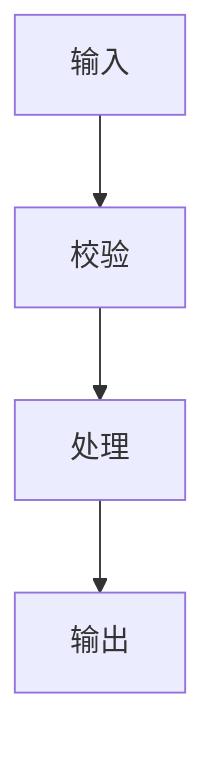
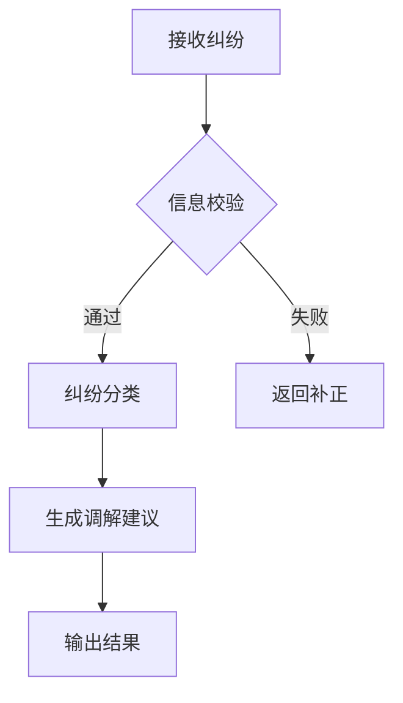

# Skill 创建 SOP

## 0 文档概述

### 0.1 SOP 目标与用途

本 SOP（Standard Operating Procedure，标准操作流程）面向 AI 开发者、产品经理及架构师，旨在为 Skill 的**从规划到落地**提供一套完整的标准操作指南。

具体而言，本 SOP 用于解决以下问题：

- **Skill 体系不清晰**：缺乏对已有 Skill 的梳理与新增 Skill 的规划，导致能力覆盖重复或遗漏。
- **Skill 生成效率低**：Skill 定义缺少统一模板，生成过程缺乏规范，产出质量参差不齐。
- **Skill 文档不规范**：缺少标准化的需求卡模板，难以快速评估 Skill 的功能范围与适用场景。

本 SOP 以**八段式模板 + 需求卡模板 + 工具清单**为载体，让开发者能够系统化地完成 Skill 全生命周期管理。

### 0.2 Skill 创建流程概览

```
┌─────────────────────────────────────────────────────────────────────────┐
│                      Skill 创建 SOP 流程                                 │
├─────────────────────────────────────────────────────────────────────────┤
│                                                                         │
│  §1 Skill清单整理                                                       │
│  ├── 1.1 已有Skills梳理                                                │
│  ├── 1.2 参考Skills映射                                               │
│  ├── 1.3 新增Skills建议                                                │
│  ├── 1.4 Skill分类体系                                                  │
│  └── 1.5 优先级建议                                                     │
│            ↓                                                            │
│  §2 生成Skill                                                           │
│  ├── 2.1 获取Workbuddy Tools                                          │
│  └── 2.2 按八段式模板生成Skill                                         │
│            ↓                                                            │
│  §3 Skill说明卡生成                                                     │
│  ├── 3.1 需求卡模板说明                                                │
│  └── 3.2 批量生成需求卡                                                │
│            ↓                                                            │
│  §4 Skill Review与修改                                                  │
│  └── 4.1 人工Review与试用                                             │
│                                                                         │
└─────────────────────────────────────────────────────────────────────────┘
```

### 0.3 术语定义

|| 术语 | 定义 |
||------|------|
| **Skill** | 可复用的 AI 技能单元，封装特定任务的目标、输入、输出与实现逻辑 |
| **MCP (Model Context Protocol)** | 模型上下文协议，用于 AI 与外部工具/数据的交互 |
| **八段式模板** | Skill 定义的标准化结构，包含名称、描述、触发场景、输入、输出、依赖、实现、脚本 |
| **需求卡** | 描述 Skill 需求的标准化文档，包含目标、场景、输入、处理逻辑、输出、成功标准 |
| **Workbuddy Tools** | 当前 AI 开发环境可调用的全部工具集合 |

---

## 1. Skill 清单整理

### 1.1 已有 Skills 梳理

**目标**：系统梳理当前工程已具备的 Skills，明确各自覆盖的功能范围与数据资产关联。

**执行步骤**：

1. 扫描 `{已有skills目录}` 下的所有 Skill 文件
2. 提取每个 Skill 的名称、描述与核心功能
3. 关联 Skill 依赖的 MCP 服务或数据资产
4. 整理输出已有 Skills 清单表

**输出格式**：

|| Skill名称 | 功能描述 | 依赖MCP/数据资产 | 版本 | 状态 |
||---------|---------|------------------|------|------|
| ... | ... | ... | ... | ... |

**参考 Prompt**：

```
{已有skills目录} 根据当前工程的MCP服务与数据资产全景以及已有Skills，结合法律领域Claude中文Skills项目（`D:\projects\github\claude-for-legal-ZH`）的参考，整理出本工程可编写的完整Skill清单，要求如下：

1. **已有Skills梳理**：先列出当前工程已具备的Skills，说明各自覆盖的功能范围与数据资产关联。
2. **参考Skills映射**：分析法律Claude中文Skills项目中包含的所有Skill模块，逐项评估其是否适用于当前工程，标注可直接复用、需适配、或不适用。
3. **新增Skills建议**：基于MCP服务能力、数据资产全景及业务需求，提出可新增的Skill列表，每个Skill需包含：
   - Skill名称与功能描述
   - 所依赖的MCP服务/数据资产
   - 预期输入输出
   - 与现有Skill的关系（补充/增强/独立）
4. **Skill分类体系**：按功能域对所有Skill（已有+新增）进行归类，如数据处理类、业务分析类、法律专项类、可视化类等，形成结构化的Skill全景图。
5. **优先级建议**：根据业务价值与实现可行性，对新增Skills进行优先级排序，分为高/中/低三档。
```

### 1.2 参考 Skills 映射

**目标**：分析参考项目中的 Skill 模块，评估其适用性。

**执行步骤**：

1. 克隆或读取参考项目 `{参考项目路径}` 的 Skills 目录
2. 逐项分析每个 Skill 的功能与实现
3. 对照当前工程的业务需求与技术栈
4. 标注复用策略：可直接复用 / 需适配 / 不适用

**标注格式**：

|| 参考Skill | 原功能描述 | 映射结论 | 适配说明 |
||----------|----------|---------|---------|
| ... | ... | ... | ... |

### 1.3 新增 Skills 建议

**目标**：基于业务需求与技术能力，提出可新增的 Skill 列表。

**每个新增 Skill 需包含**：

| 字段 | 说明 |
|------|------|
| Skill名称 | 唯一标识 |
| 功能描述 | 核心能力说明 |
| 依赖MCP/数据资产 | 所依赖的工具或数据 |
| 预期输入 | 触发 Skill 的输入参数 |
| 预期输出 | Skill 执行的输出结果 |
| 与现有Skill关系 | 补充/增强/独立 |

### 1.4 Skill 分类体系

**目标**：按功能域对所有 Skill 进行归类。

**分类维度**：

| 分类 | 说明 | 示例 |
|------|------|------|
| **数据处理类** | 数据清洗、转换、 ETL | data-import, data-export |
| **业务分析类** | 业务逻辑处理与分析 | dispute-intake, case-classify |
| **可视化类** | 图表生成、报表输出 | chart-generate, report-build |
| **自动化类** | 流程自动化、批量处理 | batch-process, workflow-auto |
| **集成类** | 外部系统对接 | api-integrate, webhook-trigger |

### 1.5 优先级建议

**评估维度**：

- **业务价值**：对核心业务的支持程度
- **实现可行性**：技术复杂度与资源需求
- **复用频率**：被其他 Skill 调用的频次

**优先级划分**：

|| 优先级 | 评估标准 | 建议Action |
||--------|---------|-----------|
| **高** | 业务价值高 + 实现可行 + 高复用 | 优先开发 |
| **中** | 业务价值中 + 实现可行 + 中复用 | 排期开发 |
| **低** | 业务价值低 / 实现复杂 / 低复用 | 暂缓或外包 |

---

## 2. 生成 Skill

### 2.1 获取 Workbuddy Tools

**目标**：完整列出当前 AI 开发环境可调用的全部工具，为 Skill 生成提供工具支持。

**执行步骤**：

1. 向 AI 发送工具清单获取 Prompt
2. 收集返回的已安装工具列表
3. 整理未安装的第三方工具
4. 形成完整的工具分类清单

**核心 Prompt**：

```
我需要编写一个自定义 skill，目标是最大化利用你的能力，包括调用你当前的全部 tools。请完整列出 workbuddy 现有的所有 tools，一个都不能遗漏；同时整理出尚未安装的第三方 tools，并将其与已安装 tools 分别归类说明，确保覆盖全部工具清单无缺失。
```

```
我需要编写一个自定义 skill，目标是最大化利用你的能力，包括调用你当前的全部 tools。请完整列出 CodeBuddy,你自身现有的所有 tools，一个都不能遗漏；同时整理出尚未安装的第三方 tools，并将其与已安装 tools 分别归类说明，确保覆盖全部工具清单无缺失。
```

```
整理一个完整的工具（Tools）列表，并为每个工具明确说明其具备的核心能力、功能用途，以及运行或调用该工具所需的前置依赖条件与资源清单。列表需覆盖所有可用工具，条目清晰、信息完整。
```

**输出格式**：

```
## 已安装 Tools

| 工具名称 | 核心能力 | 功能用途 | 依赖条件 |
|---------|---------|---------|---------|
| ... | ... | ... | ... |

## 未安装第三方 Tools

| 工具名称 | 核心能力 | 安装方式 | 依赖条件 |
|---------|---------|---------|---------|
| ... | ... | ... | ... |
```

### 2.2 按八段式模板生成 Skill

**目标**：基于 Skill 全景清单，为每个新增 Skill 编写完整定义。

**八段式模板结构**：

```markdown
## Skill-XXX: {Skill名称}

### 1. 名称
{Skill英文名称}

### 2. 描述
{Skill的中文功能描述，一段话说明其核心价值}

### 3. 触发场景
{在什么情况下会调用此Skill}

### 4. 输入参数
| 参数名 | 类型 | 必填 | 说明 |
|-------|------|-----|------|
| ... | ... | ... | ... |

### 5. 输出格式
{Skill执行的输出结果格式}

### 6. 依赖关系
- **依赖的MCP服务**：
- **依赖的其他Skills**：
- **依赖的数据资产**：

### 7. 实现逻辑
{详细的功能实现逻辑描述}

### 8. 脚本程序
```代码块
{Skill的具体实现代码或Prompt}
```
```

**执行 Prompt**：

```
{Skill全景清单与新增规划.md}  根据给定的文档内容，为本次整理出的所有新增Skill编写完整定义。沿用以下八段式模板：每个Skill需包含名称、描述、触发场景、输入参数、输出格式、依赖关系、实现逻辑以及脚本程序。在工具使用上，优先采用0.1节中已存在的工具；参考其他工具列表清单: {清单文件} ，请明确标识为新增工具，并提供该工具的内容定义与功能需求。确保每个Skill定义清晰、独立，可直接用于配置或集成，并与文档中已有内容保持一致。
```

**工具使用原则**：

1. **优先复用**：优先使用已存在的工具
2. **明确标注**：新增工具需明确标注并提供定义
3. **依赖声明**：明确 Skill 间的依赖关系

---

## 3. Skill 说明卡生成

### 3.1 需求卡模板说明

**目标**：为每个 Skill 生成标准化的需求卡，便于需求评审与团队协作。

**需求卡模板**：

```markdown
# {Skill名称} 需求卡

## 基本信息

| 字段 | 内容 |
|------|------|
| **Skill名称** | {名称} |
| **版本** | v1.0.0 |
| **创建日期** | {YYYY-MM-DD} |
| **负责人** | {创建者} |
| **状态** | 待评审 / 已通过 / 开发中 / 已上线 |

## 目标与定位

{描述Skill的核心目标与业务价值}

## 适用场景

### 触发条件
{在什么条件下触发此Skill}

### 典型用例
1. {用例1}
2. {用例2}
3. {用例3}

## 核心输入信息

| 输入项 | 类型 | 必填 | 来源 | 说明 |
|-------|------|-----|------|------|
| ... | ... | ... | ... | ... |

## 处理逻辑概要

### 流程图


### 关键步骤
1. **{步骤1}**：{说明}
2. **{步骤2}**：{说明}
3. **{步骤3}**：{说明}

## 预期输出结果

| 输出项 | 格式 | 说明 |
|-------|------|------|
| ... | ... | ... |

## 成功标准

### 功能标准
- [ ] {标准1}
- [ ] {标准2}

### 性能标准
- 响应时间 < {X}ms
- 准确率 > {X}%

### 质量标准
- 错误率 < {X}%
- 覆盖率 > {X}%

## 边界情况处理

### 信息缺失
当必填信息缺失时的处理策略：
- {策略1}
- {策略2}

### 类型超出
当输入类型超出预设分类时的应对方式：
- {策略1}
- {策略2}

### 交接机制
与人工角色交接的机制：
- {机制1}
- {机制2}

## 依赖与约束

### 依赖项
- {依赖1}
- {依赖2}

### 约束条件
- {约束1}
- {约束2}

## 评审记录

| 日期 | 评审人 | 意见 | 状态 |
|-----|-------|------|------|
| ... | ... | ... | ... |
```

### 3.2 批量生成需求卡

**目标**：以单个 Skill 需求卡为模板，批量生成所有 Skill 的需求卡。

**示例：dispute-intake Skill 需求卡**：

```markdown
# dispute-intake 需求卡

## 基本信息

| 字段 | 内容 |
|------|------|
| **Skill名称** | dispute-intake |
| **版本** | v1.0.0 |
| **创建日期** | 2026-08-05 |
| **负责人** | {负责人} |
| **状态** | 待评审 |

## 目标与定位

自动接收并处理用户提交的纠纷信息，完成信息校验、纠纷分类与初步调解建议生成，降低人工处理成本。

## 适用场景

### 触发条件
- 用户通过 Web/移动端提交纠纷表单
- 系统自动接收第三方渠道的纠纷数据
- 客服人员批量导入纠纷记录

### 典型用例
1. 用户在线提交消费纠纷投诉
2. 商家提交合同违约纠纷申诉
3. 客服批量导入历史纠纷数据

## 核心输入信息

| 输入项 | 类型 | 必填 | 来源 | 说明 |
|-------|------|-----|------|------|
| 当事人信息 | JSON | 是 | 表单/接口 | 包含姓名、联系方式、角色 |
| 纠纷类型 | Enum | 是 | 表单 | 消费/合同/侵权/其他 |
| 纠纷描述 | Text | 是 | 表单 | 纠纷详细描述 |
| 证据材料 | File[] | 否 | 上传 | 图片/文档/录音等 |
| 期望结果 | Text | 否 | 表单 | 用户期望的处理结果 |

## 处理逻辑概要

### 流程图



### 关键步骤

1. **信息校验**：验证必填字段完整性、格式合规性
2. **纠纷分类**：基于关键词与规则引擎分类至预设类型
3. **调解建议生成**：根据纠纷类型与历史案例生成初步建议
4. **结果输出**：生成案件摘要与后续步骤提示

## 预期输出结果

| 输出项 | 格式 | 说明 |
|-------|------|------|
| 案件编号 | String | 系统生成的唯一标识 |
| 案件摘要 | Text | 纠纷关键信息提炼 |
| 纠纷分类 | Enum | 分类结果 |
| 调解建议 | Text | 初步调解方向 |
| 后续步骤 | Array | 下一步操作指引 |
| 风险等级 | Enum | 高/中/低 |

## 成功标准

### 功能标准
- [ ] 100% 接收符合规范的纠纷信息
- [ ] 分类准确率 > 85%
- [ ] 生成可读的案件摘要

### 性能标准
- 响应时间 < 2s
- 单批次处理能力 > 100条

### 质量标准
- 信息完整度 > 90%
- 调解建议采纳率 > 60%

## 边界情况处理

### 信息缺失
- 必填字段缺失：返回补正提示，列出缺失字段
- 联系方式格式错误：返回规范化格式示例

### 类型超出
- 纠纷类型超出预设分类：标记为「其他」并告警人工介入

### 交接机制
- 高风险案件：自动转交人工调解员
- 72小时未处理：自动提醒与升级

## 依赖与约束

### 依赖项
- NLP 文本分析服务
- 纠纷分类规则引擎
- 历史案例知识库

### 约束条件
- 仅处理中国大陆法律管辖范围内的纠纷
- 涉及刑事案件自动转交司法机关
```

### 3.3 批量生成执行

**目标**：基于模板批量生成所有 Skill 的需求卡。

**执行 Prompt**：

```
以这份需求卡 {文件路径} 为模板，套用编写skills 下所有skill的需求卡,把{N}个SKILL需求卡按模板的完整版式单独扩写成独立文档，写入路径:{路径}。
```

**输出要求**：

1. 每个 Skill 生成独立的需求卡文件
2. 文件命名格式：`{skill-name}-requirement-card.md`
3. 保存在指定目录 `{路径}`
4. 保持模板的完整版式与所有字段

---

## 4. Skill Review 与修改

### 4.1 人工 Review 与试用

**目标**：通过人工评审与实际试用，验证 Skill 的可用性与效果。

**Review 检查清单**：

| 检查项 | 说明 | 优先级 |
|-------|------|--------|
| 功能完整性 | Skill 是否覆盖声明的所有功能 | P0 |
| 输入输出正确性 | 参数定义是否准确 | P0 |
| 依赖完整性 | 依赖的 MCP/Skill 是否可用 | P1 |
| 边界情况处理 | 异常场景是否覆盖 | P1 |
| 性能表现 | 响应时间与准确率是否达标 | P1 |
| 文档完整性 | 需求卡与实际实现是否一致 | P2 |

**试用流程**：

1. **单元测试**：验证 Skill 各模块独立功能
2. **集成测试**：验证 Skill 与其他组件的协作
3. **端到端测试**：模拟真实业务场景全流程
4. **性能测试**：验证高并发下的稳定性

**修改记录**：

每次修改需记录：
- 修改日期与修改人
- 修改内容描述
- 修改原因
- 修改前后的版本号

---

## 附录

### A. 工具清单模板

```markdown
## 已安装 Tools

| 工具名称 | 核心能力 | 功能用途 | 依赖条件 |
|---------|---------|---------|---------|
| Read | 文件读取 | 读取本地文件内容 | 文件存在 |
| Write | 文件写入 | 创建或覆盖文件 | 目录可写 |
| Grep | 文本搜索 | 在文件中搜索关键词 | 正则表达式 |
| Shell | 命令执行 | 执行系统命令 | 命令有效 |
| Glob | 路径匹配 | 按模式匹配文件 | 通配符 |

## 未安装第三方 Tools

| 工具名称 | 核心能力 | 安装方式 | 依赖条件 |
|---------|---------|---------|---------|
| playwright | 浏览器自动化 | npm install -g playwright | Node.js |
| memplace | 记忆存储 | pip install memplace | Python |
```

### B. Skill 分类参考

| 分类 | 描述 | 优先级建议 |
|------|------|-----------|
| **数据处理类** | 数据清洗、转换、 ETL | 高 |
| **业务分析类** | 业务逻辑处理与分析 | 高 |
| **可视化类** | 图表生成、报表输出 | 中 |
| **自动化类** | 流程自动化、批量处理 | 高 |
| **集成类** | 外部系统对接 | 中 |
| **安全类** | 权限校验、数据脱敏 | 高 |
| **监控类** | 性能监控、异常告警 | 中 |

### C. 参考资源

- [法律 Claude 中文 Skills 项目](https://github.com/claude-for-legal-ZH)
- [mem0 官方文档](https://docs.mem0.ai/)
- [WorkBuddy Bench Paper](https://reference/workbuddy-bench/paper)

---

> **文档版本**：v1.0.0  
> **最后更新**：2026-08-05  
> **维护团队**：AI Dev SOP Team
