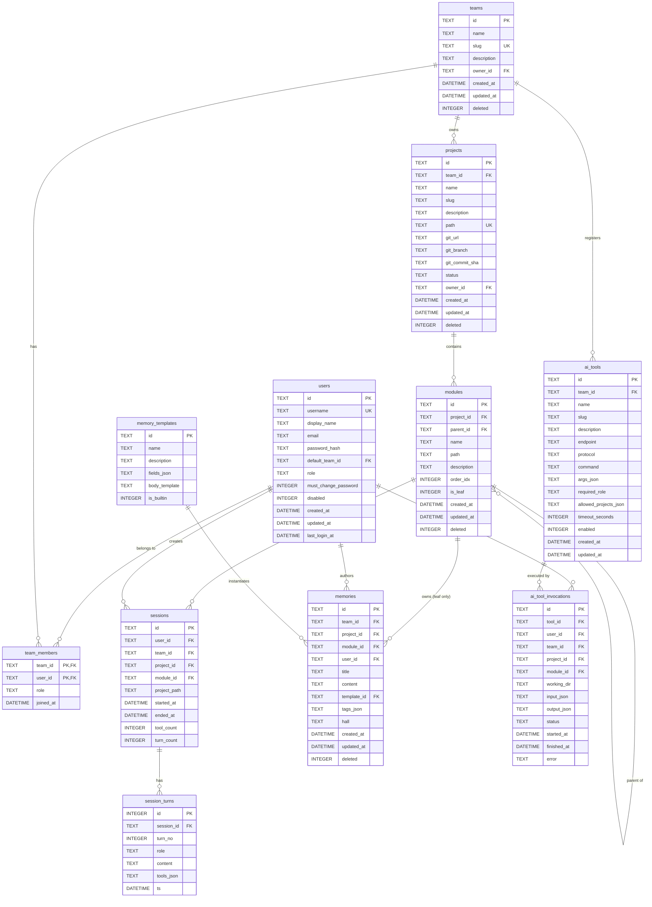

# cbmem-team v2 数据模型 ER 图

> **基于**: [cbmem-team-prd.md v2.0](../../../tools/cbmem-team/cbmem-team-prd.md)
> **版本**: v1.0
> **创建日期**: 2026-07-15

---

## 1. 全局 ER 图

```
┌──────────────────────────────────────────────────────────────────────────────┐
│                          cbmem-team v2 数据模型                              │
└──────────────────────────────────────────────────────────────────────────────┘

                              ┌──────────────────┐
                              │     users        │
                              │ ──────────────── │
                              │ id (PK)          │
                              │ username (UQ)    │
                              │ password_hash    │
                              │ role             │
                              │ default_team_id  │──┐
                              │ must_change_pwd  │  │
                              │ disabled         │  │
                              └──────┬───────────┘  │
                                     │              │
                          ┌──────────┼──────────┐   │
                          │ 1        │ 1        │ N │
                          ▼          ▼          ▼   │
                ┌────────────────┐  ┌────────────────────────────┐
                │ team_members   │  │  ai_tool_invocations       │
                │ ────────────── │  │  ────────────────────────  │
                │ team_id (FK)   │  │  user_id (FK)              │
                │ user_id (FK)   │  │  tool_id (FK)              │
                │ role           │  │  project_id (FK)           │
                │ joined_at      │  │  module_id (FK)            │
                └────────┬───────┘  │  working_dir               │
                         │ N        │  status                    │
                         │          └─────────┬──────────────────┘
                         │ 1                  │ N
                         ▼                    ▼
                  ┌─────────────┐      ┌─────────────┐
                  │   teams     │      │  ai_tools   │
                  │ ─────────── │      │ ─────────── │
                  │ id (PK)     │      │ id (PK)     │
                  │ name        │      │ team_id (FK)│
                  │ slug (UQ)   │      │ slug        │
                  │ owner_id    │      │ endpoint    │
                  └──────┬──────┘      │ required_role│
                         │ 1           │ enabled     │
                         │             └─────────────┘
                         ▼
                  ┌─────────────┐
                  │  projects   │
                  │ ─────────── │
                  │ id (PK)     │
                  │ team_id (FK)│
                  │ slug        │
                  │ path (UQ)   │
                  │ git_url     │
                  │ status      │
                  └──────┬──────┘
                         │ 1
                         │
                         ▼ N
                  ┌──────────────────┐
                  │    modules       │
                  │  ──────────────  │
                  │  id (PK)         │
                  │  project_id (FK) │
                  │  parent_id (FK)──┼──┐ (自引用)
                  │  name            │  │
                  │  is_leaf         │  │
                  └──────┬───────────┘  │
                         │ 1           │
                         │             │
                ┌────────┼────────┐    │
                │        │        │    │
                ▼ N      ▼ N      ▼ N  │
      ┌──────────────┐ ┌────────────┐ ┌────────────────┐
      │  sessions    │ │  memories  │ │ (parent loop)  │
      │ ──────────── │ │ ────────── │ │                │
      │ id (PK)      │ │ id (PK)    │ │                │
      │ module_id(FK)│ │ module_id  │ │                │
      │ user_id (FK) │ │ user_id    │ │                │
      │ project_id   │ │ template_id├──┼─┐
      │ started_at   │ │ title      │ │ │
      │ tool_count   │ │ content    │ │ │
      └──────┬───────┘ │ tags       │ │ │
             │ 1       │ hall       │ │ │
             │         └────────────┘ │ │
             ▼ N                      │ │
      ┌──────────────┐                │ │
      │ session_turns│                │ │
      │ ──────────── │                │ │
      │ id (PK)      │                │ │
      │ session_id   │                │ │
      │ turn_no      │                │ │
      │ role         │                │ │
      └──────────────┘                │ │
                                     ▼ │
                            ┌──────────────────┐
                            │ memory_templates │
                            │ ──────────────── │
                            │ id (PK)          │
                            │ name             │
                            │ fields_json      │
                            └──────────────────┘
```

---

## 2. 核心实体说明

### 2.1 users（用户）

| 属性 | 说明 |
|------|------|
| 主键 | id |
| 唯一约束 | username |
| 外键 | default_team_id → teams.id |
| 关键变更 (v2) | 新增 username、password_hash、must_change_password |

### 2.2 teams（团队）— v2 新增

| 属性 | 说明 |
|------|------|
| 主键 | id |
| 唯一约束 | slug |
| 外键 | owner_id → users.id |

### 2.3 team_members（团队成员）— v2 新增

| 属性 | 说明 |
|------|------|
| 复合主键 | (team_id, user_id) |
| 外键 | team_id → teams.id, user_id → users.id |

### 2.4 projects（项目）— v2 重构

| 属性 | 说明 |
|------|------|
| 主键 | id |
| 唯一约束 | (team_id, slug), path (全局) |
| 外键 | team_id → teams.id, owner_id → users.id |
| 关键变更 (v2) | 新增 team_id、git_url、status；删除 project_paths |

### 2.5 modules（模块树）— v2 新增

| 属性 | 说明 |
|------|------|
| 主键 | id |
| 外键 | project_id → projects.id, parent_id → modules.id (自引用) |
| 唯一约束 | (project_id, parent_id, name) |
| 关键约束 | is_leaf (用于 sessions/memories 归属校验) |

### 2.6 sessions（会话）— v2 强化归属

| 属性 | 说明 |
|------|------|
| 主键 | id |
| 外键 | user_id → users.id, team_id → teams.id, project_id → projects.id, **module_id → modules.id (NOT NULL, 叶子)** |

### 2.7 session_turns（会话轮次）

| 属性 | 说明 |
|------|------|
| 主键 | id (自增) |
| 外键 | session_id → sessions.id |

### 2.8 memory_templates（内存模板）— v2 新增

| 属性 | 说明 |
|------|------|
| 主键 | id |
| 关键说明 | 内置 5 个：ADR/lesson/snippet/runbook/decision |

### 2.9 memories（内存）— v2 强化归属

| 属性 | 说明 |
|------|------|
| 主键 | id |
| 外键 | team_id → teams.id, project_id → projects.id, **module_id → modules.id (NOT NULL, 叶子)**, user_id → users.id, template_id → memory_templates.id (可空) |

### 2.10 ai_tools（AI 工具）— v2 新增

| 属性 | 说明 |
|------|------|
| 主键 | id |
| 外键 | team_id → teams.id |
| 唯一约束 | (team_id, slug) |

### 2.11 ai_tool_invocations（AI 工具调用）— v2 新增

| 属性 | 说明 |
|------|------|
| 主键 | id |
| 外键 | tool_id → ai_tools.id, user_id → users.id, team_id → teams.id, project_id → projects.id, module_id → modules.id |

---

## 3. 关系矩阵

| 关系 | 类型 | 说明 |
|------|------|------|
| users ↔ teams | 多对多（通过 team_members） | 一个用户可在多个团队，一个团队有多个成员 |
| teams → projects | 一对多 | 一个团队有多个项目 |
| projects → modules | 一对多 | 一个项目有多个模块 |
| modules → modules | 自引用一对多 | 父模块有多个子模块 |
| modules → sessions | 一对多 | 叶子模块有多个会话 |
| modules → memories | 一对多 | 叶子模块有多个内存 |
| sessions → session_turns | 一对多 | 一个会话有多轮对话 |
| ai_tools → ai_tool_invocations | 一对多 | 一个工具被调用多次 |
| memory_templates → memories | 一对多 | 一个模板可被多个内存引用 |

---

## 4. 索引策略

### 4.1 主要索引

| 表 | 索引 | 类型 | 用途 |
|----|------|------|------|
| users | idx_users_username | UNIQUE | 登录查询 |
| users | idx_users_default_team | INDEX | 用户默认团队 |
| teams | idx_teams_slug | UNIQUE | URL 路由 |
| team_members | PK (team_id, user_id) | UNIQUE | 关系查询 |
| team_members | idx_team_members_user | INDEX | 按用户查团队 |
| projects | UNIQUE (team_id, slug) | UNIQUE | 团队内唯一 |
| projects | UNIQUE (path) | UNIQUE | 全局路径唯一 |
| projects | idx_projects_team | INDEX | 按团队查询 |
| modules | idx_modules_project | INDEX | 项目下模块查询 |
| modules | idx_modules_parent | INDEX | 子模块查询 |
| modules | UNIQUE (project_id, parent_id, name) | UNIQUE | 同级唯一 |
| sessions | idx_sessions_module | INDEX | 按模块查询 |
| sessions | idx_sessions_user | INDEX | 按用户查询 |
| sessions | idx_sessions_team | INDEX | 按团队查询 |
| sessions | idx_sessions_started | INDEX | 时间排序 |
| memories | idx_memories_module | INDEX | 按模块查询 |
| memories | idx_memories_user | INDEX | 按用户查询 |
| ai_tools | UNIQUE (team_id, slug) | UNIQUE | 团队内唯一 |
| ai_tool_invocations | idx_invocations_tool | INDEX | 按工具查询 |
| ai_tool_invocations | idx_invocations_user | INDEX | 按用户查询 |

---

## 5. 约束与级联

### 5.1 外键约束

| 外键 | ON DELETE | ON UPDATE | 说明 |
|------|-----------|-----------|------|
| users.default_team_id → teams.id | SET NULL | CASCADE | 删除团队时清空用户默认 |
| team_members.team_id → teams.id | CASCADE | CASCADE | 删除团队时清理成员 |
| team_members.user_id → users.id | CASCADE | CASCADE | 删除用户时清理成员 |
| projects.team_id → teams.id | RESTRICT | CASCADE | 有项目时禁止删除团队 |
| projects.owner_id → users.id | SET NULL | CASCADE | 用户删除时清空 owner |
| modules.project_id → projects.id | CASCADE | CASCADE | 删除项目时清理模块 |
| modules.parent_id → modules.id | CASCADE | CASCADE | 删除父模块时级联子模块 |
| sessions.user_id → users.id | RESTRICT | CASCADE | 有会话禁止删用户 |
| sessions.project_id → projects.id | RESTRICT | CASCADE | 有会话禁止删项目 |
| sessions.module_id → modules.id | RESTRICT | CASCADE | 有会话禁止删模块 |
| memories.module_id → modules.id | RESTRICT | CASCADE | 有内存禁止删模块 |
| ai_tools.team_id → teams.id | CASCADE | CASCADE | 删除团队清理工具 |
| ai_tool_invocations.tool_id → ai_tools.id | RESTRICT | CASCADE | 有调用记录禁止删工具 |

### 5.2 CHECK 约束

| 表 | 约束 | 说明 |
|----|------|------|
| users | CHECK (role IN ('admin', 'lead', 'developer', 'viewer')) | 角色枚举 |
| users | CHECK (must_change_password IN (0, 1)) | 布尔值 |
| users | CHECK (disabled IN (0, 1)) | 布尔值 |
| projects | CHECK (status IN ('cloning', 'indexing', 'ready', 'error')) | 状态枚举 |
| modules | CHECK (is_leaf IN (0, 1)) | 是否叶子 |
| modules | CHECK (parent_id != id) | 防止自引用 |
| sessions | CHECK (tool_count >= 0) | 非负 |
| ai_tool_invocations | CHECK (status IN ('pending', 'running', 'success', 'error', 'timeout')) | 状态枚举 |

---

## 6. 业务规则（应用层）

### 6.1 叶子模块维护

```sql
-- 创建模块时
-- 1. 若指定 parent_id，父模块 is_leaf 自动变 0
-- 2. 新模块默认 is_leaf=1

-- 删除模块时
-- 1. 若有子模块，禁止删除（除非指定 force=true 级联）
-- 2. 若强制级联，子模块递归删除
-- 3. 删除叶子模块后，父模块若有其他子模块则 is_leaf 仍为 0；若无则 is_leaf 变 1
```

### 6.2 会话/内存的叶子校验

```sql
-- 写入 sessions/memories 前
-- 1. 检查 modules.is_leaf = 1
-- 2. 否则返回 422 错误
```

### 6.3 模块树防环

```sql
-- 移动模块到新 parent 前
-- 1. 检查 new_parent_id 不是当前模块的子孙
-- 2. 递归向上遍历 new_parent 的所有祖先
-- 3. 若命中 current_module.id，禁止移动
```

### 6.4 AI 工具 RBAC

```sql
-- 调用 ai_tools 前
-- 1. 用户角色 ≥ tool.required_role
-- 2. 若 tool.allowed_projects 不为空，project_id 必须在其内
-- 3. 若不满足，返回 403
```

---

## 7. ER 图（Mermaid 格式）



---

## 8. 关键设计决策

### 8.1 为什么用团队作为顶层容器？

- 简化项目归属：以前 projects.user_id 是单用户，扩展困难
- 支持多团队协作：跨团队复用组件
- RBAC 清晰：团队内角色 vs 跨团队

### 8.2 为什么会话/内存必须归属叶子模块？

- 业务清晰：会话主题是"具体功能点"，模块树表达"从粗到细"
- 搜索高效：叶子节点数远少于中间节点
- 权限清晰：叶子 = 具体的代码/工作区

### 8.3 为什么 is_leaf 用冗余字段？

- 性能：避免每次会话/内存写入时递归查询父模块
- 简单：删除/创建模块时同步更新
- 一致性：通过事务保证

### 8.4 为什么 projects.path 全局唯一？

- 简化：避免路径冲突
- 安全：白名单不再需要
- 存储：单一物理路径映射

### 8.5 为什么 ai_tools.team_id 不允许为 NULL？

- 强制归属：避免全局工具污染
- 计费/配额：可按团队统计

---

## 9. 数据量估算（参考）

| 表 | 初期 | 6 个月 | 12 个月 |
|----|------|--------|---------|
| users | 20 | 50 | 100 |
| teams | 3 | 10 | 20 |
| projects | 10 | 50 | 100 |
| modules | 50 | 300 | 800 |
| sessions | 1K | 50K | 200K |
| session_turns | 50K | 2M | 10M |
| memories | 200 | 2K | 10K |
| ai_tools | 10 | 30 | 50 |
| ai_tool_invocations | 500 | 20K | 100K |

**性能建议**：
- sessions 和 session_turns 是最大的表，建议定期归档
- ai_tool_invocations 同上
- memories 应建立全文索引（如 FTS5）

---

## 10. 相关文档

| 文档 | 路径 |
|------|------|
| PRD v2 | `tools/cbmem-team/cbmem-team-prd.md` |
| MVP 实施计划 | `docs/superpowers/plans/2026-07-15-cbmem-team-mvp-implementation.md` |
| 设计 Spec | `docs/superpowers/specs/2026-07-14-dual-track-memory-tools-best-practices-design.md` |

---

**文档版本**: v1.0
**最后更新**: 2026-07-15